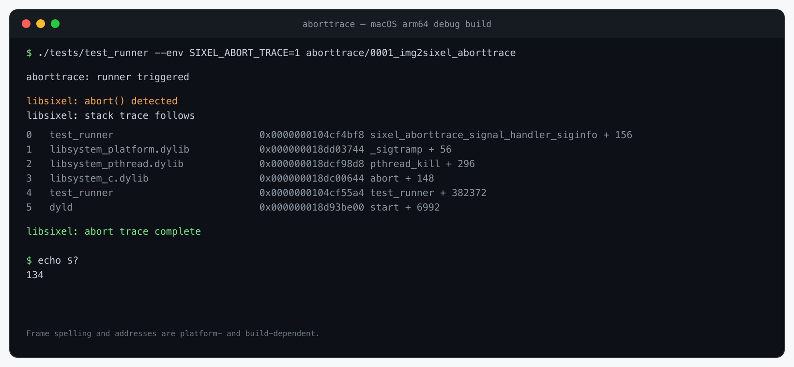

# CLI Abort Trace Diagnostics

## Scope

This document defines the abort-trace behavior provided by the repository's standalone CLI-program layer. It covers the purpose of the facility, its current consumers, runtime and build controls, platform-specific behavior, diagnostic quality, performance and user-experience tradeoffs, and its relationship to comparable crash-reporting facilities.

Abort tracing is a CLI diagnostic facility, not a feature of the `liblibsixel` runtime API, a general signal logger, or a replacement for a debugger, sanitizer report, or core dump. The broader option and diagnostic conventions are defined by the [CLI design policy](design-policy.md).

## Ownership and current consumers

The repository's CLI-program layer includes the converters under [`converters/`](../../converters/) and the image-quality assessment program implemented by [`assessment/lsqa.c`](../../assessment/lsqa.c). Aborttrace belongs conceptually to that executable layer: its implementation is [`converters/aborttrace.c`](../../converters/aborttrace.c), it is compiled into selected programs, and it is not exported by the installed library headers or linked into `liblibsixel` as a library service.

The current consumers are specifically `img2sixel` and `sixel2png`. Both call `sixel_aborttrace_install_if_unhandled()` after resolving their CLI diagnostics policy. `lsqa` is a neighboring CLI program, but it does not currently compile, link, install, or expose aborttrace. Extending the facility to `lsqa` would therefore be a separate executable-level feature change requiring controls and tests; the shared CLI-layer ownership must not be read as a claim that every CLI already enables it.

The setting is registered in internal `src/` option infrastructure so the two converters share parsing, environment, and precedence behavior. That implementation reuse does not make aborttrace part of image encoding, image decoding, quality assessment, or the public library contract.

## Purpose and design boundary

An `abort()` commonly terminates a converter after the process has lost the opportunity to return a normal libsixel status. Without a debugger, sanitizer, or configured core-dump collector, a bug report may then contain only an exit status. Abort tracing preserves a small amount of immediate failure context by writing the aborting thread's stack to standard error before termination.

The handler is intentionally narrow:

- it is installed only after command-line options have been parsed, so the per-invocation diagnostics policy can control installation;
- it handles `SIGABRT` only and does not intercept `SIGSEGV`, `SIGBUS`, `SIGILL`, ordinary conversion failures, or normal nonzero exits;
- it cannot distinguish `abort()` from another source of `SIGABRT`;
- it installs only while `SIGABRT` has its default disposition, preserving a handler already owned by a sanitizer, fuzzer, debugger integration, embedding environment, or another component;
- it captures at most 64 frames from the thread that receives the signal; and
- on POSIX platforms it restores the default disposition and raises `SIGABRT` again after printing, retaining the normal signal-termination and core-dump path.

Before printing the trace, the handler makes a best-effort attempt to restore terminal descriptors left in cbreak mode and to show a cursor hidden by animation output. This recovery improves the interactive shell experience after a crash, but it cannot be guaranteed from an already-failing process.

## User controls

Abort tracing is enabled by default when it was included in the build. A command-line value takes precedence over `SIXEL_ABORT_TRACE`.

| Layer | Enable | Disable | Notes |
| --- | --- | --- | --- |
| Runtime environment | `SIXEL_ABORT_TRACE=1` | `SIXEL_ABORT_TRACE=0` | Unset, empty, and invalid values retain the enabled default. |
| `img2sixel` or `sixel2png` diagnostics policy | `-x human:abort_trace=1` or `-x human:A1` | `-x human:abort_trace=0` or `-x human:A0` | The long and compact forms are equivalent; the command-line value overrides the environment. |
| Autotools build | `./configure --enable-abort-trace` | `./configure --disable-abort-trace` | The default is `auto`. |
| Meson build | `meson setup build -Dabort_trace=enabled` | `meson setup build -Dabort_trace=disabled` | The default is `auto`. |

For example, a user who wants clean standard error for one scripted conversion can run:

```sh
SIXEL_ABORT_TRACE=0 img2sixel input.png >output.six
```

The equivalent per-command diagnostics suboption is:

```sh
img2sixel -x human:A0 input.png >output.six
```

Enabling the runtime policy cannot add the feature to a build that omitted it. It likewise does not override an existing `SIGABRT` handler.

## Diagnostic output and failure semantics

The trace is written to standard error so SIXEL or PNG data on standard output remains unmodified. A successful trace is delimited by stable `libsixel:` messages; the frame lines between them are platform-dependent:

```text
libsixel: abort() detected
libsixel: stack trace follows
<platform-dependent frame lines>
libsixel: abort trace complete
```

The start and completion lines help users and tests distinguish a complete trace from output cut short by a second fault, deadlock, closed descriptor, or forced process termination. Frame text is not a stable machine-readable format: it may contain function names, module paths, offsets, raw addresses, or only an availability message.

On POSIX systems the second `SIGABRT` is delivered with the default disposition. Shells and supervisors should therefore continue to observe signal termination rather than a new CLI-specific exit code, subject to the host operating system's normal signal and core-dump configuration.

### Representative terminal output



This capture was produced by the intentional-abort test runner, which installs the same `converters/aborttrace.c` helper used by the converter executables and then calls `abort()`. It demonstrates the stable delimiters and the kind of native frames a symbolized build can emit; addresses, frame count, module names, symbol names, and shell termination text vary by build and platform.

## Build and platform behavior

The complete build-option inventory is in [`build.md`](../../build.md), and the environments represented in continuous integration are listed in [build, runtime, and platform support](../platform-support.md).

### POSIX-family targets

When abort tracing is enabled, configuration probes for the `execinfo` interfaces `backtrace()` and `backtrace_symbols_fd()` and links `libexecinfo` when the platform supplies those interfaces in a separate library. If stack capture exists but `backtrace_symbols_fd()` does not, the CLI helper prints raw frame addresses. If `backtrace()` is unavailable, the handler still emits its delimiters and an availability message rather than pretending that symbolic frames were captured.

The handler uses `sigaction()`. glibc, Darwin, and Android/Bionic builds use the `SA_SIGINFO` form when the selected headers expose it; other POSIX implementations use the simpler `sa_handler` form. The signal metadata is accepted to use the platform interface but is not currently included in the user-facing output.

Cygwin follows the POSIX path rather than the native Windows path. Haiku and BSD-family portability depends on the detected `execinfo` interfaces and signal structure exposed by the selected headers and compiler.

### Emscripten and native Windows targets

Autotools and Meson disable abort tracing in `auto` mode for Emscripten and native Windows targets. Explicitly requesting it is a configuration error. The current build contract therefore does not promise abort traces for WebAssembly or native Windows executables, even though the source retains platform scaffolding for future work.

Intentional abort tests are also skipped under Wine because that execution path can hang, and trace-output tests are skipped in ThreadSanitizer builds because the sanitizer can suppress or own the relevant crash path. These skips qualify the test evidence; they do not convert a skipped environment into a supported implementation.

### Symbol and unwind quality

The trace is only as complete as the compiler, linker, executable, shared libraries, and platform unwinder allow. Inlining, tail-call optimization, frame-pointer elimination, stripped symbols, and missing dynamic-symbol exports can remove frames or names. The [GNU C Library backtrace documentation](https://sourceware.org/glibc/manual/latest/html_node/Backtraces.html) specifically notes these optimization effects and the possible need for linker flags such as `-rdynamic` to make function names available.

A release build may therefore print addresses where a debug build prints names. Keep the exact executable and matching debug symbols when investigating a report. A core dump plus a debugger remains the stronger artifact when local variables, registers, memory, multiple threads, or reliable offline symbolication are required.

## Performance and output quality

On a normal run of a consumer CLI, the feature performs diagnostics-policy resolution, checks the current `SIGABRT` disposition, and installs one handler. It does not walk the stack, symbolize frames, or enter the image loader, quantizer, palette application, encoder, or decoder hot paths. Consequently there is no per-pixel or per-frame abort-trace cost. Programs that do not compile and install the helper, including the current `lsqa`, have no aborttrace runtime cost. The enabled build does add the handler code and may add an `execinfo` link dependency to each consumer executable; it does not add this code to the public library contract, and this document does not promise a fixed binary-size increment because toolchains and link modes differ.

The expensive work is deferred until the process is already aborting: unwinding, optional symbol lookup, and writing as many as 64 frames can delay final termination and enlarge captured logs. This is an observability-versus-crash-latency tradeoff, not a conversion-throughput tradeoff.

Abort-trace policy does not intentionally transform image data or change codec decisions. The regression coverage verifies that a command-line disable overriding an enabled environment and an environment-level disable produce byte-identical SIXEL output, and that the result retains the repository's `MS-SSIM:0.98` quality floor. This evidence covers policy routing without claiming that a crash trace itself is a quality metric.

## Reliability, safety, and user experience

The main benefit is immediacy: a user can attach useful call-chain context to a bug report without first reproducing under a debugger. Keeping diagnostics on standard error protects pipeline output, respecting an existing signal owner avoids duplicate or conflicting reports, and restoring terminal state reduces the chance of leaving an interactive shell without echo or with a hidden cursor.

The handler is nevertheless best-effort. POSIX `backtrace()` is not async-signal-safe, and symbolization or runtime-loader state can be inconsistent at the point of failure. The implementation deliberately accepts this risk only after an otherwise unhandled abort; a missing completion marker means the trace must be treated as incomplete. Do not use aborttrace as proof that all frames were captured or that the earliest printed frame is the root cause.

Stack traces can expose function names, executable or library paths, load addresses, and application structure. Review or redact the output before posting it publicly when those details are sensitive, or disable the feature for processes whose standard error is collected into a less trusted log destination. For a suspected security vulnerability, follow [`SECURITY.md`](../../SECURITY.md) and use private reporting even if aborttrace produced a useful stack.

## Comparable facilities in other software

The following systems illustrate nearby design choices; they are comparisons, not claims of implementation lineage.

| Facility | Similarity | Important difference from the converter aborttrace |
| --- | --- | --- |
| [GNU C Library `backtrace()` and `backtrace_symbols_fd()`](https://sourceware.org/glibc/manual/latest/html_node/Backtraces.html) | These are the low-level in-process capture and file-descriptor output primitives used when detected on compatible targets. | glibc provides primitives rather than the converters' CLI policy, signal ownership rule, terminal recovery, and output delimiters. |
| [Go `GOTRACEBACK`](https://pkg.go.dev/runtime#hdr-Environment_Variables) | An environment setting controls how much failure-time stack information the runtime prints and can request an OS crash for a core dump. | The Go runtime understands goroutines and runtime frames and offers several detail levels; aborttrace captures only the receiving native thread and exposes an on/off policy. |
| [Rust standard-library backtraces](https://doc.rust-lang.org/std/backtrace/index.html) | `RUST_BACKTRACE` and `RUST_LIB_BACKTRACE` let deployments trade diagnostic capture against runtime cost. | Rust backtrace capture is integrated with Rust's panic and library facilities and is disabled by default for `Backtrace::capture`; the converter helper installs a narrow `SIGABRT` handler by default but performs the costly capture only after abort. |
| [systemd coredump handling](https://systemd.io/COREDUMP/) | It can retain crash metadata, a stack trace, and a core for later inspection. | It is an operating-system service outside the crashing process and can preserve a far richer, durable artifact. The converter aborttrace is immediate, process-local, portable to non-systemd POSIX environments, and complementary rather than a replacement. |

These comparisons locate the intended niche: aborttrace supplies a small default diagnostic in the CLI executables that adopt it, while runtime-aware language facilities, sanitizers, debuggers, and system crash collectors remain responsible for deeper analysis.

## Implementation map

- [`converters/aborttrace.c`](../../converters/aborttrace.c) owns signal disposition checks, installation, frame output, and post-trace termination.
- [`src/options-registry.c`](../../src/options-registry.c) owns the default-enabled boolean policy, environment binding, and CLI precedence.
- [`converters/img2sixel.c`](../../converters/img2sixel.c) and [`converters/sixel2png.c`](../../converters/sixel2png.c) apply the policy after parsing their options.
- [`src/tty.c`](../../src/tty.c) owns best-effort cbreak and cursor restoration used by the abort handler.
- [`configure.ac`](../../configure.ac), [`meson.build`](../../meson.build), and [`meson_options.txt`](../../meson_options.txt) own feature selection and platform probing.

`assessment/lsqa.c` is intentionally absent from this implementation map because it is not a current consumer.

## Test coverage

<!-- test-coverage: enforced -->

| ID | Contract | Owning test |
| --- | --- | --- |
| ABT-01 | An enabled build emits the abort-detected and trace-complete delimiters around an intentional `SIGABRT` path. | [tests/cli/aborttrace/0001_img2sixel_aborttrace.t](../../tests/cli/aborttrace/0001_img2sixel_aborttrace.t) |
| ABT-02 | `SIXEL_ABORT_TRACE=0` disables trace installation and output. | [tests/cli/aborttrace/0002_aborttrace_zero_disables.t](../../tests/cli/aborttrace/0002_aborttrace_zero_disables.t) |
| ABT-03 | An empty `SIXEL_ABORT_TRACE` value retains the enabled default. | [tests/cli/aborttrace/0003_aborttrace_empty_enables.t](../../tests/cli/aborttrace/0003_aborttrace_empty_enables.t) |
| ABT-04 | An invalid `SIXEL_ABORT_TRACE` value retains the enabled default. | [tests/cli/aborttrace/0004_aborttrace_invalid_enables.t](../../tests/cli/aborttrace/0004_aborttrace_invalid_enables.t) |
| ABT-05 | `img2sixel` applies the diagnostics suboption after parsing, the CLI disable overrides an enabled environment, and the disabled policy paths preserve equivalent SIXEL output and the quality floor. | [tests/cli/options/regression/0156_diagnostics_abort_trace_image_regression.t](../../tests/cli/options/regression/0156_diagnostics_abort_trace_image_regression.t) |
| ABT-06 | `sixel2png` applies the diagnostics suboption after parsing and passes the resolved disable value to the aborttrace consumer. | [tests/cli/sixel2png/0010_abort_trace_option.t](../../tests/cli/sixel2png/0010_abort_trace_option.t) |
| ABT-07 | The typed diagnostics registry keeps the public `abort_trace` key, compact `A` form, environment binding, help, manuals, completion, and consumer trace contract synchronized. | [tests/_static/sh/staticcheck-suboption-registry.sh](../../tests/_static/sh/staticcheck-suboption-registry.sh) |

### Coverage boundary

The intentional-abort tests verify delimiters rather than platform-dependent frame spelling or symbol fidelity. They skip builds that omit abort tracing and environments where ThreadSanitizer or Wine makes the intentional crash path unsuitable. The suite does not automate core-dump policy, debugger symbolication, async-signal failure modes, terminal restoration during a real abort, Emscripten and native Windows configuration rejection, or performance and binary-size measurement; those properties depend on host policy or toolchain details and must be inspected in the relevant environment.
