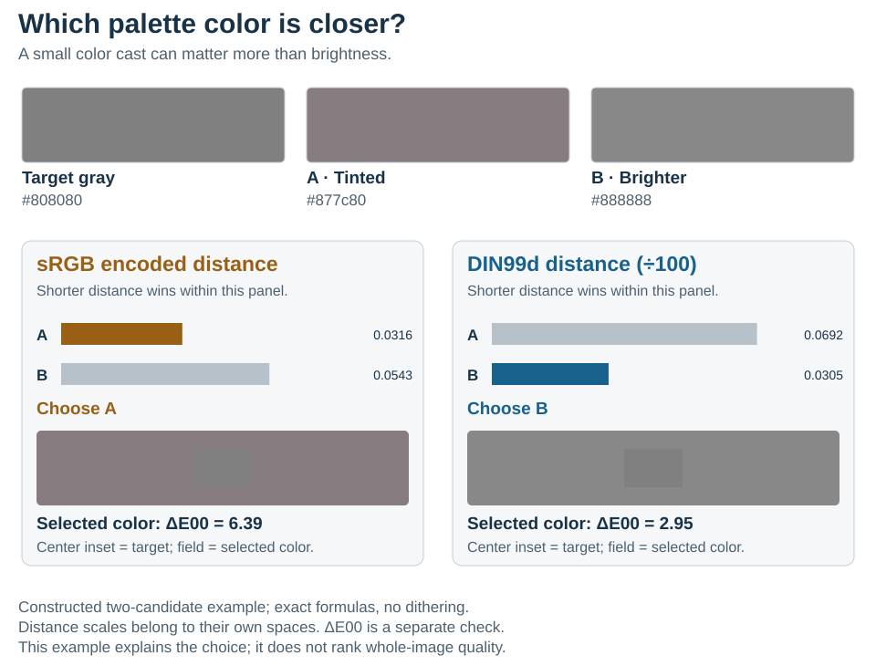
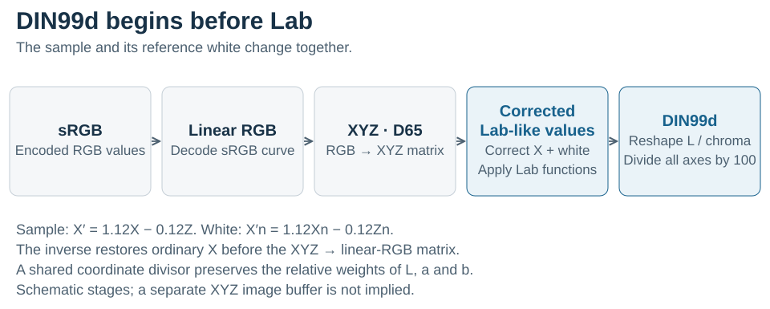

# DIN99d: using distance to compare colors

DIN99d is designed so that ordinary three-dimensional distance follows perceived color difference more closely than uncorrected RGB distance. This is useful when a palette algorithm must repeatedly decide which colors are close: clustering samples into representative colors, choosing a palette entry for a pixel, or comparing nearby candidate palette tones. It does not replace linear RGB for adding light or compositing a foreground over a background; see [color conversion hubs and lazy processing](colorspace.md#linear-rgb-and-xyz-as-conversion-hubs).

## A nearest-color decision you can see

<picture>
  <source media="(max-width: 640px)" srcset="din99d-figures/nearest-color-mobile.svg">
  
</picture>

The target is neutral gray. Candidate A changes fewer RGB code values overall, so encoded sRGB Euclidean distance selects it, even though it introduces a visible color cast. Candidate B preserves neutrality but is slightly brighter. DIN99d selects B; a separate CIEDE2000 calculation also assigns B the smaller color error. The center inset repeats the target, making the selected color's cast or brightness change easier to compare on your display.

This is a constructed two-candidate example using exact formulas. It explains the value of the distance model; it is not a claim that DIN99d wins for every color pair or image. The swatches precede SIXEL's percentage rounding, and no dithering is applied. The distance numbers belong to their respective coordinate systems and should only be compared within a panel.

## Why this helps palette algorithms

A color space supplies coordinates. A color-difference formula supplies a distance between a pair of colors. CIEDE2000 is a pairwise formula on CIELAB values; it is not a three-axis space whose ordinary Euclidean distances reproduce that formula. DIN99d instead reshapes coordinates so that Euclidean distance itself is useful for perceptual comparisons. This lets geometric algorithms use vector sums, centroids, squared distances, and spatial indexes without evaluating CIEDE2000 at every comparison.

Cui, Luo, Rigg, Roesler, and Witt developed DIN99d as a refinement of DIN99 for small color differences, including a correction in the blue region. Their coordinate transform adjusts XYZ before a Lab-like stage and then reshapes lightness and chroma. Its design objective is color-difference agreement, not preservation of image structure, compression ratio, or the physical addition of light. See their [2002 paper and equation (5)](https://doi.org/10.1002/col.10066).

In libsixel, two independently selectable stages can use this geometry:

| Stage | Explicit example | What changes |
| --- | --- | --- |
| Palette construction | `-Xdin99d -Wgamma` | Samples enter DIN99d before binning and clustering; the generated palette returns to gamma RGB for application. |
| Palette application | `-Xgamma -Wdin99d` | Palette construction stays in gamma RGB; pixel lookup and any error diffusion use DIN99d coordinates. |
| Both stages | `-Xdin99d -Wdin99d` | Construction and application use the same perceptual coordinates. |

Set both options when isolating a stage: a lone `-W` can also resolve the clustering space when `-X` was not explicit. DIN99d processing uses typed float32 coordinates. `-Ugamma` controls conversion of the final palette entries to the output RGB representation; it does not redo pixel assignments. These conversions happen at the relevant processing boundaries, as explained in the [encoding pipeline](colorspace.md#end-to-end-pipeline).

## Coordinates and normalization

<picture>
  <source media="(max-width: 640px)" srcset="din99d-figures/conversion-route-mobile.svg">
  
</picture>

For sRGB input, the conversion first decodes the sRGB transfer function and maps linear RGB to D65 XYZ. DIN99d then uses the corrected coordinate $X' = 1.12X - 0.12Z$. The reference white must undergo the same correction, $X'_n = 1.12X_n - 0.12Z_n$, before the Lab-like formulas. Applying only the later lightness/chroma transform to ordinary CIELAB omits this part of DIN99d. The inverse restores ordinary X before the XYZ-to-linear-RGB matrix. [White points and primaries](colorspace.md#primaries-white-point-and-transfer-function) explain what defines that RGB/XYZ boundary.

For its float32 working format, libsixel stores all three native DIN99d coordinates with one common divisor:

$$
(L,a,b)_{\mathrm{stored}} = (L_{99d},a_{99d},b_{99d}) / 100.
$$

The common divisor scales native Euclidean distances by 1/100. It changes the numeric scale but preserves relative axis weights and nearest-color ordering. Storage bounds remain $L\in[0,1]$ and $a,b\in[-1,1]$; these bounds do not mean that every in-gamut color fills the entire available range.

Dividing lightness by 100 and the two color axes by 50 would have a different effect: unweighted squared distance would count each chromatic difference four times as strongly relative to lightness. Bringing channels into convenient storage ranges is not sufficient justification for that metric change. The current implementation therefore uses the common divisor for both forward and inverse conversion.

The public conversion helper's byte output then packs normalized lightness from `[0,1]` and opponent values from `[-1,1]` into `[0,255]`; raw packed bytes are not native DIN99d coordinates.

A policy such as [palette snap](../functionality/snap-policy.md#nearest) or [Ward merge](../functionality/merge-policy.md) can then explicitly reweight lightness through `channel_l`; that policy choice is separate from coordinate normalization.

### Compatibility with earlier DIN99d values

Revisions before `c26da16e7` omitted the XYZ correction and divided the color axes by 50. Their coordinates and distance geometry were not the current DIN99d representation. Recreate persisted DIN99d buffers or palette values from their original RGB/XYZ data; old values cannot be made current merely by attaching the same format tag. Generated palettes, nearest-color choices, diffusion, and snap decisions can change even with the same command line. This correction does not change the SIXEL wire format.

The [conversion implementation](../../src/colorspace.c) and [focused conversion tests](../../tests/processing/colorspace/) cover independent forward values, inverse values, and byte packing. An independent reference in the figure generator also checks both samples in the paper's appendix; a round trip alone would not detect matching errors in both conversion directions.

## What the image measurements show

The corrected implementation was measured on `images/snake.png` (600 × 450), with float32, exact lookup, one CPU thread, full-frame sampling, seeded K-means, six-bit hard binning, no merge, cover off, and no dithering. These examples change only the indicated stage relative to gamma/gamma within each measurement family:

| Use case | Clustering / working | MS-SSIM ↑ | Mean ΔE00 ↓ | SIXEL bytes | Median time |
| --- | --- | ---: | ---: | ---: | ---: |
| 8-color palette, reference | gamma / gamma | 0.872289 | 5.575620 | 37,306 | 48.10 ms |
| 8-color palette, perceptual construction | DIN99d / gamma | 0.908985 | 5.214225 | 39,678 | 66.97 ms |
| 256-color palette, reference | gamma / gamma | 0.991358 | 1.871517 | 255,299 | 215.41 ms |
| 256-color palette, perceptual lookup | gamma / DIN99d | 0.988698 | 1.635661 | 254,625 | 256.17 ms |

At eight colors, DIN99d construction improves both reported quality metrics against gamma in this fixture, with more bytes and time. At 256 colors, DIN99d lookup reduces mean color error by about 12.6%, with a small decrease in structural similarity and about 18.9% more time. These are distinct controlled comparisons: the first pair comes from the nine-run clustering suite, the second from the seven-run working-space suite; both use two warmups. Compare times within each pair.


The full working-space curves show the limits of that benefit. DIN99d has the lowest mean ΔE00 at 128 and 256 colors without dithering, while Oklab has higher MS-SSIM at those points. With Floyd--Steinberg, gamma has the lowest mean ΔE00 at every measured palette size and Oklab leads MS-SSIM. Error diffusion changes later pixels as well as the current nearest-color decision.

The [clustering comparison](../functionality/clustering-colorspace.md), [working-space comparison](../functionality/working-colorspace.md), and [precision study](../functionality/precision.md) include the corrected transform and common scale. The [snap-policy study](../functionality/snap-policy.md) compares fixed-point rounding and its quality, size, and runtime effects. Their complete tables retain the other spaces and all measured configurations. The separate [hard-binning study](../functionality/clustering-colorspace.md#measured-point-sufficiency) also matters: changing coordinates changes occupied grid cells, so a fixed bin depth does not isolate perceptual geometry alone.

Use the result that matches the operation you care about. For selecting a nearby palette color, lower color error can justify DIN99d. For a dithered image, also check spatial quality and grain. For production use, include runtime and SIXEL size. Re-measure representative content before choosing a default.

## Reproducing the example

The checked-in SVGs are generated, accessible static assets with separate wide and mobile layouts. Their RGB inputs, computed coordinates, distances, CIEDE2000 values, and reference checks are recorded in [figures.json](din99d-figures/figures.json). The generator requires Python 3, NumPy, and Pillow; these are optional documentation dependencies.

```sh
python3 tools/plot_din99d_figures.py
python3 tools/plot_din99d_figures.py --check
```

The generator computes exact cube roots; the library's Lab helper uses an interpolated lookup table, so small numeric differences are expected. The image benchmarks execute the built library and assess the decoded SIXEL stream with `lsqa`; they do not substitute the analytical example for measured output.
