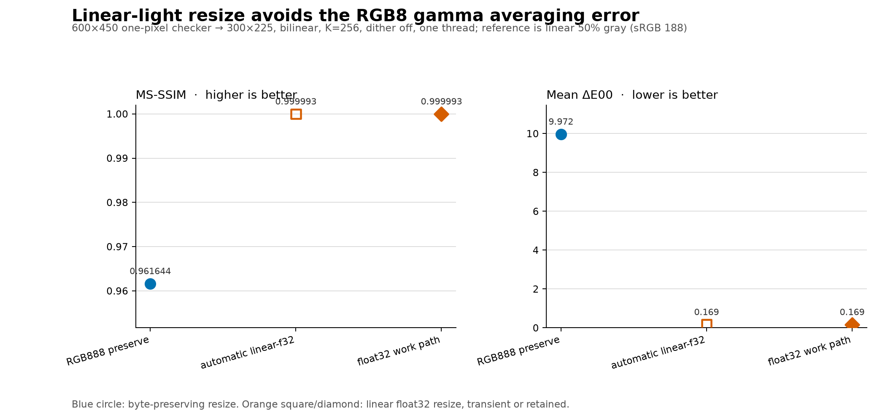

# Pixel-Format Precision

Pixel-format precision describes how a decoded or intermediate color sample is stored. It is distinct from the color space that gives the sample meaning, the number of colors in the final palette, and the number of palette indices used by a packed pixel format. In libsixel, the important encoder distinction is between three unsigned 8-bit channels (`rgb888`) and three float32 channels (`rgb-f32` or a color-space-specific float format).

This document explains the storage contract and the operations that can promote a nominally 8-bit pipeline to float32. The broader effect of `--precision` on quantization, dithering, lookup, speed, and SIXEL size is measured in [Encoder working precision](../functionality/precision.md). The interpretation of gamma, linear RGB, Oklab, CIELAB, DIN99d, and ICC profiles is defined in [Color spaces and loader color management](colorspace.md).

## Storage and meaning are separate

`RGB888` stores red, green, and blue as integers from 0 through 255. It occupies three bytes per pixel, before stride, alignment, ownership metadata, and any concurrent buffers are counted. The name means 8 bits per channel, not 8 bits per complete pixel.

The float32 family stores three 32-bit floating-point channels and therefore occupies twelve bytes per pixel under the same simplifying assumptions. The format name also identifies the coordinates:

| Pixel format | Storage | Color-space interpretation |
| --- | --- | --- |
| `RGB888` | 3 x unsigned 8-bit | gamma-encoded sRGB |
| `RGBFLOAT32` (`rgb-f32` in planner diagnostics) | 3 x float32 | gamma-encoded sRGB |
| `LINEARRGBFLOAT32` (`linear-f32`) | 3 x float32 | linear-light sRGB primaries |
| `OKLABFLOAT32` (`oklab-f32`) | 3 x float32 | Oklab |
| `CIELABFLOAT32` (`cielab-f32`) | 3 x float32 | CIELAB |
| `DIN99DFLOAT32` (`din99d-f32`) | 3 x float32 | DIN99d |

A float32 value is not automatically linear light, and an 8-bit triplet cannot be reinterpreted as Oklab merely by changing a label. Every conversion must know both the source and destination color spaces. Palette-index formats such as `PAL8` describe index storage rather than color-sample precision and belong to the separate [pixel-format and alpha contract](pixelformat.md).

For a normalized encoded channel `x`, the byte boundary applies approximately

```text
q8(x) = round(255 * clamp(x, 0, 1)) / 255
```

so one crossing has at most `1 / 510` encoded-coordinate rounding error before clipping. The error is not uniform in linear light because the sRGB transfer curve is nonlinear. A normal float32 value carries 24 bits of significand precision, but this does not guarantee a 24-bit-accurate final color: transform approximations, clipping, palette reduction, 101-level SIXEL palette serialization, lookup, and dithering impose separate errors. The practical advantage is that intermediate transforms can retain far more information and avoid repeated byte quantization until a boundary that truly requires it.

## Requested precision is not an upper bound

`--precision=8bit` requests the gamma `RGB888` base path. It is a preference for the lowest sufficient representation, not a prohibition on float32 intermediates. An operation whose mathematical domain requires linear RGB or a Lab-family space promotes the relevant part of the pipeline instead of rounding those coordinates into an undefined byte format.

`--precision=float32` requests gamma `RGBFLOAT32` for the main encoder work buffer. It does not imply that the loader must decode every source directly to float32, so a planner report can legitimately show `source=rgb888 work=rgb-f32`. Conversion at the boundary is explicit.

The following simplified flow shows the independently typed boundaries:

```text
encoded image
    |
    v
loader decode -- optional ICC/CMS transform --> source frame
    |
    v
optional pre-resize conversion --> resize --> optional post-resize conversion
    |
    v
working frame --> sampling/binning --> clustering-space palette view
    |
    v
palette application/dither --> output-space conversion --> SIXEL palette + indices
```

The `source`, resize input/output, main `work`, and clustering palette view need not share one format. Reporting only the command-line request loses information about the path that actually ran.

For why linear RGB is needed and when the planner inserts or skips conversions, see [Lazy conversion at operation boundaries](colorspace.md#lazy-conversion-at-operation-boundaries). A mathematical linear RGB or XYZ intermediate can exist inside a single-pixel transform without allocating a separate image buffer; precision promotion describes the storage that a processing stage actually requires.

## Operations that promote to float32

### Linear-light resize

The normal filtered-resize path converts a gamma byte source to `LINEARRGBFLOAT32`, resamples linear-light values, and converts to the requested working format afterward. With `--precision=8bit -Wgamma`, the float buffer is transient: planner diagnostics report `source=rgb888 work=rgb888 scale_out=linear-f32`. This is an implicit high-precision operation even though the main work buffer remains byte-based.

`-j auto:resize_precision=preserve` explicitly keeps an integer source in `RGB888` while resizing. It reduces the storage of each affected RGB buffer from twelve to three bytes per pixel, but interpolation then averages gamma-encoded values rather than light. This mode is a memory-recovery policy with an accuracy cost, not an equivalent implementation of the default.

`-j auto:resize_precision=float` retains a float32 main work buffer after linear-light resizing. Explicit `--precision=float32` also selects the float work path. If allocation of the required float buffer fails, libsixel stops rather than silently falling back to `preserve`; the diagnostic identifies the lower-memory command so the user makes the quality trade-off deliberately.

### Working color-space conversion

`-Wlinear`, `-Woklab`, `-Wcielab`, and `-Wdin99d` require color-space-specific float32 work formats. They therefore override an 8-bit base preference. `-Wgamma` is the only working space that can use either `RGB888` or `RGBFLOAT32`.

This order-independent rule is why these two commands have the same effective linear work format and, in the checked-in measurement, the same output hash:

```sh
img2sixel --precision=8bit -Xlinear -Wlinear image.png
img2sixel --precision=float32 -Xlinear -Wlinear image.png
```

The same equality holds for the measured Oklab pair. It proves that `--precision=8bit` does not truncate a float-only working space; it does not prove that every option outside the controlled pair is irrelevant.

`-X` selects the clustering coordinates rather than the main work coordinates. A non-gamma `-X` can create a float32 palette-construction view while `-Wgamma` remains byte-based. The detailed ownership and cost model are in [Palette clustering color space](../functionality/clustering-colorspace.md).

### Loader CMS output

When a loader applies an ICC transform, `cms_target` selects the target color space and `prefer_8bit` selects the requested representation after that transform. With `prefer_8bit=0`, gamma produces `RGBFLOAT32` and linear or Lab-family targets produce their typed float32 formats. A float source frame remains float through the planner so the encoder cannot silently down-convert it before palette construction.

`prefer_8bit=1` requests `RGB888`, even when `cms_target` names a non-gamma space. This is intentionally a request for an 8-bit gamma storage boundary, not an 8-bit encoding of linear RGB or Oklab. A later `-Wlinear` or Lab-family working-space conversion may promote that byte frame again, but information rounded at the CMS boundary cannot be reconstructed.

CMS promotion occurs only when the selected loader actually applies a color transform. A plain image without an applicable profile may remain `RGB888`; the presence of `--cms-engine` or a float-capable target name alone does not prove that a transform ran.

## Measured effective paths

The checked-in path inventory was recorded on 2026-09-09 from clean revision `8aa4fab9a` using planner and loader contract diagnostics. The selected rows below use `K=256`, K-means with fixed seed, hard binning, exact lookup, no dither, one thread, and CPU execution. Plain rows use [`images/snake.png`](../../images/snake.png); CMS rows use the embedded Adobe RGB fixture [`images/measurements/palette-pipeline/a98-gamut-600x450.png`](../../images/measurements/palette-pipeline/a98-gamut-600x450.png).

| Operation | Requested precision | Loader/source format | Effective work format | Resize output | Result |
| --- | --- | --- | --- | --- | --- |
| gamma baseline | 8-bit | `rgb888` | `rgb888` | `rgb888` | no promotion |
| gamma baseline | float32 | `rgb888` | `rgb-f32` | `rgb888` | explicit main-work promotion |
| `-Xlinear -Wlinear` | 8-bit | `rgb888` | `linear-f32` | `rgb888` | implicit working-space promotion |
| `-Xoklab -Woklab` | 8-bit | `rgb888` | `oklab-f32` | `rgb888` | implicit working-space promotion |
| 50% resize, default policy | 8-bit | `rgb888` | `rgb888` | `linear-f32` | transient linear-light promotion |
| 50% resize, `resize_precision=preserve` | 8-bit | `rgb888` | `rgb888` | `rgb888` | explicit byte path |
| CMS gamma, `prefer_8bit=0` | 8-bit | `rgb-f32` | `rgb-f32` | `rgb-f32` | float loader output is retained |
| CMS linear, `prefer_8bit=0` | 8-bit | `linear-f32` | `linear-f32` | `linear-f32` | typed float target is retained |
| CMS Oklab, `prefer_8bit=0` | 8-bit | `oklab-f32` | `oklab-f32` | `oklab-f32` | typed float target is retained |

The complete inventory, including the byte-preferred CMS controls, exact commands, SIXEL sizes, and output hashes, is in [`pixelformat-precision-paths.csv`](pixelformat-precision/measurements/pixelformat-precision-paths.csv). The measured requested-8-bit and requested-float32 outputs are byte-identical for the linear, Oklab, and CMS-Oklab pairs because each pair resolves to the same float-only path.

The Adobe RGB CMS linear rows are also byte-identical on this 8-bit source fixture even though one path crosses an `RGB888` source boundary and the other retains `LINEARRGBFLOAT32`. That observation must not be generalized into a claim that CMS precision never matters: the source has only 8-bit samples, the final SIXEL palette is quantized, and this one solver/input combination can mask intermediate rounding. The path inventory establishes retained precision; a quality benefit must be demonstrated by a case that is sensitive to it.

## Measured resize quality

The resize experiment uses a deterministic one-pixel black-and-white checker. Each 2-by-2 source cell contains equal black and white energy. The physically meaningful average is therefore linear intensity `0.5`, which the sRGB transfer function maps to `187.516...` and the reference rounds to byte tone `188`. Gamma-space averaging instead treats encoded channel numbers as light values.



The default automatic path resolves to a transient `linear-f32` resize even though the command requests `--precision=8bit`. It raises MS-SSIM from `0.961644` to `0.999993` and lowers mean Delta E00 from `9.971917` to `0.168512` against the analytical reference. Retaining float32 for the later work path produces the same quantized output on this fixture, so the gain here comes from linear-light resizing rather than from a different palette or dither policy.

This is deliberately a stress test at the spatial Nyquist limit, not an estimate of the average improvement on photographs. It isolates the mathematical error, while the large margin makes a regression easy to detect. The experiment fixes bilinear filtering, `K=256`, K-means with a fixed seed, hard binning, exact lookup, dither off, one thread, and CPU execution. MS-SSIM describes the spatial result, while mean Delta E00 describes pointwise perceptual color error. The raw measurements are in [`pixelformat-precision-resize.csv`](pixelformat-precision/measurements/pixelformat-precision-resize.csv).

## Cost model and policy choice

For `N` pixels, a three-channel `RGB888` buffer requires approximately `3N` bytes and a three-channel float32 buffer requires approximately `12N` bytes. Conversion is `O(N)`. Resampling remains linear in output pixels for a fixed-support filter, but float arithmetic and pre/post color conversion increase its constant cost. Peak memory can include source, converted input, resized output, work, palette, and threaded scratch buffers simultaneously, so multiplying one buffer size is not a complete peak-memory estimate.

Use the default resize policy when accuracy is the priority. Use `resize_precision=preserve` only when the lower peak-memory path is needed and the gamma-space interpolation error is acceptable. Use `--precision=float32` when later quantization, lookup, or dithering should also remain in the high-precision gamma path. Selecting a non-gamma `-W` already requires float32, so adding `--precision=float32` documents intent but does not create a distinct lower-level implementation.

## Observing the resolved path

Verbose planner output is the authoritative local check:

```sh
img2sixel --precision=8bit -Wgamma -w50% -v -o /dev/null image.png
```

Read all of these fields together:

```text
formats: source=rgb888 work=rgb888 scale_out=linear-f32
resize: mode=2 input=linear-f32
```

`work=rgb888` alone would miss the transient float resize. For loader CMS work, enable the stable loader trace as well:

```sh
SIXEL_TRACE_TOPIC=loader_contract img2sixel \
  --cms-engine=builtin \
  -L 'builtin:cms_engine=builtin:cms_target=oklab:prefer_8bit=0!' \
  -Xoklab -Woklab -v -o /dev/null image.png
```

## Reproduction and validation

Commit the implementation being measured, provide Python with Matplotlib, and run from a tracked-clean worktree:

```sh
PYTHON=.venv/bin/python tools/reproduce_pixelformat_precision_measurements.sh
```

The runner rebuilds `img2sixel` and `lsqa`, removes inherited `SIXEL_*` and `LSQA_*` policy variables, generates the checker and analytical reference in a temporary directory, records stable planner/loader contracts, creates the figure and CSV files, and validates the result. Source revision, input and executable hashes, host information, and the complete protocol are stored in [`pixelformat-precision-run.json`](pixelformat-precision/measurements/pixelformat-precision-run.json).

Validate an existing artifact directory without Matplotlib:

```sh
python3 tools/check_pixelformat_precision_measurements.py \
  docs/concepts/pixelformat-precision/measurements
```

Rerun the measurement after changes to loader CMS output selection, frame pixel-format conversion, resize planning or filtering, working-space resolution, palette construction, palette application, SIXEL writing, `lsqa`, or the measurement tools.

## Implementation and tests

Effective path selection is implemented in [`src/planner.c`](../../src/planner.c) and [`src/encoder.c`](../../src/encoder.c). CMS output selection is implemented in [`src/loader-common.c`](../../src/loader-common.c), and typed conversion is implemented in [`src/pixelformat.c`](../../src/pixelformat.c).

Focused regression coverage includes [`tests/cli/options/matching/0269_option_matching_precision_8bit_working_gamma_order.t`](../../tests/cli/options/matching/0269_option_matching_precision_8bit_working_gamma_order.t), [`tests/cli/options/matching/0270_option_matching_precision_8bit_float_working_space.t`](../../tests/cli/options/matching/0270_option_matching_precision_8bit_float_working_space.t), [`tests/cli/options/matching/0272_option_matching_precision_float32_working_gamma.t`](../../tests/cli/options/matching/0272_option_matching_precision_float32_working_gamma.t), [`tests/processing/planner/0001_resize_linear_float32.c`](../../tests/processing/planner/0001_resize_linear_float32.c), [`tests/processing/planner/0002_resize_allocation_failure.c`](../../tests/processing/planner/0002_resize_allocation_failure.c), [`tests/cli/options/regression/0109_loader_cms_target_image_regression.t`](../../tests/cli/options/regression/0109_loader_cms_target_image_regression.t), and [`tests/cli/options/regression/0110_loader_prefer_8bit_image_regression.t`](../../tests/cli/options/regression/0110_loader_prefer_8bit_image_regression.t).

The measurement driver is [`tools/plot_pixelformat_precision_measurements.py`](../../tools/plot_pixelformat_precision_measurements.py), the one-command wrapper is [`tools/reproduce_pixelformat_precision_measurements.sh`](../../tools/reproduce_pixelformat_precision_measurements.sh), and the artifact contract is enforced by [`tools/check_pixelformat_precision_measurements.py`](../../tools/check_pixelformat_precision_measurements.py).
