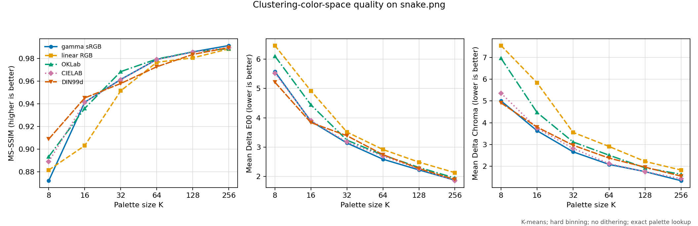
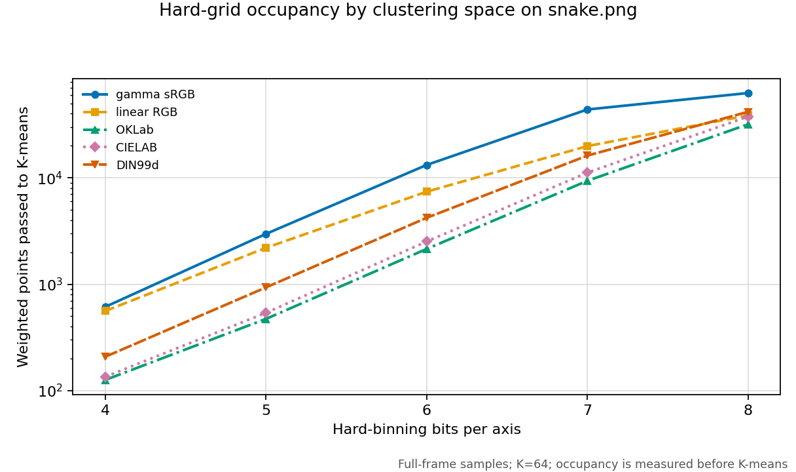
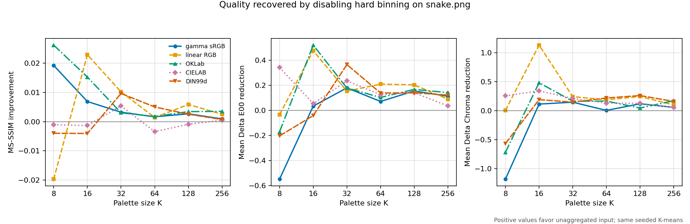
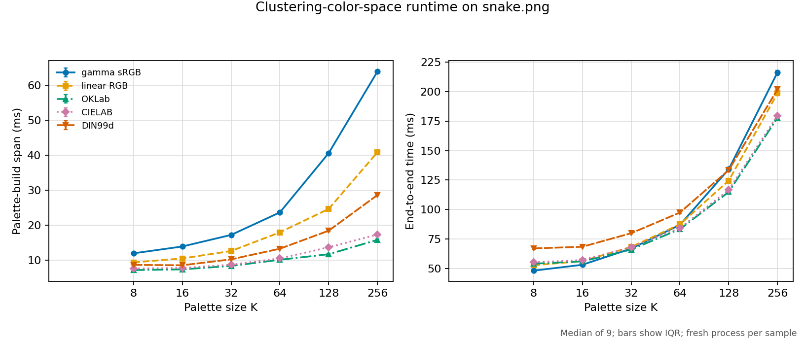
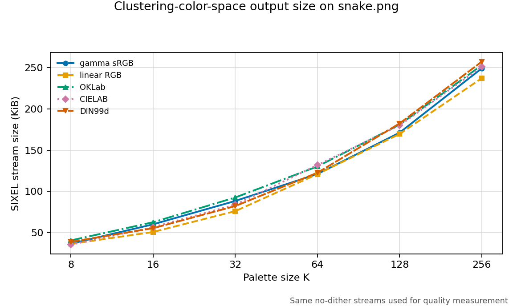
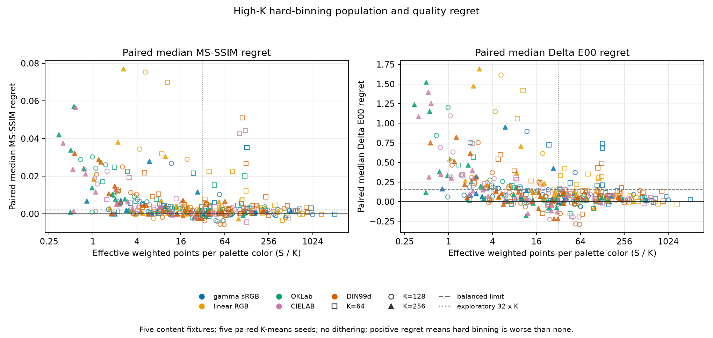
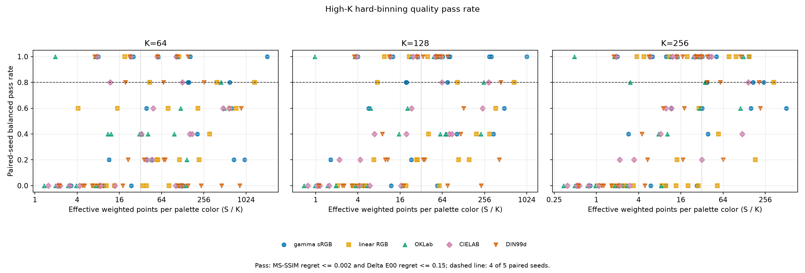

# Palette Clustering Color Space

## Purpose

`img2sixel` uses `-X` to choose the coordinate system in which a generated
palette is constructed:

```text
-X COLORSPACE
--clustering-colorspace=COLORSPACE
```

The accepted values are `gamma`, `linear`, `oklab`, `cielab`, and `din99d`.
The default is `gamma` unless `-W` selects a working color space and `-X` was
not set explicitly. An explicit `-X` remains authoritative regardless of its
position relative to `-W`.

This option changes the geometry seen by the quantizer. It does not declare
the source image profile, change the terminal's interpretation of SIXEL
palette values, or choose the space used by all later image processing.

## Pipeline boundary

For a generated palette, the relevant path is:

```text
loaded or preprocessed frame
          |
          v
sampling policy
          |
          v
convert a palette-only frame to -X
          |
          v
binning policy in -X coordinates
          |
          v
quantizer distance and optimization in -X
          |
          v
convert K palette entries from -X to -W
          |
          v
lookup and dithering in -W
          |
          v
SIXEL palette and indexed bands
```

The encoder clones the frame when palette construction needs a different
pixel format or color space. The main image path is not converted merely
because `-X` was specified. After quantization, only the generated palette is
converted from the clustering space to the working space.

This separation is why the three color-space controls are not aliases:

- `-X` selects palette-construction geometry;
- `-W` selects the working space used when the palette is applied; and
- `-U` selects the output conversion policy.

Fixed built-in palettes, mapfile palettes, monochrome output, already indexed
frames that can be used directly, and other paths that bypass palette
construction do not acquire new clustering behavior from `-X`. The current
alpha-key preservation branch also keeps the frame's existing color space so
that its reserved transparency entry remains intact.

## Distance model

Let `c[i]` be a source color and let `phi_X(c[i])` be that color expressed in
the coordinate representation selected by `-X`. Palette solvers operate on
ordinary Euclidean coordinate differences:

```text
d_X(c, p)^2 = sum_j (phi_X(c)[j] - phi_X(p)[j])^2
```

For K-means, the clustering color space therefore changes the objective
itself:

```text
SSE_X(P) = sum_i w[i] * min_p-in-P d_X(c[i], p)^2
```

K-medoids and K-center use the same coordinates with different objectives.
Heckbert median cut is not a nearest-centroid optimizer, but its channel
ranges, PCA directions, split order, and representatives still depend on the
chosen axes. A result that is optimal or locally stable in one `-X` space need
not remain so after a nonlinear coordinate transform.

The coordinate normalizations below are part of libsixel's metric. In
particular, the CIELAB distance used by a solver is not numerically identical
to raw Delta E76, because libsixel scales the three stored axes before taking
their Euclidean norm.

## `gamma`: gamma-encoded sRGB coordinates

`-X gamma` clusters the three displayed sRGB code values. For normalized
components the vector is:

```text
phi_gamma(c) = (R_srgb, G_srgb, B_srgb)
```

Euclidean distance in these coordinates is inexpensive when the palette
source is already gamma-encoded RGB. It also devotes more numeric resolution
to dark linear-light values than linear RGB does. It is not a perceptually
uniform metric: equal RGB code-value distances can have different visible
effects depending on hue, luminance, and location in the gamut.

This is the compatibility default. Its status as the default is not evidence
that it minimizes Delta E00, MS-SSIM loss, or SIXEL size for every image.

## `linear`: linear-light sRGB coordinates

`-X linear` first removes the sRGB transfer function independently from each
channel. For an sRGB component `C` in `[0, 1]`, libsixel uses:

```text
C_linear = C / 12.92                         when C <= 0.04045
           ((C + 0.055) / 1.055) ^ 2.4       otherwise
```

and then:

```text
phi_linear(c) = (R_linear, G_linear, B_linear)
```

Linear RGB is appropriate when an operation should reflect additive light,
but an unweighted Euclidean distance in linear RGB is not perceptually
uniform. Bright linear-light changes can dominate the objective while a
smaller coordinate difference in a dark region may remain highly visible.

The distinction between encoded sRGB and `srgb-linear`, including the transfer
function, is specified in the
[W3C CSS Color 4 sRGB definitions](https://www.w3.org/TR/css-color-4/#predefined-sRGB).

## `oklab`: approximately perceptual opponent coordinates

`-X oklab` transforms linear sRGB into three cone-response-like coordinates,
applies a cube root, and then rotates the result into lightness and opponent
axes. In compact form:

```text
(l, m, s)^T = M1 * (R_linear, G_linear, B_linear)^T
(L, a, b)^T = M2 * (cuberoot(l), cuberoot(m), cuberoot(s))^T
phi_oklab(c) = (L, a, b)
```

libsixel uses the matrices published with OKLab and retains the native
floating-point `L`, `a`, and `b` scales for clustering. Consequently K-means
minimizes squared Euclidean distance in this normalized opponent space.

OKLab was designed for numerical stability, hue behavior, and improved
perceptual uniformity in image-processing operations. It remains an
approximation to perception, not a guarantee that it will win an image-wide
MS-SSIM or Delta E00 comparison. The definition and design criteria are in
Bjorn Ottosson's original
[A perceptual color space for image processing](https://bottosson.github.io/posts/oklab/).

## `cielab`: normalized CIE 1976 L*a*b*

`-X cielab` converts linear sRGB to CIE XYZ using a D65 reference white and
then applies the CIELAB nonlinear function:

```text
delta = 6 / 29
f(t) = cuberoot(t)                            when t > delta^3
       t / (3 * delta^2) + 4 / 29             otherwise

L* = 116 f(Y / Yn) - 16
a* = 500 (f(X / Xn) - f(Y / Yn))
b* = 200 (f(Y / Yn) - f(Z / Zn))
```

The reference white is `(Xn, Yn, Zn) = (0.95047, 1.0, 1.08883)`. libsixel
then stores the solver coordinates as:

```text
phi_cielab(c) = (L* / 100, a* / 128, b* / 128)
```

with bounded chroma axes. Because `L*` and `a*`/`b*` use different divisors,
the solver's Euclidean distance is a libsixel-normalized CIELAB metric rather
than literal Delta E76. CIELAB is still useful here because it separates a
lightness correlate from opponent chroma axes and was designed to be more
uniform than tristimulus coordinates.

The normative space and Euclidean color-difference methods are described by
[ISO/CIE 11664-4](https://www.cie.co.at/publications/colorimetry-part-4-cie-1976-lab-colour-space-1).

## `din99d`: compressed and rotated CIELAB coordinates

`-X din99d` starts from CIELAB and applies the DIN99d transform described by
Cui, Luo, Rigg, Roesler, and Witt. The current implementation uses:

```text
L99d = 325.22 * ln(1 + 0.0036 * L*)

e = cos(50 deg) * a* + sin(50 deg) * b*
f = 1.14 * (-sin(50 deg) * a* + cos(50 deg) * b*)
G = sqrt(e^2 + f^2)
h = atan2(f, e) + 50 deg
C99 = 22.5 * ln(1 + 0.06 * G)

a99d = C99 * cos(h)
b99d = C99 * sin(h)
```

libsixel normalizes these values for the solver:

```text
phi_din99d(c) = (L99d / 100, a99d / 50, b99d / 50)
```

The logarithms compress lightness and chroma distances while the rotations
reshape the opponent plane. This makes the metric materially different from
both normalized CIELAB and OKLab. The source and motivation for the family are
documented in
[Uniform colour spaces based on the DIN99 colour-difference formula](https://doi.org/10.1002/col.10066).

## Cost model

Let `N` be the number of sampled pixels before binning, `S` the number of
weighted points after binning, `K` the requested palette size, and `I` the
number of solver iterations.

All five coordinate conversions are `Theta(N)` and palette conversion back to
`-W` is `Theta(K)`. Changing `-X` therefore does not change the asymptotic
order of a fixed solver. For example, the direct K-means assignment term
remains `O(I * S * K)`.

The constants and even the effective `S` are nevertheless space-dependent:

- nonlinear spaces perform transfer, matrix, root, logarithm, or trigonometric
  work per sample;
- hard binning addresses the finite grid after conversion, so two spaces can
  produce different occupied-bin populations from the same image;
- K-means bound pruning and convergence depend on the resulting geometry; and
- a palette-only float32 frame can require `Theta(N)` additional storage while
  it is being constructed.

The colorspace implementation precomputes byte-domain transfer tables and a
4096-entry cube-root table. Float paths still have different arithmetic costs.
The measured `palette/build` timeline span starts inside the quantizer and does
not include conversion of the cloned clustering frame. End-to-end timing is
therefore required to observe the whole cost of `-X`.

A fixed hard-bin depth is not neutral across clustering spaces. Equal
`binbits` values provide the same address precision on each transformed axis,
but do not guarantee equal occupied-point counts or equal within-cell
distortion. Consequently, `-X` can change both preprocessing loss and solver
work even when every explicit sampling, binning, and quantizer option is held
constant.

## Interactions with other controls

### Quantize model

`-Q` defines what the solver tries to optimize; `-X` defines the coordinates
in which it does so. K-means gives the clearest controlled comparison because
its squared-distance objective is explicit. Other quantizers must be measured
separately before assuming the same ranking.

### Sampling and binning

Sampling determines which source colors reach palette construction. Binning
then aggregates those samples in the selected `-X` coordinates. Hard and soft
binning can therefore alter both the number and locations of points presented
to the solver. A color-space comparison must pin both policies.

### Working color space, lookup, and dithering

The generated palette is converted from `-X` to `-W` before palette lookup and
dithering. Approximate lookup or error diffusion can mask or amplify palette
differences. Measurements intended to isolate clustering should pin `-W`, use
an exact lookup policy, and disable dithering. A user-facing end-to-end study
with dithering is a separate experiment.

### Precision

Non-gamma clustering paths require floating-point coordinates. A fair
comparison should also request float32 for `gamma`, otherwise representation
precision becomes a second independent variable. The measurements below use
`--precision=float32` for every space.

## Measured comparison

The checked-in experiment compares all five spaces at
`K = 8, 16, 32, 64, 128, 256` on the 600-by-450 RGB
[`images/snake.png`](../../images/snake.png) fixture. Its controlled command is:

```text
img2sixel --threads=1 --precision=float32 --quality=full \
  --loaders=builtin! --sampling-policy=full-frame \
  --binning-policy=hard --quantize-model=kmeans:seed=1:binbits=6 \
  -F none -a off -X COLORSPACE -Wgamma --diffusion=none \
  --gpu-policy=off --lookup-policy=none --palette-type=rgb \
  -p K images/snake.png
```

Before measurement, every one of the 30 `(COLORSPACE, K)` points is checked
through the stable palette trace. The run is rejected unless it reports
K-means, hard binning, no merge, exact lookup, the requested clustering space,
zero quantizer retries, and no fallback.

### Quality



The three panels intentionally answer different questions. MS-SSIM pools
spatial structure, mean Delta E00 estimates average perceptual color error,
and mean Delta Chroma exposes saturation-related error. Their rankings do not
coincide.

DIN99d is strongest in all three quality panels at `K=8` on this image, while
gamma is strongest in MS-SSIM and mean Delta E00 at `K=16`. OKLab has the best
MS-SSIM at `K=32`, `64`, and `128`; gamma still has the lowest mean Delta E00
at those three points. At `K=256`, gamma has the best MS-SSIM and chroma result,
while CIELAB has the lowest mean Delta E00. A perceptually motivated coordinate
space is therefore not an automatic winner for every metric or palette size.

### Hard-binning occupancy



The input sample count is 270,000 for every point in this experiment. The
effective solver population is not. The figure measures the number of occupied
hard bins after transforming the same samples into each clustering space:

| Space | 4 bits | 5 bits | 6 bits | 7 bits | 8 bits |
| --- | ---: | ---: | ---: | ---: | ---: |
| gamma RGB | 612 | 2,967 | 13,201 | 43,827 | 62,586 |
| linear RGB | 560 | 2,197 | 7,400 | 19,853 | 38,564 |
| OKLab | 126 | 472 | 2,145 | 9,368 | 31,855 |
| CIELAB | 135 | 538 | 2,519 | 11,187 | 37,601 |
| DIN99d | 507 | 2,301 | 9,705 | 29,370 | 53,380 |

At the fixed 6-bit setting, OKLab and CIELAB pass only 16.2% and 19.1% as
many weighted points as gamma RGB to K-means. This explains much of their
shorter `palette/build` spans: the solver is receiving less work. It also means
that the main quality plot combines two effects, clustering geometry and
space-dependent hard-binning loss. It must not be read as a pure comparison of
the color-space objectives.

### Quality sensitivity to hard binning



This figure compares each fixed 6-bit hard-bin result with `none`, which sends
one unit-weight point for each visible sampled pixel. Positive values favor
`none`: an MS-SSIM increase, or a reduction in mean Delta E00 or mean Delta
Chroma. At `K=256`, the comparison is:

| Space | MS-SSIM, hard 6 | MS-SSIM, none | Delta E00, hard 6 | Delta E00, none |
| --- | ---: | ---: | ---: | ---: | ---: |
| gamma RGB | 0.991358 | 0.992297 | 1.871517 | 1.758873 |
| linear RGB | 0.988400 | 0.990912 | 2.128480 | 2.039005 |
| OKLab | 0.988582 | 0.992108 | 1.945648 | 1.803799 |
| CIELAB | 0.989611 | 0.990109 | 1.854451 | 1.818770 |
| DIN99d | 0.987915 | 0.989767 | 1.916042 | 1.784310 |

The suspected bias is therefore real on this fixture, especially for OKLab:
removing hard binning raises its `K=256` MS-SSIM by 0.003526 and lowers mean
Delta E00 by 0.141849. Gamma also improves, so occupancy alone is not a complete
explanation. Results across 4 through 8 bits are not monotonic either. Coarser
binning can regularize PCA seeding, and finite-restart K-means can settle in a
different local minimum. More occupied cells therefore do not by themselves
guarantee a better final palette.

Use `none` when the purpose is to compare solver geometry without hard-grid
loss. Use the production binning policy when the purpose is to compare the
actual user-visible pipeline, but report occupied-point counts and binning
distortion alongside quality and speed.

### Speed



Each point is the median of nine fresh-process samples after two warm-ups;
error bars show the interquartile range. Color-space order rotates between
rounds. The left panel sums complete top-level `palette/build` spans from a
separate instrumented run. It excludes clustering-frame conversion. The right
panel measures the complete uninstrumented command.

OKLab and CIELAB have the shortest solver spans for most of this fixture even
though their coordinate transforms are more complex than gamma RGB. This is
not evidence that their transforms are cheaper: hard-bin occupancy, bound
pruning, and convergence also change with the geometry. At `K=64`, the median
solver spans are 26.209 ms for gamma, 11.328 ms for OKLab, and 11.556 ms for
CIELAB; the corresponding end-to-end times are 104.38, 98.78, and 100.40 ms.
At `K=256`, OKLab is fastest end to end at 205.92 ms, compared with 250.16 ms
for gamma and 265.28 ms for DIN99d.

### Encoded size



Size is the exact byte length of the same no-dither stream assessed for
quality. It is not a direct objective of any clustering space. A palette can
improve color error while creating a less compressible index pattern.

At `K=64`, linear RGB is smallest at 120.9 KiB, gamma is 121.1 KiB, OKLab is
130.2 KiB, CIELAB is 131.9 KiB, and DIN99d is 122.8 KiB. At `K=256`, linear
RGB is again smallest at 237.3 KiB, followed by DIN99d at 240.6 KiB; gamma,
CIELAB, and OKLab produce 249.3, 251.3, and 253.1 KiB respectively. These size
rankings are properties of this image and encoder configuration, not general
compression guarantees.

## Adaptive hard-binning design

A future adaptive hard-grid must resolve bin depth from the transformed sample
distribution, not from the `-X` name. Keep three decisions distinct:

1. binning policy, such as `hard`, `soft`, `exact`, or `none`;
2. hard-grid depth; and
3. dense or sparse physical storage.

An explicit fixed depth remains authoritative. With an automatic depth, policy
resolution can select `hard` before execution while grid-depth resolution stays
pending until the binning filter has observed transformed samples. This is an
incremental resolution state, not a second quantizer decision.

Let `S_b` be the occupied-cell count at depth `b`, `x_i` a transformed sample,
`w_i` its weight, and `mu_h` the weighted centroid of cell `h`. Measure the
within-cell squared error

```text
E_b = sum_h sum_(i in h) w_i ||x_i - mu_h||^2
```

against total transformed variance

```text
T = sum_i w_i ||x_i - mu||^2.
```

The coarsest candidate depth should have to satisfy both an occupancy floor and
a normalized distortion ceiling, for example:

```text
S_b >= min(S_8, rho * K)  and  E_b / T <= epsilon
```

`S_8` prevents a genuinely low-color image from being classified as deficient.
`rho = 32` was an exploratory reference, not a proposed default. The measured
results below reject any single `rho` as a sufficient decision rule. A
distortion condition and a content-diverse validation set are both necessary.

### Measured point sufficiency



The point-sufficiency study uses five content classes, all five clustering
spaces, `K = 64, 128, 256`, hard grids from 4 through 8 bits, and five paired
K-means seeds. Each hard-grid result is compared with `none` at the same
fixture, `K`, clustering space, and seed. The run uses full-frame sampling,
float32 coordinates, exact palette lookup, one thread, and no dithering. It
therefore isolates the current hard-binning representation and solver response;
it does not measure a complete future adaptive policy.

The balanced analytical criterion accepts a seed when MS-SSIM regret is at
most 0.002 and mean Delta E00 regret is at most 0.15. A grid passes a condition
when at least four of five paired seeds pass. The *observed threshold* is the
coarsest passing measured grid. The more conservative *stable threshold* also
requires every finer measured grid to pass, because current K-means results are
not monotonic in grid depth.

| Palette size | Stable conditions | Median stable points | Median `S / K` | Passing conditions at 6 / 7 / 8 bits |
| ---: | ---: | ---: | ---: | ---: |
| 64 | 10 / 25 | 8,488.5 | 132.63 | 7 / 7 / 10 |
| 128 | 16 / 25 | 3,034.5 | 23.71 | 12 / 13 / 16 |
| 256 | 21 / 25 | 8,256 | 32.25 | 12 / 15 / 21 |

Medians exclude conditions that never reach a stable threshold by 8 bits, so
they are descriptive values rather than safe lower bounds. At `K=256`, the 21
stable conditions range from 125 through 86,680 effective points, while four
conditions remain censored at 8 bits. Across every palette size, only 47 of 75
conditions have a stable balanced threshold. Fixed 6-, 7-, and 8-bit grids pass
31, 35, and 47 conditions respectively.



Point count alone does not predict the result. Among the 166 measured
depth/condition cells with at least 32 effective points per palette color, only
76, or 45.8 percent, pass the balanced condition. Near the same population,
5-bit linear-RGB binning at about 19 points per color passes for the flat
artwork fixture but fails for the rare-color fixture. Counts do not describe
the distances collapsed inside a cell, and changing the weighted point set can
also send finite-restart K-means to a different local minimum. More points can
therefore produce a worse final palette even though they represent the source
distribution more finely.

The measurement supports using `S_b / K` as a deficiency warning, but not as an
automatic acceptance test. An adaptive resolver should combine it with
`E_b / T`, and calibration must evaluate the resulting policy rather than infer
quality from either signal alone. If no admissible hard depth satisfies the
chosen distortion and resource limits, `exact` or `none` is a separate,
explicitly diagnosed fallback decision rather than an implied deeper hard
grid.

### Implementation constraints

The histogram already retains cell weights and coordinate sums. Retaining a
sum of squared norms, or equivalent per-axis second moments, would make `E_b`
available without retaining each original pixel. A memory-conscious first
implementation can start at 6 bits, coalesce nested keys to evaluate 5 and 4
bits without rescanning, and rebuild at 7 or 8 bits only if the criteria fail.
Higher-resolution rebuilding must replay a materialized transformed point set or
an explicitly replayable stream. It must not silently allocate the maximum
sparse table for every image.

Resolution diagnostics should report source samples, occupied points,
`E_b / T`, selected depth, peak bin storage, and the selection reason. These
values belong to the same per-frame sample stream and clustering coordinates;
animation retries must not reuse statistics from a previous frame. Exhausting
the memory budget should select the best admissible hard grid and report the
constraint. It should not silently change the binning policy to `none`.

Before enabling this behavior by default, measure `E_b / T` on this suite and
compare fixed 6-bit hard binning, the implemented adaptive policy, fixed 8-bit
hard binning, `exact`, and `none`. Record quality, speed, encoded size,
effective point count, and peak memory. Repeat with the intended production
dithering policy after the palette-only comparison. Grid-depth controls and
thresholds belong to the binning configuration rather than `-Q`; their final
CLI spelling remains undecided.

## Interpretation and selection

There is no defensible total ordering from this run:

- `gamma` is the compatibility reference and remains competitive in every
  quality panel;
- `linear` often reduces stream size here but has weaker perceptual metrics;
- `oklab` gives strong spatial quality and unexpectedly short measured solver
  spans on this fixture;
- `cielab` is competitive in both quality and solver time, including the best
  mean Delta E00 at `K=256`; and
- `din99d` is strongest at very small `K` here but has the highest end-to-end
  latency at several larger palette sizes.

Do not change a project default from this one image. A default proposal needs
multiple natural images, smooth luminance and chroma gradients, rare saturated
colors, broad-gamut inputs with explicit profile handling, and multiple
quantize models. It should also repeat the study with the intended dithering
policy, because the current experiment deliberately measures the palette
without error diffusion.

## Reproduction and raw data

The exact tables are
[`clustering-colorspace-quality.csv`](clustering-color-spaces/measurements/clustering-colorspace-quality.csv),
[`clustering-colorspace-speed.csv`](clustering-color-spaces/measurements/clustering-colorspace-speed.csv),
[`clustering-colorspace-size.csv`](clustering-color-spaces/measurements/clustering-colorspace-size.csv),
[`clustering-colorspace-binning-occupancy.csv`](clustering-color-spaces/measurements/clustering-colorspace-binning-occupancy.csv),
and
[`clustering-colorspace-binning-quality.csv`](clustering-color-spaces/measurements/clustering-colorspace-binning-quality.csv).
The source revision, fixture and executable hashes, build flags, host, protocol,
and preflight count are recorded in
[`clustering-colorspace-run.json`](clustering-color-spaces/measurements/clustering-colorspace-run.json).

Rebuild the binaries, regenerate every table and figure, and validate the
sweep with:

```sh
tools/reproduce_clustering_colorspace_measurements.sh
```

Set `PYTHON` when Matplotlib is installed in a non-default interpreter.
`CLUSTERING_COLORSPACE_WARMUPS` and `CLUSTERING_COLORSPACE_RUNS` may shorten an
exploratory run. Durable replacement data should retain the documented 2/9
protocol and must pass:

```sh
python3 tools/check_clustering_colorspace_measurements.py \
  docs/functionality/clustering-color-spaces/measurements
```

The reproduction wrapper refuses to record a tracked dirty worktree so that
the manifest revision and executable provenance remain meaningful.

The multi-fixture point-sufficiency tables are
[`clustering-binning-threshold-raw.csv`](clustering-color-spaces/threshold-measurements/clustering-binning-threshold-raw.csv),
[`clustering-binning-threshold-summary.csv`](clustering-color-spaces/threshold-measurements/clustering-binning-threshold-summary.csv),
and
[`clustering-binning-thresholds.csv`](clustering-color-spaces/threshold-measurements/clustering-binning-thresholds.csv).
The corresponding provenance is recorded in
[`clustering-binning-threshold-run.json`](clustering-color-spaces/threshold-measurements/clustering-binning-threshold-run.json).
Regenerate both figures and all three tables with:

```sh
tools/reproduce_clustering_binning_threshold_measurements.sh
```

The durable run must pass:

```sh
python3 tools/check_clustering_binning_threshold_measurements.py \
  docs/functionality/clustering-color-spaces/threshold-measurements
```

## Implementation and tests

The CLI option is applied in [`encoder.c`](../../src/encoder.c). The coordinate
transforms and their lookup tables are in
[`colorspace.c`](../../src/colorspace.c). Weighted point sets retain their
color-space identity in
[`weighted-point-set.c`](../../src/weighted-point-set.c), and the generated
palette is converted to the working space before palette application.
With `LSIXEL_TRACE=stable`, the binning filter emits `LSXBSTAT1` records for
the selected grid depth, source sample count, and effective point count. The
measurement preflight uses this stable record rather than inferring occupancy
from timing.

Focused quality tests for all five `-X` values and the `-X`/`-W` cross-product
are under
[`tests/quant/palette/usage/`](../../tests/quant/palette/usage/). The same
directory verifies that fixed palettes and monochrome paths remain unchanged
when `-X` is present.

For the surrounding architecture, read
[Palette Construction Pipeline](palette-pipeline.md),
[Palette Quantization](quantization.md), and
[Quality Measurement Policy](../quality/measurement-policy.md).
