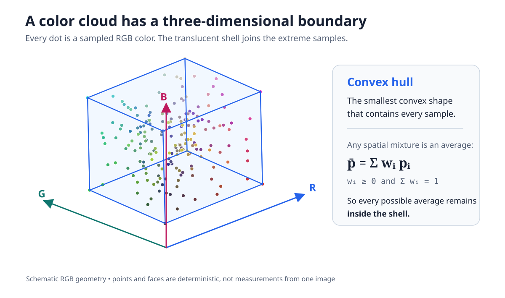
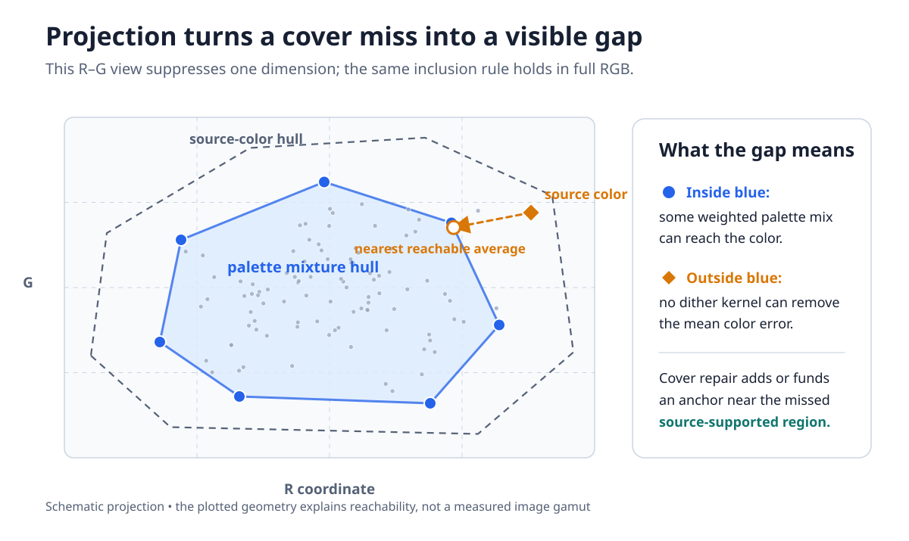
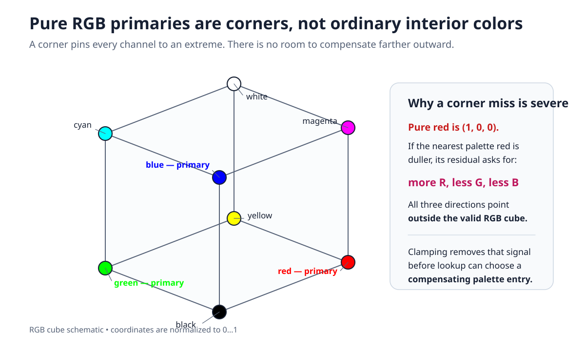
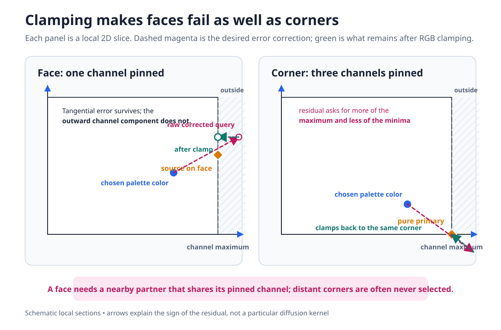
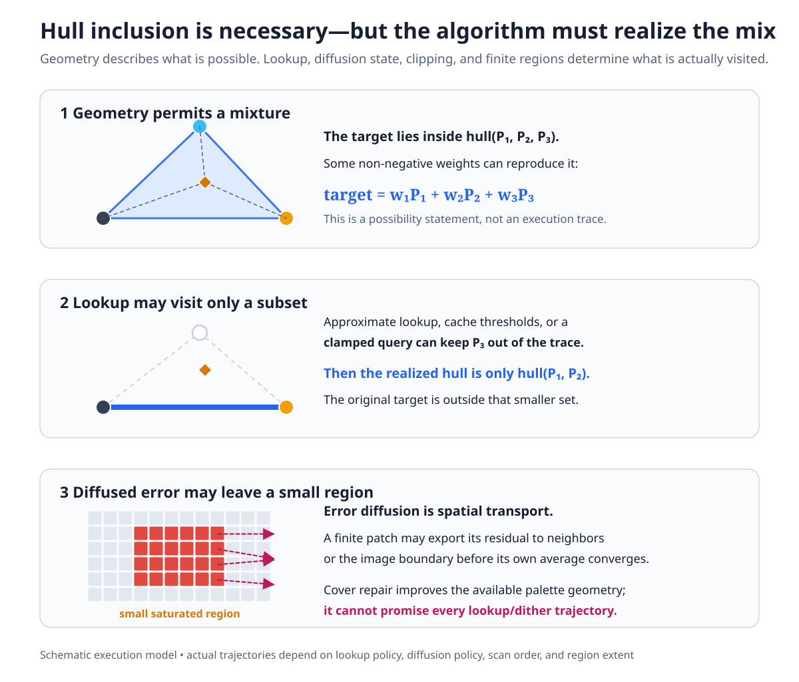
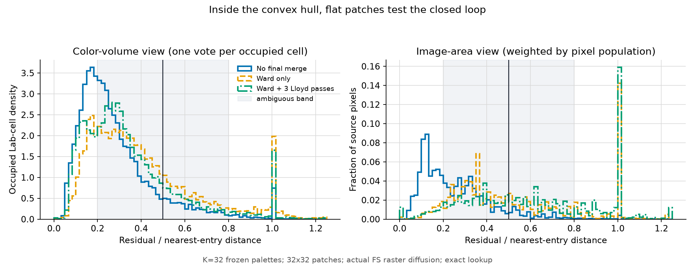
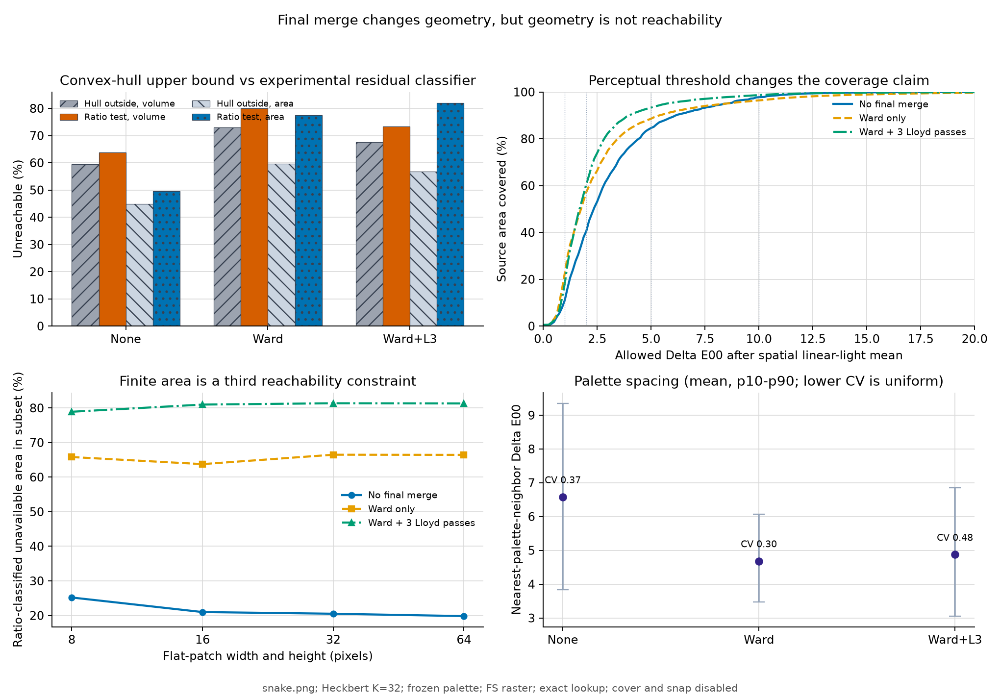
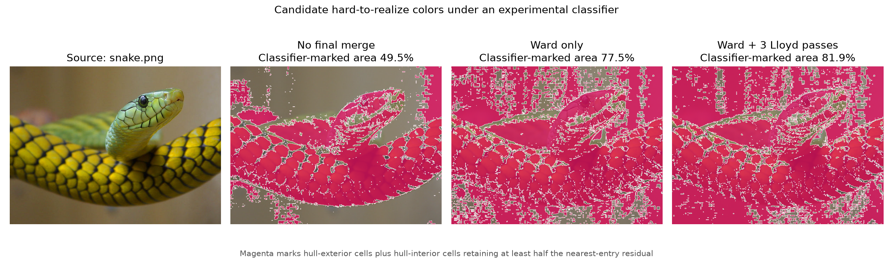
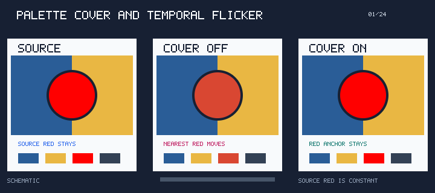
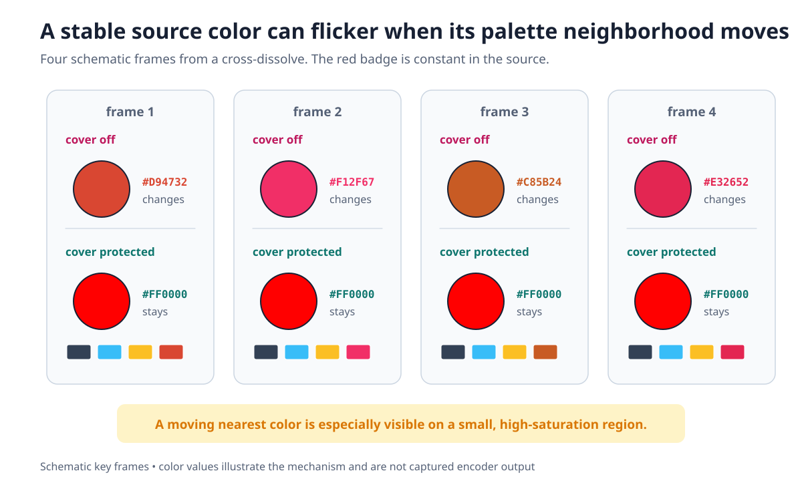

# Palette Cover Policy

`-a POLICY` and `--cover-policy=POLICY` control a final palette-repair pass that runs after palette construction. The pass is independent of the quantizer selected by `-Q`: the quantizer chooses representative colors, while cover repair tries to keep colors near important parts of the source gamut reachable during palette application and dithering.

## Pipeline position

The generated-palette construction path is:

```text
sampling -> palette-space transform -> binning -> quantizer (-Q)
                                                    |
                                                    v
                  solver refinement and final merge (-F)
                                                    |
                                                    v
                              palette cover repair (-a)
                                                    |
                                                    v
                     lookup preparation (-~) -> palette application (-d)
                                                    |
                                                    v
                                            SIXEL encoding
```

Cover repair therefore changes the palette consumed by lookup and dithering, but it does not select a quantizer, clustering color space, lookup data structure, or diffusion kernel. Use `--cover-policy=off` when benchmarking one of those stages in isolation.

The fixed-palette selectors `-m`, `-b`, and `-e` bypass palette construction and therefore have no cover-repair stage. Combining any of them with an explicit `--cover-policy` or `-a`, including `off`, is rejected while arguments are applied instead of silently ignoring the cover request. A top-level `SIXEL_PALETTE_COVER` environment override has the same conflict; omit the cover policy when supplying one of these fixed palettes.

The implementation currently applies cover repair only when the completed palette is stored as byte RGB entries. A native float32 palette bypasses the pass. If a byte palette was produced from an input format that the soft candidate reader cannot inspect, soft mode falls back to hard anchors. These are implementation boundaries, not a promise that float32 or every input layout needs no coverage repair.

## Why palette coverage matters

Color quantization is usually introduced as a search for representative colors, but representation is only half of the problem. The resulting palette is also geometry: every palette entry is a point in a three-dimensional color space, and every spatial mixture of those entries remains inside their convex hull.



*Figure 1. Schematic RGB geometry. The translucent surface is the smallest convex polyhedron containing the sample points. It is generated from deterministic synthetic data, not measured from a particular image.*

Let the final palette be a set of colors $P = \lbrace p_1, \ldots, p_K \rbrace$. If dithering represents a source color by spatially mixing palette entries, the average reconstructed color can only lie in the convex hull of the entries that lookup actually selects:

$$
\bar{p} = \sum_{i=1}^{K} w_i p_i, \qquad w_i \ge 0, \qquad \sum_i w_i = 1.
$$

A source color outside that reachable hull cannot be recovered by changing the diffusion kernel. Projecting the geometry onto two dimensions makes the failure easier to see: the source-color cloud can extend beyond the palette's mixture hull even when every palette entry looks individually reasonable.



*Figure 2. Schematic two-dimensional projection. The orange source color is inside the source-color hull but outside the blue palette hull. The dashed gap is irreducible mean error for that palette; it is not a Delta E measurement.*

This is a **cover miss**. Dithering can redistribute the error spatially, but it cannot make the average cross the blue boundary. A different diffusion kernel may change the texture of the mistake without removing its color bias.

### Why saturated primaries fail first

The valid RGB domain is a cube. Pure red, green, and blue are not typical colors near its middle: they are three of its eight corners. A pure primary pins all three channel coordinates to either 0 or 1, leaving no valid RGB direction farther outward.



*Figure 3. Normalized RGB cube. Pure red is $(1,0,0)$, pure green is $(0,1,0)$, and pure blue is $(0,0,1)$. The same corner geometry applies to black, white, cyan, magenta, and yellow.*

Suppose the source is pure red but the nearest palette entry is duller: it has less red and nonzero green or blue. The quantization residual asks the next lookup for still more red and less green and blue. All three corrections point outside the RGB cube. Clamping turns that impossible query back into a boundary value, so it cannot necessarily cross into the Voronoi region of a compensating palette entry. This is why a rare saturated badge, cursor, graph highlight, or game sprite can remain flat and visibly wrong even under error diffusion.

### Why faces fail too

Corners are the strongest case, but not the only case. A color on an RGB face pins one channel at 0 or 1 while allowing the other two to vary. Error tangential to the face survives; the outward component of the residual is still discarded by clamping.



*Figure 4. Schematic local slices. Magenta shows the raw corrected query and green shows the valid query after channel clamping. On a face, one residual component is lost; at a corner, three components can point outward at once.*

This explains why the hard-policy ladder adds face centers before edge midpoints. A source color on the face $R=1$, for example, often needs another palette entry with $R=1$ and nearby $G,B$ coordinates. The four distant corners of that face exist mathematically, but lookup may never select them from the corrected samples actually produced. A nearby face partner can break that lock with fewer and smaller excursions.

### Convex containment is necessary, not sufficient

Even $c \in \mathrm{conv}(P)$ does not guarantee that one finite image region will average to $c$. Let $V_R \subseteq P$ be the palette entries that lookup actually visits while processing region $R$. The output average belongs to $\mathrm{conv}(V_R)$, which may be much smaller than the hull of the full palette.



*Figure 5. Schematic execution model. The full palette permits the target mixture, but a lookup trace can visit only a subset, and spatial diffusion can transport residual error out of a small region before its local average converges.*

A useful conceptual recurrence is

$$
q_n = \mathrm{clamp}(c_n + e_n), \qquad p_n = L(q_n), \qquad e'_n = q_n - p_n,
$$

where $L$ is the lookup policy and the dither policy distributes $e'_n$ to later pixels. Three implementation properties separate this recurrence from the convex-hull existence proof:

- **Lookup is discrete.** Even exact nearest-color lookup selects one palette entry per pixel. The corrected query must cross a decision boundary before another entry participates. Approximate lookup, cache reuse, or a threshold can reduce the visited set further, but exact lookup alone does not force the desired barycentric weights.
- **Clamping is lossy.** The difference between $c_n+e_n$ and $q_n$ is discarded before lookup. At a gamut face or corner, this is precisely the outward signal that would request a compensating color.
- **Diffusion is local and finite.** Error can leave a small feature, reach an image boundary, or be interrupted by scan order and transparency. The full-frame mean can improve while a rare saturated region remains biased.

Cover repair therefore does not claim to compute an exact hull or guarantee exact reproduction. It changes the palette so useful boundary partners are closer and more likely to enter the realized lookup path. The actual result still depends on lookup policy, dither policy, scan order, region size, and whether the working path clamps or otherwise limits corrected samples.

## Three histories meet at palette reachability

The difficulty is not that color science lacks relevant models. Three mature fields each contain one necessary part, but none by itself describes a sparse SIXEL palette driven by nearest-color lookup and finite error diffusion.

### Gamut mapping measures volume and image area

[CIE 156:2004, *Guidelines for the Evaluation of Gamut Mapping Algorithms*](https://www.cie.co.at/publications/guidelines-evaluation-gamut-mapping-algorithms) established a framework that separates image selection, gamut-boundary description, color space, objective measurement, viewing conditions, and psychophysical evaluation. Image-dependent evaluation already asks how many source pixels are out of gamut. [Barańczuk et al.](https://www.imaging.org/common/uploaded%20files/pdfs/Reporter/Articles/2010_25/REP25_1_CIC17_BARANCZUK_PG21.pdf) compare objective image-quality predictions with paired observer choices, while [*Perceptual Evaluation of Color Gamut Mapping Algorithms*](https://ntnuopen.ntnu.no/ntnu-xmlui/bitstream/handle/11250/2461840/CR%26A_article_v2.pdf?sequence=1) by Dugay, Farup, and Hardeberg reports statistically significant correlations between the percentage of out-of-gamut pixels and both the number of algorithm pairs observers could distinguish and the perceived difficulty of the image. The second result is the direct precedent for treating pixel-area weighting as more than a convenient engineering score.

Volume and coverage measurements provide the complementary geometric view. They say how much of a declared color solid lies outside the destination gamut, independently of how frequently a particular image uses each location. The missing piece for SIXEL is the destination object. Conventional gamut mapping normally treats it as a device gamut with a continuous boundary. A palette of 32 or 128 isolated points plus a stateful dither loop is neither continuous nor adequately described by one smooth solid.

### Printing supplies the convex-mixture model

The Neugebauer model treats a halftone color as an area-weighted mixture of Neugebauer primaries. A modern description of [Neugebauer-primary convex hulls and barycentric area coverages](https://library.imaging.org/admin/apis/public/api/ist/website/downloadArticle/cic/19/1/art00046) makes the geometric connection explicit: mixtures lie in convex cells, and target colors can be expressed by primary-area fractions. SIXEL palette entries play an analogous role to those primaries, although they are emitted terminal colors rather than physical ink-overprint states.

Printing also records why a mathematically neat mixture law is not automatically a perceptual prediction. The [Yule-Nielsen modified Neugebauer model](https://opg.optica.org/ao/abstract.cfm?uri=ao-17-21-3376) introduces a fitted factor to account for optical dot gain and other departures from simple linear reflectance averaging. The corresponding lesson for SIXEL is not to copy the Yule-Nielsen formula, but to name the space in which samples are mixed and to verify the result perceptually. Linear-light averaging, gamma-coded arithmetic, and visual integration are different operations.

The missing piece is control dynamics. The Neugebauer relation maps prescribed area fractions to a predicted color. It does not prove that a greedy nearest-color feedback loop will visit the required entries at those fractions.

### Error-diffusion theory supplies the closed loop

Error diffusion is a nonlinear feedback system, not a direct convex optimizer. The [UT Austin review of error-diffusion stability](https://users.ece.utexas.edu/~bevans/papers/2003/errorDiffusion/spie2003ElectImagingTalk.pdf) surveys boundedness, periodic artifacts and limit cycles, and threshold modulation as a classical way to disrupt those cycles. Work on [vector error-diffusion limit-cycle reduction](https://image-ppubs.uspto.gov/dirsearch-public/print/downloadPdf/7719718) extends the problem to multichannel color decisions.

This literature supplies a name for the single-entry lock observed by libsixel: it is a degenerate limit cycle of the lookup-and-diffusion recurrence. Its usual concern, however, is the texture and stability of a halftone process. It does not normally combine sparse-palette geometry, source-image area, perceptual color distance, and finite feature size into one coverage measurement.

| Lineage | Useful component | Assumption that breaks for SIXEL palette reachability |
| --- | --- | --- |
| Gamut mapping | color-volume and out-of-gamut pixel-area evaluation | destination gamut is treated as a continuous device solid |
| Neugebauer printing | convex mixtures and explicit area fractions | required fractions are prescribed rather than discovered by a greedy lookup loop |
| Error-diffusion stability | nonlinear feedback, limit cycles, and finite-state behavior | failures are usually treated as texture defects rather than image-weighted sparse-gamut loss |

The intersection is the interesting part: a geometrically legal mixture may not be dynamically realized, and a dynamically realizable mixture may need more pixels than a small image feature contains. We have not found an established metric that combines all three constraints for an indexed terminal palette. The measurement model below is therefore a scoped proposal assembled from established components, not a claim that the components themselves are new.

## Three layers of reachability

It is useful to reserve the word **reachable** for a statement that names its layer:

| Layer | Question | Role |
| --- | --- | --- |
| Convex-hull reachability | Is the target inside the palette hull in the declared linear mixing space? | Necessary geometric upper bound |
| Closed-loop reachability | Does frozen-palette lookup plus the actual dither recurrence converge to the target mixture? | Implementation-dependent realized set, potentially smaller than the hull |
| Finite-area reachability | Can the recurrence realize the mixture within the width, height, boundary, transparency, and scan order of the feature? | Image-region constraint, potentially smaller again |

These layers suggest three complementary measurements rather than one overloaded coverage number:

| Working metric name | Weighting | What it should report |
| --- | --- | --- |
| `Gamut_unreachable_vol` | equal measure over a declared probe volume | fraction outside the hull or a separately defined realized set |
| `Gamut_unreachable_area` | source pixel population | fraction of the image assigned to colors that fail the declared reachability test |
| `Gamut_unreachable_dE` | the unreachable population, with both cell and pixel weights available | mean and p95 Delta E00 between the target and its realized flat-patch mean or a stated geometric projection |

The denominator is part of the definition. Counting occupied one-unit CIELAB cells approximates the diversity of colors in one image, but it is not an image-independent gamut volume. A true image-independent volume result must declare a dense probe solid, integration space, boundary sampling rule, and rendering transform. Likewise, area percentage is not geometry: it deliberately gives a common background more weight than a rare saturated badge. Both views are needed because a local failure can vanish in a whole-image mean.

A reproducible closed-loop probe needs to preserve the system being measured:

1. Freeze the exact palette after quantization, final merge, cover, and snap stages selected by the experiment.
2. Choose representative colors with recorded weights, either from a declared volume lattice or from unique/clustered image colors.
3. Render a flat patch for each representative with the production lookup policy, dither kernel, scan order, clamping, precision, and transparency boundaries.
4. Average the rendered patch in the declared physical mixing space, then calculate Delta E00 and any residual classifier.
5. Repeat across feature sizes. Report color-volume, image-area, mean, p95, and ambiguous-class mass separately.

The distinction between a residual observation and a reachability classification matters. Let the nearest-entry distance be the error obtained when diffusion contributes no useful mixture. The ratio between the measured flat-patch residual and that distance is near zero for an accurate mixture and near one for a single-entry lock. A threshold is defensible only if the observed distribution leaves little probability mass between those modes.

### A useful negative result

The design experiment recorded in [`palette-common-cover.h`](../../src/palette-common-cover.h) found an almost binary residual distribution for its fixed K=64 synthetic probe set. That finding motivated the `corners -> faces -> edges` anchor ladder. Its original generator and exact probe corpus were not retained, however, so the table is historical design evidence rather than a fully reproducible benchmark.

The new checked-in replay deliberately uses a broader population: all 31,966 occupied one-unit CIELAB cells in `snake.png`, three frozen K=32 Heckbert palettes, exact lookup, actual Floyd-Steinberg raster diffusion, and 32 by 32 flat patches. It tests the bimodality assumption rather than building it into the metric.



*Figure 6. The shaded 0.2-0.8 interval is not empty: it contains 59.6-70.6% of occupied cells and 51.7-71.3% of source-pixel weight, depending on final merge. The broad middle falsifies a general bimodality claim for this corpus. A 0.5 residual-ratio threshold can still visualize candidates, but it is not yet a stable definition of closed-loop reachability.*

This is exactly the kind of result a durable measurement should preserve. Treating every hull-interior probe above 0.5 as unreachable would manufacture a precise-looking area percentage from an ambiguous distribution. The current artifact labels that view **ratio-classified** and keeps geometric hull exclusion and perceptual Delta E00 thresholds separate.



*Figure 7. Cover and snap are disabled here; final merge is varied as a control. Ward improves the source area reconstructed within Delta E00 2 and 5 while increasing the area and occupied-cell volume outside the linear-light palette hull. The result demonstrates that population-fit quality and boundary coverage are distinct objectives. Orange, dotted-blue, and finite-area series use the experimental ratio classifier.*



*Figure 8. Magenta maps hull-exterior cells plus hull-interior cells above the 0.5 residual ratio back onto `snake.png`. The map is useful for locating a failure hypothesis, but the broad ambiguous band in Figure 6 prevents interpreting all magenta pixels as proven failures in their original neighborhoods.*

This control answers one question already: final merge is not cover repair. At K=32, no merge, Ward, and Ward plus three Lloyd passes leave 44.9%, 59.7%, and 56.8% of source pixels outside their respective palette hulls, even as area-weighted mean Delta E00 falls from 3.06 to 2.66 and 2.22. A dedicated cover-policy sweep must next hold the pre-cover palette fixed and vary `off`, `corners`, `faces`, and `edges` in both soft and hard modes. Until that experiment exists, the source-header table should not be presented as a refreshed default-policy benchmark, and the experimental residual classifier should not be added to `lsqa`.

### What a cover miss looks like in animation

A static cover miss is a color bias. In animation it can become much more distracting: a small source region stays at the same saturated color while the rest of the frame changes, each frame's palette gives that region a different nearest reachable color, and the region flashes between those approximations.



*Figure 9. Looping schematic APNG. The source badge remains pure red during a cross-dissolve. The cover-disabled column cycles through nearby reds as its illustrative palette changes; the protected column represents a pass that selected a red anchor, either as a hard corner or a source-supported soft candidate. These pixels are explanatory synthetic data, not captured `img2sixel` output.*

The same sequence is available as static key frames for readers that disable animation or view a renderer that shows only the first APNG frame:



*Figure 10. Reduced-motion fallback for Figure 9. Shape, labels, hexadecimal values, and row position repeat the distinction without depending on color or motion alone.*

The key distinction is between **source motion** and **palette-neighborhood motion**. The red feature in the example does not change. Its representation changes because the palette geometry around it changes. Cover repair is intended to keep important source-supported boundary regions reachable; it is not a general temporal denoiser and does not freeze the entire palette.

### Historical detour: why palette locking was not enough

An early explanation for SIXEL-video flicker focused on frame-to-frame instability in median-cut results: nearly identical frames could split boxes or order representatives differently, so the chosen palette moved. libsixel consequently made Heckbert splitting deterministic in [`9ef82ab74`](https://github.com/saitoha/libsixel/commit/9ef82ab74041865f67e6097a672ce31105a471aa), added an animation mode with a scene-cut threshold in [`bd32b37ec`](https://github.com/saitoha/libsixel/commit/bd32b37ecdf82e97f1f391e6cce62c8bf60bff6f), and then held the previous palette until that detector declared a cut in [`967e9ef21`](https://github.com/saitoha/libsixel/commit/967e9ef21b94b81ab3c32d847c1a7d098041157c).

That approach attacks temporal palette motion, but a scalar scene threshold is not a universal model of animation. Noise, camera motion, subtitles, or a bright overlay can trigger a false cut; a small but important local change can remain below the threshold; and a cross-dissolve has no single discontinuity to detect. More fundamentally, a fixed palette can remain stably wrong when the saturated region was never inside its reachable hull.

The sticky-palette mechanism was later removed in [`f4934fcfd`](https://github.com/saitoha/libsixel/commit/f4934fcfd4d4d6e15e4513a42e4bf86965baf454). The cover work began by anchoring gamut corners in [`378b1162e`](https://github.com/saitoha/libsixel/commit/378b1162eb3070c66ef32730fd8e36e9b30abfe7), then evolved toward source-supported soft candidates. This history is useful because deterministic quantization, scene detection, palette locking, temporal dithering, and palette coverage address different failure modes. None should be presented as a complete substitute for the others.

### Reproducing the explanatory figures

All figures in this section are generated by [`plot_cover_policy_figures.py`](../../tools/plot_cover_policy_figures.py) using only the Python standard library. The source coordinates, seeds, labels, APNG frames, and caveat text are versioned with the generator. Regenerate every asset with one command:

```sh
tools/reproduce_cover_policy_figures.sh
```

Use the byte-for-byte check mode after changing the generator or documentation:

```sh
tools/reproduce_cover_policy_figures.sh --check
```

[`cover-policy-figures.json`](cover-policy-figures/cover-policy-figures.json) records the generator, schematic/measurement distinction, deterministic seeds, asset roles, and animation timing. These figures explain mechanisms; they must not be cited as quality measurements or evidence for a default-policy threshold.

## Policy values

The default is `auto`.

| Policy | Hard-mode anchor set | Soft-mode budget | Meaning |
| --- | ---: | ---: | --- |
| `off` | 0 | 0 | Skip cover repair. |
| `corners` | 8 cube corners | up to 8 image-derived anchors | First coverage rung. |
| `faces` | corners plus 6 face centers, 14 total | up to 14 image-derived anchors | Adds partners for colors with one channel pinned at a gamut boundary. |
| `edges` | previous set plus 12 edge midpoints, 26 total | up to 26 image-derived anchors | Largest implemented coverage rung. |
| `all` | same as `edges` | same as `edges` | Exact alias of `edges`; it does not request a denser lattice. |
| `auto` | selected from actual palette size | selected from actual palette size | Resolves through the size ladder below. |

The registry also accepts `0` as a compatibility spelling for `off` and `1` as a compatibility spelling for `auto`. New configurations should use the named values.

### `auto`

`auto` resolves after the quantizer has reported the actual palette entry count, before optional cover growth:

| Actual entries | Effective policy | Maximum anchors |
| ---: | --- | ---: |
| 1-31 | `off` | 0 |
| 32-63 | `corners` | 8 |
| 64-255 | `faces` | 14 |
| 256 | `edges` | 26 |

The lowest rung is disabled below 32 colors because eight anchors would consume at least one quarter of the palette budget. An explicit policy is never rewritten by this size resolver.

### `off`

`off` is the control arm for quantizer, merge, lookup, and diffusion experiments on a generated palette. A supplied fixed palette has no cover stage, so its CLI must omit the cover option rather than selecting `off`.

### `corners`

In hard mode, `corners` targets the eight points in $\lbrace 0,255 \rbrace^3$. These anchors expand reach toward fully saturated combinations and black and white. In soft mode, the name denotes an eight-anchor budget rather than cube geometry.

### `faces`

In hard mode, `faces` contains the corners and adds `(0|255,128,128)`, `(128,0|255,128)`, and `(128,128,0|255)`. Face centers precede edge midpoints in the policy ladder because measured error-diffusion reachability improved more from partners that preserve one pinned channel than from a geometrically more obvious edge-first ordering. In soft mode, the name denotes a fourteen-anchor budget.

### `edges` and `all`

In hard mode, `edges` contains the previous fourteen anchors and adds the twelve permutations of `(128,0|255,0|255)`, for twenty-six anchors in total. `all` resolves to exactly the same internal policy. In soft mode, either spelling provides a maximum budget of twenty-six image-derived anchors.

## Cover modes

`cover_mode` selects how anchors are nominated. The default is `soft`.

### Soft mode

Soft mode protects colors supported by the current image instead of reserving fixed RGB-cube locations. It is intended to avoid spending entries on unoccupied colors that can appear as isolated full-intensity dots when diffusion uses them to discharge residual error.

The current algorithm uses a 4-bit-per-channel histogram with $16^3 = 4096$ cells. For each populated cell it stores a count and channel sums, and represents the cell by the mean of its samples rather than by the geometric cell center. A cell is eligible only when its population is at least

$$
t = \max\left(2, \left\lfloor\frac{N}{1024}\right\rfloor\right),
$$

where $N$ is the inspected pixel count. This threshold prevents a single hot pixel, cursor pixel, or compression artifact from nominating an anchor.

From the eligible cells, the algorithm repeatedly chooses the representative whose nearest squared RGB distance from both the completed palette and every already selected anchor is greatest. Selection stops at the policy budget or when no candidate is farther than the reach threshold. This is a farthest-first coverage heuristic over populous image colors, not another quantizer and not soft binning from the palette-construction pipeline.

Soft mode intentionally owns an empty candidate result. If the readable image is already covered according to the threshold, the pass does nothing; it must not fall back to hard anchors merely because it found no candidate. Hard fallback is reserved for an unsupported candidate input format.

Earlier support-point and bounding-box designs were rejected. A sparse set of support points inscribes the sampled hull and leaves regions between sampled directions uncovered. A componentwise bounding box encloses the hull but constructs colors that the image may never contain, and one outlier can expand most box corners into empty space. The populous-histogram rule preserves content support while remaining bounded.

### Hard mode

Hard mode uses the fixed RGB lattice described by the policy names. It is the only mode that can reserve coverage for colors absent from the current frame, which can be useful when a palette is intended for later content. The tradeoff is that every inserted anchor may spend capacity on a color that never appears in this image.

Hard cover distance is unweighted squared Euclidean distance in 8-bit RGB code values:

$$
d^2(x,p) = (x_R-p_R)^2 + (x_G-p_G)^2 + (x_B-p_B)^2.
$$

It does not inherit the clustering geometry selected by `-X`.

## Reach threshold and funding anchors

An anchor is treated as already reached when its nearest palette entry satisfies

$$
d^2 \le 24^2 \cdot 3 = 1728,
$$

which is an RGB Euclidean distance of approximately 41.6 code values. This is a proximity criterion, not an exact gamut-containment test.

With the default `cover_grow=0`, the requested palette size remains fixed. To place a missing anchor, the algorithm finds the globally closest pair of palette entries, replaces one entry with their componentwise midpoint, and reuses the other slot for the anchor. The merge is accepted only when the closest-pair squared distance is no greater than half the squared gap closed by the anchor. This data-dependent budget avoids spending a well-separated palette entry merely to place an anchor.

Placement repeats for at most four sweeps because merging a pair can move an entry away from an anchor that an earlier check considered reached. A sweep that places nothing terminates immediately. Failure to find a cheap enough pair skips that anchor and continues with the remaining candidates.

`cover_grow=1` first appends missing anchors while entries remain below the SIXEL encoder limit of 256. It may therefore return more entries than requested by `-p`, by at most the policy budget and never beyond 256. If only some anchors fit near the ceiling, the remaining anchors use the same merge-funded placement as fixed-size mode.

## Cost model

Let $N$ be the inspected pixel count, $K \le 256$ the completed palette size, $A \le 26$ the policy budget, $H=4096$ the soft histogram size, and $R \le 4$ the placement sweep limit.

- Hard candidate construction is constant-sized, and fixed-size placement is $O(RAK^2)$ in the worst case because each funded anchor searches all palette pairs.
- Soft candidate collection is $O(N + AH(K+A))$: one linear histogram pass followed by bounded farthest-first scans. Its histogram currently occupies approximately 64 KiB before allocator metadata.
- Soft fixed-size placement adds the same $O(RAK^2)$ bound as hard mode.
- Growth can avoid pair searches for anchors that fit in newly appended slots; any remainder still uses merge-funded placement.

Because $A$, $H$, $R$, and $K$ are capped by the format-facing implementation, soft mode is linear in image pixels plus bounded palette work. It is a final palette-build cost, not a per-pixel lookup cost. The changed palette can still affect later dithering time and SIXEL encoding size indirectly.

## Quality, speed, and encoded size

Cover repair is deliberately not monotonic under a global image metric. Preserving a rare saturated region can improve its local error while the merge used to fund an anchor slightly worsens common colors. Soft mode reduces this risk by choosing populated source regions; hard mode trades more image-specific accuracy for predictable gamut coverage. `cover_grow=1` avoids an existing-entry merge when room is available, but spends additional palette registers.

The following historical design measurement used a frozen 64-entry palette and equal merge funding for each hard anchor set. Its selected probe population produced the near-zero/full-nearest-entry residual split discussed above, and a probe in the latter group was counted as stuck. The table explains the non-geometric `corners -> faces -> edges` ladder, but the missing original generator and probe corpus mean it is neither a broad image-quality benchmark nor a result that can currently be rerun exactly.

| Hard anchors | Interior probes stuck | Face probes stuck | Edge probes stuck | Corner probes stuck | All probes stuck |
| --- | ---: | ---: | ---: | ---: | ---: |
| none | 86% | 100% | 100% | 100% | 96% |
| corners, 8 | 34% | 74% | 15% | 12% | 47% |
| corners plus face centers, 14 | 0% | 12% | 15% | 12% | 9% |
| previous plus edge midpoints, 26 | 0% | 4% | 10% | 12% | 5% |

Global mean Delta E or MSE alone can hide the defect this option targets. A durable comparison should report region-specific and tail color error for rare saturated patches, MS-SSIM for spatial impact, palette-build and end-to-end time, actual palette entry count, exact SIXEL byte size, hull-exterior volume and area, and closed-loop probe ambiguity. It should sweep palette sizes across the `auto` boundaries, compare `soft` and `hard`, keep `-Q`, `-F`, `-X`, `--precision`, lookup, and thread count fixed, and show both `-d none` and an error-diffusion control such as `-d fs`.

The source tree now contains a one-command **measurement-definition control** for the geometry, flat-patch, finite-area, Delta E00, palette-spacing, and hotspot views used in Figures 6-8:

```sh
PYTHON=.local/measurement-env/bin/python \
tools/reproduce_merge_policy_reachability.sh
```

Its source revision, executable and library hashes, controlled commands, fixture hash, color-cell definition, patch sizes, thresholds, and batch-isolation validation are recorded in [`merge-policy-reachability-run.json`](merge-policies/measurements/merge-policy-reachability-run.json). Validate checked-in artifacts without rerunning the probes with:

```sh
.local/measurement-env/bin/python \
tools/check_merge_policy_reachability.py \
docs/functionality/merge-policies/measurements
```

This workflow varies final merge with cover disabled, so it is not yet the one-command cover-policy quality, speed, and size benchmark required to choose defaults. That future suite should reuse the now-explicit reachability definitions while holding the pre-cover palette fixed. Until it exists, the K=64 table above remains scoped implementation-design evidence rather than a continuously refreshed policy result.

## Configuration and precedence

The top-level environment variable is `SIXEL_PALETTE_COVER`; explicit `-a` or `--cover-policy` wins over it. Cover suboptions similarly override their environment defaults.

| Long suboption | Short form | Environment default | Built-in default |
| --- | --- | --- | --- |
| `cover_grow=0|1` | `V0` or `V1` | `SIXEL_PALETTE_COVER_GROW` | `0` |
| `cover_mode=soft|hard` | `Wsoft` or `Whard` | `SIXEL_PALETTE_COVER_MODE` | `soft` |

Examples:

```sh
# Isolate quantizer behavior by disabling cover repair.
img2sixel --cover-policy=off --quantize-model=kmeans image.png

# Keep 64 entries while reserving hard corners and face centers when affordable.
img2sixel -p 64 --cover-policy=faces:cover_mode=hard:cover_grow=0 image.png

# Let image-derived anchors grow the palette up to the 256-entry limit.
img2sixel -p 128 -a edges:Wsoft:V1 image.png

```

## Implementation references

The option schema and environment bindings are defined in [`options-registry.c`](../../src/options-registry.c). Cover policy resolution, fixed anchors, soft candidate selection, thresholds, and placement are implemented in [`palette-common-cover.c`](../../src/palette-common-cover.c) with shared constants and rationale in [`palette-common-cover.h`](../../src/palette-common-cover.h). [`palette.c`](../../src/palette.c) owns the final ordering and applies cover repair after every successful byte-palette solver.

For the stages before and after this pass, see [Palette Construction Pipeline](palette-pipeline.md), [Palette Quantization](quantization.md), [Encoder Working Precision](precision.md), [Dithering](dithering.md), and [Lookup Policy](lookup-policy.md).

## Test coverage

<!-- test-coverage: enforced -->

Each automated contract has a stable ID and an owning test. The reciprocal `Policy:` reference in each test is checked by `staticcheck-doc-test-links`.

| ID | Contract | Owning test |
| --- | --- | --- |
| CP-01 | Hard anchor rungs, `auto` thresholds, explicit-policy preservation, environment/override precedence, fixed-size and growing placement, soft content support, and post-quantizer repair across every solver remain stable. | [tests/quant/palette/0005_cover_anchor.c](../../tests/quant/palette/0005_cover_anchor.c) |
| CP-02 | The top-level `corners` CLI and `SIXEL_PALETTE_COVER` environment forms produce equivalent output. | [tests/cli/options/migration/0018_cover_policy_environment_cli_equivalence.t](../../tests/cli/options/migration/0018_cover_policy_environment_cli_equivalence.t) |
| CP-03 | `cover_grow=1` has equivalent short-suboption and environment behavior, reaches the cover consumer, and preserves the image-quality floor. | [tests/cli/options/regression/0025_cover_policy_grow_image_regression.t](../../tests/cli/options/regression/0025_cover_policy_grow_image_regression.t) |
| CP-04 | `cover_mode=hard` has equivalent short-suboption and environment behavior, reaches the cover consumer, and preserves the image-quality floor. | [tests/cli/options/regression/0026_cover_policy_mode_image_regression.t](../../tests/cli/options/regression/0026_cover_policy_mode_image_regression.t) |
| CP-05 | A mapfile followed by an explicit cover policy is rejected during option application. | [tests/cli/options/invalid/0038_invalid_option_combinations_mapfile_then_cover_policy.t](../../tests/cli/options/invalid/0038_invalid_option_combinations_mapfile_then_cover_policy.t) |
| CP-06 | An explicit cover policy followed by a mapfile is rejected during option application. | [tests/cli/options/invalid/0039_invalid_option_combinations_cover_policy_then_mapfile.t](../../tests/cli/options/invalid/0039_invalid_option_combinations_cover_policy_then_mapfile.t) |
| CP-07 | A built-in palette followed by an explicit cover policy is rejected during option application. | [tests/cli/options/invalid/0040_invalid_option_combinations_builtin_palette_then_cover_policy.t](../../tests/cli/options/invalid/0040_invalid_option_combinations_builtin_palette_then_cover_policy.t) |
| CP-08 | An explicit cover policy followed by a built-in palette is rejected during option application. | [tests/cli/options/invalid/0041_invalid_option_combinations_cover_policy_then_builtin_palette.t](../../tests/cli/options/invalid/0041_invalid_option_combinations_cover_policy_then_builtin_palette.t) |
| CP-09 | Monochrome followed by an explicit cover policy is rejected during option application. | [tests/cli/options/invalid/0042_invalid_option_combinations_monochrome_then_cover_policy.t](../../tests/cli/options/invalid/0042_invalid_option_combinations_monochrome_then_cover_policy.t) |
| CP-10 | An explicit cover policy followed by monochrome is rejected during option application. | [tests/cli/options/invalid/0043_invalid_option_combinations_cover_policy_then_monochrome.t](../../tests/cli/options/invalid/0043_invalid_option_combinations_cover_policy_then_monochrome.t) |

### Coverage audit boundary

The focused suite covers the core policy ladder, `auto` boundaries, explicit override precedence, hard and soft modes, fixed and growing palettes, every quantizer, each registered suboption consumer, and both option orders for all three fixed-palette conflicts. It does not yet directly test every top-level spelling (`faces`, `edges`, `all`, `0`, and `1`), invalid or empty top-level values, repeated-option last-wins behavior, float32 bypass and unsupported-soft fallback, the top-level environment conflict with fixed palettes, or multi-frame state. Quality tests enforce a broad MS-SSIM floor on one small fixture but do not replace the missing reproducible cover-policy quality, speed, and size measurement suite described above.
