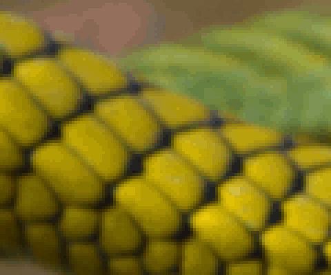
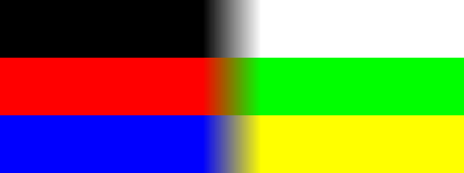
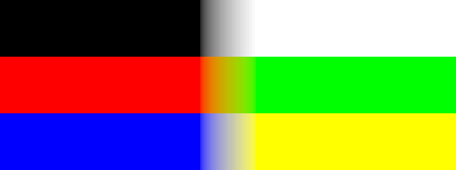
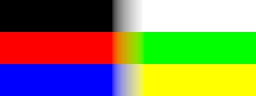
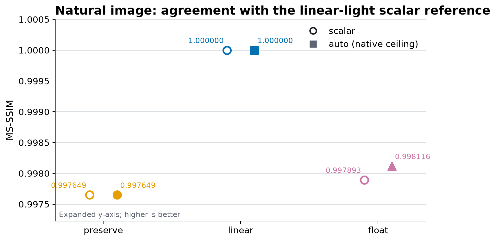
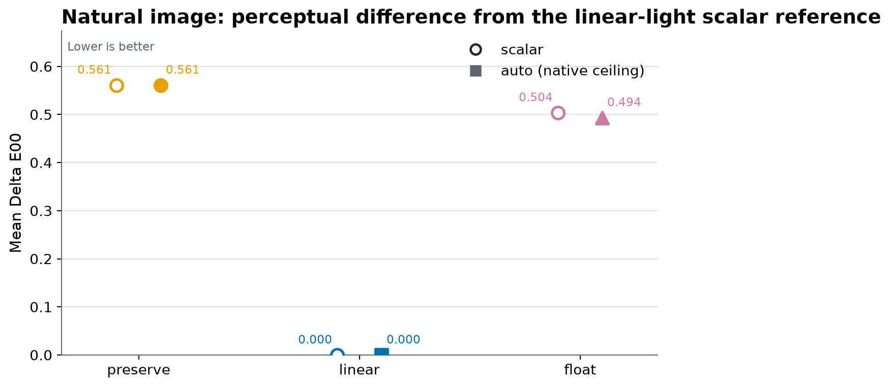
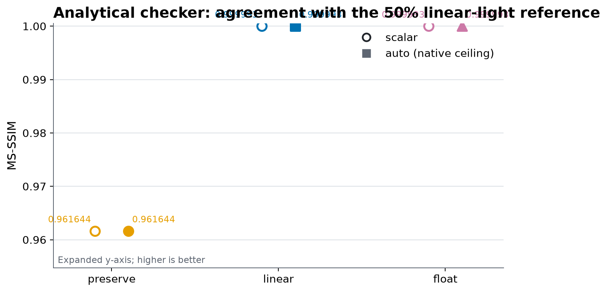
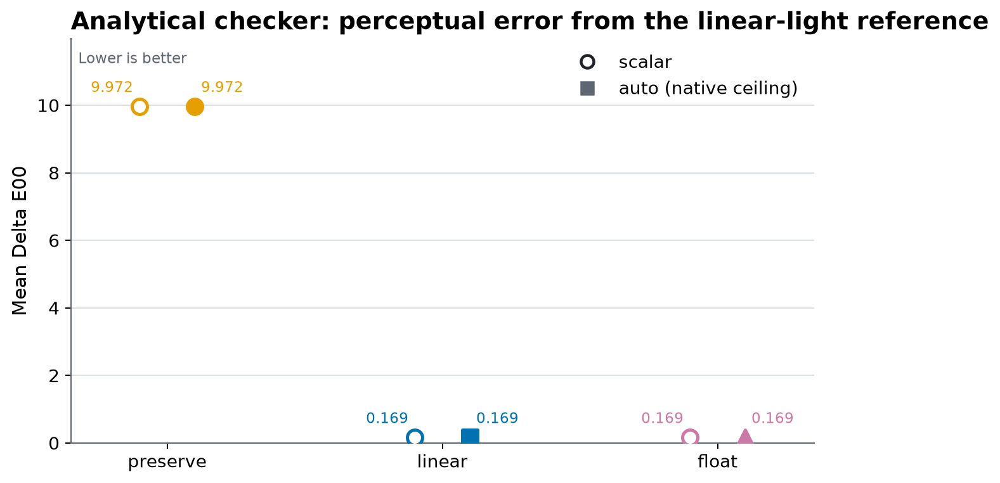
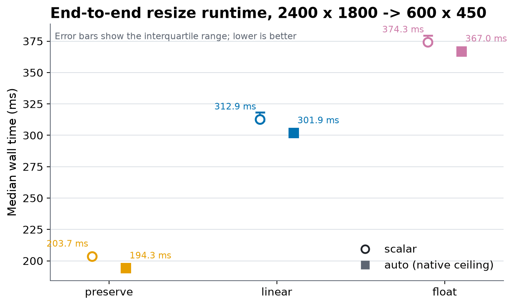
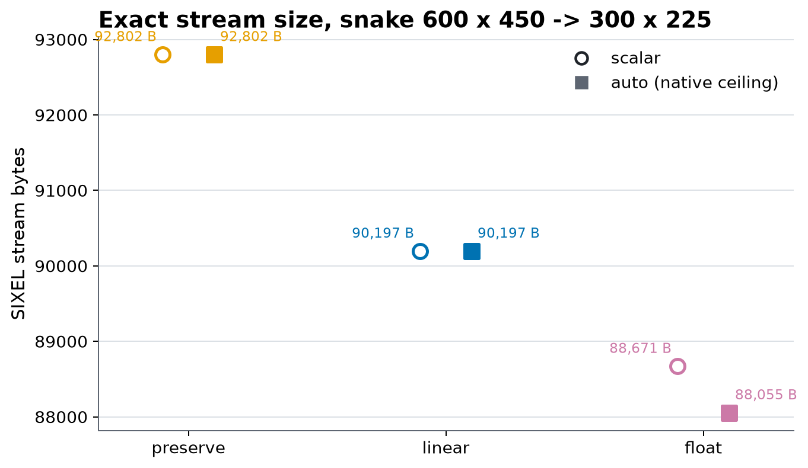

# Crop and Resize

## Scope

Crop and resize are encoder preprocessing operations. They change the raster before palette construction, palette application, and SIXEL serialization; they do not ask the terminal to scale an encoded image, and they are not presentation policy for decoded SIXEL. This document covers `img2sixel` geometry, crop/resize ordering, resize precision and colorspace policy, its relationship with the SIMD ceiling, measured output quality, speed, and stream size, transparency, and the public frame helpers.

The selected resampling method is deliberately treated as an independent concern. This document states where it acts and fixes bilinear for the policy comparison; [Resampling](resampling.md) describes coordinates, kernels, support, edge normalization, threading, and SIMD dispatch in detail.

The broader pipeline is described in the [Encoding Pipeline](encoding-pipeline.md), the concrete planner path in the [Encoder Execution Map](encoder-execution-map.md), and the command-order exception in the [CLI Design Policy](../cli/design-policy.md).

## Processing model

The normal geometry path is:

```text
loaded frame
  -> optional early crop in loaded-frame coordinates
  -> optional conversion or promotion to the resize representation
  -> optional resampling
  -> optional conversion to the requested working representation
  -> optional late crop in resized-frame coordinates
  -> palette construction/application and SIXEL encoding
```

Only one crop and one resize operation are configured. The relative position of the effective `-c` option and the effective `-w` or `-h` options decides whether crop occupies the early or late slot. The planner owns conversion around resize; those conversions do not add another geometry pass.

<picture>
  <source media="(max-width: 640px)" srcset="crop-resize/figures/crop-resize-policy-path-mobile.svg">
  
</picture>

*Figure 1. Resize precision is a planner path; resampling is an explicit stage within every path. The selected kernel is orthogonal to `resize_precision`, while the runtime SIMD base limits eligible kernel implementations.*

Loading has already produced the frame on which these coordinates operate. Format-specific orientation, canvas, and page handling belong to the selected loader; crop coordinates are not raw offsets into the encoded source file.

## Cropping

`-c REGION` and `--crop=REGION` accept one fixed pixel grammar:

```text
WIDTHxHEIGHT+X+Y
```

`WIDTH` and `HEIGHT` must be positive decimal integers. `X` and `Y` must be non-negative decimal integers measured from the top-left corner of the frame entering the crop operation. Negative offsets, omitted offsets, alternate separators, percentages, and terminal-cell units are rejected.

For example, this selects a 320-by-200 rectangle whose top-left pixel is 40 pixels from the left edge and 20 pixels from the top edge:

```sh
img2sixel -c 320x200+40+20 input.png
```

Cropping does not add padding. When a requested rectangle starts inside the frame but extends past its right or bottom edge, libsixel shortens the effective width or height to the available pixels. When its origin is on or beyond an edge, the effective rectangle is empty and the CLI crop filter leaves the frame unchanged. Callers that need an empty result, padding, or an error for a non-overlapping rectangle must validate the region before invoking `img2sixel`.

## Resize dimensions

`-w WIDTH` / `--width=WIDTH` and `-h HEIGHT` / `--height=HEIGHT` configure the two axes of one resize operation.

| Form | Meaning |
| --- | --- |
| `auto` | Leave this axis unconstrained and derive it from the other explicit axis while preserving aspect ratio. This is the default. |
| `NUMBER` | Set the axis to `NUMBER` pixels. |
| `NUMBERpx` | Set the axis to `NUMBER` pixels; this is equivalent to the bare number. |
| `NUMBER%` | Multiply the corresponding dimension of the frame entering resize by `NUMBER / 100`. |
| `NUMBERc` | Multiply `NUMBER` by the terminal's reported cell width or cell height. |

All numeric values must be positive integers. Percentage dimensions use integer division and therefore round down, with a one-pixel minimum. When exactly one axis is explicit, the derived aspect-preserving axis rounds up:

```text
derived_height = ceil(source_height * target_width / source_width)
derived_width  = ceil(source_width  * target_height / source_height)
```

When both axes are `auto`, resize is inactive. The percentage is evaluated against the frame that reaches resize, so crop-before-resize measures percentages against cropped dimensions and resize-before-crop measures them against the loaded frame.

When both axes are explicit, libsixel uses both values independently and does not preserve aspect ratio. The two values may use different forms, such as `-w 50% -h 20c`.

For an 800-by-600 input, representative results are:

| Options | Resize result | Reason |
| --- | --- | --- |
| `-w 400` | 400 by 300 | Height is derived from aspect ratio. |
| `-h 300px` | 400 by 300 | Width is derived from aspect ratio. |
| `-w 50%` | 400 by 300 | Width is halved, then height is derived. |
| `-w 400 -h 200` | 400 by 200 | Both axes are explicit, so the image is stretched. |
| `-w auto -h 300` | 400 by 300 | `auto` removes the width constraint. |

The frame resize API accepts dimensions up to `SIXEL_WIDTH_LIMIT` and `SIXEL_HEIGHT_LIMIT`, currently 1,000,000 pixels per axis, subject to checked buffer-size arithmetic and successful allocation. Percentage target calculations are clamped to those limits; an oversized explicit target is rejected by the frame resize path.

### Terminal-cell units

The `c` suffix converts cells to pixels before image loading. On supported systems, `img2sixel` opens `/dev/tty`, queries `TIOCGWINSZ`, and derives cell size from the reported pixel and row/column dimensions. The option fails when no controlling terminal is available, the platform does not support the query, or the terminal reports only rows and columns without usable pixel dimensions.

Cell units describe terminal geometry observed while parsing the option. They do not embed cell metadata in the SIXEL stream, and later terminal font or window changes do not alter the already computed pixel target.

## Crop and resize order

Crop and resize are non-commutative, so `img2sixel` intentionally treats their relative command-line order as meaningful:

```sh
# Select source pixels first, then scale the selected rectangle.
img2sixel -c 320x200+40+20 -w 640 input.png

# Scale the source first, then select pixels in resized coordinates.
img2sixel -w 640 -c 320x200+40+20 input.png
```

For an 800-by-600 input, the following pair also shows that a percentage has a different reference frame in the two orders:

```sh
# 400x300 crop, then 50% resize: 200x150 output.
img2sixel -c 400x300+0+0 -w 50% input.png

# 50% resize to 400x300, then the same crop: 400x300 output.
img2sixel -w 50% -c 400x300+0+0 input.png
```

Repeated crop values replace the previous crop geometry. Repeated width and height values replace only their own axes. Swapping `-w` and `-h` never creates two resize passes. After replacements are resolved, the last occurrence across the crop family and the resize-dimension family determines which operation runs first. `-r` selects the resize method but does not participate in this ordering rule.

All other encoder options retain their stage-defined order. The geometry exception does not make the rest of the command line an image-operation stack.

## Resampling selection

`-r METHOD` and `--resampling=METHOD` select the method used by resize. The default is `bilinear`; the accepted values are `nearest`, `gaussian`, `hanning`, `hamming`, `bilinear`, `welsh`, `bicubic`, `lanczos2`, `lanczos3`, and `lanczos4`. Without an active `-w` or `-h`, the setting has no visible effect.

`nearest` selects source samples directly. Every other method performs normalized, separable horizontal and vertical filtering. Wider bicubic and Lanczos kernels use more neighboring samples and can retain apparent sharpness, but may ring near a strong edge. The implementation details and kernel figures are in [Resampling](resampling.md).

## Resize precision and colorspace

The runtime subpolicy `resize_precision` controls the representation in which resampling mixes samples. It is not a synonym for the selected kernel and is not merely an output-storage choice.

| Policy | Resize input for ordinary gamma `RGB888` | Mixing behavior | Main work after resize | Practical use |
| --- | --- | --- | --- | --- |
| `preserve` | `RGB888` | Mixes gamma-coded byte values directly. | Usually remains `RGB888`. | Lowest temporary RGB storage and fastest measured path, with incorrect light mixing at contrasting boundaries. |
| `linear` | Promoted `LINEARRGBFLOAT32` | Converts gamma RGB to linear light before filtering. | Converts to the requested work format, normally `RGB888`. | Default quality-preserving resize without forcing the later pipeline to retain float32. |
| `float` | Promoted `LINEARRGBFLOAT32` | Uses the same linear-light resize representation as `linear`. | Retains a compatible float32 work frame; for `-W gamma`, this is `RGBFLOAT32`. | Keeps precision for later palette work as well as resize, at higher memory and measured runtime cost. |

The controls compose in one `-j` argument:

```sh
# Native SIMD ceiling, ordinary linear-light resize.
img2sixel -jauto:resize_precision=linear -w 50% input.png

# Force scalar kernels while keeping linear-light mixing.
img2sixel -jscalar:resize_precision=linear -w 50% input.png

# Native SIMD ceiling, lower-memory gamma-coded byte resize.
img2sixel -jauto:resize_precision=preserve -w 50% input.png

# Native SIMD ceiling and retained float32 work after resize.
img2sixel -jauto:resize_precision=float -w 50% input.png
```

Explicit `--precision=float32` also requests a float32 main work path. A non-gamma working space can require float32 independently of `resize_precision`; the planner therefore resolves the effective path from all precision and colorspace constraints. Allocation failure in the float resize path is an error rather than an automatic fallback to `preserve`, because fallback would silently change image values.

Use `-v` with `SIXEL_TRACE_TOPIC=runtime_contract` when validating a run. The planner trace reports `source`, `work`, `scale_out`, resize mode, resize input format, requested SIMD cap, native capability, and effective cap. The checked measurement metadata records the complete six-case preflight matrix rather than inferring it from the command line.

The broader storage contract and main-pipeline precision effects are described in [Pixel-Format Precision](../concepts/pixelformat-precision.md) and [Encoder Working Precision](precision.md).

## Relationship with the SIMD policy

The base of `-j POLICY[:KEY=VALUE]` selects a runtime SIMD ceiling: `auto`, `none`/`scalar`, `sse2`, `avx`, or `neon`. The `resize_precision` suboption selects the semantic policy path. The two decisions are related because byte and float32 filtered resamplers have eligible scalar and SIMD implementations, but neither decision replaces the other.

In the measured default-gamma path:

- `preserve` reaches the byte RGB resampler;
- `linear` and `float` reach the linear RGB float32 resampler;
- `auto` resolved to NEON on the measured arm64 host, while `scalar` resolved to level 0;
- the RGB888-to-float promotion and current generic float colorspace conversion remained scalar, so `auto` did not vectorize the whole path;
- palette construction and SIXEL serialization remained common downstream work and are included in the end-to-end timing.

The SIMD ceiling does not promise byte-identical output. Scalar and vector kernels can accumulate and round through different instruction sequences. In this fixture `preserve` and `linear` produced byte-identical scalar/NEON streams, while retained-float `float` produced different streams and a small metric difference. That is an implementation result for this host and image, not a cross-platform identity contract.

## Visual comparison

Every image below is a raw PNG decoded from the exact generated SIXEL stream. No labels, separators, or enhancement were composited into the evidence images. The columns are placed by Markdown only.

### Full 300-by-225 output

| `preserve + auto` | `linear + auto` | `float + auto` |
| --- | --- | --- |
|  |  |  |

*Figure 2. Full-frame outputs for the three resize-precision policies. Natural imagery makes the differences intentionally subtle; inspection should be paired with the magnified crop and measurements below.*

### Four-times nearest-neighbor inspection crop

| `preserve + auto` | `linear + auto` | `float + auto` |
| --- | --- | --- |
|  |  |  |

*Figure 3. The exact output rectangle `(x=0, y=65, width=120, height=100)`, enlarged to 480 by 400 with nearest-neighbor scaling for display. The enlargement adds no interpolated colors.*

### Few-color bilinear boundaries

The natural image still makes the colorspace effect easy to miss. The following controlled fixture starts as an 8-by-192 image with three hard, two-color vertical boundaries: black/white in the top band, red/green in the middle band, and blue/yellow in the bottom band. Each result is an actual 513-by-192 `img2sixel -rbilinear` output decoded through `sixel2png`.

| `preserve + auto` | `linear + auto` | `float + auto` |
| --- | --- | --- |
|  |  |  |

*Figure 4. Gamma-coded interpolation creates a visibly darker transition through the midpoint. The `linear` and `float` paths interpolate energy in linear light and therefore remain brighter when encoded back to gamma RGB.*

The center output sample at `x=256` makes the distinction explicit:

| Boundary | `preserve + auto` midpoint RGB | `linear + auto` midpoint RGB | `float + auto` midpoint RGB |
| --- | ---: | ---: | ---: |
| black / white | `128 / 128 / 128` | `189 / 189 / 189` | `189 / 189 / 189` |
| red / green | `128 / 128 / 0` | `189 / 189 / 0` | `189 / 189 / 0` |
| blue / yellow | `128 / 128 / 128` | `189 / 189 / 189` | `189 / 189 / 189` |

A direct 50/50 average of gamma-coded endpoints is 127.5, which becomes the observed byte value 128. A 50/50 average of linear-light black and white converts back to approximately sRGB 188; the decoded SIXEL snapshot is 189 because SIXEL type-2 RGB palette components are serialized at integer percentage resolution. The checked raw samples are in [`crop-resize-boundary-samples.csv`](crop-resize/measurements/crop-resize-boundary-samples.csv).

## Measured quality, speed, and size

### Protocol

The checked comparison was generated from revision `cf9bad2a3bb8a83f0ff87192ef1a9da7ac698fc3` on macOS 26.5.1 arm64. The build used `CC=gcc` with `-O3 -std=c99`; on this host that driver is Apple clang. `auto` resolved to NEON and `scalar` to level 0. The input was the tracked 600-by-450 [`images/snake.png`](../../images/snake.png), and the natural-image target was 300 by 225.

All cases fixed the builtin loader, one encoder thread, 8-bit base precision, bilinear resampling, the gamma clustering/working/output spaces, a deterministic 256-color k-means model, full-frame sampling, hard binning, no final merge or cover policy, no diffusion, no lookup acceleration, no GPU, RGB palettes, and fast SIXEL encoding. Each `.six` stream was decoded through `sixel2png -jscalar`; quality was measured with `lsqa -Woklab -Pfloat32`. The natural-image reference is the decoded `linear + scalar` stream, so those metrics are identity by definition and describe policy distance rather than fidelity to an unavailable continuous original.

The analytical checker is a separate semantic fixture: a one-pixel black/white checker is reduced from 600 by 450 to 300 by 225, and the reference is the sRGB encoding of 50% linear light. This isolates the correctness of light mixing from the palette differences of a natural-image self-reference.

### Quality

| Fixture | Policy | Scalar MS-SSIM / mean Delta E00 | Auto MS-SSIM / mean Delta E00 |
| --- | --- | ---: | ---: |
| natural image vs linear-scalar snapshot | `preserve` | `0.997649 / 0.561089` | `0.997649 / 0.561089` |
| natural image vs linear-scalar snapshot | `linear` | `1.000000 / 0.000000` | `1.000000 / 0.000000` |
| natural image vs linear-scalar snapshot | `float` | `0.997893 / 0.503848` | `0.998116 / 0.493551` |
| analytical checker vs 50% linear-light gray | `preserve` | `0.961644 / 9.971917` | `0.961644 / 9.971917` |
| analytical checker vs 50% linear-light gray | `linear` | `0.999993 / 0.168512` | `0.999993 / 0.168512` |
| analytical checker vs 50% linear-light gray | `float` | `0.999993 / 0.168512` | `0.999993 / 0.168512` |



*Figure 5. Natural-image MS-SSIM against the decoded `linear + scalar` reference. The expanded axis makes small policy differences visible.*



*Figure 6. Natural-image perceptual color difference against the same reference. Lower is better.*



*Figure 7. Checker agreement with the analytical 50% linear-light gray. `preserve` misses the repository's normal 0.98 MS-SSIM target; `linear` and `float` are effectively exact after the SIXEL percentage boundary.*



*Figure 8. Checker perceptual color error. The large `preserve` error is the darker gamma-coded average shown directly in Figure 4.*

The natural result does not rank `float` below `preserve` in general. It measures distance from one `linear + scalar` post-SIXEL snapshot, and `float` intentionally retains higher precision into later palette work. The analytical checker supplies the direct light-mixing correctness test.

### End-to-end speed

The speed fixture enlarges the tracked snake to 2400 by 1800 with nearest-neighbor replication, then each measured command reduces it to 600 by 450. Every case uses two warmups and nine timed runs in a deterministic interleaved order. The graph reports the median and interquartile range of complete `img2sixel` wall time, including loading, conversion, resampling, palette work, and serialization; it is not a resize-only microbenchmark.

| Policy | Scalar median | Auto median | Auto change from scalar |
| --- | ---: | ---: | ---: |
| `preserve` | `203.7 ms` | `194.3 ms` | `-4.6%` |
| `linear` | `312.9 ms` | `301.9 ms` | `-3.5%` |
| `float` | `374.3 ms` | `367.0 ms` | `-1.9%` |



*Figure 9. End-to-end medians with interquartile ranges on the measured host. `preserve + auto` was fastest; the smaller SIMD percentage in the float paths is consistent with scalar promotion, colorspace conversion, and common downstream work remaining inside the interval.*

These timings are host- and build-specific. They show the magnitude and composition of the tradeoff for this run, not a portable throughput guarantee.

### Exact SIXEL stream size

Stream size was measured on the natural 600-by-450 to 300-by-225 outputs used for quality assessment. It is a result of the changed pixels reaching palette construction and encoding, not a direct target of resize precision.

| Policy | Scalar | Auto |
| --- | ---: | ---: |
| `preserve` | `92,802 B` | `92,802 B` |
| `linear` | `90,197 B` | `90,197 B` |
| `float` | `88,671 B` | `88,055 B` |



*Figure 10. Exact stream sizes. The smallest result in this fixture was `float + auto`, 5.1% below `preserve + auto`; another image or palette policy may reverse the ordering.*

## Transparency and indexed input

A frame can carry a binary transparent mask separately from its color samples. Crop applies the same rectangle to the color plane and mask. Resize converts the mask to float coverage, applies the selected resampling method, and classifies output coverage at a threshold of `0.5`; a sample at or above the threshold remains transparent.

Geometry processing of indexed transparent input can promote palette indices to RGB samples plus a transparent mask so interpolation does not treat a palette index as a color coordinate. Resize also prevents the loader's indexed-palette fast path from bypassing required color interpolation. These rules preserve omitted-pixel semantics through geometry, while the later alpha policy still decides how those pixels map to SIXEL painting and `P2` behavior. See [Pixel Formats and Alpha Representation](../concepts/pixelformat.md) and the [Alpha Policy](../loader/alpha-policy.md).

The transparent mask remains binary at the frame boundary; resize does not introduce fractional alpha into the SIXEL stream. Kernel choice can nevertheless move the `0.5` coverage boundary and therefore change which output pixels are omitted.

## Public C interfaces

The CLI builds geometry preprocessing from the same frame and scale primitives available to embedders:

| Interface | Contract |
| --- | --- |
| `sixel_frame_clip()` | Crops a frame in place and applies the same geometry to its transparent mask. The caller must provide a valid in-bounds rectangle; CLI intersection and empty-region behavior belong to the higher-level clip filter. |
| `sixel_frame_resize()` | Resizes a frame in place, normalizing the color plane to `RGB888`, and resizes any transparent mask with the same method. |
| `sixel_frame_resize_float32()` | Resizes an `RGBFLOAT32` or `LINEARRGBFLOAT32` frame in place without converting it to byte RGB, and resizes any transparent mask. Other float coordinate systems are not accepted directly. |
| `sixel_helper_scale_image()` | Scales caller-provided byte pixels into caller-provided storage. It does not update frame dimensions, ownership, palette, colorspace, or transparency metadata. |
| `sixel_helper_scale_image_float32()` | Float32 counterpart of the low-level scale helper, with the same metadata boundary. |

The public constants and declarations are in [`include/sixel.h.in`](../../include/sixel.h.in). Frame mutation is implemented in [`src/frame.c`](../../src/frame.c), filter-level geometry in [`src/filter-clip.c`](../../src/filter-clip.c) and [`src/filter-resize.c`](../../src/filter-resize.c), target planning in [`src/planner.c`](../../src/planner.c), and resampling in [`src/scale.c`](../../src/scale.c).

Do not infer a decode-time resize feature from these helpers. The generic decoded-pixel result reports the raster represented by the SIXEL input; display-specific scaling belongs to the consuming application's presentation layer.

## Reproducing and validating the evidence

The checked CSV files, raw decoded PNGs, independent graphs, preflight matrix, exact commands, program hashes, build settings, platform information, and artifact manifest are under [`crop-resize/measurements/`](crop-resize/measurements/). Policy diagrams are under [`crop-resize/figures/`](crop-resize/figures/). The workflow requires Python with Matplotlib, NumPy, and Pillow:

```sh
PYTHON=/path/to/python-with-matplotlib-numpy-pillow \
tools/reproduce_crop_resize_measurements.sh
```

The wrapper refuses to record durable measurements when tracked source changes are present. It builds libsixel, regenerates the wide and mobile policy SVGs, runs the policy/SIMD matrix, creates every raw comparison image and independent graph, and finally runs [`tools/check_crop_resize_measurements.py`](../../tools/check_crop_resize_measurements.py). Set `CROP_RESIZE_INPUT_LABEL` when invoking the workflow from an external checkout but retaining a stable logical fixture name.

The crop/resize ordering contract is exercised by [`tests/loader/builtin/1513_loader_builtin_pal8_trns_clipfirst_order_preserved.t`](../../tests/loader/builtin/1513_loader_builtin_pal8_trns_clipfirst_order_preserved.t). Filter dispatch and dimension mutation are covered by [`tests/processing/filter/0003_filter_resize.c`](../../tests/processing/filter/0003_filter_resize.c). Transparent-mask crop and resize behavior is covered by the frame tests beginning with [`tests/processing/frame/0003_frame_transparent_mask_clip.c`](../../tests/processing/frame/0003_frame_transparent_mask_clip.c).

The geometry suite under [`tests/processing/geometry/`](../../tests/processing/geometry/) compares every exposed method in representative downscale and upscale cases, checks dimension spellings, exercises the precision planner, and covers extreme resize and crop targets. Normal source changes in this area must pass `make staticcheck` followed by `make check`.
