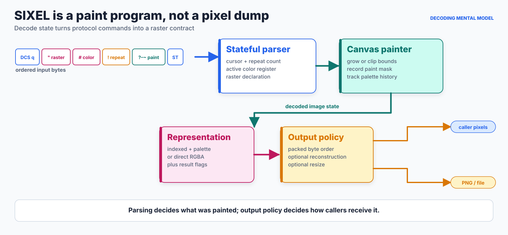
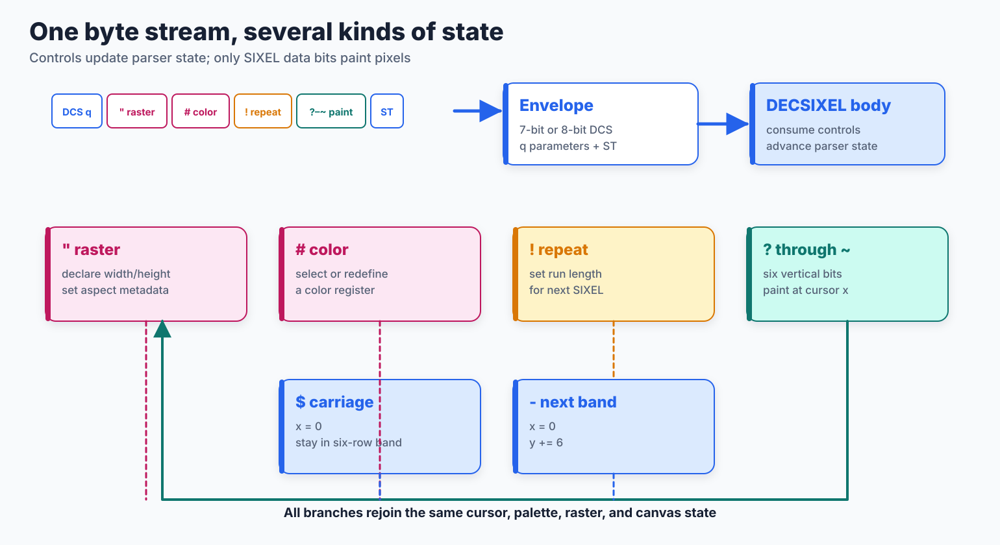
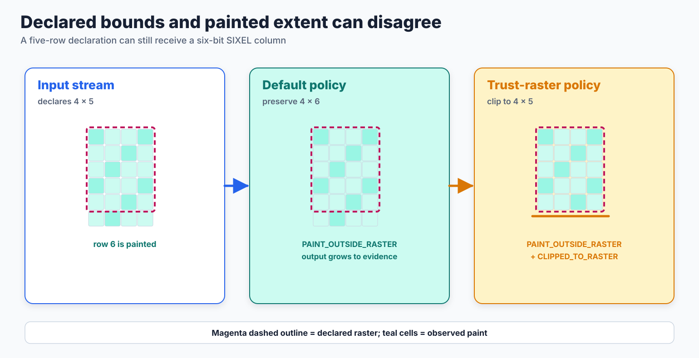
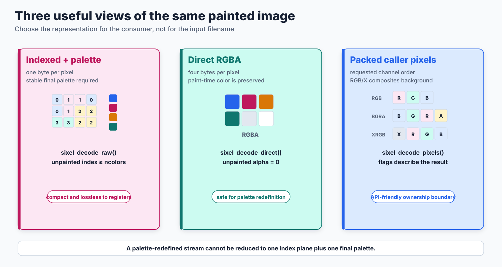
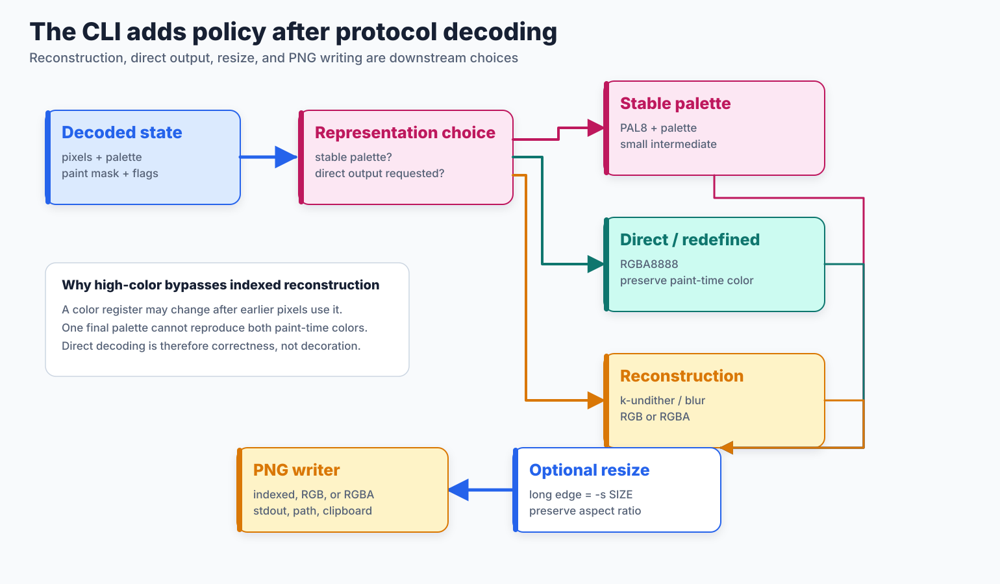
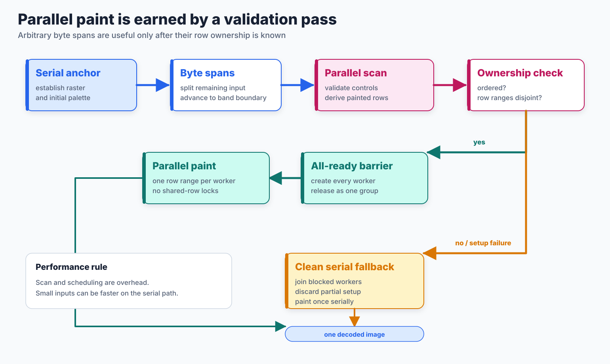

# Decoding Pipeline

## Mental model

SIXEL decoding is not encoding run backward. A SIXEL body is a small stateful paint program: controls move a cursor, select or redefine color registers, declare a raster, repeat the next paint operation, and paint six vertical bits at the current column. The decoder must preserve the result of executing those operations before it can choose an API or file representation.

<picture>
  <source media="(max-width: 640px)" srcset="decoding-pipeline-figures/decoding-pipeline-mobile.svg">
  
</picture>

*Figure 1. Introductory decoding model. Blue marks protocol and control flow, teal marks paint and safe parallel work, magenta marks palette and representation decisions, and amber marks downstream policy. Labels, line routes, and placement duplicate the color encoding. This is an architecture schematic, not a measured execution timeline.*

The decisive boundary is between **what the stream painted** and **how the consumer wants to receive it**. Parsing, cursor movement, raster growth, palette history, and the paint mask belong to the first question. Indexed versus direct pixels, packed channel order, dequantization, resizing, and PNG writing belong to the second.

For the wire syntax itself, start with the [SIXEL format guide](../sixel-format.md). For the opposite direction, see the [Encoding Pipeline](encoding-pipeline.md). This document follows the decoder from wire bytes to its library and `sixel2png` outputs.

## Entry points and ownership

The repository exposes several decoder entry points because no single representation is best for every consumer.

| Entry point | Input boundary | Output boundary | Intended use |
| --- | --- | --- | --- |
| `sixel_decode_raw()` | Complete SIXEL byte sequence | One-byte indexes, final RGB palette, dimensions, and color count | Compatibility and consumers that want the compact stable-palette representation |
| `sixel_decode_direct()` | Complete SIXEL byte sequence | RGBA8888 pixels and dimensions | Consumers that need paint-time colors, including streams that redefine palette registers |
| `sixel_decode_pixels()` | Complete in-memory SIXEL byte sequence | Caller-selected packed RGB, BGR, RGBA, ARGB, BGRA, ABGR, or X-channel layout plus stride and result flags | New code that wants an explicit packed-pixel contract |
| `sixel_decode_pixels_body()` | DECSIXEL body plus normalized DCS `q` parameters already extracted by the caller | Same result contract as `sixel_decode_pixels()` | Terminal parsers that already own DCS framing and must not reconstruct an artificial envelope |
| `sixel_decoder_decode_pixels()` | In-memory SIXEL bytes plus state configured on `sixel_decoder_t` | Packed pixels after optional reconstruction policy | Embedders that need decoder options such as dequantization |
| `sixel_decoder_decode()` | File, standard input, or configured platform input | PNG, standard output, file, or configured platform output | The stateful path used by `sixel2png` |

Returned buffers use the allocator supplied to the API or the decoder object's allocator. The caller must release those buffers through the matching allocator. The stateful decoder retains option state, but it does not transfer ownership of a returned `sixel_decode_result_t` buffer back to itself.

The deprecated `sixel_decode()` entry point remains layered on the indexed raw contract. Compatibility does not make it a direct-color API: an unpainted value is still a sentinel and must not be used as a palette index.

## Wire framing and parser state

The complete-stream APIs recognize the DCS envelope, its `q` final byte and parameters, the DECSIXEL body, and the string terminator. The body API deliberately begins after the caller has consumed those elements. The two entry routes then share the same body parsing and painting semantics.



*Figure 2. Simplified control-state map. The actual parser also validates numeric ranges, control ordering, allocation bounds, and termination. Dashed returns emphasize that each control rejoins shared decoder state rather than forming an independent image-processing stage.*

The main body controls have distinct effects:

- `"` records raster attributes, including declared width and height;
- `#` selects a color register or defines its RGB value;
- `!` applies a validated repeat count to the following SIXEL character;
- `?` through `~` supply the six vertical paint bits for the current column;
- `$` returns to column zero in the current six-row band;
- `-` returns to column zero and advances by six rows.

The active color register and cursor position are therefore part of decoding state, not metadata that can be interpreted after the pixel plane has been built. A palette redefinition after paint is particularly important: earlier pixels used the old register value, while later pixels use the new value.

## Raster declaration versus observed paint

Raster attributes are useful allocation evidence, but a real stream can paint outside its declared rectangle. This can happen naturally when a height is not a multiple of SIXEL's six-row unit, and malformed or producer-specific streams can disagree in either dimension.



*Figure 3. The default preserves observed paint and may grow beyond the declared raster. `SIXEL_DECODE_PIXELS_OPTION_TRUST_RASTER_SIZE` clips to the declaration. In both cases result flags retain evidence that paint addressed pixels outside the raster.*

Without `SIXEL_DECODE_PIXELS_OPTION_TRUST_RASTER_SIZE`, the declared raster seeds the canvas but does not erase contradictory paint evidence. The result can be larger than the declaration and reports `SIXEL_DECODE_PIXELS_RESULT_PAINT_OUTSIDE_RASTER`.

With the trust option, the declaration becomes a caller-authorized clipping boundary. Out-of-raster paint is discarded and the result reports both `PAINT_OUTSIDE_RASTER` and `CLIPPED_TO_RASTER`. This is an optimization for callers that already trust the producer, not a safe default for arbitrary input: it can intentionally remove pixels that the stream actually paints.

## Output representations



*Figure 4. The three output families answer different consumer needs. They are not interchangeable aliases.*

### Indexed pixels and a palette

The compact raw path stores one byte per pixel and returns a final RGB palette. Values in `[0, ncolors)` are palette indexes. A value greater than or equal to `ncolors` means transparent or unpainted and must never index the palette.

This representation exactly preserves a stable register assignment, but one index plane plus one final palette cannot reproduce a stream that changes a register after painting with it. `SIXEL_DECODE_PIXELS_RESULT_PALETTE_REDEFINED` exposes that history to newer callers.

### Direct RGBA

The direct painter stores the RGB value in effect when each pixel was painted. Unpainted pixels retain alpha zero, so palette redefinition and sparse paint remain representable. The cost is four bytes per pixel before any additional work buffers, rather than the indexed plane's one byte per pixel plus palette and mask data.

### Packed caller formats

`sixel_decode_pixels()` accepts all documented 24-bit RGB/BGR and 32-bit RGBA/ARGB/BGRA/ABGR/XRGB/RGBX/XBGR/BGRX layouts. Alpha-bearing formats preserve decoded alpha. RGB and X-channel formats cannot express transparency, so the decoder composites over `options->bgcolor`; every X byte is set to `0xff`. `SIXEL_DECODE_PIXELS_RESULT_ALPHA_OPAQUE` tells a caller when the result can be used through an opaque fast path.

The returned stride is part of the contract. Consumers must not infer it from width alone, even though current packed results are tightly laid out.

The broader distinction among memory layout, alpha, palette, and color interpretation is defined in [Pixel Formats and Alpha Representation](../concepts/pixelformat.md).

## Stateful reconstruction, resize, and PNG output

The stateful decoder used by `sixel2png` adds output policy after protocol parsing. These stages can change memory representation or image samples; they do not retroactively change what the SIXEL parser observed.



*Figure 5. Output-policy branches in the stateful decoder. The figure describes ownership and correctness choices, not a promise that every temporary allocation is present in every build or invocation.*

The normal stable-palette path can remain `PAL8` through the writer. `-D` requests direct RGBA. The `-d` family enables optional reconstruction such as k-undither or selective blur, producing RGB or RGBA samples intended to reduce visible palette-pattern artifacts. Reconstruction is heuristic: it cannot recover source colors that the SIXEL stream never encoded, and it should not be described as a lossless inverse of dithering.

When the stream redefines a palette register after paint, the stateful path bypasses indexed dequantization and uses direct paint-time colors. That bypass protects correctness because a final palette would reinterpret earlier pixels with the newest register value.

`sixel2png -s SIZE` sets the longer output edge to `SIZE` pixels, rounds the other dimension while preserving aspect ratio, clamps it to at least one pixel, and uses the shared bilinear frame resize. A resize promotes the writer input to the frame's direct representation when necessary. Resampling changes pixels and can soften or sharpen artifacts; it is an explicit presentation choice after decoding, not part of the SIXEL grammar.

The final writer accepts indexed, RGB, or RGBA input. A libpng-enabled build uses libpng, while a build without libpng uses the builtin PNG writer. Backend choice can change compressed bytes and speed but not the documented PNG color-class contract. See the [PNG Writer](../writers/png.md) for backend details and its own reciprocal test inventory.

## Parallel decoder path

An arbitrary byte offset cannot be mapped to an output row without parsing the controls before it. The parallel decoder therefore starts with a serial anchor, divides only the remaining bytes, validates and reconstructs local state for each span, derives row ownership, and paints concurrently only after proving those row ranges are ordered and disjoint.



*Figure 6. Safety structure of the normal parallel direct path. Validation scan is real work, and serial fallback is a normal correctness path rather than an error result.*

All paint workers wait behind one release barrier. If a worker cannot be created, workers already created are joined while still blocked so no partial paint reaches the shared image. Overlapping ownership, repeat overflow, or another condition that prevents safe independent paint also selects a clean serial fallback.

Parallelism is therefore expected to preserve the same observable image as serial decoding. It is a performance policy, not a quality policy. The complete worker-budget semantics, row-range proof, fallback conditions, and reproducible measurements are in [Decoder Threading](../threading/decoder.md).


*Figure 7. Checked-in `sixel2png` measurement from the threading study. Decoder scan and paint are followed by PNG serialization; the PNG interval is end-to-end CLI context, not decoder worker time. Consult the threading document for host, sample count, worker budget, and measurement method.*

## Performance and memory model

Let `B` be the input byte count and `P = width × height` the returned pixel count. A serial decode is usefully accounted for as `parse_and_paint(B) + materialize(P)`. Optional reconstruction and resize add further pixel-proportional passes; PNG compression adds a separate writer cost whose constant factors depend on backend and image content.

The indexed path uses approximately one byte per pixel plus palette and paint-state storage. Direct RGBA uses four output bytes per pixel. Packed conversion may require both an intermediate RGBA image and the requested destination buffer. Dequantization and resizing introduce their own source, destination, mask, or work buffers, so peak memory must be evaluated by execution path rather than by final file size.

Parallel decoding adds a validation scan, span state, row-range analysis, worker setup, and synchronization before paint. Those fixed costs can make small inputs slower than the serial path. On sufficiently large inputs, disjoint paint ranges can amortize the scan and scheduling cost. The checked-in threading measurements deliberately separate decoder intervals from PNG serialization so a slow writer is not misreported as a decoder scaling failure.

`TRUST_RASTER_SIZE` can bound growth and avoid preserving contradictory out-of-raster paint, but its performance value does not override its semantic tradeoff. Callers should choose it from producer trust, not from an assumption that every SIXEL file obeys its declaration.

## Quality and user experience

The decoder's first quality obligation is faithful paint execution. Stable-palette indexed output, direct paint-time output, result flags, and a transparent paint mask preserve different parts of that evidence. Silently forcing every stream through one final palette would make high-color images wrong; silently clipping every stream to raster attributes would make producer disagreements invisible.

The second obligation is an explicit presentation choice. Dequantization may make a displayed image look smoother, and resize may make it fit a downstream use, but both alter samples. Defaults and diagnostics should keep those changes distinguishable from parsing. For automated consumers, packed byte order, stride, alpha behavior, dimensions, status, and ownership are more important than visual plausibility.

`sixel2png` does not require a SIXEL-capable terminal: it consumes control bytes and writes PNG to standard output, a path, or an enabled platform destination. This makes it suitable for pipes and offline inspection. A failure returns a status and diagnostic rather than a partially declared successful result. Applications embedding the library should propagate the formatted status and additional message while retaining their own input provenance.

## Build and platform guidance

The decoding APIs are part of the library build. The `sixel2png` utility is enabled by default but can be omitted with Autotools `--disable-sixel2png` or the Meson `-Dsixel2png=disabled` feature setting. Tests that require the utility report a skip when it is not built.

Thread support is selected independently. Autotools `--disable-threads` or Meson `-Dthreads=disabled` leaves the serial decoder available. When a supported thread backend is enabled, `--threads=N` supplies a decoder worker budget; it is not a process-wide operating-system thread limit. The platform and compiler matrix is maintained in [Build, Runtime, and Platform Support](../platform-support.md), while [Threading Overview](../threading/overview.md) defines the worker-budget vocabulary.

PNG output does not require an external libpng because the repository includes a builtin writer. Clipboard and other platform destinations do depend on their configured backend. Windows binary-mode handling, WebAssembly launch arrangements, OpenVMS command execution, and optional platform services belong to the platform layer; they do not define different SIXEL paint semantics.

## Implementation map

| Boundary | Principal implementation | Responsibility |
| --- | --- | --- |
| Public contracts | [`include/sixel.h.in`](../../include/sixel.h.in) | Raw, direct, packed, body, stateful, option, flag, allocator, and ownership declarations |
| Parser and painter | [`src/fromsixel.c`](../../src/fromsixel.c) | DCS/body states, numeric controls, cursor movement, palette registers, canvas growth, masks, raster-policy flags, raw indexes, and direct RGBA |
| Packed conversion | [`src/sixel_decode_pixels.c`](../../src/sixel_decode_pixels.c) | Preferred layout validation, alpha/background handling, channel packing, stride, and result publication |
| Stateful policy | [`src/decoder.c`](../../src/decoder.c) | Input acquisition, decoder options, reconstruction, palette-redefinition bypass, resize, destination selection, and writer invocation |
| Parallel execution | [`src/decoder-parallel.c`](../../src/decoder-parallel.c) | Span scan, local state, row ownership, barrier, direct paint, fused reconstruction paths, and clean fallback |
| PNG boundary | [`src/writer.c`](../../src/writer.c) | Indexed, RGB, and RGBA PNG serialization through libpng or builtin code |
| CLI frontend | [`converters/sixel2png.c`](../../converters/sixel2png.c) | Process arguments, environment and diagnostic policy, stateful decoder setup, exit status, and user-facing help |

## Figure provenance

Figures 1 through 6 are deterministic architecture diagrams generated by [`tools/plot_decoding_pipeline_figures.py`](../../tools/plot_decoding_pipeline_figures.py). Their machine-readable role and color metadata is recorded in [`decoding-pipeline-figures.json`](decoding-pipeline-figures/decoding-pipeline-figures.json). Regenerate or verify them with:

```sh
tools/reproduce_decoding_pipeline_figures.sh
tools/reproduce_decoding_pipeline_figures.sh --check
```

Figure 7 belongs to the measured threading suite and is regenerated through the workflow documented in [Decoder Threading](../threading/decoder.md).

## Coverage audit

The audit followed the pipeline rather than counting test filenames. It checked wire entry, paint semantics, raster policy, representation, transparency and palette history, reconstruction, resize, PNG handoff, parallel equivalence, failure fallback, and platform-conditioned execution.

| Area | Assessment after this change | Evidence or remaining gap |
| --- | --- | --- |
| Complete stream versus body entry | Focused | DP-06 compares complete and body APIs for dimensions, pixels, format, stride, and flags. |
| Core paint operations | Focused for color selection, overlay, repeat, carriage/band split interactions | DP-01 through DP-04 and DP-13 cover raw, direct, legacy, repeat, and split behavior. There is no single table-driven test that enumerates every accepted numeric/control syntax. |
| Raster disagreement | Focused | DP-07 covers preserve versus trusted clipping and both result flags. |
| Packed output layouts | Focused | DP-05 now enumerates every format accepted by `sixel_decode_pixels()`, including the formerly untested 24-bit and alpha-bearing layouts. |
| Transparency and mask propagation | Focused for packed, dequantized, and sparse direct output | DP-08, DP-10, and DP-14 cover alpha opacity, transparent neighbors, and sparse paint. The raw indexed `index >= ncolors` sentinel is a documented public contract but still lacks a dedicated one-observation regression test. |
| Palette redefinition | Focused | DP-11 proves the result flag and direct bypass for high-color-style paint history. |
| Reconstruction | Focused across representative algorithms and parallel equivalence | DP-08 through DP-12 cover defaults, thresholds, transparency, opacity, and scalar/parallel agreement. They do not constitute a perceptual claim that reconstruction recovers the unknown source image. |
| Resize | Focused at the CLI geometry boundary | DP-16 adds the previously missing `-s` longer-edge and aspect-ratio observation. Filter-level resize quality and alpha-mask behavior remain owned by the frame/scale suites. |
| PNG handoff | Focused by output class | DP-17 through DP-19 reuse the writer policy's indexed, RGB, and RGBA IHDR observations. Compression identity across backends is intentionally outside the contract. |
| Parallel correctness and fallback | Strong focused coverage | DP-13 through DP-15 and DP-20 through DP-25 cover split boundaries, serial equivalence, sparse paint, repeat overflow, overlap, worker-creation failure, the all-ready barrier, and paired timeline spans. |
| Malformed input and resource ceilings | Broad elsewhere, not exhaustively mapped here | Security regressions and fuzz targets exercise parser hardening, but this pipeline document does not claim a complete grammar-by-failure inventory. Exact maximum dimensions, every allocation site, all terminator variants, and every integer boundary remain candidates for a separate adversarial decoder contract. |
| Platform-conditioned behavior | Structural plus matrix coverage | The same library tests run across configured targets; CLI and thread tests skip when their required build feature is absent. This document does not treat a skipped case as evidence for that platform configuration. |

The two concrete gaps found during this audit were actionable and bounded: supported packed output formats were only partially enumerated, and stateful `sixel2png -s` geometry had no focused test. DP-05 and DP-16 close those gaps. The raw indexed sentinel and a systematic 7-bit/8-bit envelope-and-terminator matrix remain the highest-value focused follow-ups; malformed-stream completeness should be designed together with the security and fuzz inventories rather than represented by a long, manually duplicated list here.

## Test coverage

<!-- test-coverage: enforced -->

Each row is one independently reportable observation. Every owning test links back to this document through a `Policy:` comment, and `staticcheck-doc-test-links` verifies both directions.

| ID | Pipeline contract | Owning test |
| --- | --- | --- |
| DP-01 | Raw indexed decoding executes color-register selection and OR-mode overlay. | [tests/processing/decoder/0002_decoder_ormode_raw_overlay.t](../../tests/processing/decoder/0002_decoder_ormode_raw_overlay.t) |
| DP-02 | Direct decoding preserves the paint result as RGBA through OR-mode overlay. | [tests/processing/decoder/0004_decoder_ormode_direct_overlay.t](../../tests/processing/decoder/0004_decoder_ormode_direct_overlay.t) |
| DP-03 | Repeat controls apply the requested overlay run. | [tests/processing/decoder/0005_decoder_ormode_repeat_overlay.t](../../tests/processing/decoder/0005_decoder_ormode_repeat_overlay.t) |
| DP-04 | The deprecated compatibility API retains the raw indexed paint contract. | [tests/processing/decoder/0006_decoder_ormode_legacy_api.t](../../tests/processing/decoder/0006_decoder_ormode_legacy_api.t) |
| DP-05 | Every packed format accepted by `sixel_decode_pixels()` returns the requested channel order and stride, with opaque-result signaling. | [tests/processing/decoder/0008_decoder_pixels_output_formats.t](../../tests/processing/decoder/0008_decoder_pixels_output_formats.t) |
| DP-06 | Complete-stream and body-only entry points return the same dimensions, pixels, format, stride, and flags. | [tests/processing/decoder/0020_decoder_pixels_body_api.t](../../tests/processing/decoder/0020_decoder_pixels_body_api.t) |
| DP-07 | Default raster policy preserves out-of-raster paint while trust-raster policy clips and reports both conditions. | [tests/processing/decoder/0009_decoder_pixels_trust_raster_clip.t](../../tests/processing/decoder/0009_decoder_pixels_trust_raster_clip.t) |
| DP-08 | Packed output and every supported reconstruction method preserve alpha, ignore transparent neighbors, and report opacity correctly. | [tests/processing/decoder/0008_decoder_pixels_output_formats.t](../../tests/processing/decoder/0008_decoder_pixels_output_formats.t) |
| DP-09 | Stateful k-undither resolves to its documented default policy. | [tests/processing/decoder/0010_decoder_kundither_default.t](../../tests/processing/decoder/0010_decoder_kundither_default.t) |
| DP-10 | OR-mode selective-blur reconstruction returns an opaque direct result. | [tests/processing/decoder/0022_ormode_selective_blur_opaque.t](../../tests/processing/decoder/0022_ormode_selective_blur_opaque.t) |
| DP-11 | Palette redefinition is reported and bypasses indexed dequantization in favor of direct paint-time colors. | [tests/processing/decoder/0023_decoder_high_color_dequantize_bypass.t](../../tests/processing/decoder/0023_decoder_high_color_dequantize_bypass.t) |
| DP-12 | Selective-blur threshold policy changes the reconstructed result at the expected boundary. | [tests/processing/decoder/0021_decoder_selective_blur_threshold.t](../../tests/processing/decoder/0021_decoder_selective_blur_threshold.t) |
| DP-13 | A parallel split immediately after a next-band control preserves the serial result. | [tests/processing/decoder/0001_decoder_parallel_split_after_newline.t](../../tests/processing/decoder/0001_decoder_parallel_split_after_newline.t) |
| DP-14 | Sparse direct parallel painting preserves unpainted alpha. | [tests/processing/decoder/0018_decoder_parallel_direct_sparse_preserves_unpainted.t](../../tests/processing/decoder/0018_decoder_parallel_direct_sparse_preserves_unpainted.t) |
| DP-15 | Sparse parallel decoding is byte-equivalent to serial decoding. | [tests/processing/decoder/0017_decoder_parallel_sparse_split_matches_serial.t](../../tests/processing/decoder/0017_decoder_parallel_sparse_split_matches_serial.t) |
| DP-16 | `sixel2png -s` sets the longer edge and rounds the other dimension while preserving aspect ratio. | [tests/cli/sixel2png/0013_size_preserves_aspect_ratio.t](../../tests/cli/sixel2png/0013_size_preserves_aspect_ratio.t) |
| DP-17 | Stable-palette decoder output reaches the PNG writer as indexed 8-bit data. | [tests/writer/png/0001_indexed8_ihdr.t](../../tests/writer/png/0001_indexed8_ihdr.t) |
| DP-18 | Reconstructed decoder output reaches the PNG writer as direct RGB8 data. | [tests/writer/png/0002_rgb8_ihdr.t](../../tests/writer/png/0002_rgb8_ihdr.t) |
| DP-19 | Direct decoder output reaches the PNG writer as RGBA8 data. | [tests/writer/png/0003_rgba8_ihdr.t](../../tests/writer/png/0003_rgba8_ihdr.t) |
| DP-20 | Parallel setup failure leaves the image clean for serial fallback. | [tests/processing/decoder/0016_decoder_parallel_fallback_keeps_image_clean.t](../../tests/processing/decoder/0016_decoder_parallel_fallback_keeps_image_clean.t) |
| DP-21 | Partial paint-worker creation failure joins blocked workers and preserves clean fallback state. | [tests/processing/decoder/0025_decoder_paint_create_failure_clean.t](../../tests/processing/decoder/0025_decoder_paint_create_failure_clean.t) |
| DP-22 | Overlapping paint-row ownership selects a clean serial fallback. | [tests/processing/decoder/0026_decoder_paint_overlap_fallback_clean.t](../../tests/processing/decoder/0026_decoder_paint_overlap_fallback_clean.t) |
| DP-23 | Every direct paint worker reaches the release barrier before paint begins. | [tests/cli/sixel2png/0012_parallel_paint_barrier.t](../../tests/cli/sixel2png/0012_parallel_paint_barrier.t) |
| DP-24 | Parallel decoder scan and paint timeline spans have paired start and finish events. | [tests/cli/sixel2png/0011_parallel_timeline_spans_paired.t](../../tests/cli/sixel2png/0011_parallel_timeline_spans_paired.t) |
| DP-25 | A repeat that crosses a parallel span boundary falls back without retaining partial direct paint. | [tests/processing/decoder/0019_decoder_parallel_direct_repeat_overflow_fallback.t](../../tests/processing/decoder/0019_decoder_parallel_direct_repeat_overflow_fallback.t) |

### Coverage boundary

This inventory covers the stable behavior described by the pipeline and names residual gaps in the audit above. It does not make every internal buffer, heuristic intermediate, debug event, exact allocation ceiling, compressed PNG byte sequence, or scheduler timing a public compatibility surface. Fuzzing and security regression suites complement these positive and equivalence tests; passing either class alone is not evidence that the other class is complete.
