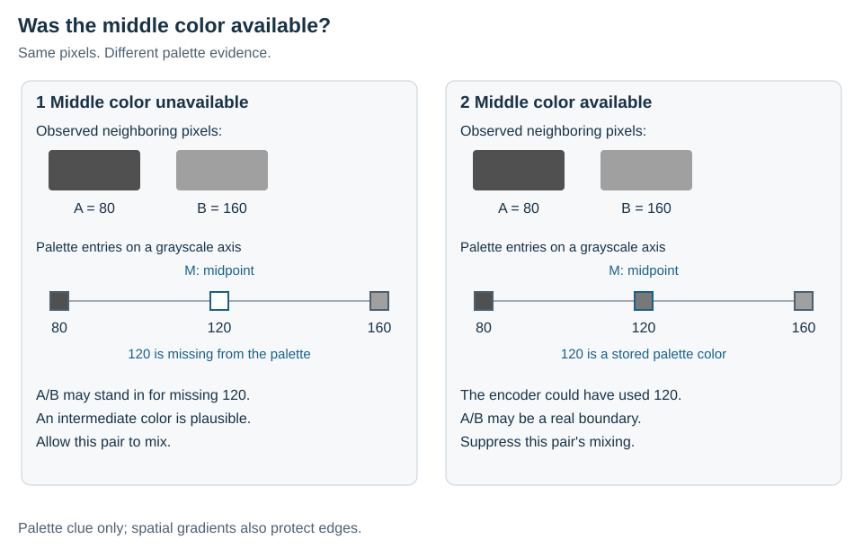
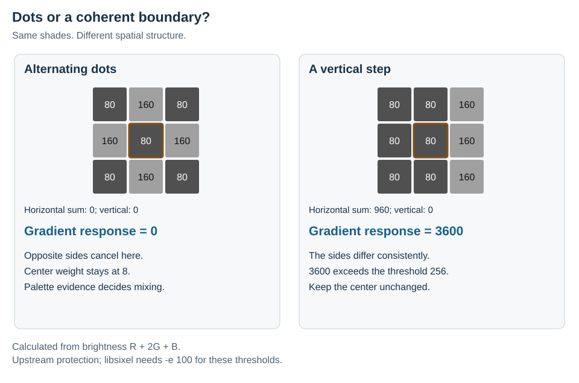
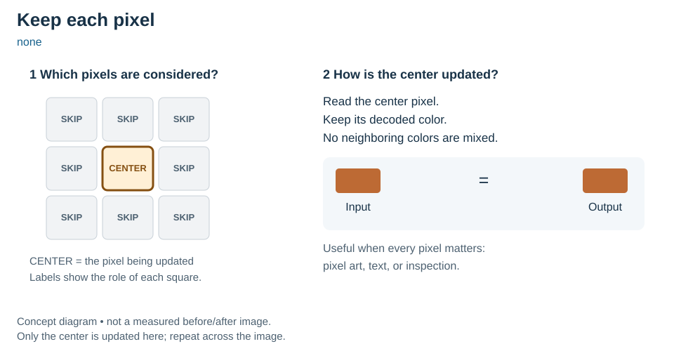
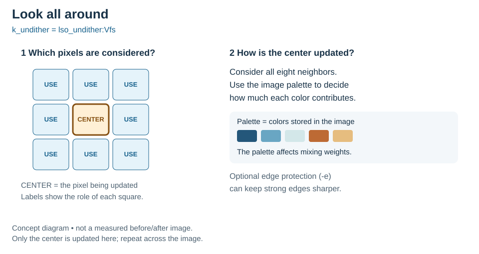
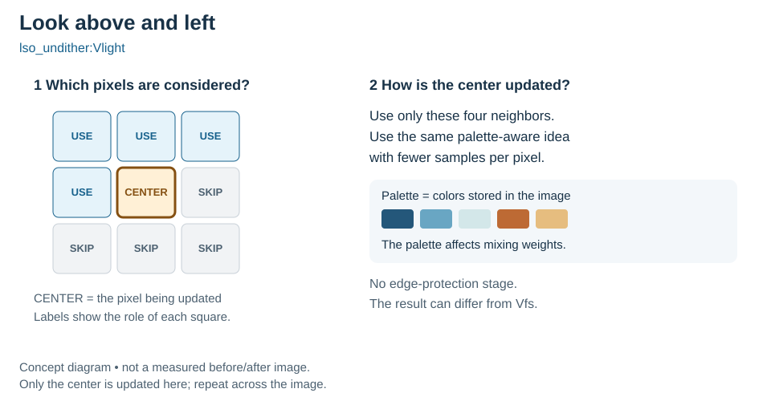
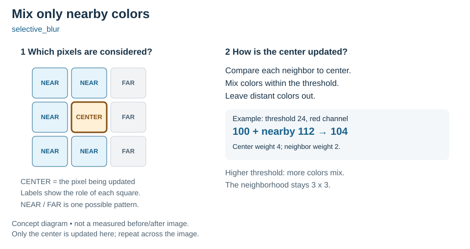

# Dequantization

A SIXEL image stores a limited set of colors, called a **palette**. To suggest an in-between color, an encoder can place dots of different colors next to each other. This is called **dithering**. The dots can look smooth from a distance but grainy when enlarged.

**Dequantization is an optional way to soften those dots after decoding.** It estimates a new color for each pixel using selected nearby pixels. It may make photographs and gradients look smoother, but may also soften text or fine detail. It cannot recover the original image exactly. By default, libsixel leaves it off (`none`).

Reading the palette and displaying its colors is ordinary decoding. Mixing those colors is the additional step explained here. The image keeps the same dimensions; resizing is a separate option. In file conversion, reconstruction runs before `sixel2png -s` resizes the result.

## Kornelski's undither: infer what the palette could not express

This chapter explains the upstream algorithm before describing libsixel's changes. The reference is the Rust implementation of [kornelski/undither at commit `844241504c7f`](https://github.com/kornelski/undither/tree/844241504c7f2b224c67761de277c2bb5c56ab81). Historical versions have different coefficients; “upstream” below means this specific revision.

### The missing-color clue

Imagine two neighboring pixels with colors A and B. Their difference has two possible explanations: the source really had a boundary, or the encoder alternated available colors to suggest a color it could not store. Looking only at A and B cannot settle that question. The palette supplies another clue: **which colors could the encoder have chosen instead?**

Consider their midpoint M. If the palette lacks a color near M, alternating A and B is a plausible substitute for an unavailable intermediate color. Mixing can reconstruct that intermediate shade. If a palette color already lies near M, the encoder could have used it directly; the observed A/B difference is stronger evidence for a real boundary, so mixing is suppressed. This is the central hypothesis described in the [upstream README](https://github.com/kornelski/undither/blob/844241504c7f2b224c67761de277c2bb5c56ab81/README.md).

<picture>
  <source media="(max-width: 640px)" srcset="dequantization-figures/palette-clue-mobile.svg">
  
</picture>

*The two panels keep the observed pixels fixed and change only the palette. The line is a grayscale slice through color space, not a row of image pixels. The midpoint is a hypothesis, not a known original color.*

### From a palette gap to a mixing weight

For each center/neighbor pair, [`Similarity::compare`](https://github.com/kornelski/undither/blob/844241504c7f2b224c67761de277c2bb5c56ab81/src/acc.rs) computes the RGB midpoint M, the squared distance `d` from M to A, and the nearest squared distance `q` from M to another palette entry, excluding the two endpoint entries. Small `q` relative to `d` discourages mixing; large `q` permits it. The resulting weight is used in a normalized average of the center and eligible neighbors. The implementation caches these pair decisions and uses a nearest-neighbor search that its own comment describes as approximate.

Thus “similarity” here is not just closeness of A and B. It is their compatibility with an intermediate-color explanation given the palette. The coefficient comparison in the next chapter shows the upstream weight levels alongside libsixel's replacements.

### The spatial-gradient clue

Palette evidence alone does not describe image structure. Upstream also computes a Prewitt gradient from the decoded neighborhood, using the brightness proxy `R + 2G + B`. It compares opposite sides of the neighborhood horizontally and vertically. Alternating dots can cancel in those sums, while a coherent boundary can produce a strong response. This provides a second reason to preserve detail. See [`prewitt.rs`](https://github.com/kornelski/undither/blob/844241504c7f2b224c67761de277c2bb5c56ab81/src/prewitt.rs).

<picture>
  <source media="(max-width: 640px)" srcset="dequantization-figures/gradient-clue-mobile.svg">
  
</picture>

*Calculated examples using the upstream brightness and gradient formulas. Both contain the same two shades, but their spatial arrangement changes the gradient. Zero response in this particular checkerboard does not mean every dither pattern has zero response.*

In [`Undither::undith_into`](https://github.com/kornelski/undither/blob/844241504c7f2b224c67761de277c2bb5c56ab81/src/undither.rs), a gradient response at most 160 gives the center weight 8. Above 160 and at most 256, its weight rises to 24, reducing the neighbors' influence. Above 256, the center is left unchanged. The two clues work together: palette analysis sets neighbor weights; spatial structure sets center protection.

This is heuristic reconstruction, not a unique inversion of quantization. A palette is evidence of available choices, not proof of why the encoder chose a particular pixel. The method estimates where intermediate colors are plausible and where existing differences deserve protection.

## libsixel's mixing ratios

libsixel retains the midpoint/palette-gap idea but changes its coefficients and makes gradient protection optional. `k_undither` and `lso_undither:Vfs` select the full neighborhood; Vlight uses the same CPU pair-weight rule with four neighbors and no gradient stage. These details describe current implementation behavior, not a promise that a particular coefficient is optimal for every image.

### How the palette selects a neighbor's weight

The owning implementation is `sixel_similarity_compare()` in [`src/decoder.c`](../../src/decoder.c). For a pair of different palette entries, the active code uses the midpoint in byte RGB, rounding each component downward. It finds the nearest other palette entry by squared RGB distance. Unlike the upstream search, the CPU implementation scans the other entries directly, with scalar or SIMD execution.

Let `d` be the squared distance from this midpoint to the first endpoint used by the cached pair calculation, and `q` the nearest-other-entry squared distance. At default `-S 100`, the comparison base is `max(1, d)`. More generally it is:

```text
base = max(1, floor((d * max(1, S) + 50) / 100))
r = q / base
```

The ratio `r` is explanatory notation: the code uses integer comparisons, not floating-point division. Smaller `r` means that another palette entry lies closer to the candidate intermediate color relative to the endpoint distance.

| Palette-gap ratio `r` | Upstream neighbor weight (`q/d`, for `d > 0`) | libsixel neighbor weight |
| --- | ---: | ---: |
| `0 <= r < 1/3` | 0 | 0 |
| `1/3 <= r < 1/2` | 0 | 2 |
| `1/2 <= r < 3/5` | 0 | 4 |
| `3/5 <= r < 2/3` | 0 | 7 |
| `2/3 <= r < 3/4` | 1 | 5 |
| `3/4 <= r < 1` | 1 | 7 |
| `1 <= r < 2` | 6 | 8 |
| `2 <= r` | 8 | 5 |

The columns compare the respective decision functions at the stated ratio, not a guarantee that the upstream approximate search and libsixel return identical `q`. The libsixel branches at `3/4` and `5/6` both return 7, so they share one row here. A repeated palette index has cached weight 7 in libsixel. When no third entry exists, libsixel substitutes `q = 2 * base`, giving weight 5.

The libsixel weights are deliberately documented as a **non-monotonic table**: for example, the weight changes from 7 to 5 at `2/3`, and from 8 to 5 at 2. Increasing the palette gap does not always increase mixing. Likewise, `-S` rescales the decision base; it is not a linear “more smoothing” slider. These coefficients alone do not establish a quality advantage over upstream.

### A weight is not yet a percentage

For each output channel, the filter normalizes all contributions:

```text
output = floor((center_weight * center + sum(w_i * neighbor_i))
               / (center_weight + sum(w_i)))
```

At the default `-e 0`, the center weight is 8. With just one eligible neighbor of weight 5, the center contributes `8/13` and the neighbor `5/13` (about 38%). With weight 8, they contribute equally. Multiple neighbors each add their own weight to the denominator, so the final fraction depends on the actual neighborhood.

For an exact two-pixel, one-row CPU example, take grayscale A=80 and B=160 and a palette containing only these two entries. There is no third entry, so libsixel uses neighbor weight 5: the first output is `floor((8*80 + 5*160)/13) = 110`, and the second is 129. Add a third palette entry at 120 without changing either input pixel: `q` becomes zero, the neighbor weight becomes zero, and the outputs stay 80 and 160. This makes the palette's role visible while separating the candidate midpoint (120) from the actual reconstructed samples (110 and 129).

### Gradient protection and neighbor position

Full undither defaults to `-e 0`, which disables the spatial-gradient gate and leaves the center weight at 8. With `-e 100`, libsixel uses the upstream gradient thresholds 160 and 256: moderate gradients raise the center weight to 24, and strong gradients leave the center unchanged. Other positive values inversely scale those thresholds, with integer rounding and limits. The same neighbor weight 5 then contributes only `5/29` (about 17%) when the center weight is 24. Vlight omits this gradient stage.

The current active midpoint calculation ignores the `numerator` and `denominator` arguments stored in the neighbor-offset tables. They do **not** multiply the final mixing weights by direction. Full undither and Vlight differ in which neighbors they inspect; for the same cached palette pair, the active CPU weight rule itself is independent of neighbor position. A disabled alternative formula in the source must not be presented as current behavior.

The CPU rules above apply to decoded byte RGB. Encoder working-color-space and precision options do not change this reconstruction space. The Metal Vlight implementation has its own dispatch and arithmetic path; this chapter does not claim exhaustive byte-for-byte GPU equivalence.

## Available methods and their neighborhoods

Each square below represents one pixel. The outlined **CENTER** is the pixel being updated. Blue squares identify neighbors that the method considers; gray squares are not used for this update. Labels carry the same meaning as color. These supplementary diagrams show the neighborhoods and the simpler methods; the palette and gradient diagrams above explain the undither inference itself.

### 1. None: keep the decoded pixels

Choose `none` to see the colors exactly as decoded, including any dither pattern. This is useful for pixel art, small text, or checking what an encoder produced. No surrounding pixel can change the center's color.

<picture>
  <source media="(max-width: 640px)" srcset="dequantization-figures/none-mobile.svg">
  
</picture>

### 2. Full undither: consider all eight neighbors

`k_undither` and `lso_undither:Vfs` are two names for the same choice. The filter looks all around the center and decides how much each neighboring color should contribute. Its decision uses the image's whole palette, not just how similar two neighboring pixels look.

This can soften dither patterns using information from every direction. Optional edge protection (`-e`) can reduce mixing near strong boundaries; it is off by default. Smoothing can still remove real detail.

<picture>
  <source media="(max-width: 640px)" srcset="dequantization-figures/full-mobile.svg">
  
</picture>

### 3. Light undither: consider four neighbors

`lso_undither:Vlight` uses the same palette-aware idea with a smaller set: the three pixels in the row above, plus the pixel immediately to the left. It does not use the right or lower neighbors, and it does not have the full method's edge-protection stage.

“Light” describes the smaller neighborhood. It does not promise an identical image in less time, or simply a weaker version of full undither. It is the method available for optional GPU acceleration.

<picture>
  <source media="(max-width: 640px)" srcset="dequantization-figures/light-mobile.svg">
  
</picture>

### 4. Selective blur: mix nearby colors and skip distant ones

`selective_blur` asks a simpler question for each of the eight neighbors: is its color close enough to the center? Nearby colors can mix; colors beyond the chosen `threshold` are excluded. The center contributes more than an individual neighbor, so this is not an equal average of all nine pixels.

The default threshold is 24. Raising it lets more different colors mix, which may smooth more but also soften boundaries. Lowering it keeps more differences intact. Threshold zero leaves valid painted colors unchanged. The area examined always stays 3×3 pixels.

<picture>
  <source media="(max-width: 640px)" srcset="dequantization-figures/selective-mobile.svg">
  
</picture>

## Choosing a method

Start with `none` as a reference. If a photograph looks grainy, compare a reconstructed version at the size you actually intend to view it. Keep the one that balances smooth areas and fine detail for that image. For a predictable color-distance control, try selective blur; to compare palette-aware reconstruction, try full and light undither. There is no universal quality winner.

| Method | Neighborhood and decision | Controls | Intended tradeoff |
| --- | --- | --- | --- |
| `none` | No reconstruction | None | Preserve decoded samples and permit indexed PNG output. |
| `k_undither` or `lso_undither:Vfs` | Eight neighbors with palette-aware similarity weights | `-S`, `-e` | Full neighborhood smoothing with optional edge protection. These names select the same method. |
| `lso_undither:Vlight` | Four neighbors: upper-left, above, upper-right, and left | `-S`; no edge protection | Smaller causal neighborhood; CPU parallel/fused paths and optional GPU execution. It need not match Vfs pixels. |
| `selective_blur` | Fixed 3×3 binomial kernel, gated by center-to-neighbor RGB distance | `threshold`, default 24 | Bounded local work without palette-wide similarity search. |

Vfs refers to the full Floyd–Steinberg-oriented undither neighborhood; it does not run the encoder's diffusion algorithm backward. Vlight is named `fast4` internally. Its neighbors come from decoded source samples, not recursively from already filtered output, allowing independent output rows once the source is available.

For photographs and gradients, compare reconstruction with plain decoding at the intended display size. For pixel art, text, exact palette inspection, and hard-edged diagrams, mixing can remove meaningful detail. No method is guaranteed to improve perceptual quality for every input.

## CLI and configuration

```sh
sixel2png -d none -i input.six -o plain.png
sixel2png -d k_undither -S 100 -e 0 -i input.six -o full.png
sixel2png -d lso_undither:Vlight -i input.six -o light.png
sixel2png -d selective_blur:threshold=24 -i input.six -o blur.png
sixel2png -D -d selective_blur:T24 -i input.six -o rgba.png
```

Compact forms include `k`, `l:Vf`, `l:Vl`, and `s:T24`. Long suboption names use `key=value`, for example `lso_undither:variant=light`. Bare `lso_undither` needs a variant from its suboption or environment; it has no implicit Vfs/Vlight default. `none` explicitly disables reconstruction. `img2sixel -d` selects encoder diffusion instead; it is not this decoder option.

| Setting | Accepted range or values | Default and scope |
| --- | --- | --- |
| `-S`, `--similarity` | Integer 0–1000 | 100; palette-aware methods. Internally zero is clamped to one for similarity calculations. |
| `-e`, `--edge` | Integer 0–1000 | 0; edge protection in the full method. Vlight and selective blur do not use this setting. |
| `selective_blur:threshold=N`, `:TN` | Integer 0–441 | 24; RGB distance gate. |
| `lso_undither:variant=fs`, `:Vfs` | `fs` | Full method, same method ID as `k_undither`. |
| `lso_undither:variant=light`, `:Vlight` | `light` | Four-neighbor method. |

`SIXEL_DEQUANTIZE_LSO_VARIANT` and `SIXEL_DEQUANTIZE_SELECTIVE_BLUR_THRESHOLD` provide the corresponding suboption defaults. The parser initializes defaults, applies environment values for the selected base method, then applies explicit suboptions, so explicit values win. Each successful `-d` parse resolves a fresh method/threshold configuration; an earlier explicit threshold is not a default for a later bare `selective_blur`. Similarity and edge settings are separate decoder state. Full parsing rules and environment validation belong to the [suboption reference](../cli/suboptions.md).

`lsqa -d` reuses the decoder's method/suboption parser, including Vlight and selective blur, for target reconstruction. It does not turn every `lsqa` option into a converter suboption. When measuring quality, record whether reconstruction was applied to the target: a score after smoothing answers a different question from a score for plain decoded SIXEL.

## Selective-blur calculation

For each painted center, the filter starts with center weight 4. It considers eight neighbors with these spatial weights:

```text
1  2  1
2  4  2
1  2  1
```

A neighbor is included only when `dr*dr + dg*dg + db*db <= threshold*threshold`, using decoded 8-bit RGB differences. Out-of-image and unpainted neighbors are omitted, and the accepted weights are renormalized. Each output channel is the integer weighted sum divided by the accepted weight sum. There is no resize, iterative feedback, perceptual-distance transform, or palette-wide search in this filter.

Threshold zero allows only identical colors, preserving valid painted RGB samples. A larger threshold admits more color differences but does not change the 3×3 radius. For a one-row image with red values 100 and 112 followed by blue `(0,0,255)`, threshold 24 produces red values 104 and 108 and preserves the blue sample; threshold zero preserves all three samples. This exact example is covered by DQ-05. The upper bound 441 is an integer policy limit, not a promise to admit the maximum black-to-white RGB distance, which is slightly larger than 441.

## Transparency and palette history

The stateful packed-pixel path reconstructs from indexes, palette, and a paint mask into RGBA. Unpainted centers remain transparent, and unpainted neighbors do not contribute color to painted centers. Packing into alpha-bearing formats retains alpha; RGB and X-channel formats composite over the caller's background as described by the decoding pipeline. Do not infer opacity merely from enabling a filter.

The file path normally produces RGB888 after reconstruction. `sixel2png -D` requests RGBA output and retains the direct decoder's alpha plane. This distinction matters for sparse SIXEL: the historical RGB PNG path cannot express its unpainted pixels as transparency. Reconstruction can also change PNG output from indexed color type 3 to RGB type 2 or RGBA type 6 and can change compressed size.

A stream that redefines palette registers after painting cannot be reconstructed correctly from one index plane and its final palette. The stateful decoder detects `SIXEL_DECODE_PIXELS_RESULT_PALETTE_REDEFINED`, bypasses reconstruction, and retains paint-time colors through direct decoding. An acceleration attempt may occur before this decision, but its reconstructed result is not used when the redefinition flag requires the bypass. This is a correctness boundary, not a quality optimization.

## Library integration

Use the public stateful API declared in [`include/sixel.h.in`](../../include/sixel.h.in): create a decoder with `sixel_decoder_new()`, configure it with `sixel_decoder_setopt(decoder, SIXEL_OPTFLAG_DEQUANTIZE, "lso_undither:Vlight")`, then call `sixel_decoder_decode_pixels()` for in-memory packed output or `sixel_decoder_decode()` for file conversion. Check every status before continuing. Similarity and edge use `SIXEL_OPTFLAG_SIMILARITY` and `SIXEL_OPTFLAG_EDGE` with string values.

Initialize `sixel_decode_options_t` and `sixel_decode_result_t`, set the preferred pixel format when needed, and consume the returned dimensions, stride, format, and flags. Free returned pixels using the matching allocator, then release the decoder and allocator references. The stateless `sixel_decode_pixels()` and raw/direct parsing APIs do not acquire dequantization from a decoder object. Internal `sixel_dequantize_*` helpers in [`src/decoder.h`](../../src/decoder.h) are implementation seams, not the installed application interface.

## CPU, GPU, and cost

Full undither without edge protection and Vlight have parallel CPU paths; setup or eligibility can select scalar execution. Vlight also has a fused CPU decode path. The full edge-protected method needs gradient work, and selective blur uses its own local filter. A thread count is not a promise that every reconstruction stage runs concurrently. See [decoder threading](../threading/decoder.md).

GPU policy defaults to `off` unless configured through the environment or decoder options. The optional GPU dequantizer currently supports Vlight only, through Metal. `--gpu=auto` permits CPU fallback, while `--gpu=force` requires supported execution and reports errors when the requested method or engine cannot run. For example, selective blur with `--gpu=force` is rejected even though its kernel is conceptually suitable for GPU implementation.

`--gpu=auto:dequant_threshold=262144` expresses the default automatic pixel-count cutoff; `SIXEL_GPU_DEQUANT_THRESHOLD` supplies its environment counterpart. The threshold controls when an attempt is eligible, not guaranteed speedup. GPU dispatch consumes already decoded RGBA plus a palette, writes a second RGBA buffer, and still examines palette colors for similarity. It does not parse SIXEL on the GPU or fuse reconstruction with resizing. The owning interfaces are [`src/gpu-dequant.h`](../../src/gpu-dequant.h) and [`src/gpu-dequant.c`](../../src/gpu-dequant.c).

For `P` pixels and `K` palette entries, selective blur does a bounded number of neighbor operations per pixel. CPU palette-aware filtering additionally uses a `K × K` similarity cache; an uncached pair can scan the palette. Output buffers, gradient buffers on the scalar full path, parallel setup, and GPU source/destination storage contribute to peak memory. Final PNG size is not a memory estimate. Measure decode, reconstruction, resizing, and PNG writing separately before attributing end-to-end cost to the filter.

## Figure sources and regeneration

The palette-evidence and spatial-gradient diagrams lead the explanation; four supplementary method diagrams show neighborhoods and simpler filters. All have separate wide and mobile layouts, accessible SVG descriptions, and text labels that do not rely on color alone. Their geometry and role metadata are generated by [`tools/plot_dequantization_figures.py`](../../tools/plot_dequantization_figures.py); [`figures.json`](dequantization-figures/figures.json) records the schematic status, neighborhoods, and layout sizes. The method diagrams illustrate the neighborhood definitions in [`src/decoder.c`](../../src/decoder.c), not measured output colors or a speed comparison. In the selective-blur diagram, the NEAR/FAR arrangement is illustrative; the small 100/112 example uses the exact DQ-05 calculation.

```sh
python3 tools/plot_dequantization_figures.py
python3 tools/plot_dequantization_figures.py --check
```

For the surrounding stages, see the [decoding pipeline](decoding-pipeline.md), [pixel formats](../concepts/pixelformat.md), and [PNG writer](../writers/png.md).

## Test coverage

<!-- test-coverage: enforced -->

### Behavioral contract tests

| ID | Observation | Owning test |
| --- | --- | --- |
| DQ-01 | Full undither default RGB samples are fixed at similarity 100 and edge 0. | [tests/processing/decoder/0010_decoder_kundither_default.t](../../tests/processing/decoder/0010_decoder_kundither_default.t) |
| DQ-02 | Changing similarity bias has the expected sample-level effect. | [tests/processing/decoder/0011_decoder_kundither_similarity.t](../../tests/processing/decoder/0011_decoder_kundither_similarity.t) |
| DQ-03 | Full-method edge protection has the expected sample-level effect. | [tests/processing/decoder/0012_decoder_kundither_edge.t](../../tests/processing/decoder/0012_decoder_kundither_edge.t) |
| DQ-04 | Packed output preserves alpha and excludes transparent neighbors across supported reconstruction methods. | [tests/processing/decoder/0008_decoder_pixels_output_formats.t](../../tests/processing/decoder/0008_decoder_pixels_output_formats.t) |
| DQ-05 | Selective blur thresholds 0 and 24 produce the documented exact RGB values. | [tests/processing/decoder/0021_decoder_selective_blur_threshold.t](../../tests/processing/decoder/0021_decoder_selective_blur_threshold.t) |
| DQ-06 | Palette redefinition reports its flag and preserves paint-time colors despite reconstruction requests. | [tests/processing/decoder/0023_decoder_high_color_dequantize_bypass.t](../../tests/processing/decoder/0023_decoder_high_color_dequantize_bypass.t) |
| DQ-07 | Parallel full undither matches scalar output. | [tests/processing/decoder/0013_decoder_kundither_parallel_matches_scalar.t](../../tests/processing/decoder/0013_decoder_kundither_parallel_matches_scalar.t) |
| DQ-08 | Parallel Vlight matches scalar output. | [tests/processing/decoder/0014_decoder_kundither_fast4_parallel_matches_scalar.t](../../tests/processing/decoder/0014_decoder_kundither_fast4_parallel_matches_scalar.t) |
| DQ-09 | Fused Vlight matches scalar output. | [tests/processing/decoder/0015_decoder_kundither_fast4_fused_matches_scalar.t](../../tests/processing/decoder/0015_decoder_kundither_fast4_fused_matches_scalar.t) |
| DQ-10 | The selective-blur environment threshold matches its explicit CLI equivalent. | [tests/cli/core/0030_basic_dequantize_selective_blur_threshold_env.t](../../tests/cli/core/0030_basic_dequantize_selective_blur_threshold_env.t) |
| DQ-11 | The LSO variant environment setting matches its explicit CLI equivalent. | [tests/cli/core/0029_basic_dequantize_lso_variant_env.t](../../tests/cli/core/0029_basic_dequantize_lso_variant_env.t) |
| DQ-12 | Selective blur rejects forced GPU execution. | [tests/cli/core/0028_basic_dequantize_selective_blur_gpu_force_reject.t](../../tests/cli/core/0028_basic_dequantize_selective_blur_gpu_force_reject.t) |
| DQ-13 | Representative dequantized PNG output has RGB8 IHDR. | [tests/writer/png/0002_rgb8_ihdr.t](../../tests/writer/png/0002_rgb8_ihdr.t) |
| DQ-14 | The lsqa parser accepts compact selective-blur configuration. | [tests/cli/core/0027_basic_lsqa_dequantize_selective_blur_compact.t](../../tests/cli/core/0027_basic_lsqa_dequantize_selective_blur_compact.t) |

### Quality regression tests

The [quality-gate suite](../../tests/quality_gate/) includes reconstruction-aware target evaluation. These thresholds protect their stated fixtures and metrics; they do not prove recovery of the original image or universal improvement. Exact scalar/parallel equivalence above is a separate observation from perceptual quality.

### Defensive and malformed-input tests

The [decoder tests](../../tests/processing/decoder/) and [GPU dequantization tests](../../tests/processing/gpu-dequant/) complement parser/security coverage with internal boundaries and dispatch configuration checks. Their presence does not establish exhaustive malformed-input, allocation-failure, or backend coverage.

### Coverage boundary

The linked tests establish the listed observations, not every combination described by the implementation. The coefficient table is source-audited; the existing fixed-image tests do not individually isolate every ratio boundary. Remaining focused coverage opportunities include a boundary-by-boundary coefficient test, repeated `-d` state, explicit-versus-environment precedence for each method, exhaustive threshold endpoints, GPU/CPU numerical comparisons on available hardware, and file-output transparency across every method. Build-conditioned skips are not successful hardware validation. No new performance benchmark or visual-quality ranking is claimed here.
