# Floyd–Steinberg Coefficient Perturbation Measurements

Paired coefficient perturbation is an **opt-in texture adjustment** for CPU Floyd–Steinberg dithering. In the measurements below, `perturb=0.5` weakens prominent periodic patterns at several gray levels. It does not remove all grain or guarantee better perceived quality. The default remains `perturb=0.0`, preserving existing output.

This reference combines the per-tone spectral measurement and the visual comparison of the same decoded pixels. The implementation and option contracts are described under [paired coefficient perturbation](../dithering.md#paired-coefficient-perturbation). The supporting data are a limited static-image study, not a general quality ranking or a new automated perceptual threshold.

## Using the adjustment

```sh
img2sixel -d fs:perturb=0.5 input.png > output.six
img2sixel -d fs:perturb=0.5:scan=serpentine input.png > output-serpentine.six
```

Compare `perturb=0` and `perturb=0.5` with the same scan order, palette, precision, and thread settings. For a broader strength comparison, try the measured values `0.25`, `0.5`, and `1.0`; increasing the amount is not a monotonic quality improvement. `perturb_seed` changes the coordinate-dependent pattern and defaults to `0`.

Specify `fs` explicitly when evaluating this feature: at small palette sizes, `auto` selects Atkinson, where perturbation has no effect. The examples above use the normal color-count default; the black/white and 16-color cases below deliberately expose texture under restricted palettes.

## Measurement conditions

The runtime revision is `d88905ace2ae7fa7a2655cb908f83369e104322b`. The study was collected on macOS arm64 on 2026-09-13. [The manifest](perturb/manifest.json) records the actual build configuration, compiler, encoder/decoder launcher and payload hashes, available library hashes, input and decoded-output hashes, script hash, dependency versions, and command argument arrays with relocatable path placeholders.

| Variable | Fixed setting |
| --- | --- |
| Spectral inputs | Four 256×256 uniform fields: 8-bit gamma RGB values `g=32,64,85,128` |
| Spectral palette | Explicit black `(0,0,0)` and white `(255,255,255)` |
| Main conditions | Raster FS and serpentine FS, each at `P=0` and `P=0.5` |
| Precision | Requested `8bit`; every encoder diagnostic verified `work=rgb888` |
| Working/output space | Gamma RGB |
| Execution | One encoder thread, `threads_max=1`, GPU off, direct lookup (`none`) |
| Seed | `0`, except the labelled seed comparison |
| Environment | Inherited `SIXEL_*` variables removed |
| Output under inspection | Actual SIXEL output decoded through `sixel2png` |
| Photo and color gradient | Full 600×450 frames, separate fixed 16-color and 256-color palettes |

The photograph comes from [`images/egret.jpg`](../../../images/egret.jpg); the color field comes from [`smooth-gradient-600x450.png`](../../../images/measurements/palette-pipeline/smooth-gradient-600x450.png). They are converted to RGB PNG at their original dimensions before encoding. For each image and color count, Heckbert with `full-frame` sampling and `quality=full` constructs one palette, which is then reused unchanged across the four dither conditions. The exported palettes are byte-identical within each comparison. Photo and color-gradient crops are taken **after encoding and decoding the complete frame**, retaining the incoming diffusion context.

There are 44 decoded outputs: 36 main comparisons, four additional strength cases, and four additional seed cases. The 16 main uniform-field outputs match the original spectral experiment's decoded pixels exactly. There is no frame averaging, temporal evaluation, or observer-panel score.

## What RAPSD measures here

Radially averaged power spectral density (RAPSD) describes how a pattern's power is distributed over spatial frequency after averaging over direction. It is a curve, not a single perceptual score. Flat regions expose dither structure without mixing it with the subject's edges or texture. Ulichney's [*A Review of Halftoning Techniques*, section 2.1](https://cv.ulichney.com/papers/2000-halftoning-review.pdf) describes annular averaging and the role of the DC component and gray-level normalization.

For this experiment, the calculation is deliberately the same as the initial measurement:

1. Convert the decoded black/white image to values `0` and `1`, then subtract its measured mean.
2. Compute `abs(fft2(centered_image))²` and set the DC power to zero.
3. Assign each FFT cell to `floor(radius × 256 + 0.5)`, where `radius = hypot(fx, fy)` and `fx, fy` come from `fftfreq(256)` in cycles per pixel.
4. Average the power of the cells in each radial bin. Plot the non-DC bins against bin index divided by 256.

The full 256×256 frame is used: no boundary crop, window, gray-level variance normalization, or ensemble average is applied. The plot therefore retains raw squared FFT magnitude on a common logarithmic vertical scale. Compare conditions **within the same gray-level panel**. The bins extend to the square FFT grid's corners, approximately `0.7071` cycles/pixel; outer bins have incomplete angular coverage and some contain very few cells. Their counts are retained in [the full radial curves](perturb/rapsd-curves.csv).

This protocol differs from the adjacent [cross-method spectrum study](../dithering.md), which uses a different palette, tone set, central crop, window, and averaging. Its summary metrics cannot be substituted for the values below.

[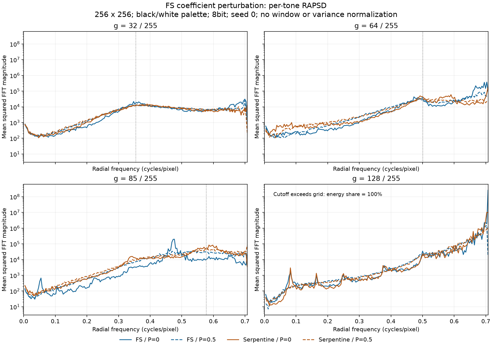](perturb/rapsd.png)

Blue is raster and orange is serpentine; solid lines are `P=0`, dashed lines are `P=0.5`. The dotted vertical line is the experiment's reference cutoff where it falls inside the FFT grid.

### Summary definitions

**Peak ratio** is the maximum non-DC radial mean divided by the arithmetic mean of all non-DC radial means. It is a custom description of spectral concentration for this experiment, not a standardized quality metric or a measurement of peak width. A lower value indicates a less dominant radial bin under this estimator. It does not establish isotropy or perceptual preference, and a blue-noise pattern can have a useful characteristic-frequency peak.

**Below-cutoff energy** is the sum of the original two-dimensional power cells with `radius < sqrt(g/255)`, divided by the total non-DC power. It uses cell-count weighting, rather than treating radial means as equal-area energy samples. The cutoff is retained exactly from the initial experiment; it is a tone-dependent reference, not a universal threshold for visible grain.

At `g=128`, `sqrt(128/255) ≈ 0.70849` exceeds the maximum FFT radius `sqrt(0.5) ≈ 0.70711`. Consequently **all four energy shares are 100% and provide no discrimination**. This input is also just above half scale. The saturated values are published for completeness and must not be interpreted as a deterioration or improvement in low-frequency noise.

### Results

<!-- perturb-results-begin -->
| Gray `g` | Configuration | Peak ratio | Below-cutoff energy | White fraction |
| ---: | --- | ---: | ---: | ---: |
| 32 | FS / P=0 | 4.982 | 23.647% | 0.126846 |
| 32 | FS / P=0.5 | 4.322 | 23.592% | 0.128784 |
| 32 | Serpentine / P=0 | 2.810 | 22.074% | 0.126831 |
| 32 | Serpentine / P=0.5 | 2.365 | 23.211% | 0.128342 |
| 64 | FS / P=0 | 17.023 | 56.849% | 0.254318 |
| 64 | FS / P=0.5 | 6.217 | 57.174% | 0.254669 |
| 64 | Serpentine / P=0 | 14.216 | 50.518% | 0.254761 |
| 64 | Serpentine / P=0.5 | 3.088 | 54.419% | 0.255280 |
| 85 | FS / P=0 | 21.468 | 94.041% | 0.338501 |
| 85 | FS / P=0.5 | 3.002 | 86.911% | 0.338348 |
| 85 | Serpentine / P=0 | 5.789 | 75.702% | 0.338242 |
| 85 | Serpentine / P=0.5 | 5.806 | 80.628% | 0.338226 |
| 128 | FS / P=0 | 173.496 | 100.000%* | 0.509827 |
| 128 | FS / P=0.5 | 25.523 | 100.000%* | 0.509842 |
| 128 | Serpentine / P=0 | 57.818 | 100.000%* | 0.510025 |
| 128 | Serpentine / P=0.5 | 19.594 | 100.000%* | 0.509766 |
<!-- perturb-results-end -->

`*` marks the saturated, non-discriminating `g=128` energy ratio. Exact values, output means, peak frequencies, and SIXEL sizes are retained in [measurements.csv](perturb/measurements.csv).

For raster FS, the peak ratio changes from `17.023` to `6.217` at `g=64`, from `21.468` to `3.002` at `g=85`, and from `173.496` to `25.523` at `g=128`. These changes agree with the visible breakup of regular structures below. The peaks are weakened, not proof that all periodic structure has disappeared.

The energy result is mixed. At `g=64`, the below-cutoff share slightly increases for raster FS (`56.849%` to `57.174%`) and increases more for serpentine (`50.518%` to `54.419%`). At `g=85`, raster improves by this measure (`94.041%` to `86.911%`), while serpentine increases (`75.702%` to `80.628%`) and its peak ratio barely changes. These observations do not support a blanket claim that perturbation reduces low-frequency energy.

Output means are not identical to input means. For example, `g=128` targets `128/255 ≈ 0.501961`, while the measured white-pixel fraction is about `0.5098–0.5100` across these four outputs. Opposite coefficient deltas preserve the ideal filter's coefficient sums, not exact image means after rounding, clipping, and missing edge taps.

## Visual comparisons

The four condition columns are ordered **raster/P=0, raster/P=0.5, serpentine/P=0, serpentine/P=0.5**. Where present, the first column is the full-color source. Compare the adjacent pair for a given scan order before attributing a difference to perturbation.

Each comparison panel is copied directly from decoded pixels or the reference input. Enlargements use integer nearest-neighbor replication. All 91 panels in the nine comparison sheets were checked for exact pixel equality after rendering; the separate annotated crop-location guide is excluded from that check.

Each figure links to its full PNG. Open that PNG at 100% in an image viewer for texture inspection. “Native” means one source pixel per PNG pixel, and “2×/4×” means that integer ratio within the PNG. Browser scaling, display scaling, or interpolation can change the apparent texture or introduce moiré. Use native resolution for overall grain and enlargement to inspect the arrangement causing it.

### Uniform fields: periodicity and grain

[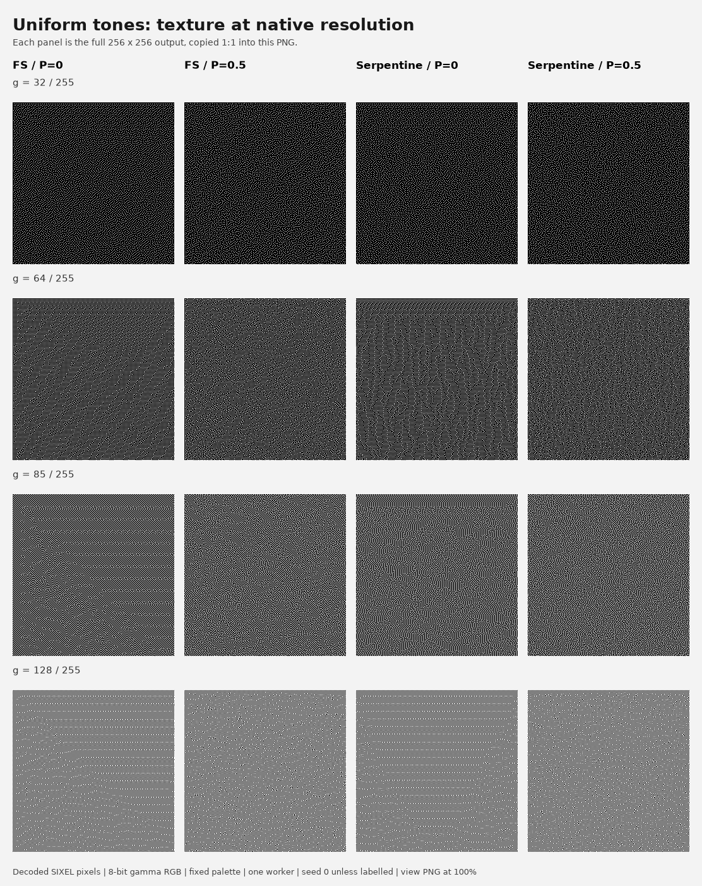](perturb/01-flat-native.png)

[Open the native-resolution sheet](perturb/01-flat-native.png). Each panel contains the complete 256×256 frame, including causal boundaries.

[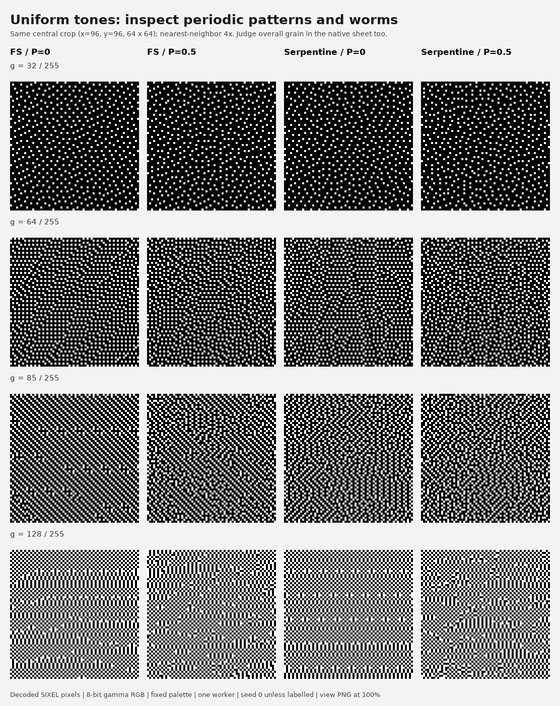](perturb/02-flat-4x.png)

[Open the 4× sheet](perturb/02-flat-4x.png). Every crop is 64×64 source pixels starting at `(96,96)`.

At `g=64`, perturbation weakens large grid-like regions, but local regular patches remain. At `g=85`, the long raster-FS diagonal lines become shorter, irregular chains. At `g=128`, checkerboard-like and vertical local patterns remain even at `P=0.5`. These are qualitative observations of the displayed samples, not a demonstration that the perturbed output is universally smoother.

### A shallow gray ramp

[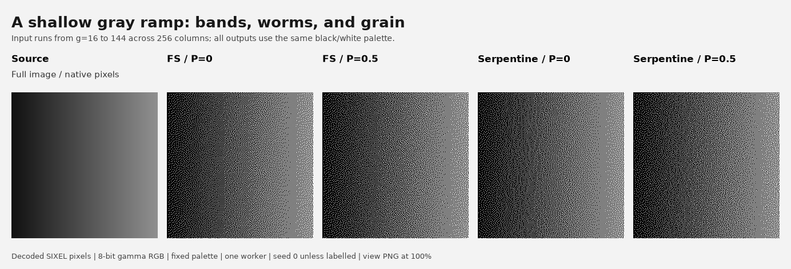](perturb/03-gray-ramp.png)

The source repeats `round(linspace(16,144,256))` over 256 rows. This exposes changing dot patterns across neighboring tones and any bands or directional chains. The same exact black/white palette is used for every output.

### Photographic regions

[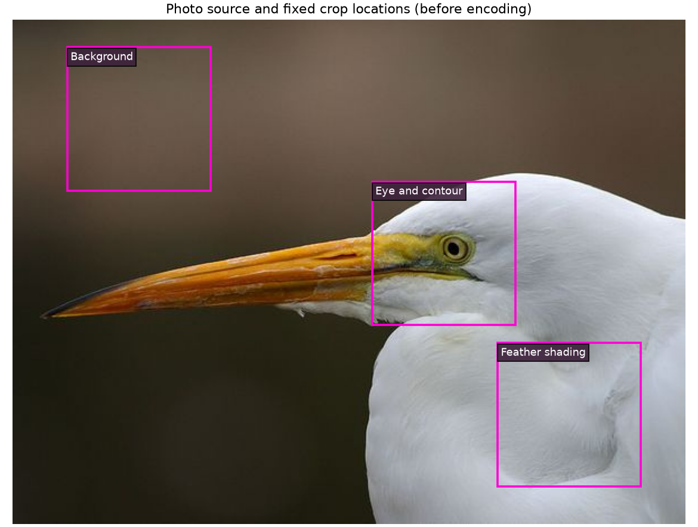](perturb/04-photo-crop-locations.png)

The fixed 128×128 crops start at `(48,24)` for the defocused background, `(432,288)` for feather shading, and `(320,144)` for the eye and contour. Smooth regions reveal artifacts, while the contour sample helps check whether a preferred background texture comes with an objectionable change to detail.

[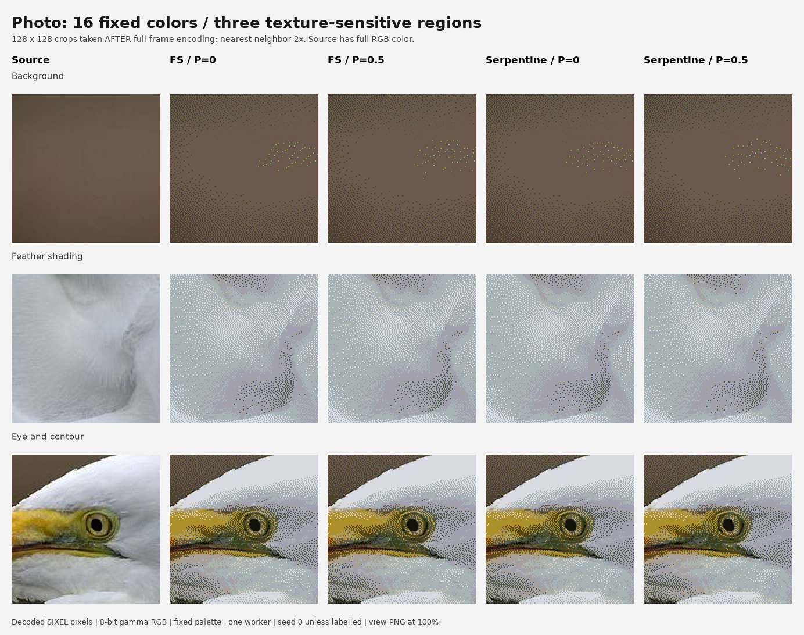](perturb/05-photo-16-2x.png)

The 16-color condition makes texture differences conspicuous. Bright colored dots remain in the defocused background for all four configurations; perturbation mainly changes their arrangement. It does not solve palette-related color contrast by itself.

[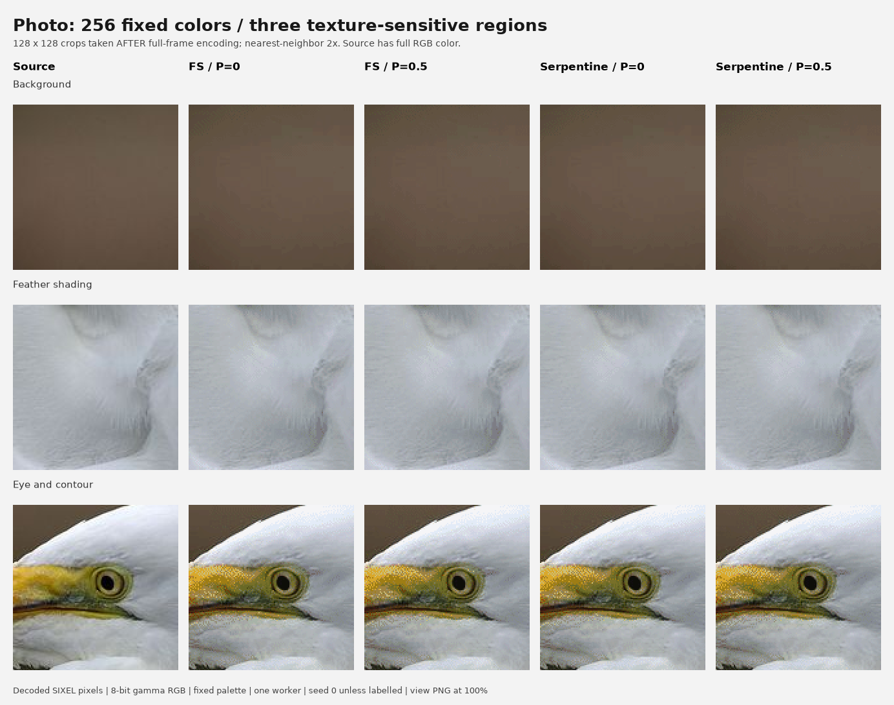](perturb/05-photo-256-2x.png)

At 256 colors, the differences are substantially less conspicuous in this photograph. Full-frame native images are available for inspecting the result in context:

| Palette | Raster/P=0 | Raster/P=0.5 | Serpentine/P=0 | Serpentine/P=0.5 |
| --- | --- | --- | --- | --- |
| 16 colors | [PNG](perturb/photo-16-fs-0.png) | [PNG](perturb/photo-16-fs-05.png) | [PNG](perturb/photo-16-serp-0.png) | [PNG](perturb/photo-16-serp-05.png) |
| 256 colors | [PNG](perturb/photo-256-fs-0.png) | [PNG](perturb/photo-256-fs-05.png) | [PNG](perturb/photo-256-serp-0.png) | [PNG](perturb/photo-256-serp-05.png) |

The [RGB source](perturb/photo-source.png) and the fixed [16-color](perturb/photo-16.pal) and [256-color](perturb/photo-256.pal) palettes are included.

### Smooth color transitions

[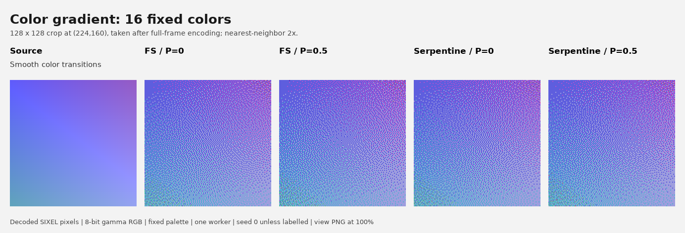](perturb/06-color-16-2x.png)

[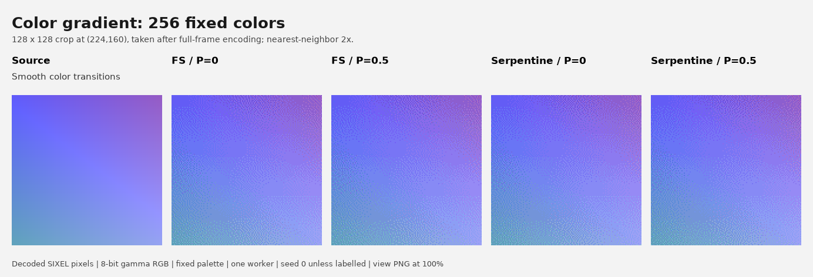](perturb/06-color-256-2x.png)

These are 128×128 crops starting at `(224,160)` in the full 600×450 color gradient. Restricted-palette color speckling is visible in both 16-color outputs, while the 256-color texture has lower color contrast. Inspect directional structure and local clumps separately from the palette's color approximation.

### Strength and seed controls

[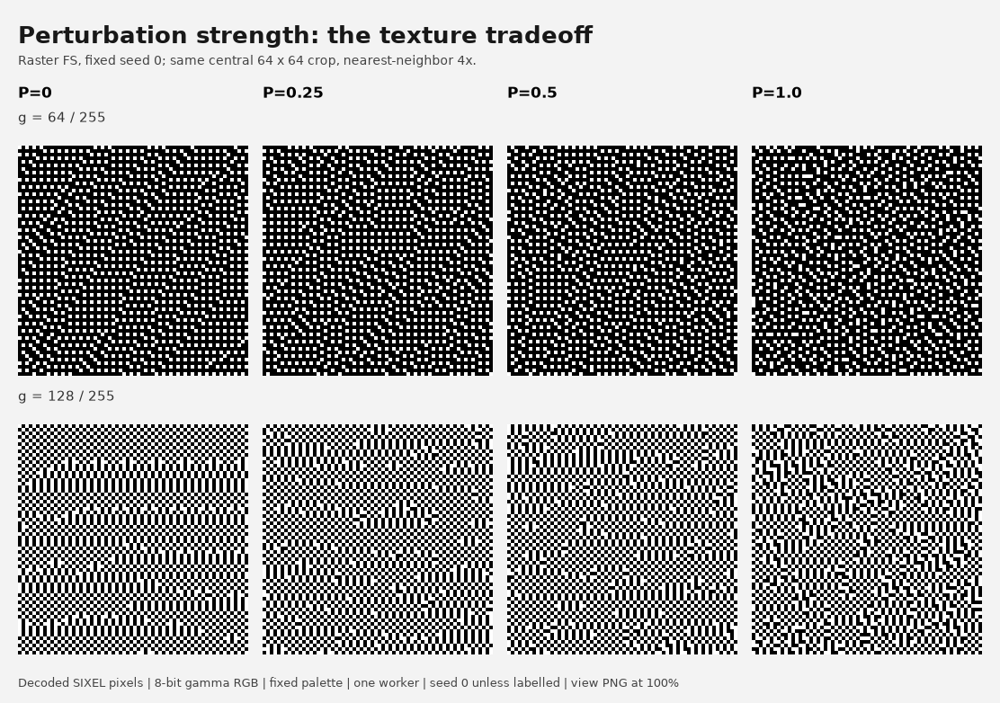](perturb/07-strength-4x.png)

This comparison keeps raster order and seed `0`, using the same central crop at `g=64` and `g=128`. At `P=1.0`, more connected, clump-like structures are visible, especially near half scale. A stronger perturbation is therefore not automatically the preferred texture.

[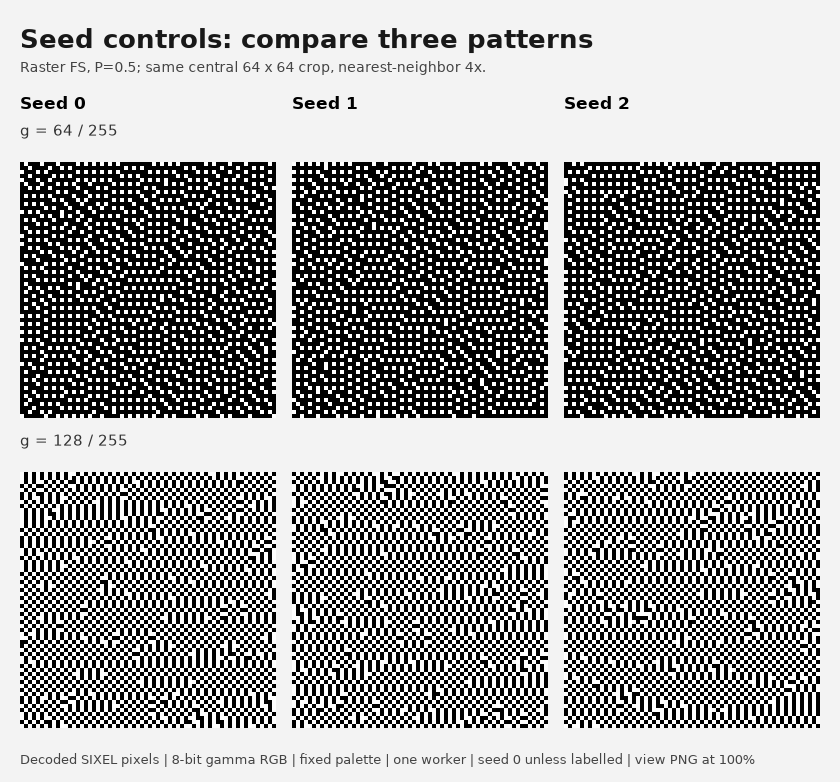](perturb/08-seeds-4x.png)

The seed comparison keeps raster order and `P=0.5`. Different local configurations appear, including residual regular patches. Three examples help expose seed dependence, but do not estimate the distribution over all seeds.

## Evaluation and adoption boundary

The spectral and visual results support providing perturbation as a manual adjustment for objectionable FS periodicity. Qualitative inspection found a modest improvement in the displayed periodic textures. This was an informal review, not a blinded preference experiment or evidence for changing the default.

For a repeatable human comparison, record scan order, amount, seed, crop, and display scale. Judge four aspects separately: regular grids or directional lines; coarse grains or connected clumps; broad mottling or bands; and edge/detail appearance. “No visible difference” is a valid result. Inspect native resolution before using enlarged crops to diagnose the pattern. Hide condition labels and vary left/right ordering when collecting preference scores.

RAPSD averages away direction and does not encode spatial phase or local position. Mean subtraction also removes brightness bias from the spectrum. Consequently these curves alone cannot establish isotropy, seam-free output, brightness fidelity, or the appearance of a particular local patch. The photographs and spectra must be read together.

This study covers the 8bit CPU path, one photograph, one color field, four constant tones, and one gray ramp. It does not establish float32 perceptual behavior, multi-worker seam quality, animation stability, kernel-only speed, a perceptual score improvement, or an optimum parameter. Coefficient generation is coordinate-deterministic, but changing band geometry can still change the incoming diffusion history, as described in the [implementation contract](../dithering.md#paired-coefficient-perturbation).

## Reproduction

Build the committed implementation, then use a Python environment containing NumPy, Pillow, and Matplotlib. The renderer is optional analysis tooling; it adds no dependency to the normal C build. From the repository root:

```sh
PATH="$PWD/.local/bin:$PATH" make -j4
python3 tools/plot_diffusion_perturb_measurements.py \
  --output-dir /tmp/libsixel-fs-perturb
```

For an out-of-tree Autotools or Meson build, also pass `--build-dir /path/to/build`. The renderer refuses uncommitted changes in the runtime source directories, accepts documentation-only edits, checks the effective work format and fixed-palette identity, generates the SIXEL and decoded PNG outputs, validates all comparison panels, and writes the RAPSD curves and summary. It does not rebuild the binary itself.

The checked-in artifact set contains PNGs, input palettes, CSVs, and the manifest; rerunning also retains intermediate SIXEL streams, exported per-condition palettes, and diagnostic logs in the requested output directory. Those intermediate files need not be published. Review updated numeric results and images before replacing this pinned study after an implementation or toolchain change.

Relevant files:

- [Reproduction tool](../../../tools/plot_diffusion_perturb_measurements.py)
- [Full measurement summary](perturb/measurements.csv)
- [Per-bin radial curves and cell counts](perturb/rapsd-curves.csv)
- [Build, commands, inputs, output hashes, and validation manifest](perturb/manifest.json)
- [Existing FS perturbation regression category](../../../tests/processing/dither/perturb/)

The numeric summaries and the visual observations are supporting evidence for an optional control. Existing exact behavioral and quality regression tests remain separate from this manual comparison.
