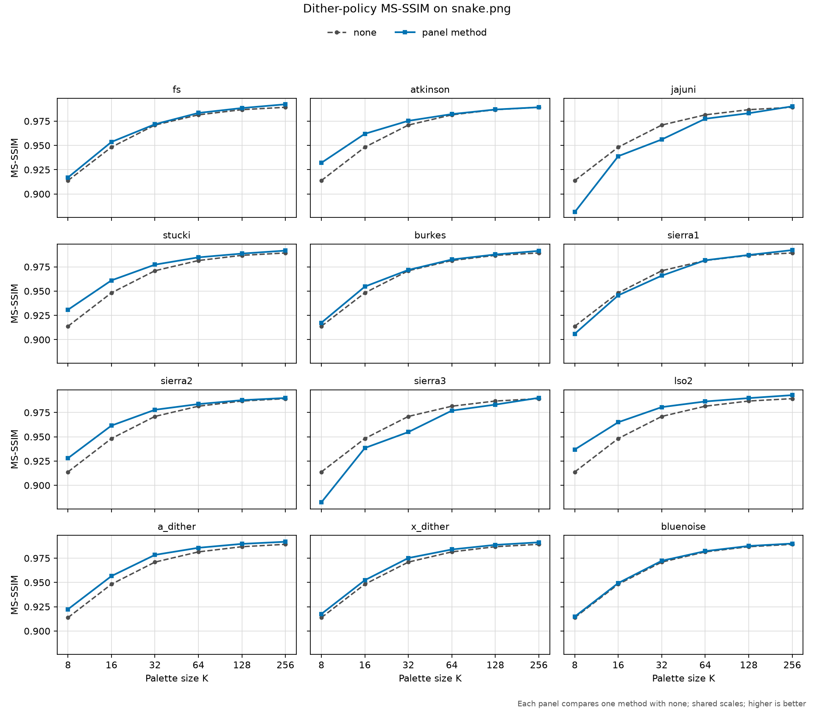
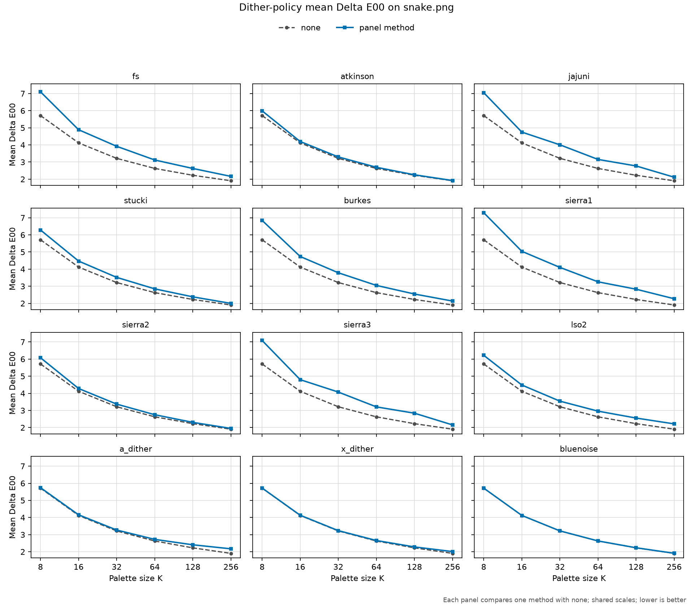
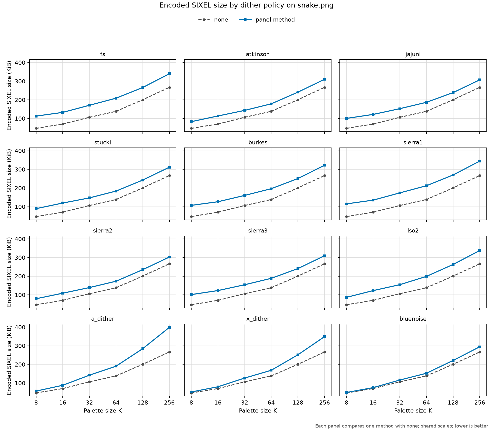
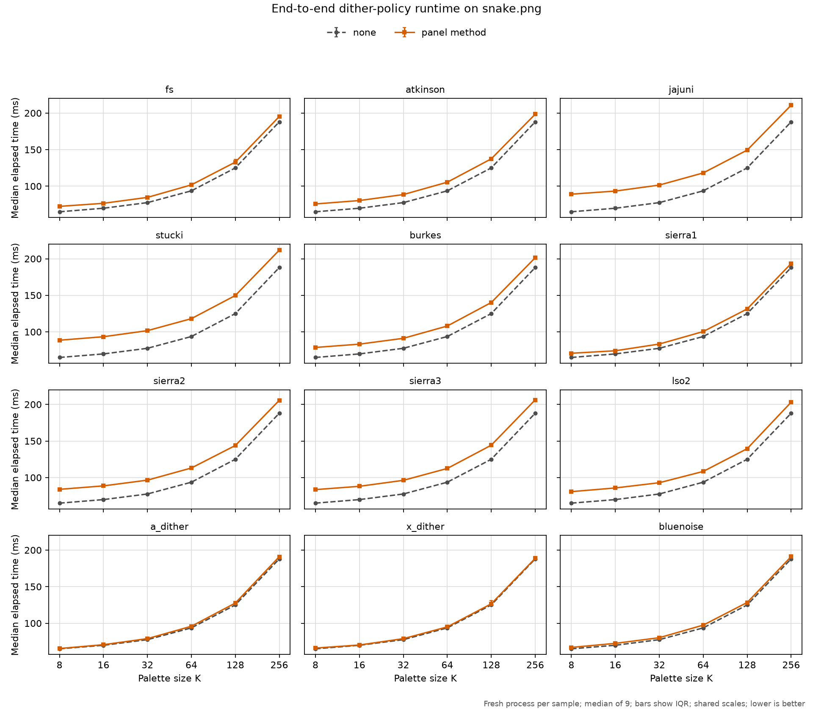

# Dithering

## Purpose

A finite palette cannot represent every input color. Dithering controls how
the resulting quantization error is distributed across pixels or animation
frames. It operates while a completed palette is applied:

```text
pixels + palette -> dither adjustment -> palette lookup -> indexed pixels
```

It answers **how should representation error be shaped**. It does not build the
palette, and it does not define the data structure used to search that palette.

## CLI surface

`img2sixel` selects a method with:

```text
-d METHOD
--diffusion=METHOD
```

The option retains the historical name `diffusion`, although some available
methods are ordered or positionally stable dithers rather than error-diffusion
kernels. The current base methods are:

- `auto` selects the normal automatic method;
- `none` maps the original pixel without diffusing error;
- `fs`, `atkinson`, `jajuni`, `stucki`, `burkes`, `sierra`, and `lso2` diffuse
  error to later pixels;
- `a_dither`, `x_dither`, and `bluenoise` use positionally stable
  perturbations;
- `interframe` and `stbn` provide animation-aware temporal behavior.

Methods have suboptions for concerns such as scan order, kernel variants,
strength, temporal sources, and scene changes. Use `img2sixel -H` or the
[`img2sixel(1)` manual](../../converters/img2sixel.1) as the detailed option
reference.

## Mathematical model

Let `x[p]` be the source color at pixel `p`, `b[p]` a position- or
time-dependent bias, and `e[p]` error accumulated from already processed
pixels or frames. A broad model of palette application is:

```text
y[p] = x[p] + b[p] + e[p]
i[p] = nearest_palette_index(y[p])
r[p] = y[p] - palette[i[p]]
```

The dither method defines `b[p]`, how `e[p]` is formed, and whether some
fraction of residual `r[p]` is sent to future samples. The lookup policy
implements `nearest_palette_index`. This separation is important: a dither
method shapes the spatial or temporal spectrum of quantization error, while
lookup solves the nearest-neighbor problem for the current candidate.

For a causal error-diffusion kernel with downstream offsets `delta` and
coefficients `a[delta]`:

```text
e[p + delta] += a[delta] * r[p]
```

The Floyd-Steinberg kernel, for example, distributes fractions `7/16`,
`3/16`, `5/16`, and `1/16` to four later neighbors. Atkinson uses six `1/8`
contributions and intentionally diffuses only three quarters of the residual.
Jarvis-Judice-Ninke, Stucki, Burkes, and the Sierra variants use different
fixed stencils to trade local smoothness, edge behavior, and the spatial
frequency of visible error.

`lso2` remains a causal diffusion method, but selects coefficients from a
fixed 256-entry table according to error magnitude and can update up to six
downstream positions. The table makes the filter nonlinear and
signal-dependent; it does not make its cost depend on image or palette size.

`a_dither` and `x_dither` compute deterministic coordinate- and
channel-dependent perturbations. `bluenoise` samples a compiled 64-by-64 mask
and combines decorrelated samples to move error toward less objectionable
spatial frequencies. These methods do not carry error from one neighboring
pixel to another. `interframe` carries a full-frame residual between frames.
`stbn` combines temporal state with spatiotemporal blue-noise, hash, mask, or
PMJ-derived bias and optional spatial diffusion.

## Cost model and asymptotic order

Use these variables when discussing dither cost:

- `W` and `H`: output width and height;
- `P = W H`: processed pixels in one frame;
- `F`: processed frame count;
- `T`: downstream taps in an error-diffusion stencil;
- `K`: palette entries;
- `L(K)`: cost of one query under the selected lookup policy.

RGB dimensionality and the largest stencil are fixed constants in the current
implementation. The dither-only work is therefore:

| Method family | Dither work | Persistent state | Main dependency |
| --- | --- | --- | --- |
| `none` | `Theta(P)` traversal with no adjustment | `O(1)` | One lookup remains for every pixel |
| Fixed-stencil diffusion | `Theta(P T) = Theta(P)` | Row or band error buffers | Causal dependency on scan order |
| `lso2` | `Theta(P)` | Error buffers plus a fixed 256-entry table | Constant-bounded, data-selected stencil |
| `a_dither`, `x_dither`, `bluenoise` | `Theta(P)` | `O(1)` per worker plus fixed tables | Coordinate-derived bias |
| `interframe`, `stbn` | `Theta(F P)` | `Theta(P)` frame state | Spatial and temporal history |

The current `auto` rule selects Floyd-Steinberg above 16 palette colors and
Atkinson at 16 or fewer, so it inherits the fixed-stencil `Theta(P)` dither
cost.

Palette application must add lookup cost. For one frame its useful high-level
bound is:

```text
Theta(P * (constant dither work + L(K)))
```

Thus a fixed-stencil method remains linear in pixel count, but pairing it with
direct `--lookup-policy=none` gives `Theta(P K)` total application work. A
constant-time prepared lookup gives `Theta(P)` application instead. The
lookup-policy document separates preparation from those per-pixel queries.

No current `-d` method is logarithmic or quadratic in `P` when `P` is the
independent variable. Terminology can otherwise mislead: on a square image
whose side length is `n`, linear pixel work is `Theta(n^2)` because
`P = n^2`. Likewise, the 64-by-64 blue-noise mask and the 256-entry `lso2`
coefficient table are fixed precomputed data, not image-sized preprocessing.

## Interaction with lookup

The dither method calls the selected lookup policy to turn its current color
candidate into a palette index. For error diffusion, the difference between
that candidate and the selected palette entry is propagated according to the
kernel. Ordered methods derive a perturbation from position instead.

The two `none` values have different meanings:

- `-d none` means no error propagation or ordered perturbation; lookup still
  chooses a palette entry;
- `--lookup-policy=none` means direct palette scanning; the selected dither
  method still runs.

Changing the lookup backend can change performance and, for policies that
discretize the query space, may change the selected entry. That can also alter
the error fed back by an error-diffusion method. Evaluate combinations rather
than assuming the options are performance-isolated.

## Scan order and parallelism

Error diffusion is order-dependent because one pixel changes the input seen by
later pixels. Raster and serpentine scans therefore have distinct output
contracts. Parallel bands need enough context to reproduce the intended error
state at their boundaries; merely assigning rows to workers is not equivalent
to sequential diffusion.

The constant `T` in the cost model limits arithmetic per pixel but does not
remove this dependency chain. Error diffusion is asymptotically linear while
remaining harder to parallelize than positionally stable methods.

Positionally stable methods are easier to split because their adjustment is
derived from coordinates instead of mutable neighboring error. Temporal
methods add frame history and reset rules, so frame boundaries become part of
their reproducibility contract.

## Quality and tests

Byte-for-byte output is appropriate when deterministic algorithm behavior is
the contract. Perceptual metrics are appropriate when implementations may vary
but image quality must not regress. Inspect flat regions, gradients, edges,
alpha boundaries, and animation stability separately because an aggregate
score can hide structured artifacts.

Keep fixtures small for routine tests and use larger images only when the
quality characteristic needs spatial context. Follow the
[Testing Guide](../testing/guide.md) and
[Quality Measurement Policy](../quality/measurement-policy.md) for thresholds
and shell TAP conventions.

## Measured static-image quality, size, and speed

### Questions and scope

The checked-in comparison asks how each concrete spatial `-d` method changes:

1. spatially pooled decoded-image quality across palette sizes;
2. mean per-pixel color error as a secondary diagnostic; and
3. encoded SIXEL byte size; and
4. end-to-end single-image latency.

MS-SSIM is the primary quality metric because dithering deliberately trades
independent per-pixel error for spatially distributed error. Mean Delta E00 is
retained as a reference value, but a lower mean Delta E00 does not establish a
better dither pattern.

The sweep covers `none`, `fs`, `atkinson`, `jajuni`, `stucki`, `burkes`, all
three Sierra variants, `lso2`, `a_dither`, `x_dither`, and `bluenoise`.
`auto` is excluded because it selects another method according to palette
size. `interframe` and `stbn` require an animation sequence, frame cadence, and
temporal metrics; treating their first static frame as a complete comparison
would be misleading.

Thirteen overlapping lines would make exact comparisons difficult. Each
figure therefore uses shared-scale small multiples: one panel compares one
method with the no-dither reference.

### MS-SSIM: primary quality view



Higher is better. The values are stored with the Delta E00 reference values in
[`dither-policy-quality.csv`](dither-policies/measurements/dither-policy-quality.csv).

### Mean Delta E00: reference view



Lower is better, but this spatially unpooled mean penalizes the local color
changes used to shape error. Read it as a diagnostic alongside MS-SSIM, not as
the primary dither ranking.

### Encoded SIXEL size



Lower is smaller. Each value is the exact byte length of the same SIXEL stdout
stream decoded for the quality measurement, including the DCS envelope,
palette definitions, and image data. The values and ratios to `none` are in
[`dither-policy-size.csv`](dither-policies/measurements/dither-policy-size.csv).

### End-to-end speed



Each point is the median of nine fresh processes after two warm-up rounds; the
bars show the interquartile range. The complete samples and command templates
are in
[`dither-policy-speed.csv`](dither-policies/measurements/dither-policy-speed.csv).

### Observed tradeoffs

The two ends of the measured palette-size range are summarized below. The CSV
retains more digits; rounding here is for readability.

| Method | MS-SSIM, `K=8` | Mean Delta E00, `K=8` | MS-SSIM, `K=256` | Mean Delta E00, `K=256` |
| --- | ---: | ---: | ---: | ---: |
| `none` | 0.913150 | 5.6738 | 0.991971 | 1.8678 |
| `fs` | 0.897204 | 7.1647 | 0.992164 | 2.2585 |
| `atkinson` | 0.929257 | 5.8992 | 0.993364 | 1.9438 |
| `jajuni` | 0.872093 | 6.9085 | 0.991119 | 2.1324 |
| `stucki` | 0.925509 | 5.9963 | 0.993065 | 1.9799 |
| `burkes` | 0.888138 | 7.0569 | 0.991947 | 2.1804 |
| `sierra1` | 0.892550 | 7.1820 | 0.991948 | 2.2728 |
| `sierra2` | 0.926554 | 5.8479 | 0.993128 | 1.9200 |
| `sierra3` | 0.873537 | 6.9359 | 0.991229 | 2.1432 |
| `lso2` | 0.930382 | 5.9884 | 0.993466 | 2.0788 |
| `a_dither` | 0.922113 | 5.7055 | 0.992143 | 2.2287 |
| `x_dither` | 0.917181 | 5.6844 | 0.992511 | 2.0367 |
| `bluenoise` | 0.915700 | 5.6777 | 0.992900 | 1.8844 |

At `K=8`, `lso2`, Atkinson, Sierra-2, and Stucki improve MS-SSIM over
`none` by 0.017232, 0.016107, 0.013404, and 0.012359 respectively. All three
positional methods also improve it, though by smaller amounts. Floyd--
Steinberg, Jarvis--Judice--Ninke, Burkes, Sierra-1, and Sierra-3 instead reduce
MS-SSIM on this fixture at that palette size. The separation narrows as `K`
grows, but Atkinson, Stucki, Sierra-2, `lso2`, and all three positional methods
remain above `none` at every measured `K`. This consistency is a reason to
test them on a broader fixture set, not enough evidence to change the default.

Mean Delta E00 is higher than `none` for every dither in both endpoint rows.
That result is expected rather than contradictory: direct lookup selects the
nearest palette entry in its own lookup metric, while dithering may accept more
local color error to make its spatial arrangement less objectionable. The
blue-noise result at `K=256`, for example, moves mean Delta E00 from 1.8678 to
1.8844 while moving MS-SSIM from 0.991971 to 0.992900.

| Method | Size, `K=8` | Relative to `none` | Size, `K=256` | Relative to `none` |
| --- | ---: | ---: | ---: | ---: |
| `none` | 46.9 KiB | 1.000x | 266.8 KiB | 1.000x |
| `fs` | 112.7 KiB | 2.404x | 340.0 KiB | 1.274x |
| `atkinson` | 82.9 KiB | 1.769x | 310.1 KiB | 1.162x |
| `jajuni` | 100.4 KiB | 2.141x | 307.2 KiB | 1.151x |
| `stucki` | 89.5 KiB | 1.908x | 311.7 KiB | 1.168x |
| `burkes` | 106.9 KiB | 2.280x | 322.0 KiB | 1.207x |
| `sierra1` | 114.9 KiB | 2.451x | 344.5 KiB | 1.291x |
| `sierra2` | 79.2 KiB | 1.688x | 302.7 KiB | 1.135x |
| `sierra3` | 101.4 KiB | 2.163x | 310.0 KiB | 1.162x |
| `lso2` | 86.6 KiB | 1.848x | 337.8 KiB | 1.266x |
| `a_dither` | 56.8 KiB | 1.212x | 398.4 KiB | 1.493x |
| `x_dither` | 52.0 KiB | 1.110x | 349.0 KiB | 1.308x |
| `bluenoise` | 49.3 KiB | 1.051x | 294.4 KiB | 1.103x |

Every measured dither produces a larger stream than `none` at every measured
`K`. Blue noise has the smallest size overhead throughout the sweep: 5.1
percent at `K=8` and 10.3 percent at `K=256`. Sierra-1 is largest through
`K=64`, reaching 2.451x at `K=8`; `a_dither` is largest at `K=128` and
`K=256`, reaching 1.493x at the latter endpoint.

The size curve materially changes the quality-only interpretation. `lso2` has
the best MS-SSIM at both endpoints, but costs 84.8 percent more bytes at `K=8`
and 26.6 percent more at `K=256`. The positional methods are inexpensive in
CPU time, but that does not make them uniformly inexpensive to transmit:
`a_dither` is nearly baseline speed while producing the largest `K=256`
stream. Dithering changes the spatial sequence of palette indices, which in
turn changes SIXEL plane selection and run-length opportunities.

| Method | Median, `K=8` | Relative to `none` | Median, `K=256` | Relative to `none` |
| --- | ---: | ---: | ---: | ---: |
| `none` | 65.0 ms | 1.00x | 187.9 ms | 1.00x |
| `fs` | 72.4 ms | 1.11x | 195.3 ms | 1.04x |
| `atkinson` | 75.7 ms | 1.16x | 198.4 ms | 1.06x |
| `jajuni` | 89.1 ms | 1.37x | 210.7 ms | 1.12x |
| `stucki` | 88.6 ms | 1.36x | 211.7 ms | 1.13x |
| `burkes` | 78.7 ms | 1.21x | 201.4 ms | 1.07x |
| `sierra1` | 70.8 ms | 1.09x | 193.4 ms | 1.03x |
| `sierra2` | 83.9 ms | 1.29x | 205.6 ms | 1.09x |
| `sierra3` | 83.5 ms | 1.28x | 206.2 ms | 1.10x |
| `lso2` | 80.7 ms | 1.24x | 203.0 ms | 1.08x |
| `a_dither` | 65.4 ms | 1.01x | 191.0 ms | 1.02x |
| `x_dither` | 66.0 ms | 1.02x | 188.8 ms | 1.00x |
| `bluenoise` | 67.0 ms | 1.03x | 191.1 ms | 1.02x |

The positional methods remain within three percent of `none` at both
endpoints. Fixed-stencil and table-driven diffusion cost more: at `K=8` their
measured slowdown ranges from 1.09x for Sierra-1 to 1.37x for
Jarvis--Judice--Ninke. The relative gap shrinks at `K=256` because the
controlled direct lookup is `Theta(P K)` and dominates more of the total as
the palette grows. For example, `lso2` adds about 15.7 ms at `K=8` and
15.1 ms at `K=256`, although its displayed ratio changes from 1.24x to 1.08x.
The figure therefore measures user-visible end-to-end latency; it is not an
isolated comparison of kernel arithmetic.

### Controlled protocol

The curves were measured on 2026-09-03 from a clean Autotools build of revision
`4e1e9283d` on Darwin 25.5.0 arm64. The input is
[`images/snake.png`](../../images/snake.png), and the sweep uses `K = 8, 16,
32, 64, 128, 256`. Palette generation is controlled with seeded K-means, Ward
final merging, and OKLab clustering. Palette application remains in gamma RGB.
Direct `--lookup-policy=none` avoids adding an approximate lookup policy to the
quality comparison. GPU assistance is disabled, and one worker avoids
parallel-band seams and scan-history differences.

Every spatial method uses explicit raster order so the figure compares kernels
under one scan contract. This intentionally overrides `lso2`'s normal
serpentine default. The positional-method strengths are pinned to their current
defaults, and the blue-noise phase and channel mode are explicit. The command
shape is:

```text
img2sixel \
  --threads=1 --precision=8bit --quality=full \
  --loaders=libpng! \
  --quantize-model=kmeans:merge=ward:seed=1 -Xoklab -Wgamma \
  --diffusion=METHOD:scan=raster \
  --gpu-policy=off --lookup-policy=none -p K \
  images/snake.png
```

The Sierra, positional, and blue-noise rows add their explicit variant or
parameter tokens. The exact commands, source revision, executable hashes,
input hash, build configuration, and timing protocol are recorded in
[`dither-policy-run.json`](dither-policies/measurements/dither-policy-run.json).

### Reproducing the curves

Configure an Autotools build with libpng and the assessment tools, install
Python Matplotlib, commit the implementation being measured, and run from a
tracked-clean worktree:

```sh
PYTHON=.venv/bin/python tools/reproduce_dither_policy_measurements.sh
```

The Python override is only an example. The runner rebuilds `img2sixel` and
`lsqa`, removes inherited `SIXEL_*` variables, generates all figures and CSVs,
records provenance, and validates the complete quality, size, and speed
Cartesian sets of 13 methods and six palette sizes. The size is taken from the
same in-memory stream sent to `lsqa`; no second size-only encode is used.
`DITHER_POLICY_WARMUPS` and `DITHER_POLICY_RUNS` change the timing budget; a run
with different values is a different protocol.

Rerun the complete command after changes to dither kernels, scan order,
palette application, quantization, loading, SIXEL decoding, `lsqa`, compiler
optimization, or the measurement scripts. Review the CSV, plots, and written
interpretation together.

### Interpretation limits

- One natural image does not characterize gradients, flat fills, edges, alpha
  boundaries, or every spatial frequency. Do not choose a default from this
  fixture alone.
- MS-SSIM is spatially pooled but does not itself measure temporal stability,
  SIXEL size, palette-index chatter, or band seams.
- Mean Delta E00 hides worst-case pixels and the spatial spectrum of error.
- Encoded size is content- and encoder-dependent. It does not predict a
  transport's compression ratio, latency, or terminal rendering cost.
- The speed curve includes loading, palette generation, direct lookup, and
  SIXEL encoding. It is not an isolated kernel microbenchmark.
- The explicit raster sweep compares kernels, not their complete default
  configurations. Scan order and positional strength need separate sweeps.
- Animation methods require a multi-frame protocol and temporal metrics.

## Implementation and tests

Policy selection and application are coordinated in
[`dither.c`](../../src/dither.c). Dispatch is in
[`dither-policy.c`](../../src/dither-policy.c), with implementations in the
`src/dither-policy-*.c` files and shared behavior in
[`dither-common-pipeline.c`](../../src/dither-common-pipeline.c). Focused tests
are under [`tests/quant/palette/usage/`](../../tests/quant/palette/usage/).

For the full context, read [Encoding Pipeline](encoding-pipeline.md) and
[Lookup Policy](lookup-policy.md).
