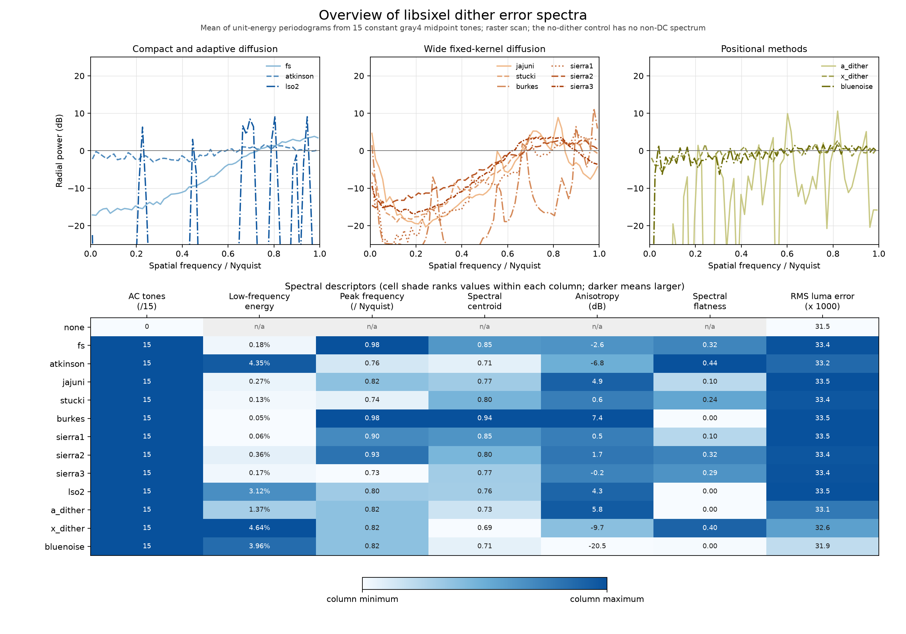
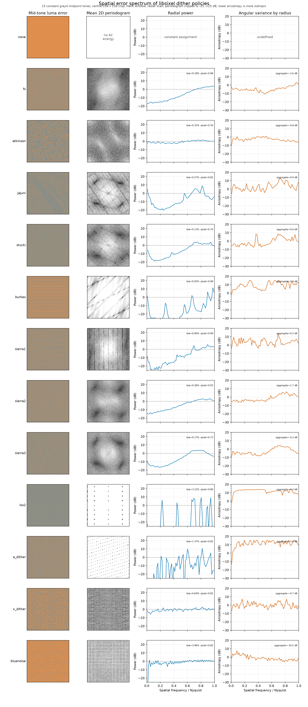

# Dithering

## Purpose

A finite palette cannot represent every input color. Dithering controls how
the resulting quantization error is distributed across pixels or animation
frames. It operates while a completed palette is applied:

```text
pixels + palette -> dither adjustment -> palette lookup -> indexed pixels
```

It answers **how should representation error be shaped**. It does not build the
palette, and it does not define the data structure used to search that palette.

## CLI surface

`img2sixel` selects a method with:

```text
-d METHOD
--diffusion=METHOD
```

The option retains the historical name `diffusion`, although some available
methods are ordered or positionally stable dithers rather than error-diffusion
kernels. The current base methods are:

- `auto` selects the normal automatic method;
- `none` maps the original pixel without diffusing error;
- `fs`, `atkinson`, `jajuni`, `stucki`, `burkes`, `sierra`, and `lso2` diffuse
  error to later pixels;
- `a_dither`, `x_dither`, and `bluenoise` use positionally stable
  perturbations;
- `interframe` and `stbn` provide animation-aware temporal behavior.

Methods have suboptions for concerns such as scan order, kernel variants,
strength, temporal sources, and scene changes. Use `img2sixel -H` or the
[`img2sixel(1)` manual](../../converters/img2sixel.1) as the detailed option
reference. The policy chapters below explain the algorithms rather than
repeating that option inventory. As starting points, use `auto` for the normal
compatibility rule, `none` for an undithered control, `bluenoise` when a
stateless low-overhead spatial method is worth testing, and `interframe` or
`stbn` only when an animation protocol can preserve and evaluate frame state.
The checked-in one-image sweep is evidence about those exact commands, not a
universal ranking.

## Mathematical model

Let `x[p]` be the source color at pixel `p`, `b[p]` a position- or
time-dependent bias, and `e[p]` error accumulated from already processed
pixels or frames. A broad model of palette application is:

```text
y[p] = x[p] + b[p] + e[p]
i[p] = nearest_palette_index(y[p])
r[p] = y[p] - palette[i[p]]
```

The dither method defines `b[p]`, how `e[p]` is formed, and whether some
fraction of residual `r[p]` is sent to future samples. The lookup policy
implements `nearest_palette_index`. This separation is important: a dither
method shapes the spatial or temporal spectrum of quantization error, while
lookup solves the nearest-neighbor problem for the current candidate.

For a causal error-diffusion kernel with downstream offsets `delta` and
coefficients `a[delta]`:

```text
e[p + delta] += a[delta] * r[p]
```

The diagrams below show a left-to-right raster scan. `*` is the pixel being
quantized, numbers are coefficient numerators, and the caption gives the
common denominator. A serpentine scan mirrors the stencil on alternate rows.
At an image boundary, libsixel omits out-of-range taps instead of renormalizing
the remaining weights. Consequently, the stated coefficient sum describes an
interior pixel, not an edge pixel.

## `auto`: palette-size selection

```text
img2sixel -d auto ...
```

`auto` is a selector, not a separate dither algorithm. When the policy is
created, libsixel resolves it from the completed palette size `K`:

```text
K <= 16  -> atkinson
K >  16  -> fs
```

The decision is constant-time and is made once, not independently for every
pixel. After resolution, quality, size, state, and arithmetic are exactly
those of the selected policy. This rule explains why `auto` is excluded from
the measured policy sweep: including it would duplicate Atkinson at `K=8` and
`K=16`, then Floyd--Steinberg at the remaining measured sizes.

Use `auto` when compatibility with libsixel's normal selection rule matters.
Select a concrete policy when output reproducibility must not change if the
palette size crosses 16.

## `none`: nearest color without error shaping

```text
img2sixel -d none ...
```

`none` sets both the positional bias and propagated error to zero:

```text
y[p] = x[p]
i[p] = nearest_palette_index(x[p])
```

It still performs one palette lookup for every pixel. Do not confuse it with
`--lookup-policy=none`, which selects a direct palette scan. The two options
control different pipeline stages and can be used independently.

This policy has no dither dependency between pixels, introduces no dither
state, and adds only `Theta(P)` traversal work around the palette queries. It
is useful for already-indexed artwork, exact palette experiments, and the
control arm of a dither comparison. In the current static-image benchmark it
is also the smallest encoded stream at every measured `K`, because it tends to
preserve longer runs of the same palette index. Its lack of error shaping can,
however, expose contouring in smooth gradients.

## `fs`: Floyd--Steinberg error diffusion

```text
img2sixel -d fs ...

          *  7
       3  5  1    / 16
```

Floyd--Steinberg sends all of the interior-pixel residual to four future
pixels: `7/16` forward, `3/16` down and backward, `5/16` down, and `1/16` down
and forward. The weights sum to one, so the filter preserves the residual's
DC component away from boundaries and clipping. It is the narrowest
full-residual fixed kernel in this set: four taps over the current and next
scanlines.

The method originates in Robert W. Floyd and Louis Steinberg's 1976 paper,
*An Adaptive Algorithm for Spatial Greyscale*. Its short stencil limits
arithmetic and state, but causality makes output depend on scan direction and
on the incoming error at a parallel-band boundary.

On the checked-in true 8-bit fixture, `fs` raises MS-SSIM relative to `none`
at every measured `K`, and produces streams 2.493x and 1.259x as large at
`K=8` and `K=256`. It is therefore a conventional general-purpose choice, not
a guarantee of better quality or smaller output for every image or precision.

## `atkinson`: partial-residual diffusion

```text
img2sixel -d atkinson ...

          *  1  1
       1  1  1       / 8
          1
```

Atkinson distributes six equal `1/8` contributions over a compact three-row
neighborhood. Their sum is `6/8`: one quarter of the residual is deliberately
not propagated. This attenuation limits long error chains and tends to retain
local contrast, but it also means the local mean is not conserved as strictly
as with a unit-sum kernel. The algorithm is attributed to Bill Atkinson and is
associated with the original Macintosh image pipeline; the libsixel source is
the normative definition of this implementation.

Six fixed taps keep the dither work `Theta(P)`. It remains causal and
scan-order dependent, while reaching one row farther than Floyd--Steinberg.
`auto` selects it when `K <= 16`.

In the controlled sweep, Atkinson improves MS-SSIM over `none` at every
measured palette size. At `K=8` it reaches 0.932078 versus 0.913809 for
`none`, while increasing size to 1.681x and latency to 1.03x. This is a useful
example of why visual quality, encoded size, and CPU time must be evaluated as
separate objectives.

## `jajuni`: Jarvis--Judice--Ninke diffusion

```text
img2sixel -d jajuni ...

             *  7  5
       3  5  7  5  3
       1  3  5  3  1    / 48
```

Jarvis--Judice--Ninke diffuses the complete residual through 12 future
neighbors over three scanlines. The broad, symmetric-looking footprint moves
error farther from its source than Floyd--Steinberg, but each pixel performs
three times as many tap updates. The coefficients sum to `48/48` for an
interior pixel.

The kernel comes from Jarvis, Judice, and Ninke's 1976 paper
[*A Survey of Techniques for the Display of Continuous Tone Pictures on
Bilevel Displays*](https://doi.org/10.1016/S0146-664X(76)80003-2). The wider
dependency footprint increases overlap requirements when work is divided
into bands and gives more opportunities for rounding and clipping to affect
later pixels.

On the measured fixture, `jajuni` is among the slower fixed policies at `K=8`
(1.11x the `none` end-to-end time), produces a 2.277x stream, and has
lower MS-SSIM than `none`. These are fixture-specific results, but they rule
out the assumption that a wider unit-sum kernel is automatically superior.

## `stucki`: attenuated wide diffusion

```text
img2sixel -d stucki ...

             *  8  4
       2  4  8  4  2
       1  2  4  2  1    / 48 in libsixel
```

The current libsixel policy updates the same 12 positions as
Jarvis--Judice--Ninke, with larger weight near the current column. Its
numerators sum to 42 while libsixel divides by 48, so it propagates `7/8` of
the interior residual. This is a material implementation detail: references
often print the Stucki matrix with denominator 42, but changing libsixel to
that normalized form would change output and is outside this document's
scope.

Peter Stucki described the underlying approach in the 1981 IBM research
report [*MECCA: A Multiple-Error Correction Computation Algorithm for Bi-Level
Image Hardcopy Reproduction*](https://dominoweb.draco.res.ibm.com/1319c04d395da62c85257568004f2ab3.html).
For reproducibility, treat
[`dither-policy-stucki.c`](../../src/dither-policy-stucki.c), rather than a
generic Stucki diagram, as the definition of `-d stucki`.

Stucki has 12 fixed taps and a two-row forward reach, so its asymptotic work
is `Theta(P)` but its constant and band-boundary dependency are relatively
large. It improves MS-SSIM at every measured `K`; at `K=8` that comes with a
2.060x stream and 1.11x latency.

## `burkes`: two-scanline wide diffusion

```text
img2sixel -d burkes ...

             *  4  2
       1  2  4  2  1    / 16
```

Burkes removes the far row from a Stucki-shaped neighborhood. Seven taps
carry the complete `16/16` residual across the current and next scanlines.
The smaller vertical reach reduces arithmetic and the amount of prior context
needed by a band compared with the 12-tap wide kernels, while retaining a
five-pixel next-row footprint.

The policy is attributed to Daniel Burkes' unpublished 1988 description.
Because that origin is not a stable archival specification, the coefficient
matrix above and
[`dither-policy-burkes.c`](../../src/dither-policy-burkes.c) define the
libsixel behavior.

On the true 8-bit fixture, Burkes improves MS-SSIM over `none` at every
measured `K`. At `K=8` it takes 1.10x the baseline time and emits 2.288x as
many bytes. Its shorter stencil is a computational tradeoff, not evidence of
a universally smaller SIXEL stream.

## `sierra`: three selectable kernels

```text
img2sixel -d sierra:variant=1 ...  # default
img2sixel -d sierra:variant=2 ...
img2sixel -d sierra:variant=3 ...
```

The Sierra policy is one CLI policy with three variants. `sierra1`,
`sierra2`, and `sierra3` are accepted concrete names and are used in the
measurement CSV. Each variant is causal and mirrors under serpentine scan.

Variant 1 is the three-tap Sierra Lite, also known as Sierra-2-4A:

```text
          *  2
       1  1       / 4
```

It propagates the full residual using the smallest fixed stencil in this
document. That explains its low arithmetic cost, but not its output quality
or compressibility: at `K=8` it is only 1.02x slower than `none`, yet has the
lowest MS-SSIM of the three Sierra variants and the largest measured stream,
2.563x the baseline.

Variant 2 currently uses this ten-tap libsixel matrix:

```text
             *  4  3
       1  2  3  2  1
          2  3  2       / 32 in libsixel
```

Its numerators sum to 23, so it propagates `23/32` of the residual. Despite
the historical “Sierra Two-row” label in the CLI help, the current libsixel
implementation reaches two rows below the current pixel. This differs from
the commonly reproduced two-row `1/16` matrix; the source, not the historical
label, is the output contract. Variant 2 is the strongest Sierra result on the
current fixture: it improves MS-SSIM at every measured `K` and has the
smallest encoded size of the three variants at both endpoints.

Variant 3 uses the original full Sierra-shaped matrix:

```text
             *  5  3
       2  4  5  4  2
          2  3  2       / 32
```

Its ten coefficients sum to `32/32`. It has the same footprint as libsixel's
variant 2 but conserves the complete interior residual. On the fixture its
MS-SSIM is below `none` at `K=8` but above it at `K=256`, and its `K=8`
stream is 2.305x the baseline. The contrast with variant 2 is another reason
to evaluate the exact coefficient set rather than choosing by family name
alone.

## `lso2`: error-magnitude-dependent diffusion

```text
img2sixel -d lso2 ...

             *  w0  w1
          w2  w3  w4
              w5          / D
```

`lso2` is libsixel's nonlinear variable-coefficient policy. For each channel,
it first computes the absolute quantization error

```text
d = clamp(abs(candidate - selected_palette_value), 0, 255)
```

and uses `d` to select one of 256 rows. That row supplies six weights and a
denominator for the forward offsets shown above. The sign of the original
residual is retained when the selected weights are applied. Large and small
errors can therefore have different spatial transfer functions even at
adjacent pixels.

The tracked table [`lso2.h`](../../src/lso2.h) is generated from a small set
of control rows in [`lso2.key`](../../src/lso2.key) by
[`gen_varcoefs.awk`](../../tools/gen_varcoefs.awk). The generator sorts the
control rows, linearly interpolates them over the 8-bit error domain,
normalizes their shape, and searches for integer approximations. This is an
offline fixed cost: runtime selection and six-tap application are `O(1)` per
channel and `Theta(P)` per image.

The design is influenced by variable-coefficient error diffusion, especially
Victor Ostromoukhov's
[*A Simple and Efficient Error-Diffusion Algorithm*](https://doi.org/10.1145/383259.383326)
and Zhou and Fang's
[*Improving Mid-Tone Quality of Variable-Coefficient Error Diffusion Using
Threshold Modulation*](https://doi.org/10.1145/882262.882289). The coefficients
and six-position stencil are libsixel-specific; `lso2` is not an alias for
either published algorithm. It defaults to serpentine scan, unlike the other
spatial policies.

`lso2` has the highest MS-SSIM at both endpoints of the current sweep. That
quality comes with a size and CPU cost: 1.994x the `none` bytes and 1.13x the
latency at `K=8`, then 1.321x and 1.07x at `K=256`.

## `a_dither`: addition-based positional dither

```text
img2sixel -d a_dither:strength=0.150 ...
```

`a_dither` does not feed quantization error to a neighbor. It computes a
deterministic perturbation from coordinates `(x, y)` and channel `c`:

```text
m = (((x + 67c + 236y) * 119) mod 256) / 128 - 1
b = strength * m
candidate_8bit = source + 32b
```

The arithmetic generates a repeatable, spatially stable threshold pattern
without storing a matrix or mutable error buffer. The default strength is
0.150. Increasing it makes palette decisions easier to perturb but also
increases local color error; zero reduces the policy to the same candidates
as `none`.

Øyvind Kolås introduced this policy to libsixel. Its name and formula come
from his [*a dither*](https://pippin.gimp.org/a_dither/) work, which searched
small procedural expressions and “magic numbers” using statistical measures
and perceptual preference. It is related to ordered dithering by its
coordinate-derived threshold, but it generates that threshold arithmetically
instead of reading a Bayer matrix.

The policy is `Theta(P)`, positionally reproducible, and nearly baseline in
CPU time. It is not necessarily cheap to transmit: in the current sweep it
emits 1.174x the `none` size at `K=8` and the largest `K=256` stream, 1.360x,
despite taking only 1.03x the baseline time at both endpoints.

## `x_dither`: xor-based positional dither

```text
img2sixel -d x_dither:strength=0.100 ...
```

`x_dither` has the same stateless structure as `a_dither`, but replaces the
coordinate addition with xor and uses a 512-state residue:

```text
m = ((((x + 29c) xor (149y)) * 1234) mod 512) / 256 - 1
b = strength * m
candidate_8bit = source + 32b
```

Its default strength is 0.100. The xor changes the pattern's correlations; it
does not make the result random. The same input coordinates, channel, and
strength always produce the same candidate, and no preceding pixel can change
it. The formula shares the origin and design motivation documented on the
[*a dither*](https://pippin.gimp.org/a_dither/) page.

This is also `Theta(P)` with constant state. It improves MS-SSIM over `none`
at every measured `K` and is effectively baseline speed in the endpoint
measurements. Its encoded-size overhead grows from 1.079x at `K=8` to 1.202x
at `K=256`, so spatial stability does not imply stable SIXEL compression.

## `bluenoise`: tiled blue-noise perturbation

```text
img2sixel -d bluenoise:strength=0.055:channel=mono ...
```

Blue noise suppresses low spatial frequencies and concentrates energy at
higher frequencies, where patterning is generally less conspicuous. The
libsixel policy samples an embedded 64-by-64 tile twice at decorrelated
offsets, converts both samples to `[0, 1]`, and adds them to obtain a centered
triangular perturbation:

```text
u = (mask(x + phase_x,      y + phase_y)      + 1) / 2
v = (mask(x + phase_x + 13, y + phase_y + 29) + 1) / 2
b = strength * (u + v - 1)
candidate_8bit = source + 32b
```

The default strength is 0.055. `phase=X,Y` moves the tile without changing
its values, while `seed=N` deterministically derives a phase when no explicit
phase is present. `channel=mono` shares the spatial perturbation across color
channels; `channel=rgb` applies fixed channel offsets to decorrelate them.
`gradient_factor=G` can attenuate noise using the prepared gradient map, and
`size` currently accepts the embedded size 64.

Like the arithmetic positional methods, `bluenoise` has no neighbor-to-neighbor
feedback. Its table is fixed-size, so lookup and perturbation are `O(1)` per
pixel and the image cost is `Theta(P)`. The 64-pixel period can still become
visible on adversarial content or under scaling; changing phase changes the
placement, not that period.

The spectral motivation follows blue-noise mask work; the later
[Spatiotemporal Blue Noise Masks](https://research.nvidia.com/publication/2022-07_spatiotemporal-blue-noise-masks)
paper provides useful background on why low-frequency noise and independent
per-frame masks are undesirable. The embedded static tile is the CC0 64-by-64
texture from [Moments in Graphics](https://momentsingraphics.de/BlueNoise.html),
as recorded in [`bluenoise_64x64.h`](../../src/bluenoise_64x64.h). Static
`bluenoise` itself is a two-dimensional tiled policy, not the temporal `stbn`
policy described below.

In the current static sweep, `bluenoise` improves MS-SSIM over `none` at every
measured `K`, takes 1.03x and 1.05x the baseline time at the endpoints, and
has the smallest size overhead through `K=64`: 1.032x at `K=8`. At `K=256`
its size is 1.045x the no-dither stream, while Atkinson is smaller at 1.013x.

## `interframe`: residual feedback across frames

```text
img2sixel -d interframe:diffusion=fs animation.gif
```

`interframe` extends the error-feedback equation along time. For pixel `p` in
frame `t`, libsixel adds the previous stored residual before lookup, then
stores the new residual for the next frame:

```text
candidate[t,p] = clamp(source[t,p] + frame_error[t-1,p])
index[t,p] = nearest_palette_index(candidate[t,p])
frame_error[t,p] = candidate[t,p] - palette[index[t,p]]
```

The optional `diffusion=KERNEL` also sends the current residual to later
pixels in the same frame. It accepts `none` and the fixed spatial kernels;
the default is `fs`. Thus temporal feedback and spatial diffusion are two
composable axes, not competing names for one operation.

This policy requires `Theta(P)` persistent frame state and `Theta(FP)` work
for `F` frames, in addition to palette lookup. Geometry, pixel depth, reset
events, and whether the caller preserves dither state are part of the output
contract. It is intended for animation on the palette path; a single static
frame cannot demonstrate its purpose and is excluded from the checked-in
static benchmark.

Interframe error can turn a spatially static approximation into temporal
flicker, while insufficient reset handling can carry an old scene's residual
into a new scene. Evaluate it with sequences, frame cadence, temporal metrics,
and encoded animation size rather than reusing a still-image MS-SSIM ranking.

## `stbn`: temporally varied sampling with residual feedback

```text
img2sixel -d stbn:source=hash:diffusion=none animation.gif
```

`stbn` builds on the interframe residual path and can add a frame-indexed,
position-indexed perturbation before palette lookup. For paths that enable
that bias, its high-level candidate is:

```text
candidate[t,p] = clamp(source[t,p] + frame_error[t-1,p]
                       + strength * sample(t, p, channel))
```

`source` selects `hash`, an embedded `mask`, or a progressive multi-jittered
(`pmj`) generator. The default is `hash`; the optional spatial diffusion
kernel defaults to `none`. PMJ uses a progressively stratified 64-by-64
sequence with deterministic coordinate and rank permutations. Its conceptual
background is Christensen, Kensler, and Kilpatrick's
[*Progressive Multi-Jittered Sample Sequences*](https://doi.org/10.1111/cgf.13472),
but libsixel's tiled sampler and scrambles are project-specific.

The control surface addresses animation failure modes: `motion_adapt` scales
noise from residual energy, `scene_cut_reset` and `scene_detect` control stale
history, `alpha_guard` suppresses perturbation near transparent boundaries,
and `perceptual_weight` changes RGB channel amplitudes. `fastpath` enables the
bit-exact PMJ cached path. Each option changes the temporal output contract and
must be recorded in a reproducible comparison.

The 8-bit and float32 paths currently differ in one important detail. The
float32 path applies the selected hash, mask, or PMJ bias. The 8-bit path
applies explicit noise bias for mask and PMJ, while its hash selection retains
the interframe carry behavior without that extra bias. Do not assume that the
same `stbn` command is bit-exact or perceptually equivalent across precision
pipelines.

Like `interframe`, `stbn` requires `Theta(P)` persistent state and `Theta(FP)`
work, with a constant-time sampler per pixel. Its goal is not to maximize a
single-frame score: it is to control the spatial and temporal spectrum of
error. The NVIDIA
[*Spatiotemporal Blue Noise Masks*](https://research.nvidia.com/publication/2022-07_spatiotemporal-blue-noise-masks)
paper explains the general objective, but libsixel's hash, mask, and PMJ
backends are independent implementations and should be measured separately.

## Cost model and asymptotic order

Use these variables when discussing dither cost:

- `W` and `H`: output width and height;
- `P = W H`: processed pixels in one frame;
- `F`: processed frame count;
- `T`: downstream taps in an error-diffusion stencil;
- `K`: palette entries;
- `L(K)`: cost of one query under the selected lookup policy.

RGB dimensionality and the largest stencil are fixed constants in the current
implementation. The dither-only work is therefore:

| Method family | Dither work | Persistent state | Main dependency |
| --- | --- | --- | --- |
| `none` | `Theta(P)` traversal with no adjustment | `O(1)` | One lookup remains for every pixel |
| Fixed-stencil diffusion | `Theta(P T) = Theta(P)` | Row or band error buffers | Causal dependency on scan order |
| `lso2` | `Theta(P)` | Error buffers plus a fixed 256-entry table | Constant-bounded, data-selected stencil |
| `a_dither`, `x_dither`, `bluenoise` | `Theta(P)` | `O(1)` per worker plus fixed tables | Coordinate-derived bias |
| `interframe`, `stbn` | `Theta(F P)` | `Theta(P)` frame state | Spatial and temporal history |

The current `auto` rule selects Floyd-Steinberg above 16 palette colors and
Atkinson at 16 or fewer, so it inherits the fixed-stencil `Theta(P)` dither
cost.

Palette application must add lookup cost. For one frame its useful high-level
bound is:

```text
Theta(P * (constant dither work + L(K)))
```

Thus a fixed-stencil method remains linear in pixel count, but pairing it with
direct `--lookup-policy=none` gives `Theta(P K)` total application work. A
constant-time prepared lookup gives `Theta(P)` application instead. The
lookup-policy document separates preparation from those per-pixel queries.

No current `-d` method is logarithmic or quadratic in `P` when `P` is the
independent variable. Terminology can otherwise mislead: on a square image
whose side length is `n`, linear pixel work is `Theta(n^2)` because
`P = n^2`. Likewise, the 64-by-64 blue-noise mask and the 256-entry `lso2`
coefficient table are fixed precomputed data, not image-sized preprocessing.

## Interaction with lookup

The dither method calls the selected lookup policy to turn its current color
candidate into a palette index. For error diffusion, the difference between
that candidate and the selected palette entry is propagated according to the
kernel. Ordered methods derive a perturbation from position instead.

The two `none` values have different meanings:

- `-d none` means no error propagation or ordered perturbation; lookup still
  chooses a palette entry;
- `--lookup-policy=none` means direct palette scanning; the selected dither
  method still runs.

Changing the lookup backend can change performance and, for policies that
discretize the query space, may change the selected entry. That can also alter
the error fed back by an error-diffusion method. Evaluate combinations rather
than assuming the options are performance-isolated.

## Scan order and parallelism

Error diffusion is order-dependent because one pixel changes the input seen by
later pixels. Raster and serpentine scans therefore have distinct output
contracts. Parallel bands need enough context to reproduce the intended error
state at their boundaries; merely assigning rows to workers is not equivalent
to sequential diffusion.

The current encoder can recompute overlap rows as local warm-up and discard
their output before committing a work band. This reduces a sharp state reset
but does not import the complete preceding error history, so a banded encode
can differ slightly from a one-worker full-frame scan. The distinction between
SIXEL's six-row output bands and these larger palette-application work bands,
including the seam-quality measurement protocol, is documented in the
[Threading overview](../threading/overview.md#work-band-seams-and-image-quality).

The constant `T` in the cost model limits arithmetic per pixel but does not
remove this dependency chain. Error diffusion is asymptotically linear while
remaining harder to parallelize than positionally stable methods.

Positionally stable methods are easier to split because their adjustment is
derived from coordinates instead of mutable neighboring error. Temporal
methods add frame history and reset rules, so frame boundaries become part of
their reproducibility contract.

## Quality and tests

Byte-for-byte output is appropriate when deterministic algorithm behavior is
the contract. Perceptual metrics are appropriate when implementations may vary
but image quality must not regress. Inspect flat regions, gradients, edges,
alpha boundaries, and animation stability separately because an aggregate
score can hide structured artifacts.

Keep fixtures small for routine tests and use larger images only when the
quality characteristic needs spatial context. Follow the
[Testing Guide](../testing/guide.md) and
[Quality Measurement Policy](../quality/measurement-policy.md) for thresholds
and shell TAP conventions.

## Measured spatial error spectra

### What the figures measure

The following figures isolate the spatial arrangement of luma error on flat
fields. They are modeled after the comparative presentation in de Goes et
al.'s [*Blue Noise through Optimal Transport*](https://www.geometry.caltech.edu/pubs/dGBOD12.pdf),
but they measure a different random field. That paper analyzes sampling-point
processes; this experiment analyzes the decoded luma error produced by each
libsixel dither policy. The figures are original outputs from the scripts in
this repository, not reproductions of a figure from the paper.



The upper row groups all concrete static methods into three readable radial
power plots. The lower matrix gives the same run's scalar descriptors so that
all methods can be compared in one image. Cell shade ranks values within a
column and does not mean “better” or “worse.” In particular, RMS error and
spectral shape answer different questions.



Each atlas row contains:

1. the signed luma-error texture for the middle gray threshold;
2. the mean two-dimensional periodogram, with DC at the center;
3. the radial mean power as a function of spatial frequency; and
4. angular power variance as a function of spatial frequency.

Bright energy near the center of a periodogram is slowly varying error that
can appear as broad bands or blotches. Energy near the outside is finer error.
A circular spectrum is isotropic. A streak, ellipse, lattice, or discrete peak
reveals orientation or periodicity; a spectral direction is perpendicular to
the corresponding stripe orientation in the image domain.

For each input tone `t`, the script forms the central-crop error field

```text
E_t(x, y) = decoded_luma_t(x, y) - input_luma_t
```

subtracts its mean, applies a separable Hann window `w`, and computes

```text
P_t(f_x, f_y) = |FFT(w (E_t - mean(E_t)))|^2
```

Every non-constant `P_t` is normalized to unit AC energy before the 15 tones
are averaged. This prevents a tone with a larger error amplitude from
dominating the shape comparison. RMS luma error is retained separately so the
normalization does not hide amplitude.

The low-frequency ratio is the fraction of circular-spectrum energy below
0.25 Nyquist. The reported anisotropy is

```text
A = 10 log10(variance_theta(P) / mean_theta(P)^2) dB
```

over angular sectors above 0.05 Nyquist. More-negative values have less
angular variation and are therefore more isotropic under this definition.
Spectral flatness is the geometric-to-arithmetic mean power ratio. It helps
distinguish a broadly filled spectrum from sparse periodic peaks, even when
both have similar radial averages or anisotropy.

### Results of the controlled flat-field run

The true 8-bit results at revision `f2c138d8f` establish several distinct
properties:

- Low-frequency suppression is not separated cleanly by policy family.
  Burkes and Sierra-1 put only 0.053 and 0.056 percent of their AC energy
  below 0.25 Nyquist, while Atkinson and `lso2` put 4.355 and 3.125 percent
  there. The three positional methods range from 1.370 through 4.637 percent.
  Kernel family alone therefore does not predict the measured spectrum.
- `bluenoise` has the lowest aggregate anisotropy, -20.5 dB. Its low spectral
  flatness, 0.002, and visible frequency comb also expose the embedded
  64-by-64 tile. Isotropy does not imply aperiodicity.
- `a_dither` has substantial angular variance, 5.8 dB, and near-zero spectral
  flatness because its arithmetic threshold rule produces a sparse oriented
  lattice. `x_dither` is more angularly balanced at -9.7 dB and has high
  measured flatness, 0.398, although its two-dimensional spectrum
  still exposes deterministic structure.
- Raster-scan diffusion spans from -6.8 dB for Atkinson through 7.4 dB for
  Burkes. Broad kernels are not uniformly more isotropic: Sierra-3 measures
  -0.2 dB, while Jarvis--Judice--Ninke measures 4.9 dB. Precision, rounding,
  coefficients, and scan order all contribute to the realized pattern.
- `none` maps each constant input to one constant palette entry. Subtracting
  the mean removes all of its error energy, so its AC spectrum and isotropy
  are undefined rather than zero. It has the smallest RMS luma error in this
  experiment; shaping error spatially is not the same as minimizing
  independent per-pixel error.

The complete scalar values are in
[`dither-spectrum-summary.csv`](dither-policies/measurements/dither-spectrum-summary.csv),
the 64-bin radial curves are in
[`dither-spectrum-curves.csv`](dither-policies/measurements/dither-spectrum-curves.csv),
and exact commands, hashes, tool versions, and build configuration are in
[`dither-spectrum-run.json`](dither-policies/measurements/dither-spectrum-run.json).

### Controlled spectrum protocol

The script generates 512-by-512 constant RGB P6 fields in memory at the 15
integer tones nearest the decision thresholds of the fixed 16-level `gray4`
palette. It analyzes the central 256-by-256 crop to reduce image-boundary
effects. All methods use an 8-bit gamma-RGB palette-application path, direct
`--lookup-policy=none`, one worker, raster scan, and disabled GPU assistance.
The output is captured as palette-preserving PNG and decoded in memory.

Explicit raster order makes the comparison about the selected policy rather
than its default scan setting. Fixed palette construction removes palette
generation as another variable. The protocol does not measure color-channel
interactions, natural-image gradients and edges, serpentine scan, parallel
band seams, GPU behavior, animation, or temporal spectra. The natural-image
MS-SSIM, Delta E00, size, and latency sweep below remains necessary.

### Reproducing the spectrum figures

Configure an Autotools build, install Python NumPy, Pillow, and Matplotlib,
commit the implementation to be measured, and run this one command from a
tracked-clean worktree:

```sh
PYTHON=.venv/bin/python tools/reproduce_dither_spectrum_measurements.sh
```

The shell runner rebuilds `img2sixel`, generates the synthetic inputs in
memory, executes all 13 methods over all 15 tones, writes the two PNG figures
and both CSV files, records provenance, and runs the completeness checker. An
optional first argument selects another output directory. To validate existing
artifacts without measuring again, run:

```sh
.venv/bin/python tools/check_dither_spectrum_measurements.py \
  docs/functionality/dither-policies/measurements
```

The runner refuses to publish measurements from a dirty tracked worktree, and
the checker independently rejects such provenance. Rerun the one-shot command
after changes to a dither policy, scan behavior, palette application, fixed
palette values, image output, or the spectral-analysis scripts. Review the
plots, CSV values, metadata, and prose together before committing regenerated
results.

## Measured static-image quality, size, and speed

### Questions and scope

The checked-in comparison asks how each concrete spatial `-d` method changes:

1. spatially pooled decoded-image quality across palette sizes;
2. mean per-pixel color error as a secondary diagnostic; and
3. encoded SIXEL byte size; and
4. end-to-end single-image latency.

MS-SSIM is the primary quality metric because dithering deliberately trades
independent per-pixel error for spatially distributed error. Mean Delta E00 is
retained as a reference value, but a lower mean Delta E00 does not establish a
better dither pattern.

The sweep covers `none`, `fs`, `atkinson`, `jajuni`, `stucki`, `burkes`, all
three Sierra variants, `lso2`, `a_dither`, `x_dither`, and `bluenoise`.
`auto` is excluded because it selects another method according to palette
size. `interframe` and `stbn` require an animation sequence, frame cadence, and
temporal metrics; treating their first static frame as a complete comparison
would be misleading.

Thirteen overlapping lines would make exact comparisons difficult. Each
figure therefore uses shared-scale small multiples: one panel compares one
method with the no-dither reference.

### MS-SSIM: primary quality view


Higher is better. The values are stored with the Delta E00 reference values in
[`dither-policy-quality.csv`](dither-policies/measurements/dither-policy-quality.csv).

### Mean Delta E00: reference view


Lower is better, but this spatially unpooled mean penalizes the local color
changes used to shape error. Read it as a diagnostic alongside MS-SSIM, not as
the primary dither ranking.

### Encoded SIXEL size


Lower is smaller. Each value is the exact byte length of the same SIXEL stdout
stream decoded for the quality measurement, including the DCS envelope,
palette definitions, and image data. The values and ratios to `none` are in
[`dither-policy-size.csv`](dither-policies/measurements/dither-policy-size.csv).

### End-to-end speed


Each point is the median of nine fresh processes after two warm-up rounds; the
bars show the interquartile range. The complete samples and command templates
are in
[`dither-policy-speed.csv`](dither-policies/measurements/dither-policy-speed.csv).

### Observed tradeoffs

The two ends of the measured palette-size range are summarized below. The CSV
retains more digits; rounding here is for readability.

| Method | MS-SSIM, `K=8` | Mean Delta E00, `K=8` | MS-SSIM, `K=256` | Mean Delta E00, `K=256` |
| --- | ---: | ---: | ---: | ---: |
| `none` | 0.913809 | 5.7147 | 0.989294 | 1.9048 |
| `fs` | 0.916997 | 7.1031 | 0.992358 | 2.1621 |
| `atkinson` | 0.932078 | 5.9910 | 0.989313 | 1.9201 |
| `jajuni` | 0.881341 | 7.0512 | 0.990272 | 2.1140 |
| `stucki` | 0.930779 | 6.2858 | 0.991722 | 1.9975 |
| `burkes` | 0.917406 | 6.8457 | 0.991449 | 2.1335 |
| `sierra1` | 0.906065 | 7.2963 | 0.992230 | 2.2692 |
| `sierra2` | 0.927969 | 6.0785 | 0.989960 | 1.9492 |
| `sierra3` | 0.882446 | 7.0870 | 0.990129 | 2.1531 |
| `lso2` | 0.936901 | 6.2211 | 0.992889 | 2.2148 |
| `a_dither` | 0.922389 | 5.7429 | 0.991945 | 2.1713 |
| `x_dither` | 0.917538 | 5.7221 | 0.991342 | 2.0103 |
| `bluenoise` | 0.914826 | 5.7162 | 0.990088 | 1.9112 |

At `K=8`, `lso2`, Atkinson, Stucki, and Sierra-2 improve MS-SSIM over
`none` by 0.023092, 0.018269, 0.016970, and 0.014160 respectively. Floyd--
Steinberg, Burkes, and all three positional methods also improve it, while
Jarvis--Judice--Ninke and Sierra variants 1 and 3 reduce it. At `K=256`, every
measured dither is above `none`, although Atkinson's margin is only 0.000019.
This is a reason to test a broader fixture set, not enough evidence to change
the default.

Mean Delta E00 is higher than `none` for every dither in both endpoint rows.
That result is expected rather than contradictory: direct lookup selects the
nearest palette entry in its own lookup metric, while dithering may accept more
local color error to make its spatial arrangement less objectionable. The
blue-noise result at `K=256`, for example, moves mean Delta E00 from 1.9048 to
1.9112 while moving MS-SSIM from 0.989294 to 0.990088.

| Method | Size, `K=8` | Relative to `none` | Size, `K=256` | Relative to `none` |
| --- | ---: | ---: | ---: | ---: |
| `none` | 45.1 KiB | 1.000x | 254.3 KiB | 1.000x |
| `fs` | 112.5 KiB | 2.493x | 320.3 KiB | 1.259x |
| `atkinson` | 75.9 KiB | 1.681x | 257.7 KiB | 1.013x |
| `jajuni` | 102.8 KiB | 2.277x | 290.8 KiB | 1.143x |
| `stucki` | 93.0 KiB | 2.060x | 289.2 KiB | 1.137x |
| `burkes` | 103.3 KiB | 2.288x | 307.1 KiB | 1.207x |
| `sierra1` | 115.7 KiB | 2.563x | 335.0 KiB | 1.317x |
| `sierra2` | 82.5 KiB | 1.827x | 272.1 KiB | 1.070x |
| `sierra3` | 104.0 KiB | 2.305x | 290.8 KiB | 1.144x |
| `lso2` | 90.0 KiB | 1.994x | 336.1 KiB | 1.321x |
| `a_dither` | 53.0 KiB | 1.174x | 345.9 KiB | 1.360x |
| `x_dither` | 48.7 KiB | 1.079x | 305.7 KiB | 1.202x |
| `bluenoise` | 46.6 KiB | 1.032x | 265.8 KiB | 1.045x |

Every measured dither produces a larger stream than `none` at every measured
`K`. Blue noise has the smallest size overhead through `K=64`, starting at
3.2 percent for `K=8`; Atkinson is smallest at `K=128` and `K=256`, reaching
1.3 percent at the latter endpoint. Sierra-1 is largest through `K=64`,
reaching 2.563x at `K=8`; `a_dither` is largest at `K=128` and `K=256`,
reaching 1.360x at the latter endpoint.

The size curve materially changes the quality-only interpretation. `lso2` has
the best MS-SSIM at both endpoints, but costs 99.4 percent more bytes at `K=8`
and 32.1 percent more at `K=256`. The positional methods are inexpensive in
CPU time, but that does not make them uniformly inexpensive to transmit:
`a_dither` is nearly baseline speed while producing the largest `K=256`
stream. Dithering changes the spatial sequence of palette indices, which in
turn changes SIXEL plane selection and run-length opportunities.

| Method | Median, `K=8` | Relative to `none` | Median, `K=256` | Relative to `none` |
| --- | ---: | ---: | ---: | ---: |
| `none` | 56.5 ms | 1.00x | 142.2 ms | 1.00x |
| `fs` | 58.8 ms | 1.04x | 147.0 ms | 1.03x |
| `atkinson` | 58.3 ms | 1.03x | 146.0 ms | 1.03x |
| `jajuni` | 62.9 ms | 1.11x | 152.9 ms | 1.08x |
| `stucki` | 62.9 ms | 1.11x | 152.0 ms | 1.07x |
| `burkes` | 62.1 ms | 1.10x | 148.9 ms | 1.05x |
| `sierra1` | 57.7 ms | 1.02x | 147.5 ms | 1.04x |
| `sierra2` | 61.1 ms | 1.08x | 150.4 ms | 1.06x |
| `sierra3` | 62.8 ms | 1.11x | 150.6 ms | 1.06x |
| `lso2` | 64.1 ms | 1.13x | 152.6 ms | 1.07x |
| `a_dither` | 58.0 ms | 1.03x | 146.2 ms | 1.03x |
| `x_dither` | 56.5 ms | 1.00x | 146.1 ms | 1.03x |
| `bluenoise` | 58.2 ms | 1.03x | 149.5 ms | 1.05x |

The positional methods remain within five percent of `none` at both
endpoints. Fixed-stencil and table-driven diffusion cost more: at `K=8` their
measured slowdown ranges from 1.02x for Sierra-1 to 1.13x for `lso2`. The
relative gap generally shrinks at `K=256` because the
controlled direct lookup is `Theta(P K)` and dominates more of the total as
the palette grows. For example, `lso2` adds about 7.6 ms at `K=8` and
10.4 ms at `K=256`, although its displayed ratio changes from 1.13x to 1.07x.
The figure therefore measures user-visible end-to-end latency; it is not an
isolated comparison of kernel arithmetic.

### Controlled protocol

The curves were measured on 2026-09-06 from a clean Autotools build of revision
`f2c138d8f` on macOS 26.5.1 arm64. The input is
[`images/snake.png`](../../images/snake.png), and the sweep uses `K = 8, 16,
32, 64, 128, 256`. Palette generation is controlled with seeded K-means, Ward
final merging, and OKLab clustering. Palette application remains in gamma RGB.
Direct `--lookup-policy=none` avoids adding an approximate lookup policy to the
quality comparison. GPU assistance is disabled, and one worker avoids
parallel-band seams and scan-history differences.

The requested `--precision=8bit` is required to resolve to `work=rgb888`; a
float-promoted command is a different experiment. The matched precision
cross-section in [Encoder Working Precision](precision.md#dither-policies)
shows why this matters: dither residual arithmetic changes quality, size, and
speed rather than merely changing an internal representation.

Every spatial method uses explicit raster order so the figure compares kernels
under one scan contract. This intentionally overrides `lso2`'s normal
serpentine default. The positional-method strengths are pinned to their current
defaults, and the blue-noise phase and channel mode are explicit. The command
shape is:

```text
img2sixel \
  --threads=1 --precision=8bit --quality=full \
  --loaders=libpng! \
  --quantize-model=kmeans:seed=1 --merge-policy=ward -Xoklab -Wgamma \
  --diffusion=METHOD:scan=raster \
  --gpu-policy=off --lookup-policy=none -p K \
  images/snake.png
```

The Sierra, positional, and blue-noise rows add their explicit variant or
parameter tokens. The exact commands, source revision, executable hashes,
input hash, build configuration, and timing protocol are recorded in
[`dither-policy-run.json`](dither-policies/measurements/dither-policy-run.json).

### Reproducing the curves

Configure an Autotools build with libpng and the assessment tools, install
Python Matplotlib, commit the implementation being measured, and run from a
tracked-clean worktree:

```sh
PYTHON=.venv/bin/python tools/reproduce_dither_policy_measurements.sh
```

The Python override is only an example. The runner rebuilds `img2sixel` and
`lsqa`, removes inherited `SIXEL_*` variables, generates all figures and CSVs,
records provenance, and validates the complete quality, size, and speed
Cartesian sets of 13 methods and six palette sizes. The size is taken from the
same in-memory stream sent to `lsqa`; no second size-only encode is used.
`DITHER_POLICY_WARMUPS` and `DITHER_POLICY_RUNS` change the timing budget; a run
with different values is a different protocol.

Rerun the complete command after changes to dither kernels, scan order,
palette application, quantization, loading, SIXEL decoding, `lsqa`, compiler
optimization, or the measurement scripts. Review the CSV, plots, and written
interpretation together.

### Interpretation limits

- One natural image does not characterize gradients, flat fills, edges, alpha
  boundaries, or every spatial frequency. Do not choose a default from this
  fixture alone.
- MS-SSIM is spatially pooled but does not itself measure temporal stability,
  SIXEL size, palette-index chatter, or band seams.
- Mean Delta E00 hides worst-case pixels and the spatial spectrum of error.
- Encoded size is content- and encoder-dependent. It does not predict a
  transport's compression ratio, latency, or terminal rendering cost.
- The speed curve includes loading, palette generation, direct lookup, and
  SIXEL encoding. It is not an isolated kernel microbenchmark.
- The explicit raster sweep compares kernels, not their complete default
  configurations. Scan order and positional strength need separate sweeps.
- Animation methods require a multi-frame protocol and temporal metrics.

## Implementation and tests

Policy selection and application are coordinated in
[`dither.c`](../../src/dither.c). Dispatch is in
[`dither-policy.c`](../../src/dither-policy.c), with implementations in the
`src/dither-policy-*.c` files and shared behavior in
[`dither-common-pipeline.c`](../../src/dither-common-pipeline.c). Focused tests
are under [`tests/quant/palette/usage/`](../../tests/quant/palette/usage/).

For the full context, read [Encoding Pipeline](encoding-pipeline.md) and
[Lookup Policy](lookup-policy.md).
