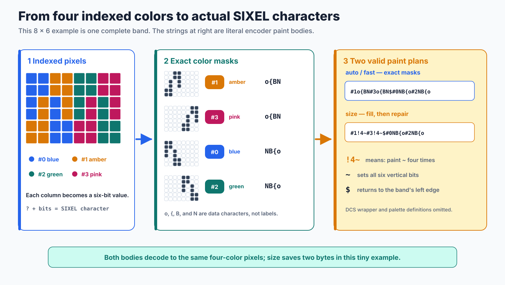
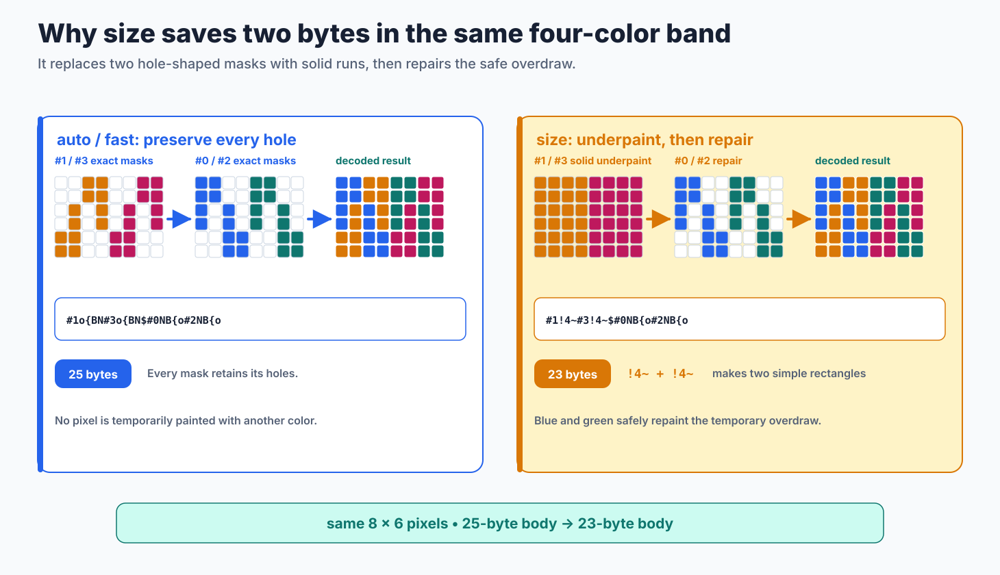
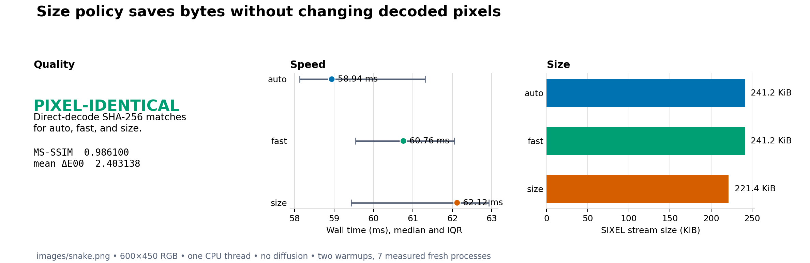

# Encoding Policy

`img2sixel -E POLICY` controls how the already indexed image is serialized into SIXEL bytes. It does not choose the palette, assign pixels to palette entries, or change dithering. Use `-E size` when stream size matters and accept a little extra encoding work; use the default `auto` or explicit `fast` for the direct mask-preserving path.

```console
img2sixel -E size image.png
img2sixel --encode-policy=size image.png
```

The option and its size-oriented overpainting idea were introduced by Araki Ken in [commit `c8283ed`](https://github.com/libsixel/libsixel/commit/c8283ed460aab6baafd72a15f56882e904c8cc8e). His Japanese article ["SIXEL Graphics: 100% Practical Know-How"](https://qiita.com/arakiken/items/4a216af6547d2574d283) is the historical source for the explanation below. This document updates that model for the current implementation and measurements.

## Where `-E` acts

SIXEL divides an image into bands six pixels high. Within a band, a SIXEL data character stores six vertical paint bits. The encoder selects a palette register with `#n`, writes that color's mask, uses `$` to return to the band's left edge, and uses `-` to advance to the next band. Repeated data characters can be shortened with `!n` run-length encoding.

<picture>
  <source media="(max-width: 640px)" srcset="encode-policy-figures/encode-policy-band-mobile.svg">
  
</picture>

*Figure 1. Palette construction and palette application have finished before encoding policy takes effect. The diagram is conceptual; real mask order and run boundaries depend on the indexed image.*

This boundary is useful when diagnosing an option. If changing `-E` changes decoded pixels for the same indexed input, that is a correctness problem rather than an expected quality tradeoff.

## Why `size` can save bytes

The ordinary path preserves the holes in every color mask: it never temporarily paints a pixel belonging to another color. The `size` path may instead fill a span with an early color and let later colors repaint their own pixels. Solid or repeated columns can form shorter `!n` runs, so a little overdraw can produce fewer bytes.

<picture>
  <source media="(max-width: 640px)" srcset="encode-policy-figures/encode-policy-overpaint-mobile.svg">
  
</picture>

*Figure 2. A simplified overpainting example. Whether it saves bytes depends on the mask geometry and the resulting run-length encoding.*

The optimization is not a compressor applied after encoding; it changes the paint plan itself. It is therefore content-dependent. Large spans with reusable fills tend to help, while noisy masks may provide little benefit and can occasionally offset savings with extra paint commands.

## Policies

| Policy | Current behavior | Practical use |
| --- | --- | --- |
| `auto` | The default. It currently follows the same non-size body path as `fast`. | Preserve the default interface so future automatic selection remains possible. |
| `fast` | Preserves each color mask without the size-policy fill and repaint strategy. | Request the direct serialization path explicitly. |
| `size` | Enables safe fill and repaint opportunities and skips some empty work in specialized paths. | Prefer smaller streams when the receiver or transport is the bottleneck. |

`auto` is a policy name, not currently an image-adaptive choice between the other two modes. In the measurement below, `auto` and `fast` produced byte-identical streams. Code should nevertheless pass `fast` when that exact intent matters instead of relying on today's implementation of `auto`.

Transparency is more nuanced than the original 2014 description. Current size-policy code checks whether a band can be filled safely and clips transparent-offset work at image boundaries; it does not categorically reject transparent input. The [alpha policy](../loader/alpha-policy.md) still owns whether a source pixel is composited or omitted, while `-E` only decides how the surviving masks are serialized.

## Measured quality, speed, and size

The controlled comparison used the repository's 600 by 450 `images/snake.png` fixture at revision `a7c9e1a819ccd1e64d682779211fc047681dbc0a`. All three runs used the builtin loader, RGB palette space, 8-bit precision, high quality, a fixed 256-color budget, no diffusion, no GPU, and one CPU thread. Each SIXEL stream was decoded through `sixel2png --direct` before assessment. Speed is fresh-process wall time with two warmups and seven measured runs; the table reports the median and interquartile range on an Apple arm64 host running macOS 26.5.1.



*Figure 3. The dots show median end-to-end time and the whiskers show the interquartile range. Size bars report exact stream bytes converted to KiB.*

| Policy | MS-SSIM | Mean Delta E00 | Median time, IQR | SIXEL bytes |
| --- | ---: | ---: | ---: | ---: |
| `auto` | 0.986100 | 2.403138 | 58.941 ms, 58.123--61.306 | 247,009 |
| `fast` | 0.986100 | 2.403138 | 60.758 ms, 59.548--62.056 | 247,009 |
| `size` | 0.986100 | 2.403138 | 62.121 ms, 59.436--62.925 | 226,666 |

All three direct-decode PNG files had the same SHA-256 digest, so quality was pixel-identical rather than merely equal after metric rounding. `auto` and `fast` also had the same encoded-stream digest. `size` reduced the stream by 20,343 bytes, or 8.24%, while its timing distribution overlapped the other policies. This single fixture demonstrates the intended invariant and one realistic saving; it is not a universal compression ratio or speed ranking.

## Reproduce the comparison

Run the measurement only from a clean tracked worktree so the recorded revision identifies the binary under test:

```console
PYTHON=/path/to/python-with-matplotlib-and-numpy \
tools/reproduce_encoding_mode_measurements.sh
```

The script rebuilds the selected tree, records commands and provenance, measures both this comparison and the companion [high-color comparison](high-color.md), regenerates the plots, and validates semantic invariants. The durable artifacts are the [CSV results](encode-policies/measurements/encode-policy-comparison.csv) and [JSON run record](encode-policies/measurements/encode-policy-run.json). Regenerate the conceptual figures with `tools/reproduce_encoding_mode_figures.sh`; its `--check` mode verifies byte-for-byte freshness.

## Implementation and existing coverage

Policy parsing is in [`encoder.c`](../../src/encoder.c), the public constants are in [`sixel.h`](../../include/sixel.h), and mask serialization is in [`encoder-core-encode.c`](../../src/encoder-core-encode.c). Existing focused coverage includes transparent-offset fill clipping in [`0173_transparent_offset_encode_policy_size.t`](../../tests/quant/palette/usage/0173_transparent_offset_encode_policy_size.t) and size-policy handling of empty OR planes in [`0006_encoder_core_ormode_body_skips_empty_planes.c`](../../tests/processing/encoder-core/0006_encoder_core_ormode_body_skips_empty_planes.c).
