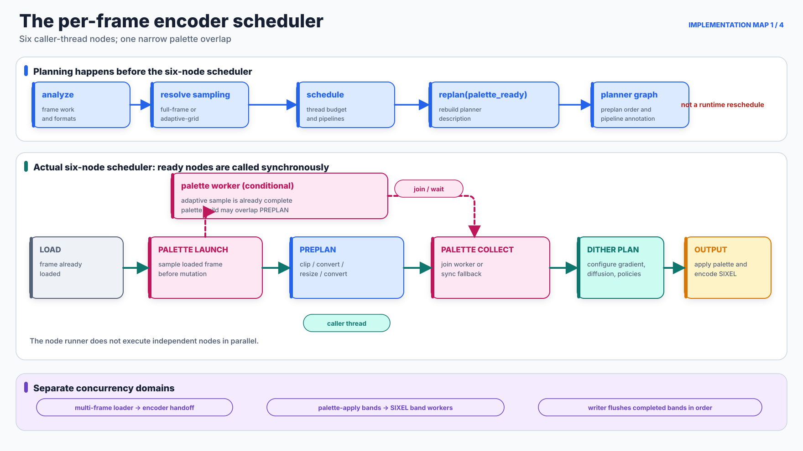

# Encoder Execution Map

## Scope

This document is the implementation-oriented companion to the introductory [Encoding Pipeline](encoding-pipeline.md). It maps the normal per-frame palette path: loader selection, frame preparation, optional palette construction, lookup and dither application, and SIXEL serialization. It also marks the asynchronous boundaries that touch that path.

The diagrams are intentionally layered rather than pretending that one graph has a single meaning. The implementation contains a six-node execution scheduler, a more descriptive planner graph, filters inside those nodes, model-specific palette solvers, and a separate band pipeline inside palette application and output. Collapsing all of them into one flat DAG would imply dependencies and concurrency that do not exist.

High-color output, DRCS, macro playback, 6delta retained-screen comparison, animation timing, and quantized capture share parts of this route but add specialized branches. They are named where they change a boundary, not expanded into every internal step here.

## 1. The scheduler and the real asynchronous boundary

<picture>
  <source media="(max-width: 640px)" srcset="encoder-execution-map-figures/encoder-scheduler-mobile.svg">
  
</picture>

*Figure 1. The per-frame macro scheduler and its adjacent concurrency domains. Solid teal arrows are caller-thread execution dependencies. Dashed magenta arrows are the conditional palette worker lifetime. Purple labels identify concurrency that is implemented elsewhere rather than by this six-node runner.*

[`sixel_encode_dag_run_nodes`](../../src/encoder.c) scans the six macro nodes for satisfied dependency masks and calls each ready node directly. It does not submit independent nodes to a pool, so calling this structure a DAG does not mean that its ready nodes execute concurrently.

| Macro node | What it does in the current path | Execution context |
| --- | --- | --- |
| `LOAD` | Establishes the scheduler dependency root; the frame was already delivered by the loader. | Caller thread; currently a no-op. |
| `PALETTE_LAUNCH` | For adaptive sampling, finishes sampling from the loaded frame before preprocessing may mutate it. When admitted, starts the palette worker after the sample exists. Full-frame sampling waits for preprocessing. | Caller thread for sampling and launch; optional worker for the palette build. |
| `PREPLAN` | Materializes and runs the ordered clip, colorspace, resize, and colorspace filters described by the planner graph. | Caller thread. May overlap only the worker-side palette build. |
| `PALETTE_COLLECT` | Joins the palette worker, executes documented synchronous fallbacks, prepares selected eager lookup structures, and configures diffusion-related state. | Caller thread; waits for the optional worker. |
| `DITHER_PLAN` | Prepares gradient/dither filter state. It does not yet run the whole per-pixel PaletteApply loop. | Caller thread. |
| `OUTPUT` | Calls the encoder output path; ordinary non-indexed input reaches PaletteApply here, then SIXEL band generation. | Caller thread plus the separate optional dither/encode band pipeline. |

The palette overlap is deliberately narrow. `adaptive-grid` sampling reads the loaded frame and completes before `PREPLAN`; only palette construction from that owned sample may run on the worker while `PREPLAN` processes the main frame. The automatic scheduler admits that worker only when palette work is eligible, the resolved sampling policy is adaptive, more than one thread exists, and the thread budget remains above one after the planner's heavy-operation accounting. An explicit adaptive policy can still sample without a worker.

### What `replan` actually means

`sixel_encoding_planner_replan()` is real, but it is not an event-driven runtime rescheduler. It clears and rebuilds the planner's descriptive graph from the analyzed frame state and a `palette_ready` flag. The normal setup calls it during scheduling and again after palette-worker readiness is resolved; verbose planner dumping rebuilds the same description for diagnostics.

The palette branch in that planner graph is omitted when no asynchronous palette job is ready and when a loader-provided indexed palette can be preserved. Synchronous palette construction can nevertheless still happen later in `PALETTE_COLLECT`. The planner graph is therefore a filter-order and pipeline description, not a complete record of every operation that will execute. Palette-worker failure also does not invoke `replan`: `PALETTE_COLLECT` performs its fallback inline.

### Palette worker fallback

The worker is an overlap optimization, so failure to start it does not automatically fail the encode. A thread-creation failure can rebuild synchronously from the already completed adaptive sample. For an automatically selected sampling policy, other palette-worker failures can reset attempt-local binning state and retry synchronously from the preprocessed full frame. An explicitly selected sampling policy does not silently cross into a different sampling policy; its failure is propagated unless the same-sample fallback applies.

The loader/encoder multi-frame handoff and the PaletteApply/encoder band pipeline are separate scheduling systems. Loader handoff becomes eligible only after multi-frame metadata is known and the main thread budget allows it. The callback updates handoff metadata without replanning the per-frame DAG. The band pipeline is entered later from the output node and is described in [Encoder Threading](../threading/encoder.md).

## 2. Loader fallback, frame representation, and preprocessing

<picture>
  <source media="(max-width: 640px)" srcset="encoder-execution-map-figures/frame-preparation-mobile.svg">
  
</picture>

*Figure 2. Loader selection and the two sampling-source boundaries. Blue is the main frame path, magenta is palette sampling, purple is a colorspace/pixelformat conversion, and red is fallback control flow.*

The loader manager constructs an ordered candidate chain. Each component has its own predicate, options, decode implementation, metadata precedence, CMS support, orientation handling, and alpha finalization. A failed candidate advances to the next component only for the explicitly recognized mismatch or decode-error statuses; allocation, argument, cancellation, and other terminal failures stop the chain. Loader CMS is consequently not one universal filter that runs after every decoder. [Image Loader Architecture](../loader/README.md) expands the `-L` construction rule, compiled backend registry, exact fallback boundary, and backend-dependent output contract.

### The frame is not universally RGBA

The stable handoff is a semantic frame, not a particular four-channel byte layout. A frame records dimensions, byte or float pixels, `pixelformat`, `colorspace`, animation timing, optional indexed palette metadata, a possible transparent palette index, alpha-zero interpretation, and an optional per-pixel transparency mask.

Common concrete forms include:

- three-component byte or float pixels plus an optional binary transparency mask;
- indexed pixels plus a palette and transparent palette index;
- a temporary packed alpha-bearing layout when a loader or later transparency path still needs it.

The first form is common after normalization, but it is not universal. Code at this boundary must inspect the frame's `pixelformat` and transparency metadata. Labels such as “Loaded Frame (RGBA)” or “Get pixel (RGBA)” would be incorrect as general contracts.

### Preplan order and color conversions around resize

The planner builds the main preprocessing order as:

```text
loaded frame
  -> optional early clip when clipfirst is active
  -> optional colorspace/pixelformat conversion to the resize input
  -> optional resize
  -> optional late clip when clipfirst is false
  -> optional colorspace/pixelformat conversion to the effective working representation
```

Ordinary quality-preserving resize converts non-float input to linear RGB float32, resamples there, and converts again after resizing when the working representation differs. An explicit preserve-precision runtime mode can keep integer input in RGB888 instead. Non-RGB working spaces cannot be resampled directly and therefore pass through the selected linear RGB scale representation. Alpha-bearing key-preservation paths can suppress a post conversion that would otherwise discard the still-required alpha channel.

Adaptive sampling branches from the loaded frame before this chain and owns a compact sample frame. Full-frame sampling runs after preprocessing and borrows the resulting frame. These sources intentionally differ; thread count can therefore affect the automatically resolved sample population even though the named quantizer is unchanged.

### Every colorspace boundary

| Boundary | Conversion controlled here |
| --- | --- |
| Loader-local CMS | File/profile interpretation to `cms_target`, using the selected loader's supported CMS path and metadata precedence. |
| Resize input | Loaded/current representation to the scale input, normally linear RGB float32 for quality-preserving resize. |
| Resize output | Scale representation to the effective main-image working representation selected by `-W`. |
| Palette input | Sample view to the clustering representation selected by `-X`. |
| Generated palette handoff | Completed palette from `-X` coordinates to `-W` coordinates. |
| Wire palette copy | Reusable working palette from `-W` to the output RGB coordinates selected by `-U`. |
| SIXEL color introducer | Emit type-2 RGB percentages, or convert those RGB components to DEC's rotated type-1 HLS coordinates when HLS palette output is selected. |

The last two operations are different. `-U` changes the RGB basis of a private palette copy before serialization. HLS palette output then derives hue, lightness, and saturation from that RGB copy and emits a different DECGCI representation; it is not the `-X` or `-W` clustering geometry.

## 3. Generated palette construction

<picture>
  <source media="(max-width: 640px)" srcset="encoder-execution-map-figures/palette-build-mobile.svg">
  
</picture>

*Figure 3. Common palette contracts around model-specific solver bodies. A uniform card shape means that every solver returns a palette object; it does not mean that every solver performs the same initialization, iteration, or finalization.*

`sixel_encoder_prepare_palette()` resolves the effective quantizer and binning contracts, selects or clones the palette-building frame, converts that view to `-X` when required, and calls the palette component. Binning is a separate artifact boundary: `none`, `exact`, `hard`, and `soft` produce different retained populations and weights before the solver begins.

The top-level `-Q auto` compatibility value currently selects Heckbert; it is not an image-dependent competition among all models. Explicit K-means, K-medoids, and K-center requests prefer their float32 engine when the input and precision path permit it. A failed float engine can retry a legacy byte engine when doing so does not violate an exact-coordinate binning contract. A failed requested solver can then fall back to Heckbert for compatibility. Attempt-local telemetry records the engine and retry count.

| Quantizer family | Initialization and preprocessing | Repeated or principal work | Model-specific result |
| --- | --- | --- | --- |
| Heckbert median cut | Build a finite color histogram and one initial occupied box. Profiles select range, luminance, or PCA-oriented split behavior and representative rules. | Repeatedly choose and split boxes near a weighted median until the provisional target is reached. | One representative per leaf; an optional oversplit result can enter Ward merge. |
| K-means | Construct weighted points, select legacy distance-weighted or PCA seeds, and run the requested restarts. | Assign points to nearest centroids and replace centroids with weighted means until the configured stop; pruning, feedback, and polishing alter this body. | Continuous centroids minimizing a local weighted squared-error objective. |
| K-medoids | Construct or reduce a candidate set and select sample-constrained medoids. | `pam`, CLARA `sample`, CLARANS `random`, and `bandit` execute different exhaustive, sampled, randomized, or progressive swap searches. | Representatives remain retained samples before optional Ward merge. |
| K-center | Collect/prune candidate points and seed one or more trials. | Farthest-first traversal, replacement swaps, or a hybrid of both; optional polish is accepted only under the radius guard. | A discrete center set selected primarily to control maximum nearest-center distance before optional Ward merge. |

The common telemetry fields `init`, `iterate`, `merge`, and `export` are accounting categories. They must not be read as evidence that all four families share one loop or even that every algorithm has a meaningful iterative phase.

### Final palette ordering

Optional Ward final merge and supported Lloyd passes run inside the model-specific builders. Snap timing may add hooks inside solver iterations or merge iterations; when snap is enabled, the generated palette also receives its required final snap. The current byte-palette path then applies cover repair in `palette.c`, after final snap. This ordering means a cover replacement can introduce an entry outside the reversible snap set.

After the palette component returns, the encoder converts generated entries from clustering space `-X` to working space `-W`. If the transparency policy reserves a key, the encoder appends that key entry after the conversion and excludes it from ordinary nearest-color competition.

Monochrome, built-in, map-file, grayscale-preserving, and qualifying indexed-input paths bypass some or all sampling, binning, solver, merge, snap, and cover work. They still proceed to the working image, lookup/dither, and wire-output stages that apply to their representation. A fixed palette must not be drawn as though it passed through `-Q`.

For the mathematical objective and detailed sub-algorithms of each family, see [Palette Quantization](quantization.md). [Palette Construction Pipeline](palette-pipeline.md), [Final Palette Merge Policy](merge-policy.md), [Palette Snap Policy](snap-policy.md), and [Palette Cover Policy](cover-policy.md) define the surrounding policies.

## 4. Lookup, per-pixel application, and output

<picture>
  <source media="(max-width: 640px)" srcset="encoder-execution-map-figures/palette-apply-output-mobile.svg">
  
</picture>

*Figure 4. The final mapping and wire stages. “Read sample” means a sample in the current working pixelformat and colorspace plus separate transparency metadata; it does not mean RGBA.*

### Lookup preparation is policy-specific

`PALETTE_COLLECT` eagerly runs planner filters only for FHEDT, VP-tree, and Eytzinger. Those filters build a prepared lookup-policy object and attach it to the dither state. Other policies, including direct `none`, dense 5-bit/6-bit tables, certlut, RBC, Mahalanobis, and automatic selection, are selected, prepared, or reused through `sixel_dither_prepare_lookup_policy()` when PaletteApply establishes its serial or worker-local context. A prepared object can still be reused across these boundaries.

This distinction matters in performance traces: “lookup preparation” is not guaranteed to be one node immediately after palette generation. Some policies pay a substantial eager build, some allocate a lazy cache and populate it on queries, and `none` performs an exhaustive palette scan for every candidate.

### The per-pixel loop belongs to the dither policy

`sixel_dither_apply_palette()` resolves precision, transparency fences, GPU eligibility, scan order, the dither policy, and the lookup policy. The selected `IDitherPolicy.apply()` implementation then owns the serial or per-band pixel loop. Its conceptual contract is:

```text
for each sample in the policy's scan order:
    if transparency metadata marks the sample:
        emit the reserved key index and skip ordinary lookup
    candidate = policy_adjust(sample, position, carried_state)
    index = lookup_policy.map_pixel(candidate)
    apply an optional 6delta keep decision
    emit index
    residual = candidate - palette[index]
    update diffusion or ordered-policy state
```

The exact order has specialized fences for 6delta, inter-frame modes, accumulation capture, and GPU execution, but the lookup remains the operation that selects a palette index. `-d none` still calls lookup per pixel; `--lookup-policy=none` still runs PaletteApply and any selected dither policy.

When eligible, the CPU pipeline divides PaletteApply into overlapped row bands and notifies SIXEL band workers as output rows become ready. Lookup state can be shared or worker-local according to policy. A writer thread flushes encoded band buffers in image order. GPU PaletteApply instead produces a complete index plane after its command-buffer wait, so CPU workers are assigned to encoding after the result becomes visible.

### Palette serialization and RGB/HLS output

The core copies byte and, when available, float palette entries so the reusable dither palette remains in `-W`. It converts the private copy from the core's source colorspace to `-U`, preferring the float copy to avoid an unnecessary byte-rounding cycle. Indexed rows and the converted palette then enter SIXEL serialization.

RGB palette output emits DECGCI type 2 with integer component percentages. HLS palette output reads the RGB components, calculates lightness and saturation, rotates hue by 120 degrees to DEC's blue-zero convention, and emits DECGCI type 1. The encoder then emits palette selections, six-pixel-high raster bands, runs, carriage movement, and the configured DCS envelope.

## Implementation landmarks

| Concern | Primary symbols and files |
| --- | --- |
| Six-node scheduler and palette fallback | `sixel_encode_dag_run_nodes`, `sixel_encode_dag_node_palette_launch`, `sixel_encode_dag_node_palette_collect`, and `sixel_encoder_encode_frame_internal` in [`encoder.c`](../../src/encoder.c) |
| Planner graph, replan, and thread admission | `sixel_encoding_planner_build_dag`, `sixel_encoding_planner_schedule`, `sixel_encoding_planner_replan`, and `sixel_encoding_planner_update_loader_handoff` in [`planner.c`](../../src/planner.c) |
| Loader candidate chain | `sixel_loader_manager_load` in [`loader-manager.c`](../../src/loader-manager.c) and `sixel_helper_load_image_file` in [`loader.c`](../../src/loader.c) |
| Frame representation | `sixel_frame` in [`frame-private.h`](../../src/frame-private.h), with the semantic contract in [Pixel Formats and Alpha Representation](../concepts/pixelformat.md) |
| Preplan filters and color conversion | `sixel_encode_dag_node_preplan`, `sixel_encoder_convert_frame_colorspace`, and `sixel_encoder_convert_palette_colorspace` in [`encoder.c`](../../src/encoder.c) |
| Palette dispatch | `sixel_encoder_prepare_palette` in [`encoder.c`](../../src/encoder.c) and `sixel_palette_vtbl_generate` in [`palette.c`](../../src/palette.c) |
| Quantizer implementations | [`palette-heckbert.c`](../../src/palette-heckbert.c), [`palette-kmeans.c`](../../src/palette-kmeans.c), [`palette-kmedoids.c`](../../src/palette-kmedoids.c), and [`palette-kcenter.c`](../../src/palette-kcenter.c) |
| Lookup preparation and PaletteApply | `sixel_encoder_apply_lut_filter` in [`encoder.c`](../../src/encoder.c), plus `sixel_dither_apply_palette` and `sixel_dither_resolve_indexes` in [`dither.c`](../../src/dither.c) |
| Per-policy pixel loops | [`dither-policy-none.c`](../../src/dither-policy-none.c), [`dither-policy-fs.c`](../../src/dither-policy-fs.c), and the other `dither-policy-*.c` implementations |
| Wire palette conversion and RGB/HLS | `sixel_encode_dither`, `output_rgb_palette_definition`, and `output_hls_palette_definition` in [`encoder-core-encode.c`](../../src/encoder-core-encode.c) |

## Reproducing the figures

The figures are deterministic explanatory assets generated from reviewed topology, not timing measurements extracted from a run:

```sh
tools/reproduce_encoder_execution_map_figures.sh
tools/reproduce_encoder_execution_map_figures.sh --check
```

The semantic roles and implementation anchors used by the generator are recorded in [`encoder-execution-map-figures.json`](encoder-execution-map-figures/encoder-execution-map-figures.json). When any referenced execution boundary changes, update the prose, both aspect-ratio variants, and the manifest together.
