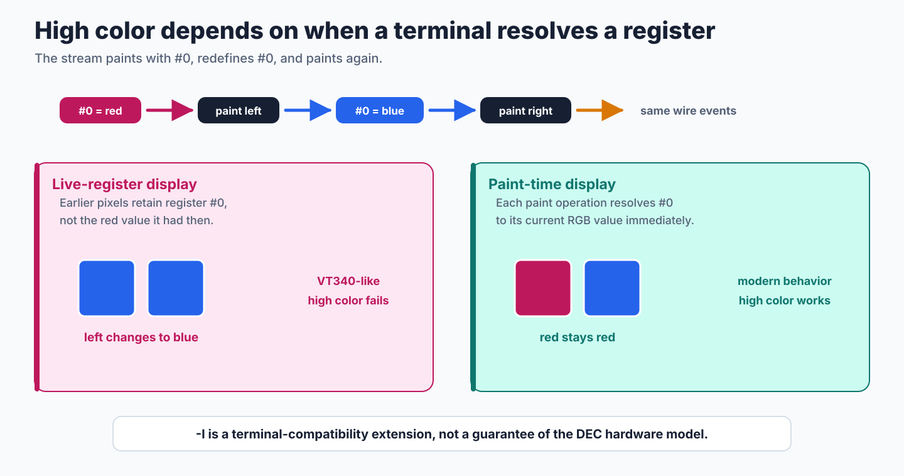
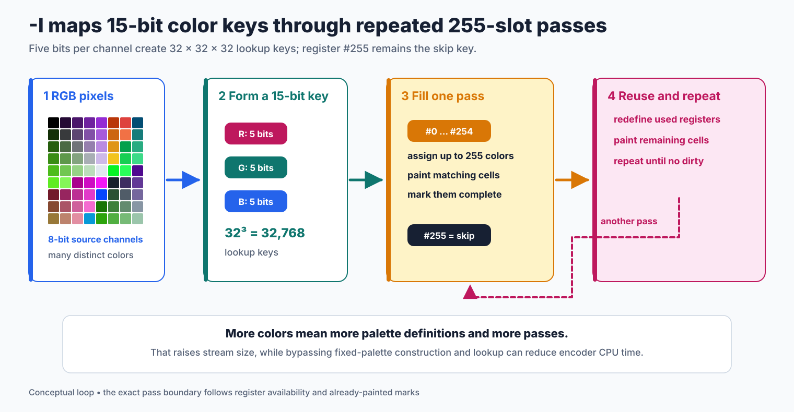
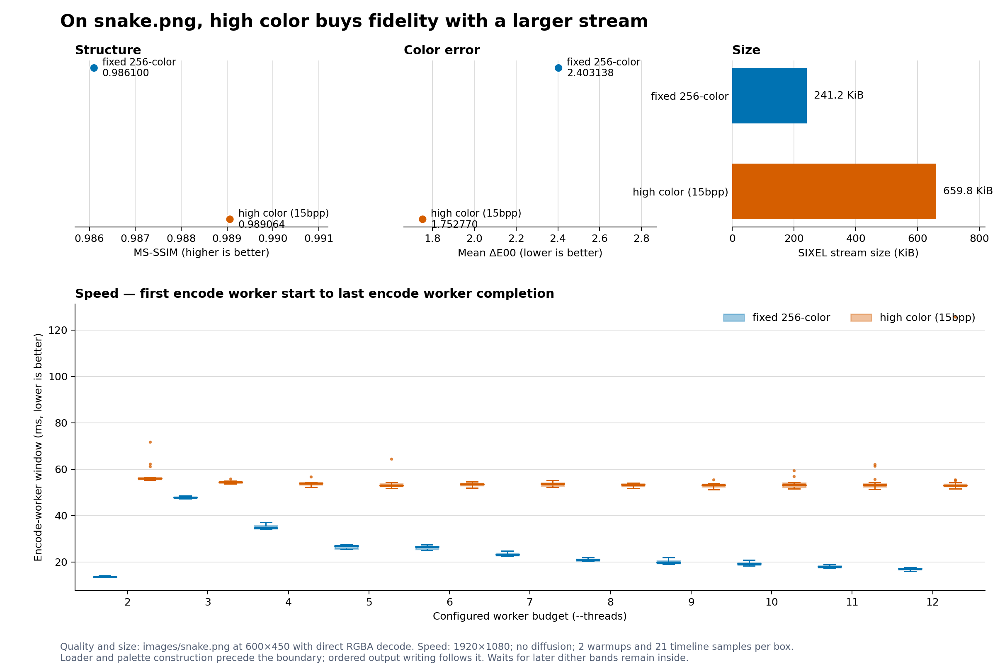
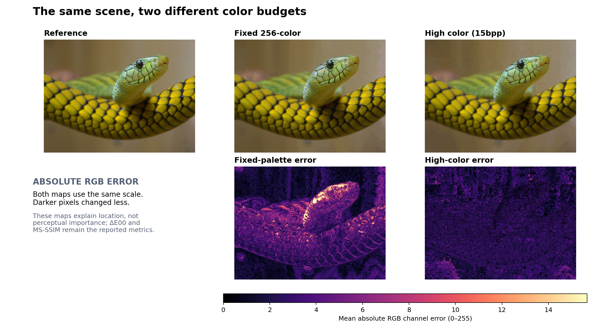

# High-Color Output

`img2sixel -I` enables libsixel's high-color extension. Instead of reducing the entire image to one palette of at most 256 entries, it redefines palette registers while painting. The source RGB is first reduced to five bits per channel, so the mode offers a 32 by 32 by 32 lattice: 32,768 possible colors, commonly described as 15bpp.

```console
img2sixel -I image.png
img2sixel --high-color image.png
```

Araki Ken introduced the high-color encoder in [commit `0382aef`](https://github.com/libsixel/libsixel/commit/0382aef1afa5333ad2d69f4412900accca866ef2); its current CLI switch is `-I`. His Japanese article ["SIXEL Graphics: 100% Practical Know-How"](https://qiita.com/arakiken/items/4a216af6547d2574d283) explains the original motivation, algorithm, and terminal distinction. This document keeps that mental model but describes the current CLI and measurements.

## The terminal decides whether it works

The extension relies on paint-time palette semantics. Suppose a stream defines register `#0` as red, paints a pixel, redefines `#0` as blue, and paints another pixel. A paint-time renderer resolves the RGB value when each pixel is drawn, leaving one red and one blue pixel. A live-register renderer retains the register reference, so redefining `#0` also changes the earlier pixel to blue.

<picture>
  <source media="(max-width: 640px)" srcset="high-color-figures/high-color-register-mobile.svg">
  
</picture>

*Figure 1. The same wire events produce different pixels under the two register models.*

Historical DEC hardware such as the VT340 follows the live-register model, so high color is not a guarantee of the original hardware semantics. Use `-I` only with a receiving terminal known to implement paint-time register resolution. Terminal support can change independently of libsixel and must be verified on the actual receiver.

## How repeated passes extend the palette

The encoder reduces each RGB channel from eight bits to five and packs the result into a 15-bit color key. It uses registers `#0` through `#254` for paint colors and reserves `#255` as a skip key. A pass assigns available registers to new colors, paints matching pixels, and marks them complete. If colors remain, later passes reuse registers with new definitions and paint only the unfinished pixels.

<picture>
  <source media="(max-width: 640px)" srcset="high-color-figures/high-color-passes-mobile.svg">
  
</picture>

*Figure 2. Conceptual high-color loop. Exact pass boundaries depend on register availability, color reuse, and already-painted marks.*

This is why high color can improve fidelity and enlarge the stream at the same time: the image can use far more distinct colors, but it may carry repeated palette definitions and multiple paint passes.

## Pipeline and option interactions

High color is an alternate encoding path, not a larger value for `-p`.

- It bypasses fixed-palette construction and fixed-palette nearest-color lookup. `-p`, `-b`, `-m`, and `-e` select incompatible color modes and are rejected when combined with `-I`.
- The current CLI resolves palette-space diffusion to `none` for `-I`. Supplying `-d fs` or another diffusion method does not recreate the historical high-color diffusion path described in the 2014 article.
- Register `#255` is an internal skip value for multi-pass painting. Transparent offset is supported as a separate geometry feature; source alpha semantics still follow the [alpha policy](../loader/alpha-policy.md).
- Validation must use a direct decoder. A final indexed plane and final palette cannot represent the earlier colors painted before a register redefinition. Use `sixel2png --direct` (`-D`) rather than an indexed snapshot. See the [PNG writer boundary](../writers/png.md) for details.

## Measured quality, speed, and size

The controlled comparison used `images/snake.png` at revision `24e46743fd78167db78ca9d72754e50b6a834947`. The baseline requested a fixed 256-color palette; the other run enabled `-I`. Both used the builtin loader, RGB palette space, 8-bit precision, high quality, no diffusion, no GPU, and the fast encoding policy. Quality and size used the original 600 by 450 image with one thread, and output was decoded through the direct RGBA path before `lsqa` assessment.

Speed was measured separately on the same image scaled to 1920 by 1080. Each box contains 21 runs after two warmups for one `--threads` value from 2 through 12. A run begins at the first `encode/worker/worker_start` event and ends at the last `encode/worker/worker_done` event across all high-color passes. Loader, fixed-palette construction, dither before the first encode worker, and ordered writer work are outside the interval; waits for later band results after the first worker starts remain inside. One-thread mode emits no encode-worker events and is omitted rather than mixed with another timing boundary.



*Figure 3. Quality, encode-worker-window speed, and exact stream size for this fixture. Thread count is the speed panel's horizontal axis. Box centers are medians, boxes are interquartile ranges, whiskers extend to 1.5 times the IQR, and points are outliers. The 125.683 ms point at 12 threads is retained rather than hidden.*

| Mode | MS-SSIM | Mean Delta E00 | SIXEL bytes |
| --- | ---: | ---: | ---: |
| Fixed 256-color | 0.986100 | 2.403138 | 247,009 |
| High color, 15bpp | 0.989064 | 1.752770 | 675,644 |

| Threads | Fixed 256-color median [Q1--Q3] | High color median [Q1--Q3] |
| ---: | ---: | ---: |
| 2 | 13.634 [13.590--13.773] ms | 56.103 [55.696--56.462] ms |
| 3 | 47.870 [47.619--47.993] ms | 54.363 [54.013--54.546] ms |
| 4 | 34.697 [34.415--35.605] ms | 53.838 [53.458--54.234] ms |
| 8 | 21.007 [20.548--21.182] ms | 53.341 [52.589--53.689] ms |
| 12 | 17.116 [16.790--17.376] ms | 53.064 [52.581--53.567] ms |

On this image, high color improved MS-SSIM by 0.002964 and reduced mean Delta E00 by 27.06%, but produced a stream 2.735 times as large. Once palette construction and lookup are excluded, high color is not the faster encoder: its repeated register-definition and paint passes held the median encode window near 53--56 ms across the thread grid. The fixed 256-color path fell from 47.870 ms at 3 threads to 17.116 ms at 12 threads. Its still shorter 13.634 ms interval at 2 threads reflects the different pipeline schedule: dithering has already finished when encode workers start, so it is not an end-to-end comparison with the overlapping plans.

High-color IQR did not grow monotonically either. It reached 1.809 ms at 10 threads, then narrowed to 0.985 ms at 12 threads despite one 125.683 ms outlier. More distinct 15-bit colors can require more passes, and the larger stream can dominate transport latency after the measured worker interval. These results should not be generalized to every image, build, loader, scheduler, or receiving terminal.



*Figure 4. The top row shows the source and both direct decodes. The lower maps use one shared scale for mean absolute RGB channel error; they locate changed pixels but do not replace the perceptual metrics.*

## Reproduce the comparison

Run from a clean tracked worktree with Python, Matplotlib, and NumPy available:

```console
PYTHON=/path/to/python-with-matplotlib-and-numpy \
tools/reproduce_encoding_mode_measurements.sh
```

The [quality and size CSV](high-color/measurements/high-color-comparison.csv) contains exact metrics, sizes, and commands. The [raw speed samples](high-color/measurements/high-color-speed.csv) record every event boundary, worker-event count, thread budget, and schedule position. The [JSON run record](high-color/measurements/high-color-run.json) adds build, binary, input, platform, and compact timing summaries. The same script also regenerates the companion [encoding-policy comparison](encode-policy.md). Regenerate the conceptual figures with `tools/reproduce_encoding_mode_figures.sh`; use its `--check` mode in verification.

## Implementation and existing coverage

The repeated-pass implementation is in [`encoder-core-highcolor.c`](../../src/encoder-core-highcolor.c), CLI mode selection and diffusion bypass are in [`encoder.c`](../../src/encoder.c), and direct decoding is implemented on the decoder path. Focused tests verify the 255 paint-register boundary in [`0166_high_color_sixel_direct_palette_slots.t`](../../tests/quant/palette/usage/0166_high_color_sixel_direct_palette_slots.t), preservation across direct decoding in [`0023_decoder_high_color_dequantize_bypass.c`](../../tests/processing/decoder/0023_decoder_high_color_dequantize_bypass.c), and transparent-offset geometry in [`0175_transparent_offset_high_color_geometry.t`](../../tests/quant/palette/usage/0175_transparent_offset_high_color_geometry.t).
