# High-Color Measurements

This reference accompanies [High-color output](../high-color.md). It separates ordinary photographs and ramps from a deliberately adversarial key-reuse diagnostic. All numbers describe the retained build and inputs; no corpus-wide quality claim follows from these few images.

## Method and artifacts

Measurements were made on 2026-09-13 JST (2026-09-12 UTC), macOS arm64, with 14 logical CPUs, from clean revision `3c92b3a1cc` (the full hash is in the [run record](study/results.json)). The detached build uses `CFLAGS=-O3` and the builtin loaders, with external image loaders and CMS disabled. The run record retains configure arguments, compiler, library hash, measurement-generator hash, renderer hash, dependency versions, source hashes, exact CLI controls, every timing sample, and raw histogram bins.

Three requested policies are compared: 256 colors without diffusion, 256 colors with Floyd–Steinberg diffusion, and `-I` without diffusion. They share 8-bit precision, high quality, GPU off, RGB palette definitions, and `-E fast`; other policies retain that revision's defaults. FS is included because comparing only against undithered 256 colors would omit a useful quality alternative. The generator also verifies that requesting `-I -d fs` produces identical bytes to `-I -d none` on every fixture: the current easy-encoder path bypasses that diffusion request.

Each PNG fixture is encoded through `img2sixel`, decoded with `sixel2png -D --threads=1`, and assessed with `lsqa`. Images and stream sizes in the quality tables use one encode thread. The PNGs are direct RGBA reconstructions, not screenshots from a receiving terminal. View the original-resolution images for pixel inspection; browser scaling, display calibration, and terminal-specific palette behavior are outside this experiment.

The reference fixtures are:

| Input | Raster | Source RGB colors | Occupied 15bit keys | Preparation |
| --- | ---: | ---: | ---: | --- |
| [snake](study/snake-source.png) | 600×450 | 62,586 | 2,967 | RGB conversion; fit within 600x450, Lanczos, no enlargement |
| [autumn](study/autumn-source.png) | 600×302 | 52,222 | 783 | RGB conversion; fit within 600x450, Lanczos, no enlargement |
| [gradient](study/gradient-source.png) | 600×450 | 131,200 | 2,486 | RGB conversion; fit within 600x450, Lanczos, no enlargement |
| [gray](study/gray-source.png) | 768×96 | 256 | 32 | 768x96; RGB=(floor(x/3),)*3 |
| [revisit](study/revisit-source.png) | 256×256 | 65,536 | 32,768 | 256x256; keys 0..32767 twice in row order; RGB=(key channels)*8 + (0 then 7) |
| [snake-fhd](study/snake-fhd-source.png) | 1920×1080 | 334,428 | 4,008 | resize to 1920x1080 with Lanczos; timing control, aspect ratio changed |

The Full HD image deliberately changes aspect ratio and is a timing control. The gray ramp repeats each of the 256 neutral RGB values for three columns. The generated revisit image traverses every 15bit key twice, using low bits 0 on the first traversal and 7 on the second; it has 65,536 source colors but only 32,768 keys. These diagnostic fixtures are deterministic synthetic inputs, not natural-image samples.

## Quality and size

MS-SSIM is the general perceptual metric; mean ΔE00 describes color error. Their rankings need not agree. The [measurement policy](../../quality/measurement-policy.md) targets 0.98 for normal quality gates. Low values here expose current limitations; they are not relaxed test thresholds.

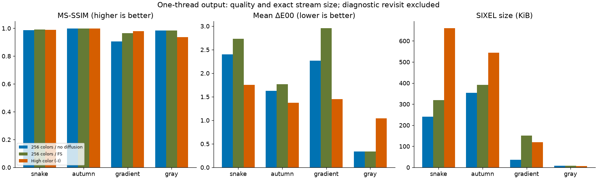

| Fixture | Requested policy | Actual painted RGB colors | MS-SSIM ↑ | Mean ΔE00 ↓ | SIXEL bytes |
| --- | --- | ---: | ---: | ---: | ---: |
| snake | 256 / none | 254 | 0.986100 | 2.403138 | [247,009](study/snake-256-none.six) |
| snake | 256 / FS | 254 | 0.991198 | 2.728167 | [326,104](study/snake-256-fs.six) |
| snake | `-I` / none | 14,838 | 0.989064 | 1.752770 | [675,644](study/snake-high.six) |
| autumn | 256 / none | 256 | 0.998199 | 1.625273 | [361,425](study/autumn-256-none.six) |
| autumn | 256 / FS | 256 | 0.998252 | 1.769629 | [401,295](study/autumn-256-fs.six) |
| autumn | `-I` / none | 4,270 | 0.998061 | 1.374330 | [556,192](study/autumn-high.six) |
| gradient | 256 / none | 255 | 0.904965 | 2.269080 | [37,059](study/gradient-256-none.six) |
| gradient | 256 / FS | 256 | 0.964675 | 2.954400 | [155,093](study/gradient-256-fs.six) |
| gradient | `-I` / none | 1,714 | 0.979565 | 1.446631 | [122,511](study/gradient-high.six) |
| gray | 256 / none | 64 | 0.983637 | 0.338442 | [7,414](study/gray-256-none.six) |
| gray | 256 / FS | 64 | 0.983637 | 0.338442 | [7,414](study/gray-256-fs.six) |
| gray | `-I` / none | 32 | 0.937472 | 1.044751 | [6,490](study/gray-high.six) |

The snake's high-color stream is 2.74× the undithered 256-color stream, yet its MS-SSIM remains below 256-color FS. Autumn gains a little in mean color error while losing a little in MS-SSIM. The gradient improves substantially, but still misses 0.98. On the gray ramp, `-I` is worse than either 256-color request and falls below 0.95. “More colors” is therefore not a quality guarantee, and neither speed nor size has a universal ordering.

## Visual comparisons

In every comparison, left is requested 256 colors without diffusion, center is requested 256 colors with FS, and right is `-I`. The lower row shows mean absolute RGB8 error against the source, on the same 0–12 scale with values above 12 clipped. It locates deviations, not perceptual severity. Original source images are linked in the fixture table.

### Photographs

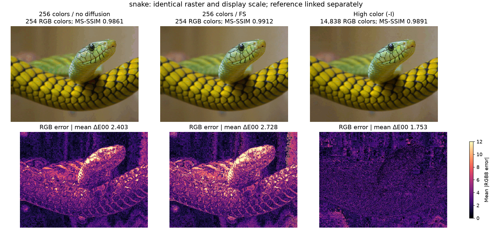

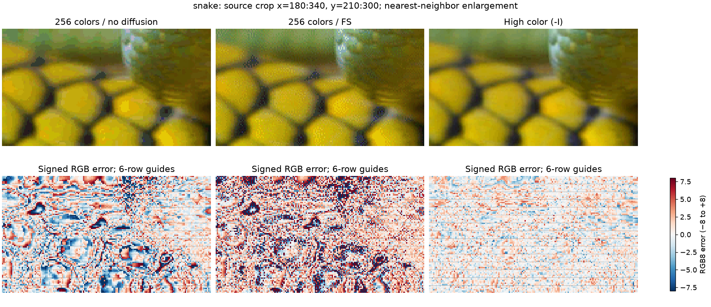

The crop keeps the source pixels and uses nearest-neighbor enlargement. Gray guide lines on the error maps mark six-row boundaries; no guides are added to the decoded images. High color reduces much of the color error, while some texture is better represented by 256-color FS.

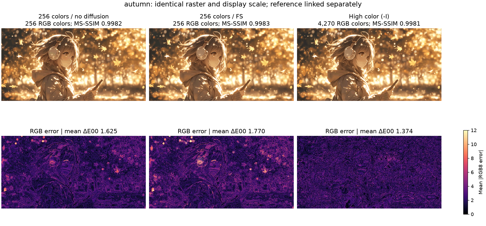

### Smooth gradients and banding

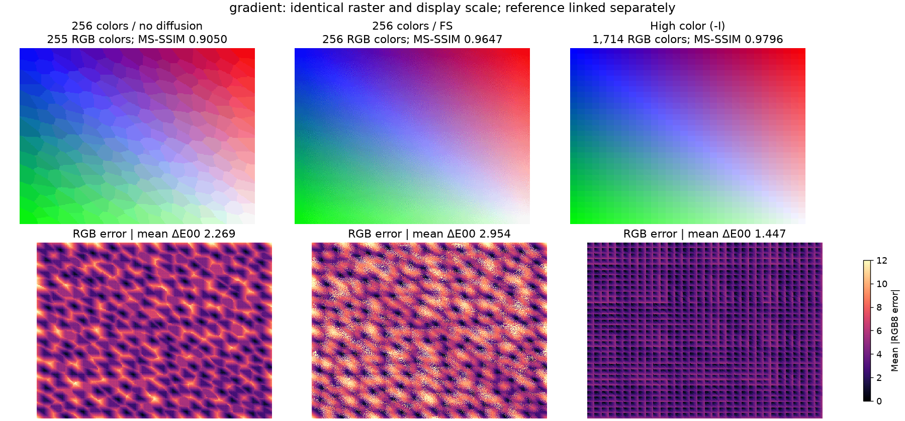

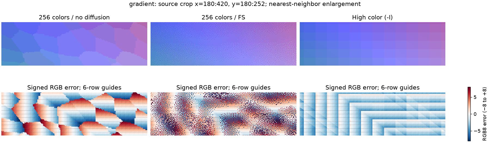

High color visibly retains rectangular regions of constant color in the smooth ramp. Both vertical tone steps and horizontal transitions are visible in the enlargement. The error-map guides make their relationship to SIXEL's six-row grid inspectable; the guides do not prove that every visible contour is caused by a band boundary. The source itself varies smoothly, while the code's key grouping and stateful representative selection provide mechanisms for quantization steps and scan-dependent patches. A future band reset must be checked here because independently choosing a representative in every band can strengthen such seams.

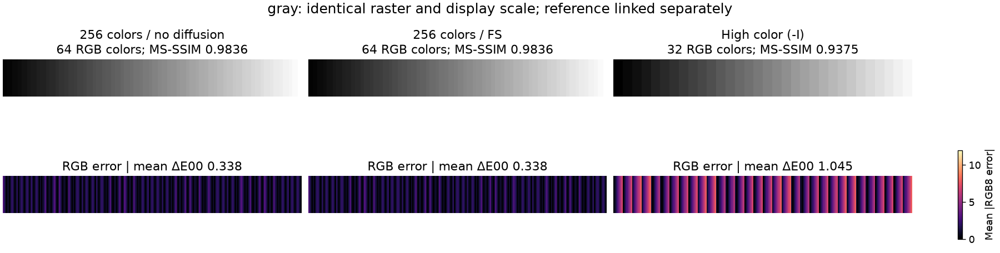

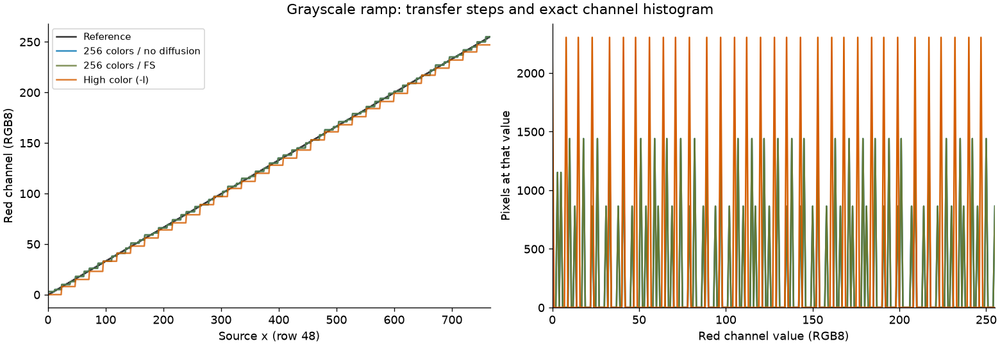

The high-color neutral axis has only 32 keys, despite a three-dimensional key space of 32,768. Its grayscale steps are coarser than those from the requested 256-color path. The latter actually uses 64 RGB values in this setup, not 256; the exact-palette bypass also makes its two diffusion requests identical on this fixture. The transfer plot uses source row 48. Its histogram counts pixels at each RGB8 red-channel value; all three channels are equal in this fixture.

## What 32768 means

The current key is `((R & 0xf8) << 7) | ((G & 0xf8) << 2) | (B >> 3)`. It has 32,768 possible values. A cache hit reuses the current representative, but insertion copies the source RGB channels into the register. In the no-diffusion path, `dither_func_none()` does not clear the low bits. Eviction followed by another visit to the same key can therefore emit a different RGB representative. The RGB palette writer rounds each channel to a percentage with `(value * 100 + 127) / 255`, and the direct decoder rounds it back with `(percent * 255 + 50) / 100`.

Count these distinct quantities separately:

- **Source RGB colors:** exact distinct RGB8 triplets in the prepared input.
- **Occupied keys:** distinct top-five-bit keys, necessarily at most 32,768.
- **Registers:** at most 255 paint slots in `-I`; slot 255 is the skip key. This does not limit colors per whole image or even colors per completed six-row band.
- **Definition events:** every `#n;2;R;G;B` event in the stream, including repetitions and unused initial definitions.
- **Distinct defined RGB values:** unique RGB percentage triplets across those events. A definition does not necessarily paint a pixel.
- **Actual painted RGB colors:** unique RGB8 triplets in opaque direct-decoded pixels inside the declared source rectangle. Neither transparent gaps nor pixels beyond that rectangle contribute.

| Fixture | Source RGB colors | Source keys | `-I` painted RGB colors | Distinct defined RGB values | Definition events |
| --- | ---: | ---: | ---: | ---: | ---: |
| snake | 62,586 | 2,967 | 14,838 | 14,838 | 20,655 |
| autumn | 52,222 | 783 | 4,270 | 4,270 | 11,985 |
| gradient | 131,200 | 2,486 | 1,714 | 1,714 | 2,805 |
| gray | 256 | 32 | 32 | 32 | 255 |
| revisit | 65,536 | 32,768 | 57,656 | 57,656 | 64,770 |
| snake-fhd | 334,428 | 4,008 | 31,215 | 31,215 | 57,885 |

In particular, the revisit diagnostic exceeds 32,768 actual RGB colors. That does not imply uniform precision above 15bit; repeated representatives in a key do not restore all the source colors lost on cache hits. It also has correctness failures, described below. A raw indexed decoder's final palette would conceal this history and is unsuitable for this count.

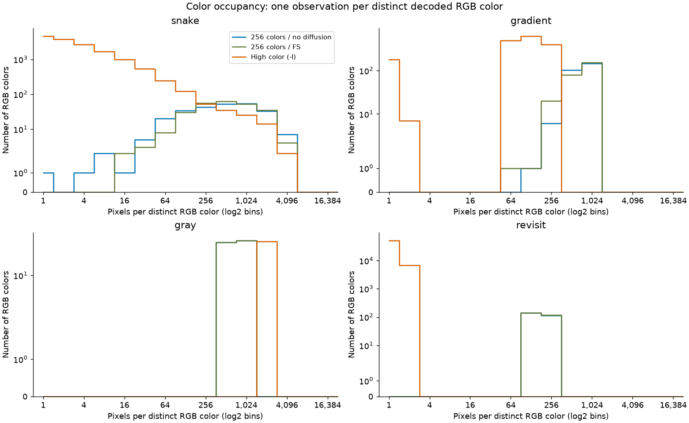

Each occupancy histogram counts RGB colors with 1, 2–3, 4–7, and subsequent powers-of-two pixel frequencies. Its vertical axis uses a symmetric-log scale with a linear region around zero, preserving empty bins. The complete bins, per-channel histograms, and unique RGB count for each six-row band are retained in [results.json](study/results.json). Histograms use the same painted-rectangle definition as the table; a large population of rare colors alone says nothing about perceptual fidelity.

## Key-reuse correctness diagnostic

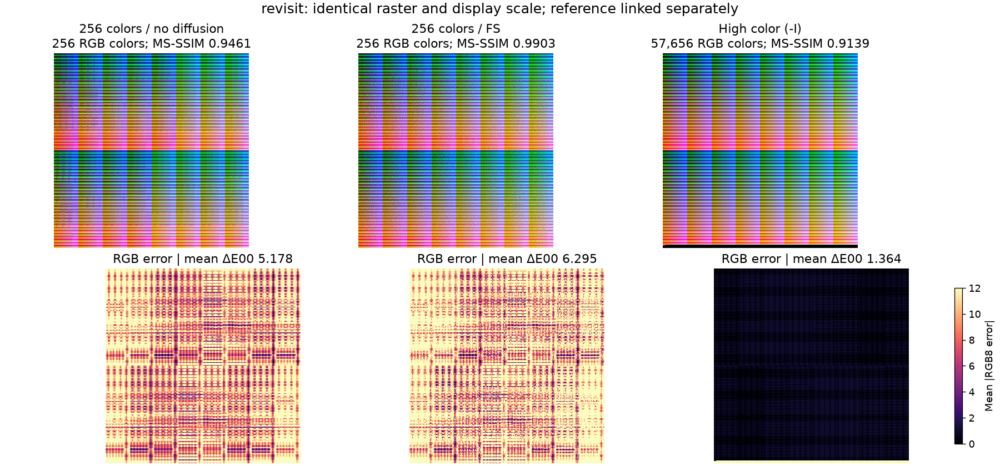

The 256×256 revisit input decodes from the high-color stream to **256×259**, leaves **1,021 pixels unpainted inside the source rectangle**, and paints beyond its bottom. These are reproducible correctness failures, not merely low-quality quantization. The original [SIXEL stream](study/revisit-high.six) and [unmodified RGBA PNG](study/revisit-high.png) retain them. The measurement tool checks both the CLI and the in-memory API, and high-color pixels match at one and eight requested encode threads.

For the displayed comparison and `lsqa` only, the output is cropped to the 256×256 source rectangle and unpainted pixels are composited on black. This normalization is explicit and does not count as a successful dimension or coverage check. Its resulting MS-SSIM is 0.913880, mean ΔE00 is 1.363718, and size is 1,220,925 bytes. The full decoded dimensions, missing pixels, painted pixels outside the source, and the crop flag remain in the JSON record. The 57,656-color count excludes gaps and out-of-bounds pixels. This case must not be used to claim that the implementation correctly reproduces a full 15bit lattice.

## Speed and thread budgets

All timings use public in-process APIs through a small ctypes binding. The tiny call-boundary overhead is retained, and the decoder's result is verified outside the timer. Every configuration has two warmups and eleven timed samples; configurations rotate and reverse within rounds. Budgets run in separate processes. Medians and interquartile ranges describe observed spread, not confidence intervals. There is no affinity, exclusive-host, or fixed-frequency claim.

| Operation | Included | Excluded |
| --- | --- | --- |
| `sixel_encoder_encode_bytes()` | Prepared RGB through palette construction, palette application/dither, high-color assignment if selected, SIXEL serialization, and writes to `/dev/null` | Loader, resize, input copy, process startup, encoder setup/destruction, terminal/transport |
| `sixel_decode_direct()` | One fixed in-memory stream through parsing, fresh output allocation, RGBA painting, and any attempted parallel scan/fallback | Input I/O/copy, output comparison/free, PNG encoding, terminal rendering |

This matches the work boundary across all requested thread counts. It is not an isolated serialization benchmark: high color bypasses normal palette construction and lookup. Conversely, the old first-worker-to-last-worker interval omitted already-completed dither at two threads while including producer waits at three threads. Its two-to-three-thread discontinuity must not be reused as a CPU scaling claim.

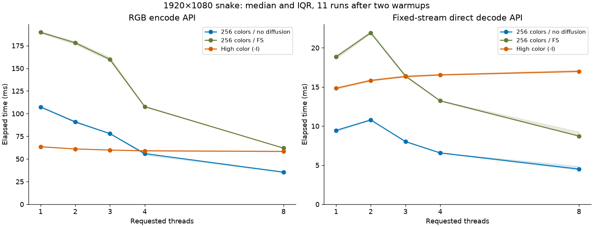

*The horizontal axis is requested threads, not cores. The decode stream stays fixed at the one-thread encode output for every decoder budget. No PNG work is timed.*

| Threads | Encode 256 / none, ms | Encode 256 / FS, ms | Encode `-I`, ms | Decode 256 / none, ms | Decode 256 / FS, ms | Decode `-I`, ms |
| ---: | ---: | ---: | ---: | ---: | ---: | ---: |
| 1 | 107.344 [106.954–108.124] | 189.680 [188.648–190.718] | 63.439 [63.099–63.804] | 9.439 [9.289–9.513] | 18.831 [18.549–19.035] | 14.817 [14.685–14.962] |
| 2 | 90.800 [90.176–91.759] | 178.080 [176.328–179.459] | 61.063 [60.940–61.166] | 10.782 [10.727–10.852] | 21.906 [21.860–22.113] | 15.824 [15.737–15.956] |
| 3 | 77.931 [77.684–78.385] | 159.824 [158.238–162.098] | 59.831 [59.622–59.890] | 8.019 [7.963–8.047] | 16.378 [16.305–16.530] | 16.330 [16.238–16.479] |
| 4 | 55.926 [54.381–56.262] | 107.739 [107.187–108.472] | 58.975 [58.661–59.530] | 6.567 [6.518–6.594] | 13.225 [13.167–13.271] | 16.537 [16.474–16.636] |
| 8 | 35.454 [35.005–35.587] | 61.983 [61.769–62.245] | 58.306 [57.985–58.775] | 4.499 [4.386–4.850] | 8.722 [8.679–9.253] | 16.984 [16.910–17.159] |

Values are median [Q1–Q3]. On this run, 256/no-diffusion encode drops from 90.800 ms at two threads to 77.931 ms at three, and reaches 35.454 ms at eight. High color only moves from 63.439 ms at one thread to 58.306 ms at eight. Its fixed-stream direct decode becomes slower (14.817 → 16.984 ms), consistent with parallel-scan overhead followed by serial fallback. The code establishes that fallback limitation; these timings alone would not identify the cause.

The current normal encoder also produces different pixels at different thread budgets. For Full HD, 256/no-diffusion changes from MS-SSIM 0.976028, mean ΔE00 2.495796, and 876,937 bytes at one thread to 0.980482, 2.255483, and 901,626 bytes at eight. Its FS counterpart changes too. Thus these are policy-level throughput observations, not a same-pixels proof of speedup. The record retains one/eight-thread quality, size, changed-pixel counts, and hashes for every fixture; the cause of that normal-pipeline difference is outside this high-color documentation change. High-color decoded pixels match across those budgets, although the Full HD stream differs by four bytes.

### Repeat-run variability

A later complete repetition used the same prepared fixtures, policies, and codec binary. Every one-thread stream hash, decoded PNG hash, and quality value matched the primary run, but elapsed times varied substantially. Both runs are retained; the primary chart shows the earlier complete run, while [repeat-results.json](study/repeat-results.json) contains all 585 observations from the later repetition. These are different run blocks, not extra independent samples pooled into the first IQR.

| Threads | Repeated encode 256 / none, ms | Repeated encode 256 / FS, ms | Repeated encode `-I`, ms | Repeated decode `-I`, ms |
| ---: | ---: | ---: | ---: | ---: |
| 1 | 103.865 | 185.072 | 62.518 | 14.578 |
| 2 | 142.094 | 266.391 | 107.058 | 26.912 |
| 3 | 82.966 | 167.433 | 64.029 | 17.637 |
| 4 | 76.500 | 156.617 | 79.885 | 22.899 |
| 8 | 52.915 | 99.490 | 85.716 | 23.578 |

The broad changes include the mostly serial high-color path, so they cannot all be attributed to worker-budget scaling. Host activity was not isolated or instrumented enough to identify the cause. The precise speedup ratios are therefore provisional; the consistent result is that the old two-to-three-thread worker-window spike disappears when the same API boundary is used. The lack of independent high-color bands and the decoder fallback are established by code inspection, not inferred solely from a favorable runtime sample.

The [timing CSV](study/timings.csv) includes the smaller inputs and warmups as well as Full HD. The [quality/size CSV](study/summary.csv) retains exact values for all six fixtures.

## Reproduction and verification

Use a clean detached checkout so unrelated working changes cannot contaminate the measured binary. For the retained snapshot:

```sh
git worktree add --detach /tmp/libsixel-high-color-build 3c92b3a1c
cd /tmp/libsixel-high-color-build
export PATH="/Users/saitoha/repo/libsixel/.local/bin:$PATH"
./configure --without-libcurl --without-png --without-jpeg \
  --without-librsvg --without-tiff --without-webp --without-quicklook \
  --without-coregraphics --without-lcms2 --disable-quicklook-extension \
  CFLAGS=-O3 BASH=/bin/sh
make -j8
```

Replace the absolute PATH prefix with the main checkout's `.local/bin` on another machine. The study tool lives in the documentation checkout containing this change, while `--build` selects the clean measured checkout. Create an optional Python environment and run from that documentation checkout:

```sh
python3 -m venv /tmp/libsixel-high-color-python
/tmp/libsixel-high-color-python/bin/pip install -r tools/highcolor/requirements.txt
/tmp/libsixel-high-color-python/bin/python tools/highcolor/study.py \
  --build /tmp/libsixel-high-color-build \
  --output docs/functionality/high-color/study --runs 11
```

The exact generator used for the primary retained run is archived as [measurement-generator.py](study/measurement-generator.py); its SHA-256 matches `script_sha256` in the run record. The maintained tool has the same measurement boundary, additional completeness checks, and shorter figure labels. The script loads `src/.libs/libsixel.dylib` or `libsixel.so` from that build explicitly. It verifies each timed encode policy against the CLI at the same thread budget, checks direct decoder pixels for every timed call, and removes ambient `SIXEL_*`/`LSQA_*` settings from subprocesses. It uses real measured output for all figures; no image-generation or retouching step is involved.

To verify retained data without a build or rerender figures without rerunning timings:

```sh
/tmp/libsixel-high-color-python/bin/python tools/highcolor/study.py \
  --output docs/functionality/high-color/study --verify
/tmp/libsixel-high-color-python/bin/python tools/highcolor/study.py \
  --output docs/functionality/high-color/study --render-only
```

`--verify` recomputes hashes, painted counts, histogram bins, and palette bounds and audits expected sample coverage. It preserves recorded defects rather than asserting that they are acceptable behavior. Runtime distributions will vary on another run; retained stream hashes and PNG pixels provide the reproducible correctness evidence. A future codec change should regenerate the study from its own clean revision and update the interpretation as well as the numbers.
