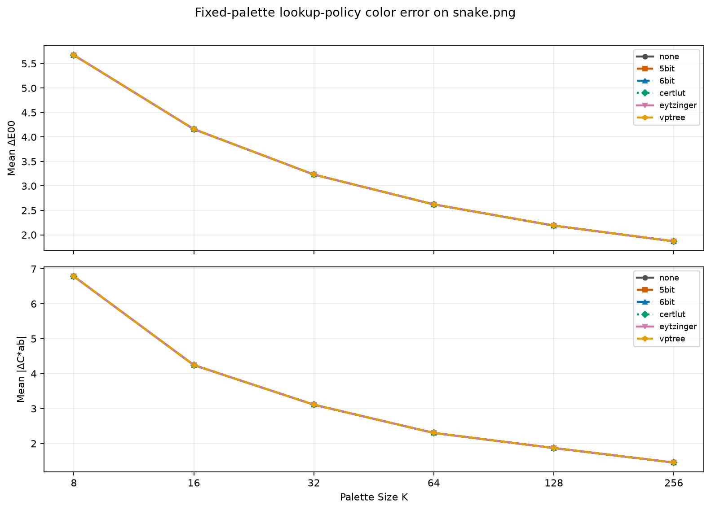
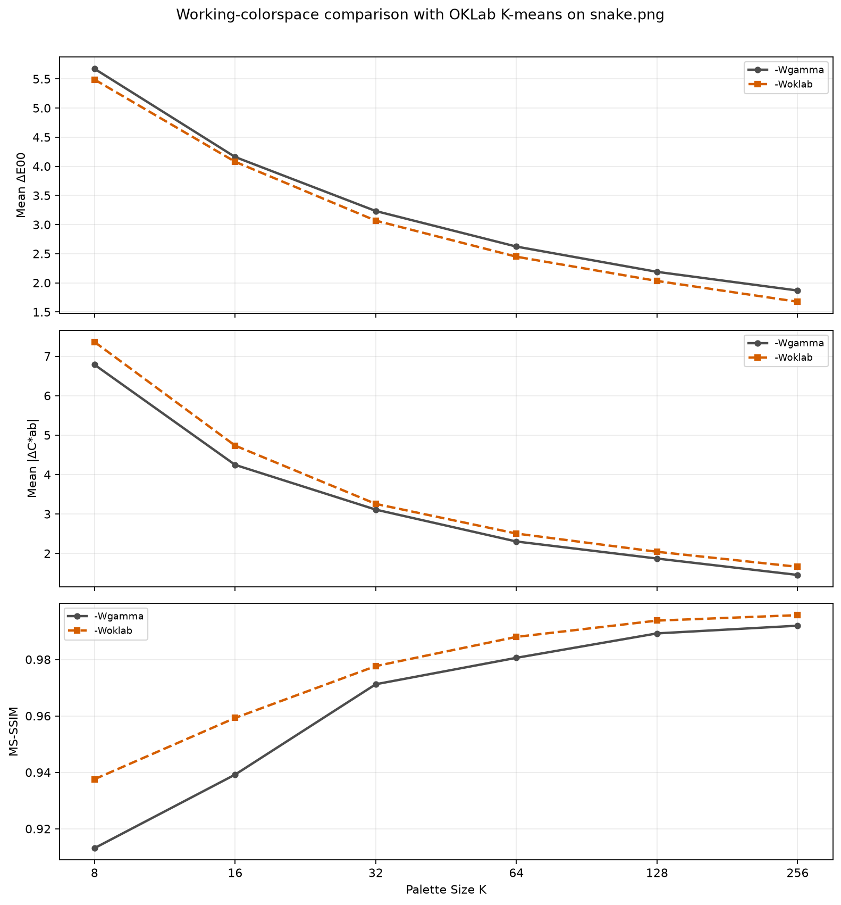

# Lookup-Policy Quality Comparison

## Questions

The historical RGB555 path reduces each byte-valued color axis from 256 values
to 32 histogram and cache addresses. This page separates three questions that
an end-to-end curve otherwise mixes together:

1. What changes when each policy receives exactly the same palette?
2. What is the user-visible effect of the historical coupling between lookup
   policy and Heckbert histogram resolution?
3. With OKLab K-means palette construction, how does `-Wgamma` compare with
   `-Woklab`?

The checked-in measurements answer those questions for one fixture. They are
not a universal ranking of lookup policies.

## Fixed-palette lookup result



Lower values are better on both panels. All six curves overlap exactly at the
precision stored in
[`lookup-policy-fixed-palette-color-error.csv`](measurements/lookup-policy-fixed-palette-color-error.csv).
The same is true for
[MS-SSIM](measurements/lookup-policy-fixed-palette-ms-ssim.png), whose values
are in
[`lookup-policy-fixed-palette-ms-ssim.csv`](measurements/lookup-policy-fixed-palette-ms-ssim.csv).
For example, every policy produced these `K = 8` measurements:

| Mean Delta E00 | Mean absolute chroma error | MS-SSIM |
| ---: | ---: | ---: |
| 5.673850 | 6.785327 | 0.913150 |

The shared palette was generated with `-Qkmeans:Gw -Xoklab -Wgamma`, exported,
and then loaded by each policy. The compact `:Gw` suboption selects Ward final
merging for K-means;
`-Xoklab` places the clustering objective in OKLab. K-means still finds a local
solution to its squared-error objective rather than a guaranteed global or
perceptual optimum, but this setup avoids giving every lookup policy a
different Heckbert palette.

On this image, without diffusion, reduced-bit lookup did not change the chosen
palette entry at any tested `K`. This does not make `5bit`, `6bit`, or the
approximate policies exact in general. It means only that their possible
approximations did not cross a palette decision boundary for these pixels and
these generated palettes.

## Why `none` looked unusually good at eight colors

The original end-to-end result is retained because it measures the historical
user-visible coupling:


At `K = 8`, `none` reported mean absolute chroma error 8.435487, while `5bit`,
`6bit`, `certlut`, `eytzinger`, and `vptree` reported 14.914233, 16.088598,
16.104532, 16.587467, and 16.105232 respectively. The fixed-palette result
above shows that direct exhaustive lookup did not cause this advantage.

The cause is in
[`histogram_control_make_for_policy`](../../../src/palette-heckbert.c#L403).
The Heckbert builder uses eight bits per channel for `none`, five for `5bit`,
and six for the other policies in this comparison. Those histograms change the
box boundaries, weighted medians, and representative colors before palette
application begins. Inspection of the decoded `K = 8` outputs found that the
most frequently selected `none` entry was muted brown RGB `(125, 92, 87)`,
with CIELAB chroma about 15.1. The six-bit palette instead most frequently
selected olive RGB `(130, 128, 38)`, with chroma about 47.9. Large low- and
medium-chroma regions of this particular image were therefore oversaturated
by the six-bit palette.

The explanation is fixture-specific: `none` happened to receive a palette
whose chroma distribution better matched this image. It is not evidence that
an exhaustive RGB lookup intrinsically minimizes CIELAB chroma error.

## High-palette-size detail


The focused source data are in
[`lookup-policy-heckbert-high-k.csv`](measurements/lookup-policy-heckbert-high-k.csv).
At `K = 256`, the measured values are:

| Policy | Mean Delta E00 | Mean absolute chroma error |
| --- | ---: | ---: |
| `none` | 2.447771 | 1.842988 |
| `5bit` | 3.155706 | 2.269776 |
| `6bit` | 2.596776 | 1.859324 |
| `certlut` | 2.403138 | 1.749753 |
| `eytzinger` | 3.032645 | 2.461793 |
| `vptree` | 2.400774 | 1.748358 |

`5bit` has 0.707935 more mean Delta E00 than `none`, a 28.9 percent increase,
and 0.426788 more mean chroma error, a 23.2 percent increase. Increasing `K`
cannot recover distinctions already collapsed in the `32^3` Heckbert
histogram. The figure also shows why this end-to-end result is not a pure
lookup ranking: `certlut` and `vptree` happen to score slightly better than the
full-histogram `none` control with their separately constructed palettes.

The corresponding spatially pooled reference is:


At `K = 256`, `5bit` reaches 0.973219 while `none` reaches 0.986088. The
underlying values are in
[`lookup-policy-ms-ssim.csv`](measurements/lookup-policy-ms-ssim.csv).

## Working-colorspace comparison



With `-Qkmeans:Gw -Xoklab --lookup-policy=none`, `-Woklab` improved mean Delta
E00 and MS-SSIM at every tested `K`, but increased mean absolute CIELAB chroma
error at every point. The endpoints are:

| `K` | Working space | Mean Delta E00 | Mean absolute chroma error | MS-SSIM |
| ---: | --- | ---: | ---: | ---: |
| 8 | `-Wgamma` | 5.673850 | 6.785327 | 0.913150 |
| 8 | `-Woklab` | 5.488914 | 7.361689 | 0.937581 |
| 256 | `-Wgamma` | 1.867762 | 1.455218 | 0.991971 |
| 256 | `-Woklab` | 1.674991 | 1.661374 | 0.995709 |

At `K = 256`, `-Woklab` lowers mean Delta E00 by 10.3 percent and raises mean
absolute chroma error by 14.2 percent; MS-SSIM increases by 0.003738. This is
not contradictory. OKLab distance, CIEDE2000, and absolute CIELAB chroma error
optimize different geometric quantities. The current MS-SSIM implementation
is luma-only, so it can improve while a chroma-only statistic worsens.

This particular difference cannot be caused by lightness-weighted error
diffusion: diffusion is disabled in both runs. With `--lookup-policy=none`,
the float32 OKLab path minimizes the unweighted squared coordinate distance

```text
d^2 = (Delta L)^2 + (Delta a)^2 + (Delta b)^2
```

with no additional coefficient on `L`. The distribution of distances in this
image can still make lightness more influential, but the present aggregate
metrics do not isolate that effect. Establishing it would require separate
lightness and chroma-vector error curves, or a controlled sweep of explicit
channel weights.

The direction is consistent across all six measured palette sizes and is
material on this fixture, but one deterministic image supplies no population
from which to claim statistical significance. The complete values and command
templates are in
[`working-colorspace-comparison.csv`](measurements/working-colorspace-comparison.csv).

## Measurement design

The curves were measured on 2026-09-03 from a clean Autotools build of revision
`a1e106734` on Darwin 25.5.0 arm64. The input was
[`images/snake.png`](../../../images/snake.png). The broad curves use
`K = 8, 16, 32, 64, 128, 256`; the focused curve uses steps of 16 from 128
through 256.

The fixed-palette comparison is conceptually:

```text
img2sixel \
  --threads=1 --precision=8bit --quality=full \
  -Qkmeans:Gw -Xoklab -Wgamma \
  --diffusion=none --lookup-policy=none -p K \
  -M gpl:- -o /dev/null images/snake.png \
| img2sixel \
  --threads=1 --precision=8bit --quality=full \
  -m gpl:- -Wgamma \
  --diffusion=none --lookup-policy=POLICY \
  images/snake.png
```

The first stage exports one deterministic palette definition for a given `K`;
the second stage changes only its application policy. The Heckbert-coupled
comparison instead generates and applies a palette in one command:

```text
img2sixel \
  --threads=1 --precision=8bit --quality=full \
  --quantize-model=heckbert:cover=off:merge=none \
  --diffusion=none --lookup-policy=POLICY -p K \
  images/snake.png
```

`lsqa` compares each SIXEL stream with the original image and reports its
existing `Δ E00_mean`, `Δ Chroma_mean`, and MS-SSIM metrics. Diffusion is
disabled so propagated error does not obscure the palette and lookup effects.
One worker exercises the serial lazy-cache behavior of `5bit` and `6bit`.

## Reproducing the curve

Build `img2sixel` and `lsqa`, install Python Matplotlib, then run:

```sh
tools/plot_lookup_policy_quality.sh \
  docs/functionality/lookup-policies/measurements \
  images/snake.png
```

The wrapper uses
[`tools/plot_quality_curve.py`](../../../tools/plot_quality_curve.py) for
command execution, `lsqa` parsing, CSV output, and plotting. Override `PYTHON`,
`IMG2SIXEL_PATH`, or `LSQA_PATH` when the binaries or interpreter are outside
the source tree. Passing another image as the second argument preserves the
same policy and `K` sweep.

The wrapper regenerates the broad and focused Heckbert comparisons, the fixed
palette comparison, and the working-colorspace comparison. The CSV files store
the full command template for every point. A rerun is comparable only when the
revision, input, loader behavior, build options, and metric implementation are
also recorded.

## Interpretation limits

- One natural image cannot characterize every color distribution. Add
  gradients, saturated synthetic colors, alpha cases, and a small image set
  before using the result to change a default.
- Mean Delta E00 includes lightness, chroma, and hue contributions but hides
  worst-case pixels. Mean chroma error omits hue and lightness.
- The test measures decoded image quality, not encoding time, memory use,
  output size, or palette-index stability. Those require separate curves.
- No-diffusion results do not predict how a changed lookup index feeds error
  into later pixels under error diffusion.
- Exact equality on the fixed-palette fixture does not establish equality on
  gradients, saturated synthetic colors, or palettes with closer decision
  boundaries.

Return to the [Lookup Policy index](../lookup-policy.md).
