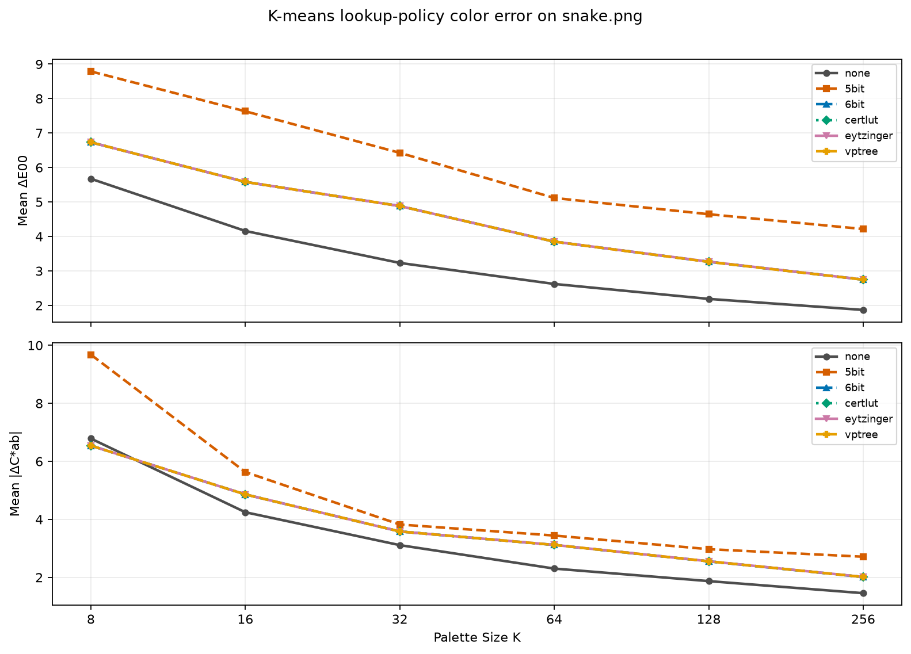
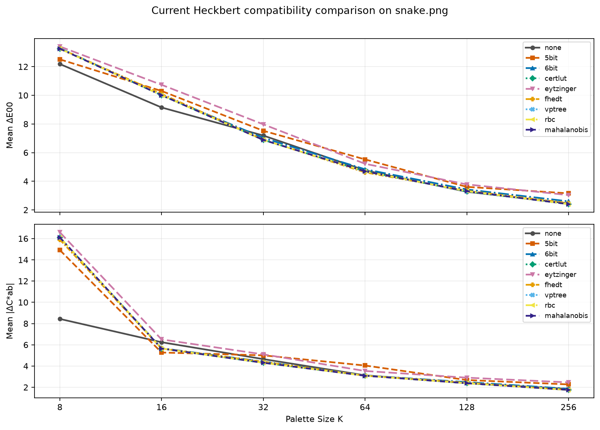
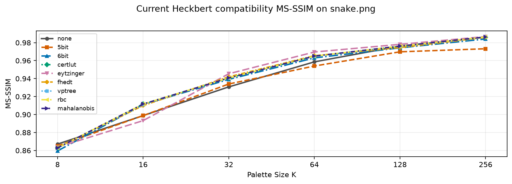
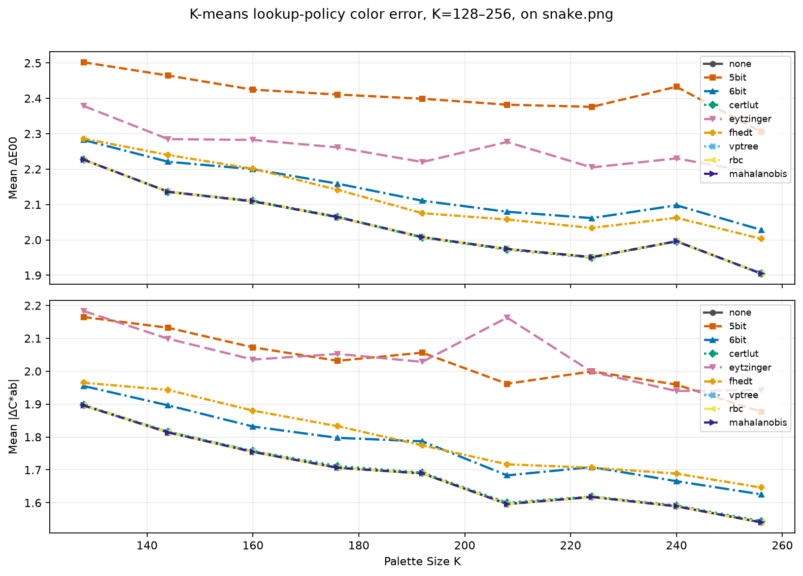
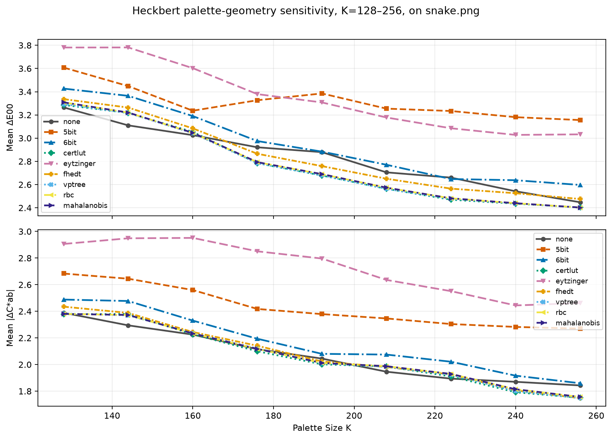
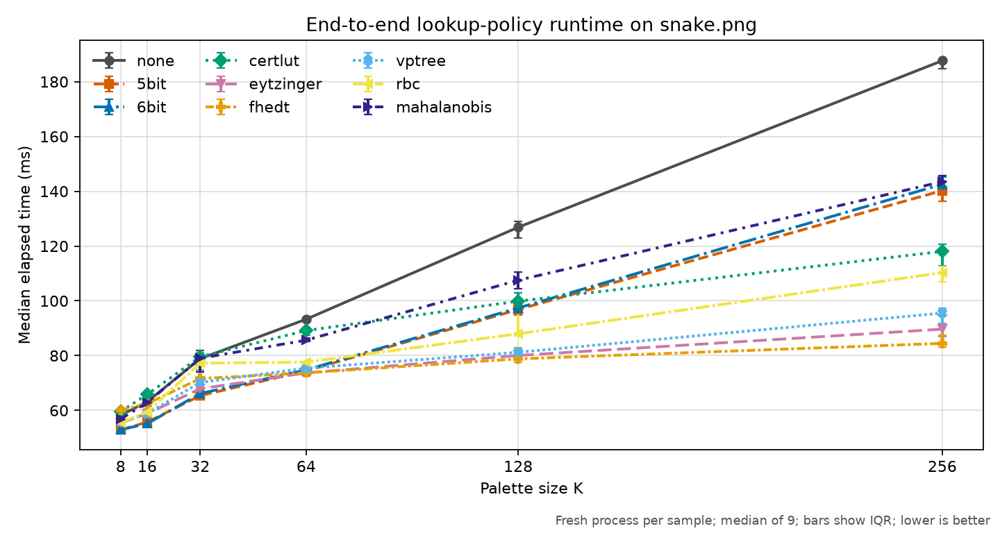
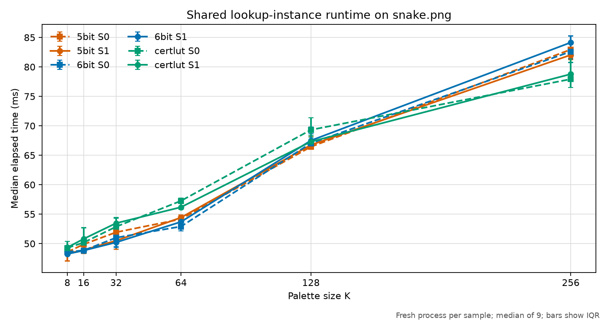
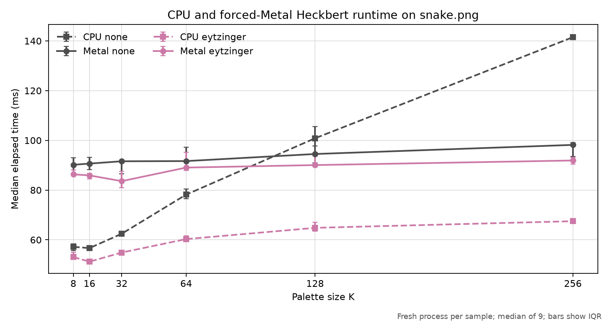
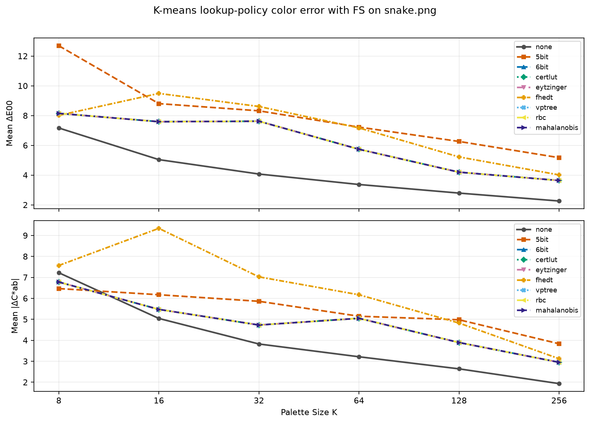
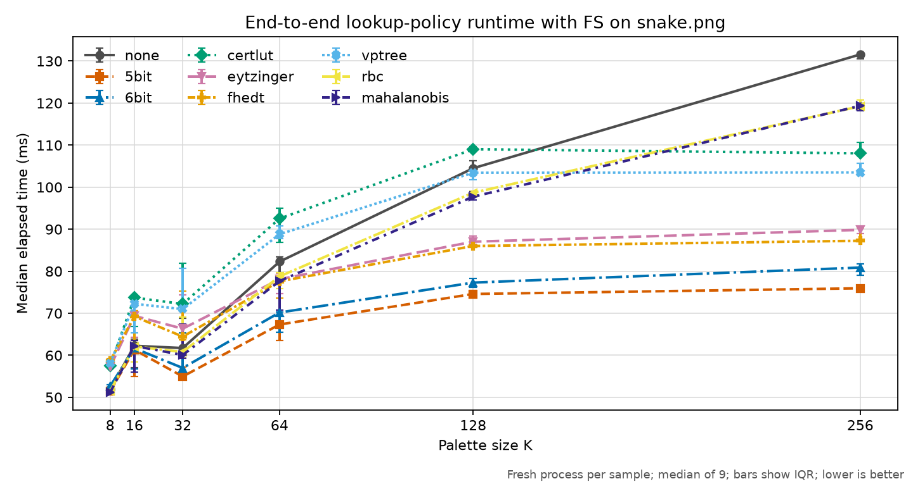

# Lookup Policy

## Definition

"Lookup policy" is libsixel terminology primarily for the strategy used to
answer a repeated nearest-palette-color query:

```text
lookup(color candidate, completed palette) -> palette index
```

It is not a SIXEL wire-format term and does not mean reading a palette register
whose index is already known. Conceptually, lookup runs during palette
application, after palette construction and before SIXEL byte generation:

```text
loader -> palette construction -> palette application -> SIXEL encoding
                                      ^
                                      |
                                lookup policy
```

The quantization model selected by `-Q` chooses the palette. The dithering
method selected by `-d` changes each color candidate and propagates error. The
lookup policy selected by `-~` maps that candidate to one entry in the completed
palette. See [Encoding Pipeline](encoding-pipeline.md) for the complete flow.

There is one important historical compatibility exception. In the current
8-bit Heckbert path, `-~` also selects the resolution of the dense histogram
used to construct the palette:

| Policy group | RGB histogram resolution |
| --- | --- |
| `5bit` | `32^3` cells, five address bits per channel |
| `6bit`, `certlut`, and the other accelerated policies | `64^3` cells, six address bits per channel |
| `none` | `256^3` cells, eight address bits per channel |

Changing `-~` can therefore change both the generated palette and its
application when `-Q heckbert` is active. This coupling descends from the
original RGB555 quantizer and is retained for compatibility; it is not a
general requirement for lookup-policy implementations. Comparisons must state
whether they hold the palette fixed or measure this end-to-end behavior.

## CLI surface

`img2sixel` selects a policy with:

```text
-~ POLICY
--lookup-policy=POLICY
```

The short option is the two-character spelling `-~`; there is no `--~` long option. The encoder default is currently `certlut`. An explicit `auto` value is a dispatch request and is not another search algorithm.

An explicit lookup policy applies during palette application with generated palettes and with all three fixed-palette selectors: mapfiles selected by `-m`, built-in palettes selected by `-b`, and monochrome selected by `-e`. A text mapfile retains its historical direct-scan behavior when no lookup policy is explicitly supplied; explicit lookup is the opt-in that enables the selected backend for that already completed palette.

RGB666 became the fast lookup baseline during development of the 1.11 line,
when commit
[`4f57a743c`](https://github.com/saitoha/libsixel/commit/4f57a743c11c4149656cdad6e3f8d59d76c58036)
replaced the historical RGB555 table. It remains the backend selected by
explicit `auto` and by the selector fallback. It is not, however, the current
built-in default: commit
[`2e1cc0639`](https://github.com/saitoha/libsixel/commit/2e1cc06396009a452f25ecd9baf078e16e0d4d27)
changed that default from `eytzinger` to `certlut`. Statements that call
`6bit` "the 1.11 default" must therefore name the exact revision or release;
this document describes the current source tree.

## Policy chapters

Each policy has its own chapter because the algorithms, correctness arguments,
and dominant costs differ materially:

- [`auto`](#policy-auto): selector behavior and fallbacks.
- [`none`](#policy-none): exhaustive palette scan.
- [`5bit`](#policy-5bit): lazy RGB555 bucket memoization.
- [`6bit`](#policy-6bit): lazy RGB666 bucket memoization.
- [`certlut`](#policy-certlut): intended cube certification and the float32
  kd-tree.
- [`eytzinger`](#policy-eytzinger): one-dimensional projection in an Eytzinger
  array layout.
- [`fhedt`](#policy-fhedt): separable three-dimensional Euclidean distance
  transform.
- [`vptree`](#policy-vptree): metric VP-tree and safe previous-color cache.
- [`rbc`](#policy-rbc): Random Ball Cover cluster pruning.
- [`mahalanobis`](#policy-mahalanobis): covariance metadata over RBC clusters
  and the current exhaustive query.
- [Measured quality and speed comparison](#measured-quality-and-speed-comparison):
  reproducible color-error, MS-SSIM, and elapsed-time curves.

## The shared mathematical problem

For candidate color `x`, palette color `c[i]`, and channel weights `w[d]`, most
accelerated policies minimize a weighted squared Euclidean distance:

```text
D_w(i, x) = sum_d w[d] * (x[d] - c[i][d])^2
index(x) = argmin_i D_w(i, x)
```

There are three channels in accelerated RGB lookup. A direct scan evaluates the
expression for all `K` palette entries. A tree or cluster index discards an
entry only after a lower bound proves that it cannot improve the current best
distance. A grid policy instead maps the continuous or byte-valued color space
to finitely many cells and stores an answer per cell.

The distance itself is part of the policy contract:

- 8-bit policies use unweighted squared distance in byte coordinates.
- float32 `none` uses unweighted squared distance in the stored coordinates.
- other float32 policies normally use `w[d] = 1 / range[d]^2`, so every channel
  is measured relative to its declared numeric range.

Consequently, an exact float32 accelerated search is not necessarily
index-equivalent to `none` in a colorspace whose channel ranges differ. The
search can exactly minimize its normalized metric while `none` exactly
minimizes a different metric. Tests and benchmarks must name both the working
colorspace and the lookup policy.

## Result guarantees

This documentation uses three levels of guarantee:

- **scan-index exact** returns the same index as an exhaustive scan using the
  policy's own distance and first-index tie rule;
- **nearest-distance exact** returns a minimizer of the policy's distance, but
  may choose another palette entry at a tie or floating-point boundary;
- **approximate** may return an entry whose policy distance is greater than the
  exhaustive minimum.

The labels apply to one already-adjusted color candidate. They do not imply
that palette construction, dithering, perceptual quality, or SIXEL output size
is globally optimal.

| Policy and representation | Default guarantee | Important qualification |
| --- | --- | --- |
| `none` | Scan-index exact on its direct path | Canonical two-entry black/white palettes select an internal threshold policy first |
| `5bit` / `6bit`, 8-bit | Approximate after a bucket is cached | The first completed query is exact; shared parallel writers can choose different valid representatives, so repeated runs need not be byte-reproducible |
| `5bit` / `6bit`, float32 | Scan-index exact | Exhaustive scan in the normalized policy metric |
| `certlut`, 8-bit | Approximate | The current cube test checks only the center's second-nearest competitor, not every possible boundary competitor |
| `certlut`, float32 | Nearest-distance exact | kd-tree pruning preserves the normalized policy minimum |
| `eytzinger`, 8-bit | Approximate | A fixed projected-neighbor window can omit the true nearest entry |
| `eytzinger`, float32 unit-range RGB/OKLab | Nearest-distance exact | Projection distance is a valid lower bound in these formats |
| `eytzinger`, float32 unequal-range Lab/DIN99d | Approximate | The current projection normalization does not prove a lower bound for the weighted metric |
| `fhedt`, 8-bit at `R < 256` | Approximate | Grid quantization and bounded refinement do not scan the full palette |
| `fhedt`, 8-bit at `R = 256` | Nearest-distance exact | Every byte-valued RGB tuple has a grid coordinate |
| `fhedt`, float32 | Approximate | Even `R = 256` discretizes a continuous working space |
| `vptree` | Nearest-distance exact | Tree pruning and the default safe cache preserve the policy minimum |
| `rbc`, float32 | Nearest-distance exact | Ball-radius lower bounds use the same normalized metric as final comparisons |
| `rbc`, 8-bit | Scan-index exact | The current implementation is a direct scan |
| `mahalanobis`, float32 | Nearest-distance exact | The current query still compares every cluster member in the normalized metric |
| `mahalanobis`, 8-bit | Scan-index exact | The current implementation is a direct scan |

`auto` inherits the concrete backend's guarantee. Configuration can matter as
much as the base policy name. For example, an optional FHEDT cache remembers a
voxel result, while the dense-bucket policies remember the result of the
first actual color that entered a bucket.

## Cost model

The policy chapters use these variables:

- `P`: non-transparent pixels mapped to the palette;
- `K`: completed palette entries;
- `R`: grid resolution on each of three axes;
- `G = R^3`: grid cells;
- `U`: distinct lazy buckets or cells first encountered;
- `J = min(K, 16)`: the current RBC pivot count;
- `V`: candidates that survive a query's bounds.

The fixed three color dimensions are omitted. Preparation cost, one-query cost,
and whole-image cost must be kept separate.

| Policy | Preparation | One query | Extra space |
| --- | --- | --- | --- |
| `none` | `O(1)` | `Theta(K)` | `O(1)` |
| `5bit` / `6bit`, 8-bit | `Theta(G)` initialization | hit `Theta(1)`; first-bucket miss `Theta(K)` | `Theta(G)` |
| `certlut`, 8-bit | `O(64^3 + K^2)` in the current builder | warm fixed-depth lookup `Theta(1)`; cold refinement worst `O(K)` | initial `Theta(64^3 + K)`; fully refined worst `O(256^3 + K)` |
| `certlut`, float32 | current kd-tree build conservatively `O(K^2)` | typical `O(log K)`; worst `Theta(K)` | `Theta(K)` |
| `eytzinger` | `Theta(K log K)` | 8-bit `Theta(log K)`; float32 `O(log K + V)`, worst `Theta(K)` | `Theta(K)` |
| `fhedt` | `Theta(R^3 + K)` | `Theta(1)` | `Theta(R^3 + K)` |
| `vptree` | `Theta(K^2)` safe-radius preparation plus tree construction | typical balanced `O(log K)`; worst `Theta(K)` | `Theta(K)` |
| `rbc`, float32 | `Theta(K J)` | `O(J + V)`; worst `Theta(K)` | `Theta(K + J)` |
| `mahalanobis`, float32 | `Theta(K J)` | `Theta(K)` currently | `Theta(K + J)` |

Direct lookup over an image is `Theta(P K)`. Ignoring concurrent duplicate misses, the 8-bit `5bit` and `6bit` implementations instead have whole-image work:

```text
Theta(G + P + U K)
```

A shared parallel table can make more than one worker scan the same cold bucket before any store becomes visible, adding up to the number of active mapping workers to that bucket's miss cost without changing the cache-hit bound.

FHEDT has the clearest fixed-build-plus-linear-application form:

```text
Theta(R^3 + K + P)
```

A query being typically logarithmic does not establish a logarithmic worst
case. VP-tree, kd-tree, projection, and RBC pruning can all visit most or all of
the palette for unfavorable geometry. Likewise, lookup is linear in `P = W H`
but quadratic in the side length of an `n`-by-`n` image; always name the
independent variable.

## Policy: `auto`

### Purpose

`auto` asks the lookup-policy selector to choose a concrete backend. It does
not define a distance, index, or complexity class of its own. The selected
backend owns all of those properties.

The built-in encoder default is currently `certlut`. Therefore an explicit
`--lookup-policy=auto` is not merely another spelling of the default.

### Dispatch flow

The current selector behaves as follows:

```text
completed palette and pixel format
              |
              v
 explicit concrete policy? -- yes --> named policy
              |
              no
              v
 canonical two-color black/white palette? -- yes --> internal mono policy
              |
              no
              v
 lookup disabled, depth != 3, or explicit none? -- yes --> none
              |
              no
              v
 recognized concrete policy? -- yes --> that 8-bit or float32 backend
              |
              no
              v
             6bit
```

`auto` reaches the final branch and currently resolves to `6bit`, selecting
the 8-bit or float32 implementation from the pixel representation. The float32
`6bit` backend is an exhaustive normalized-distance scan rather than a dense
RGB666 table.

### Guarantee and cost

`auto` inherits the selected backend's result guarantee, preparation cost,
query cost, and storage. Its own dispatch is constant work.

Benchmarks must report the resolved class name rather than only saying
"auto." Otherwise a selector change can make two results incomparable without
changing the benchmark command.

### Name and source

`auto` is a libsixel descriptive name, not the name of a published search
algorithm. It means deferred policy selection.

The selection rules are implemented in
[`lookup-policy.c`](../../src/lookup-policy.c). The public values are
registered in [`options-registry.c`](../../src/options-registry.c).

## Policy: `none`

### Purpose and intuition

`none` is the exhaustive-search mental model: compare the candidate with every
palette color and keep the best index. It disables lookup acceleration, not
palette construction, dithering, or palette application.

```text
candidate x
    |
    +--> distance(x, c[0]) --+
    +--> distance(x, c[1]) --+--> smallest distance --> palette index
    |          ...           |
    +--> distance(x, c[K-1]) +
```

`-d none` is independent. This command disables both dither adjustment and
lookup acceleration:

```text
img2sixel -d none --lookup-policy=none input.png
```

### Mathematics

For an 8-bit or float32 candidate `x` with stored palette entries `c[i]`, the
current direct scan uses:

```text
D(i, x) = sum_d (x[d] - c[i][d])^2
```

The scan updates its result only for a strict improvement. If two entries have
equal distance, the lower palette index wins because it was visited first.

Unlike the accelerated float32 policies, `none` does not divide each channel
by its declared range. It is therefore the exhaustive reference for its own
stored-coordinate metric, not for every other policy's normalized metric.

### Guarantee

The ordinary direct path is scan-index exact by definition. It evaluates every
entry and preserves the first-index tie rule.

When lookup selection is automatic, a completed palette containing exactly black then white, or white then black, activates an internal monochrome threshold policy. An explicit `none` request is honored before this automatic specialization and therefore selects the exhaustive implementation even for that canonical two-entry shape.

### Cost

For palette size `K`:

```text
preparation       O(1)
one query         Theta(K)
P image queries   Theta(P K)
extra storage     O(1)
```

For a SIXEL palette, `K` is bounded, but the factor remains important because
the query runs once per non-transparent pixel.

### Name and source

`none` is a libsixel descriptive name: no lookup acceleration. It is not the
claim that palette application does no work.

The implementation is
[`lookup-policy-none.c`](../../src/lookup-policy-none.c), and selector-level
monochrome handling is in
[`lookup-policy.c`](../../src/lookup-policy.c).

## Policy: `5bit`

### Purpose and intuition

`5bit` partitions byte-valued RGB space into `32^3` buckets. The first serial
query entering an empty bucket performs a full palette scan. The resulting
index is then reused for later colors in the same bucket.

```text
8-bit RGB candidate
       |
       v
round each channel to 5 address bits
       |
       v
32 x 32 x 32 bucket table
       |
       +-- filled --> return cached index
       |
       +-- empty  --> scan palette --> store and return index
```

The name describes address precision, not palette precision. Palette entries
and the first candidate remain 8-bit values.

### Bucket mathematics

For a byte channel `v`, libsixel rounds and saturates:

```text
q5(v) = min(31, floor((v + 4) / 8))
bucket(x) = pack(q5(x.r), q5(x.g), q5(x.b))
```

There are:

```text
G = 2^(5 * 3) = 32,768 buckets
```

The table stores one signed 32-bit palette index per bucket, approximately
128 KiB before allocator overhead.

Reducing one byte channel from 256 values to 32 address levels groups eight
adjacent values together. Across RGB this reduces `256^3 = 16,777,216`
possible tuples to `32^3 = 32,768` cells. A bucket boundary can cross a palette
Voronoi boundary, and a histogram cell can erase distinctions among colors
that should influence different median-cut boxes. The error is therefore not
only a memory-capacity question.

The documented `SIXEL_LOOKUP_PACKING` values are `linear` and `morton`.
Linear packing concatenates channel fields. Morton packing interleaves their
bits to improve spatial locality for some access patterns. The implementation
also recognizes `hilbert`, but that value is not currently part of the public
manual contract. Packing changes memory order, not which colors share a bucket.

### Guarantee

On an empty bucket, the policy scans the actual candidate against all palette entries, so that answer is scan-index exact in byte RGB distance. Afterwards every candidate with the same `bucket(x)` receives the stored index:

```text
lookup(x_first) = argmin_i D(i, x_first)
lookup(x_later) = lookup(x_first), if bucket(x_later) = bucket(x_first)
```

The later answer can be approximate, and it depends on traversal history. The
maximum component separation inside one rounded bucket is small, but a palette
Voronoi boundary can still cross the bucket.

Serial, worker-local parallel (`shared_instance=0`), and shared parallel (`shared_instance=1`) 8-bit paths all populate their dense tables. With a shared instance, multiple workers can observe the same empty bucket, scan different candidate colors, and store different valid palette indices; whichever write becomes visible determines the cached representative, so repeated runs need not be byte-reproducible. Relaxed atomic loads and stores make those accesses well-defined without ordering surrounding work. The float32 backend still performs an exhaustive scan using the normalized weighted metric described in the index.

### Cost

Let `U` be the number of distinct buckets first encountered:

```text
table initialization        Theta(32^3)
cache hit                   Theta(1)
first-bucket miss           Theta(K)
8-bit whole image           Theta(32^3 + P + U K)
float32 query               Theta(K)
```

The `shared_instance` suboption controls whether workers receive a shared instance; its default is enabled for `5bit`. Worker-local instances spend additional initialization and memory per active instance. A shared instance aggregates memoized buckets across workers and can repeat an exhaustive scan when workers miss the same bucket concurrently, while racing first writers make its output schedule-dependent. Sharing is therefore a lifecycle, race, memory, output, and speed policy.

### Name, lineage, and comparisons

`5bit` is a libsixel descriptive name derived from the five address bits per
channel. It is not named after a paper. The same basic lazy RGB555 design is
present in the current
[`libsixel/libsixel` fork](https://github.com/libsixel/libsixel/blob/ee77c2f979dbccc86651a482e748fe7bf80bc89c/src/quant.c#L1091-L1139)
and comes from shared project lineage. That implementation truncates to the
top five bits, whereas the current policy documented here rounds and
saturates.

`go-sixel` provides a useful contrast: it also addresses an RGB555 table, but
it [fills all cells eagerly using each cell center](https://github.com/mattn/go-sixel/blob/ceaaab1e2b5973d9ebc28b0a615760b921e90681/sixel.go#L676-L712).
That makes its representative deterministic for a palette, while libsixel's
representative is the first actual query observed in each bucket.

### Historical quality limitation

The quantizer used through the 1.8.7 era applied the same RGB555 address to two
different jobs. Palette construction counted input colors in a `32^3`
histogram and reconstructed every occupied cell from the truncated five-bit
coordinates. Palette application then lazily cached the nearest palette index
for the first pixel observed in each RGB555 cell. The historical channel map
was simply:

```text
q_old(v) = floor(v / 8)
r_old(q) = 8q
```

Consequently, as many as eight input values on each axis became one histogram
value, with a per-channel truncation of up to seven byte values before median
cut even started. The lazy application cache could then add a second source of
error around palette decision boundaries.

The current named `5bit` policy rounds and saturates its lookup address rather
than reproducing that old truncating hash exactly. Its Heckbert configuration
still selects a five-bit-per-channel histogram, however, so requesting a larger
palette cannot recover color distinctions that the histogram already merged.
This is why higher `K` does not guarantee that the quality gap will close.

The [move from RGB555 to RGB666 in 2025](https://github.com/saitoha/libsixel/commit/4f57a743c11c4149656cdad6e3f8d59d76c58036),
followed by [`none` as a full-precision control](https://github.com/saitoha/libsixel/commit/fafc097994dfcd1af8f17c09a94628ea158281a4)
and by several structurally different search policies, grew out of the need to
make this speed, memory, and quality tradeoff explicit. Later policies also
address float colorspaces, parallelism, and different preparation/query costs;
they are not merely cosmetic renamings of the old cache.

The [measured quality and speed comparison](#measured-quality-and-speed-comparison)
compares the current controlled K-means command with the historical Heckbert
coupling. On the checked fixture, `6bit` is materially closer to `none` than
`5bit` is, and is faster than `none`, but neither difference alone determines
the best default.

The implementation is
[`lookup-policy-5bit.c`](../../src/lookup-policy-5bit.c). CLI and environment
spelling is documented in the [`img2sixel(1)` manual](../../converters/img2sixel.1).

## Policy: `6bit`

### Purpose and intuition

`6bit` is the finer sibling of `5bit`. It partitions byte RGB space into `64^3` buckets, performs an exhaustive scan for a query that finds an empty bucket, and memoizes that index.

```text
8-bit RGB candidate
       |
       v
round each channel to 6 address bits
       |
       v
64 x 64 x 64 bucket table
       |
       +-- filled --> return cached index
       |
       +-- empty  --> scan palette --> store and return index
```

### Bucket mathematics

For byte channel `v`:

```text
q6(v) = min(63, floor((v + 2) / 4))
bucket(x) = pack(q6(x.r), q6(x.g), q6(x.b))
G = 2^(6 * 3) = 262,144
```

One signed 32-bit value per bucket requires approximately 1 MiB before
allocator overhead. This is eight times the number of entries used by `5bit`.

The finer grid lowers the chance that two visibly different candidates share a
cached answer, but it increases initialization work, memory footprint, and the
number of cold buckets an image may encounter. It is not unconditionally
faster or better than `5bit`.

As with `5bit`, `linear` and `morton` are the documented packing values. The
implementation recognizes an additional non-public `hilbert` value. Packing
only changes address layout.

### Guarantee

The 8-bit guarantee has two phases:

```text
first candidate in bucket   scan-index exact
later candidate in bucket   approximate if its nearest entry differs
```

The approximation is query-history dependent. Smaller buckets reduce, but do
not eliminate, the possibility that a nearest-color boundary crosses a bucket.

Serial, worker-local parallel (`shared_instance=0`), and shared parallel (`shared_instance=1`) 8-bit paths all populate their dense tables. With a shared instance, racing first writers can select different valid representatives for one bucket, making later hits and the resulting output schedule-dependent. Relaxed atomic accesses prevent a C data race without imposing ordering on the surrounding lookup. The float32 backend remains a normalized-distance exhaustive scan; the `6bit` name does not describe a float32 grid in that path.

### Cost

With `U` distinct first-use buckets:

```text
table initialization        Theta(64^3)
cache hit                   Theta(1)
first-bucket miss           Theta(K)
8-bit whole image           Theta(64^3 + P + U K)
float32 query               Theta(K)
```

The `shared_instance` suboption defaults to enabled. The larger table makes worker-local duplication especially relevant to memory and cache pressure; sharing avoids that duplication and lets workers reuse one memoized table at the cost of schedule-dependent representatives when first writes race.

### Name and source

`6bit` is a libsixel descriptive name derived from six address bits per RGB
channel, not a literature algorithm name. It was introduced as a denser
alternative to the historical 5-bit table.

The implementation is
[`lookup-policy-6bit.c`](../../src/lookup-policy-6bit.c). Selection and the
non-RGB fallback are in
[`lookup-policy.c`](../../src/lookup-policy.c).

## Policy: `certlut`

### Purpose and intuition

The 8-bit `certlut` policy combines a lookup table with an intended dominance
test. Large RGB cubes are cached when the test accepts the center's winner.
Ambiguous cubes split until the test accepts them or they reach a single
byte-valued coordinate.

```text
one 4 x 4 x 4 RGB cube
          |
          v
nearest and second-nearest at cube center
          |
          v
 dominance test accepts the center winner?
          | yes                         | no
          v                             v
 cache one palette index       split into 2 x 2 x 2 children
                                      |
                                      v
                              repeat down to unit cells
```

The top-level table has `64^3` entries because each initial cube spans four
values on each byte channel.

The float32 implementation uses a kd-tree instead of the hierarchical table.
The common policy name denotes the exact-search role, not identical storage in
both representations.

### Certification mathematics

Let `a` be the nearest palette color at cube center `m`, and `b` the
second-nearest. Write the weighted-coordinate squared distances as `D_a(x)` and
`D_b(x)`. Their difference is affine in `x`:

```text
D_b(x) - D_a(x)
  = D_b(m) - D_a(m) + 2 (x - m) dot (a - b)
```

Let:

```text
gap = D_b(m) - D_a(m)
```

For a cube with side length `s`, the center-to-corner norm is at most
`sqrt(3) s / 2`. Cauchy-Schwarz therefore bounds how far the affine difference
can fall anywhere in the cube:

```text
|2 (x - m) dot (a - b)| <= sqrt(3) s ||a - b||
```

For this particular pair, `a` is certified against `b` if:

```text
gap > sqrt(3) s ||a - b||
```

The integer implementation avoids square roots by testing the squared form:

```text
gap^2 > 3 s^2 ||a - b||^2
```

All terms are measured in the same weighted coordinates. If the inequality
holds, even the strongest possible movement toward `b` cannot close the gap.

A complete cube proof must apply the inequality to every competing palette
entry `c[j]`:

```text
for every j != a:
    (D_j(m) - D_a(m))^2 > 3 s^2 ||a - c[j]||^2
```

The current implementation checks only `b`, the second-nearest entry at the
center. Being second-nearest by center distance does not prove that `b` has the
nearest Voronoi boundary: a more distant center color can have a larger
distance gradient and cross `a` inside the cube. The present 8-bit test is
therefore a strong heuristic, not a universal certificate.

A one-axis counterexample can be embedded in an RGB cube by keeping the other
two channels at 102. At center `m = 102`, use palette coordinates `a = 112`,
`b = 113`, and `c = 90` on the varying axis:

```text
center distances: D_a = 100, D_b = 121, D_c = 144
current pair test: (121 - 100)^2 = 441 > 3 * 4^2 * (113 - 112)^2 = 48
```

The current test accepts `a` for the size-four cell `[100,103]`. At coordinate
100, however, `D_a = 144` and `D_c = 100`, so the center's third-nearest entry
wins inside that cell. Testing every competitor would reject this cell.

### Float32 kd-tree

The float32 palette is recursively split by coordinate axes. A query visits the
near child first. It visits the far child only when the squared distance to the
splitting plane is smaller than the current best palette distance:

```text
                       split plane
near subtree <-------------|-------------> far subtree
          query x -------->|<-- plane distance -->

visit far subtree only if plane_distance^2 < best_distance^2
```

This is the standard kd-tree branch-and-bound idea. The policy uses the same
range-normalized channel weights for full distances and plane bounds, so the
pruning preserves the minimum of that metric.

### Guarantee

The float32 representation is nearest-distance exact in its normalized policy
metric: its kd-tree discards a subtree only through a valid axis-plane lower
bound.

The 8-bit representation is approximate because a non-unit cube can be cached
after checking only the center's nearest and second-nearest entries. Unit cells
are exact for their individual byte-valued RGB coordinates, and many larger
cubes will also have one true winner, but the current test does not prove that
for every accepted cube.

Tie order in the float32 tree can differ from an exhaustive scan, so its
guarantee is nearest-distance exact rather than scan-index exact. For
unequal-range float colorspaces, the normalized metric can also choose a
different index from float32 `none`, which uses unnormalized stored
coordinates.

### Cost

The current implementation has these conservative bounds:

```text
8-bit top-level initialization       Theta(64^3)
8-bit current search-index build     O(K^2)
8-bit warm query                     Theta(1), fixed maximum depth
8-bit cold ambiguous query           O(K)
8-bit fully refined space            O(256^3 + K)

float32 current kd-tree build        O(K^2)
float32 typical balanced query       O(log K)
float32 worst query                  Theta(K)
float32 space                        Theta(K)
```

Certification makes preparation and first-touch behavior palette dependent.
A small image may not amortize the index, while a large image can reuse large
certified regions. The `shared_instance` suboption controls reuse across
workers; its current default is disabled for `certlut`.

### Name and sources

`certlut` is a libsixel descriptive contraction of "certified lookup table."
It is not the established name of a published algorithm. The cube test is a
libsixel design built from squared-distance algebra and Cauchy-Schwarz. The
name describes the design intent; it must not be treated as evidence that the
current second-nearest-only test is a complete proof.

The float32 index follows the kd-tree introduced by Jon Louis Bentley in
[“Multidimensional Binary Search Trees Used for Associative Searching”](https://doi.org/10.1145/361002.361007).
The libsixel policy was introduced by the
[`certlut` implementation commit](https://github.com/saitoha/libsixel/commit/17f3deea418e2d947d72995a0ae00fd9ce1c8d11).

The current implementation is
[`lookup-policy-certlut.c`](../../src/lookup-policy-certlut.c).

## Policy: `eytzinger`

### Purpose and intuition

`eytzinger` reduces three-dimensional palette search to an ordered
one-dimensional candidate search. It projects each palette color to a scalar,
sorts those keys, stores the binary search tree in breadth-first array order,
and then checks full color distances near the projected insertion point.

```text
palette color c              candidate x
      |                           |
      v                           v
 scalar key h(c)              scalar key h(x)
      |                           |
      +--> sort and Eytzinger <--+
             lower_bound
                  |
                  v
      inspect projected neighbors
                  |
                  v
       best full 3D color distance
```

The layout improves the memory-access pattern of binary search; it does not by
itself make a one-dimensional projection preserve three-dimensional nearest
neighbors.

### Projection mathematics

The policy computes a linear projection:

```text
h(x) = sum_d a[d] x[d]
```

After finding the position of `h(x)` among the sorted palette keys, the policy
evaluates the full metric:

```text
D_w(i, x) = sum_d w[d] (x[d] - c[i][d])^2
```

A projection can support an exact stopping proof when its coefficient vector is
a unit vector in the transformed metric space. Then Cauchy-Schwarz gives:

```text
(h(x) - h(c[i]))^2 <= D_w(i, x)
```

Once the projected difference alone exceeds the best full distance, all
farther keys on that side can be ignored.

### Eytzinger array layout

A sorted sequence is arranged as an implicit breadth-first binary tree. For
seven keys the array positions are:

```text
sorted rank:       0   1   2   3   4   5   6

tree:                      3
                        /     \
                       1       5
                      / \     / \
                     0   2   4   6

array index:        [3, 1, 5, 0, 2, 4, 6]
                      1  2  3  4  5  6  7
```

With one-based array index `i`, the children are `2i` and `2i + 1`. The search
therefore needs no pointers and can prefetch predictable child locations.

### 8-bit query and guarantee

The 8-bit implementation projects with `h(r,g,b) = r + g + b`, finds the lower
bound, and examines at most six sorted neighbors on each side. Full RGB
distance chooses the best candidate in that window.

```text
... omitted keys ... [six left] [insertion] [six right] ... omitted keys ...
                         <------ candidates ------>
```

This is `Theta(log K)` plus a fixed amount of work, but it is approximate. Two
colors can have distant projection keys yet be close in RGB, and a fixed window
can omit the true nearest palette entry. The unnormalized sum projection is not
itself a general lower bound for squared RGB distance.

### Float32 query and guarantee

The float32 implementation scans outward from the insertion point until the
squared projected difference exceeds the best full distance. This is a valid
nearest-distance proof for current unit-range RGB and OKLab float formats,
where the coefficients are `1 / sqrt(3)` and the policy metric has unit channel
weights.

For CIELAB and DIN99d float formats, channel ranges differ. The current code
sets metric weights to inverse squared ranges but normalizes the projection
coefficients by the sum of those weights. That coefficient vector is not, in
general, a unit vector in the transformed metric. The stopping test is
therefore not a proof for those formats, and this document classifies those
queries as approximate.

This distinction is easy to miss: continuing until a bound is exceeded is exact
only when the value being compared really is a lower bound.

### Cost

```text
projection, sort, and layout       Theta(K log K)
8-bit query                        Theta(log K) + fixed window
float32 query                      O(log K + V)
float32 worst query                Theta(K)
extra space                        Theta(K)
```

`V` is the number of projected neighbors whose bound does not terminate the
scan. A palette concentrated along a direction poorly represented by the
projection can make `V` large.

### Name and sources

The Eytzinger layout name is established terminology for this breadth-first
implicit tree arrangement. Paul-Virak Khuong and Pat Morin analyze the layout,
prefetching, and comparison search in
[“Array Layouts for Comparison-Based Searching”](https://arxiv.org/abs/1509.05053).

libsixel applies that array layout to projected palette keys; the surrounding
three-dimensional candidate strategy is libsixel-specific and should not be
attributed to the array-layout paper. The policy entered libsixel in the
[`1d-eytzinger` implementation commit](https://github.com/saitoha/libsixel/commit/acbde38716ecedaf8a1092386c6779a802504902)
and was later renamed `eytzinger`.

The CPU implementation is
[`lookup-policy-eytzinger.c`](../../src/lookup-policy-eytzinger.c). A Metal
palette-application path also supports an Eytzinger mode in
[`gpu-palette-metal.m`](../../src/gpu-palette-metal.m).

## Policy: `fhedt`

### Purpose and intuition

`fhedt` builds a discrete Voronoi map of the palette over a three-dimensional
color grid. Instead of searching the palette independently for every pixel, it
propagates the nearest palette label through the grid once and then answers a
query by indexing that grid.

```text
palette entries
      |
      v
seed labeled points in an R x R x R grid
      |
      v
1D distance transform along X
      |
      v
1D distance transform along Y
      |
      v
1D distance transform along Z
      |
      v
nearest-label Voronoi grid --> quantized pixel coordinate --> palette index
```

The current resolutions are `R = 64`, `128`, or `256`; the default is `64`.

### One-dimensional transform

For one line of grid sites, let `f(q)` be zero at a palette seed and infinity
elsewhere. A weighted squared-Euclidean distance transform computes:

```text
g(i) = min_q (f(q) + w (i - q)^2)
```

Every source position `q` contributes a parabola. The algorithm maintains the
lower envelope of those parabolas, producing the complete line in linear time.

```text
cost
 ^          parabola from q2
 |    __---''---__
 | __'            '--__       parabola from q3
 |'  \ lower envelope  \__---''---__
 +--------------------------------------> grid coordinate i
       q1       q2          q3
```

Squared Euclidean distance is separable. Applying the one-dimensional
transform on X, then Y, then Z computes the three-dimensional minimum without
enumerating every palette entry at every grid coordinate.

### Query and boundary refinement

A query converts each color channel to a grid coordinate and reads the stored
source label. At `R < 256`, many byte colors share a grid cell. An optional
boundary bit marks cells where neighboring Voronoi labels disagree; the query
can then compare the source labels from at most eight surrounding lattice
vertices.

```text
one quantized cell

      o---------o       o = surrounding lattice label
     /|        /|
    o---------o |
    | |   x   | |       x = actual query color
    | o-------|-o
    |/        |/
    o---------o

refinement compares no more than the eight labels
```

This improves a boundary answer but is not an exhaustive palette scan. A true
nearest color whose label is absent from those corners can still be omitted.

### Guarantee

For 8-bit RGB at `R = 256`, each possible byte tuple has its own grid
coordinate. The transformed label is therefore nearest-distance exact; duplicate
or equidistant palette entries may still differ in tie index.

At `R = 64` or `128`, the query discretizes byte RGB and is approximate, even
with boundary refinement. Float32 input remains continuous, so all supported
finite resolutions are approximate.

The optional `SIXEL_LOOKUP_FHEDT_USE_CACHE=1` setting adds a per-thread cache
keyed by voxel. It can make repeated colors in one voxel reuse the first refined
answer. The default is off; when enabled at an approximate resolution it adds
history dependence.

### Cost

Each one-dimensional pass is linear in the number of grid cells. With three
fixed dimensions:

```text
preparation       Theta(R^3 + K)
one query         Theta(1)
whole image       Theta(R^3 + K + P)
extra space       Theta(R^3 + K)
```

Thus application is linear in pixel count after a fixed grid-build cost. The
constant is substantial: increasing `R` from 64 to 256 multiplies cell count by
64. Small images may not amortize construction, and memory bandwidth can
dominate the transform.

Tiling, first-touch, thread pinning, retained distances, and shared-grid knobs
change constants and NUMA behavior, not the asymptotic order. Their current
names and defaults are in the [`img2sixel(1)` manual](../../converters/img2sixel.1).

### Name and sources

`fhedt` means Felzenszwalb-Huttenlocher Euclidean Distance Transform. The core
linear-time lower-envelope algorithm comes from Pedro F. Felzenszwalb and
Daniel P. Huttenlocher,
[“Distance Transforms of Sampled Functions”](https://cs.brown.edu/people/pfelzens/papers/dt-final.pdf).

The libsixel option was originally named `vpte` and was renamed to `fhedt` in
the [attribution-oriented rename commit](https://github.com/saitoha/libsixel/commit/ac25344a8d49e9f8c2545dfad1b1d00598e48343).
The three-dimensional palette-label construction and bounded corner refinement
are libsixel adaptations of the separable transform.

The policy wrapper is
[`lookup-policy-fhedt.c`](../../src/lookup-policy-fhedt.c). The representation
backends are [`lookup-fhedt-8bit.c`](../../src/lookup-fhedt-8bit.c) and
[`lookup-fhedt-float32.c`](../../src/lookup-fhedt-float32.c).

## Policy: `vptree`

### Purpose and intuition

A vantage-point tree organizes a metric space by distance from a chosen pivot.
Each node stores one palette color and a median radius. Colors inside that
radius go to one subtree; colors outside it go to the other.

```text
                         pivot p
                    median radius mu
                       /          \
              d(c,p) < mu      d(c,p) >= mu
                 near              far
               subtree           subtree
```

A query visits the side containing its distance from the pivot first. The
triangle inequality determines whether the current best-radius ball intersects
the other side. If not, that entire subtree is skipped.

### Tree construction

For the current set of palette indices, libsixel chooses the last index as the
pivot, computes every remaining distance to it, sorts those distances, and
splits at the median:

```text
distances from pivot:  2  4  5 | 8  9  13
                                 ^
                           median radius
```

Recursive median splits tend to balance the number of nodes, although search
work still depends on metric geometry. The current builder allocates and sorts
each recursive subset rather than using a globally optimal construction.

### Branch-and-bound mathematics

Let `t = d(x,p)` be query-to-pivot distance, `mu` the node radius, and `tau` the
best distance found so far.

If `t < mu`, the near side is searched first. The far side can contain a better
point only if:

```text
mu - t <= tau
```

If `t >= mu`, the far side is searched first and the near side is necessary
only if:

```text
t - mu <= tau
```

These are consequences of the triangle inequality. The implementation stores
squared full distances but takes square roots where it compares them with the
node radius.

### Safe previous-color cache

Serial traversal offers the previous result as a likely palette index. Let
`c[i]` be that index and let:

```text
s[i] = min_(j != i) d(c[i], c[j])
```

If the new candidate satisfies:

```text
d(x, c[i]) <= s[i] / 2
```

then for every other `c[j]`:

```text
d(x, c[j]) >= d(c[i], c[j]) - d(x, c[i])
             >= s[i] - s[i]/2
             >= d(x, c[i])
```

So `c[i]` is still a nearest color. In squared-distance storage the threshold
is:

```text
safe_dist2[i] = nearest_palette_dist2[i] / 4
```

This test is also applied to pivots encountered during traversal. It is a proof
radius, not an approximation tolerance. The cache is disabled during parallel
dithering because a single previous-color history is not meaningful across
independent worker traversal.

### Guarantee

The current VP-tree is nearest-distance exact in its policy metric, both with
and without the safe cache. The cache and tree pruning follow metric bounds.
Tie index can differ from the first-index order of an exhaustive scan.

If the cache threshold were enlarged beyond `s[i]/2`, the proof would no
longer hold and the result would become approximate. That could still improve
an image: in a smooth gradient, deliberate index stability can reduce palette
chatter, extend SIXEL runs, and alter error-diffusion feedback beneficially.
It can also add banding. Exactness, perceptual quality, speed, and encoded size
must therefore be measured separately.

For float32 unequal-range formats, this exactness is relative to the
range-normalized metric, not the unnormalized metric used by `none`.

### Cost

Computing `s[i]` compares every palette pair and dominates current preparation:

```text
safe-radius preparation     Theta(K^2)
tree construction           at least Theta(K log K), with recursive allocation
typical balanced query      O(log K)
worst query                 Theta(K)
safe-cache hit              Theta(1)
extra space                 Theta(K)
```

Calling the lookup logarithmic without qualification would be misleading. A
query ball can intersect both sides repeatedly, especially when the metric has
weak separation.

### Name and sources

`vptree` means vantage-point tree. Peter N. Yianilos introduced the name and
algorithms in
[“Data Structures and Algorithms for Nearest Neighbor Search in General Metric Spaces”](https://citeseerx.ist.psu.edu/document?doi=ef5f36cb8ed5a1bdd2f564d65b87ce88e0536c1a&repid=rep1&type=pdf).

The previous-index design was informed by libimagequant's
[VP-tree nearest-color search and nearest-other-color radius](https://github.com/ImageOptim/libimagequant/blob/2883dbd955fe9007bf33d7b64f6eafaf9fec4d6a/nearest.c#L128-L225)
and its [remapping loop, which passes the previous result as a guess](https://github.com/ImageOptim/libimagequant/blob/2883dbd955fe9007bf33d7b64f6eafaf9fec4d6a/remap.c#L165-L220).
libsixel's exact threshold and lifecycle remain its own implementation
contract.

The policy entered libsixel in the
[`vp-tree` implementation commit](https://github.com/saitoha/libsixel/commit/e980610a9ee86ae7638d0375d37c0871ce6e1ab7).
The wrapper is
[`lookup-policy-vptree.c`](../../src/lookup-policy-vptree.c), with 8-bit and
float32 backends in the corresponding `src/lookup-vptree-*.c` files.

## Policy: `rbc`

### Purpose and intuition

Random Ball Cover (RBC) represents palette colors as clusters around a small
set of pivots. A cluster can be skipped when the distance to its pivot, minus
the cluster radius, is already no better than the best palette distance found.

```text
                    radius rho[j]
                 .----------------.
              .-'                  '-.
             /       palette          \
            |        members           |
             \           p[j]         /
              '-.                  .-'
                 '----------------'

query x -------- d(x,p[j]) --------> pivot
lower bound to every member = max(0, d(x,p[j]) - rho[j])
```

The current float32 implementation uses at most 16 clusters. The 8-bit policy
currently falls back to an exhaustive palette scan.

### Construction

Let:

```text
J = min(K, 16)
```

libsixel chooses deterministic palette positions:

```text
pivot[j] = palette[floor(j K / J)]
```

Every palette color is assigned to its closest pivot. For cluster `C[j]`, its
radius is the farthest member distance:

```text
rho[j] = max_(c in C[j]) d(c, p[j])
```

This is RBC-shaped clustering, but it differs from the original algorithm's
random representative selection. Deterministic positions make repeated runs
stable but do not promise statistically representative pivots.

### Query mathematics

For any cluster member `c`, the triangle inequality gives:

```text
d(x,c) >= d(x,p[j]) - d(c,p[j])
       >= d(x,p[j]) - rho[j]
```

Distances cannot be negative, so the cluster lower bound is:

```text
L[j] = max(0, d(x,p[j]) - rho[j])
```

If `L[j]` is not smaller than the current best distance, no member of that
cluster can win and the complete cluster is skipped. Otherwise its members are
compared directly.

### Guarantee

The float32 RBC path is nearest-distance exact in its range-normalized metric.
Every skipped cluster has a lower bound no better than the current result.
Using `>=` may discard a tied entry, so palette tie index need not match an
exhaustive first-index scan.

The 8-bit implementation is scan-index exact because it currently performs the
direct unweighted RGB scan; it does not build RBC clusters.

### Cost

Let `V` be the total number of members in clusters whose bounds survive:

```text
construction              Theta(K J)
one float32 query         O(J + V)
worst float32 query       Theta(K)
extra space               Theta(K + J)
one 8-bit query           Theta(K)
```

`J` is capped at 16, but treating it as a named variable makes the design
constraint visible. Good pivots and compact clusters make `V` small; broad or
overlapping balls can leave nearly every member to scan.

### Name and sources

RBC means Random Ball Cover. Lawrence Cayton introduced the data structure for
parallel nearest-neighbor search in
[“A Nearest Neighbor Data Structure for Graphics Hardware”](https://www.lcayton.com/rbc-adms.pdf),
with an accompanying
[reference implementation](https://github.com/lcayton/RandomBallCover-GPU).

libsixel borrows the representative, assignment, radius, and triangle-bound
shape. Because its current representatives are deterministic and it performs
an exact bounded search, it should not be described as a verbatim
implementation of Cayton's construction or GPU algorithm.

The policy was added with the related Mahalanobis policy in the
[`rbc` implementation commit](https://github.com/saitoha/libsixel/commit/ff38055039f1ac41aec32b81447f10b7c82fd691).
Its current implementation is
[`lookup-policy-rbc.c`](../../src/lookup-policy-rbc.c).

## Policy: `mahalanobis`

### Purpose and current status

The float32 `mahalanobis` policy prepares RBC-like clusters, then describes the
shape of each cluster with a mean and inverse covariance matrix. This metadata
could support anisotropic ordering or bounds. In the current query path,
however, the computed Mahalanobis value is not used to prune or order
clusters: every palette member is still scanned.

```text
palette
   |
   v
deterministic RBC clusters
   |
   +--> mean and covariance per cluster
   |
query --> evaluate Mahalanobis form --> value currently discarded
   |
   v
scan every member of every cluster with weighted Euclidean distance
```

The 8-bit implementation is also a direct scan and does not construct the
float32 covariance state.

### Mahalanobis mathematics

For cluster mean `mu[j]`, covariance matrix `Sigma[j]`, and query `x`, the
squared Mahalanobis distance is:

```text
M[j](x) = (x - mu[j])^T inverse(Sigma[j]) (x - mu[j])
```

Unlike an axis-isotropic Euclidean ball, this form measures displacement
relative to cluster variance and correlation:

```text
Euclidean contours             Mahalanobis contours

       *****                         ********
     **  mu **                    ***   /    ***
       *****                    **    mu       **
                                  ***    /   ***
                                     ******
```

A long, correlated color cluster can therefore regard motion along its major
axis as less surprising than the same raw motion across its narrow axis.

libsixel computes covariance in range-weighted coordinates and adds `1e-6` to
the diagonal before inversion. This regularization avoids a singular matrix for
flat or nearly collinear clusters. Single-member clusters retain an identity
matrix.

### Returned lookup result

It is essential not to confuse the policy's name with its returned distance.
The current query calculates `M[j](x)` and discards the value. It then compares
every member using:

```text
D_w(i, x) = sum_d w[d] (x[d] - c[i][d])^2
```

Thus the returned palette color minimizes normalized weighted Euclidean
distance, not Mahalanobis distance. The covariance preparation currently adds
work without reducing asymptotic query cost.

### Guarantee

The float32 path is nearest-distance exact in its normalized weighted-Euclidean
metric because the union of all cluster-member loops visits every palette
entry. Cluster order may change which tied index is retained. The 8-bit path is
a normal scan-index-exact unweighted scan.

This result can differ from float32 `none` in unequal-range color spaces because
`none` does not use the range-normalized weights.

### Cost

With `J = min(K,16)`:

```text
cluster assignment and statistics   Theta(K J)
one float32 query                    Theta(K)
whole float32 image                  Theta(K J + P K)
extra space                          Theta(K + J)
one 8-bit query                      Theta(K)
```

The 3-by-3 matrix operations are constant per cluster. They affect constants,
not the current linear dependence on palette size.

Any future pruning rule must prove a lower bound in the same metric as the
final palette comparison. A Mahalanobis score is not automatically a lower
bound on weighted Euclidean member distance.

### Name and sources

The name refers to P. C. Mahalanobis's generalized statistical distance,
introduced in
[“On the Generalised Distance in Statistics”](https://doi.org/10.1007/s13171-019-00164-5).
That source explains the statistical distance; it does not describe libsixel's
RBC clustering or current query loop.

The policy was introduced with RBC in the
[`mahalanobis` implementation commit](https://github.com/saitoha/libsixel/commit/ff38055039f1ac41aec32b81447f10b7c82fd691).
The implementation is
[`lookup-policy-mahalanobis.c`](../../src/lookup-policy-mahalanobis.c).

## Comparison with other implementations

This comparison is mainly about applying an already-built palette. A data
structure used while generating a palette belongs to the `-Q` stage and is a
separate comparison. Netpbm is included because the separation between its
palette builder and remapper is historically important to libsixel.

| Implementation | Palette-application strategy | Relation to libsixel |
| --- | --- | --- |
| `a-sixel` | Lab kd-tree for every builder except `PaletteBuilder::Bit`; that builder uses a bit-dilation LUT | Closest to tree-based exact lookup, with a dedicated fast path coupled to one palette builder |
| `go-sixel` | Eager RGB555 table built by scanning the palette at each cell center | Similar address space to `5bit`, but eager and center-representative rather than lazy and first-query-representative |
| `libsixel/libsixel` fork | Lazy RGB555 hash/LUT in its current `quant.c` | Shares the historical 5-bit bucket design lineage |
| `libimagequant` / pngquant | VP-tree palette remapping with a previous-result hint | Not a SIXEL encoder, but a direct influence on libsixel's VP-tree safe cache |
| Netpbm `pnmquant` / `pnmremap` | Exact-tuple hash memoization; each cache miss exhaustively scans all `K` palette entries with squared Cartesian distance | Like `none` on a cold 8-bit RGB tuple, but repeated identical tuples are cached without merging neighboring colors |

### Netpbm `pnmquant` and `pnmremap`

The phrase "closest color" hides the important part of the implementation.
The [`pnmquant` wrapper at Netpbm SVN r4306](https://sourceforge.net/p/netpbm/code/4306/tree/trunk/editor/pnmquant#l267)
runs `pnmcolormap` to construct a palette and then
[`pnmremap` to apply it](https://sourceforge.net/p/netpbm/code/4306/tree/trunk/editor/pnmquant#l316).
The remapper does not use a kd-tree, VP-tree, palette LUT, projection, or
branch-and-bound pruning. Its lookup path at SVN r4732 is:

```text
normalized tuple x
        |
        v
exact tuple hash ---- hit ----> cached palette index
        |
       miss
        v
scan palette entries 0 ... K - 1
        |
        v
cache the complete tuple x and its selected index
```

On a cache miss,
[`searchColormapClose`](https://sourceforge.net/p/netpbm/code/4732/tree/trunk/editor/pnmremap.c#l660)
computes

```text
                         D - 1
d_q(x, c_i) =             sum  floor((x_j - c_i,j)^2 / q)
                          j=0
```

for every palette entry `i`. Here `D` is tuple depth and `q` is the
`distanceDivider` selected to prevent `unsigned int` overflow. The loop keeps
the first palette entry on a tie because it replaces the best index only for a
strictly smaller distance. A cold lookup is therefore `Theta(K D)`, or
`Theta(K)` for fixed-depth RGB.

[`lookupThroughHash`](https://sourceforge.net/p/netpbm/code/4732/tree/trunk/editor/pnmremap.c#l757)
first probes an exact-tuple hash and inserts the result after a miss. The
[hash implementation at SVN r5304](https://sourceforge.net/p/netpbm/code/5304/tree/trunk/lib/libpammap.c#l28)
has 20,023 chained buckets. It computes a bucket from at most the first three
planes, but
[compares the complete tuple before declaring a hit](https://sourceforge.net/p/netpbm/code/5304/tree/trunk/lib/libpammap.c#l157).
It is therefore exact memoization, not a reduced-bit approximation like
libsixel's `5bit` and `6bit` policies. For `U` distinct lookup tuples, expected
cache-hit time is `O(1)` subject to hash-chain length, worst-case hit time is
`O(U)`, and additional space is `O(20023 + U D)`. Insertions continue until an
allocation fails; 20,023 is the bucket count rather than an entry limit.

For an ordinary 8-bit RGB image, `maxval = 255`, `D = 3`, and `q = 1`, so the
full scan preserves the exact minimum of squared Cartesian RGB distance and
the hash preserves that result for the identical tuple. For sufficiently high
`maxval` or depth,
[`createColormapFinder` raises `q`](https://sourceforge.net/p/netpbm/code/4732/tree/trunk/editor/pnmremap.c#l621).
Integer division is applied to each plane before summation, so candidates can
collapse to a tie and the selected entry need not minimize the unscaled
distance; the Netpbm source explicitly calls this case approximate. When
Floyd--Steinberg dithering is enabled, the key is the normalized,
dither-adjusted tuple, so equal source pixels need not produce hash hits after
different propagated errors. Neither dithering nor the hash changes the cold
lookup strategy: it remains an exhaustive palette scan.

The current `a-sixel` source constructs a
[`KdTreeBucketer` for all non-`Bit` palette builders](https://github.com/Jesterhearts/a-sixel/blob/e2ffc9aa674aeb00779d2b8d5a5bd7ddb4615022/src/lib.rs#L285-L296)
and performs [squared-Euclidean nearest-neighbor queries in Lab](https://github.com/Jesterhearts/a-sixel/blob/e2ffc9aa674aeb00779d2b8d5a5bd7ddb4615022/src/dither.rs#L76-L108).
Its [`BitPaletteBucketer`](https://github.com/Jesterhearts/a-sixel/blob/e2ffc9aa674aeb00779d2b8d5a5bd7ddb4615022/src/bit.rs#L116-L190)
is the exception. `a-sixel` also uses kd-trees inside some palette builders;
that does not change which structure applies the completed palette.

`go-sixel` builds all `2^15` RGB555 entries eagerly. Each entry represents the
center of an 8-by-8-by-8 byte cube, while source pixels select a cell by their
top five bits; see [`newPaletteLUT` and `lutIndex`](https://github.com/mattn/go-sixel/blob/ceaaab1e2b5973d9ebc28b0a615760b921e90681/sixel.go#L676-L712).
libsixel's `5bit` policy instead scans the actual first query color in a bucket
and memoizes that result, making its approximation dependent on traversal
history.

The `libsixel/libsixel` fork likewise computes an
[RGB555 hash from the top five channel bits](https://github.com/libsixel/libsixel/blob/ee77c2f979dbccc86651a482e748fe7bf80bc89c/src/quant.c#L667-L675)
and [fills an empty entry from the first palette scan that reaches it](https://github.com/libsixel/libsixel/blob/ee77c2f979dbccc86651a482e748fe7bf80bc89c/src/quant.c#L1091-L1139).
Unlike that truncating hash, the current libsixel `5bit` policy rounds before
packing its bucket coordinates.

The VP-tree chapter gives the exact libimagequant source links used to trace
the previous-result optimization. These implementation comparisons are pinned
to source commits or SVN revisions so later algorithm changes do not silently
rewrite the meaning of this document. The Netpbm
[`pnmquant`](https://netpbm.sourceforge.net/doc/pnmquant.html),
[`pnmcolormap`](https://netpbm.sourceforge.net/doc/pnmcolormap.html), and
[`pnmremap`](https://netpbm.sourceforge.net/doc/pnmremap.html) manuals remain
useful for command behavior; the algorithmic claims above come from source.

## Quality and performance

Approximate lookup is not synonymous with lower end-to-end quality. Exact
nearest lookup minimizes only the current candidate's chosen distance. It does
not directly minimize spatial artifacts, temporal instability, or encoded
size. In a smooth gradient, controlled reuse of a recent index can suppress
index chatter, produce longer runs, and change error-diffusion feedback. That
can improve speed, a perceptual metric, and SIXEL size simultaneously. It can
also introduce banding or bias, so no such improvement is guaranteed.

The [measured quality and speed comparison](#measured-quality-and-speed-comparison)
shows the historical five-bit limitation and several current policies on one
fixture across `K = 8` through `K = 256`. It deliberately reports per-pixel
color errors rather than using a spatially pooled similarity score as the
primary view.

With error diffusion, one changed index changes the error carried to later
pixels. A small local lookup difference can therefore create a larger spatial
difference in the final image. Evaluate lookup changes on at least these axes:

- palette-index agreement and distance regret against the appropriate
  exhaustive metric;
- decoded-image quality, including gradients and error-diffusion stability;
- encoded byte size and palette-index transition or run statistics;
- preparation time, steady-state query time, and total time;
- memory footprint and worker-sharing behavior.

## Measured quality and speed comparison

### Questions

The historical RGB555 path reduces each byte-valued color axis from 256 values
to 32 histogram and cache addresses. This section asks six user-visible
questions:

1. How do current policies compare when palette construction is controlled by
   `-Qkmeans:Gw -Xoklab`?
2. How does the current Heckbert compatibility mapping expose the legacy
   RGB555 limitation alongside policies that were added later?
3. What end-to-end speed does each policy deliver under the same modern CLI
   configuration?
4. Does sharing the `5bit`, `6bit`, or `certlut` instance between workers
   materially change end-to-end latency?
5. What latency change does the Metal PaletteApply path produce for its
   supported `none` and `eytzinger` policies?
6. How do the nine policies change when Floyd--Steinberg error diffusion is
   enabled instead of disabling dithering?

The checked-in measurements answer those questions for one fixture. They are
not a universal ranking of lookup policies.

Unless a subsection explicitly says otherwise, every quality and speed result
below uses `--diffusion=none`. This isolates palette construction and lookup
more clearly by removing spatial error feedback. It is not representative of
the default experience when a user enables dithering; the dedicated
Floyd--Steinberg control below measures that case separately.

All commands labeled 8-bit in this section resolve to `work=rgb888`. This is
part of the protocol because the same lookup-policy name selects different
backends and cost structures on `rgb-f32`. The matched `K=64` comparison is in
[Encoder Working Precision](precision.md#lookup-policies); it complements,
rather than replaces, the palette-size sweeps below.

### Controlled K-means result



Lower values are better on both panels. The complete measurements are in
[`lookup-policy-kmeans-color-error.csv`](lookup-policies/measurements/lookup-policy-kmeans-color-error.csv).
The corresponding spatially pooled view is
[MS-SSIM](lookup-policies/measurements/lookup-policy-kmeans-ms-ssim.png), with
values in
[`lookup-policy-kmeans-ms-ssim.csv`](lookup-policies/measurements/lookup-policy-kmeans-ms-ssim.csv).

At `K = 256`, the measured values are:

| Policy | Mean Delta E00 | Mean absolute chroma error | MS-SSIM |
| --- | ---: | ---: | ---: |
| `none` | 1.904815 | 1.540278 | 0.989294 |
| `5bit` | 2.305358 | 1.876720 | 0.981868 |
| `6bit` | 2.028380 | 1.625482 | 0.987094 |
| `certlut` | 1.904373 | 1.544062 | 0.989328 |
| `eytzinger` | 2.186592 | 1.943040 | 0.989361 |
| `fhedt` | 2.003165 | 1.646098 | 0.988420 |
| `vptree` | 1.905966 | 1.541044 | 0.989289 |
| `rbc` | 1.904815 | 1.540278 | 0.989294 |
| `mahalanobis` | 1.904815 | 1.540278 | 0.989294 |

`-Qkmeans:Gw` selects K-means with Ward final merging, while `-Xoklab`
places its clustering objective in OKLab. `-Wgamma` keeps palette application
in byte-valued gamma RGB so this figure does not mix in a working-colorspace
comparison. K-means still finds a local solution rather than a guaranteed
global optimum.

The measured `6bit` result is coarser than `none`, as its bucket memoization
permits, but it is materially closer than `5bit`. On this fixture at `K = 256`,
its mean Delta E00 is 6.5 percent above `none`, while `5bit` is 21.0 percent
above `none`. This supports RGB666 as a substantially better approximation
than RGB555, but still does not make it output-equivalent to direct lookup.

`certlut`, `vptree`, `rbc`, and `mahalanobis` remain at or very near the direct
result on this fixture. Their mean Delta E00 values span 1.904373 through
1.905966, with end-to-end medians from 85.4 through 114.6 ms. `fhedt` is
faster at 82.3 ms but reaches 2.003165 mean Delta E00; Eytzinger is similarly
fast at 83.1 ms but reaches 2.186592. The result exposes several distinct
quality/speed tradeoffs rather than one uniformly best accelerated policy.

A previously generated fixed-palette figure is intentionally not retained because it was produced while the CLI discarded explicit lookup policies for a text `-m` palette, so its overlapping curves did not constitute a policy comparison. The current CLI applies an explicit policy to the supplied palette; any replacement measurement must be regenerated from the corrected path rather than reusing that invalid figure.

### Legacy RGB555 context in current Heckbert mode

The current Heckbert comparison is retained because it exposes the palette
construction coupling associated with preserving the legacy RGB555 path. It
is not a reconstruction of a historical user choice: through the 1.8.7 era,
the RGB555 route was fixed and users could not select a lookup policy.



At `K = 8`, `none` reported mean absolute chroma error 8.435487, while `5bit`,
`6bit`, `certlut`, `eytzinger`, and `vptree` reported 14.914233, 16.088598,
16.104532, 16.587467, and 16.105232 respectively. The later `fhedt`, `rbc`,
and `mahalanobis` policies reported 15.895770, 16.106705, and 16.106705.

The current compatibility mapping is in
[`histogram_control_make_for_policy`](../../src/palette-heckbert.c#L403).
The Heckbert builder uses eight bits per channel for `none`, five for `5bit`,
and six for the other policies in this comparison. The non-`5bit` branches are
modern comparison points, not modes that the old CLI exposed. Their histograms
change the box boundaries, weighted medians, and representative colors before
palette application begins. Inspection of the decoded `K = 8` outputs found
that the most frequently selected `none` entry was muted brown RGB
`(125, 92, 87)`, with CIELAB chroma about 15.1. The six-bit palette instead
most frequently selected olive RGB `(130, 128, 38)`, with chroma about 47.9.
Large low- and medium-chroma regions of this particular image were therefore
oversaturated by the six-bit palette.

The explanation is fixture-specific: `none` happened to receive a palette
whose chroma distribution better matched this image. It is not evidence that
an exhaustive RGB lookup intrinsically minimizes CIELAB chroma error.

The companion spatially pooled measurement for this current comparison is:



At `K = 256`, `5bit` reaches 0.973219 while `none` reaches 0.986088. The
underlying values are in
[`lookup-policy-ms-ssim.csv`](lookup-policies/measurements/lookup-policy-ms-ssim.csv).

### Controlled K-means high-palette-size detail



The focused source data are in
[`lookup-policy-kmeans-high-k.csv`](lookup-policies/measurements/lookup-policy-kmeans-high-k.csv).
At `K = 256`, the measured values are:

| Policy | Mean Delta E00 | Mean absolute chroma error |
| --- | ---: | ---: |
| `none` | 1.904815 | 1.540278 |
| `5bit` | 2.305358 | 1.876720 |
| `6bit` | 2.028380 | 1.625482 |
| `certlut` | 1.904373 | 1.544062 |
| `eytzinger` | 2.186592 | 1.943040 |
| `fhedt` | 2.003165 | 1.646098 |
| `vptree` | 1.905966 | 1.541044 |
| `rbc` | 1.904815 | 1.540278 |
| `mahalanobis` | 1.904815 | 1.540278 |

This focused figure uses the same `-Qkmeans:Gw -Xoklab -Wgamma` condition as
the broad controlled comparison. It therefore enlarges the 128--256 region
without introducing the policy-dependent Heckbert histogram resolution.
`certlut`, `vptree`, `rbc`, and `mahalanobis` stay near the direct result in
this range, while the separate speed figure shows the lower latency and larger
error of `fhedt` and `eytzinger`.

### Palette-geometry sensitivity under Heckbert



The focused source data are in
[`lookup-policy-heckbert-high-k.csv`](lookup-policies/measurements/lookup-policy-heckbert-high-k.csv).
At `K = 256`, the measured values are:

| Policy | Mean Delta E00 | Mean absolute chroma error |
| --- | ---: | ---: |
| `none` | 2.447771 | 1.842988 |
| `5bit` | 3.155706 | 2.269776 |
| `6bit` | 2.596776 | 1.859324 |
| `certlut` | 2.403138 | 1.749753 |
| `eytzinger` | 3.032645 | 2.461793 |
| `fhedt` | 2.475566 | 1.747344 |
| `vptree` | 2.400774 | 1.748358 |
| `rbc` | 2.402073 | 1.756719 |
| `mahalanobis` | 2.402073 | 1.756719 |

#### Why some Heckbert configurations beat `none`

Several non-`none` configurations score better than `none` in this end-to-end
Heckbert measurement. At `K = 256`, `vptree`, `rbc`, `mahalanobis`, and
`certlut` report mean Delta E00 values from 2.400774 to 2.403138, below
`none` at 2.447771. For mean chroma error, `fhedt`, `vptree`, `certlut`, `rbc`,
and `mahalanobis` are also below `none`.

This result does not mean that a non-`none` lookup is more exact than an
exhaustive scan over the same palette. In the current Heckbert compatibility
path, `none` constructs its palette from a `256^3` histogram, whereas these
listed policy configurations use a `64^3` histogram. Their palettes have
already diverged before lookup begins. In addition, `none` minimizes squared
distance in stored gamma-RGB coordinates, while the plotted metrics are Delta
E00 and CIELAB chroma error. Exactness for the lookup metric therefore does not
guarantee the lowest value for either plotted perceptual metric.

The important observation is that finer histogram resolution plus exhaustive
RGB lookup does not monotonically improve end-to-end perceptual error. The
coarser histogram may act as a useful regularizer for this fixture by changing
Heckbert's splits and representative colors, but this graph does not isolate
or prove that mechanism. A fixed-palette component benchmark is required to
compare lookup error independently of palette construction.

Palette quality and lookup indexability are separate properties. In a
`K = 256` diagnostic, `eytzinger` and `vptree` emitted identical palette
definitions within each quantizer, yet their output quality depended strongly
on the palette geometry. Under controlled K-means their mean Delta E00 values
are 2.186592 and 1.905966, a difference of 0.280626. Under Heckbert they are
3.032645 and 2.400774, a difference of 0.631871. The Heckbert palette is not
simply worse: with `vptree` it scores better than the K-means palette on this
fixture.

The 8-bit `eytzinger` policy projects colors with `r + g + b` and examines a
fixed window of at most six palette entries on each side of the insertion
position. A palette whose nearest-neighbor geometry is poorly preserved by
that projection exposes the approximation. `vptree` instead uses metric
branch-and-bound tests and retains its nearest-distance guarantee. This pair of
figures therefore demonstrates why lookup policies should be evaluated with
more than one palette geometry. It does not establish that either quantizer is
generally easier or harder to search from this single image.

### End-to-end speed



The figure reports median elapsed time; lower is better. Each point is the
median of nine fresh processes after two warm-up runs, and the error bars show
the interquartile range. The source data and complete command template are in
[`lookup-policy-speed.csv`](lookup-policies/measurements/lookup-policy-speed.csv).

At `K = 256`, the result is:

| Policy | Median time | Speedup over `none` |
| --- | ---: | ---: |
| `none` | 128.3 ms | 1.00x |
| `5bit` | 70.3 ms | 1.83x |
| `6bit` | 72.0 ms | 1.78x |
| `certlut` | 85.4 ms | 1.50x |
| `eytzinger` | 83.1 ms | 1.54x |
| `fhedt` | 82.3 ms | 1.56x |
| `vptree` | 88.1 ms | 1.46x |
| `rbc` | 114.6 ms | 1.12x |
| `mahalanobis` | 113.4 ms | 1.13x |

This confirms a real speed/accuracy tradeoff between `6bit` and `none` on the
fixture. It does not show that `6bit` is the best current default: both the
exactness properties and the measured runtime of the other accelerated
policies must be considered. Dense `5bit` and `6bit` tables also pay fixed
initialization and cold-bucket costs, so their relative position changes with
`K`, image size, cache reuse, and traversal order.

The true 8-bit result changes the shape seen in the earlier float-promoted
run. From `K = 16` through `K = 256`, `fhedt` rises from 55.6 ms to 82.3 ms,
while the dense `5bit` and `6bit` paths rise from about 49.6 ms to 70.3 and
72.0 ms. Fhedt remains relatively shallow and close to Eytzinger, but it no
longer outruns the byte-addressed tables at high `K`. The figure is an
end-to-end measurement, so a component benchmark is still required to assign
the difference solely to lookup.

### Shared-instance performance



This focused comparison holds the process thread limit at eight and compares
`shared_instance=0` (`S0`, one lookup instance per dither worker) with
`shared_instance=1` (`S1`, one instance shared by the workers). It covers only
the three policies that expose this switch. The source data are in
[`lookup-policy-shared-speed.csv`](lookup-policies/measurements/lookup-policy-shared-speed.csv).

At `K = 256`, the result is:

| Policy | `S0` median | `S1` median | `S1` change from `S0` |
| --- | ---: | ---: | ---: |
| `5bit` | 59.3 ms | TODO(remeasure) | TODO(remeasure) |
| `6bit` | 59.6 ms | TODO(remeasure) | TODO(remeasure) |
| `certlut` | 59.9 ms | 59.9 ms | -0.1% |

These checked artifacts were recorded at source revision `f2c138d8f6aa0a90c89d019f85eaf9bb3efa5edb`, before worker-local `5bit` and `6bit` instances populated their dense tables during parallel mapping. At that revision, the private and shared curves were mostly within each other's interquartile ranges, so the run did not establish a material end-to-end latency benefit for either setting.

The shared `5bit` and `6bit` values are `TODO(remeasure)` because shared instances now populate their dense tables with relaxed atomic accesses. The checked graph and CSV still describe the older read-only shared-cache implementation and must not be used to characterize the new shared path.

The old runner also required `S0` and `S1` to produce byte-identical SIXEL at `K = 256` for all three policies. That equality was evidence of the worker-local cache-write defect, not a contract. The current reproduction runner requires `S0` and `S1` to differ for `5bit` and `6bit`, while `certlut` remains byte-identical. Diffusion is disabled and band overlap is fixed at zero. Regenerate these artifacts before using the recorded table to characterize current dense-cache performance. Shared `5bit` and `6bit` output can also vary between runs because competing first writers can memoize different valid representatives. This is intentionally not a thread-scaling benchmark and does not measure the quality effect of parallel-band error diffusion.

### Metal PaletteApply performance



The Metal comparison covers the two implemented GPU lookup modes, `none` and
`eytzinger`. CPU points use `--gpu-policy=off`; Metal points use
`--gpu-policy=force`, so an unsupported request, missing Metal device, or GPU
failure makes the run fail instead of silently falling back. The source data
are in
[`lookup-policy-metal-speed.csv`](lookup-policies/measurements/lookup-policy-metal-speed.csv).

At `K = 256`, the result is:

| Policy | CPU median | Metal median | CPU / Metal |
| --- | ---: | ---: | ---: |
| `none` | 103.0 ms | 79.4 ms | 1.30x |
| `eytzinger` | 51.7 ms | 70.9 ms | 0.73x |

On this 600-by-450, 270,000-pixel input, Metal `none` first overtakes CPU
`none` near the high end of the measured palette range: at `K = 128` the
medians are 71.1 and 74.3 ms, while at `K = 256` Metal is 23.0 percent faster.
For `eytzinger`, forced Metal is slower at every measured `K`; at `K = 256`
it is 37.2 percent slower. Direct `none` retains an `O(P K)` palette scan whose
larger `K` can amortize Metal setup and transfer costs. The CPU Eytzinger query
already reduces lookup work enough that this one-shot 270,000-pixel run does
not amortize those costs.

This does not establish that CPU Eytzinger is faster for larger images or a
long-lived process that reuses Metal state. Each sample starts a fresh
`img2sixel` process, so process startup, Metal initialization, palette
construction, transfers, and SIXEL encoding all remain in the measurement.
It does show that pixel count alone is insufficient to predict a profitable
GPU dispatch: palette size and CPU lookup policy matter too. The current
`--gpu-policy=auto` threshold is based on pixel count, not `K`.

The controlled K-means path used by the other speed figures currently
completes palette application outside this Metal dispatch. The GPU comparison
therefore uses `-Q heckbert -a off -F none` so it exercises PaletteApply.
Each CPU/Metal pair uses the same policy and generated palette. Comparisons
between the `none` and `eytzinger` pairs still include Heckbert's
policy-dependent histogram resolution and must not be read as an isolated
lookup microbenchmark.

At `K = 256`, CPU and Metal output was byte-identical within each policy. The
manifest records the output sizes and SHA-256 digests, as well as the detected
30-core Apple M3 Max and Metal inventory.

### Floyd--Steinberg control



This control repeats the broad controlled K-means comparison with only the
diffusion setting changed from `none` to `fs`. The complete color-error values
are in
[`lookup-policy-kmeans-fs-color-error.csv`](lookup-policies/measurements/lookup-policy-kmeans-fs-color-error.csv).
The corresponding spatially pooled view is
[MS-SSIM](lookup-policies/measurements/lookup-policy-kmeans-fs-ms-ssim.png),
with values in
[`lookup-policy-kmeans-fs-ms-ssim.csv`](lookup-policies/measurements/lookup-policy-kmeans-fs-ms-ssim.csv).

At `K = 256`, changing only `--diffusion=none` to `--diffusion=fs`
produced:

| Policy | Mean Delta E00 (`none` -> `fs`) | Mean absolute chroma error (`none` -> `fs`) | MS-SSIM (`none` -> `fs`) |
| --- | ---: | ---: | ---: |
| `none` | 1.904815 -> 2.162113 | 1.540278 -> 1.833049 | 0.989294 -> 0.992358 |
| `5bit` | 2.305358 -> 2.448471 | 1.876720 -> 2.062422 | 0.981868 -> 0.989076 |
| `6bit` | 2.028380 -> 2.238910 | 1.625482 -> 1.902066 | 0.987094 -> 0.991549 |
| `certlut` | 1.904373 -> 2.160246 | 1.544062 -> 1.831859 | 0.989328 -> 0.992399 |
| `eytzinger` | 2.186592 -> 2.473524 | 1.943040 -> 2.309031 | 0.989361 -> 0.992292 |
| `fhedt` | 2.003165 -> 2.250221 | 1.646098 -> 1.895945 | 0.988420 -> 0.991588 |
| `vptree` | 1.905966 -> 2.161557 | 1.541044 -> 1.832612 | 0.989289 -> 0.992368 |
| `rbc` | 1.904815 -> 2.162113 | 1.540278 -> 1.833049 | 0.989294 -> 0.992358 |
| `mahalanobis` | 1.904815 -> 2.162113 | 1.540278 -> 1.833049 | 0.989294 -> 0.992358 |

Mean per-pixel Delta E00 and chroma error increased for every policy. That is
not a contradiction: Floyd--Steinberg redistributes quantization error
spatially rather than minimizing the independent error of each pixel.
MS-SSIM increased for every policy in this true 8-bit run, especially for
`5bit`. Similar six-decimal aggregate values for several policies do not by
themselves establish byte-identical or pixel-identical output.



The timing data are in
[`lookup-policy-fs-speed.csv`](lookup-policies/measurements/lookup-policy-fs-speed.csv).

At `K = 256`, the timing comparison is:

| Policy | No-diffusion median | FS median | FS median change |
| --- | ---: | ---: | ---: |
| `none` | 128.3 ms | 131.6 ms | +2.6% |
| `5bit` | 70.3 ms | 75.9 ms | +8.0% |
| `6bit` | 72.0 ms | 80.9 ms | +12.3% |
| `certlut` | 85.4 ms | 108.0 ms | +26.6% |
| `eytzinger` | 83.1 ms | 89.8 ms | +8.1% |
| `fhedt` | 82.3 ms | 87.2 ms | +6.0% |
| `vptree` | 88.1 ms | 103.5 ms | +17.5% |
| `rbc` | 114.6 ms | 119.3 ms | +4.0% |
| `mahalanobis` | 113.4 ms | 119.3 ms | +5.3% |

These are end-to-end results: they include diffusion arithmetic and every
policy-dependent change to the error propagated into later pixels. They do not
isolate nearest-neighbor query cost, and they must not be compared with the
no-diffusion curves as though diffusion were a constant additive overhead.
The dither-adjusted color stream can also change lookup-cache locality and the
work performed by SIXEL encoding. In this run that effect is most visible for
`certlut`, `vptree`, and `6bit`; the table does not by itself assign the
timing change to one component.

### Measurement design

The no-diffusion, Floyd--Steinberg, shared-instance, and Metal curves were
measured on 2026-09-06 from clean Autotools builds of revision `f2c138d8f` on
macOS 26.5.1 arm64. The input was
[`images/snake.png`](../../images/snake.png). The broad curves use
`K = 8, 16, 32, 64, 128, 256`; both focused curves use steps of 16 from 128
through 256.

The controlled K-means quality and speed comparisons use this normal CLI path:

```text
img2sixel \
  --threads=1 --precision=8bit --quality=full \
  --loaders=libpng! \
  --quantize-model=kmeans:seed=1 --merge-policy=ward -Xoklab -Wgamma \
  --diffusion=none --gpu-policy=off \
  --lookup-policy=POLICY -p K \
  images/snake.png
```

The Floyd--Steinberg control changes only the diffusion option:

```text
img2sixel \
  --threads=1 --precision=8bit --quality=full \
  --loaders=libpng! \
  --quantize-model=kmeans:seed=1 --merge-policy=ward -Xoklab -Wgamma \
  --diffusion=fs --gpu-policy=off \
  --lookup-policy=POLICY -p K \
  images/snake.png
```

The current Heckbert compatibility comparison instead uses:

```text
img2sixel \
  --threads=1 --precision=8bit --quality=full \
  --loaders=libpng! \
  --quantize-model=heckbert --cover-policy=off --merge-policy=none \
  --diffusion=none --gpu-policy=off \
  --lookup-policy=POLICY -p K \
  images/snake.png
```

The shared-instance speed comparison uses controlled K-means, eight total
pipeline threads, and explicit private or shared instances:

```text
img2sixel \
  --threads=8 --precision=8bit --quality=full \
  --loaders=libpng! \
  --quantize-model=kmeans:seed=1 --merge-policy=ward -Xoklab -Wgamma \
  --diffusion=none:band_overwrap=0 --gpu-policy=off \
  --lookup-policy=POLICY:shared_instance=0|1 -p K \
  images/snake.png
```

The Metal comparison uses one CPU thread and forces the GPU PaletteApply path:

```text
img2sixel \
  --threads=1 --precision=8bit --quality=full \
  --loaders=libpng! \
  --quantize-model=heckbert --cover-policy=off --merge-policy=none \
  --diffusion=none:band_overwrap=0 --gpu-policy=off|force \
  --lookup-policy=none|eytzinger -p K \
  images/snake.png
```

`lsqa` compares each SIXEL stream with the original image and reports its
existing `Δ E00_mean`, `Δ Chroma_mean`, and MS-SSIM metrics. Encoder input is
pinned to the `libpng` loader, and the runner removes inherited `SIXEL_*`
variables from both programs. The K-means seed is explicitly one. The baseline
disables diffusion so propagated error does not obscure the palette and lookup
effects; the control changes only that option to `fs`. One worker exercises
the serial lazy-cache behavior of `5bit` and `6bit`.

### Reproducing the curves

Configure an Autotools build with libpng and the assessment tools, install
Python Matplotlib, commit the implementation being measured, and run from a
tracked-clean worktree:

```sh
tools/reproduce_lookup_policy_measurements.sh
```

This one command rebuilds `img2sixel` and `lsqa`, regenerates all eight quality
sweeps and both speed sweeps, writes the plots, and records provenance in
[`lookup-policy-run.json`](lookup-policies/measurements/lookup-policy-run.json)
and
[`lookup-policy-fs-run.json`](lookup-policies/measurements/lookup-policy-fs-run.json),
and validates the complete Cartesian set of nine policies and configured
palette sizes. It refuses tracked source changes so the recorded Git revision
identifies the implementation that produced the results. Untracked files do
not affect this check.

The driver uses
[`tools/plot_quality_curve.py`](../../tools/plot_quality_curve.py) for
command execution, `lsqa` parsing, CSV output, and plotting. The default input
is `images/snake.png`; the default performance budget is two warm-up rounds
followed by nine measured rounds. `BUILD_DIR`, `PYTHON`, `MAKE`,
`IMG2SIXEL_PATH`, `LSQA_PATH`, `LOOKUP_POLICY_WARMUPS`, and
`LOOKUP_POLICY_RUNS` are explicit overrides. Supplying an output directory and
input as the first two arguments supports exploratory runs without changing
the checked-in artifacts.

On a macOS Metal host, reproduce the focused execution-mode comparisons with:

```sh
PYTHON=.venv/bin/python tools/reproduce_lookup_policy_acceleration.sh
```

The Python override is only an example; use an interpreter with Matplotlib. The runner rebuilds the project, measures both fixed matrices, forces Metal, checks CPU/Metal output equivalence, checks the required `S0`/`S1` output relation, writes [`lookup-policy-acceleration-run.json`](lookup-policies/measurements/lookup-policy-acceleration-run.json), and invokes the common artifact validator. The default shared-instance thread limit is eight and can be changed with `LOOKUP_POLICY_SHARED_THREADS`; such a run is a different protocol and should not overwrite the checked-in results without updating their interpretation.

The quality wrapper regenerates the broad and focused controlled K-means
comparisons and the broad and focused current-Heckbert compatibility
comparisons. The CSV files store the full command template for every point. A
manifest stores the source state and revision, input and executable SHA-256
digests, libtool payload digests, configure arguments, compiler flags, Python
and Matplotlib versions, platform, and timing protocol. A quality rerun is
comparable when those inputs and commands match. Compare speed only on the same
otherwise-idle host with the same power and thermal conditions; the manifest
makes host or build changes visible but cannot normalize them.

Rerun the complete command after changes to palette construction, lookup,
working colorspaces, loading, SIXEL decoding, `lsqa`, compiler optimization, or
the benchmark scripts. Review every CSV and plot diff together, then update
the numeric tables and interpretation in this document in the same commit.
Do not combine quality artifacts from one revision with speed artifacts from
another revision.

### Interpretation limits

- One natural image cannot characterize every color distribution. Add
  gradients, saturated synthetic colors, alpha cases, and a small image set
  before using the result to change a default.
- Mean Delta E00 includes lightness, chroma, and hue contributions but hides
  worst-case pixels. Mean chroma error omits hue and lightness.
- The quality test does not measure memory use, output size, or palette-index
  stability. Those require separate curves.
- The speed curve is end-to-end single-image latency, not an isolated lookup
  microbenchmark. Loader, palette construction, and SIXEL encoding add common
  work, while policy-dependent preparation remains part of the measurement.
- The Floyd--Steinberg control demonstrates one diffusion method. It does not
  predict ordered, arithmetic, or other error-diffusion methods.
- The focused shared-instance run fixes the thread limit rather than sweeping
  it. It does not characterize scaling, worker affinity, memory use, or
  parallel-band seam quality.
- The Metal run is specific to one GPU, input size, one-shot process model, and
  supported request shape. GPU/CPU crossover points can move with all four.

## Design rules

- Derive a lookup instance from a completed palette; new policies must not add
  another palette-construction dependency. Treat the current Heckbert
  histogram-resolution coupling as a documented compatibility exception.
- Keep the per-pixel interface conceptually stateless. Explicit caches are
  policy state, while scan order and error propagation belong to dithering.
- Treat worker sharing as a lifecycle and thread-safety decision, not only a
  speed switch.
- Test lookup indexes and distances directly before relying on encoded bytes or
  perceptual scores.
- When a backend, metric, cache threshold, representation, or parallel path
  changes, update this guarantee table and the affected policy chapter.
- Keep policy names and suboptions synchronized through the central option
  registry.

## Implementation and tests

Selection is in [`lookup-policy.c`](../../src/lookup-policy.c). Concrete policy classes are the `src/lookup-policy-*.c` translation units, with some larger backends split into `src/lookup-*.c`. Their interface is declared in [`6cells.h`](../../include/6cells.h). With `SIXEL_TRACE_TOPIC=lookup_contract`, `LSXLUT2|phase=palette-apply` reports the class selected by the actual palette-application consumer; preparation-only `LSXLUT1` records are not sufficient evidence that the same class mapped pixels.

Direct and end-to-end coverage is under
[`tests/quant/palette/usage/`](../../tests/quant/palette/usage/). For the caller
of this interface, see [Dithering](dithering.md).
