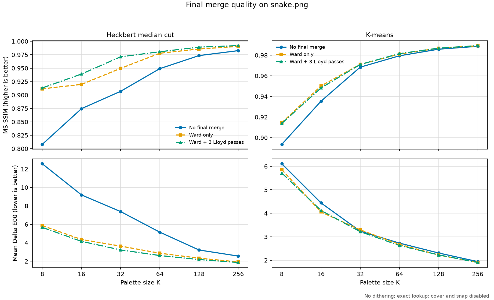
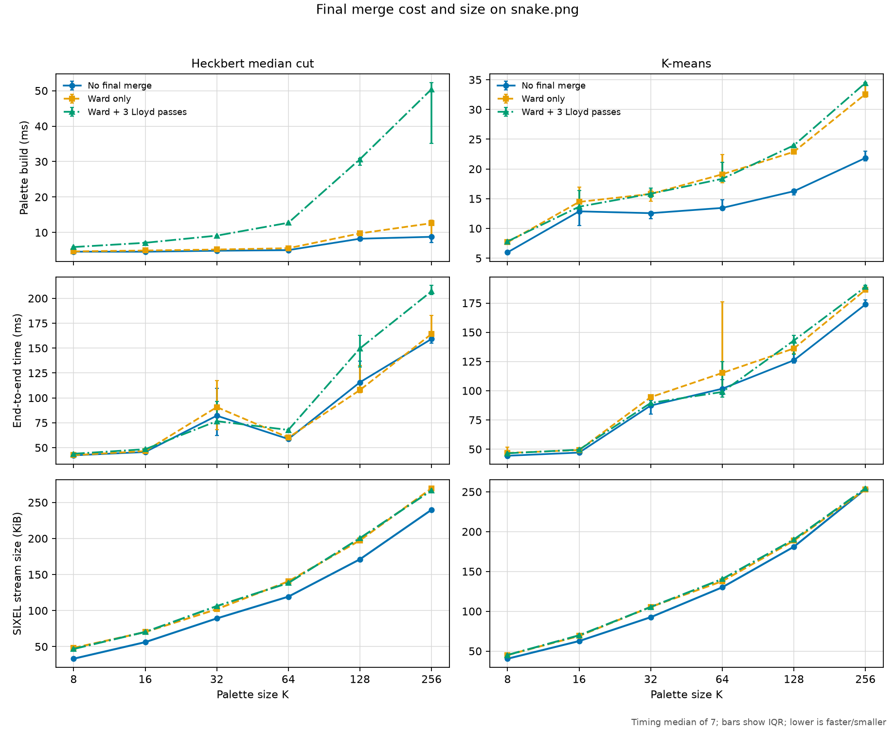

# Final Palette Merge Policy

`-F POLICY` and `--merge-policy=POLICY` control an optional reduction stage at the end of palette construction. The current choices are `auto`, `none`, and `ward`. The short answer is that Ward merge is useful when a fast or structurally constrained quantizer first produces a rough palette, especially Heckbert median cut at low and medium palette sizes. It is usually a smaller gain after K-means has already optimized a squared-error objective.

## Pipeline position

The fixed-palette encoder normally builds and applies a palette in this order:

```text
loaded pixels
    |
    v
sampling (-4) -> clustering-space transform (-X) -> binning (-5)
    |
    v
quantizer (-Q) builds Q provisional clusters
    |
    v
Ward final merge (-F): Q clusters -> requested K clusters
    |
    v
optional Lloyd polishing at K clusters
    |
    v
cover repair (-a) -> snap (-_) -> lookup (-~) and dithering (-d)
    |
    v
SIXEL encoding
```

Here `K` is the requested palette size and `Q` is the provisional size. With `-F none`, `Q` equals `K` and there is no reduction stage. With `-F ward`, the quantizer is asked for approximately

$$
Q = \left\lfloor K f \right\rfloor,
$$

where `f` is `merge_oversplit`, then the final merge reduces those `Q` representatives to `K`. The default factor is 1.81, the accepted range is 1.0 through 3.0, and the provisional size is capped by the available sample or histogram population. If the source contains no more than `K` unique colors, the K-means path bypasses the unnecessary merge.

The name **merge** therefore means agglomerating provisional clusters. It does not concatenate palettes, blend output pixels, or merge animation frames. The stage changes the palette consumed by cover repair, snapping, lookup, and dithering, so downstream quality and SIXEL size can change even when every later option is fixed.

## Ward agglomeration

Each provisional cluster has a center and a population weight. For every pair of active clusters `A` and `B`, Ward's method computes the increase in weighted within-cluster squared error that would result from replacing the pair by their weighted mean:

$$
\Delta SSE(A,B) = \frac{w_A w_B}{w_A + w_B} d^2(c_A,c_B).
$$

The implementation repeatedly merges the pair with the smallest cost until only `K` clusters remain. The new center is the population-weighted mean of the two old centers, and its weight is their sum. Unlike simply deleting the closest center, the Ward factor accounts for cluster population: merging two large groups is more expensive than merging two equally separated small groups.

The distance `d` is squared Euclidean distance in the quantizer's clustering coordinates. For Oklab, CIELAB, and DIN99d coordinates, `channel_l` assigns a fraction of the distance weight to the lightness axis and divides the remainder equally between the two chroma axes. The default `channel_l=1/3` therefore gives all three axes equal weight. For other coordinate families the implementation uses the ordinary sum of the three squared component differences and `channel_l` has no effect.

The fast implementation stores a dense `Q` by `Q` pair-cost matrix and cached minimum for each row. It updates pairs touching the surviving cluster after every merge. Storage is `Theta(Q^2)`. Initial cost construction is `Theta(Q^2)`; the conservative time bound is `O(Q^3)` because cached minima may need rescanning, although the row cache avoids recomputing every distance at every step in the usual path. If the dense workspace cannot be allocated, the implementation falls back to a full pair scan rather than changing the chosen Ward criterion.

The algorithm and terminology come from Joe H. Ward Jr.'s 1963 paper, [Hierarchical Grouping to Optimize an Objective Function](https://doi.org/10.1080/01621459.1963.10500845).

## Ward and Lloyd solve different steps

Ward and Lloyd are not two interchangeable values of `--merge-policy`. Ward is the reduction rule used to move from `Q` clusters down to `K`; Lloyd is an optional refinement performed after that reduction.

| Property | Ward merge | Lloyd refinement |
| --- | --- | --- |
| Starting state | `Q` weighted clusters, normally `Q > K` | `K` current centers plus the retained weighted samples |
| Operation | Merge one pair at a time | Reassign every sample to its nearest center, then recompute weighted means |
| Cluster count | Decreases from `Q` to `K` | Remains `K` |
| Immediate objective | Choose the smallest increase in weighted squared error | Do not increase weighted squared error for exact assignment and mean-update steps |
| Character | Hierarchical and greedy; an early merge is never split later | Local coordinate descent; centers can move but the result depends on the starting basin |
| Main cost | Pair matrix and repeated minimum maintenance | About `O(I S K)` for `I` passes over `S` retained samples and `K` centers |

`merge_lloyd=COUNT`, or short suboption `LCOUNT`, selects 0 through 30 requested passes; the ordinary Ward default is 3. Current Heckbert and K-means builders perform this post-merge Lloyd stage. K-medoids and K-center can use Ward oversplitting and reduction, but they do not run this additional Lloyd pass. Ward also replaces sample-constrained medoids or radius-oriented K-center representatives with weighted means, so the final palette no longer strictly preserves those solvers' original representative or objective contract.

Lloyd's nearest-center and weighted-mean iteration is described in [Least Squares Quantization in PCM](https://doi.org/10.1109/TIT.1982.1056489). A direct K-means run at `K` and an oversplit K-means run followed by Ward and Lloyd are not equivalent: they start with different numbers of centers, take different irreversible decisions, and may finish in different local minima.

## Why measured quality can improve

Oversplitting gives the first solver room to preserve local color groups before it must spend exactly `K` entries. Ward then reduces that richer representation while explicitly minimizing the immediate increase in the same family of squared-distance loss. This is particularly helpful for median cut: its box-splitting decisions target range, population, or a principal direction, but do not directly minimize the final `K`-center squared error. Ward can keep useful subdivisions long enough to decide globally which pair is cheapest to collapse.

K-means already moves `K` centers to reduce weighted squared error. Running it first at `Q > K` and merging can still enter a better `K`-center basin, especially at low `K`, but the gain is expected to be smaller and is not monotonic. Additional Lloyd passes can improve the squared-distance objective after Ward, but they can also leave MS-SSIM effectively unchanged or slightly worse because MS-SSIM is not the optimized objective.

### Is this fitting only the metric?

Ward and Lloyd do **not** inspect LSQA, MS-SSIM, or Delta E00. They optimize squared distances in the selected clustering space, so an improvement in those external metrics is evidence of correlation rather than direct metric fitting. Nevertheless, metric-specific overfitting is possible at the configuration and evaluation level: choosing `merge_oversplit`, `merge_lloyd`, `channel_l`, an image corpus, or a default threshold after repeatedly observing one reported metric can tune the system to that benchmark.

Squared-error improvement also does not guarantee every visible property. Population weighting can sacrifice a rare saturated color; clustering-space distance may disagree with Delta E00; a spatially averaged score can hide edges or texture changes; independent per-frame palettes can still flicker; and a palette with better color error can produce longer SIXEL runs. Merge changes centroids but does not provide the gamut-reachability guarantees discussed in [Palette Cover Policy](cover-policy.md), and it does not optimize output compression.

A defensible evaluation therefore reports at least a spatial metric, a color-error metric, encoded size, runtime, and representative images. Animation work must add temporal stability. The measurements below are one reproducible fixture, not a universal default-selection corpus.

## CLI values and suboptions

```text
-F POLICY
--merge-policy=POLICY
```

| Value | Effective behavior |
| --- | --- |
| `auto` | Resolves to `none` unless a higher-level preset selects another policy before resolution. |
| `none` | Build at the requested `K`; do not run final Ward reduction or post-merge Lloyd refinement. |
| `ward` | Build an oversplit provisional palette, reduce it to `K` with Ward, then run the configured Lloyd passes where the selected quantizer implements them. |

Suboptions can use long keys or their short keys inside the `-F` value:

| Long suboption | Short key | Range and default | Meaning |
| --- | --- | --- | --- |
| `merge_oversplit=FACTOR` | `OFACTOR` | 1.0-3.0; default 1.81 | Set `f`, the multiplier used to request `Q` provisional clusters. |
| `merge_lloyd=COUNT` | `LCOUNT` | 0-30; default 3 | Request additional Lloyd passes after Ward in builders that support this stage. |
| `channel_l=FACTOR` | `CFACTOR` | 0.0-1.0; default 1/3 | Weight the lightness axis in Lab-family Ward distances. |

For example, Ward without the polishing pass is:

```sh
img2sixel -Fward:L0 input.png
```

The equivalent long spelling with an explicit provisional factor is:

```sh
img2sixel --merge-policy=ward:merge_oversplit=1.81:merge_lloyd=0 input.png
```

The environment defaults are `SIXEL_PALETTE_FINAL_MERGE`, `SIXEL_PALETTE_OVERSPLIT_FACTOR`, `SIXEL_PALETTE_FINAL_MERGE_ADDITIONAL_LLOYD_ITER_COUNT`, and `SIXEL_PALETTE_MERGE_CHANNEL_FACTOR_L`. An explicit CLI value takes precedence, and repeated `-F` options use the last occurrence.

`-Q heckbert:profile=quality` is the important preset interaction. Unless the user explicitly overrides the corresponding settings, that profile selects Ward, uses two Lloyd passes, and chooses a palette-size-dependent oversplit factor: 2.0 through 32 colors, 1.8 through 64, 1.6 through 128, and 1.4 above 128. `profile=speed` selects no merge, while `profile=compat` leaves `auto` to resolve to no merge. An explicit `-F`, including explicit `-Fauto`, wins over the profile.

## Reproducible quality, speed, and size comparison

The checked-in experiment compares no final merge, Ward without Lloyd, and Ward with three Lloyd passes for Heckbert median cut and K-means at 8, 16, 32, 64, 128, and 256 colors.



*Figure 1. Quality measured by `lsqa` after decoding `img2sixel` output for the 600 by 450 `images/snake.png` fixture. Higher MS-SSIM and lower mean Delta E00 are better. Dithering is disabled, lookup is exact, and cover and snap are disabled so the comparison isolates the palette change.*



*Figure 2. Single-threaded `img2sixel` measurements on Apple Silicon macOS. Palette-build and fresh-process end-to-end values are medians of seven runs; bars show the interquartile range. Stream size is the exact encoded SIXEL byte length. The palette-build span is the more direct cost measure; loader, palette application, and process startup add variance to end-to-end time.*

The following selected points show the change from no merge. `Ward` means no Lloyd passes; `Ward+L3` means three passes. Positive MS-SSIM is better, negative Delta E00 is better, and the time and size columns are ratios where 1.0 means unchanged.

| Quantizer | K | Configuration | MS-SSIM change | Mean Delta E00 change | Palette-build ratio | SIXEL-size ratio |
| --- | ---: | --- | ---: | ---: | ---: | ---: |
| Heckbert | 8 | Ward | +0.103359 | -6.6979 | 1.015 | 1.449 |
| Heckbert | 8 | Ward+L3 | +0.105002 | -6.8912 | 1.284 | 1.409 |
| Heckbert | 64 | Ward | +0.028677 | -2.2796 | 1.108 | 1.178 |
| Heckbert | 64 | Ward+L3 | +0.031440 | -2.5301 | 2.536 | 1.159 |
| Heckbert | 256 | Ward | +0.007928 | -0.6368 | 1.438 | 1.124 |
| Heckbert | 256 | Ward+L3 | +0.009335 | -0.6955 | 5.745 | 1.112 |
| K-means | 8 | Ward | +0.020959 | -0.2478 | 1.283 | 1.115 |
| K-means | 8 | Ward+L3 | +0.020265 | -0.3917 | 1.309 | 1.116 |
| K-means | 64 | Ward | +0.001639 | -0.0523 | 1.420 | 1.059 |
| K-means | 64 | Ward+L3 | +0.002113 | -0.1026 | 1.363 | 1.080 |
| K-means | 256 | Ward | +0.000508 | -0.0376 | 1.492 | 0.999 |
| K-means | 256 | Ward+L3 | +0.000671 | -0.0363 | 1.578 | 1.004 |

For this fixture, Ward is a compelling quality option for Heckbert through the measured range, with the largest benefit at low `K`. Ward alone captures most of the gain at 8 and 256 colors; Lloyd adds a visible MS-SSIM increment at 16 and 32 colors but becomes expensive as `K` grows. For K-means, the useful gain is concentrated at 8 and 16 colors. Above that range the quality curves nearly converge, while oversplitting still adds palette-build work.

The size result is equally important: better palette error did not imply smaller output. With dithering disabled, Ward increased the Heckbert stream by 11-45% at the selected points and usually increased K-means size at low and medium `K`. Different centroids change palette declarations, selected indices, and run structure. Compression must therefore be measured rather than inferred from a quality objective.

### Should users enable it?

- Use `-Fward:L0` as the first deliberate tradeoff to test with Heckbert when low- or medium-color quality matters. It obtained most of the measured quality improvement at much lower cost than three Lloyd passes.
- Use `-Qheckbert:profile=quality` when the bundled PCA split, size-dependent oversplit factor, Ward merge, and two-pass polish match the intended quality-first workload.
- Benchmark before adding Ward to K-means at medium or high `K`; this fixture shows small external-metric gains for a persistent palette-build cost.
- Keep `auto`/`none` for latency-sensitive work, externally constrained palettes, or comparisons that need to isolate the quantizer.
- Re-evaluate with representative images and the intended dithering and lookup policies. These measurements deliberately disable dithering and therefore do not predict the final size or spatial quality of an error-diffused workload.

## Reproducing the measurements

The full experiment, including build, 36-point contract preflight, quality pass, rotated timing order, plotting, and artifact validation, runs with one command from a configured clean worktree:

```sh
PYTHON=.local/measurement-env/bin/python \
tools/reproduce_merge_policy_measurements.sh
```

The Python environment needs Matplotlib. Override `PYTHON` if it is installed elsewhere. The script refuses to record durable results from a dirty tracked worktree and removes inherited `SIXEL_*` settings from measurement subprocesses. [`merge-policy-run.json`](merge-policies/measurements/merge-policy-run.json) records the source revision, compiler, host, input hash, executable hashes, complete protocol, warmups, run count, and command templates. [`merge-policy-comparison.csv`](merge-policies/measurements/merge-policy-comparison.csv) contains every raw summary point and derived baseline ratio.

Regenerate the plots directly from a compatible build with [`plot_merge_policy_measurements.py`](../../tools/plot_merge_policy_measurements.py). Validate an existing artifact directory without rerunning the benchmark with:

```sh
.local/measurement-env/bin/python \
tools/check_merge_policy_measurements.py \
docs/functionality/merge-policies/measurements
```

The checked-in run controls sampling, binning, precision, clustering and working spaces, loader, threads, lookup, diffusion, GPU use, cover, snap, palette type, and encoder policy. It also checks the effective quantizer and merge mode, effective binning, work format, clustering-space selector, exact lookup, and absence of quantizer fallback before collecting results.

## Test coverage

<!-- test-coverage: enforced -->

| ID | Contract | Owning test |
| --- | --- | --- |
| MP-01 | The final-merge filter dispatches through its component interface and reports progress. | [tests/processing/filter/0006_filter_final_merge.t](../../tests/processing/filter/0006_filter_final_merge.t) |
| MP-02 | `auto`, `none`, `ward`, and the long suboption spellings are accepted independently of `-Q`. | [tests/cli/options/matching/0119_option_matching_merge_policy_long_suboptions_success.t](../../tests/cli/options/matching/0119_option_matching_merge_policy_long_suboptions_success.t) |
| MP-03 | The merge-policy environment and `-F` produce equivalent output. | [tests/cli/options/migration/0017_merge_policy_environment_cli_equivalence.t](../../tests/cli/options/migration/0017_merge_policy_environment_cli_equivalence.t) |
| MP-04 | CLI oversplit values override environment defaults and invalid CLI values fail. | [tests/cli/options/matching/0121_option_matching_merge_policy_oversplit_env_cli_precedence.t](../../tests/cli/options/matching/0121_option_matching_merge_policy_oversplit_env_cli_precedence.t) |
| MP-05 | CLI Lloyd counts override environment defaults and invalid CLI values fail. | [tests/cli/options/matching/0122_option_matching_merge_policy_lloyd_env_cli_precedence.t](../../tests/cli/options/matching/0122_option_matching_merge_policy_lloyd_env_cli_precedence.t) |
| MP-06 | Repeated `-F` options use the last occurrence. | [tests/cli/options/matching/0124_option_matching_merge_policy_last_wins.t](../../tests/cli/options/matching/0124_option_matching_merge_policy_last_wins.t) |
| MP-07 | `O`, `L`, and `C` short suboption keys are accepted. | [tests/cli/options/matching/0126_option_matching_merge_policy_short_keys_success.t](../../tests/cli/options/matching/0126_option_matching_merge_policy_short_keys_success.t) |
| MP-08 | The `channel_l` value reaches the palette consumer through CLI and environment paths and obeys its range contract. | [tests/cli/options/regression/0021_merge_policy_channel_l_image_regression.t](../../tests/cli/options/regression/0021_merge_policy_channel_l_image_regression.t) |
| MP-09 | The oversplit factor reaches the palette consumer and obeys its range contract. | [tests/cli/options/regression/0022_merge_policy_oversplit_image_regression.t](../../tests/cli/options/regression/0022_merge_policy_oversplit_image_regression.t) |
| MP-10 | The Lloyd count reaches the palette consumer and obeys its range contract. | [tests/cli/options/regression/0023_merge_policy_lloyd_image_regression.t](../../tests/cli/options/regression/0023_merge_policy_lloyd_image_regression.t) |
| MP-11 | Ward output retains the K-means float32 quality floor. | [tests/quant/palette/usage/0026_merge_kmeans_float32_lsqa.t](../../tests/quant/palette/usage/0026_merge_kmeans_float32_lsqa.t) |
| MP-12 | Ward output retains the Heckbert float32 quality floor. | [tests/quant/palette/usage/0027_merge_heckbert_float32_lsqa.t](../../tests/quant/palette/usage/0027_merge_heckbert_float32_lsqa.t) |
| MP-13 | Ward output retains the K-means 8-bit quality floor. | [tests/quant/palette/usage/0028_merge_kmeans_8bit_lsqa.t](../../tests/quant/palette/usage/0028_merge_kmeans_8bit_lsqa.t) |
| MP-14 | Ward output retains the Heckbert 8-bit quality floor. | [tests/quant/palette/usage/0029_merge_heckbert_8bit_lsqa.t](../../tests/quant/palette/usage/0029_merge_heckbert_8bit_lsqa.t) |

### Coverage boundary

The automated tests fix parsing, precedence, consumer wiring, component dispatch, and minimum LSQA quality for the two principal quantizers and precision paths. They do not assert the benchmark's exact timing, byte length, or metric curves because those vary with implementation, compiler, and host. The artifact checker instead fixes the measurement grid, metadata, command controls, effective-pipeline preflight, derived ratios, and plot validity; reviewers must interpret whether a changed curve justifies a policy or default change.
