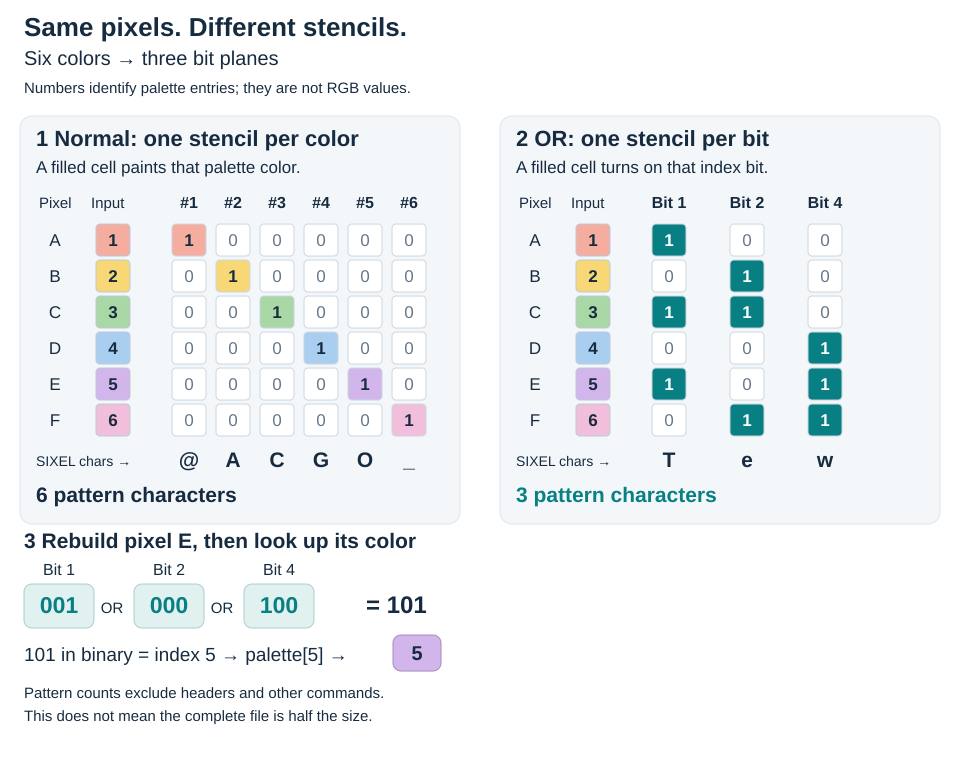
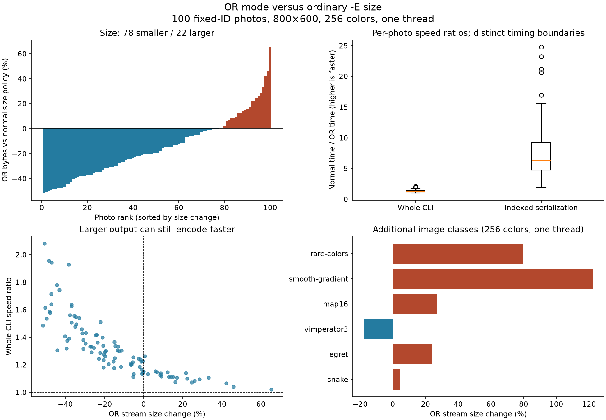

# OR-mode output

`img2sixel -O` (or `--ormode`) encodes palette indices as overlapping bit planes. The receiver combines the selected index bits with bitwise OR, then looks up the resulting index in the palette. This is a SIXEL dialect signaled by `P2=5`, so ordinary SIXEL support alone does not establish compatibility.

The [img2sixel manual](../../converters/img2sixel.1) attributes the dialect to the NetBSD/x68k `ite` console and the `sayaka` client. This document describes the current libsixel implementation; it does not certify current versions of those or other receivers.

## The idea, step by step

Think of an image as a sheet of numbered squares, accompanied by a color chart. A square marked **5** means “use color 5 from the chart.” That number is a label, not a brightness or a mixture of colors. The chart is the **palette**, and the labels are **palette indices**. OR mode changes how those labels are sent after the image has been reduced to a palette.

[arakiken's article](https://qiita.com/arakiken/items/26f6c67da5a9f9f907ac) explains the motivation through older computers whose display memory stores each bit of a color number in a separate layer. OR mode applies the same arrangement to SIXEL transmission. The example below uses a smaller, independently constructed image to walk through the current [libsixel encoder](../../src/encoder-core-encode.c).

### Ordinary SIXEL: a stencil for each color

Imagine painting through a stencil: its holes say which squares receive the currently selected color. Ordinary SIXEL sends that kind of pattern. It selects a palette color, marks the positions to paint, then selects another color and sends another pattern.

SIXEL groups **six vertically adjacent pixels** into one data character. Within that group, a character can mark any combination of positions, but an ordinary painting operation uses just one selected color. If all six positions have different colors, they cannot all be painted by that one operation. If they share a color, a single character can mark all six.

### OR mode: a stencil for each bit of the color number

Instead of asking “which squares are color 5?”, the OR encoder asks “which squares have the 1-bit set?”, then repeats for the 2-bit, the 4-bit, and so on. Each resulting yes/no stencil is called a **bit plane**. These are layers of numbers, not translucent layers of colored paint.

For an eight-entry palette numbered 0 through 7, three switches with values **1, 2, and 4** can represent every label. For example, 5 uses the 1 and 4 switches; 6 uses the 2 and 4 switches. Consider this single column of six pixels:

<picture>
  <source media="(max-width: 640px)" srcset="or-mode/encoding-explained-mobile.svg">
  
</picture>

*Read each stencil column from top to bottom: 1 marks a pixel and 0 leaves it unmarked. Each column becomes one SIXEL pattern character, shown underneath. The colors in the input are illustrative palette entries; teal marks index bits, not a new paint color. The lower panel follows pixel E through reconstruction and palette lookup.*

| Pixel, top to bottom | Desired palette index | Plane 1 | Plane 2 | Plane 4 |
| --- | ---: | :---: | :---: | :---: |
| A | 1 | On | Off | Off |
| B | 2 | Off | On | Off |
| C | 3 | On | On | Off |
| D | 4 | Off | Off | On |
| E | 5 | On | Off | On |
| F | 6 | Off | On | On |

Read each plane column vertically. Plane 1 marks A, C, and E; plane 2 marks B, C, and F; plane 4 marks D, E, and F. Each is a six-position yes/no pattern that fits into one SIXEL data character. This simple example therefore needs **three plane-pattern characters**, compared with **six color-pattern characters** for straightforward ordinary painting. This counts only the pattern characters, not headers, palette definitions, selectors, or cursor movement; it is not a claim that a complete file becomes half as large.

### The receiver puts the number back together

Start each pixel's number at zero. When a plane marks that pixel, turn on the corresponding switch without turning off any switch already set. This is the **OR** operation that names the mode. For pixel E, receiving plane 1 gives 1, plane 2 leaves it unchanged, and plane 4 changes it to 5. The receiver then looks up palette entry 5 and displays that color.

Because each plane represents a different switch, adding its value once gives the same result in this example. OR is more precise than ordinary addition: receiving the 1-bit twice still leaves it at 1, not 2. A zero in a plane means “do not add this bit,” not “erase this pixel.”

The color chart has not changed, and reconstructing the same number selects exactly the same chart entry. This explains why the decomposition itself does not discard color information. It does not undo the color reduction that happened before encoding, and source transparency needs the separate treatment described [below](#palette-transparency-and-other-options).

### Why this can help, and why it is not always smaller or faster

A palette of 16 entries needs four bit planes; 256 entries need eight. In a busy, dithered image, one plane can describe positions belonging to many different colors together. In a flat-color area, ordinary SIXEL may already describe the pixels with very few operations. The arrangement of repeated patterns and the encoder's optimizations determine the actual byte count, so counting planes alone does not predict the saving.

The display-memory arrangement described in arakiken's article also suggests a receiver that consumes these planes directly. A receiver that needs complete pixel colors must instead reconstruct the indices and look them up. Our [measurements](or-mode/scaling.md#photo-set-decoder-results) show why that distinction matters: smaller OR streams usually decoded more slowly in the measured libsixel CPU decoder. Use OR mode with a compatible receiver and evaluate size, encoding time, and decoding time separately.

## Usage and API

OR mode is disabled by default. Enable it explicitly when producing a stream for a receiver that implements this dialect:

```console
img2sixel -O -p 16 -o image-or.six image.png
sixel2png -i image-or.six -o image-or.png
```

The second command checks the decoded image with libsixel; it does not test the terminal. Palette construction, palette application, and dithering still precede OR-mode serialization. `-p 16` is only an example palette budget, not a requirement of the mode.

For the high-level C encoder, use `sixel_encoder_setopt(encoder, SIXEL_OPTFLAG_ORMODE, NULL)`. For the low-level output context, use `sixel_output_set_ormode(output, 1)` before encoding a palette image; passing zero disables the flag. These interfaces are declared in the [public header template](../../include/sixel.h.in).

## Index composition

Normal SIXEL painting replaces a pixel's color with the selected register. OR-mode painting accumulates bits in its palette index:

```text
normal paint: index = selected_register
OR paint:     index = index | selected_register
final color:  palette[index]
```

The operation applies to integer palette indices, not RGB components. For example, painting register 1 and then register 2 onto the same pixel yields index 3. If palette entry 3 is blue, the result is blue even when entries 1 and 2 are red and green.

| Desired index | Binary index | Encoder plane selectors |
| --- | --- | --- |
| 0 | 000 | No set bits |
| 1 | 001 | `#1` |
| 3 | 011 | `#1`, `#2` |
| 5 | 101 | `#1`, `#4` |
| 7 | 111 | `#1`, `#2`, `#4` |

Repeated painting with the same selector is idempotent. Painting another selector can add bits but cannot remove them. Consequently, ordinary size-policy solid underpainting followed by color repair cannot be used: the repair would need to clear already accumulated bits. See [encoding policy](encode-policy.md).

## Wire representation

The encoder header uses `P1=7` and `P2=5`. The decoder recognizes OR mode from `P2=5`; it does not use `P1=7` as the mode discriminator. DCS framing, six vertical bits per data character, repeat runs, `$` carriage returns, and `-` band advances retain their structural roles described in the [SIXEL format guide](../sixel-format.md).

The following escaped stream defines a one-pixel raster, defines four palette entries, and paints its top pixel twice. `ESC` here denotes byte `0x1b`, not literal letters:

```text
ESC P 7;5 q
"1;1;1;1
#0;2;0;0;0 #1;2;100;0;0 #2;2;0;100;0 #3;2;0;0;100
#1 @ $ #2 @
ESC \
```

Whitespace and line breaks are shown only for readability. `@` has SIXEL mask value 1, and `$` returns to the same column, so the two paints produce index 3. A receiver that simply overwrites would end at index 2 instead.

The encoder emits palette definitions and then visits the palette-index bit planes for each six-row band. It uses power-of-two selectors such as `#1`, `#2`, and `#4`. The number of candidate planes is the ceiling of the base-two logarithm of the palette size, with at least one plane and at most eight in this encoder. Thus a 256-color palette needs eight candidate planes, not 256 per-color masks. Final bands shorter than six rows use only the available rows. `-E size` can omit entirely empty planes while preserving horizontal positions with leading zero runs.

## Palette, transparency, and other options

| Interaction | Current behavior and boundary |
| --- | --- |
| Fixed palettes | Builtin palettes and mapfiles still supply the final palette. `-X` does not rebuild a fixed palette merely because `-O` is active. |
| `-E size` | Optimizes OR-plane serialization, including empty-plane omission; it does not enable ordinary overwrite-based repair. |
| `--threads` | OR mode has a producer/writer pipeline with ordered band output. The serial body and pipeline have a byte-equivalence regression fixture. Scheduling and fallback details are in the [encoder threading guide](../threading/encoder.md). |
| Transparent offset (`-+`) | The encoder expands the geometry and emits zero-bit padding. This alone does not guarantee that a receiver preserves the existing terminal image in that margin. |
| Alpha and index zero | libsixel decoding initializes the OR index raster to zero. Every cell in the decoded raster, including an untouched cell, has a palette index and is treated as painted. Direct RGBA decoding resolves entry zero to an opaque color. |
| High color (`-I`) | High-color dispatch precedes the ordinary indexed encoder. It is a separate repeated-register technique, not an additional OR bit plane or a way to expand this eight-plane encoder. Combining `-I` with `-O` is not covered here as a supported composition. See [high-color output](high-color.md). |

In particular, do not infer normal `P2=1` transparency from a zero SIXEL mask in a `P2=5` stream. The libsixel image decoder's opaque index-zero behavior and a terminal's existing framebuffer behavior are different observation boundaries. The offset regression checks geometry and padding bytes, not visual transparency on hardware. Resolve source transparency to the intended background before encoding when an opaque standalone image is required; see [alpha policy](../loader/alpha-policy.md) and [background policy](../loader/background-policy.md).

## Quality, size, and performance

OR decomposition does not itself choose different colors: for a fixed palette and valid index raster, recombining its bits recovers those indices. Input quantization, dithering, palette serialization, and receiver behavior remain relevant to the final image. This is not a claim that two complete CLI runs with different modes or scheduling necessarily have identical intermediate rasters.

Fewer candidate planes can reduce output size, especially when many palette colors occur in a band. Actual byte size also depends on index assignment, spatial patterns, repeat-run compression, and empty planes. A normal encoder can be smaller on images with simple per-color runs; eight planes are not a promise of an eightfold size or speed improvement.

Compare stream byte counts and decoded images using the same source, loader, palette, dithering, geometry, encode policy, and thread budget. Distinguish complete conversion time from body serialization and terminal rendering. The measured comparison below follows the [quality measurement policy](../quality/measurement-policy.md). Terminal rendering and transport latency remain outside its scope.

For color-count and thread-count curves, plus indexed/RGBA decoder timing, see the [scaling and decoding study](or-mode/scaling.md).

## Measured comparison

### Historical comparison and the baseline

[arakiken's OR-mode article](https://qiita.com/arakiken/items/26f6c67da5a9f9f907ac), published in 2020, explains the connection to planar VRAM and illustrates reductions on `snake.png` at 16 and 256 colors. It also identifies low color diversity within a band and the incompatibility with ordinary solid-underpaint repair as limitations. Its encoding commands and byte counts describe the implementation at that time, not a current performance guarantee.

In [PR #133](https://github.com/saitoha/libsixel/pull/133#issuecomment-3240025194), saitoha compared OR output with ordinary `-E size` and reported that some images, including `egret.jpg`, became larger. Recalculation from the [attached 100-image result](https://github.com/user-attachments/files/22065690/result.txt), preserved as [raw historical data](or-mode/measurements/pr133-result.txt), gives 25 larger images, a 24.11% reduction in total bytes, a 17.42% mean per-image reduction, and a 22.75% median per-image reduction. These are different aggregation methods. The comment's approximate 30–40% average reduction is not the exact aggregate of that attachment.

The original photos and script are no longer available. The new study repeats the scale and comparison method, not the original photo set or historical binary. It uses the first 100 entries returned by the Picsum catalog, fetched by explicit ID at 800×600, plus eight repository fixtures. The [photo manifest](or-mode/measurements/inputs.json) records IDs, source URLs, authors, and SHA-256 hashes; this consecutive catalog sample is not a random sample of all possible images. Repository inputs and the two explicitly resized photos are recorded in the [control manifest](or-mode/measurements/controls.json).

### Conditions and timing boundaries

The measurements were taken on 2026-09-11 using clean tracked source at `cf4cb3439aedec252b68bbc3674b10aa2bf0145f`, Apple M3 Max, macOS 26.5.1, and an `-O3` C99 build. An isolated checkout and explicit shared-library path kept concurrent repository changes out of the experiment. The [build metadata](or-mode/measurements/metadata.json) records compiler, configuration, executable/library hashes, and Python packages. The [preflight trace](or-mode/measurements/preflight.txt) confirms `work=rgb888`.

The primary CLI comparison uses the following controls, with only `-O` added for the OR member of each pair:

```console
img2sixel --threads=1 --precision=8bit --loaders=builtin! \
  --gpu-policy=off --palette-type=rgb -Esize -p256 -o output.six input.jpg
```

Other quantization and diffusion options use that revision's defaults. Explicit `-Esize` also lets the current OR implementation omit empty planes; it does not enable the ordinary overwrite-based optimization described in the article. The control fixtures additionally cover 16 colors and four threads. The full [per-image records](or-mode/measurements/results.json) include exact commands, output sizes/hashes, pixel comparisons, quality metrics, individual timing samples, medians, and quartiles. The [CSV summary](or-mode/measurements/summary.csv) is convenient for independent analysis.

| Measurement | Included | Excluded |
| --- | --- | --- |
| Whole CLI | Process startup, loading, palette construction, palette application/dithering, encoding, and output to `/dev/null`; 11 measured runs after two warmups per mode | Terminal display and transport |
| Identical-index serialization | One `sixel_encode` call with `PAL8` pixels and a fixed palette, including header/palette/body emission and internal encode allocations; an in-process byte-counting callback; 21 runs after two warmups per mode | CLI startup, file decoding, quantization, input copying, output/dither context setup, filesystem writes, and terminal display |

For the second measurement, a normal CLI stream is decoded once to obtain a single index raster and palette. Both encoders receive copies of those same indices. Captured untimed streams are decoded and compared with each other and the CLI baseline. Normal and OR order alternates within each measured pair. These are warm, unisolated desktop measurements; small differences near 1.00× should not be treated as a reliable optimization. The two timing boundaries cannot be substituted for one another.

### Output size and speed

| Photo-set statistic | Result |
| --- | ---: |
| Smaller / larger / equal streams | 78 / 22 / 0 |
| Change in total bytes | −20.95% |
| Mean / median per-image size change | −14.93% / −19.54% |
| Per-image size-change range | −51.51% to +65.30% |
| Median whole-CLI speed ratio | 1.29× (about 22.7% less time) |
| Whole-CLI speed-ratio range | 1.02× to 2.08× |
| Median identical-index serialization speed ratio | 6.32× |
| Identical-index serialization speed-ratio range | 1.88× to 24.76× |

A speed ratio is normal elapsed time divided by OR elapsed time; larger is faster. The median ratio is the median across the per-photo ratios of the repeated-run medians, not a ratio of unrelated global medians. OR can produce more bytes while still spending less CPU time constructing the stream.



The box plots summarize per-photo speed ratios: center lines are medians, boxes span the interquartile range, whiskers extend to 1.5 times that range, and individual points beyond them are outliers. They describe differences across images, not confidence intervals for a single timing run.

The following repository controls use 256 colors and one thread. Autumn was resized to 800×402 and fisheye to 714×600 before measurement; all other fixtures retain their original dimensions. Resize time is therefore not part of these CLI timings.

| Image | Normal bytes | OR bytes | Size change | Normal / OR CLI ms | CLI speed ratio |
| --- | ---: | ---: | ---: | ---: | ---: |
| snake | 299,483 | 312,223 | +4.25% | 54.48 / 49.33 | 1.10× |
| egret | 187,590 | 232,789 | +24.09% | 31.10 / 29.15 | 1.07× |
| autumn-resized | 596,776 | 420,598 | -29.52% | 68.80 / 46.83 | 1.47× |
| fisheye-resized | 631,040 | 484,553 | -23.21% | 81.21 / 60.82 | 1.34× |
| vimperator3 | 134,748 | 111,121 | -17.53% | 31.80 / 29.01 | 1.10× |
| map16 | 950 | 1,206 | +26.95% | 7.77 / 8.09 | 0.96× |
| smooth-gradient-600x450 | 122,620 | 272,455 | +122.19% | 52.38 / 52.01 | 1.01× |
| rare-colors-600x450 | 106,556 | 191,605 | +79.82% | 25.23 / 24.23 | 1.04× |

At four threads, the 16 additional control pairs range from 0.98× to 1.02× for whole-CLI speed: effectively little difference in this experiment. Faster indexed serialization does not guarantee a similar gain in an overlapping end-to-end pipeline. No terminal-rendering speedup has been measured here.

The article's snake example also illustrates why the baseline must be explicit. On this build with one thread, the [additional policy comparison](or-mode/measurements/qiita-cases.json) gives:

| Palette budget | Normal `-Efast` bytes | Normal `-Esize` bytes | OR bytes | OR vs fast | OR vs size |
| --- | ---: | ---: | ---: | ---: | ---: |
| 16 | 136,556 | 104,209 | 123,286 | −9.72% | +18.31% |
| 256 | 326,104 | 299,483 | 312,223 | −4.26% | +4.25% |

Here `-Eauto` matches `-Efast`, and the three OR policy outputs have the same size. OR reduces size against fast encoding while increasing it against size-optimized encoding, without changing a decoded pixel in either comparison. This does not contradict the article's explanation; the comparison baseline and implementation revision matter.

### Is the quality impact exactly zero?

For the tested opaque images, yes at the decoded-RGBA boundary: all 132 normal/OR pairs are byte-for-byte identical after decoding, covering 57,157,152 pixel positions. Both repeated streams for every mode also match exactly. MS-SSIM and Delta E therefore match between modes, not merely within a tolerance. All 116 identical-index comparisons match each other and the normal CLI decode. The [boundary probe](or-mode/measurements/index-boundaries.json) additionally checks every valid palette index for 19 palette sizes around bit-plane boundaries and seven heights (1, 5, 6, 7, 11, 12, 13): all 133 cases match independently constructed expected RGBA pixels.

This is zero additional distortion relative to the normal encoder, not lossless conversion of the source photo. For example, snake at 256 colors has MS-SSIM 0.991198 and mean Delta E00 2.728167 under both modes; at 16 colors it has MS-SSIM 0.918470 under both. The deliberately constrained 16-color case does not meet the usual 0.98 quality target, and no threshold has been lowered to accept it.

An unconditional claim is false for transparency. The [alpha probe](or-mode/measurements/alpha.json) uses a 600×450 image with a 300×200 transparent hole. With `--alpha-policy=keep`, normal decoding retains alpha zero there, whereas OR decoding makes those 60,000 pixels opaque. With `--alpha-policy=composite -B '#ffffff'`, both decoded results are identical and opaque. Thus, promise exact equivalence only for the same opaque index raster and palette on a receiver implementing the required semantics; do not extend it to preserved transparency, arbitrary option combinations, or unsupported terminals.

### Reproduce and inspect

The [study tools](../../tools/ormode/) retain the download, measurement, independent index/alpha probes, and plot generation. The following macOS workflow uses a separate study directory and pins the measured source revision. It requires the repository's normal build dependencies and Python compatible with the pinned scientific packages.

```sh
repo=$PWD
export OR_MODE_STUDY_DIR=/absolute/path/to/or-mode-study
mkdir -p "$OR_MODE_STUDY_DIR"
git worktree add --detach "$OR_MODE_STUDY_DIR/source" cf4cb3439
export PATH="$repo/.local/bin:$PATH"
(
  cd "$OR_MODE_STUDY_DIR/source"
  ./configure --without-libcurl --without-png --without-jpeg \
    --without-librsvg --without-tiff --without-webp --without-quicklook \
    --without-coregraphics --without-lcms2 --disable-quicklook-extension \
    CFLAGS=-O3 BASH=/bin/sh > ../configure.log 2>&1
  make -j6 > ../build.log 2>&1
)
python3 -m venv "$OR_MODE_STUDY_DIR/venv"
py="$OR_MODE_STUDY_DIR/venv/bin/python"
"$py" -m pip install -r tools/ormode/requirements.txt
cc -O3 -std=c99 -I "$OR_MODE_STUDY_DIR/source/include" \
  tools/ormode/indexed-bench.c -L "$OR_MODE_STUDY_DIR/source/src/.libs" \
  -Wl,-rpath,"$OR_MODE_STUDY_DIR/source/src/.libs" -lsixel \
  -o "$OR_MODE_STUDY_DIR/indexed-bench"
"$py" tools/ormode/download.py \
  --manifest docs/functionality/or-mode/measurements/inputs.json
"$py" tools/ormode/measure.py
"$py" tools/ormode/edge_cases.py
"$py" tools/ormode/qiita_cases.py
"$py" tools/ormode/render.py
```

The downloader checks recorded hashes rather than silently substituting changed remote content. Downloaded photos and large evidence streams stay in the study directory. The measurement runner retains completed cases for resumption and rejects a different build or run count in an existing result directory. Use a fresh directory for a new configuration. Plot generation reads the recorded results without rerunning benchmarks.

## Implementation references

- [Encoder core](../../src/encoder-core-encode.c): `sixel_encode_header`, `sixel_encode_body_ormode_nplanes`, `sixel_encode_body_ormode_band`, offset handling, and pipelined serialization.
- [Decoder parser](../../src/fromsixel.c): `parser_context_is_ormode_request`, index OR accumulation, index-zero initialization, direct-color finalization, and paint-mask completion.
- [Parallel decoder](../../src/decoder-parallel.c): OR accumulation in worker spans and direct-color index storage.
- [Output API](../../src/output.c) and [high-level encoder](../../src/encoder.c): mode configuration and default state.

## Test coverage

<!-- test-coverage: enforced -->

### Behavioral contract tests

| ID | Contract | Owning test |
| --- | --- | --- |
| OR-01 | CLI conversion accepts `-O`. | [tests/cli/options/general/0002_ormode_option_runs.t](../../tests/cli/options/general/0002_ormode_option_runs.t) |
| OR-02 | Full six-row bands serialize the expected plane bytes. | [tests/processing/encoder-core/0002_encoder_core_ormode_body_full_band.t](../../tests/processing/encoder-core/0002_encoder_core_ormode_body_full_band.t) |
| OR-03 | A short final band serializes only its available rows. | [tests/processing/encoder-core/0003_encoder_core_ormode_body_tail_band.t](../../tests/processing/encoder-core/0003_encoder_core_ormode_body_tail_band.t) |
| OR-04 | The OR producer/writer pipeline matches the serial body for its fixture. | [tests/processing/encoder-core/0005_encoder_core_ormode_pipeline_matches_body.t](../../tests/processing/encoder-core/0005_encoder_core_ormode_pipeline_matches_body.t) |
| OR-05 | Size policy omits an empty plane in the regression fixture. | [tests/processing/encoder-core/0006_encoder_core_ormode_body_skips_empty_planes.t](../../tests/processing/encoder-core/0006_encoder_core_ormode_body_skips_empty_planes.t) |
| OR-06 | Raw decoding composes selectors 1 and 2 into index 3. | [tests/processing/decoder/0002_decoder_ormode_raw_overlay.t](../../tests/processing/decoder/0002_decoder_ormode_raw_overlay.t) |
| OR-07 | Wide-index decoding preserves OR composition. | [tests/processing/decoder/0003_decoder_ormode_wide_overlay.t](../../tests/processing/decoder/0003_decoder_ormode_wide_overlay.t) |
| OR-08 | Direct decoding resolves the composed index and opaque entry zero. | [tests/processing/decoder/0004_decoder_ormode_direct_overlay.t](../../tests/processing/decoder/0004_decoder_ormode_direct_overlay.t) |
| OR-09 | Repeat runs preserve OR composition. | [tests/processing/decoder/0005_decoder_ormode_repeat_overlay.t](../../tests/processing/decoder/0005_decoder_ormode_repeat_overlay.t) |
| OR-10 | The legacy decode API follows OR composition. | [tests/processing/decoder/0006_decoder_ormode_legacy_api.t](../../tests/processing/decoder/0006_decoder_ormode_legacy_api.t) |
| OR-11 | The parallel request path accumulates OR indices. | [tests/processing/decoder/0007_decoder_ormode_parallel_request.t](../../tests/processing/decoder/0007_decoder_ormode_parallel_request.t) |
| OR-12 | Dequantization retains opaque OR raster cells. | [tests/processing/decoder/0022_decoder_ormode_dequantize_opaque.t](../../tests/processing/decoder/0022_decoder_ormode_dequantize_opaque.t) |
| OR-13 | Builtin palette OR output ignores clustering-space selection. | [tests/quant/palette/usage/0137_builtin_palette_ormode_clustering_colorspace_ignored_output.t](../../tests/quant/palette/usage/0137_builtin_palette_ormode_clustering_colorspace_ignored_output.t) |
| OR-14 | PAL mapfile OR output ignores clustering-space selection. | [tests/quant/palette/usage/0138_mapfile_pal_ormode_clustering_colorspace_ignored_output.t](../../tests/quant/palette/usage/0138_mapfile_pal_ormode_clustering_colorspace_ignored_output.t) |
| OR-15 | Transparent-offset OR output carries expanded geometry and left padding. | [tests/quant/palette/usage/0174_transparent_offset_ormode_geometry.t](../../tests/quant/palette/usage/0174_transparent_offset_ormode_geometry.t) |

### Defensive and malformed-input tests

The [encoder-core test category](../../tests/processing/encoder-core/) also exercises invalid arguments to the private OR body helper. These checks defend an implementation boundary and do not establish additional terminal behavior. General malformed-stream coverage belongs to the [decoder tests](../../tests/processing/decoder/) and [security tests](../../tests/security/).

### Coverage limits

The CLI test is a conversion smoke test, not an exhaustive default, long-option, repeated-option, or multi-input state test. The table does not establish every palette size, every alpha-policy combination, `-I`/`-O` composition, equivalence under every thread schedule, or terminal display compatibility. Receiver handling of `P2=5`, existing framebuffer content, and offset margins requires a separate receiver-specific observation.

<!-- Regenerate the explanatory SVGs with: python3 tools/ormode/render_explanation.py -->
