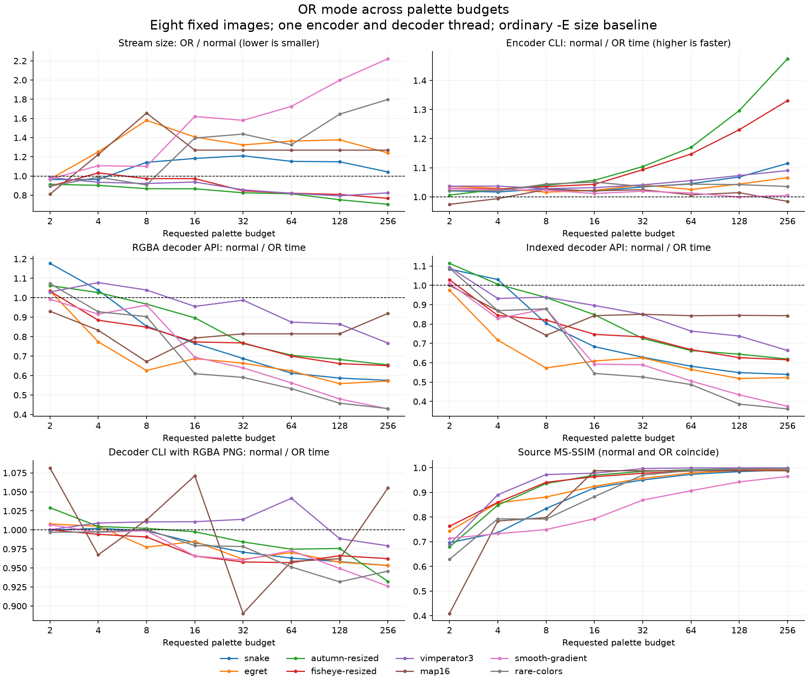
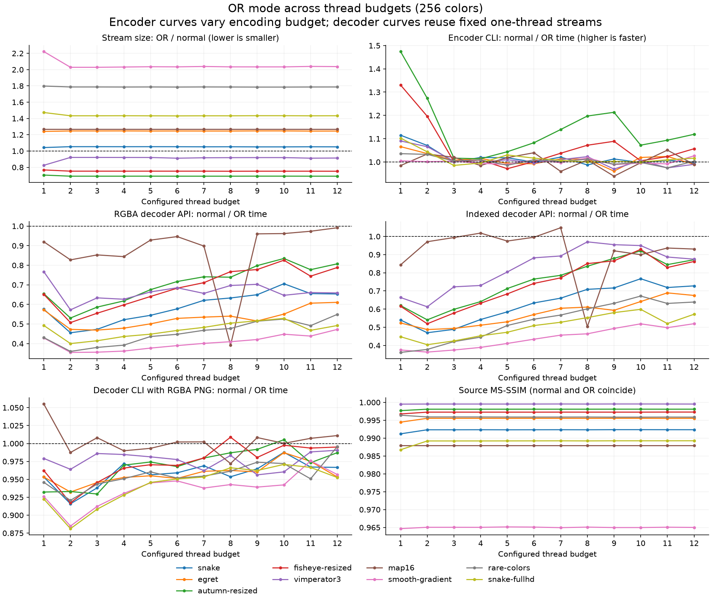
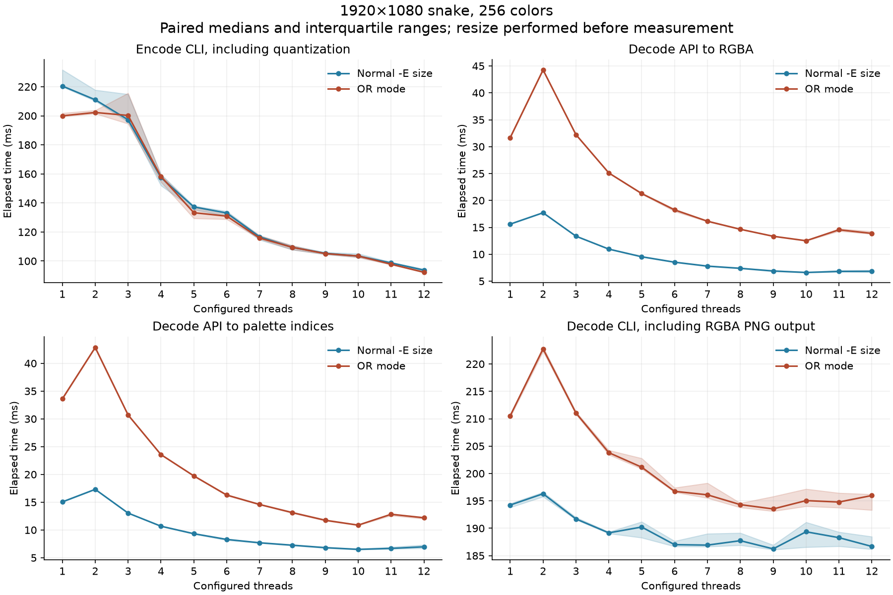
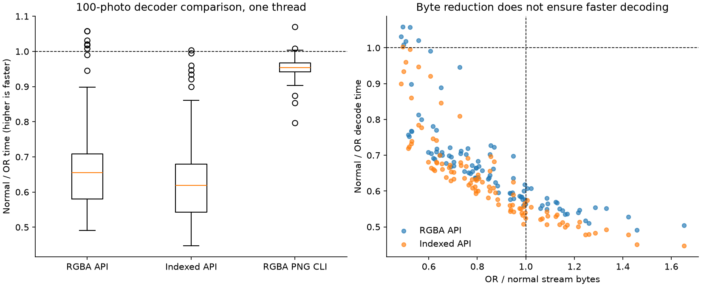

# OR-mode color, thread, and decoder comparisons

OR-mode size and speed depend on the palette budget, image structure, worker budget, and output representation. The following curves extend the [100-photo comparison](../or-mode.md#measured-comparison) with independent color and thread sweeps and explicit decoder timings. They compare the same pinned implementation, not a newer encoder against an older decoder.

## Experimental controls

The source is the clean tracked checkout at `cf4cb3439aedec252b68bbc3674b10aa2bf0145f`, built with `-O3` on Apple M3 Max/macOS 26.5.1. The [original build metadata](measurements/metadata.json) records compiler and configuration; the [sweep metadata](sweeps/metadata.json) records the additional decoder harness and binary hashes. Image loading and PNG writing use the builtin implementations in this build.

The color sweep uses the same eight repository controls as the original comparison, with requested palette budgets **2, 4, 8, 16, 32, 64, 128, 256** and one encoder/decoder thread. The thread sweep uses **1 through 12** workers at 256 colors, for those eight controls plus a Full HD snake. Snake is converted to RGB and resized to exactly 1920×1080 with Pillow Lanczos before measurement; that preprocessing is excluded from timing. See the [input manifest](sweeps/inputs.json).

The encoder controls remain `--precision=8bit --loaders=builtin! --gpu-policy=off --palette-type=rgb -Esize`, plus the requested `-p` and `--threads` values. The OR member adds only `-O`. Other encoder choices retain the measured revision's defaults. A requested palette budget is not necessarily the number of distinct colors emitted: the palette-map fixture saturates before 256 colors. The [axis summary](sweeps/axes.csv) includes the actual number of palette definitions. In the palette-map fixture, requested budgets from 16 through 256 all emit 16 colors. Its small 598×42 raster also makes CLI ratios sensitive to process-startup noise.

Two different uses of the thread axis must be distinguished:

- **Encoder sweep:** change encoder `--threads`, then measure the resulting bytes, quality, and complete conversion time. Scheduling can change the dithered raster across thread counts, so this is a controlled CLI comparison, not an immutable-index microbenchmark.
- **Decoder sweep:** encode each normal/OR input once with one encoder thread, then hold both streams byte-for-byte fixed while changing only the decoder budget. Thus, a decoder curve is not confounded by a different dither pattern or compressed stream at each point.

A configured thread budget is not a reservation of physical cores or proof that every decoder request uses every worker. Payload limits and serial fallback remain part of the implementation. Timing is performed sequentially on an unisolated desktop, with mode order alternating within each pair. Color and thread traversal direction alternates between images to reduce one-direction collection bias. Small deviations around a ratio of 1.00 are not strong evidence of improvement.

## Color-count axis



Each line follows one image. The horizontal axis is logarithmic in base two; markers are the measured budgets, and connecting lines do not represent measurements at intermediate counts. Size is OR bytes divided by normal bytes, so lower is better. Speed ratios are normal time divided by OR time, so higher is better. The dashed reference is equality. The quality panel compares each encoded result with its prepared source; normal and OR coincide at every measured point.

Size does not move monotonically in OR's favor as the palette budget rises. For example, snake changes from an OR/normal size ratio of about 0.96 at two colors to 1.21 at 32 colors and 1.04 at 256 colors. Egret is about 0.97 at two colors, 1.58 at eight, and 1.24 at 256. The gradient reaches about 2.22 at 256 colors. Plane count alone does not predict compression: ordinary size-policy overpainting, repeat runs, and spatial index patterns all contribute.

Decoder speed also crosses the equality line as the palette budget changes. The byte reduction from OR encoding cannot by itself establish a decoder speedup. The two decoder API panels distinguish expanding to RGBA from returning palette indices; neither includes PNG writing.

## Thread-count axis



The size, encoder, and quality panels vary the encoder budget. The decoder panels reuse the fixed one-thread streams. In particular, changes in source MS-SSIM along the thread axis are changes in the encoder's scheduling/dithering path; they are not a normal-versus-OR quality difference and are not caused by decoder thread count.

The Full HD detail below shows absolute times. Lines are medians and shaded regions are the interquartile ranges of repeated samples. Unlike the per-image ratio overview, these ribbons represent run-to-run variability for each individual configuration.



The Full HD medians below make the different boundaries explicit. Times are normal / OR in milliseconds.

| Threads | Encode CLI | RGBA decoder API | Indexed decoder API | RGBA PNG decoder CLI |
| --- | ---: | ---: | ---: | ---: |
| 1 | 220.47 / 199.98 | 15.60 / 31.67 | 15.05 / 33.60 | 194.24 / 210.53 |
| 2 | 211.04 / 202.27 | 17.71 / 44.26 | 17.31 / 42.84 | 196.30 / 222.75 |
| 4 | 157.49 / 158.19 | 10.96 / 25.11 | 10.68 / 23.57 | 189.16 / 203.81 |
| 8 | 109.36 / 109.42 | 7.39 / 14.64 | 7.26 / 13.12 | 187.73 / 194.31 |
| 12 | 93.75 / 92.26 | 6.83 / 13.88 | 6.97 / 12.19 | 186.68 / 195.98 |

At one worker the Full HD OR RGBA decode is about twice as expensive as normal decoding. Two workers make both modes slower than their single-worker path; additional workers then reduce the time. The best observed RGBA medians are at ten workers (6.62 ms normal, 12.51 ms OR), and eleven/twelve workers do not improve them. This is a workload/host observation, not a universal recommended thread count. The complete encoder benefits from more workers, but its normal/OR difference is small once the pipeline is parallel.

Untimed [worker observations](sweeps/thread-observations.json) confirm serial execution at one worker and four/twelve scan workers plus four/twelve paint workers per API call at the corresponding budgets for the Full HD streams, in both indexed and RGBA paths. These counts were collected separately from performance samples.

## Decoder timing boundaries

| Measurement | API or command | Timed work | Work outside timing |
| --- | --- | --- | --- |
| RGBA decoder API | `sixel_decode_direct` | SIXEL parsing, validation, worker setup/join as applicable, output allocation, OR index accumulation and final RGBA expansion | File I/O, correctness comparison, output freeing, PNG encoding |
| Indexed decoder API | `sixel_decode_raw` | SIXEL parsing, validation, worker setup/join as applicable, output allocation, index/palette construction | File I/O, conversion to RGBA for checking, correctness comparison, freeing, PNG encoding |
| RGBA PNG CLI | `sixel2png --direct --threads=N -i stream.six -o /dev/null` | Process startup, cached input-file I/O, decoding, PNG generation and writes to `/dev/null` | Terminal rendering, network transport |

Each API configuration has 21 timed calls after two warmup pairs; each CLI configuration has 11 timed processes after two warmup pairs. Streams are loaded into memory before API timing. Every API result is compared outside the timed call with the baseline, including palette expansion for the indexed path. The timer includes allocation of a new result, but not releasing that result after validation. The CLI's PNG generation is deliberately retained in its own metric rather than being described as pure decoding.

### Photo-set decoder results

The same 100 photographs, 800×600 and 256 colors, give the following one-thread results. Each ratio first compares the normal and OR per-image timing medians, then the table takes the median across images. OR/normal time and normal/OR speed ratios use reciprocal conventions; both are included to avoid interpreting a speed ratio below one as a benefit.

| Output boundary | Median normal/OR speed ratio | Median OR/normal time ratio | Normal faster / OR faster |
| --- | ---: | ---: | ---: |
| RGBA API | 0.655× | 1.527× | 94 / 6 |
| Indexed API | 0.619× | 1.615× | 99 / 1 |
| RGBA PNG CLI | 0.954× | 1.048× | 95 / 5 |



Most OR streams in this photo set are smaller, but most OR decodes are slower. PNG-inclusive CLI ratios are closer to equality because output generation consumes much of the process time. The small number of observed OR wins does not establish that those differences exceed host noise. Box centers are medians across images, boxes are interquartile ranges, whiskers extend to 1.5 times the IQR, and points beyond them are outliers; these are not per-image confidence intervals.

### Why smaller streams can decode more slowly

The current decoder does not write received OR planes directly into planar VRAM. In [`fromsixel.c`](../../../src/fromsixel.c), OR painting performs read-modify-write index accumulation. Direct RGBA decoding additionally allocates and clears a side index buffer, then resolves its completed indices to RGBA in a final pass. The normal indexed path can use repeated-byte fills where the OR path must accumulate bits; the parallel equivalents are in [`decoder-parallel.c`](../../../src/decoder-parallel.c).

Those are concrete implementation differences, not a measured attribution of every millisecond. Their relative costs depend on the stream and output format. Parallel decoding also performs a validation scan and a separate paint pass, with worker creation and joining; the [decoder threading guide](../../threading/decoder.md) explains those boundaries and fallback. The planar-display motivation discussed in [arakiken's article](https://qiita.com/arakiken/items/26f6c67da5a9f9f907ac) is therefore not a promise that this CPU raster decoder will be faster.

## Correctness and scope

All 164 normal/OR encoder pairs in the sweep have identical decoded RGBA pixels, and repeated encoded streams match within every mode/configuration. Equality is checked at each color/thread point; it does not imply equality between different palette budgets or between different encoder thread counts. Source MS-SSIM therefore measures ordinary quantization/dithering loss shared by both modes, not additional OR loss.

All 264 decoder pairs pass the exact pixel checks. The decoder harness checks every repeated API output, and CLI RGBA results are checked both against the other mode and against the canonical one-thread encoder decode. This also tests decoder-thread invariance for the fixed inputs. The measurements concern opaque rasters and do not replace the [transparency limitation](../or-mode.md#is-the-quality-impact-exactly-zero) of the original study. No terminal or planar-VRAM rendering time is included.

The complete [encoder records](sweeps/encode.json) and [decoder records](sweeps/decode.json) retain individual timing samples, medians, quartiles, exact stream hashes, commands, and correctness observations. The photo-only decoder sample uses the same 100 fixed-ID photos as the earlier size study, rather than a newly selected set.

## Reproduction

First complete the [original study setup](../or-mode.md#reproduce-and-inspect), retaining its inputs, source checkout, build, and result streams. With `OR_MODE_STUDY_DIR` still pointing to that study directory, run:

```sh
py="$OR_MODE_STUDY_DIR/venv/bin/python"
cc -O3 -std=c99 -I "$OR_MODE_STUDY_DIR/source/include" \
  tools/ormode/decode-bench.c -L "$OR_MODE_STUDY_DIR/source/src/.libs" \
  -Wl,-rpath,"$OR_MODE_STUDY_DIR/source/src/.libs" -lsixel \
  -o "$OR_MODE_STUDY_DIR/decode-bench"
"$py" tools/ormode/sweeps.py
"$py" tools/ormode/render_sweeps.py
```

The runner writes into a separate `sweeps/` directory, reuses completed configurations on resumption, and checks the build metadata and decoder stream hashes before reusing results. Plotting validates the expected matrix and pixel comparisons, then reads the saved measurements without rerunning benchmarks. Use a fresh sweep directory for a changed build, workload, or configuration.
