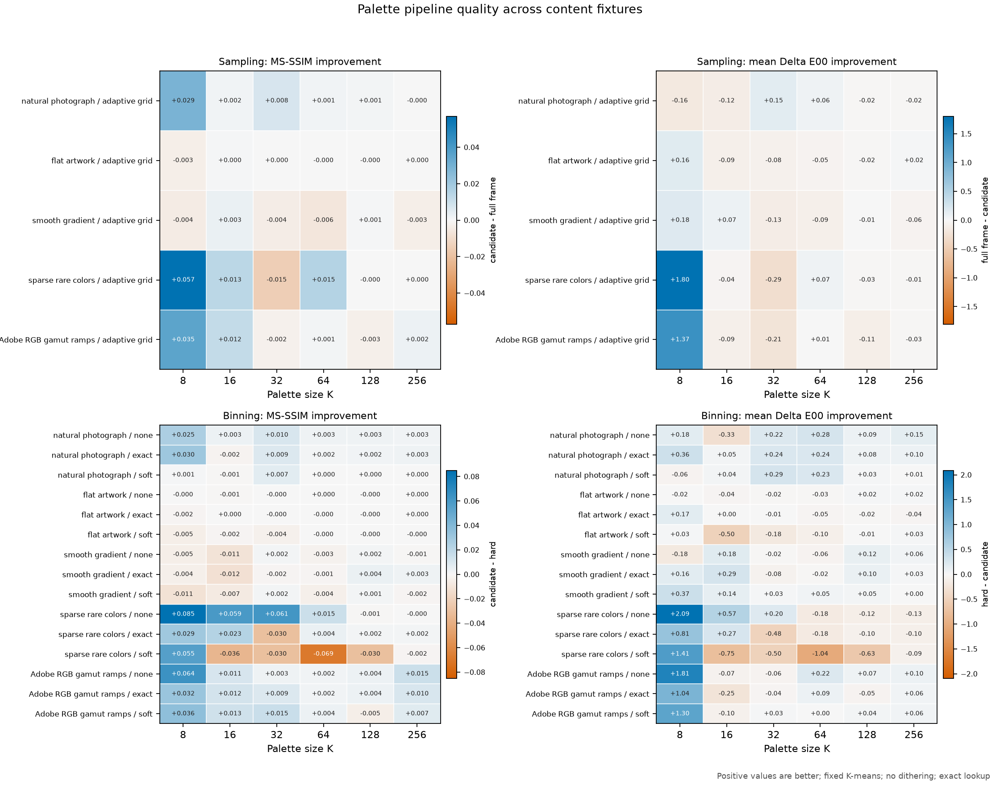
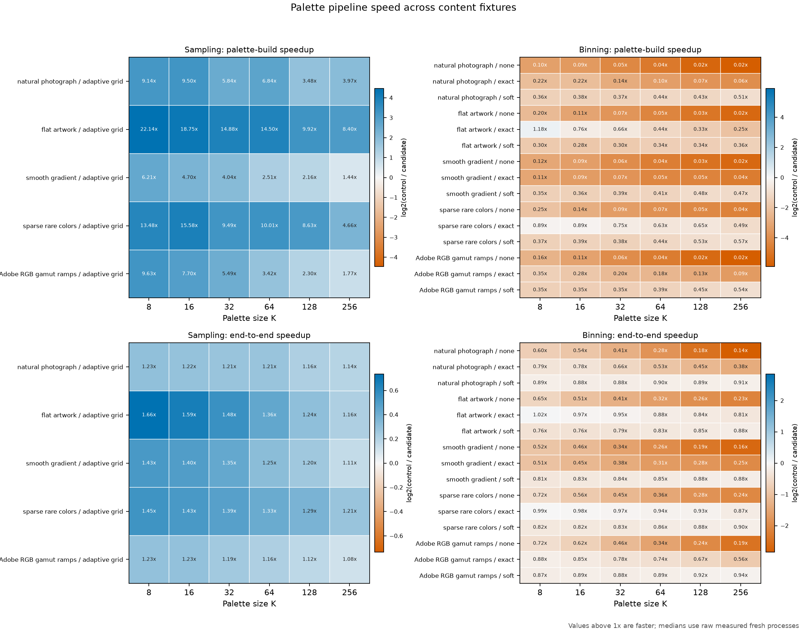
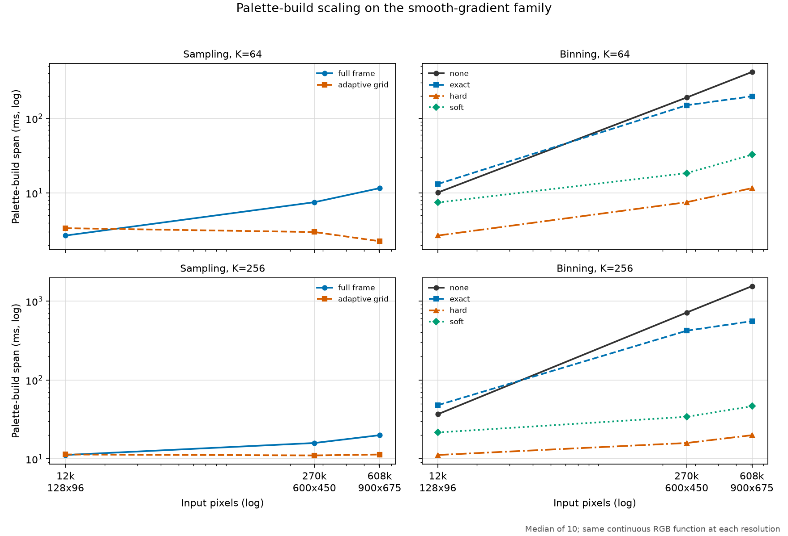
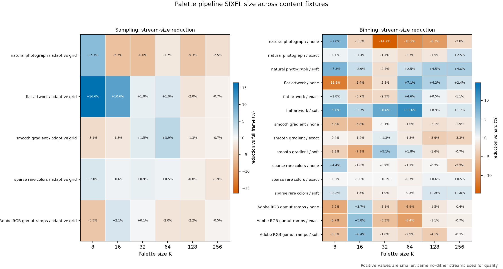
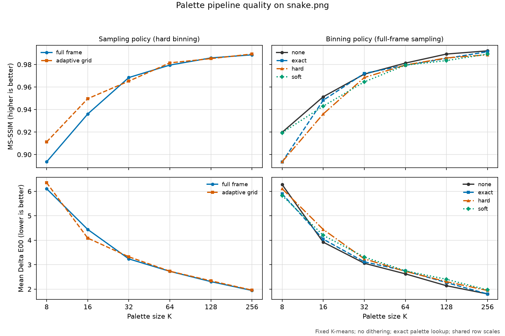
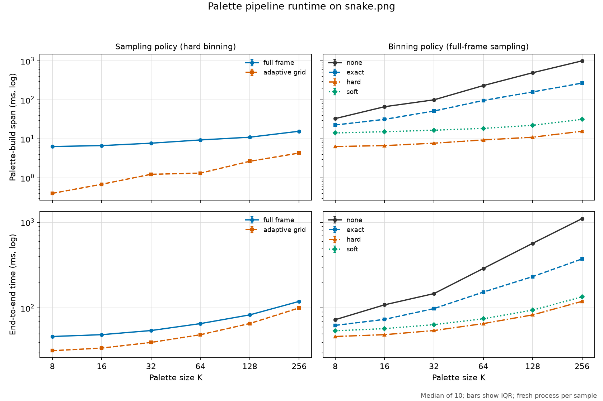
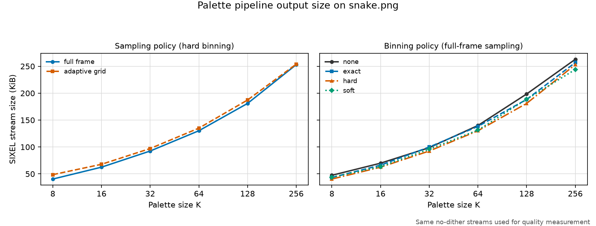

# Palette Construction Pipeline Architecture

## Purpose

Palette construction is a sequence of distinct decisions. Sampling chooses
which source pixels represent the image, binning converts those samples into a
weighted color population, and quantization selects palette entries from that
population. These decisions must remain independently selectable even when the
runtime fuses their implementations.

This document defines the target architecture and the migration invariants for
introducing independent sampling and binning policies. It complements
[Palette Quantization](quantization.md), which explains the mathematical
objectives of the palette solvers.

## Logical pipeline

The fixed-palette branch has the following logical data flow:

```text
loaded frame
    |
    v
sampling
    |
    v
sample point stream
    |
    v
palette-space transform (-X)
    |
    v
binning
    |
    v
weighted point set
    |
    v
quantization (-Q)
    |
    v
palette finalization -> lookup preparation -> palette application
```

The stages have separate responsibilities:

- sampling chooses which spatial observations enter palette construction;
- the palette-space transform defines the coordinates in which colors are
  clustered;
- binning aggregates sample mass in that color space;
- quantization selects at most `K` representatives from the resulting point
  set.

The normal image-processing branch and palette branch join only after the
palette and its lookup preparation are ready. A supplied-palette path may skip
sampling, binning, and quantization completely.

## Sampling policy

Sampling controls extraction from the source image. Its policy includes the
selection method, target population, deterministic seed where applicable, and
small-region preservation. It does not choose histogram precision or a
palette solver.

The policy is expected to grow around a structure such as:

```text
method = auto | full | grid | stratified | random
target = COUNT
solid = on | off
seed = INTEGER
```

The current adaptive grid and solid-region augmentation behavior must be
representable without changing output during migration. Solid-region
augmentation currently repeats selected colors to increase their influence.
The target point-stream contract should express that influence as an explicit
base weight and retain its origin:

```text
sample point:
    color
    base weight
    provenance = grid | solid | reserved
```

An explicit weight prevents a later binning implementation from accidentally
discarding the protection provided to a small solid-colored feature.

The legacy implementation coupled sampling to palette-worker scheduling. A
worker path used an adaptive grid from the loaded frame, while a synchronous
path passed the full preprocessed frame directly to palette construction.
Thread count, clipping, resizing, and colorspace work therefore changed both
the sample population and its source stage. The `sample_target` setting only
affected the adaptive path. Tests preserve these boundaries during migration
because changing them silently would change palette quality, output size, and
performance.

The migration names the two successful paths and temporarily preserves their
selection thresholds:

`--palette-sampling=auto|full-frame|adaptive-grid` exposes this choice as an
independent top-level encoder policy. `SIXEL_PALETTE_SAMPLING` supplies the
same policy through the environment, and an explicit command-line value takes
precedence. `auto` retains the resource-aware selection described below.
`full-frame` consumes the frame after clipping, resizing, and colorspace
preprocessing. `adaptive-grid` consumes the loader output and constructs its
owned sample before preprocessing begins. The latter may run on a palette
worker when capacity is available or synchronously otherwise; scheduling does
not change its source pixels. The legacy `-Q ...:sample_target=COUNT` setting
continues to control the adaptive grid's target population, not which sampling
policy is selected. For an indexed loader frame, adaptive sampling clones the
frame and expands its palette indices to RGB888 before taking the grid. This
keeps the loader frame available to the main pipeline, at the cost of a
temporary full-frame RGB expansion in the current implementation.

| Effective sampling | Input source | Current selection |
| --- | --- | --- |
| `adaptive-grid` | loaded frame | Auto resolution has capacity for the palette worker. |
| `full-frame` | preprocessed frame | Auto resolution does not select asynchronous sampling. |

Both paths now execute through the sample filter vtable and produce the same
typed sample-stream artifact. The adaptive path owns its compact sample frame;
the full-frame path borrows the preprocessed frame. Palette construction
consumes that artifact rather than accepting an ordinary frame edge. This
structural change preserves the pixels and source stage selected by the legacy
scheduler coupling.

The temporary automatic resolver subtracts one unit for each active clip,
resize, and colorspace operation from the resolved thread count. It selects
`adaptive-grid` only when palette work is eligible and more than one unit
remains. A normal resize also introduces the colorspace work needed to resize
in linear RGB, so it currently consumes two units. The resulting boundary
cases are:

| Active work | Heavy-operation count | First thread count using `adaptive-grid` |
| --- | ---: | ---: |
| none | 0 | 2 |
| clip or colorspace conversion | 1 | 3 |
| resize | 2 | 4 |
| clip and resize | 3 | 5 |

Resolution and scheduling are ordered explicitly:

```text
frame work analysis
    -> resolve sampling from resource profile
    -> allocate workers for the effective sampling policy
```

The scheduler may reserve a palette worker only for a resolved
`adaptive-grid` policy. A full-frame or bypassed path reserves none. This keeps
the legacy automatic thresholds for palette-producing images while removing
the scheduler decision as the source of sampling semantics.

`LSXSPL1` records the requested and effective sampling names, input source,
lifecycle phase, resolution reason, thread count, heavy-operation count, and
both thread-budget admission and final palette-job readiness. Fixed, preserved,
and high-color palette paths mark sampling as bypassed.

There is a second legacy coupling on the failure path. The palette worker was
introduced as an opportunistic overlap optimization, so inability to use it
must not by itself stop encoding. A thread-creation failure after sampling can
preserve semantics by building synchronously from the same sample. If no
sample exists, or if the sampled palette builder itself fails, the current
implicit automatic sampling policy retries with the preprocessed full frame.
Sampling remains implicit and automatic even when `-Q` selects an explicit
quantizer. The latter retry is an availability fallback, but it is also an
execution-time sampling-policy change and must be reported as such.

The fallback contract distinguishes worker initialization, sample creation,
thread creation, worker colorspace conversion, and worker palette construction
failures. The `palette_contract` trace records the failed stage, the selected
fallback action, the original status, and the fallback result. A failed
builder's partial dither is never published. A full-frame retry also
re-resolves the authoritative sampling state to `full-frame` from the
`preprocessed-frame`, records `fallback` as the resolution reason, and marks
that policy executed only after synchronous palette construction succeeds.
A thread-creation failure that successfully reuses its completed sample keeps
`adaptive-grid` as the executed policy because its sample population did not
change.

An explicit sampling policy does not silently inherit the automatic policy's
full-frame retry. Cross-policy fallback is permitted only when the resolver
has retained an automatic request origin and records the additional attempt.
An explicit request either uses the same sample or returns the failure unless
a separately specified fallback chain says otherwise. When it returns a
palette-worker failure, it preserves that failure status rather than replacing
it with the resolver's cross-policy rejection status.

## Binning policy

Binning consumes points after their palette-space coordinates are known. It
controls how sample mass is aggregated, independently of the quantizer that
will consume the result.

The top-level `--palette-binning=POLICY` option and its
`SIXEL_PALETTE_BINNING` environment default distinguish:

```text
mode = auto | none | exact | hard | soft
bits = INTEGER
kernel = trilinear
grid-map = POLICY
```

The existing `-Q kmeans:binning=MODE` suboption and
`SIXEL_PALETTE_KMEANS_BINNING` environment remain deprecated aliases while
K-means is the requested quantizer. If an alias and the top-level option are
both explicit, they must name the same policy; conflicting values are rejected
instead of being resolved by option order. The alias does not make a legacy
K-means environment select K-means when the requested quantizer is `auto` or a
different family. Environment values are defaults rather than peer explicit
requests: either CLI/API spelling overrides either environment spelling. If
both environment spellings are present, the canonical top-level environment
wins. Diagnostics retain `environment`, `legacy-environment`, `explicit`, or
`legacy-alias` provenance after precedence is applied.

The modes have these intended meanings:

- `none` preserves the individual sample sequence;
- `exact` combines only identical color coordinates;
- `hard` assigns all of a sample's mass to one finite grid cell;
- `soft` distributes the mass among neighboring cells according to a kernel.

The distinction between `none` and `exact` matters. Combining duplicate points
preserves many weighted objectives, but it may change initialization order,
candidate identity, or medoid selection. It must not be described as a
universally invisible optimization.

Dense and compact-sparse storage are implementation backends, not binning
policies. The planner may choose between them from the finite bin domain,
estimated occupied cells, and memory budget. They should appear in diagnostics
but should not become stable user-facing semantics.

The internal contract represents these axes independently. `none` uses a
direct point sequence; `exact` uses no finite grid and combines only equal
coordinates; `hard` uses a finite grid without a distribution kernel; and
`soft` uses a finite grid plus an explicit kernel. The initial kernel is
trilinear, so one source point can contribute to at most eight grid cells.
`dense` and `compact-sparse` identify storage selected for `hard` or `soft`;
they do not alter the requested binning policy.

The resolved binning state records the source point count and a strict upper
bound on output entries. For a three-dimensional grid with `b` bits per axis,
the bound is:

```text
none or exact: source point count
hard:          min(source point count, 2^(3b))
soft:          min(8 * source point count, 2^(3b))
```

The multiplication saturates before applying the finite-domain bound, so an
untrusted point count cannot wrap the allocation estimate. This upper bound is
not an occupancy prediction and must not by itself force a dense allocation.

## Progressive automatic resolution

Sampling and binning are independent explicit policies, but their `auto`
values are resolved only when the next stage needs a concrete value. The
quantizer declares capabilities and preferences; it does not implement
sampling or binning itself.

```text
frame metadata -> resolve sampling -> sampling
                                      |
                                      v
                 sample metadata -> resolve binning -> binning
                                                        |
                                                        v
                         weighted-point metadata -> quantization
```

An unresolved value remains part of the per-frame plan until its execution
boundary is reached. Resolution follows these rules:

| Sampling | Binning | Resolver action |
| --- | --- | --- |
| `auto` | `auto` | Resolve sampling first, then select the measured hard binning profile when the quantizer supports it. |
| explicit | `auto` | Select hard binning when supported, otherwise choose the quantizer-compatible form. |
| `auto` | explicit | Resolve sampling without replacing the explicit binning policy. |
| explicit | explicit | Validate the combination without replacing it. |

The current capability table describes implemented artifact entry points, not
what an algorithm could support after a future adapter is written:

| Quantizer | Raw samples | Weighted points | Fractional weights | Requires observed representatives | Additional moments |
| --- | --- | --- | --- | --- | --- |
| Heckbert | yes | no | no | no | no |
| K-means | yes | yes | yes | no | no |
| K-medoids | yes | no | no | yes | no |
| K-center | yes | yes | no | no | no |

K-center consumes the shared weighted-point-set artifact. It accepts unit or
integral bin weights, but not fractional weights, because its pruning and
candidate-selection stages retain integer population counts. K-medoids still
builds a private weighted candidate structure and therefore remains `no` until
its public quantizer boundary consumes the shared artifact. K-medoids also
replaces each histogram-bin mean by its nearest observed input color before
solving, whereas K-center solves over histogram-bin means under hard binning.
Only K-medoids therefore declares the observed-color constraint. The `auto`
quantizer name has no capabilities of its own; a resolver must first select a
concrete family.

Stage resolvers are pure functions over explicit input and result structures.
They neither mutate the per-frame lifecycle state nor read process-wide option
overrides. The caller applies a successful selection to the owning state before
execution. A failed selection leaves both the plan and result object unchanged.
The sampling compatibility wrapper now uses this contract before scheduler
allocation. K-means resolves binning at point-set construction after sampling.
The multi-fixture quality and performance measurements below make `hard` the
automatic profile for quantizers that consume weighted points without an
observed-representative constraint. Quantizers without weighted-point support
resolve to `none`, while a quantizer that requires observed representatives
resolves to `exact`. Soft binning remains available only by explicit request.
The deprecated K-means `autoratio` setting remains accepted for compatibility
but no longer changes automatic binning.

An explicit unsupported combination is rejected during resolution. In
particular, soft binning requires a weighted-point consumer that accepts
fractional weights, while hard binning cannot feed a quantizer that requires
representatives to remain observed input colors. The `exact` and `hard`
artifacts are executable by K-means and K-center. Soft is executable only by
K-means. Other quantizers remain unsupported until their palette-builder
boundaries consume the shared weighted-point-set artifact. Resolver failure
never triggers an allocation-time or execution-time algorithm fallback.

Wave 7b exposes the top-level option at the encoder boundary. Palette
construction preflights compatibility without committing the quantizer to the
per-frame lifecycle state. The palette builder resolves the concrete consumer
only when it is ready to construct the palette. Thus
`-Qauto --palette-binning=hard` and
`-Qauto --palette-binning=exact`, `hard`, or `soft` select K-means, while an
incompatible explicit quantizer is rejected. This capability preflight runs
before sampling and scheduler allocation, so a known policy error cannot be
misclassified as a worker failure or enter the full-frame sampling fallback.
K-means `auto` binning remains unresolved until its point-set builder reaches
the binning boundary. The encoder does not duplicate the profile decision from
frame dimensions or scheduler state.

Only a successful palette-builder attempt commits quantizer and binning state
to the encode DAG. Each quantizer-engine retry uses an attempt-local binning
state. The dither call copies that state into the palette instance's build
context and copies the result out after `generate()`; no process-global or
thread-local pointer refers to the encoder's stack frame. Concurrent palette
instances are therefore independent, and re-entry on one active instance is
rejected instead of overwriting another operation's result target.

A failed float32 K-means or K-center engine resets the attempt lifecycle before
invoking its legacy byte engine. Float samples are normalized to RGB888 for
that retry because the legacy engines consume byte samples; passing the float
buffer through unchanged cannot form a valid legacy input. Exact binning is
the exception: normalization could merge distinct float coordinates, so a
failed float engine is returned without entering the RGB888 retry. If the
palette component's historical solver fallback succeeds, the frame records
the solver that actually produced the palette with `fallback` as its reason
and discards the failed attempt's binning state. A fallback is rejected when
its solver cannot consume an explicit `exact`, `hard`, or `soft` artifact; it
cannot silently erase that request. An asynchronous palette worker commits the
effective policy, origin, lifecycle phase, resolution reason, and actual
source-point count only after its successful attempt, before collection
completes.
When automatic adaptive sampling falls back to the full preprocessed frame,
binning keeps its request and origin but resolves its sample-dependent metadata
again against the replacement sample stream.

When `-Qauto` is also requested, the planner retains a quantizer candidate set.
If binning needs a concrete consumer capability, the quantizer family is
resolved at that boundary rather than at the beginning of the frame. Remaining
quantizer subpolicies may stay unresolved until the weighted point set exists.
Candidate selection may use palette size, frame dimensions, colorspace,
quality profile, sample count, and memory budget. It must be deterministic for
the same inputs and settings.

Each quantizer must declare whether it accepts raw samples, weighted points,
fractional weights, observed-color representatives, and additional moments.
An unsupported explicit combination is an error. Only an `auto` input may be
replaced during planning. Each effective choice is fixed before its owning
stage executes and is never reopened within that frame. A solver fallback is
an explicit attempt transition: it must be compatible with the requested
artifact, record the effective solver, and leave the frame state unchanged if
the fallback is rejected.

Soft binning can contribute one sample to as many as eight cells for a
trilinear three-dimensional kernel. Sparse capacity estimates must be bounded
by both the contribution count and the finite grid domain:

```text
maximum occupied entries =
    min(sample count * maximum contributions per sample,
        addressable bin count)
```

The effective plan must be visible in verbose diagnostics and measurement
metadata, including the requested values, resolution phase, resolved policies,
storage backend, estimated allocation, and resolution reason. Request origin
and lifecycle are separate: an `auto` request remains identified as `auto`
after an effective value has been selected.

## Filter and artifact boundaries

Logical stages are filters. Orchestration code creates concrete filters through
the filter factory and executes them through `sixel_filter_run()`. It must not
call a concrete filter's initializer, apply function, or whole-frame execution
helper directly. Concrete execution entry points remain private to the owning
filter implementation.

The current filter I/O contract carries frame slots. The target palette branch
requires typed artifacts so that a point stream or weighted point set is not
disguised as an image frame:

```text
FRAME -> SAMPLE_STREAM -> WEIGHTED_POINT_SET -> PALETTE -> LOOKUP
```

The `SAMPLE_STREAM` representation accepts either a frame payload adapter or a
borrowed flat pixel buffer. It records the effective sampling policy, input
source, point count, pixel format, colorspace, and storage ownership. Frame
streams also retain their dimensions. A borrowed full-frame view never changes
the frame reference count; an owned adaptive sample transfers its frame
reference into the artifact. The flat-buffer form carries no invented image
geometry and allows palette engines to expose an already contiguous sample
population even when its point count cannot be represented as a frame width.
It is borrowed for the duration of one filter execution and cannot be
refreshed as a frame-backed stream.

The byte-layout boundary remains canonical: a buffer consumed by binning is
RGB888 or RGBA8888. K-center adapts packed ARGB8888, BGRA8888, and ABGR8888
inputs to RGBA8888 before binding the stream, preserving alpha values without
premultiplication or compositing. This keeps pixel-layout conversion out of
the binning algorithm while retaining the public dither input contract.

The `WEIGHTED_POINT_SET` contract carries three interleaved coordinates in the
palette colorspace, output weights, the source and output point counts, total
sample mass, the effective binning semantics, the storage backend, and the
entry-capacity bound. An unaggregated `none` result may omit its weight array to
represent unit weights. `exact`, `hard`, and `soft` results must carry explicit
weights; otherwise a downstream quantizer could silently discard aggregation
mass. Borrowed and owned arrays are distinct artifact states, and a failed
ownership transfer leaves the caller's pointer slots unchanged.

K-means exact, hard, and soft binning and K-center none, exact, and hard
binning execute through the `binning` filter vtable. The filter accepts only
the unit-mass form of an unaggregated `none` artifact and publishes an owned
weighted artifact. This restriction avoids accepting weighted input until
re-binning has a specified mass-validation contract. Hard and soft use the
compact sparse histogram retained from the K-means implementation. K-means
keeps native hash-table traversal order so the structural migration does not
perturb deterministic seeding and palette output. K-center requests ascending
packed-bin-key order for hard binning to preserve its historical dense-table
scan order. The residual histogram used by K-means feedback is a quantizer
operation, not a second preprocessing filter, although it reuses the same
compact histogram primitive.

K-center hard binning uses a separate uniform-grid mapping with a half-open
`[0, 256)` byte domain. For `b` bits per axis, a clamped channel value `x` is
assigned by:

```text
bin(x) = floor(x * 2^b / 256)
```

This preserves the former `((unsigned int)x) >> (8 - b)` behavior. The
distinction from the general closed `[0, 255]` uniform mapping is observable
for float palette-space coordinates near a bin boundary even though every
integer byte maps to the same expected legacy cell. Soft binning rejects this
hard-only compatibility grid.

Exact aggregation uses a separate compact hash table because finite grid keys
cannot represent full palette-space coordinates. Equality is numeric equality
across all three finite coordinates; positive and negative zero therefore
name the same point. The table stores the first coordinate tuple unchanged and
sums the weights of later equal tuples. It does not average, round, or map the
coordinates through `bits` or `grid-map`. The initial capacity is bounded from
the source point count with an initial target of at most 64 unique entries. The
table doubles when observed occupancy crosses 70 percent, so an explicit
`exact` request still requires linear auxiliary memory when every input point
is distinct without reserving for the full source count up front. Hash-slot
traversal gives deterministic output for the same input and build, but it does
not preserve insertion order. Automatic binning does not select `exact` for
K-means in this wave; an explicit `exact` request paired with `-Qauto` selects
K-means by capability.

Algorithmic services may be shared below a filter, such as solid-color
detection or lookup construction. Such services must not duplicate the
filter's complete execution contract or provide an alternate orchestration
path.

The repository static suite enforces the current dispatch boundary. Concrete
filter headers may not expose `*_apply()` or `*_frame()` execution helpers,
concrete constructors may only be called by their owning implementation and
the filter factory, and execution calls may only occur inside the owning
filter. This source check is especially important for the amalgamated build,
where translation-unit visibility can allow a private-looking call to compile.

This component-ownership check applies to the library implementation under
`src/`. Programs under `converters/` are public-API consumers rather than
filter-component implementations. A separate private-include check prevents
those programs from depending on `src/*.h`; they are not treated as additional
filter owners.

## Logical separation and physical fusion

Separate filters do not require an intermediate allocation after every stage.
The planner may select one of the following physical forms while preserving the
same logical DAG and diagnostics:

```text
materialized:
    sampling -> sample buffer -> transform -> point buffer -> binning

streamed:
    sampling -> batches -> transform -> binning

fused:
    one execution operator implements sampling + transform + binning
```

Batch streaming is preferable to a virtual call per point. Fusion is an
internal optimization, not a CLI policy. It must be benchmarked because a
materialized contiguous buffer can be better for SIMD or GPU conversion, while
direct histogram updates can avoid allocation and memory traffic.

## Measurement protocol for automatic profiles

Automatic sampling and binning defaults must be selected from controlled
measurements rather than from one complete `-Q` configuration. The initial
experiment keeps K-means, colorspace conversion, palette application, and
post-processing fixed while changing one pipeline axis at a time:

| Comparison axis | Policies | Fixed peer policy |
| --- | --- | --- |
| sampling | `full-frame`, `adaptive-grid` | `hard` binning |
| binning | `none`, `exact`, `hard`, `soft` | `full-frame` sampling |

The controlled command uses one thread, the 8-bit path, full quality, a fully
specified K-means configuration with seed 1 and `sample_target=16384`, OKLab
clustering coordinates, gamma-space palette application, no dithering, exact
palette lookup, no GPU assistance, no final merge, and no cover repair. The
manifest records the complete K-means suboption string. It sweeps
`K = 8, 16, 32, 64, 128, 256`. Quality records both MS-SSIM and mean Delta
E00. Speed records repeated fresh-process end-to-end time and a separate
instrumented top-level palette-build span. Size is the exact byte length of
the same no-dither SIXEL stream assessed for quality.

The runner measures five physical configurations. The full-frame/hard control
is executed and stored once, then projected into both plot facets: as the
full-frame sampling point and as the hard-binning point. Thus each facet stays
self-contained without treating one command as two independent observations.
The CSV files contain only directly measured quality, duration, and byte-count
values; ratios, speedups, medians, and quartiles are derived by consumers when
needed. Each timing row records its domain, phase, round, Williams sequence,
position, raw duration, and exact command template. Warm-ups and boundary
washouts are retained in the CSV so the validator can reconstruct the actual
schedule instead of trusting a claimed run count.

In durable mode, the reproduction wrapper refuses a dirty tracked worktree. It
rebuilds the binaries, records the source revision, input and executable hashes,
build and host information, and verifies that the selected build directory was
configured from the recorded source tree. Timing follows a ten-sequence
Williams design for the five physical configurations. This balances immediate
predecessor and successor effects within each sequence rather than leaving a
fixed pairwise order. One common full-frame/hard washout runs before every
sequence, preventing the last policy of one sequence from becoming the
unbalanced predecessor of the next. Its duration is recorded for audit but
excluded from comparison statistics. Each policy occupies the first
post-washout position equally often in a complete design. The runner records
whether both tools embed the amalgamation or link the library. In amalgamated
mode the executable payload contains libsixel. In library mode the runner reads
`src/libsixel.la` and snapshots the selected `dlname` or `old_library` artifact,
including platform-specific names, rather than globbing possibly stale build
products. It snapshots that linkage, the tracked source state, the input, and
both executable payloads before measurement, and rejects the run if any
snapshot differs afterward. The wrapper then generates every CSV and plot and
validates every row and canonical command against the manifest:

```sh
tools/reproduce_palette_pipeline_measurements.sh
```

Durable measurements always use two warm-ups and ten recorded runs, one full
Williams sequence. A shorter run must be marked exploratory and must name a
separate output directory. The wrapper resolves the path and rejects the durable
artifact directory even if it is supplied explicitly or through an equivalent
relative path:

```sh
PALETTE_PIPELINE_EXPLORATORY=1 \
PALETTE_PIPELINE_WARMUPS=0 \
PALETTE_PIPELINE_RUNS=1 \
tools/reproduce_palette_pipeline_measurements.sh /tmp/palette-pipeline
```

### Multi-fixture confirmation suite

The single-image experiment is followed by a checked-in content and scale
suite. Its fixture manifest is
[`tools/palette_pipeline_suite.json`](../../tools/palette_pipeline_suite.json).
The content facet covers a natural photograph, flat artwork, a smooth
gradient, sparse rare colors, and Adobe RGB gamut ramps. The scale facet uses
the same continuous gradient function sampled at three resolutions, so pixel
count changes without also changing the underlying image function.

| Fixture | Class | Dimensions | Facet |
| --- | --- | ---: | --- |
| `images/snake.png` | natural photograph | 600 x 450 | content |
| `images/vimperator3.png` | flat artwork | 582 x 746 | content |
| `images/measurements/palette-pipeline/smooth-gradient-128x96.png` | smooth gradient | 128 x 96 | scale |
| `images/measurements/palette-pipeline/smooth-gradient-600x450.png` | smooth gradient | 600 x 450 | content, scale |
| `images/measurements/palette-pipeline/smooth-gradient-900x675.png` | smooth gradient | 900 x 675 | scale |
| `images/measurements/palette-pipeline/rare-colors-600x450.png` | sparse rare colors | 600 x 450 | content |
| `images/measurements/palette-pipeline/a98-gamut-600x450.png` | Adobe RGB gamut ramps | 600 x 450 | content |

The synthetic files are generated by
`tools/generate_palette_pipeline_suite_fixtures.py`. The generator writes a
fixed PNG chunk order and canonical stored DEFLATE blocks rather than relying
on a host zlib encoder. Its `--check` mode therefore compares exact bytes, not
only decoded pixels. The Adobe RGB profile is extracted from the tracked
`tests/data/inputs/snake_64_embedded_a98_icc.webp` fixture, avoiding an
unrecorded host profile dependency.

All suite inputs use `libpng:cms_engine=builtin!` in the encoder. Quality
assessment uses `libpng,builtin!`: the reference PNG is handled by libpng with
`SIXEL_LOADER_LIBPNG_CMS_ENGINE=builtin`, while the target stream falls through
to the SIXEL-capable builtin loader. The actual `lsqa` token sequence is stored
as `assessment_command` in every quality row and independently checked. This
is essential for the Adobe RGB fixture: merely embedding an ICC profile does
not make a broad-gamut measurement when loader CMS is disabled. The runner
also removes inherited `LSQA_*` variables before setting its private output
prefix and verbosity, so a developer's interactive assessment configuration
cannot silently alter the durable quality protocol.

Quality and size are evaluated once per fixture and physical configuration.
Timing interleaves fixtures within each `(K, domain, round)` block. Policy order
uses the complete ten-sequence Williams design. Fixture order uses the same
construction over seven fixtures: the first seven measured sequences balance
fixture position, and the ten recorded sequences cover 39 of the 42 directed
adjacent fixture pairs, each once or twice. It is intentionally described as
Williams-derived rather than fully carryover-balanced, whose fourteen-sequence
period would conflict with the ten-run policy design. Both sequence numbers and
positions are retained in the raw timing CSV.

The suite wrapper regenerates or checks every input, builds once, rejects dirty
tracked source or untracked protocol inputs in durable mode, measures all
fixtures, rechecks mutable inputs afterward, renders the aggregate plots, and
validates the result in one command:

```sh
tools/reproduce_palette_pipeline_suite_measurements.sh
```

Durable suite measurements require two warm-ups and ten recorded runs. Use a
separate explicit directory for a shorter exploratory run:

```sh
PALETTE_PIPELINE_SUITE_EXPLORATORY=1 \
PALETTE_PIPELINE_SUITE_WARMUPS=0 \
PALETTE_PIPELINE_SUITE_RUNS=1 \
tools/reproduce_palette_pipeline_suite_measurements.sh \
    /tmp/palette-pipeline-suite
```

The aggregate CSV files remain canonical. The quality and size plots show
within-fixture improvement relative to the fixed peer policy; the content
speed plot shows median control/candidate ratios; and the scale plot shows raw
palette-build medians at `K=64` and `K=256`. A default change still requires a
clean durable suite result and a separate resolver decision; an exploratory
run is not evidence for changing `auto`.

### Multi-fixture measured result

The first durable suite run was recorded from revision `60cf33515` on arm64
macOS with the amalgamated command-line tools. It contains 210 quality rows,
210 size rows, and 6,048 raw timing rows after two warm-ups and ten recorded
runs. The source tree was clean at the start, and the fixture, executable,
linkage, and source snapshots still matched after measurement.



Adaptive-grid sampling changes quality in a content-dependent way, especially
at small palettes. Its MS-SSIM difference from full-frame sampling ranges from
-0.014705 to +0.057015 over the content suite, with both extrema occurring on
the sparse-rare-color fixture below `K=64`. At `K >= 64`, that range narrows to
-0.006149 through +0.015178. The result supports resolving sampling from image
scale and requested palette construction rather than treating the faster path
as an output-equivalent optimization.

Binning has the same semantic warning. Relative to hard binning, none improves
MS-SSIM by as much as 0.084973 at `K=8`, while soft loses 0.069334 at `K=64`,
both on the sparse-rare-color fixture. Mean Delta E00 moves in the same
direction for those cells by 2.089190 and -1.039323 respectively. The
broad-gamut and rare-color fixtures expose differences that the natural and
flat-artwork fixtures largely hide.



Adaptive-grid sampling is 1.44x to 22.14x faster in the palette-build span and
1.08x to 1.66x faster end to end over the content facet. The scale facet shows
why this should remain conditional: on the 12,288-pixel gradient it provides
no useful gain at `K=256`, while at 270,000 and 607,500 pixels its palette-build
median stays near 11 ms and full-frame hard grows from 15.89 ms to 19.96 ms.



Hard is the fastest full-frame binning policy in all but one content cell. The
exception is flat artwork at `K=8`, where exact is only 1.18x faster in the
palette span and 1.02x end to end. The large `K=256` gradient makes the scaling
difference concrete: hard takes 19.96 ms, soft 46.48 ms, exact 557.10 ms, and
none 1,547.47 ms. These results define hard as the automatic binning baseline;
the slower policies remain explicit quality choices rather than sensible
general defaults.



Stream size has no global winner. Relative reductions range from -14.7% to
+11.6% across the binning comparisons and change sign with content and `K`.
The resolver therefore must not infer a size advantage from palette-build
speed alone.

The canonical values and full provenance are retained in
[`palette-pipeline-suite-quality.csv`](palette-pipeline/suite-measurements/palette-pipeline-suite-quality.csv),
[`palette-pipeline-suite-size.csv`](palette-pipeline/suite-measurements/palette-pipeline-suite-size.csv),
[`palette-pipeline-suite-speed.csv`](palette-pipeline/suite-measurements/palette-pipeline-suite-speed.csv),
and
[`palette-pipeline-suite-run.json`](palette-pipeline/suite-measurements/palette-pipeline-suite-run.json).
This evidence is sufficient to constrain a separate `auto` resolver change;
it does not itself change the current defaults.

### Initial measured baseline

The first durable run was recorded from revision `1259bb880` on arm64 macOS
with the amalgamated command-line tools. These plots are views of the checked-in
CSV data, not separately entered summaries.



The sampling comparison is deliberately mixed at low `K`. At `K=8`,
`adaptive-grid` raises MS-SSIM from 0.893526 to 0.911202 while mean Delta E00
increases from 6.106531 to 6.352006. At `K=16`, it improves both metrics, but
the two policies alternate by small amounts at larger palette sizes. A single
quality scalar would therefore hide a real trade-off in the selected palette.

With full-frame sampling, `none` has the highest MS-SSIM at five of the six
palette sizes and the lowest mean Delta E00 from `K=16` through `K=256`.
`exact` has the highest MS-SSIM at `K=32`, while `soft` has the lowest mean
Delta E00 at `K=8`. The `K=256` mean Delta E00 values for `none` and `exact`
are nearly identical, 1.803799 and 1.804042 respectively. `hard` generally
gives up some measured quality, but its performance result explains why it is
an important automatic-policy candidate.



`adaptive-grid` reduces the median palette-build span from 5.714 ms to
0.379 ms at `K=8`, and from 16.062 ms to 4.565 ms at `K=256`. The corresponding
end-to-end medians fall from 44.188 ms to 31.408 ms and from 146.056 ms to
126.040 ms. Sampling is not the only end-to-end cost, so its large palette-span
speedup becomes a smaller, but still measurable, process-level speedup.

For full-frame binning, `hard` is the fastest policy at every measured `K`.
At `K=256`, median palette-build times are 16.062 ms for `hard`, 36.017 ms for
`soft`, 323.204 ms for `exact`, and 1262.131 ms for `none`. End-to-end medians
are 146.056 ms, 164.720 ms, 452.875 ms, and 1389.988 ms respectively. This is
a mechanism measurement on one image, but the widening high-`K` separation is
large enough that automatic resolution must account for palette-build cost.



The faster policies also change the stream rather than merely accelerating the
same answer. `adaptive-grid` produces 49,790 bytes at `K=8`, versus 41,407 bytes
for full-frame sampling, but the gap narrows to 260,131 versus 259,171 bytes at
`K=256`. In the binning comparison, `hard` gives the smallest stream through
`K=128`; `soft` is smallest at `K=256`, at 249,905 bytes. These are no-dither
streams, so the size differences come from palette selection and application,
not from an error-diffusion pattern.

The raw values and provenance are retained in
[`palette-pipeline-quality.csv`](palette-pipeline/measurements/palette-pipeline-quality.csv),
[`palette-pipeline-size.csv`](palette-pipeline/measurements/palette-pipeline-size.csv),
[`palette-pipeline-speed.csv`](palette-pipeline/measurements/palette-pipeline-speed.csv),
and
[`palette-pipeline-run.json`](palette-pipeline/measurements/palette-pipeline-run.json).
The timing CSV contains every warm-up, measured run, and boundary washout; plot
medians and interquartile ranges are derived from its raw measured rows.

This baseline did not justify a default on its own. The multi-fixture suite
above now checks its low-`K` metric disagreement and expensive full-frame
policies across broader content classes, while retaining this first run as the
mechanism-level audit trail.

## Migration waves

The migration is intentionally divided so structural changes, CLI changes, and
default changes can be reviewed independently.

1. Enforce filter dispatch boundaries. Route existing sampling and final-merge
   execution through the factory and vtable, make whole-filter helpers private,
   and add a static boundary check.
2. Add requested, effective, reason, and lifecycle state to the existing
   per-frame encode DAG context. Remove unused policy copies from the palette
   worker job without changing output.
3a0. Restore the palette worker's availability contract and make it explicit.
     Reuse an already constructed sample after thread-creation failure, use the
     legacy full-frame retry only for the current implicit automatic policy,
     trace every fallback decision, and cover each failure stage through the
     real encode DAG.
3a. Characterize the existing successful-path split without rerouting it. Represent
    `full-frame` and `adaptive-grid` as internal effective policies, record
    whether their input is the loaded or preprocessed frame, and test the
    current thread-budget and heavy-operation cases.
3b. Introduce a typed sample-stream artifact that can describe either a
    borrowed full-frame view or an owned compact sample. Retain the frame
    payload adapter and record minimal sample metadata.
3c. Route both effective policies through the sample filter vtable and make
    palette builders consume the sample-stream contract. Keep the existing
    source stage and pixels for each path.
3d. Move policy resolution ahead of scheduling. The scheduler consumes the
    resolved sampling choice instead of choosing sampling as a side effect;
    the temporary `auto` resolver reproduces the legacy split until measured
    defaults are selected.
4. Define orthogonal binning semantics and the weighted-point-set artifact
   contract before moving an implementation.
5. Extract current K-means hard and soft histogram construction into an
   independent binning filter. Pass migrated binning settings explicitly while
   preserving current point order and output.
6. Declare quantizer capabilities and introduce stage-specific pure resolvers.
   Resolve sampling before sampling and binning from actual sample metadata,
   without silent execution-time fallback.
7a. Add the top-level sampling policy option while preserving automatic
    selection. Keep sampling independent of thread count after resolution.
7b. Add the top-level binning policy option. Keep existing `-Q` suboptions as
    deprecated aliases and reject conflicting explicit values.
8a. Implement exact aggregation in the shared binning filter and connect the
    first weighted-point consumer, K-means.
8b. Move other quantizer-specific histogram construction to the shared binning
    stage only where semantics match. Preserve observed-color and candidate
    selection contracts rather than treating every histogram as equivalent.
    K-center is migrated with its integer-weight and historical grid-order
    contracts; K-medoids remains private because the shared artifact does not
    yet carry packed bin keys, second moments, or the input-order information
    required to choose an observed representative deterministically.
9. Measure the sampling, binning, and quantization axes independently. Use the
   results to select automatic profiles and only then change defaults.
10. Add chunk streaming, operator fusion, or storage optimizations where
    measurement shows a benefit, while keeping logical filters, resolution
    records, and trace spans observable.

Each wave must leave the normal and amalgamated builds consistent. Tests must
cover direct policy parsing, effective-plan resolution, unsupported
combinations, compatibility aliases, output quality, allocation bounds, and
the filter boundary itself.
