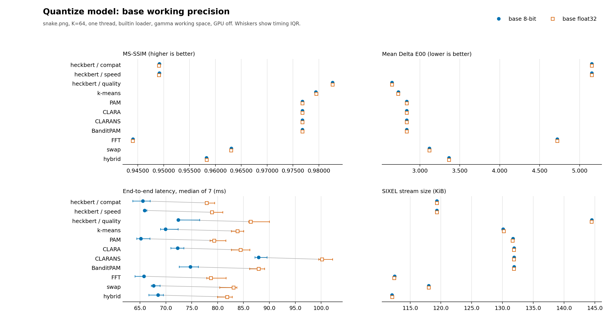
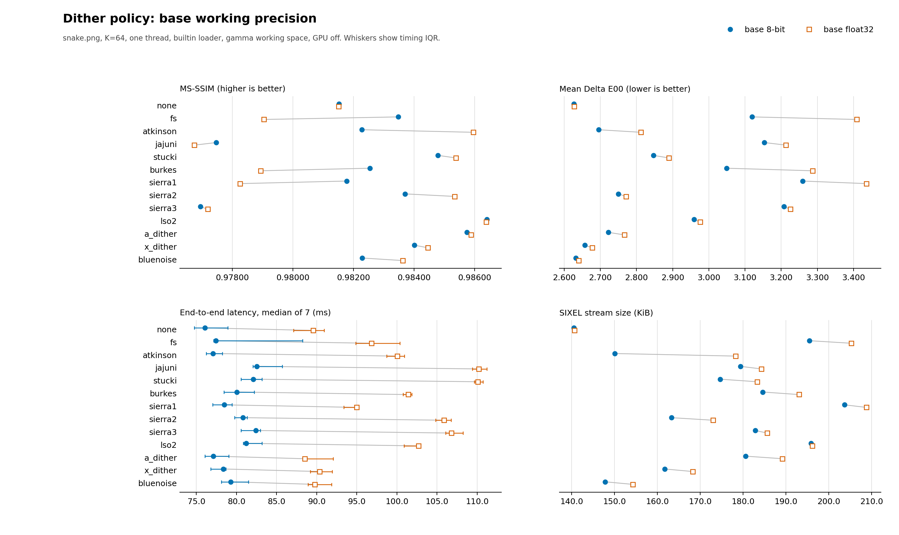
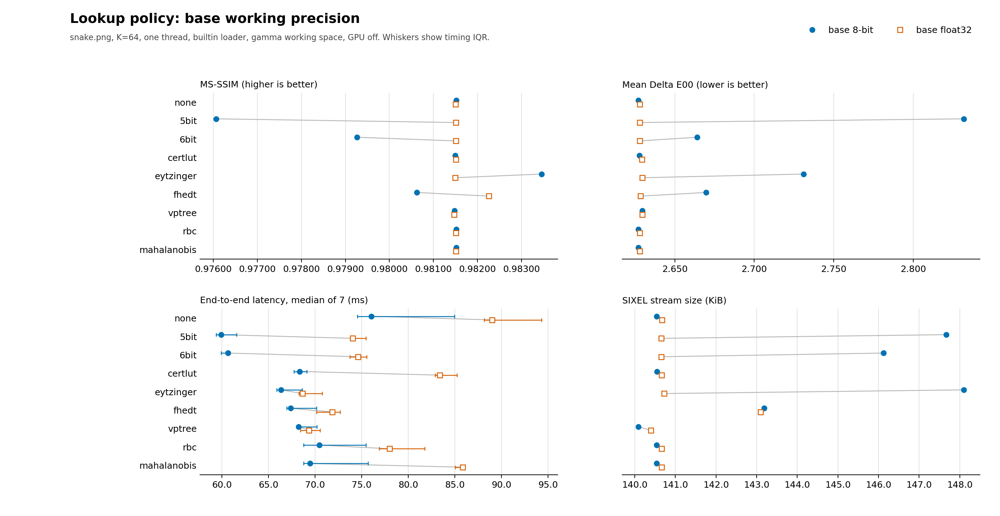
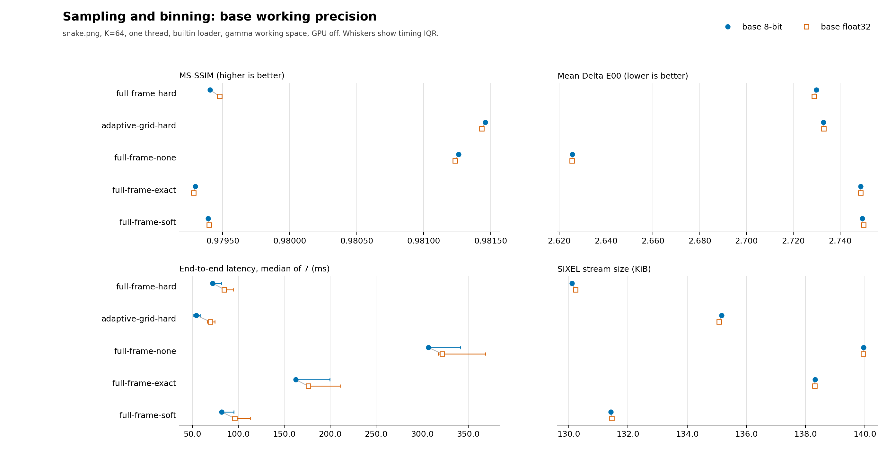
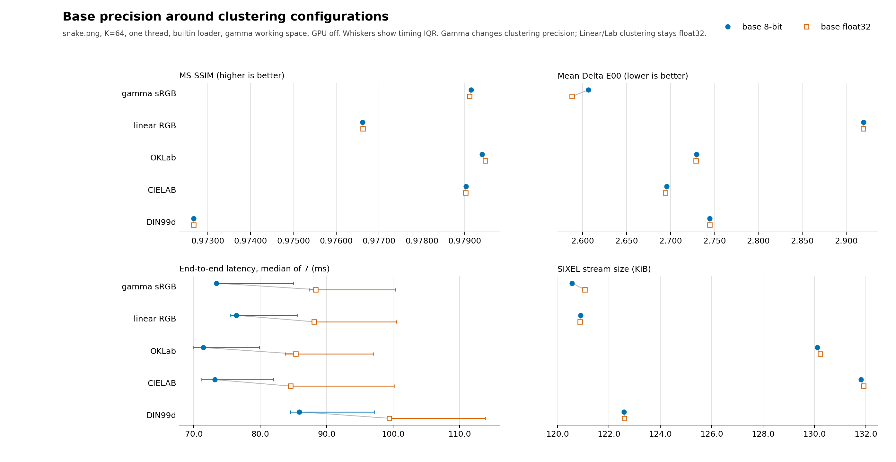

# Encoder Working Precision

## Scope

`img2sixel --precision=8bit|float32` selects the base representation used by
the shared encoder pipeline. This is not only a loader or resize setting. The
chosen representation can change the samples presented to palette
construction, arithmetic inside palette application, lookup-policy backends,
dither error state, selected palette indices, and the resulting SIXEL stream.
It also changes memory traffic and the amount of work available to threaded or
GPU execution paths.

The underlying `RGB888` and typed float32 storage contracts, implicit promotion by resize and CMS, and an isolated linear-light resize quality measurement are documented in [Pixel-format precision](../concepts/pixelformat-precision.md).

Precision is therefore a cross-cutting measurement axis. Results for
[palette quantization](quantization.md), [dithering](dithering.md),
[lookup policy](lookup-policy.md),
[sampling and binning](palette-pipeline.md), and
[clustering color space](clustering-colorspace.md) must state both the requested
precision and the effective working format.

## Requested precision and effective format

With `-Wgamma`, the two explicit base modes have distinct planner contracts:

| CLI request | Effective shared working format | Main sample representation |
| --- | --- | --- |
| `--precision=8bit` | `rgb888` | three unsigned 8-bit gamma-sRGB channels |
| `--precision=float32` | `rgb-f32` | three float32 gamma-sRGB channels |

A non-gamma working color space such as `-Wlinear` or `-Woklab` requires floating-point samples. It promotes the effective shared path to the matching typed format, such as `linear-f32` or `oklab-f32`, even when the base request is `--precision=8bit`. Such a command is useful, but it is not an 8-bit-versus-float32 experiment.

`-X` has a different role. It selects the coordinates used to construct the
palette. Gamma RGB can be clustered in either 8-bit or float32 coordinates, so
the `-Xgamma` pair includes a real clustering-precision comparison. Linear RGB
and the Lab-family clustering spaces are float32-only; there is no 8-bit
Linear RGB, OKLab, CIELAB, or DIN99d clustering mode to compare. Those
selections create a float32 palette-building view without necessarily
promoting an otherwise gamma `rgb888` main path. Their matched `--precision`
pairs compare the shared pipeline before and after the same float32 clustering
stage, not two numeric representations of that stage.

Use verbose planner output to audit the effective path. A controlled 8-bit
run must contain:

```text
formats: source=rgb888 work=rgb888 scale_out=rgb888
```

The corresponding float32 run must report `work=rgb-f32`. Measurement scripts
must validate this field rather than infer the path from the command line.

## Resize precision and memory

Normal filtered resizing converts integer gamma RGB input to linear RGB
float32, resamples in linear light, and converts to the requested working
representation afterward. This avoids the dark interpolation produced by
averaging gamma-encoded channel values. The planner must not silently replace
that path with an integer resize when a float32 allocation is large or fails.
If the conversion or resampler cannot allocate its required buffer, encoding
stops with `SIXEL_BAD_ALLOCATION`.

On a memory-constrained system, the user can explicitly select the smaller
integer path:

```sh
img2sixel -j auto:resize_precision=preserve -w50% input.png
```

`preserve` keeps integer input in an RGB888 resize path and delays any required
float32 working-colorspace conversion until after scaling. It can substantially
reduce peak memory for downscaling, but interpolation then operates on
gamma-encoded 8-bit values and can reduce resampling accuracy. `linear` uses a
temporary linear RGB float32 resize workspace, while `float` also retains the
requested float32 working representation after resizing. The allocation error
message names the `preserve` command as an explicit recovery option and states
this accuracy trade-off.

## Where precision can affect the pipeline

The same precision request reaches several independently interesting stages:

1. Loading and normalization decide whether decoded integer samples can remain
   byte-valued or need conversion to float.
2. Sampling and binning observe the normalized colors. Rounding can change bin
   occupancy, accumulated weights, and representative coordinates.
3. The quantizer operates on that point set. A different point population can
   change initial centers, assignments, convergence, and the final palette.
4. Palette conversion produces the representation used for palette
   application.
5. Lookup policies use precision-specific indexes, table coordinates, distance
   calculations, or caches. Their quality and cost can change independently.
6. Dither policies calculate and propagate representation error. Integer
   rounding changes both the current decision and later error state.
7. SIXEL encoding consumes the selected indices. Even a small index change can
   alter plane occupancy, runs, and stream size.

Consequently, an isolated observation such as "float32 made K-means slower"
is incomplete unless the experiment shows whether the palette, lookup, dither,
and output stream also changed.

## Cross-cutting measurement

The checked-in comparison uses one controlled cross-section to reveal where
precision sensitivity exists. It evaluates 43 configurations:

- eleven explicit quantize-model configurations;
- thirteen static-image dither policies;
- nine lookup policies;
- five sampling/binning configurations; and
- gamma clustering in both precisions, plus four float32-only clustering-space
  selections whose pairs measure the surrounding base pipeline precision.

Each configuration is measured once with a true `rgb888` path and once with a
true `rgb-f32` path. The figures keep four user-visible outcomes together:
MS-SSIM, mean Delta E00, end-to-end latency, and exact SIXEL byte size.

The controlled fixture is the 600-by-450 RGB [`images/snake.png`](../../images/snake.png) at `K=64`. Commands use the builtin loader with loader CMS disabled (`SIXEL_LOADER_CMS_ENGINE=none`), one thread, full quality, gamma working coordinates, and no GPU assistance. Each domain reuses the command builder owned by its detailed measurement document, then changes only `--precision` within a matched pair. Thus a pair is a valid precision comparison, while absolute values from two different domains need not share every other policy.

The plots use paired markers rather than bars from zero. This makes small
precision changes visible without implying that a narrow quality-axis range is
an absolute magnitude comparison. Blue filled circles represent 8-bit;
orange open squares represent float32, so the distinction also survives
grayscale reproduction. Timing whiskers show the interquartile range.

## Measured results

The checked-in run was recorded on 2026-09-12 UTC from clean revision `85a2674e5` on macOS arm64, including the corrected DIN99d transform and common coordinate scale. The table summarizes float32 relative to the matching 8-bit row. Counts report the direction of the metric, not its statistical or practical significance.

| Domain | Configurations | Median float32 / 8-bit time | Float32 has higher MS-SSIM | Float32 has lower mean Delta E00 | Stream-size range |
| --- | ---: | ---: | ---: | ---: | ---: |
| quantize model | 11 | 1.20x | 2 / 11 | 3 / 11 | -0.07% to +0.09% |
| dither policy | 13 | 1.26x | 7 / 13 | 0 / 13 | +0.09% to +18.80% |
| lookup policy | 9 | 1.17x | 4 / 9 | 5 / 9 | -4.98% to +0.22% |
| sampling and binning | 5 | 1.18x | 2 / 5 | 3 / 5 | -0.06% to +0.09% |
| clustering configuration | 5 | 1.16x | 2 / 5 | 5 / 5 | -0.02% to +0.41% |

The quantizer rows change MS-SSIM by at most `0.000080`, mean Delta E00 by at most `0.0009`, and size by at most `0.09%` on this fixture. Their float32 time ratios range from 1.14x to 1.23x. The controlled solvers are relatively insensitive to base precision here, while conversion and float palette application still have a measurable cost. Sampling/binning configurations also show small output changes, with time ratios from 1.05x to 1.28x.

Dithering changes the tradeoff. Float32 increases mean Delta E00 for 13 of 13 methods, while MS-SSIM improves for 7. Delta E00 averages pointwise perceptual color error, whereas MS-SSIM rewards spatial structure created by redistributed error. All measured dither rows increase stream size; precision is part of their observable behavior.

The lookup comparison shows larger output changes for address-quantized or approximate policies such as `5bit`, `eytzinger`, and `fhedt`. Exact `none`, `certlut`, and the tree-like policies change much less on this input. Runtime is measured end to end; small differences should be read alongside the interquartile ranges rather than treated as portable speed rankings.

Across the five clustering configurations, float32 lowers mean Delta E00 in 5 pairs, while MS-SSIM moves in both directions and size stays within 0.41%. Only the gamma pair changes clustering-coordinate precision. Linear RGB, OKLab, CIELAB, and [DIN99d](../concepts/din99d.md) clustering calculations remain float32 in both rows; their differences come from samples entering that stage and palette application afterward. Those four rows are not 8-bit-versus-float32 comparisons of the named spaces.

Selected output movements are shown below. Positive deltas mean that float32 reports a larger value or produces a larger stream.

| Domain and configuration | Time ratio | MS-SSIM delta | Mean Delta E00 delta | Size delta |
| --- | ---: | ---: | ---: | ---: |
| dither `fs` | 1.25x | -0.004429 | +0.2892 | +4.98% |
| dither `atkinson` | 1.30x | +0.003680 | +0.1170 | +18.80% |
| lookup `5bit` | 1.24x | +0.005444 | -0.2039 | -4.75% |
| lookup `eytzinger` | 1.03x | -0.001964 | -0.1016 | -4.98% |
| lookup `fhedt` | 1.07x | +0.001638 | -0.0413 | -0.06% |

### Quantize models



### Dither policies



### Lookup policies



### Sampling and binning



### Precision around clustering configurations



## Reproduction and validation

Commit the implementation being measured, build the assessment tools, install
Python Matplotlib, and run from a tracked-clean worktree:

```sh
PYTHON=.venv/bin/python tools/reproduce_precision_measurements.sh
```

The runner rebuilds `img2sixel` and `lsqa`, removes inherited `SIXEL_*`
variables, measures both precisions in alternating adjacent order, rotates and
reverses configuration order between rounds, generates all figures and the
combined CSV, and validates the result. The default timing budget is two
warm-ups followed by seven measured rounds. `PRECISION_WARMUPS` and
`PRECISION_RUNS` may shorten an exploratory run, but such data is a different
protocol and must not silently replace the checked-in baseline.

Before measuring a row, the script enables stable planner and palette
diagnostics. It rejects the run unless 8-bit reports `rgb888`, float32 reports
`rgb-f32`, and palette construction reports `quantizer_retries=0`. These checks
prevent a command label, implicit working-space promotion, or solver fallback
from misidentifying the implementation that was measured.

The complete per-row data, exact command templates, effective work formats,
quality deltas, size and timing ratios, and timing quartiles are in
[`precision-comparison.csv`](precision/measurements/precision-comparison.csv).
Source revision, input and executable hashes, build configuration, host, and
the configuration manifest are in
[`precision-run.json`](precision/measurements/precision-run.json). Validate a
regenerated directory directly with:

```sh
python3 tools/check_precision_measurements.py \
  docs/functionality/precision/measurements
```

## Interpretation limits

This comparison deliberately fixes one image, one palette size, one thread,
one working color space, and CPU execution. It answers whether precision can
materially affect a policy and shows the direction on this fixture. It does not
replace each topic's palette-size sweep, multi-fixture study, dither spectrum,
thread-scaling experiment, or GPU comparison.

In particular, do not generalize a small `K=64` difference to all palettes.
Integer quantization boundaries, lookup grids, dither feedback, and SIXEL run
structure can create non-monotonic results as `K` changes. If a precision
difference influences a default or an optimization, repeat the owning topic's
full protocol at both precisions and retain the effective-format preflight.

Rerun the cross-cutting suite after changes to loading, normalization,
colorspace conversion, sampling, binning, quantization, palette conversion,
lookup, dithering, SIXEL encoding, decoding used by `lsqa`, or the measurement
tools themselves.

## Implementation and tests

Precision option state and effective-format resolution are owned by
[`encoder.c`](../../src/encoder.c) and [`encoder.h`](../../src/encoder.h).
The planner exposes the resolved source, work, and scale-output formats through
its verbose DAG diagnostic. Focused option-order and promotion tests are under
[`tests/cli/options/matching/`](../../tests/cli/options/matching/).

The measurement driver is
[`tools/plot_precision_measurements.py`](../../tools/plot_precision_measurements.py),
the one-command wrapper is
[`tools/reproduce_precision_measurements.sh`](../../tools/reproduce_precision_measurements.sh),
and the artifact contract is enforced by
[`tools/check_precision_measurements.py`](../../tools/check_precision_measurements.py).
