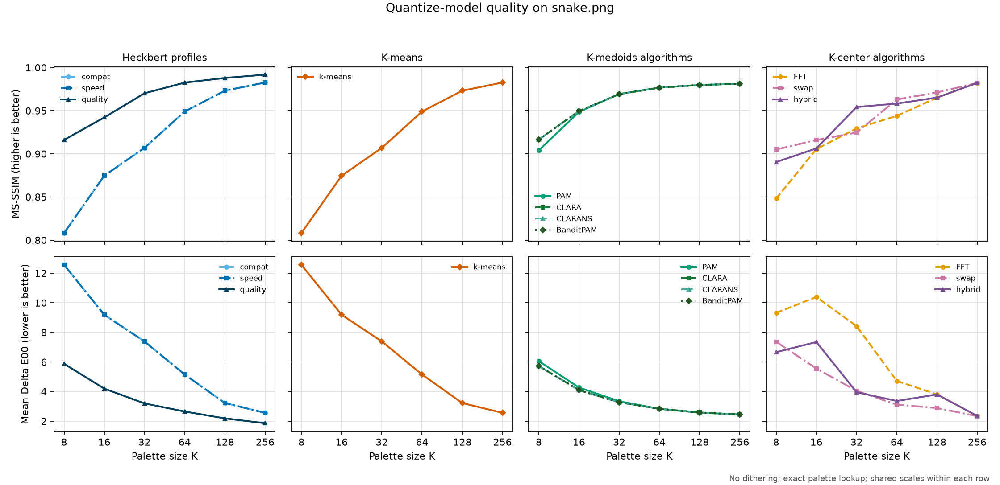
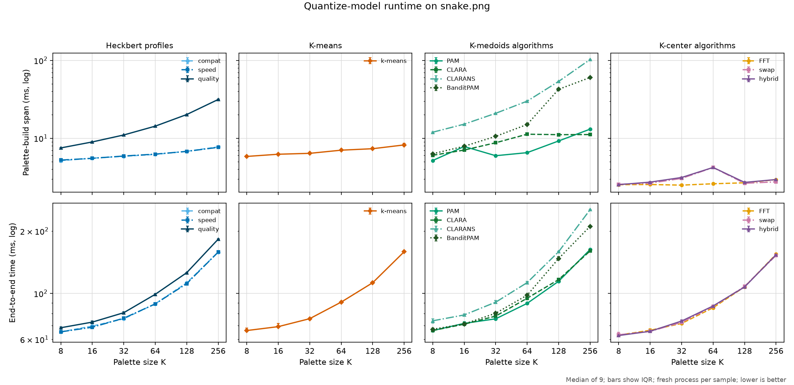
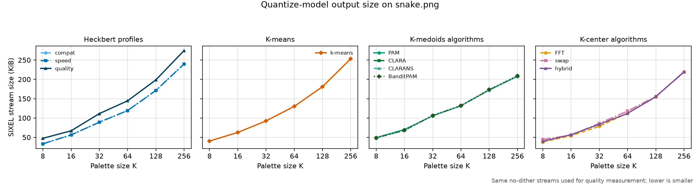

# Palette Quantization

## Purpose

Palette quantization constructs a small set of colors that represents a much
larger input color population. In the encoding pipeline it runs after loading
and normalization and before palette application:

```text
normalized pixels -> quantization -> palette entries
```

It answers **which colors are available to the encoder**. It does not assign a
palette index to every pixel; dithering and lookup perform that later step.

## CLI surface

`img2sixel` selects the palette solver with:

```text
-Q MODEL
--quantize-model=MODEL
```

`MODEL` may include model-specific suboptions. Use `img2sixel -H` or the
[`img2sixel(1)` manual](../../converters/img2sixel.1) for the current accepted
suboptions. `-p COLORS` sets the requested palette size and normally defaults
to 256 colors.

All models accept `sample_target=COUNT`. The independent
`--sampling-policy=POLICY` option chooses how source pixels are sampled, while
`COUNT` bounds the adaptive sample population. In the notation below, `N` is
the number of pixels after that sampling step and `S` is the number of weighted
samples or occupied histogram bins retained by preprocessing.

`--binning-policy=POLICY` independently chooses how sampled colors become the
weighted point set consumed by the solver. The two policies and their staged
resolution are described in the
[Palette Construction Pipeline Architecture](palette-pipeline.md). Quantizer
suboptions may parameterize a supported binning implementation, but they do
not select the binning policy.

Let `x[i]` be a retained color sample with non-negative weight `w[i]`, and let
`C` contain at most `K` palette colors. Colors are three-dimensional in the
space selected with `-X`. The norm below is Euclidean in that space. Changing
the colorspace, channel normalization, histogram precision, or candidate
collector changes the geometry or data set before optimization begins.

The five base models are described separately below. Their objectives are not
interchangeable: a model that minimizes average squared error need not best
preserve an isolated color, while a model that protects the worst represented
color may spend palette capacity where it changes the image-wide average very
little.

## `auto`: compatibility selection

```text
-Q auto
```

Despite its name, `auto` is not currently an image-dependent solver selector.
It dispatches to the historical Heckbert median-cut path. It therefore exists
as a stable default and compatibility spelling, not as a promise that
libsixel will compare all quantizers and choose the fastest or highest-quality
one for each image.

Only the common `sample_target` suboption belongs to `auto`. A Heckbert preset
must be requested explicitly, for example:

```text
-Q heckbert:profile=quality
```

If a newer explicitly selected solver cannot complete, the palette dispatcher
also falls back to Heckbert. Callers that need to distinguish a requested
model from a fallback should record palette-build telemetry rather than infer
the solver only from the command line.

The time and space order of `auto` are consequently those of the
[`heckbert`](#heckbert-recursive-median-cut) chapter below. The important
semantic distinction is that `auto` reserves future selection policy while
`heckbert` names the algorithm directly.

## `heckbert`: recursive median cut

```text
-Q heckbert[:profile=compat|speed|quality]
```

Heckbert quantization is a top-down partitioning heuristic. The implementation
first accumulates a finite color histogram. One box initially covers all
occupied cells. Until enough leaves exist, it chooses a box, chooses a split
direction, and divides the box near its weighted median:

```text
occupied histogram cells
          |
          v
       one box
          |
   split at weighted median
       /          \
  left box     right box
       \          /
        repeat to K leaves
               |
               v
    one representative per leaf
```

The traditional split direction is a channel with a large range. libsixel can
also choose a luminance-oriented direction or estimate a principal component
from the weighted covariance matrix. The representative of a leaf may be its
geometric center, weighted average, or histogram-derived value. These choices
control the partition and representative; they do not turn median cut into an
optimizer for the K-means or K-center objectives.

The `compat`, `speed`, and `quality` profiles are bundles of solver defaults.
`compat` preserves the established median-cut behavior. `speed` favors less
expensive splitting and final processing. `quality` uses PCA-oriented
splitting and may create more than `K` intermediate leaves before Ward merging
them. Explicit split, representative, and final-merge options override the
corresponding profile defaults.

If splits remain reasonably balanced, each occupied histogram cell
participates in approximately `log K` partition levels, giving usual
`O(S log K)` splitting work. Repeatedly peeling off a very small box can reach
`O(S K)`. Histogram clearing and ingestion add `Theta(N + B)`, where `B` is the
number of addressable histogram cells. PCA selection is normally linear per
box, but a fallback may sort, so the balanced bound is not a hard bound for
every path.

Median cut is deterministic for fixed inputs and settings, but it has no
general guarantee of minimizing squared error or maximum radius. Its appeal is
bounded work, balanced coverage of occupied regions, and compatibility with
the quantizer descended from Netpbm. The original algorithm and design tradeoff
are described by Heckbert in
[Color Image Quantization for Frame Buffer Display](https://publications.ri.cmu.edu/color-image-quantization-for-frame-buffer-display).

## `kmeans`: centroid optimization

```text
-Q kmeans[:key=value...]
```

K-means minimizes weighted within-cluster squared error:

```text
SSE(C) = sum_i w[i] * min_c-in-C ||x[i] - c||^2
```

Lloyd iteration alternates between two steps:

1. assign each sample to its nearest centroid;
2. replace each centroid by the weighted mean of its assigned samples.

For a fixed data set and exact assignments, each step cannot increase `SSE`.
Iteration nevertheless reaches only a local optimum; finding the globally
best K-means partition is not what the implementation promises. Initialization
and independent restarts therefore matter even when all other options are
fixed. Lloyd's original formulation is documented in
[Least Squares Quantization in PCM](https://doi.org/10.1109/TIT.1982.1056489).

The current `inittype=auto` resolves to `none`, meaning that it does not use the
PCA-specific seed path. The resulting legacy initializer is still structured:
it selects the first sample by weight and later samples in proportion to their
weighted squared distance from the nearest chosen center. This is the idea
usually called D-squared or k-means++ seeding, introduced in
[k-means++: The Advantages of Careful Seeding](https://theory.stanford.edu/~sergei/papers/kMeansPP-soda.pdf).
`inittype=pca` projects samples onto the dominant weighted covariance axis,
sorts them, and initializes centers from equal-weight intervals on that axis;
it falls back to the legacy initializer if PCA seeding cannot complete.

`--binning-policy=hard` replaces colors by individual histogram cells, while
`--binning-policy=soft` distributes a color over as many as eight neighboring
cells with trilinear weights. `--binning-policy=auto` currently selects hard
binning when the solver can consume its weighted point set. The K-means
`binbits` suboption controls histogram resolution, and
`mapping=uniform|srgb` controls how coordinates address that histogram.
`softdist` selects the distribution kernel for soft binning. None of these
options replaces `-X`, which defines the clustering colorspace. Binning changes
the weighted data set and can therefore change the optimum. It is an
approximation or preconditioning choice, not merely an acceleration of the
same Lloyd iterations.

The pruning policies skip distance calculations by maintaining bounds:

- `none` performs the direct assignment search;
- `hamerly` keeps one upper and one lower bound per sample;
- `elkan` keeps bounds against individual centers;
- `yinyang` groups centers and keeps group lower bounds;
- `auto` currently resolves to `hamerly`.

These policies are intended to preserve the exact nearest-center assignments
for the same samples and center state, apart from normal floating-point and tie
effects. They change how much work is needed, not the K-means loss being
optimized. The implementation ideas are described in
[Elkan's triangle-inequality method](https://cdn.aaai.org/ICML/2003/ICML03-022.pdf),
[Hamerly's single-bound method](https://doi.org/10.1137/1.9781611972801.12),
and [Yinyang K-Means](https://proceedings.mlr.press/v37/ding15.html).

`threshold`, `iter`, `iter_max`, `miniter`, and `polish_iter` bound or stop
refinement. `feedback` may relocate weak clusters using residual histogram
error, so enabling it can lead to a different local solution rather than just
reaching the same solution faster. Pin `seed`, `restarts`, sampling, binning,
feedback, stopping, and pruning settings for reproducible comparisons.

One restart has worst-case assignment and bound-maintenance work
`O(I * (S K + K^2))`; `A` restarts multiply it by `A`. D-squared seeding costs
`O(S K)`. PCA seeding adds covariance work and an `O(S log S)` projection sort.
Plain and Hamerly assignment need `O(S + K)` auxiliary storage, while
per-center bounds can require up to `O(S K + K^2)`. Bound pruning can save most
distance calculations on well-separated data, but its worst case remains a
full sample-center scan.

## `medoids`: sample-anchored clustering

```text
-Q medoids[:algo=auto|pam|sample|random|bandit][:key=value...]
```

K-medoids minimizes a nearest-center cost while requiring each center to be a
retained sample:

```text
cost(M) = sum_i w[i] * min_m-in-M ||x[i] - m||^2
M is a subset of the retained samples, and |M| <= K
```

The sample constraint makes a raw medoid palette directly representative of
observed colors and less sensitive to a distant sample than a mean can be. It
also replaces the inexpensive K-means mean update with a discrete search over
possible sample swaps. The constraint describes the solver output before
optional final merging: Ward merging may replace medoids by weighted means.

The `algo` values select distinct search strategies within one policy:

### `pam`: exhaustive swap evaluation

`pam` uses a FastPAM-style organization of Partitioning Around Medoids. It
maintains nearest and second-nearest assignments so that many proposed swaps
can reuse work. It still examines the discrete swap neighborhood broadly and
therefore has quadratic dependence on `S`: approximately
`O(I * (S^2 + S K))` for `I` search iterations. A dense `S`-by-`S` distance
cache may be used for small and medium problems.

### `sample`: CLARA subsampling

`sample` runs PAM on several samples of size `M`, then scores the resulting
medoids against all `S` points. With `A` trials its controlling order is
`O(A * (I M^2 + S K))`. It reduces the quadratic term by accepting the risk
that a useful medoid never appears in a sampled subset.

### `random`: CLARANS neighborhood search

`random` first obtains a sampled candidate solution, then probes randomized
medoid/non-medoid replacements. With `A` local searches and `C` neighbor
probes, cached assignment evaluation is approximately `O(A C S + S K)`.
Unlike exhaustive PAM, a finite random-neighbor budget does not establish that
no improving unexamined swap remains. The strategy originates in
[CLARANS](https://doi.org/10.1109/TKDE.2002.1033770).

### `bandit`: progressive candidate pruning

`bandit` first obtains a sampled candidate solution, then evaluates promising
swaps on progressively larger point batches. Confidence bounds discard
candidates that appear unable to beat the current best. Its work is therefore
data- and budget-dependent. Helpful pruning can avoid most candidate-point
pairs; unhelpful confidence separation can approach PAM-class work.

libsixel uses a bounded engineering adaptation, so theoretical guarantees of
the research algorithm must not be transferred to it without checking the
implementation's candidate and batch limits. The source of the idea is
[BanditPAM](https://proceedings.neurips.cc/paper/2020/hash/73b817090081cef1bca77232f4532c5d-Abstract.html).

`algo=auto` estimates the work of PAM, CLARA, and the bandit path from `S`,
`K`, iteration limits, trials, and candidate budgets, then selects the lowest
estimated cost. It is therefore a real size-and-budget-dependent selector,
unlike the top-level `-Q auto` compatibility alias.

`histbits`, `point_budget`, `sample`, `prune_mass`, and `rare_keep` construct
or reduce the candidate set before medoid search. They can remove possible
medoids and thus approximate the problem on the original pixels. `seed` fixes
randomized choices. The optional `auction` phase performs capacity-aware
reassignment after solver selection; it can change cluster weights and later
merge behavior, but it does not turn the medoid search into a different
continuous-center objective. FastPAM and the practical relationship among PAM
and CLARA are discussed in
[Faster k-Medoids Clustering](https://arxiv.org/abs/1810.05691).

## `center`: worst-case radius control

```text
-Q center[:algo=auto|fft|swap|hybrid][:key=value...]
```

Discrete K-center minimizes the largest nearest-center distance:

```text
radius(C) = max_i min_c-in-C ||x[i] - c||
C is a subset of the retained samples, and |C| <= K
```

Unlike K-means and K-medoids, this objective does not sum over pixels. A rare
color can therefore control the result even when improving it has little
effect on mean error. Sample weights are still useful for candidate collection
and tie-breaking, but multiplying a point's frequency does not directly
change a maximum-distance objective.

The `algo` values are:

### `fft`: farthest-first traversal

Here `fft` means *farthest-first traversal*, not a Fourier transform. Starting
with one retained sample, it repeatedly chooses the sample whose distance to
its nearest chosen center is largest. Updating the nearest-distance cache for
each new center costs `Theta(S K)` time and `Theta(S + K)` extra space.

For metric distances and the discrete K-center problem, farthest-first gives a
radius no worse than twice the optimum on the same retained candidate set. The
classic result is due to Gonzalez,
[Clustering to Minimize the Maximum Intercluster Distance](https://doi.org/10.1016/0304-3975(85)90224-5).
Histogram reduction and candidate pruning mean this guarantee does not
automatically extend to every original input pixel.

### `swap`: local replacement search

`swap` starts from seeded sample centers and tests replacements, concentrating
on candidates associated with the current farthest errors. Nearest and
second-nearest caches make a tested replacement linear in `S`, so examining
`C` candidates for `I` iterations costs `O(I C S)` after initialization. It is
a local search and carries no guarantee of the global optimum.

### `hybrid`: guaranteed seed, local repair

`hybrid` begins with farthest-first centers and then applies guarded swaps. It
retains the strong starting radius while allowing local improvement. libsixel
compares solutions lexicographically: radius is primary and weighted squared
error is a tie-breaker. Optional SSE polishing is accepted only when it does
not worsen the protected radius.

`algo=auto` chooses between the farthest-first and hybrid paths using the
selected profile, retained point count, quality setting, budget threshold, and
colorspace policy. `legacy`, `speed`, `balance`, and `quality` profiles bundle
candidate collection, point budgets, initialization trials, swap limits, and
stopping patience. Explicit suboptions override their corresponding preset
values.

`candidate_policy`, `histbits`, `point_budget`, `prune_mass`, and `rare_keep`
define which points the solver can select. They are approximation controls:
protecting radius on a reduced candidate set is not the same promise as
protecting it on every decoded pixel. Multiple `restarts` and `init_seeds`
multiply work but can improve seeded or local-search results. As with medoids,
Ward final merging can move centers away from observed samples and alter the
solver's objective; use `-F none` when measuring the unmodified K-center
result.

## GD and Netpbm lineage

kmiya's original `sixel` encoder used GD for image handling and quantization.
libsixel removed that dependency on 2014-03-20 in
[`b25e179b9`](https://github.com/saitoha/libsixel/commit/b25e179b9878ac8c4ddf675e44f57b86710500b4).
Four days later it imported Netpbm's median-cut implementation in
[`80d5636cc`](https://github.com/saitoha/libsixel/commit/80d5636ccffcbd6387b524d2626388174cd4122e).
The commit subject names `pnmquant.c`, while the imported source header
specifically attributes the implementation to `pnmcolormap.c`. Netpbm was
therefore not just a convenient comparison: it supplied the median-cut
foundation for libsixel's independent quantization path. This attribution does
not establish that libsixel imported Netpbm's separate palette-application
loop.

Modern Netpbm separates the old operation into
[`pnmcolormap`](https://netpbm.sourceforge.net/doc/pnmcolormap.html), which
constructs a palette with Heckbert median cut, and
[`pnmremap`](https://netpbm.sourceforge.net/doc/pnmremap.html), which maps the
source image to a supplied palette. The
[`pnmquant`](https://netpbm.sourceforge.net/doc/pnmquant.html) command composes
those two stages. The
[`pnmquant` source at SVN r4306](https://sourceforge.net/p/netpbm/code/4306/tree/trunk/editor/pnmquant#l267)
shows those two program invocations, and the
[`pnmcolormap` source at SVN r4859](https://sourceforge.net/p/netpbm/code/4859/tree/trunk/other/pnmcolormap.c#l364)
identifies its generator as Heckbert median cut. This is a useful conceptual
reference for libsixel's own separation between palette construction and
palette application, although the current libsixel implementation has diverged
substantially in data structures, colorspaces, model choices, and lookup
backends. Netpbm's actual remapping search, including its exact-tuple cache and
full palette scan on a miss, is analyzed in [Lookup Policy](lookup-policy.md).

The historical RGB555 implementation also used the same five-bit address for
the median-cut histogram and for lazy palette application. That coupling made
the apparent lookup choice affect palette quality as well. See
[Lookup Policy](lookup-policy.md) and the
[measured comparison](lookup-policy.md#measured-quality-and-speed-comparison) for
the current compatibility behavior and its measured effect.

## Cost model and asymptotic order

Use these variables when discussing cost:

- `N`: pixels supplied to palette construction after the encoder's sampling;
- `S`: weighted samples or occupied bins retained by the selected solver;
- `K`: requested palette size;
- `B`: addressable cells in a preprocessing histogram;
- `I`: solver iteration limit;
- `A`: restart or trial count;
- `M`: sample size used by CLARA, where `M <= S`;
- `C`: swap candidates or random neighbors examined per iteration;
- `Q`: number of oversplit clusters supplied to optional final merging.

RGB dimensionality is fixed at three and is omitted from the formulas. These
are bounds for the current implementation structure, not claims that the
underlying NP-hard clustering problems are solved exactly.

| Model or phase | Dominant current work | Time order | Extra space |
| --- | --- | --- | --- |
| Histogram preprocessing | Clear bins, ingest pixels, collect occupied bins | `Theta(N + B)` | `Theta(B + S)` |
| Heckbert splitting | Partition occupied bins through up to `log K` balanced levels | usual `O(S log K)`; imbalanced worst case `O(S K)` | `O(S + K)` beyond the histogram |
| K-means, one restart | Lloyd assignments plus center-bound maintenance | worst case `O(I * (S K + K^2))` | `O(S + K)` for plain/Hamerly; up to `O(S K + K^2)` for Elkan-style bounds |
| K-center `fft` | Farthest sample scan and distance-cache update for each center | `Theta(S K)` | `Theta(S + K)` |
| K-center swaps | Test `C` replacements using nearest/second-nearest caches | `O(I C S)` after initialization | `O(S + K + C)` |

For K-means, `A` independent restarts multiply the one-restart time in the
table by `A`. Bounds can make Hamerly, Elkan, and Yinyang substantially faster
on separated data, but their worst case still evaluates every sample-center
pair.

The PCA median-cut path normally uses linear-time weighted selection, but an
allocation or convergence fallback may sort a box. Consequently, `O(S log K)`
describes the balanced normal path, not a universal hard bound for every
profile and fallback.

K-medoids deserves a separate breakdown because its sub-algorithms expose
different controlling variables:

| Medoids algorithm | Time order |
| --- | --- |
| `pam` | FastPAM-style iteration is `O(S^2 + S K)`; with `I` accepted-search iterations, `O(I * (S^2 + S K))` |
| `sample` | With `A` CLARA trials of `M` samples, `O(A * (I M^2 + S K))` |
| `random` | With `A` local searches and `C` neighbor probes, `O(A C S + S K)` using cached assignments |
| `bandit` | Data- and budget-dependent; batches and confidence pruning reduce evaluated point/candidate pairs, while an unhelpful-pruning worst case remains PAM-class |

For small and medium medoids problems the implementation may allocate an
`S`-by-`S` distance cache, changing extra space from linear to `Theta(S^2)` in
exchange for avoiding repeated distance arithmetic.

Optional final processing has its own cost. Ward merging starts with `Q`
oversplit clusters, stores a dense `Q`-by-`Q` cost matrix, and therefore uses
`Theta(Q^2)` space. Row-minimum invalidation makes `O(Q^3)` a conservative
worst-case time bound, although normal runs reuse most pair costs. Additional
Lloyd refinement contributes `O(I S K)`.

Every model must inspect its input, so palette construction is at least
linear in `N`. A run may look linear when `K`, iteration limits, and table
sizes are capped, but those fixed CLI limits must not be mistaken for a
generally logarithmic algorithm. Likewise, the word "squared" in the K-means
objective describes the loss function; it does not by itself imply quadratic
running time.

## Common controls and post-processing

The selected model is only one part of palette construction:

- `-X` selects the clustering colorspace and therefore changes the distance
  geometry used by K-means, K-medoids, and K-center;
- arithmetic precision, histogram bits, sampling, and candidate policies can
  change the population presented to a solver;
- `-F` independently selects final palette merging and may merge an oversplit
  intermediate palette;
- `-a` independently adds a palette-cover repair after the solver; and
- `-W`, `-d`, and `--lookup-policy` belong to later palette application and do
  not change the solver's mathematical objective.

Ward merging and cover repair are valuable production stages, but they can
move or add palette entries after the named `-Q` algorithm finishes. A palette
cannot therefore be attributed solely to K-means, medoids, or K-center unless
those stages are either disabled or reported. Output conversion is also a
later concern and must not be confused with the space in which samples were
clustered.

Tests for a quantizer change should state the colorspace, precision, palette
size, seed, sampling, histogram/candidate settings, merge policy, cover policy,
and other non-default inputs needed to reproduce the result. When exact
palette bytes are not the contract, assess the decoded result with the
[Quality Measurement Policy](../quality/measurement-policy.md).

## Comparing quantize models

A useful comparison contains two distinct experiments:

1. compare the complete documented defaults, because that is the behavior a
   user receives from a short `-Q MODEL` command;
2. compare the solver cores with common preprocessing and post-processing,
   because preset, merge, or cover differences can otherwise be mistaken for
   differences in the mathematical model.

For the second experiment, pin the input and its hash, `K`, `sample_target`,
precision, `-X`, seed, restart/iteration budgets, histogram or candidate
budgets, `-F none`, and `-a off`. Apply every resulting palette with the same
`-W`, `-d none`, exact `--lookup-policy=none`, thread count, and GPU policy.
Record the executable revision and build configuration. Randomized models need
multiple seeds; timing needs warm-up runs and repeated samples.

No single quality metric is aligned with all four algorithms:

- MSE in the clustering space directly reflects the K-means squared-error
  objective, but may be hard to interpret perceptually;
- mean Delta E00 reports average perceptual color error, while high percentiles
  and the maximum expose rare colors hidden by an average;
- the maximum nearest-color distance is the direct K-center diagnostic;
- MS-SSIM measures spatially pooled decoded-image structure rather than the
  solver's pointwise objective; and
- encoded SIXEL size is a downstream result of palette assignment and run
  structure, not a palette-quality metric.

Report palette-build time separately from end-to-end time. K-means pruning,
medoid sampling, and K-center candidate reduction can trade preparation work
against solver work, while palette application can dominate at large image
sizes. A result from one natural image or one `K` is evidence for that fixture,
not a general ranking; include gradients, broad-gamut colors, flat artwork,
rare saturated colors, and several palette sizes before proposing a default.

## Measured complete CLI comparison

The following figures compare eleven explicit `-Q` configurations at
`K = 8, 16, 32, 64, 128, 256`. This is the first experiment described above:
it measures the complete behavior exposed by each short CLI configuration,
including that configuration's default merge and cover decisions. It does not
isolate the mathematical solver core. Top-level `auto` is omitted because it
currently selects Heckbert compatibility behavior;
`heckbert:profile=compat` is the measured reference.

The controlled command shape is:

```text
img2sixel --threads=1 --precision=8bit --quality=full \
  --loaders=libpng! --quantize-model=CONFIG -Xoklab -Wgamma \
  --diffusion=none --gpu-policy=off --lookup-policy=none \
  -p K images/snake.png
```

The configurations are the three Heckbert profiles, `kmeans:seed=1`, the
`pam`, `sample`, `random`, and `bandit` medoids algorithms, and the `fft`,
`swap`, and `hybrid` center algorithms. Randomized configurations use seed 1.
The SIXEL environment is removed. Dithering, GPU assistance, and approximate
palette lookup are disabled so that they do not hide differences in the
constructed palettes. The input is the 600-by-450 RGB
[`images/snake.png`](../../images/snake.png) fixture. The manifest records its
hash, source revision, executable hashes, compiler, build flags, host, and all
other controls.

### Quality



MS-SSIM reports spatially pooled similarity; mean Delta E00 reports average
perceptual color error. Their rankings need not agree because neither is the
objective of every quantizer. On this fixture, the Heckbert `quality` profile
is the strongest measured quality configuration throughout the sweep. At
`K=64`, it reaches MS-SSIM 0.982634 and mean Delta E00 2.6518, compared with
0.949079 and 5.1518 for Heckbert `compat`.

The recorded quality and size values for Heckbert `compat`, Heckbert `speed`,
and the selected K-means configuration coincide at every measured `K`. This is
an observation about these complete configurations on this input, not a claim
that median cut and K-means are equivalent. The medoids variants likewise
converge to nearly the same aggregate metrics while their running times differ
substantially. K-center shows a different tradeoff: it is weaker at small `K`,
but at `K=256` its three variants are close to the compatibility MS-SSIM and
have lower mean Delta E00.

### Palette-build and end-to-end speed



Each point is the median of nine fresh-process samples after two warm-ups;
error bars show the interquartile range. Configuration order rotates each
round. The lower row is uninstrumented monotonic wall time for the complete
command. The upper row is a separate instrumented measurement: it sums every
complete top-level `palette/build`, `role=palette` timeline span in the
command, including multiple engine attempts or fallbacks. Timeline logging
adds some overhead, so the upper row describes instrumented palette work and
must not be subtracted from the lower row as though both came from one run.

At `K=64`, Heckbert `quality` spends 14.288 ms in the measured palette spans
and 98.99 ms end to end, versus 6.199 ms and 89.07 ms for `compat`. K-center is
the least expensive palette family in this fixture: its `fft` configuration
uses 2.598 ms of palette spans and 85.29 ms end to end at the same `K`.

The medoids algorithms demonstrate why the two timing domains are useful. At
`K=256`, CLARA (`sample`) uses 11.142 ms of palette spans, PAM 13.076 ms,
BanditPAM 60.278 ms, and CLARANS (`random`) 102.689 ms, even though their
quality measurements remain very close. Corresponding end-to-end medians are
160.29, 162.86, 210.76, and 253.64 ms. The result reflects the current default
budgets on this fixture; it does not overturn their asymptotic or
data-dependent cost models.

### Encoded size



Size is the exact byte length of the same no-dither SIXEL stream assessed for
quality. It is a downstream consequence of palette selection, index layout,
and SIXEL run structure rather than a quantizer objective. Better quality may
therefore increase size. At `K=64`, Heckbert `quality` produces 144.5 KiB,
compared with 119.3 KiB for `compat`. At `K=256`, medoids produces about
208 KiB and K-center about 219 KiB, while `compat` produces 240.0 KiB and
Heckbert `quality` 274.9 KiB.

### Interpretation limits and reproduction

These figures are evidence for one natural image, one host, one build, and one
seed. They do not cover solver-core isolation, gradients, broad-gamut or rare
colors, multiple randomized seeds, dithering, parallel execution, or GPU
assistance. In particular, the result is not sufficient by itself to choose a
project default. A solver-core comparison should add `-F none -a off` and pin
candidate and iteration budgets as described in the preceding chapter.

The exact tables are
[`quantize-model-quality.csv`](quantize-models/measurements/quantize-model-quality.csv),
[`quantize-model-speed.csv`](quantize-models/measurements/quantize-model-speed.csv),
and
[`quantize-model-size.csv`](quantize-models/measurements/quantize-model-size.csv).
The full provenance is in
[`quantize-model-run.json`](quantize-models/measurements/quantize-model-run.json).
Rebuild the binaries, regenerate every CSV and figure, and validate the sweep
with one command:

```sh
tools/reproduce_quantize_model_measurements.sh
```

`QUANTIZE_MODEL_WARMUPS` and `QUANTIZE_MODEL_RUNS` may shorten exploratory
runs. Durable replacement results should retain the documented 2/9 protocol
and must pass `tools/check_quantize_model_measurements.py`.

## Bypassing construction

Monochrome, built-in palette, and palette-map modes supply palette entries
instead of deriving them from the source image. They therefore bypass or
replace normal `-Q` processing. The supplied palette is still applied to each
pixel by the dithering and lookup stage.

High-color mode is different again: it can redefine palette registers during
encoding and is not a fixed-palette quantizer model.

## Design rules

- Keep the quantizer responsible for palette entries and build telemetry, not
  final indexed pixels or SIXEL byte ordering.
- Keep accepted model and suboption names synchronized through the option
  registry rather than duplicating parser-only lists.
- Make fallback behavior explicit. The palette dispatcher currently falls
  back to the Heckbert path when a requested newer solver cannot complete.
- Evaluate both aggregate quality and failure cases such as rare saturated
  colors; one metric does not describe every palette defect.
- Separate palette-build cost from palette-application cost in benchmarks.

## Implementation and tests

Palette orchestration is in [`palette.c`](../../src/palette.c). The individual
models are implemented by [`palette-heckbert.c`](../../src/palette-heckbert.c),
[`palette-kmeans.c`](../../src/palette-kmeans.c),
[`palette-kmedoids.c`](../../src/palette-kmedoids.c), and
[`palette-kcenter.c`](../../src/palette-kcenter.c). Focused solver tests and CLI
quality cases are under [`tests/quant/palette/`](../../tests/quant/palette/).

For the surrounding data flow, start with
[Encoding Pipeline](encoding-pipeline.md).
