# Resampling

## Scope

This document describes how the current byte and float32 scalers choose source samples, evaluate and normalize kernels, behave as discrete two-dimensional operators, reject or preserve spatial frequencies, produce directional artifacts, and trade quality for speed and SIXEL size. [Crop and Resize](crop-resize.md) owns the CLI dimension grammar, crop ordering, resize colorspace and precision policy, and the measured precision-policy comparison.

`img2sixel -r METHOD` and `img2sixel --resampling=METHOD` select a resampling method only when `-w` or `-h` activates resize. The default is `bilinear`.

## Choosing a method

No method is uniformly best. The practical choice depends first on whether the operation enlarges or reduces, then on whether false patterns, blur, ringing, runtime, or exact source samples matter most.

| Goal | Reasonable starting point | Important limitation |
| --- | --- | --- |
| General photographic resize | `bilinear` | Fast and balanced, but not the strongest rejection of high-frequency content during severe reduction. |
| Integer enlargement of pixel art or masks | `nearest` | Preserves source values and hard blocks, but reduction and non-integer scaling alias strongly. |
| Reduce moiré in patterned content | `gaussian` or `hamming` | Stronger smoothing suppresses false structure but removes legitimate near-cutoff detail. Test `hanning` too: the measured zone plate favored it even though the broad frequency sweep did not. |
| Preserve more apparent detail | `lanczos2` | More runtime, negative-lobe ringing, and more directional variation than the compact positive kernels. |
| Maximum measured near-cutoff contrast | `lanczos3` or `lanczos4` | The measured 4:1 reduction showed substantial axis-versus-diagonal variation and much higher runtime; the extra contrast is not automatically extra truth. |
| Severe reduction of grids, fabric, screens, or line art | Pre-filter or resize in a dedicated image processor, then encode at final size | libsixel exposes a fixed set of separable kernels, not an adjustable anti-alias cutoff or an isotropic two-dimensional reconstruction filter. |

These are starting points, not universal rankings. The measurements below show why one natural image, one zone plate, and one frequency sweep can favor different methods.

## Method summary

| Method | Base support radius | Current kernel character |
| --- | ---: | --- |
| `nearest` | none | Select one source sample directly; no weighted intermediate. |
| `gaussian` | 1 | Positive Gaussian weights, truncated by the radius-1 sample window. |
| `hanning` | 1 | Raised-cosine Hanning weights. |
| `hamming` | 1 | Hamming cosine weights with a nonzero value at radius 1. |
| `bilinear` | 1 | Triangular weight `1 - distance`; the compatibility default. |
| `welsh` | 1 | Quadratic weight `1 - distance * distance`. |
| `bicubic` | 2 | Piecewise cubic reconstruction with one negative lobe. |
| `lanczos2` | 2 | `sinc(distance) * sinc(distance / 2)`. |
| `lanczos3` | 3 | `sinc(distance) * sinc(distance / 3)`. |
| `lanczos4` | 4 | `sinc(distance) * sinc(distance / 4)`. |

The radius is expressed in the sampling domain used for the current axis. During reduction, mapping source centers into destination space expands the corresponding source-pixel footprint, so a fixed radius gathers more source samples and performs low-pass averaging. During enlargement, destination centers are mapped into source space and the radius is measured directly there.

## What the kernel plots do and do not show

The following plots evaluate the continuous weighting functions in [`src/scale.c`](../../src/scale.c) before any output coordinate selects a finite set of source samples and before per-output normalization. They are therefore theoretical descriptions of the implemented kernel functions, with one important terminology caveat: not every curve is a conventional windowed-sinc reconstruction filter. `hanning` and `hamming`, for example, are used directly as compact weight functions, while the Lanczos methods multiply two sinc terms.

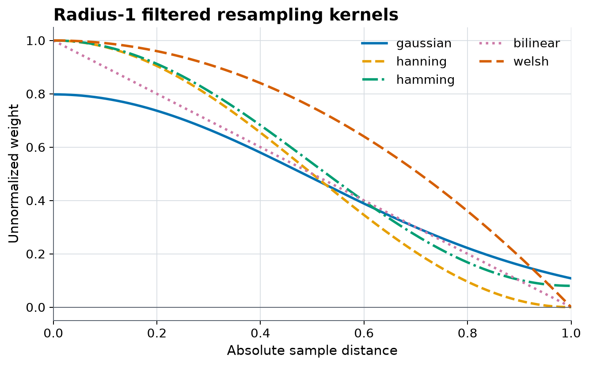

*Figure 1. Continuous radius-1 weight functions. This view predicts support and relative weight shape, but it does not include the sampling phase, scale-dependent candidate positions, finite image boundaries, normalization, the second axis, or numeric clamping.*

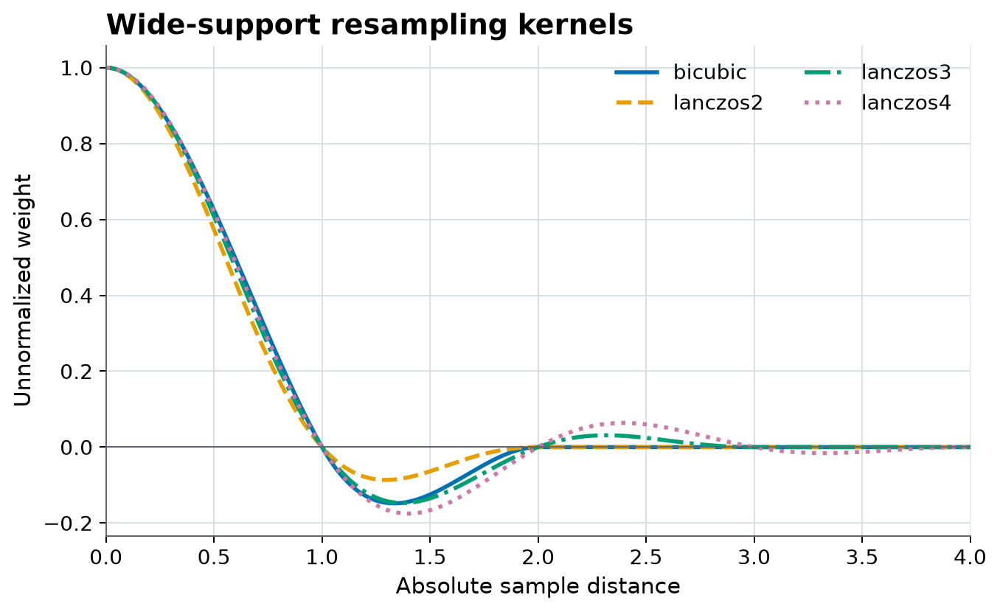

*Figure 2. Continuous wide-support functions. Negative lobes predict possible overshoot and ringing, but the visible result still depends on which discrete samples are reached at a particular scale and phase.*

The implementation chooses one method for both axes. There is no CLI mode that uses different horizontal and vertical kernels in the same resize.

## The implemented operator is discrete and phase-dependent

The continuous curves become a different finite stencil for every output coordinate. Candidate source centers are selected, their distances are evaluated, invalid edge candidates are clipped, and the surviving weights are normalized. Reduction also expresses source-center distance in destination-pixel units, so a radius-1 method can cover many source pixels.

The next figure was not calculated from the plotted kernel equations alone. The workflow perturbs a mid-gray linear-RGB float32 input by a small amount, calls the built `sixel_helper_scale_image_float32()` implementation, subtracts the unperturbed output, and divides by the perturbation. Using a mid-gray baseline exposes negative weights without triggering the scaler's `[0, 1]` clamp.

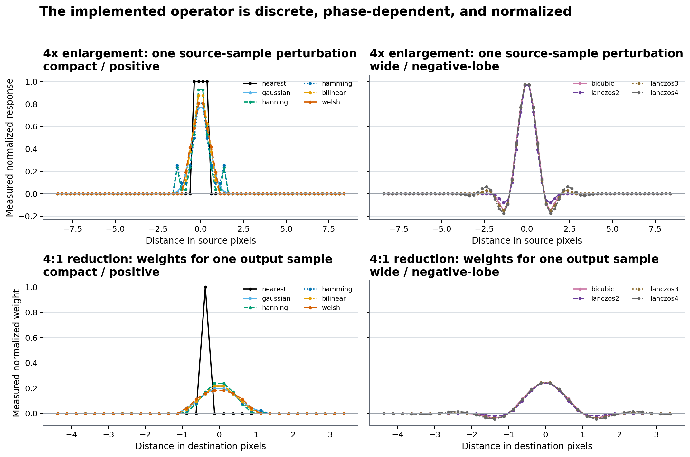

*Figure 3. Actual scalar C-scaler responses. The dots are destination samples or source contributions, not samples of an ideal continuous display curve. The 4:1 reduction stencils demonstrate scale dilation; the wide methods demonstrate negative lobes after the real candidate-selection and normalization path.*

The underlying samples are in [`resampling-discrete-stencils.csv`](resampling/measurements/resampling-discrete-stencils.csv). Another scale ratio or subpixel phase produces a different stencil, so Figure 3 is an inspectable example rather than a complete response specification.

## Nearest-neighbor mapping

`nearest` bypasses the weighted filter path. For destination coordinates `w` and `h`, it selects:

```text
x = floor(w * source_width  / destination_width)
y = floor(h * source_height / destination_height)
```

The top-left destination sample therefore maps to the top-left source sample. This path preserves selected source sample values exactly, but reduction can alias because it does not integrate the discarded source area.

## Filtered coordinate mapping

Filtered methods use pixel centers at half-integer coordinates. The expressions differ between enlargement and reduction so the kernel operates in the domain that keeps its nominal support appropriate.

For enlargement or equal size on the horizontal axis, destination pixel `w` maps into source coordinates as:

```text
center_x = (w + 0.5) * source_width / destination_width
distance = (source_x + 0.5) - center_x
```

For reduction, the destination center remains `w + 0.5`, while each source center maps into destination coordinates:

```text
center_x = w + 0.5
distance = (source_x + 0.5) * destination_width / source_width - center_x
```

The vertical pass uses the same expressions with height and `y` substituted for width and `x`.

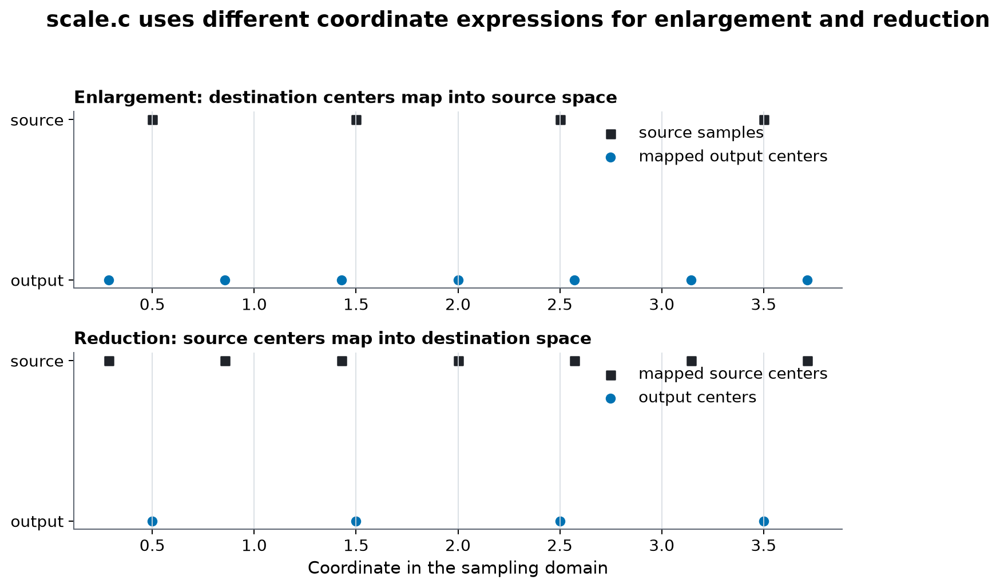

*Figure 4. Enlargement maps destination centers into source space; reduction maps source centers into destination space. This is why a radius-1 reduction can cover more than the nearest two source pixels.*

Candidate indices are clipped to valid source bounds before evaluating the kernel. There is no synthetic black, transparent, reflected, or wrapped padding outside the image.

## Frequency response and alias leakage

A destination raster can represent at most 0.5 cycles per output pixel along either sampling axis. For a 4:1 reduction, that cutoff corresponds to 0.125 cycles per source pixel, or a source period of eight pixels. Content with a shorter period must be attenuated before destination sampling or it folds into a lower false frequency.

Figures 5 and 6 measure that effect through the actual scalar float32 scaler. Each source is a sinusoid from 0.008 through 2.0 cycles per output pixel, the output is a 4:1 reduction, and the plotted value is output RMS contrast divided by input RMS contrast. The pale region is above the destination's 0.5-cycle Nyquist limit, where any surviving contrast is alias leakage rather than retained resolvable detail.

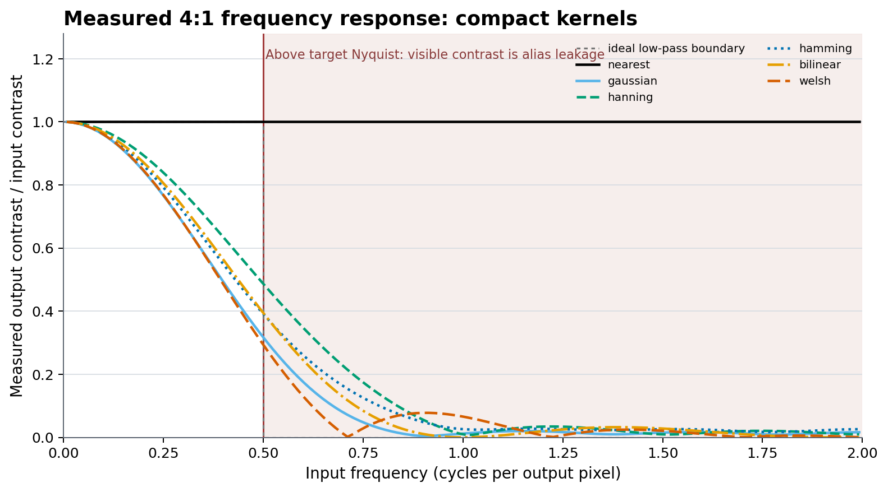

*Figure 5. Compact-method response. `nearest` retains nearly all contrast on both sides of the cutoff and therefore aliases maximally. The positive filters trade near-cutoff contrast for different degrees of stopband suppression.*

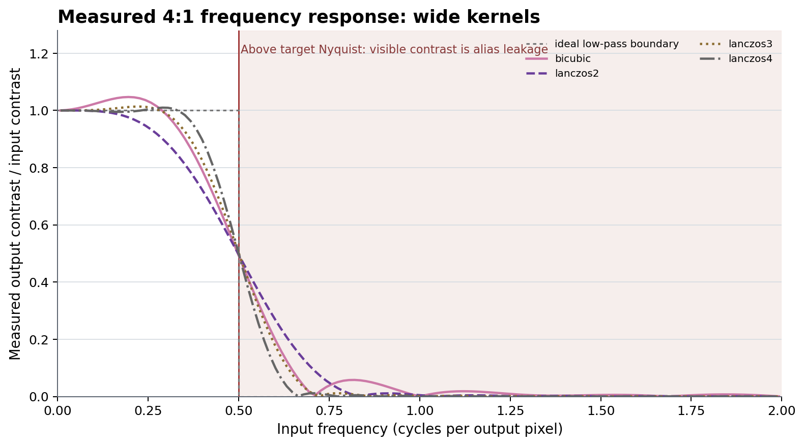

*Figure 6. Wide-method response. Negative lobes preserve or even boost some passband frequencies, while stopband lobes still allow scale- and phase-dependent alias energy.*

The complete sweep is in [`resampling-frequency-response.csv`](resampling/measurements/resampling-frequency-response.csv). The following summary uses the nearest sampled frequency to 0.45 cycles/output pixel and the RMS of all measured contrast gains above 0.5 cycles/output pixel. Lower alias RMS means stronger suppression, but it can be achieved by discarding more legitimate passband detail.

| Method | Gain near 0.45 | Above-Nyquist alias RMS | Directional range / mean | Zone-plate RMS error |
| --- | ---: | ---: | ---: | ---: |
| `nearest` | 1.000 | 1.000 | 0.3% | 0.342 |
| `gaussian` | 0.410 | 0.074 | 3.5% | 0.053 |
| `hanning` | 0.567 | 0.142 | 0.7% | 0.037 |
| `hamming` | 0.475 | 0.109 | 0.3% | 0.045 |
| `bilinear` | 0.485 | 0.100 | 2.7% | 0.048 |
| `welsh` | 0.396 | 0.067 | 7.1% | 0.057 |
| `bicubic` | 0.661 | 0.097 | 35.4% | 0.048 |
| `lanczos2` | 0.623 | 0.112 | 19.6% | 0.041 |
| `lanczos3` | 0.691 | 0.092 | 33.9% | 0.046 |
| `lanczos4` | 0.744 | 0.080 | 33.7% | 0.049 |

## Directional response and isotropy

The scaler is separable: it applies a one-dimensional horizontal filter and then a one-dimensional vertical filter. Away from boundaries, its two-dimensional response is approximately the product of the two axis responses, not a circularly symmetric function of radial frequency. The square destination sampling lattice also has a square Nyquist region. Consequently, equal-frequency horizontal, vertical, and diagonal patterns need not retain equal contrast.

The following measurement fixes radial frequency at 0.45 cycles/output pixel, rotates a sinusoidal grating from 0 through 90 degrees in five-degree steps, performs a 4:1 reduction through the actual C scaler, and measures the central 192 by 192 output region.

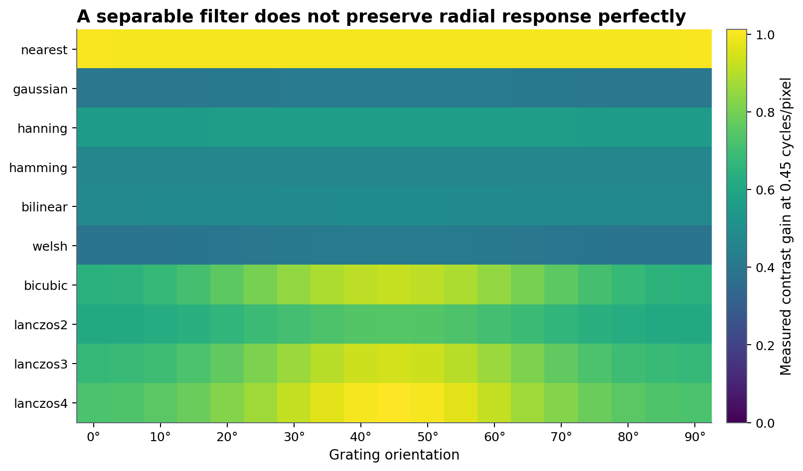

*Figure 7. Absolute directional contrast. Axis symmetry makes 0 and 90 degrees agree, but the wide negative-lobe methods retain much more contrast around 45 degrees than along the axes in this setup.*

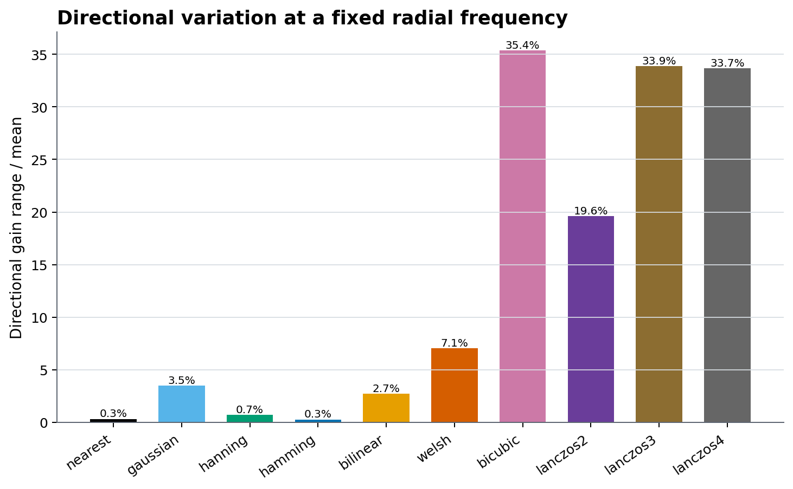

*Figure 8. Directional spread. A low number alone is not a quality score: `nearest` is nearly flat because it attenuates almost nothing, including frequencies that should have been removed.*

The angle-by-angle values are in [`resampling-isotropy.csv`](resampling/measurements/resampling-isotropy.csv). This is a fixed-scale, fixed-frequency probe. It demonstrates that the current implementation is not exactly isotropic; it does not define a single invariant percentage for arbitrary images or resize ratios.

## When moiré appears

Moiré is a visible low-frequency beat created when fine source structure is sampled onto a coarser or differently aligned grid without enough low-pass attenuation. It is especially likely when:

- reducing regular grids, fabric, screens, halftones, roof tiles, or closely spaced line art;
- the source period approaches or falls below twice the destination sample spacing;
- a non-integer scale or rotation causes the source and destination grids to drift in phase;
- a sharp negative-lobe filter preserves near-cutoff contrast but also leaves stopband lobes;
- the terminal or viewer performs a second resize after `img2sixel`, creating another sampling boundary.

The test pattern below is a continuous-tone radial chirp sampled at 1024 by 1024 and reduced to 256 by 256. Spatial frequency increases with radius, so the center is representable while progressively more of the outer field crosses the destination cutoff. The area comparator evaluates the generating field at 8 by 8 subpixel locations per output pixel and averages them. It is a defined box-area comparator, not an alias-free brick-wall reference; even exact pixel-area integration has a sinc-shaped transfer function with sidelobes.

| Source sampled at 1024 by 1024 | 8 by 8 area comparator at 256 by 256 |
| --- | --- |
| 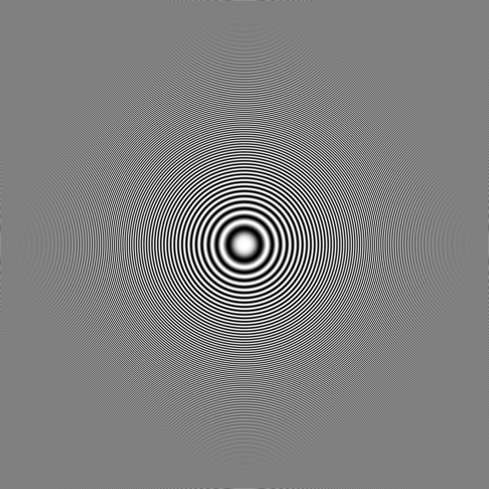 | 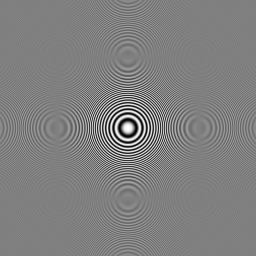 |

The following files are raw 256 by 256 outputs from `sixel_helper_scale_image_float32()`. They have not passed through palette construction, dithering, SIXEL encoding, decoding, or a chart compositor. View them at 1:1 to avoid adding browser resampling.

| `nearest` | `gaussian` |
| --- | --- |
| 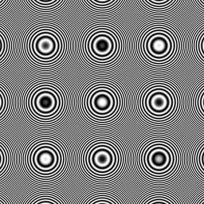 | 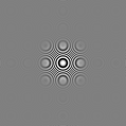 |

| `hanning` | `hamming` |
| --- | --- |
| 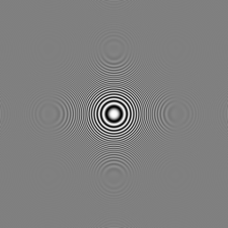 | 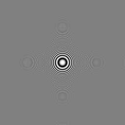 |

| `bilinear` | `welsh` |
| --- | --- |
| 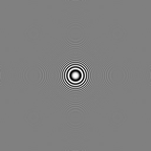 | 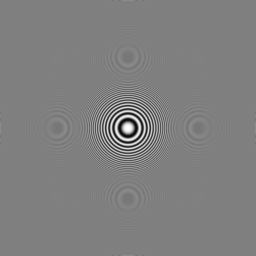 |

| `bicubic` | `lanczos2` |
| --- | --- |
| 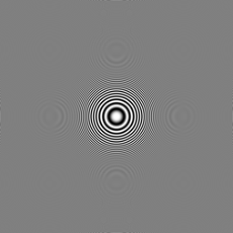 | 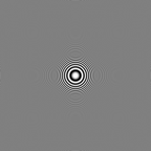 |

| `lanczos3` | `lanczos4` |
| --- | --- |
| 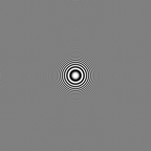 | 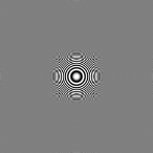 |

`nearest` turns the outer chirp into repeated false rings. The filtered methods suppress that failure to different degrees. The wide methods preserve a sharper central region, but the square-shaped transition visible in the Lanczos outputs is consistent with their stronger directional response. Per-method RMS error against the stated area comparator is recorded in [`resampling-moire.csv`](resampling/measurements/resampling-moire.csv); it is specific to this chirp and must not be read as a universal quality ranking.

## Techniques for preventing moiré

1. Resize once to the final presentation pixel dimensions. If a terminal, browser, or GUI scales the decoded SIXEL again, its independent filter can reintroduce aliasing even when the encoder resize was sound.
2. Do not use `nearest` for ordinary reduction. Reserve it for deliberate sample/block preservation, most often integer enlargement.
3. Start with `bilinear`, then move toward stronger smoothing such as `gaussian` or `hamming` when false patterns matter more than near-cutoff detail. `welsh` had the lowest broad stopband RMS among the compact measured methods, but also the lowest measured gain near 0.45 and the largest compact-method directional spread in this setup.
4. Use `lanczos2`, `lanczos3`, or `lanczos4` only after checking hard edges and diagonal texture at the actual target size. Increasing the lobe count expands work and can retain detail, but does not guarantee lower moiré or better isotropy.
5. For critical severe reductions, pre-filter or resize with a tool that exposes cutoff width and anti-alias controls, then pass the already final-sized image to `img2sixel` without `-w` or `-h`. libsixel currently offers method selection, not an independent blur radius or a non-separable radial filter.
6. Compare more than one output dimension. Shifting the size by one or two pixels can move or weaken a beat pattern, but this diagnoses phase sensitivity; it is not a reliable anti-aliasing technique and must not replace low-pass filtering.
7. Judge the decoded SIXEL, not only the pre-quantized resize. Palette construction, palette percentage rounding, and dithering can mask, amplify, or replace fine texture, but they cannot reconstruct information already aliased by the resize stage.

Repeated staged reductions are not automatically safer. The current reduction path already expands kernel coverage according to the scale factor. Multiple passes can compound blur and rounding; use them only after measuring the complete staged pipeline.

## Natural-image output comparison

The next crops come from the exact decoded SIXEL streams used for the quality and size measurements. Each 80 by 60 crop is enlarged four times with nearest-neighbor display scaling only, so no additional smoothing hides the encoded pixels. The reference is an exact 3 by 3 linear-light average of the 600 by 450 source pixels; it is an area-preserving comparator, not a unique reconstruction truth.

| Area reference | `nearest` |
| --- | --- |
|  | 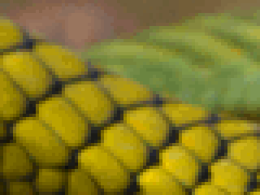 |

| `gaussian` | `hanning` |
| --- | --- |
| 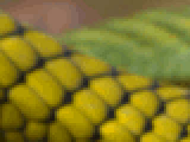 |  |

| `hamming` | `bilinear` |
| --- | --- |
|  |  |

| `welsh` | `bicubic` |
| --- | --- |
| 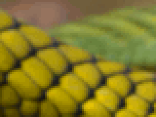 | 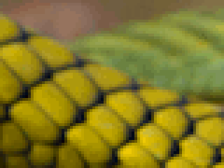 |

| `lanczos2` | `lanczos3` |
| --- | --- |
|  |  |

| `lanczos4` |
| --- |
| 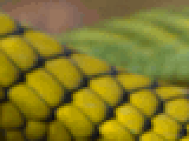 |

## Measured quality, speed, and SIXEL size

The natural-image comparison reduces tracked [`images/snake.png`](../../images/snake.png) from 600 by 450 to 200 by 150. Every method uses one thread, scalar SIMD, linear-light float32 resize, the builtin loader, 256 colors, deterministic seeded K-means, no diffusion, no palette merge, no GPU, no lookup accelerator, and fast SIXEL encoding. Each exact stream is decoded with scalar `sixel2png`; `lsqa -Woklab -Pfloat32` compares that PNG with the 3 by 3 linear-light area reference.

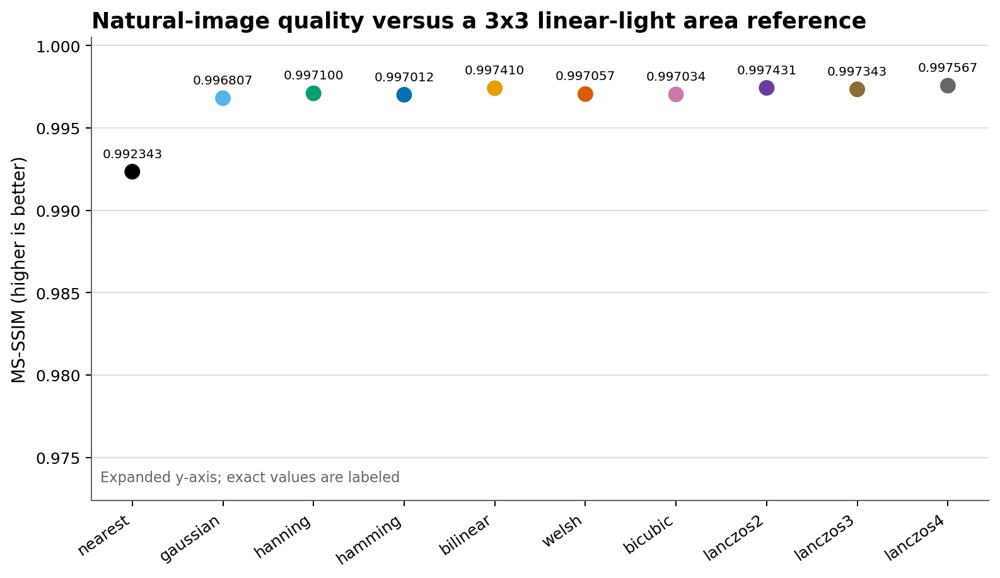

*Figure 9. Full-frame structural similarity. Lanczos4 is highest on this fixture and reference, but the gap among most filtered methods is small compared with the nearest-neighbor loss.*

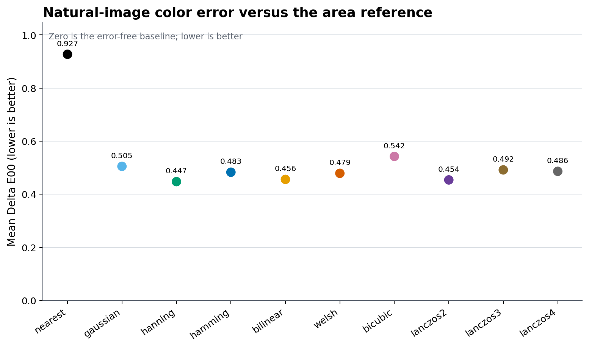

*Figure 10. Full-frame color error. Hanning is lowest on this fixture, demonstrating that MS-SSIM and color error need not choose the same winner.*

Speed uses a nearest-expanded 2400 by 1800 version of the same source and reduces it to 600 by 450 with the same controls. After two warmups, each method runs nine times in seeded interleaved order; the graph shows the median and interquartile range. These are end-to-end encoder timings, not isolated kernel nanoseconds.

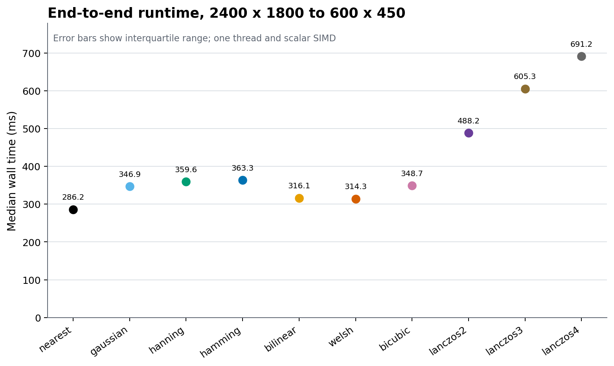

*Figure 11. Runtime on the recorded arm64 macOS build. Nearest is fastest, compact filtered methods cluster together, and Lanczos cost grows with support radius. Absolute values and even close orderings are host- and build-dependent.*

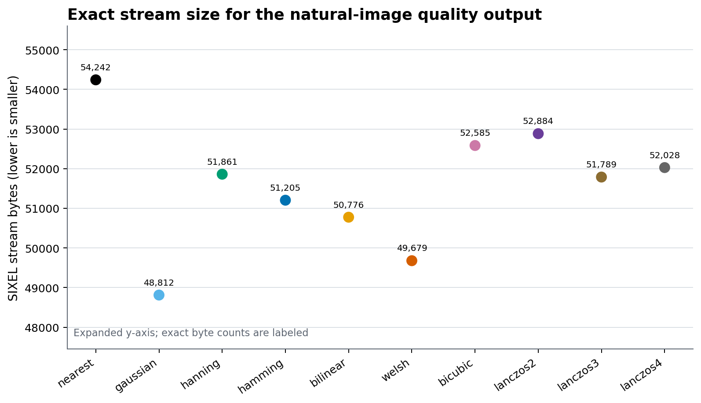

*Figure 12. Exact byte count of the same 200 by 150 stream used for quality assessment. Size is an output-content consequence, not a monotonic property of support radius or quality.*

| Method | MS-SSIM | Mean Delta E00 | Median ms | SIXEL bytes |
| --- | ---: | ---: | ---: | ---: |
| `nearest` | 0.992343 | 0.927 | 286.2 | 54,242 |
| `gaussian` | 0.996807 | 0.505 | 346.9 | 48,812 |
| `hanning` | 0.997100 | 0.447 | 359.6 | 51,861 |
| `hamming` | 0.997012 | 0.483 | 363.3 | 51,205 |
| `bilinear` | 0.997410 | 0.456 | 316.1 | 50,776 |
| `welsh` | 0.997057 | 0.479 | 314.3 | 49,679 |
| `bicubic` | 0.997034 | 0.542 | 348.7 | 52,585 |
| `lanczos2` | 0.997431 | 0.454 | 488.2 | 52,884 |
| `lanczos3` | 0.997343 | 0.492 | 605.3 | 51,789 |
| `lanczos4` | 0.997567 | 0.486 | 691.2 | 52,028 |

The raw rows are in [`resampling-quality-size.csv`](resampling/measurements/resampling-quality-size.csv) and [`resampling-speed.csv`](resampling/measurements/resampling-speed.csv). The recorded source revision, build flags, platform, tool hashes, protocol, and artifact hashes are in [`resampling-run.json`](resampling/measurements/resampling-run.json). One natural fixture cannot represent text, pixel art, every edge phase, or every palette interaction; use these numbers to understand tradeoffs, not as a permanent league table.

## Accumulation and edge normalization

For each output sample in a filtered pass, the scaler accumulates both the weighted channel sum and the total weight of the valid candidate samples:

```text
output_channel = sum(source_channel * kernel(abs(distance)))
                 / sum(kernel(abs(distance)))
```

This normalization is recomputed at every output coordinate. Near an image boundary, clipped-away candidates therefore do not darken the edge merely because their weights are absent. The changed stencil can still make a boundary respond differently from the interior.

The byte scalar path floors the normalized value and clamps it to `[0, 255]`. SIMD byte paths use their native float-to-integer conversion sequence, so a scalar and vector implementation are allowed to differ by rounding at some samples. The float32 path normalizes in float arithmetic and clamps each channel to `[0, 1]`; clamping is especially relevant for bicubic and Lanczos negative lobes.

## Separable two-pass execution

Every filtered method is separable:

1. the horizontal pass resamples each source row into an intermediate with destination width and source height;
2. the vertical pass resamples each intermediate column into destination height.

For RGB byte input, the filtered intermediate is approximately `destination_width * source_height * 3` bytes. For three-channel float32 input it is approximately four times larger. The destination and any format-conversion buffers are additional allocations owned by the higher frame/planner path; see [Crop and Resize](crop-resize.md) and [Pixel-Format Precision](../concepts/pixelformat-precision.md).

`nearest` does not allocate this filtered intermediate because it writes selected source samples directly to the destination.

## Threading and SIMD

The byte and float32 filtered paths have scalar implementations plus eligible SSE2, AVX, and NEON RGB-three-channel implementations when compiled for the corresponding target. The runtime SIMD base in `-j` is a ceiling over the native capability; `auto` selects the detected native level, while `none` and `scalar` force level 0. Platform and compile-time guards may lower the effective level further.

SIMD selection does not change the method, coordinate equations, kernel radius, or normalization contract. It can change final rounding because vector paths accumulate in float lanes while the scalar byte path uses double accumulators before flooring. Code requiring exact cross-platform pixels should request `-jscalar` and fix every downstream palette and encoding control as well.

When threading is enabled and the buffer is eligible, the scaler submits horizontal and vertical row bands to the shared thread pool. The horizontal pass must complete before the vertical pass begins because the second pass reads the intermediate. `--threads=1` removes this scheduling variable; `:scale_min_bytes=BYTES` and the corresponding environment override can defer parallel scaling for smaller buffers.

The resize precision policy is a separate planner decision. `preserve` sends gamma-coded byte RGB through the byte scaler, while `linear` and `float` normally promote gamma input to linear RGB float32 before calling the float scaler. Details and measured consequences are in [Crop and Resize](crop-resize.md).

## Transparent masks

Frame transparency uses a binary mask separate from color samples. The frame resize path converts that mask to float values, applies the selected resampling method with the same target geometry, and thresholds the result at `0.5`. An output value at or above the threshold is transparent.

The color plane and mask therefore use the same spatial kernel but different semantic postprocessing: RGB remains a color sample, while coverage is collapsed back to a binary omitted/painted decision. Wider or ringing kernels can move that decision boundary. The [Alpha Policy](../loader/alpha-policy.md) owns how a source's alpha becomes this mask and how omitted pixels are represented in the emitted SIXEL stream.

## Reproducing and validating the evidence

Run the dedicated workflow from a configured clean checkout:

```sh
PYTHON=python3 tools/reproduce_resampling_measurements.sh
```

The selected Python must provide NumPy, Pillow, and Matplotlib. The script builds the current tree, locates the exact shared libsixel library or accepts `LIBSIXEL_PATH`, calls the current float32 scaler directly for the stencil, frequency, direction, and zone-plate evidence, runs the controlled end-to-end encoder measurements, writes all CSV/PNG/JSON artifacts, and validates their dimensions, row sets, controls, summaries, and hashes. It refuses to record durable evidence from a tracked dirty worktree. Use `RESAMPLING_WARMUPS` and `RESAMPLING_RUNS` to change timing repetition only when intentionally recording a new protocol.

The earlier continuous-kernel and coordinate figures remain generated by [`plot_crop_resize_measurements.py`](../../tools/plot_crop_resize_measurements.py). The measured discrete figures and comparisons are generated by [`plot_resampling_measurements.py`](../../tools/plot_resampling_measurements.py) and validated by [`check_resampling_measurements.py`](../../tools/check_resampling_measurements.py).

## API and implementation map

The public method constants and byte helper declaration are in [`include/sixel.h.in`](../../include/sixel.h.in). [`sixel_helper_scale_image()`](../../src/scale.c) operates on byte pixels, while the internal `sixel_helper_scale_image_float32()` declared in [`src/scale.h`](../../src/scale.h) operates on supported float32 formats. The frame wrappers in [`src/frame.c`](../../src/frame.c) update ownership, dimensions, colorspace/pixel-format metadata, and transparent masks around those low-level calls.

The method switch, kernel functions, coordinate expressions, serial and thread-pool passes, SIMD dispatch, and normalization are all implemented in [`src/scale.c`](../../src/scale.c). Focused scale behavior is covered by the C tests under [`tests/processing/scale/`](../../tests/processing/scale/) and CLI method comparisons under [`tests/processing/geometry/`](../../tests/processing/geometry/), while frame-level resize and mask behavior is covered under [`tests/processing/frame/`](../../tests/processing/frame/).
