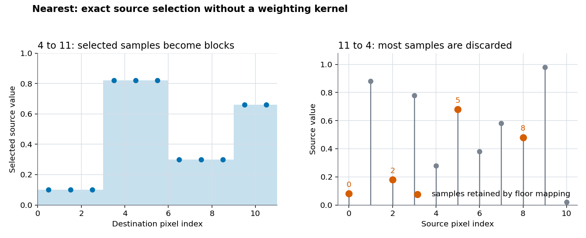
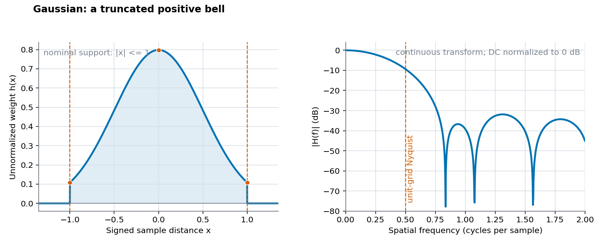
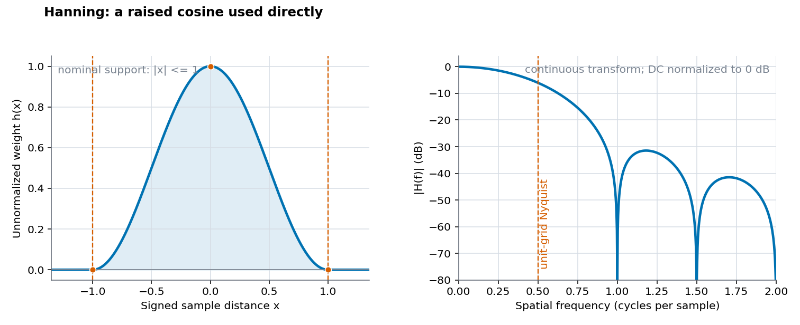
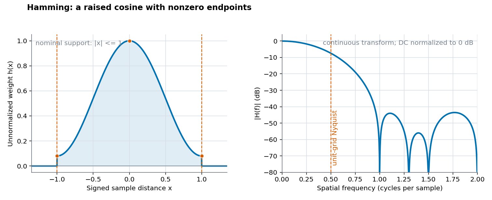
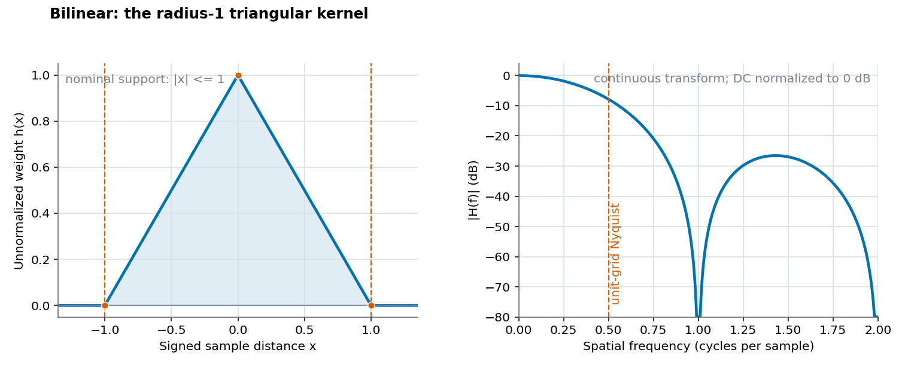
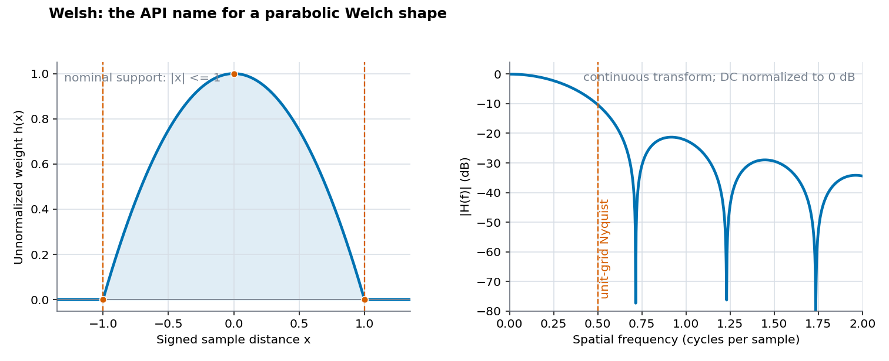

# Compact Resampling Methods

## Scope

This document explains the six lowest-support `img2sixel --resampling` choices: `nearest`, `gaussian`, `hanning`, `hamming`, `bilinear`, and `welsh`. The five weighted methods have nominal radius 1; `nearest` bypasses the weighted path entirely.

[Resampling theory and history](theory-history.md) defines reconstruction, windowing, aliasing, cardinal interpolation, and the ImageMagick reference in libsixel's implementation history. [Resampling](../resampling.md) contains actual discrete stencils, measured frequency and directional response, moiré examples, natural-image comparisons, quality, speed, and SIXEL size.

## Family overview

The weighted formulas receive the absolute normalized distance $d$. The caller chooses candidates within nominal radius 1 and normalizes their sum for every output coordinate.

| Method | Mathematical family | $h(0)$ | $h(0.5) / h(0)$ | $h(1) / h(0)$ | Negative weights | Aligned cardinal behavior |
| --- | --- | ---: | ---: | ---: | --- | --- |
| `nearest` | Direct index selection | n/a | n/a | n/a | No | Exact selected samples, but not a filtered reconstruction. |
| `gaussian` | Truncated Gaussian, σ = 0.5 | 0.7979 | 0.6065 | 0.1353 | No | No; distance-1 neighbors retain weight. |
| `hanning` | Hann raised cosine used directly | 1 | 0.5 | 0 | No | Yes at the integer grid. |
| `hamming` | Hamming raised cosine used directly | 1 | 0.54 | 0.08 | No | No; distance-1 neighbors retain weight. |
| `bilinear` | First-degree B-spline or triangular kernel | 1 | 0.5 | 0 | No | Yes at the integer grid. |
| `welsh` | Parabolic Welch shape used directly | 1 | 0.75 | 0 | No | Yes at the integer grid. |

The half-distance and endpoint columns describe the continuous functions before per-output normalization. They are useful for comparing shape, but they are not the actual weights of every resize phase.

## `nearest`: a selector, not a window

`nearest` uses integer arithmetic:

```text
source_x = floor(destination_x * source_width / destination_width)
source_y = floor(destination_y * source_height / destination_height)
```

It does not evaluate a kernel, allocate the filtered intermediate, or average source samples. Enlargement repeats selected values as hard blocks. Reduction keeps one source value for each output pixel and discards the others, so content above the destination Nyquist limit can fold into arbitrary false structure.



*Figure 1. Exact floor-index behavior in one dimension. The orange points in the reduction panel are retained source indices. This diagram follows libsixel's top-left-anchored mapping; it is not a centered box-kernel approximation.*

### Properties and use

- **Strength:** exact source values, minimum arithmetic, no ringing, and predictable blocks for integer pixel-art enlargement.
- **Weakness:** no low-pass operation during reduction, discontinuous motion under subpixel phase changes, and uneven block widths at non-integer enlargement ratios.
- **Use when:** preserving categorical samples or pixel-art blocks is the purpose.
- **Avoid when:** reducing photographs, screens, fabrics, grids, or line art where aliasing and moiré matter.

## `gaussian`: truncated positive smoothing

The implemented function is:

```text
h(d) = sqrt(2 / π) * exp(-2 d²)             for 0 <= d <= 1
h(d) = 0                                    outside the caller's radius
```

This is a Gaussian with σ = 0.5 before truncation. The leading `sqrt(2 / π)` is the infinite Gaussian's normalization factor at that σ, but libsixel divides every stencil by its own total weight, so multiplying every Gaussian weight by this constant does not change the final result.

At the nominal boundary, the weight remains about 13.5% of its center value. Treating the finite kernel as zero immediately outside radius 1 therefore introduces a jump. The interior bell is smooth and positive, but the truncation prevents it from having the ideal Gaussian's infinite-support frequency response.



*Figure 2. The left panel plots the exact function and radius used by libsixel. The right panel is the numerically integrated transform of that continuous truncated function, normalized at DC. It is not the phase-dependent response of the discrete scaler.*

### Properties and use

- **Strength:** positive averaging suppresses fine false structure without negative-lobe halos.
- **Weakness:** legitimate near-cutoff contrast is reduced; the nonzero radius endpoint means this is not cardinal at an aligned unit grid.
- **Observed in the recorded 4:1 test:** stronger broad alias suppression than bilinear, with more near-cutoff attenuation; it also produced the smallest SIXEL stream for the measured natural image.
- **Use when:** moiré suppression is more important than retaining maximum apparent sharpness.

## `hanning`: the Hann shape used as a kernel

The CLI and API retain the historical spelling `hanning`; the conventional window name is *Hann*. libsixel implements the centered raised cosine:

```text
h(d) = 0.5 + 0.5 cos(π d)                   for 0 <= d <= 1
h(d) = 0                                    outside the caller's radius
```

The value and first derivative both reach zero at radius 1. This makes the finite function smoother at its cutoff than the truncated Gaussian or Hamming shapes. Its integer-distance neighbors have zero weight, so it is cardinal when sample and output centers align.

Crucially, libsixel uses this raised cosine directly. It is not a Hann-windowed sinc filter.



*Figure 3. Continuous theoretical response of the direct raised-cosine kernel. The smooth zero-valued boundary reduces some kinds of leakage, but the practical result still depends on scale dilation and discrete phase.*

### Properties and use

- **Strength:** positive, compact, cardinal on the aligned grid, and smooth at the support edge.
- **Weakness:** a smooth spatial lobe still attenuates detail, and its continuous transform does not provide a brick-wall stopband.
- **Observed in the recorded tests:** lowest natural-image mean Delta E00 and lowest radial-chirp error, but worse broad above-Nyquist RMS than several other positive compact methods. This disagreement is why no single fixture defines a winner.
- **Use when:** a compact positive kernel is desired and the actual target image confirms its scale-specific balance.

## `hamming`: nonzero raised-cosine endpoints

The implemented centered Hamming function is:

```text
h(d) = 0.54 + 0.46 cos(π d)                 for 0 <= d <= 1
h(d) = 0                                    outside the caller's radius
```

Its center value is 1 and its radius-1 value is 0.08. In DFT analysis, the offset from zero is part of a main-lobe-versus-sidelobe design tradeoff. Used directly as a finite reconstruction kernel, that nonzero endpoint instead means a jump to zero outside support and non-cardinal mixing of distance-1 neighbors.



*Figure 4. Continuous theoretical response of the direct Hamming shape. The endpoint dots expose the nonzero cutoff that distinguishes this method from `hanning`.*

### Properties and use

- **Strength:** positive compact averaging with stronger measured smoothing than bilinear near the destination cutoff.
- **Weakness:** not cardinal at aligned integer centers; the support-edge jump produces frequency sidelobes even though the interior curve is smooth.
- **Observed in the recorded 4:1 test:** less broad alias leakage than `hanning`, while retaining less contrast near 0.45 cycles per output pixel.
- **Use when:** stronger smoothing is acceptable and the source does not require exact aligned sample reproduction.

## `bilinear`: triangular first-degree interpolation

The one-dimensional kernel is:

```text
h(d) = 1 - d                                for 0 <= d < 1
h(d) = 0                                    for d >= 1
```

This is the triangular or first-degree B-spline kernel. Between two adjacent samples, normalization gives the familiar linear interpolation weights. Applying it horizontally and vertically yields bilinear interpolation in two dimensions.

The function is continuous and cardinal, but its slope changes abruptly at the center and support boundary. Its continuous transform is proportional to `sinc²`, so the passband rolls off rather than remaining flat and the stopband contains sidelobes.



*Figure 5. The radius-1 tent has the smallest common support for a weighted interpolating kernel. The frequency panel shows the transform of the continuous tent, not the actual 4:1 discrete response.*

### Properties and use

- **Strength:** small support, no negative-lobe ringing, exact integer-grid interpolation, and low runtime among weighted choices.
- **Weakness:** visible softening on enlargement and incomplete stopband rejection on severe reduction.
- **Observed in the recorded tests:** a strong general balance—near the fastest weighted methods, high natural-image MS-SSIM, and middle-of-family size and alias behavior.
- **Use when:** there is no stronger image-specific reason to choose another method. This balance is why it remains libsixel's compatibility default.

## `welsh`: a parabolic Welch shape under the API spelling

The public token is `welsh`, but the mathematical shape corresponds to the centered *Welch* parabolic window:

```text
h(d) = 1 - d²                               for 0 <= d < 1
h(d) = 0                                    for d >= 1
```

At half distance it retains 75% of the center weight, compared with 50% for bilinear and Hanning. It is smooth at the center and cardinal at integer distance 1, but its slope jumps from a finite negative value to zero at the support boundary.

Like `hanning` and `hamming`, this shape is used directly; it is not multiplied by sinc. The `welsh` spelling is part of libsixel's compatibility surface and should not be silently corrected in commands or constants.



*Figure 6. Continuous theoretical response of the parabolic kernel. The broad central lobe in space does not by itself determine the discrete downsampling result.*

### Properties and use

- **Strength:** positive, cardinal, and inexpensive; strong weight away from the center creates substantial local averaging after normalization.
- **Weakness:** less near-cutoff contrast and more directional spread than the other measured compact weighted methods in the recorded 4:1 setup.
- **Observed in the recorded tests:** lowest broad above-Nyquist RMS among the compact weighted methods, but not the lowest radial-chirp error or natural-image color error.
- **Use when:** broad stopband suppression is valuable and the actual image tolerates its passband and directional tradeoffs.

## Aligned 1:1 behavior

If the filtered helper is explicitly called with equal source and destination dimensions, interior candidates can occur at distances 0 and 1. The resulting mathematical distinction is:

| Method | Distance-1 weight | Consequence before byte rounding or float clamping |
| --- | ---: | --- |
| `nearest` | not evaluated | Exact direct copy. |
| `gaussian` | nonzero | Neighbor mixing remains. |
| `hanning` | zero | Exact aligned interpolation. |
| `hamming` | 0.08 | Neighbor mixing remains. |
| `bilinear` | zero | Exact aligned interpolation. |
| `welsh` | zero | Exact aligned interpolation. |

Higher-level frame planning may skip a geometrically unnecessary resize, so this table describes the helper's filter mathematics rather than promising that every encoder command executes a 1:1 pass.

## Comparing the theory with the implementation

The per-method frequency plots in this document transform the continuous finite kernel in isolation. Actual output weights additionally depend on:

- enlargement versus reduction coordinate mapping;
- scale-dependent candidate density;
- subpixel phase;
- clipping candidates at image boundaries;
- normalization by the surviving weight sum;
- horizontal-then-vertical separability;
- byte or float32 accumulation and clamping.

Use the [discrete stencil](../resampling.md#the-implemented-operator-is-discrete-and-phase-dependent), [frequency-response](../resampling.md#frequency-response-and-alias-leakage), [isotropy](../resampling.md#directional-response-and-isotropy), and [quality, speed, and size](../resampling.md#measured-quality-speed-and-sixel-size) sections for those implementation-level effects.

## Test coverage

<!-- test-coverage: enforced -->

| ID | Contract | Owning tests |
| --- | --- | --- |
| CK-01 | `nearest` is selectable and produces compatible decoded output for both reduction and enlargement. | [tests/processing/geometry/0015_resample_nearest_downscale_80pct_lsqa.t](../../../tests/processing/geometry/0015_resample_nearest_downscale_80pct_lsqa.t), [tests/processing/geometry/0025_resample_nearest_upscale_120pct_lsqa.t](../../../tests/processing/geometry/0025_resample_nearest_upscale_120pct_lsqa.t) |
| CK-02 | `gaussian` is selectable and produces compatible decoded output for both reduction and enlargement. | [tests/processing/geometry/0016_resample_gaussian_downscale_80pct_lsqa.t](../../../tests/processing/geometry/0016_resample_gaussian_downscale_80pct_lsqa.t), [tests/processing/geometry/0026_resample_gaussian_upscale_120pct_lsqa.t](../../../tests/processing/geometry/0026_resample_gaussian_upscale_120pct_lsqa.t) |
| CK-03 | `hanning` is selectable and produces compatible decoded output for both reduction and enlargement. | [tests/processing/geometry/0017_resample_hanning_downscale_80pct_lsqa.t](../../../tests/processing/geometry/0017_resample_hanning_downscale_80pct_lsqa.t), [tests/processing/geometry/0027_resample_hanning_upscale_120pct_lsqa.t](../../../tests/processing/geometry/0027_resample_hanning_upscale_120pct_lsqa.t) |
| CK-04 | `hamming` is selectable and produces compatible decoded output for both reduction and enlargement. | [tests/processing/geometry/0018_resample_hamming_downscale_80pct_lsqa.t](../../../tests/processing/geometry/0018_resample_hamming_downscale_80pct_lsqa.t), [tests/processing/geometry/0028_resample_hamming_upscale_120pct_lsqa.t](../../../tests/processing/geometry/0028_resample_hamming_upscale_120pct_lsqa.t) |
| CK-05 | `bilinear` is selectable and produces compatible decoded output for both reduction and enlargement. | [tests/processing/geometry/0019_resample_bilinear_downscale_80pct_lsqa.t](../../../tests/processing/geometry/0019_resample_bilinear_downscale_80pct_lsqa.t), [tests/processing/geometry/0029_resample_bilinear_upscale_120pct_lsqa.t](../../../tests/processing/geometry/0029_resample_bilinear_upscale_120pct_lsqa.t) |
| CK-06 | `welsh` is selectable and produces compatible decoded output for both reduction and enlargement. | [tests/processing/geometry/0020_resample_welsh_downscale_80pct_lsqa.t](../../../tests/processing/geometry/0020_resample_welsh_downscale_80pct_lsqa.t), [tests/processing/geometry/0030_resample_welsh_upscale_120pct_lsqa.t](../../../tests/processing/geometry/0030_resample_welsh_upscale_120pct_lsqa.t) |

### Coverage boundary

These tests exercise CLI method selection and compare decoded SIXEL output with tracked reference images for one 80% reduction and one 120% enlargement. They do not prove the continuous equations point by point, every scale or phase, the theoretical transform plots, isotropy, or benchmark rankings; those boundaries remain covered by source inspection and the reproducible measurements linked above.
