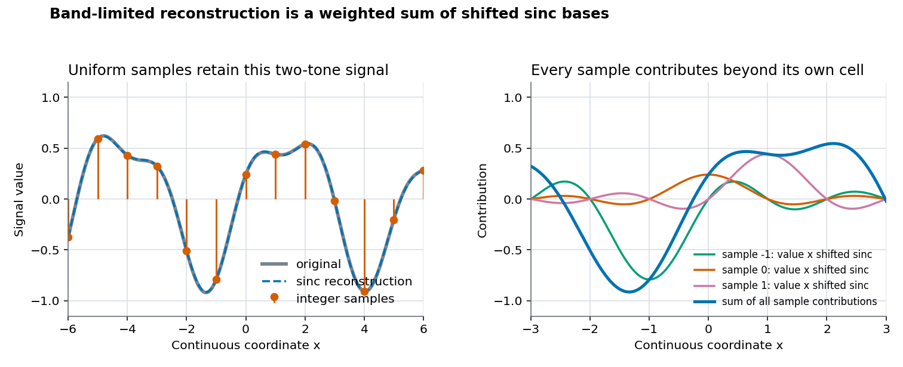
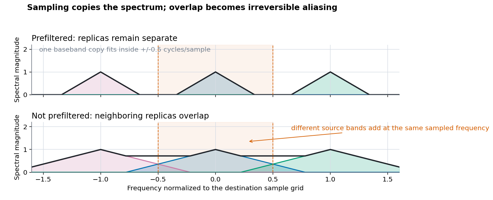

# Resampling Theory and History

## Scope

This document explains the mathematical model behind raster resampling, why ideal reconstruction leads to the sinc function, why practical filters have finite support, how windowing changes spatial and frequency behavior, and how those ideas developed historically. It then separates that general history from libsixel's own implementation history.

[Resampling](../resampling.md) owns the current coordinate mapping, discrete implementation, measurements, moiré guidance, threading, and SIMD behavior. [Compact kernels](compact-kernels.md) covers `nearest`, `gaussian`, `hanning`, `hamming`, `bilinear`, and `welsh`; [wide-support kernels](wide-kernels.md) covers `bicubic` and the three Lanczos choices.

The family split is by libsixel's nominal support radius, not by polynomial order. Calling every radius-1 choice a "first-order window" would be inaccurate: `welsh` is quadratic, `gaussian` is exponential, and `hanning` and `hamming` are raised cosines.

## Pixels as samples

The scaler treats each stored channel value as a sample located at a pixel center. Let the one-dimensional source samples be $p[k]$ at integer locations $k$. A reconstruction kernel $h$ defines a continuous function:

$$
g(x)=\sum_{k=-∞}^{∞} p[k]\cdot h(x-k)
$$

The conceptual sum is infinite. A practical finite-support kernel makes almost every term zero, so only nearby samples are evaluated. libsixel never constructs the complete continuous function; it evaluates the required weighted sum directly at each destination coordinate.



*Figure 1. The left panel shows point samples and sinc reconstruction of a two-tone band-limited signal. The right panel exposes three individual sample contributions; the blue sum also includes the samples outside those three. The finite plotted range is illustrative, while the mathematical cardinal series extends without finite support.*

Real image pixels may originate from sensor-area integration, rendering, prior filtering, compression, or another resampling pass. A raster normally does not carry a complete acquisition filter, so treating stored values as ideal point samples is a model rather than a recovery of the original optical scene.

## Why ideal reconstruction uses sinc

With unit sample spacing, the Nyquist frequency is 0.5 cycles per sample. If a continuous signal contains no energy at or above that limit, an ideal low-pass response can keep the baseband and reject the spectral copies created by sampling. The spatial impulse response corresponding to that rectangular frequency response is:

```text
sinc(x) = 1                              when x = 0
sinc(x) = sin(π x) / (π x)               otherwise
```

The shifted sinc functions are cardinal: `sinc(0) = 1` and `sinc(k) = 0` at every nonzero integer $k$. Consequently, ideal reconstruction passes exactly through the original sample values while interpolating between them.

This mathematical result has two impractical features for a small image scaler:

- sinc has infinite spatial support, so exact evaluation requires every source sample;
- its alternating positive and negative lobes can produce visible ringing around finite-image boundaries, discontinuities, clipping, and non-band-limited image structure.

The ideal result also assumes the samples were acquired from a sufficiently band-limited continuous signal. No reconstruction filter can undo aliasing that was already folded into the source raster.

## Resize is reconstruction followed by sampling

For enlargement, a useful mental model is:

```text
source samples -> reconstruct between source centers -> sample at destination centers
```

For reduction, the destination grid has a lower Nyquist limit. The model therefore requires another operation:

```text
source samples -> reconstruct -> low-pass for the destination limit -> sample sparsely
```

In an implementation these stages are commonly fused into one scale-dependent set of weights. In libsixel reduction, source-center distance is expressed in destination-pixel units. A radius-1 kernel therefore covers more source pixels as the reduction ratio grows. This dilation supplies low-pass averaging, but it does not turn a finite kernel into an ideal brick-wall filter.

Sampling replicates a signal's spectrum at multiples of the sampling frequency. If the replicas overlap, distinct source frequencies become the same sampled frequency and cannot be separated afterward.



*Figure 2. Schematic frequency-domain view. The colored triangles are spectral copies, the black outline is their sum, and the pale vertical band is the destination baseband. This is a conceptual diagram, not a measured libsixel response; the measured finite-kernel responses are in [Resampling](../resampling.md).*

## From infinite sinc to finite kernels

A finite window $w$ can restrict sinc to a radius $a$:

```text
h_a(x) = sinc(x) * w(x / a)               when |x| < a
h_a(x) = 0                                otherwise
```

Here `*` means ordinary multiplication, not convolution. In the spatial domain, truncating or multiplying sinc changes its frequency response: the infinitely sharp cutoff becomes a transition band with sidelobes. A smoother boundary generally reduces high-frequency leakage, but it also changes passband flatness and transition width. There is no finite-support kernel that simultaneously has an ideal rectangular frequency response, no ringing, minimal blur, exact phase invariance, and negligible computation.

Support radius controls more than runtime. A wider support can approximate sinc over more lobes and make the transition sharper, but negative lobes remain available to create overshoot. A compact positive kernel avoids negative-lobe ringing, yet normally loses more near-cutoff contrast or rejects the stopband less selectively.

## A window is not automatically a reconstruction kernel

The word *window* is used in several related but non-identical ways:

1. In spectral analysis, a data window tapers a finite observation before a DFT to control leakage.
2. In windowed-sinc reconstruction, a window multiplies sinc so an infinite reconstruction kernel becomes finite.
3. A program may use the shape of a named window directly as its interpolation or averaging kernel.

libsixel uses the third interpretation for `hanning`, `hamming`, and `welsh`: it evaluates their raised-cosine or parabolic shapes directly. It does not multiply those three shapes by sinc. The Lanczos methods use the second interpretation because their implemented formula is `sinc(x) * sinc(x / a)`.

The distinction matters. A Hann or Hamming window's familiar DFT-analysis sidelobe ranking does not transfer unchanged when the same shape is used directly as a reconstruction kernel, sampled at phase-dependent positions, clipped at image edges, normalized, and applied twice in a separable image pass.

## Constant reproduction and interpolation

Two properties are easy to conflate:

- **Constant reproduction:** a uniform input remains uniform.
- **Cardinal interpolation:** at an aligned source location, the reconstructed value equals that source sample without mixing its nonzero-integer neighbors.

libsixel normalizes each finite stencil:

$$
q=\frac{\sum_i p_i\cdot h(d_i)}{\sum_i h(d_i)}
$$

This normally reproduces constants whenever the denominator is positive, including near an edge after invalid candidates are removed. It does not make a non-cardinal kernel cardinal. In particular, the truncated Gaussian and Hamming shapes retain nonzero weights at distance 1, so an explicitly executed aligned 1:1 filtering pass can still mix neighboring samples.

## Two dimensions and separability

For a separable kernel, the two-dimensional weight is the product of one-dimensional weights:

$$
h(x,y)=h_x(x)\cdot h_y(y)
$$

The full two-dimensional reconstruction can be written as:

$$
g(x,y)=\sum_m\sum_n p[m,n]\cdot h_x(x-m)\cdot h_y(y-n)
$$

libsixel computes this as a horizontal pass into an intermediate and then a vertical pass. That reduces the cost from a two-dimensional neighborhood product to two one-dimensional sweeps. It also means the two-dimensional response is approximately the product of the axis responses, not a radial function. A square sampling lattice and separable filter therefore need not preserve equal radial frequencies equally at every angle; the [measured isotropy section](../resampling.md#directional-response-and-isotropy) shows the actual effect.

## Spatial and frequency properties to inspect

Kernel selection is a multi-objective decision. Useful properties include:

| Property | What it controls | Failure mode when poor |
| --- | --- | --- |
| Support radius | Number of candidate samples and intermediate work | Runtime and cache cost grow with radius and reduction ratio. |
| Cardinal zeros | Whether aligned samples are reproduced without neighbor mixing | A nominally identity resize can blur. |
| Partition or per-phase normalization | Reproduction of a constant field | Brightness varies with subpixel phase or at boundaries. |
| Continuity at the center and support edge | High-frequency decay of the finite kernel | Kinks and jumps produce broader spectral leakage. |
| Negative lobes | Sharpening and transition steepness | Overshoot, undershoot, ringing, and clamp-dependent color changes. |
| Passband shape | Retained resolvable contrast | Blur or artificial boosting. |
| Stopband attenuation | Suppression above destination Nyquist | Aliasing and moiré. |
| Directional response | Equality across pattern orientations | Axis-versus-diagonal texture differences. |
| Phase dependence | Stability as the grids shift relative to each other | A one-pixel size change alters detail or moiré. |

The continuous transforms in the method documents isolate the mathematical kernel. The empirical plots in [Resampling](../resampling.md) include libsixel's actual candidate selection, scale ratio, phase, normalization, two passes, and float32 clamping. Neither layer replaces the other.

## Historical development

The following milestones are a selective path to modern image resampling, not a claim that one paper invented every later practice:

- In 1915, E. T. Whittaker developed cardinal-function interpolation from equally spaced values, including shifted `sin(x) / x` terms in the interpolation series ([Whittaker, 1915](https://doi.org/10.1017/S0370164600017806)).
- In 1928, Harry Nyquist analyzed bandwidth and distortionless pulse transmission for telegraph signals, establishing the critical relationship between signaling rate and usable bandwidth ([Nyquist, 1928](https://doi.org/10.1109/T-AIEE.1928.5055024)).
- In 1949, Claude Shannon stated the band-limited sampling theorem in communication-theory form and connected uniform samples with sinc reconstruction ([Shannon, 1949](https://doi.org/10.1109/JRPROC.1949.232969)).
- In 1956, Cornelius Lanczos described sigma factors for damping Gibbs oscillation in finite Fourier approximations; the later image filter inherited the name and the sinc-shaped sigma factor rather than an image-resize API from that book ([Lanczos, *Applied Analysis*, 1956](https://archive.org/details/appliedanalysis00lanc_0)).
- In 1978, Fredric J. Harris catalogued windows and their main-lobe, sidelobe, and leakage tradeoffs for DFT harmonic analysis. That work is essential background for window behavior, but its analysis-window results must not be copied directly into interpolation-kernel rankings ([Harris, 1978](https://doi.org/10.1109/PROC.1978.10837)).
- In 1979, Claude E. Duchon described one- and two-dimensional Lanczos filtering using sigma factors to reduce Gibbs oscillation and evaluated responses as the weight count and cutoff changed ([Duchon, 1979](https://journals.ametsoc.org/view/journals/apme/18/8/1520-0450_1979_018_1016_lfioat_2_0_co_2.xml)).
- In 1981, Robert G. Keys derived a compact piecewise cubic convolution family for digital image resampling and its separable two-dimensional application ([Keys, 1981](https://doi.org/10.1109/TASSP.1981.1163711)).
- In 1988, Don Mitchell and Arun Netravali treated graphics pipelines as repeated continuous-to-discrete and discrete-to-continuous transformations, distinguished prealiasing from reconstruction defects, and made the formal-versus-subjective filter tradeoff explicit ([Mitchell and Netravali, 1988](https://dl.acm.org/doi/10.1145/378456.378514)).

Nearest-neighbor and linear interpolation are older general numerical constructions rather than a single image-resampling invention in this timeline. Their importance here is architectural: they provide the lowest-cost discrete selector and the smallest common separable interpolating kernel.

## libsixel implementation history and the ImageMagick reference

libsixel is not described as a derivative of ImageMagick. The repository does, however, preserve a specific implementation-history acknowledgment: some resampling choices were added by referring to the **line-up of filters** in ImageMagick's `MagickCore/resize.c`.

The local commit sequence makes the scope of that statement auditable:

- [`a2550a830f`](https://github.com/saitoha/libsixel/commit/a2550a830f5747d88b0592c161eaba0fad57c2df) added the first image-resize implementation on May 7, 2014.
- [`b79979c12b`](https://github.com/saitoha/libsixel/commit/b79979c12bf0812f8f9a489977bfc845d0a77d90) added the initial named method set on May 8.
- [`701a1c3005`](https://github.com/saitoha/libsixel/commit/701a1c30059b9768ab956584a0f0807d3e46b9cf) added Gaussian, Hanning, and Hamming choices on May 9.
- [`10f29ccc51`](https://github.com/saitoha/libsixel/commit/10f29ccc51a9cbf3a89a3990c70c4a5e9c0edc0d) added the README and manual reference note on May 12. Its wording says that libsixel added some resampling filters "in reference to the line-up of filters" in ImageMagick's resize source.
- [`d27be2a795`](https://github.com/saitoha/libsixel/commit/d27be2a7956754db972bdf04d1c78fd2ed7945e3) added the API-spelled `welsh` choice on May 13.

The historical note supports an influence and selection-lineage claim, not a claim that the current scaler is ImageMagick code. The implementations have distinct APIs, candidate selection, normalization, precision, threading, SIMD, and policy integration. Modern ImageMagick also distinguishes weighting functions from window functions and exposes a much larger configurable filter model; its current source remains useful comparative context ([ImageMagick 6 `magick/resize.c`](https://github.com/ImageMagick/ImageMagick6/blob/main/magick/resize.c)).

Later libsixel work changed the execution architecture while retaining the named method family: [`5770bc0ca7`](https://github.com/saitoha/libsixel/commit/5770bc0ca7f4f8aa5428ded359d4f4028c3fa7c7) made weighted scaling separable in 2025, and subsequent float32, linear-light, threading, and SIMD work created the current path described by [Crop and Resize](../crop-resize.md) and [Resampling](../resampling.md).

## Reproducing the theory figures

The figures in this document and the two method documents are generated from the stated mathematical functions:

```sh
PYTHON=python3 tools/plot_resampling_theory.py docs/functionality/resampling/figures
```

The kernel figures numerically integrate each finite continuous kernel to show a DC-normalized magnitude response. They do not call the discrete C scaler. Use [`plot_resampling_measurements.py`](../../../tools/plot_resampling_measurements.py) and the measured artifacts when the question is actual scale-, phase-, precision-, or implementation-dependent behavior.
