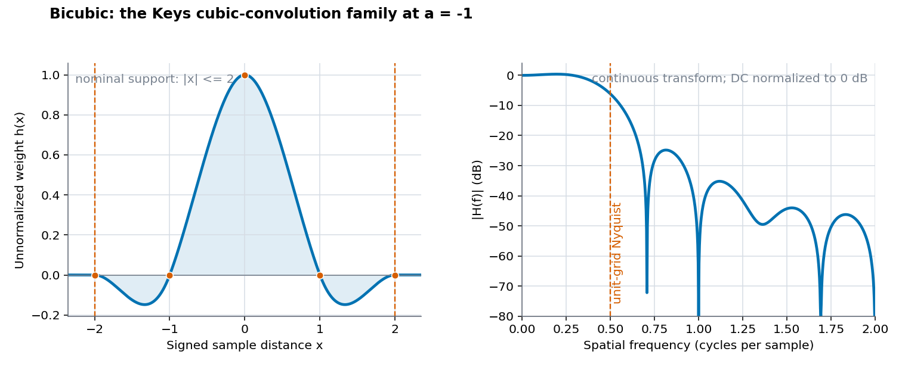
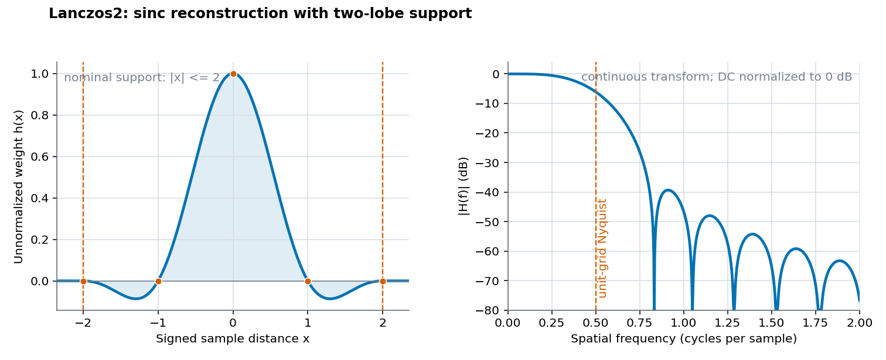
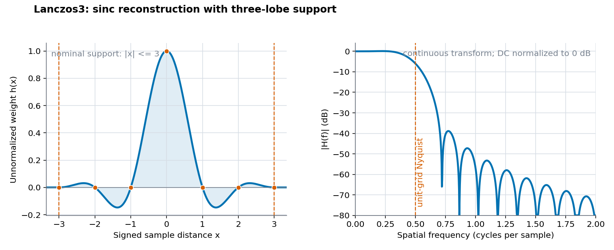
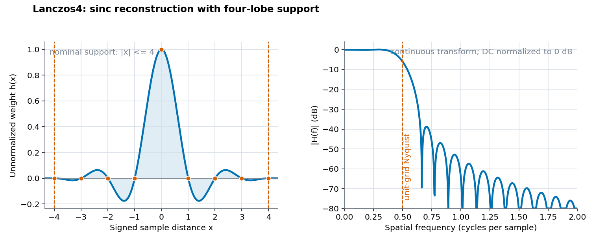

# Wide-Support Resampling Methods

## Scope

This document explains the four negative-lobe `img2sixel --resampling` choices: `bicubic`, `lanczos2`, `lanczos3`, and `lanczos4`. Their nominal support radii range from 2 through 4, so they can preserve more near-cutoff contrast than the compact positive kernels at the cost of more work and possible overshoot, ringing, and directional variation.

[Resampling theory and history](theory-history.md) defines reconstruction, sinc, finite windowing, cardinal interpolation, and the ImageMagick reference in libsixel's implementation history. [Compact kernels](compact-kernels.md) covers the selector and radius-1 choices. [Resampling](../resampling.md) contains actual discrete stencils, frequency and directional measurements, moiré examples, natural-image comparisons, quality, speed, and SIXEL size.

## Family overview

All four methods are even, finite, cardinal kernels: $h(0)=1$, and the weight is zero at every nonzero integer sample distance inside or at the support. All four also contain negative lobes between integer zero crossings. Per-output normalization reproduces constants, while the negative weights can retain edge contrast or create values outside the source range.

| Method | Nominal radius | Construction | First negative interval | Recorded 4:1 gain near 0.45 cycles/output pixel | Recorded median encoder time |
| --- | ---: | --- | --- | ---: | ---: |
| `bicubic` | 2 | Keys cubic-convolution family at $a=-1$ | $1 < d < 2$ | 0.661 | 348.7 ms |
| `lanczos2` | 2 | `sinc(d) * sinc(d / 2)` | $1 < d < 2$ | 0.623 | 488.2 ms |
| `lanczos3` | 3 | `sinc(d) * sinc(d / 3)` | $1 < d < 2$ | 0.691 | 605.3 ms |
| `lanczos4` | 4 | `sinc(d) * sinc(d / 4)` | $1 < d < 2$ | 0.744 | 691.2 ms |

The gain and time columns are observations from the fixed protocol in [Measured quality, speed, and SIXEL size](../resampling.md#measured-quality-speed-and-sixel-size), not universal constants. Support radius affects the candidate count, but end-to-end time also includes loading, precision conversion, palette work, encoding, and fixed overhead.

## `bicubic`: a specific Keys cubic-convolution kernel

The name `bicubic` describes separable two-dimensional application of a one-dimensional cubic kernel, but it does not uniquely determine the coefficients. The general Keys cubic-convolution family can be written for absolute distance $d$ and parameter $a$ as:

```text
h_a(d) = (a + 2)d^3 - (a + 3)d^2 + 1       for 0 <= d <= 1
h_a(d) = a d^3 - 5a d^2 + 8a d - 4a        for 1 < d <= 2
h_a(d) = 0                                  for d > 2
```

libsixel uses $a=-1$, which gives the exact implemented formula:

```text
h(d) = 1 - 2d^2 + d^3                       for 0 <= d <= 1
h(d) = 4 - 8d + 5d^2 - d^3                  for 1 < d <= 2
h(d) = 0                                    for d > 2
```

This identifies the implementation more precisely than the `bicubic` label alone. For example, Catmull-Rom interpolation corresponds to $a=-0.5$ in this convention and is therefore not the same curve. Mitchell and Netravali's two-parameter cubic family is another related design space, not the formula selected here. See [Keys, 1981](https://doi.org/10.1109/TASSP.1981.1163711) and [Mitchell and Netravali, 1988](https://dl.acm.org/doi/10.1145/378456.378514) for the original derivations and evaluation framework.



*Figure 1. The exact $a=-1$ cubic used by libsixel. Its negative lobe lies between distances 1 and 2. The frequency panel transforms the continuous finite kernel, not a phase-specific discrete resize.*

### Properties and use

- **Strength:** radius-2 cardinal interpolation, higher measured near-cutoff contrast than the compact positive kernels, and lower recorded runtime than the Lanczos methods.
- **Weakness:** the comparatively deep negative lobe can produce overshoot, undershoot, edge halos, and phase-dependent directional contrast.
- **Observed in the recorded 4:1 tests:** more near-cutoff contrast than `lanczos2`, but a 35.4% directional range divided by mean and a higher natural-image mean Delta E00 than every other weighted method in that fixture.
- **Use when:** a sharp cubic result is desired and hard edges, diagonal textures, and decoded SIXEL output have been checked at the final size.

## Lanczos construction

The Lanczos choices multiply the ideal reconstruction kernel by a finite sinc-shaped sigma factor:

```text
sinc(x) = 1                                 when x = 0
sinc(x) = sin(pi x) / (pi x)                otherwise

L_a(d) = sinc(d) * sinc(d / a)              for 0 <= d < a
L_a(d) = 0                                  for d >= a
```

The integer radius $a$ is the number in the method name. The outer sinc damps the infinite reconstruction sinc toward zero at the support boundary. Increasing $a$ keeps more alternating lobes and makes the continuous response approach the ideal rectangular low-pass more closely over part of the spectrum, but it also increases spatial reach and supplies more opportunities for ringing. The project-history chapter explains the older Lanczos sigma-factor background and the later image-filter formulation.

The cardinal zeros do not make Lanczos alias-free. During reduction the kernel is evaluated at scale-dependent, generally non-integer distances, then clipped and normalized per output coordinate. A finite sinc product has a transition band and stopband sidelobes, and separable application produces an axis-aligned rather than radial two-dimensional response.

## `lanczos2`: two-lobe support

```text
L_2(d) = sinc(d) * sinc(d / 2)              for 0 <= d < 2
L_2(d) = 0                                  for d >= 2
```



*Figure 2. Lanczos2 retains the central positive lobe and one negative interval before reaching zero at radius 2. The continuous spectrum is normalized at DC.*

### Properties and use

- **Strength:** the smallest Lanczos support, cardinal interpolation, moderate ringing relative to the wider Lanczos choices, and strong recorded natural-image quality.
- **Weakness:** more arithmetic than the same-radius cubic, visible negative-lobe halos on some edges, and more direction dependence than the compact positive kernels.
- **Observed in the recorded tests:** lowest wide-kernel radial-chirp error, lowest natural-image mean Delta E00 among the wide kernels, and the smallest directional spread among the four methods in this chapter.
- **Use when:** more apparent detail than a compact positive kernel is wanted, but radius-3 or radius-4 reach is not justified by the target image.

## `lanczos3`: three-lobe support

```text
L_3(d) = sinc(d) * sinc(d / 3)              for 0 <= d < 3
L_3(d) = 0                                  for d >= 3
```



*Figure 3. Lanczos3 retains one negative interval followed by another positive interval outside the central lobe. More spatial lobes sharpen part of the transition but do not remove the stopband.*

### Properties and use

- **Strength:** greater measured near-cutoff contrast and lower broad alias RMS than `lanczos2` in the recorded 4:1 sweep.
- **Weakness:** longer runtime, larger spatial reach, ringing, and substantial axis-versus-diagonal contrast variation.
- **Observed in the recorded tests:** natural-image MS-SSIM was slightly lower than `lanczos2`, and radial-chirp error was higher, despite the stronger frequency-sweep figures.
- **Use when:** the final-size image benefits visibly from the additional passband retention and does not expose the corresponding halos or directional texture changes.

## `lanczos4`: four-lobe support

```text
L_4(d) = sinc(d) * sinc(d / 4)              for 0 <= d < 4
L_4(d) = 0                                  for d >= 4
```



*Figure 4. Lanczos4 has the widest support exposed by libsixel. The extra alternating lobes improve selected frequency-domain measurements while extending the area that can influence an edge.*

### Properties and use

- **Strength:** highest recorded gain near 0.45 cycles/output pixel, lowest broad above-Nyquist RMS among the wide kernels, and highest natural-image MS-SSIM in the fixed fixture.
- **Weakness:** highest recorded runtime, the widest ringing footprint, and essentially the same large directional spread as `lanczos3` in the fixed isotropy probe.
- **Observed in the recorded tests:** its frequency-sweep and natural-image metrics did not translate into the lowest radial-chirp error or lowest color error.
- **Use when:** maximum retained contrast is useful and the actual content, scale, decoded stream, and display path have been inspected for ringing and moiré.

## Negative lobes, normalization, and clamping

For an unclamped linear system, negative weights make overshoot and undershoot a predictable part of the response to a step. libsixel normalizes every surviving stencil before storing a destination channel, but normalization only fixes the DC sum; it does not remove negative weights or constrain the result to the source range.

The byte scalar path floors and clamps the normalized result to `[0, 255]`. Eligible byte SIMD paths may use a different float-to-integer rounding sequence. The float32 path clamps each channel to `[0, 1]`. Clipping an overshoot is nonlinear: once a negative-lobe result crosses a channel limit, the final edge shape and color no longer follow the unclamped convolution exactly.

Image boundaries add another variation. Out-of-range candidates are removed and the remaining weights are renormalized, so the effective edge kernel is asymmetric. A wider method reaches the boundary from farther away and can therefore change a larger border neighborhood.

## Why a larger radius is not a quality ranking

Increasing Lanczos support changes several objectives at once:

- the transition between passband and stopband can become sharper;
- more negative and positive lobes can retain or amplify edge contrast;
- the number of contributing source pixels grows, especially during reduction;
- ringing extends farther from a discontinuity;
- separable horizontal and vertical responses multiply, so directional differences can grow;
- palette quantization and dithering may react differently to the new pixel distribution, changing SIXEL size as well as appearance.

The recorded output sizes are consequently non-monotonic: the wider kernel does not merely emit more bytes, because the encoder stores a palette-index pattern rather than kernel weights. Select by the failure that matters for the actual image, then compare the decoded output at its final display size. The [visual comparison](../resampling.md#decoded-output-and-magnified-comparison), [moiré guidance](../resampling.md#when-moiré-appears), and [quality, speed, and size graphs](../resampling.md#measured-quality-speed-and-sixel-size) provide the implementation evidence needed alongside these theoretical curves.

## Comparing the theory with the implementation

The four figures transform the continuous finite functions stated above. They intentionally omit scale-dependent candidate positions, subpixel phase, image-edge clipping, per-output normalization, the second separable axis, numeric precision, SIMD rounding, and output clamping. Those omitted operations are exactly why a theoretically attractive curve cannot by itself select the best `--resampling` option.

Use the [measured discrete stencils](../resampling.md#the-implemented-operator-is-discrete-and-phase-dependent), [frequency response](../resampling.md#frequency-response-and-alias-leakage), and [directional response](../resampling.md#directional-response-and-isotropy) to inspect the current C scaler rather than inferring its output from the window equation alone.

## Test coverage

<!-- test-coverage: enforced -->

| ID | Contract | Owning tests |
| --- | --- | --- |
| WK-01 | `bicubic` is selectable and produces compatible decoded output for both reduction and enlargement. | [tests/processing/geometry/0021_resample_bicubic_downscale_80pct_lsqa.t](../../../tests/processing/geometry/0021_resample_bicubic_downscale_80pct_lsqa.t), [tests/processing/geometry/0031_resample_bicubic_upscale_120pct_lsqa.t](../../../tests/processing/geometry/0031_resample_bicubic_upscale_120pct_lsqa.t) |
| WK-02 | `lanczos2` is selectable and produces compatible decoded output for both reduction and enlargement. | [tests/processing/geometry/0022_resample_lanczos2_downscale_80pct_lsqa.t](../../../tests/processing/geometry/0022_resample_lanczos2_downscale_80pct_lsqa.t), [tests/processing/geometry/0032_resample_lanczos2_upscale_120pct_lsqa.t](../../../tests/processing/geometry/0032_resample_lanczos2_upscale_120pct_lsqa.t) |
| WK-03 | `lanczos3` is selectable and produces compatible decoded output for both reduction and enlargement. | [tests/processing/geometry/0023_resample_lanczos3_downscale_80pct_lsqa.t](../../../tests/processing/geometry/0023_resample_lanczos3_downscale_80pct_lsqa.t), [tests/processing/geometry/0033_resample_lanczos3_upscale_120pct_lsqa.t](../../../tests/processing/geometry/0033_resample_lanczos3_upscale_120pct_lsqa.t) |
| WK-04 | `lanczos4` is selectable and produces compatible decoded output for both reduction and enlargement. | [tests/processing/geometry/0024_resample_lanczos4_downscale_80pct_lsqa.t](../../../tests/processing/geometry/0024_resample_lanczos4_downscale_80pct_lsqa.t), [tests/processing/geometry/0034_resample_lanczos4_upscale_120pct_lsqa.t](../../../tests/processing/geometry/0034_resample_lanczos4_upscale_120pct_lsqa.t) |
| WK-05 | `bicubic` produces the exact independently calculated bytes, including clipped-edge normalization and negative-lobe contributions, for a 4:1 reduction and a phase-shifted 3:4 enlargement. | [tests/processing/geometry/0047_resample_bicubic_downscale_exact.t](../../../tests/processing/geometry/0047_resample_bicubic_downscale_exact.t), [tests/processing/geometry/0057_resample_bicubic_upscale_exact.t](../../../tests/processing/geometry/0057_resample_bicubic_upscale_exact.t) |
| WK-06 | `lanczos2` produces the exact independently calculated bytes, including clipped-edge normalization and negative-lobe contributions, for a 4:1 reduction and a phase-shifted 3:4 enlargement. | [tests/processing/geometry/0048_resample_lanczos2_downscale_exact.t](../../../tests/processing/geometry/0048_resample_lanczos2_downscale_exact.t), [tests/processing/geometry/0058_resample_lanczos2_upscale_exact.t](../../../tests/processing/geometry/0058_resample_lanczos2_upscale_exact.t) |
| WK-07 | `lanczos3` produces the exact independently calculated bytes, including clipped-edge normalization and negative-lobe contributions, for a 4:1 reduction and a phase-shifted 3:4 enlargement. | [tests/processing/geometry/0049_resample_lanczos3_downscale_exact.t](../../../tests/processing/geometry/0049_resample_lanczos3_downscale_exact.t), [tests/processing/geometry/0059_resample_lanczos3_upscale_exact.t](../../../tests/processing/geometry/0059_resample_lanczos3_upscale_exact.t) |
| WK-08 | `lanczos4` produces the exact independently calculated bytes, including clipped-edge normalization and negative-lobe contributions, for a 4:1 reduction and a phase-shifted 3:4 enlargement. | [tests/processing/geometry/0050_resample_lanczos4_downscale_exact.t](../../../tests/processing/geometry/0050_resample_lanczos4_downscale_exact.t), [tests/processing/geometry/0060_resample_lanczos4_upscale_exact.t](../../../tests/processing/geometry/0060_resample_lanczos4_upscale_exact.t) |

### Coverage boundary

The LSQA tests exercise CLI method selection and compare decoded SIXEL output with tracked reference images for one 80% reduction and one 120% enlargement. The exact tests load small binary P6 fixtures through the builtin loader and compare raw scalar output with independently calculated safe-tone PPM oracles for one non-integer enlargement phase and one strong reduction. They do not exhaust every scale or phase, prove the continuous equations point by point, validate SIMD rounding on every architecture, or establish the theoretical transform plots, isotropy, and benchmark rankings; those remaining boundaries are covered by the cross-policy tests, source inspection, and reproducible measurements linked above.
