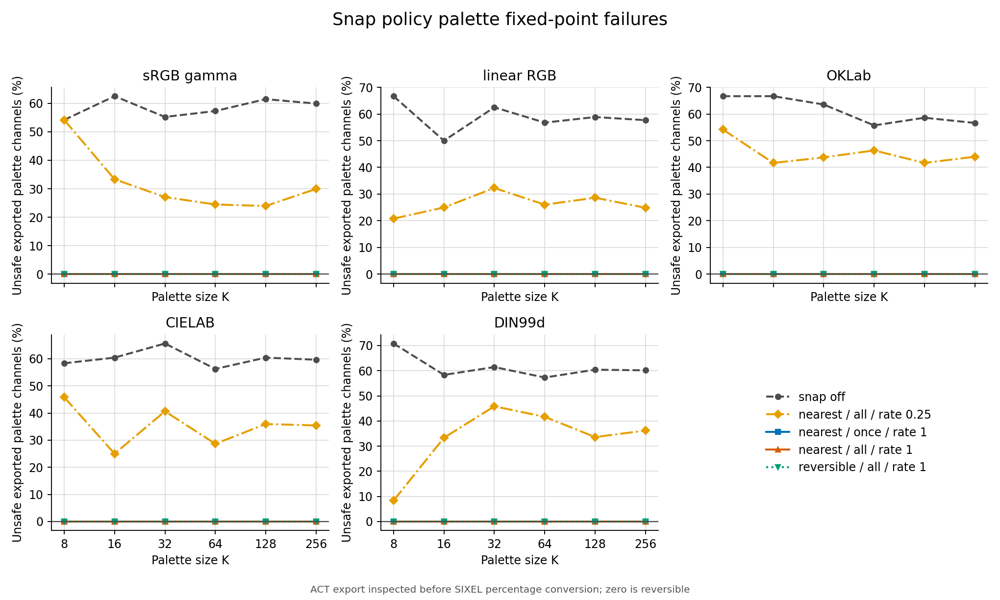
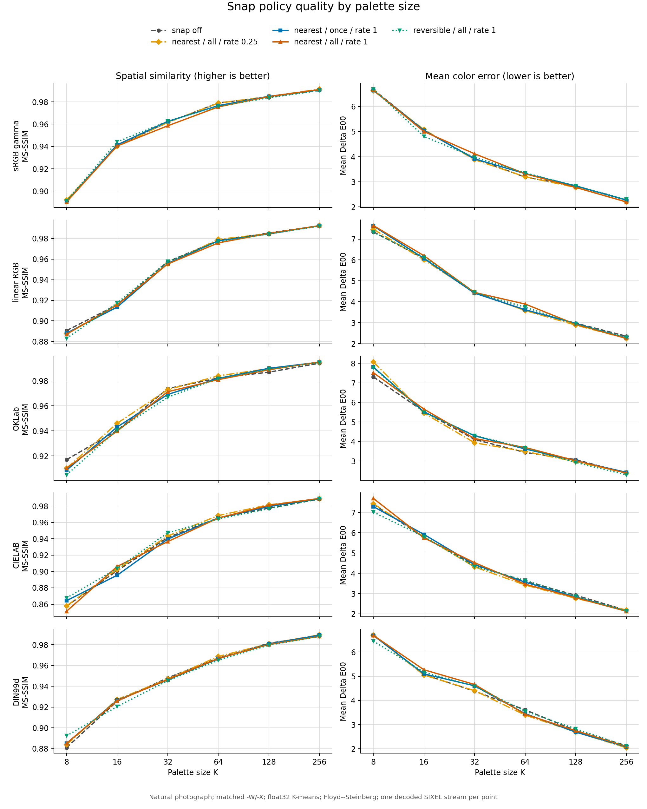
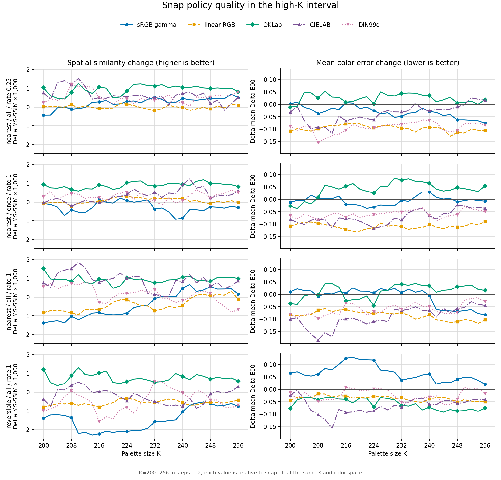
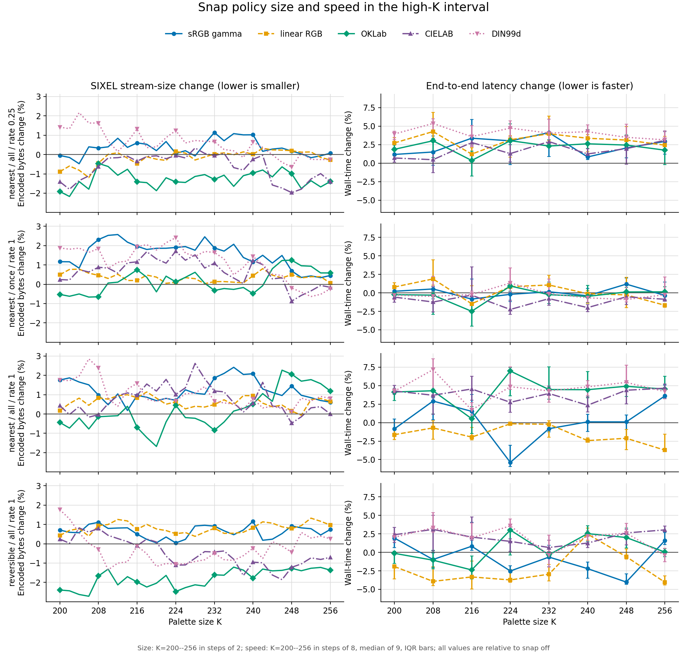
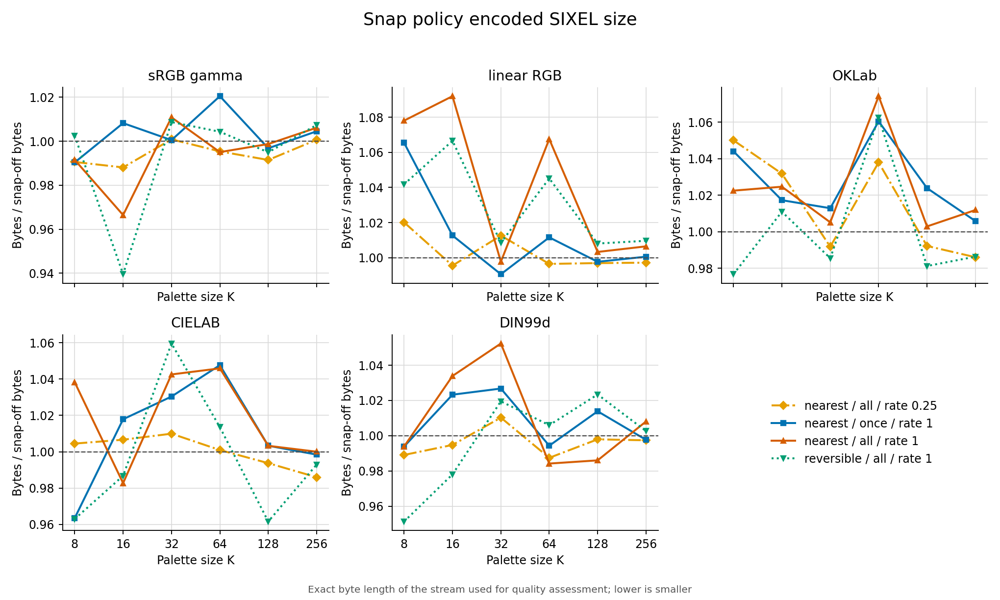
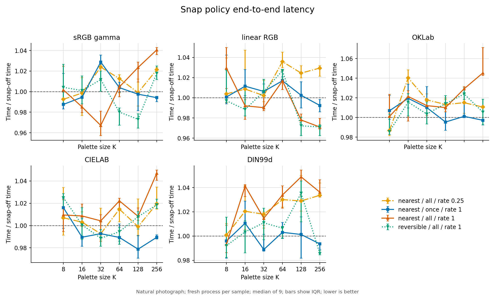
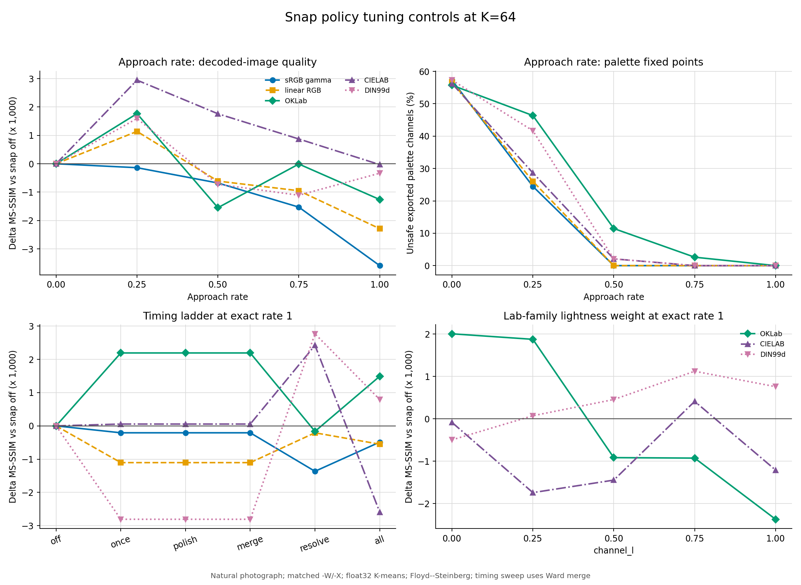
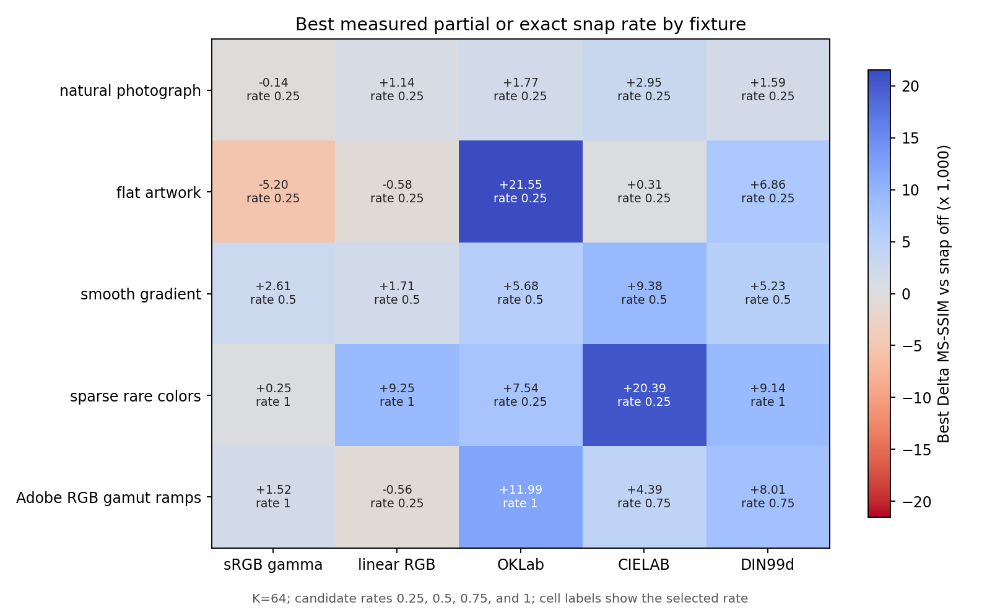

# Palette Snap Policy

`-_ POLICY` and `--snap-policy=POLICY` control whether and how the encoder maps palette channels onto the 101 RGB percentages that SIXEL can represent reversibly. This is a numeric stabilization transform, not gamut coverage repair: [`--cover-policy`](cover-policy.md) chooses or inserts palette anchors, while `--snap-policy` enables snapping and chooses its reversible target.

`none` disables the transform. `auto`, `nearest`, and `reversible` enable it. There is no separate enable switch.

## Why there are 101 safe tones

SIXEL RGB palette definitions carry integer percentages from 0 through 100. The decoder reconstructs an 8-bit channel from percentage $q$ as

$$
s_q = \left\lfloor\frac{255q + 50}{100}\right\rfloor, \qquad q \in \lbrace 0,\ldots,100 \rbrace.
$$

The resulting set $S=\lbrace s_0,\ldots,s_{100} \rbrace$ has 101 distinct byte values. The encoder converts a byte channel $x$ back to a SIXEL percentage as

$$
q(x) = \left\lfloor\frac{100x + 127}{255}\right\rfloor.
$$

For every $s_q \in S$, decoding the emitted percentage returns the same byte value. Arbitrary bytes outside $S$ generally move to a neighboring member of $S$ after one encode/decode cycle. Snapping the palette to $S^3$ before emission therefore removes that palette drift.

The concrete 8-bit tone set is:

```c
static unsigned char const sixel_reversible_tones[101] = {
      0,   3,   5,   8,  10,  13,  15,  18,  20,  23,
     26,  28,  31,  33,  36,  38,  41,  43,  46,  48,
     51,  54,  56,  59,  61,  64,  66,  69,  71,  74,
     77,  79,  82,  84,  87,  89,  92,  94,  97,  99,
    102, 105, 107, 110, 112, 115, 117, 120, 122, 125,
    128, 130, 133, 135, 138, 140, 143, 145, 148, 150,
    153, 156, 158, 161, 163, 166, 168, 171, 173, 176,
    179, 181, 184, 186, 189, 191, 194, 196, 199, 201,
    204, 207, 209, 212, 214, 217, 219, 222, 224, 227,
    230, 232, 235, 237, 240, 242, 245, 247, 250, 252,
    255
};
```

The 101 levels are per channel. This mechanism does not limit the palette to 101 colors; a palette entry is an RGB triplet whose three channels independently belong to the safe set.

## Pipeline position

The generated-palette construction path is:

```text
sampling -> palette-space transform -> binning -> quantizer (-Q)
                                                    |
                          optional early snap hooks selected by timing
                                                    |
                                                    v
                                  final palette merge (-F)
                                                    |
                                                    v
                         mandatory final snap when policy is not none
                                                    |
                                                    v
                                  palette cover repair (-a)
                                                    |
                                                    v
                     lookup preparation (-~) -> palette application (-d)
                                                    |
                                                    v
                                            SIXEL encoding
```

For a generated palette, the final snap runs whenever the policy is not `none`, independently of `timing`. The timing policy only adds earlier solver hooks. The fixed-palette selectors `-m`, `-b`, and `-e` currently accept snap options but bypass every snap consumer, preserving the supplied palette unchanged. This accepted no-op is retained for compatibility.

The current generated byte-palette ordering places cover repair after the final snap; a merge-funded cover replacement or image-derived soft anchor can therefore introduce a value outside the safe set. Until this interaction is given an ordering fix and a dedicated regression, use `--cover-policy=off` when the fixed-point guarantee is more important than gamut coverage.

## Policy values

The default is `none`, preserving the unconstrained palette pipeline unless snapping is requested explicitly.

### `none`

`none` disables all snap stages. Snap suboptions may still be parsed, but they have no effect until an enabling policy is selected.

### `auto`

`auto` resolves directly to `nearest`; it does not currently inspect the quantizer, working color space, palette size, or image. The distinct spelling leaves room for a future measured resolver without changing the explicit `nearest` contract.

### `nearest`

For a float or perceptual solver hook, `nearest` finds the lower and upper safe sRGB tone around each channel, forms at most $2^3=8$ RGB candidates, transforms each candidate into the active working color space, and chooses the candidate with minimum distance there. This avoids choosing three independently nearest sRGB channels when a different corner of the local safe-tone cell is closer in the actual clustering geometry.

For gamma and linear RGB, the candidate distance is ordinary squared Euclidean distance in the active coordinates. For Oklab, CIELAB, and DIN99d, `channel_l` supplies the lightness weight $\lambda$:

$$
d^2 = \lambda (\Delta L)^2 + \frac{1-\lambda}{2}(\Delta a)^2 + \frac{1-\lambda}{2}(\Delta b)^2.
$$

The final byte-palette pass uses the precomputed per-channel safe-tone table. It does not repeat the eight-candidate working-space search because the stored result has already crossed the 8-bit RGB boundary.

### `reversible`

`reversible` selects the legacy independent-channel mapping. Each 8-bit sRGB channel is replaced by its precomputed fixed point without comparing the other corners of the surrounding safe-tone cell in the working color space. It is cheaper and historically direct, but it can be a worse geometric choice for a palette represented in a Lab-family space.

Both `nearest` and `reversible` target the same 101-level set. Their difference is how a target RGB triplet is selected, not whether the result is SIXEL-representable.

## Timing policy

The `timing` suboption forms an additive ladder:

| Value | Snap stages |
| --- | --- |
| `once` | final output only |
| `polish` | `once` plus the pre-final-merge polish stage |
| `merge` | `polish` plus final-merge iterations |
| `resolve` | `merge` plus quantizer iterations |
| `all` | `resolve` plus initial seeds |

Earlier snapping constrains more of the solver trajectory to the reversible lattice. It can reduce the amount of movement at final output, but it can also prevent a continuous-space solver from reaching a better unconstrained local optimum. `once` is therefore the default.

## Approach rate

The `rate` suboption applies

$$
x' = x + \rho(s-x), \qquad 0 \le \rho \le 1,
$$

where $x$ is the current component in the active representation, $s$ is the selected safe-tone target, and `rate` is $\rho$. `rate=1` reaches the target and preserves exact safe-tone membership. `rate=0` leaves the clamped input unchanged. Intermediate rates intentionally relax the fixed-point guarantee and are quality-tuning controls rather than reversible output settings.

## Configuration and precedence

The top-level environment variable is `SIXEL_PALETTE_SNAP_POLICY`; explicit `-_` or `--snap-policy` wins over it. Snap suboptions similarly override their environment defaults.

| Long suboption | Short form | Environment default | Built-in default |
| --- | --- | --- | --- |
| `timing=once|polish|merge|resolve|all` | `Ivalue` | `SIXEL_PALETTE_SNAP_TIMING_POLICY` | `once` |
| `rate=FACTOR` | `AFACTOR` | `SIXEL_PALETTE_SNAP_APPROACH_RATE` | `1.0` |
| `channel_l=FACTOR` | `LFACTOR` | `SIXEL_PALETTE_SNAP_CHANNEL_FACTOR_L` | `0.85` |

Examples:

```sh
# Use the nearest-target policy and snap only final output.
img2sixel --snap-policy=nearest image.png

# Constrain every eligible Oklab solver stage to exact safe tones.
img2sixel -Woklab -_nearest:Iall:A1:L0.85 image.png

# Use the legacy independent-channel mapping and disable cover mutation.
img2sixel --snap-policy=reversible --cover-policy=off image.png
```

## Cost and measurement policy

The safe-tone table has 256 entries and fixed construction cost. A final byte-palette snap is $O(K)$ for $K \le 256$ palette entries. A `nearest` float/perceptual hook evaluates at most eight candidates per palette entry, so it is also $O(K)$ with a larger colorspace-conversion constant. Earlier timing levels multiply that bounded work by the number of solver and merge iterations at which the hook runs; they do not add a per-image-pixel lookup stage.

Snap quality is not monotonic. Exact snapping removes palette round-trip drift but perturbs solver output, and an intermediate `rate` can improve a one-generation metric while losing reversibility. A reproducible comparison should report palette fixed-point failures after encode/decode/re-encode, Delta E or MSE for channel perturbation, MS-SSIM for spatial impact, palette-build and end-to-end time, and exact SIXEL byte size. It should hold `-Q`, `-F`, `-a`, `-X`, precision, lookup, diffusion, and thread count fixed while sweeping policy, timing, rate, and palette size.

## Measured snapshot

The checked-in snapshot was produced from revision `bd00a0a034ff1e8fd4f233911f686a4aed0ea9ac` on arm64 macOS with Apple clang, `-O3`, and one encoder thread. The main comparison uses `images/snake.png`, palette sizes 8 through 256, matched clustering and working spaces (`-X` equals `-W`), the float32 pipeline, full-frame sampling, hard binning, seeded K-means, no final merge, cover off, exact lookup, GPU off, and Floyd--Steinberg dithering with raster scan. Holding these controls fixed isolates snap behavior but does not describe every possible encoder configuration.

The raw tables contain the complete command template for every point. [`snap-policy-run.json`](snap-policies/measurements/snap-policy-run.json) records compiler, build, fixture hashes, executable hashes, environment cleanup, and timing protocol.

### Palette fixed points



Figure: Percentage of ACT-exported palette channels that change after conversion to a SIXEL integer percentage and back. Lower is better; zero means every exported channel is a fixed point. Cover is disabled so a later cover mutation cannot invalidate the result.

With snap disabled, 41.7% to 68.8% of exported channels were outside the safe set. Every measured `rate=1` configuration reached zero failures for every palette size and color space. `rate=0.25` did not: its median unsafe-channel rate was 57.6%, and the observed range was 33.3% to 75.0%. An intermediate approach can accidentally converge to safe tones in a particular run, but only `rate=1` is the configuration-level guarantee.

### One-generation quality



Figure: Decoded-image quality for the natural fixture. MS-SSIM is the primary spatial metric; mean Delta E00 is a supporting color-error metric. Each point is one deterministic encode and decode with Floyd--Steinberg dithering enabled.

The following summary pools the 30 combinations of six palette sizes and five matched color spaces. Delta values compare each row with snap disabled at the same palette size and color space; time is the median of nine fresh processes after two warm-ups per point.

| Configuration | Exact palette fixed point | Median MS-SSIM change | MS-SSIM improvements | Median mean Delta E00 change | Median size change | Median time change |
| --- | --- | ---: | ---: | ---: | ---: | ---: |
| `nearest:timing=all:rate=0.25` | No | +0.000388 | 19 / 30 | -0.0174 | -0.23% | +1.08% |
| `nearest:timing=once:rate=1` | Yes | -0.000327 | 13 / 30 | +0.1313 | +2.55% | -0.29% |
| `nearest:timing=all:rate=1` | Yes | -0.001541 | 9 / 30 | +0.2147 | +2.56% | +0.70% |
| `reversible:timing=all:rate=1` | Yes | -0.000729 | 12 / 30 | +0.2844 | +3.22% | +0.75% |

Exact snapping is therefore a stability feature with a measurable but image-dependent one-generation cost, not a general quality optimization. The partial `rate=0.25` setting improved the median quality result but did not preserve palette fixed points. Neither observation justifies silently enabling snapping by default.

### High-palette-count focus

The six-point overview above is useful for detecting broad failures, but it is not the right scale for judging the subtle effect near a full 256-color palette. At low palette counts, the error introduced by representing an image with only $K$ colors dominates the much smaller perturbation made by snap. Snap still has exactly the same fixed-point purpose there; its practical contribution to one-generation image quality is simply difficult to distinguish from the much larger quantization loss.

The focused sweep therefore measures every even palette size from K=200 through K=256. It keeps every other quality control unchanged and subtracts the snap-disabled result at the same K and in the same color space. Speed uses the representative subset K=200, 208, ..., 256 with the same two-warm-up, nine-run protocol.



Figure: Change in MS-SSIM and mean Delta E00 relative to snap disabled at the same K and in the same matched clustering and working color space. The quality and size sweep uses K=200 through K=256 in steps of two. One deterministic `img2sixel` encode and decode is measured per quality point, with seeded K-means and Floyd--Steinberg dithering enabled.



Figure: Exact SIXEL byte-size change for every even K from 200 through 256, and end-to-end `img2sixel` wall-time change for K=200 through K=256 in steps of eight. Time markers are nine-run medians and bars are interquartile ranges. Every value uses snap disabled at the same K and color space as its zero baseline.

The following summary pools the 145 quality and size comparisons for each enabled configuration: 29 palette sizes times five matched color spaces. Time pools 40 comparisons: eight palette sizes times five spaces.

| Configuration | Exact palette fixed point | Median MS-SSIM change | MS-SSIM improvements | Median mean Delta E00 change | Median size change | Median time change |
| --- | --- | ---: | ---: | ---: | ---: | ---: |
| `nearest:timing=all:rate=0.25` | No | +0.000219 | 104 / 145 | -0.0119 | -0.16% | +2.61% |
| `nearest:timing=once:rate=1` | Yes | -0.000889 | 19 / 145 | +0.2219 | +2.22% | -0.18% |
| `nearest:timing=all:rate=1` | Yes | -0.001299 | 13 / 145 | +0.2944 | +2.09% | +3.48% |
| `reversible:timing=all:rate=1` | Yes | -0.001575 | 24 / 145 | +0.3096 | +2.48% | +1.28% |

The focused result makes the tradeoff visible without changing its interpretation. Exact snap reliably removes palette drift, but even near 256 colors it usually imposes a small one-generation fidelity and size cost on this fixture. The partial-rate configuration slightly improved the pooled quality and size medians, but its median unsafe-channel rate was 60.9%, so it is not an alternative way to obtain reversibility.

The curves are intentionally not fitted or interpolated. Changing K changes the seeded K-means solution and its local optimum, so neighboring points can move non-monotonically even though the comparison within each point remains controlled. The wall-time shifts are also small relative to several IQR bars; they describe this host and protocol, not a portable speed ranking.

### Size and speed



Figure: Exact byte length of the same SIXEL stream assessed for quality, divided by the snap-disabled length. A ratio below one is smaller. Exact settings increased the pooled median by 2.55% to 3.22%, although individual points ranged from reductions to increases.



Figure: End-to-end `img2sixel` wall time, including load, palette construction, palette application, dithering, and encoding. Each marker is a nine-run median, bars are the interquartile range, and each run starts a fresh process. The pooled median ratios ranged from 0.997 to 1.011; the largest observed ratio was 1.050. These small differences overlap process-level variation in several panels, so this snapshot supports “low overhead” rather than a claim that snapping accelerates encoding.

### Rate, timing, color-space, and fixture dependence



Figure: K=64 control sweeps. The rate and `channel_l` panels use the natural fixture with no final merge. The timing panel enables Ward merge so merge-stage hooks are eligible. All quality deltas are relative to snap disabled under the same controls.

On the natural fixture, `rate=0.25` improved MS-SSIM in all five tested spaces by 0.000362 to 0.001744. The earlier hypothesis that MS-SSIM improvement occurs only in sRGB is not supported by this snapshot. The effect is not universal: the multi-fixture sweep below contains negative cells, and exact snapping often reverses a partial-rate improvement.

The timing ladder has no uniformly best early-hook level. On this K=64 Ward case, `once`, `polish`, and `merge` produced identical decoded metrics within each space, while `resolve` and `all` changed the solver result in space-dependent directions. The `channel_l` sweep was also space-dependent: this single fixture favored 0 for Oklab and 1 for CIELAB and DIN99d. That is evidence against selecting a universal tuning value from one image, not evidence for changing those defaults to endpoints.



Figure: Best MS-SSIM change among rates 0.25, 0.5, 0.75, and 1 at K=64. A negative cell means every measured nonzero rate was worse than snap disabled. Nineteen of 25 fixture/space cells were positive, but the selected rate and benefit varied substantially; the flat-artwork Oklab cell is a particularly strong partial-rate result and should not be generalized to exact snapping.

### Reproduction and validation

From a clean tracked worktree with Matplotlib available to the selected Python interpreter, one command rebuilds the programs, verifies generated fixtures, removes `SIXEL_*` variables from the measurement environment, records the data, draws every figure, and validates row coverage and provenance:

```sh
tools/reproduce_snap_policy_measurements.sh
```

Use `PYTHON=/path/to/python` to select an interpreter with Matplotlib. Durable output requires exactly two warm-ups and nine recorded timing runs and refuses a dirty tracked worktree. An explicitly named non-documentation output directory can be used for a shorter exploratory run:

```sh
SNAP_POLICY_EXPLORATORY=1 SNAP_POLICY_WARMUPS=0 SNAP_POLICY_RUNS=1 \
    tools/reproduce_snap_policy_measurements.sh /tmp/libsixel-snap-policy
```

The checked-in raw data are [`snap-policy-quality.csv`](snap-policies/measurements/snap-policy-quality.csv), [`snap-policy-speed.csv`](snap-policies/measurements/snap-policy-speed.csv), [`snap-policy-controls.csv`](snap-policies/measurements/snap-policy-controls.csv), [`snap-policy-high-k.csv`](snap-policies/measurements/snap-policy-high-k.csv), and [`snap-policy-high-k-speed.csv`](snap-policies/measurements/snap-policy-high-k-speed.csv). Run `tools/check_snap_policy_measurements.py docs/functionality/snap-policies/measurements` to audit an existing durable snapshot without remeasuring it.

This snapshot measures one machine, one thread count, one quantizer family, and one dithering policy. It measures palette fixed-point membership directly but does not yet measure repeated full-image encode/decode cycles, animation flicker, cover-after-snap interaction, or statistical significance across hosts. Re-run the suite after changing snap, quantizer, colorspace, palette export, or percentage-conversion code; do not carry these numerical conclusions across such changes without refreshing the artifacts.

## Implementation references

The top-level schema and environment bindings are declared in [`options-registry.c`](../../src/options-registry.c). [`palette-common-snap.c`](../../src/palette-common-snap.c) owns safe-tone selection, working-space candidate comparison, timing, and approach rate; [`palette-common-snap.h`](../../src/palette-common-snap.h) owns the precomputed table and internal policy types. Quantizers call the shared snap hooks, while [`palette.c`](../../src/palette.c) owns their final composition with cover repair.

For neighboring stages, see [Palette Construction Pipeline](palette-pipeline.md), [Palette Quantization](quantization.md), [Palette Cover Policy](cover-policy.md), [Encoder Working Precision](precision.md), [Dithering](dithering.md), and [Lookup Policy](lookup-policy.md).

## Test coverage

<!-- test-coverage: enforced -->

Each automated contract has a stable ID and an owning test. The reciprocal `Policy:` reference in each test is checked by `staticcheck-doc-test-links`.

| ID | Contract | Owning test |
| --- | --- | --- |
| SP-01 | `reversible` has equivalent top-level short-option and environment behavior, materially enables snapping relative to `none`, and reaches the snap consumer independently of cover policy. | [tests/cli/options/regression/0024_snap_policy_reversible_image_regression.t](../../tests/cli/options/regression/0024_snap_policy_reversible_image_regression.t) |
| SP-02 | `timing=all` has equivalent short-suboption and environment behavior and reaches the snap consumer. | [tests/cli/options/regression/0137_snap_policy_timing_image_regression.t](../../tests/cli/options/regression/0137_snap_policy_timing_image_regression.t) |
| SP-03 | `rate` has equivalent short-suboption and environment behavior, reaches the snap consumer, clamps the environment value at the upper bound, and preserves the image-quality floor. | [tests/cli/options/regression/0138_snap_policy_rate_image_regression.t](../../tests/cli/options/regression/0138_snap_policy_rate_image_regression.t) |
| SP-04 | `channel_l` has equivalent short-suboption and environment behavior, reaches the snap consumer, clamps the environment value at the lower bound, and preserves the image-quality floor. | [tests/cli/options/regression/0139_snap_policy_channel_l_image_regression.t](../../tests/cli/options/regression/0139_snap_policy_channel_l_image_regression.t) |
| SP-05 | `--cover-policy` rejects the removed snap suboption namespace. | [tests/cli/options/matching/0279_option_matching_cover_snap_suboption_rejected.t](../../tests/cli/options/matching/0279_option_matching_cover_snap_suboption_rejected.t) |
| SP-06 | A PAL mapfile accepts an explicit snap policy but bypasses the snap consumer. | [tests/quant/palette/usage/0194_mapfile_pal_snap_policy_bypassed.t](../../tests/quant/palette/usage/0194_mapfile_pal_snap_policy_bypassed.t) |
| SP-07 | A built-in palette accepts an explicit snap policy but bypasses the snap consumer. | [tests/quant/palette/usage/0195_builtin_snap_policy_bypassed.t](../../tests/quant/palette/usage/0195_builtin_snap_policy_bypassed.t) |
| SP-08 | Monochrome accepts an explicit snap policy but bypasses the snap consumer. | [tests/quant/palette/usage/0196_monochrome_snap_policy_bypassed.t](../../tests/quant/palette/usage/0196_monochrome_snap_policy_bypassed.t) |

### Coverage audit boundary

The focused suite covers the top-level enable/disable path, every registered suboption consumer, and the accepted fixed-palette bypass for `-m`, `-b`, and `-e`. It does not yet directly test every policy spelling, invalid or empty top-level values, repeated-option last-wins behavior, multi-frame state, exact membership of all 101 tones, byte-for-byte re-encoding, or the ordering interaction with cover repair. The image tests enforce a broad MS-SSIM floor on one small fixture but do not replace the reproducible measurement suite described above.
