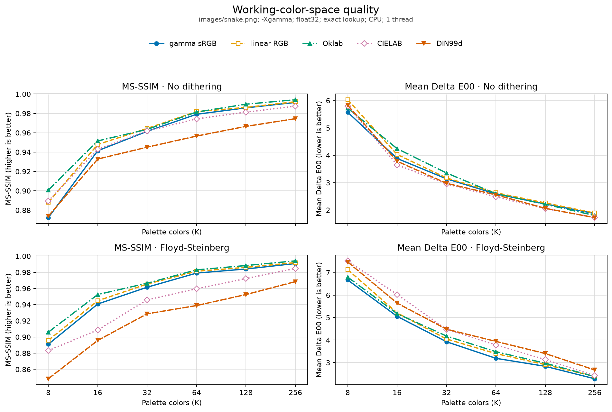
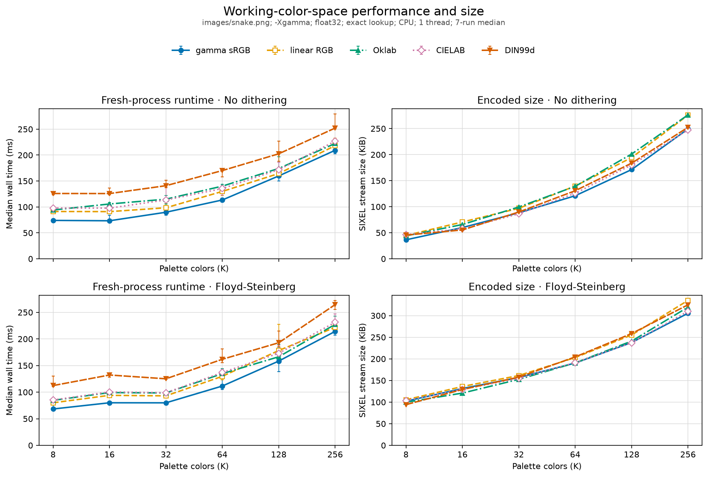

# Working Color Space

## Purpose

`img2sixel` uses `-W` to choose the coordinate system in which it applies a palette to an image:

```text
-W COLORSPACE
--working-colorspace=COLORSPACE
```

The accepted values are `gamma`, `linear`, `oklab`, `cielab`, and `din99d`. The default is `gamma`.

The working color space changes the geometry used by palette lookup and the components in which dithering error is calculated and propagated. It can therefore change visible structure, pointwise color error, runtime, memory use, and SIXEL stream size even when palette construction returns exactly the same palette colors.

`-W` does not describe the source image profile and does not select the RGB coordinates serialized into the SIXEL palette. Loader color management and the complete `-X` / `-W` / `-U` model are introduced in [Color spaces and loader color management](../concepts/colorspace.md).

## Pipeline boundary

For a generated palette, the relevant path is:

```text
loaded or preprocessed frame
          |
          +------------------------+
          |                        |
          v                        v
palette-building view        main image view
converted to -X              converted to -W
          |                        |
sampling, binning,                 |
and quantization                   |
          |                        |
palette in -X                      |
          |                        |
convert K entries -X -> -W         |
          +------------+-----------+
                       |
                       v
          lookup and dithering in -W
                       |
                       v
          convert palette -W -> -U
                       |
                       v
             SIXEL palette and indices
```

The three encoder color-space controls own different boundaries:

| Option | Boundary | Observable effect |
| --- | --- | --- |
| `-X`, `--clustering-colorspace` | palette construction | Changes the samples, distances, partitions, and representatives seen by a generated-palette algorithm. |
| `-W`, `--working-colorspace` | palette application | Changes nearest-color geometry and the components in which dither error is propagated. |
| `-U`, `--output-colorspace` | palette serialization | Converts the final palette before writing SIXEL color definitions; it does not repeat lookup. |

Fixed palettes bypass `-X`, but they do not bypass `-W`: the supplied palette and the main image must still meet in one working representation before lookup. `-U` remains a later output conversion in either case.

## Default and option coupling

`-Wgamma` is the default working geometry. If the user specifies `-W` while never specifying `-X`, palette construction follows the selected working space as a convenience. This makes a command such as `-Woklab` use Oklab for both construction and application.

An explicit `-X` is authoritative regardless of option order. These commands therefore have the same split geometry:

```sh
img2sixel -Xgamma -Woklab image.png
img2sixel -Woklab -Xgamma image.png
```

This coupling matters when evaluating `-W`. A comparison that changes only `-W` must set `-X` explicitly; otherwise it also changes palette construction and cannot attribute the result to palette application alone.

## Mathematical role

Let `phi_W(c)` be a color represented in the three coordinates selected by `-W`, and let `P` be the palette after conversion into that same space. The exact `none` lookup policy assigns a pixel `c` to:

```text
q(c) = arg min_i ||phi_W(c) - phi_W(P[i])||^2
```

The implementation evaluates an ordinary squared Euclidean distance across all three stored components. Approximate lookup policies build different search structures or quantize the address space, but the selected `-W` coordinates still define their input geometry. Their exactness and cost are documented separately in [Lookup policy](lookup-policy.md).

For an error-diffusion method, the value presented to lookup also contains error accumulated from earlier pixels. After choosing palette entry `q`, a representative recurrence is:

```text
y_t = clamp_W(phi_W(c_t) + accumulated_error_t)
e_t = y_t - phi_W(P[q])
accumulated_error_j += a_j * e_t
```

The coefficients `a_j` and scan order are properties of `-d`; the components of `e_t`, their ranges, and the clamping boundary are properties of `-W` and the effective pixel format. Thus `-W` and `-d` are not independent quality decisions. The detailed kernels and their spatial behavior are covered by [Dithering](dithering.md).

The Lab-family formats use libsixel's normalized component ranges. Consequently, Euclidean lookup in `cielab` is not literally Delta E76 in unscaled CIELAB units, and none of these lookup distances is CIEDE2000. The Delta E00 values in this document are evaluation metrics computed by `lsqa` after decoding, not the encoder's lookup objective.

## Cost model

For `N` image pixels, `K` palette entries, and fixed depth `d = 3`, converting the main image to `-W` is `O(N)` and converting a generated palette from `-X` to `-W` is `O(K)`. Exact exhaustive lookup is `O(N K d)`, while a fixed-neighborhood diffusion kernel adds `O(N d)` work. Selecting a different working color space does not change these asymptotic orders, but it changes conversion cost, pixel representation, per-channel clamping, and memory traffic.

In normal use, `-Wgamma` can retain `RGB888`, which uses three bytes per pixel, or use `RGBFLOAT32` when `--precision=float32` is requested. Every non-gamma `-W` requires a typed float32 representation with three four-byte components, so it uses twelve bytes per RGB pixel before additional pipeline buffers. The resulting precision and implicit-promotion rules are described in [Pixel-format precision](../concepts/pixelformat-precision.md) and [Encoder working precision](precision.md).

The formal comparison below forces float32 for all spaces. It therefore measures color geometry and its implementation constants without giving `gamma` the separate advantage of an 8-bit path. Real commands that leave precision at its default can show a larger or differently distributed runtime and memory gap.

## `gamma`: gamma-encoded sRGB coordinates

`-Wgamma` compares and diffuses the displayed sRGB code values. Its normalized vector is `(R_srgb, G_srgb, B_srgb)`, with each component in `[0, 1]` on the float32 path or `[0, 255]` on the byte path.

This space is inexpensive when image and palette data are already gamma-encoded sRGB, and it is the compatibility default. Its geometry is not perceptually uniform and arithmetic differences do not represent additive light, but the nonlinear transfer devotes more code-value resolution to dark linear-light values. That can be beneficial for some pointwise errors even when a perceptual space produces better spatial structure.

The sRGB transfer function is defined in the [W3C CSS Color 4 sRGB definitions](https://www.w3.org/TR/css-color-4/#predefined-sRGB).

## `linear`: linear-light sRGB coordinates

`-Wlinear` removes the sRGB transfer function and performs lookup and error propagation in `(R_linear, G_linear, B_linear)`. Vector addition in this space follows additive light, which makes it a natural choice when the arithmetic itself should conserve radiometric energy.

Unweighted Euclidean distance in linear RGB is not perceptually uniform. A numerically similar error can have very different visibility at different luminances, and bright linear-light differences can dominate a distance calculation. This option requires `LINEARRGBFLOAT32` working storage.

## `oklab`: approximately perceptual opponent coordinates

`-Woklab` converts linear sRGB through the published Oklab matrices and cube-root nonlinearity, then compares and diffuses `(L, a, b)` coordinates. libsixel stores `L` in `[0, 1]` and the opponent components in their native float range clamped to `[-0.5, 0.5]`.

Oklab was designed so that Euclidean geometry behaves more consistently with perceived lightness, chroma, and hue than ordinary RGB coordinates. It is still an approximation rather than a promise to minimize CIEDE2000 or an image-wide structural metric. The definition and motivation are in Bjorn Ottosson's [A perceptual color space for image processing](https://bottosson.github.io/posts/oklab/).

The checked-in fixture shows the distinction clearly: with Floyd--Steinberg dithering, Oklab has the highest MS-SSIM at every measured palette size, while gamma has the lowest mean Delta E00 at every size. One metric rewards retained spatial structure and the other averages pointwise perceptual color difference; neither result invalidates the other.

## `cielab`: normalized CIE 1976 L*a*b*

`-Wcielab` uses CIELAB derived through D65 XYZ. libsixel normalizes `L*` by `100`, normalizes `a*` and `b*` by `128`, and clamps the two opponent coordinates to `[-1.5, 1.5]` for typed float storage.

This normalization is part of the working metric because lookup applies equal Euclidean weights to the stored coordinates. It must not be confused with running a CIEDE2000 calculation for every palette candidate. CIELAB reduces several distortions of RGB geometry, but it is not uniformly perceptual across its full gamut and its conversions cost more than staying in gamma sRGB.

The CIELAB equations and D50/D65 adaptation context are summarized in [CSS Color Module Level 4](https://www.w3.org/TR/css-color-4/#lab-colors).

## `din99d`: DIN99d opponent coordinates

`-Wdin99d` converts through CIELAB and applies the DIN99d lightness, chroma, and hue transformation. libsixel stores `L99d / 100` and `a99d / 50`, `b99d / 50`, with normalized opponent components clamped to `[-1, 1]`.

DIN99d was designed to improve the uniformity of Euclidean color differences relative to CIELAB. In libsixel it remains a normalized three-coordinate lookup geometry, not a direct implementation of Delta E00. The transformation follows Cui et al., [Uniform colour spaces based on the DIN99 colour-difference formula](https://onlinelibrary.wiley.com/doi/abs/10.1002/col.10066).

This was the slowest working space in the checked-in end-to-end run. That observation includes conversion, typed-format handling, lookup, and optional diffusion; it is not an isolated benchmark of the DIN99d equations.

## Measurement design

The checked-in comparison asks one narrow question: how does `-W` change decoded quality, wall time, and stream size when palette construction and numeric precision are held fixed?

The fixture is the 600-by-450 RGB [`images/snake.png`](../../images/snake.png). The sweep covers `K = 8, 16, 32, 64, 128, 256`, with both `--diffusion=none` and Floyd--Steinberg `--diffusion=fs`. Every row fixes `--precision=float32`, `-Xgamma`, `-Ugamma`, exact `--lookup-policy=none`, one CPU thread, GPU off, the builtin loader, full-frame sampling, hard binning, `kmeans:seed=1:binbits=6`, no merge, cover off, RGB palette output, full quality, and fast encoding.

The preflight validates the exact typed working format, explicit `-X` and `-W` state, K-means model, hard binning, exact lookup, and zero quantizer retries. Quality and size come from one deterministic SIXEL stream: `lsqa` compares its decoded image with the source, and the stream byte length is recorded exactly. Runtime uses a fresh process with output discarded, two warmups, seven measured runs, rotated and reversed configuration order, and the median with an interquartile interval.

This protocol deliberately does not measure the implicit `-X` coupling of a lone `-W`, an 8-bit-versus-float32 transition, approximate lookup, multiple threads, GPU paths, animation, other image content, or other dither policies. Those are separate axes and should not be inferred from these figures.

## Quality results



Figure: `img2sixel` working-color-space quality on `images/snake.png`; `-Xgamma`, float32, exact lookup, CPU, and one thread. Higher MS-SSIM is better; lower mean Delta E00 is better.

Without dithering, Oklab has the highest MS-SSIM at `K = 8, 16, 128, 256`, while linear RGB leads at `K = 32, 64`. Mean Delta E00 instead favors gamma at `K = 8`, CIELAB from `K = 16` through `128`, and DIN99d at `K = 256`. With Floyd--Steinberg, Oklab leads MS-SSIM and gamma leads mean Delta E00 at every measured `K`.

The `K = 256` endpoint makes the metric disagreement concrete:

| Dither | Working space | MS-SSIM | Mean Delta E00 | Mean Delta Chroma |
| --- | --- | ---: | ---: | ---: |
| none | gamma | 0.991358 | 1.871517 | 1.342110 |
| none | linear | 0.992071 | 1.888680 | 1.902482 |
| none | oklab | 0.994156 | 1.799481 | 1.657200 |
| none | cielab | 0.987537 | 1.731550 | 1.181970 |
| none | din99d | 0.974573 | 1.721529 | 1.222570 |
| fs | gamma | 0.990880 | 2.281684 | 1.825853 |
| fs | linear | 0.991998 | 2.384097 | 2.620727 |
| fs | oklab | 0.994171 | 2.378958 | 2.258366 |
| fs | cielab | 0.984748 | 2.420114 | 1.760536 |
| fs | din99d | 0.968514 | 2.671829 | 1.989471 |

There is no single quality ordering. A working space changes both the nearest palette index and, under error diffusion, the future spatial error field. Choosing solely from one average metric would hide that interaction. Oklab is a strong choice when structural similarity is the priority on this fixture; gamma, CIELAB, or DIN99d can report lower pointwise color error under particular dither and palette-size conditions.

## Runtime and stream-size results



Figure: `img2sixel` fresh-process runtime and encoded size on `images/snake.png`; `-Xgamma`, float32, exact lookup, CPU, one thread, two warmups, and a seven-run median. Runtime whiskers show the interquartile range; stream size is measured from the quality-pass SIXEL bytes.

Gamma is the fastest measured working space at every `K` under both dither conditions, even though the experiment forces its float32 path. Relative to gamma, the observed median runtime ranges are:

| Working space | No dither | Floyd--Steinberg |
| --- | ---: | ---: |
| linear | 1.03x to 1.24x | 1.04x to 1.17x |
| oklab | 1.06x to 1.44x | 1.05x to 1.24x |
| cielab | 1.08x to 1.33x | 1.08x to 1.25x |
| din99d | 1.20x to 1.72x | 1.22x to 1.65x |

These are end-to-end timings, not conversion-only microbenchmarks. Exact lookup remains `O(NK)` for every row; the growing curves primarily reflect the common exhaustive search, while color conversion and working-format operations alter the constant cost.

Stream size also changes because different working geometry selects different palette indices and therefore changes SIXEL plane occupancy and run structure. Relative to gamma, measured size ranges are 1.097x--1.231x for linear, 1.097x--1.209x for Oklab, 0.962x--1.270x for CIELAB, and 0.924x--1.249x for DIN99d without dithering. With Floyd--Steinberg they narrow to 1.029x--1.097x, 0.920x--1.046x, 0.985x--1.015x, and 0.922x--1.087x respectively. A perceptual working space is therefore not inherently larger or smaller on the wire.

## Choosing a working space

- Start with `gamma` when compatibility, lower memory, and speed are more important than changing the palette-application geometry.
- Evaluate `oklab` when spatial structure and smooth perceived transitions are important; on this fixture it provides the strongest MS-SSIM results, especially with Floyd--Steinberg.
- Use `linear` when the arithmetic should follow additive light, but do not assume linear Euclidean distance is perceptually uniform.
- Evaluate `cielab` or `din99d` when pointwise perceptual color error is the primary concern, while accounting for their normalized project-specific geometry and measured runtime cost.
- Match `-X` and `-W` when one coherent geometry is desired. Set both explicitly when benchmarking, or when intentionally using different palette-construction and palette-application spaces.
- Re-measure representative content. The checked-in run is evidence for one image and one controlled pipeline, not a universal default-selection study.

## Reproduction and validation

The one-command entry point rebuilds the current clean revision, records the complete sweep, regenerates both figures, and validates provenance and the full 60-point grid:

```sh
tools/reproduce_working_colorspace_measurements.sh
```

The plotter requires Python 3 and Matplotlib. `img2sixel` and `lsqa` must be enabled in the selected build. Set `PYTHON`, `BUILD_DIR`, `IMG2SIXEL_PATH`, or `LSQA_PATH` when they are not at their defaults. The wrapper refuses a dirty tracked worktree so that durable measurements identify one reproducible source revision.

The checked-in run was recorded on 2026-09-09 from clean revision `d1aa5b4da` on macOS arm64. Its build disabled the two Quick Look targets; the full configure arguments, compiler identity, binary hashes, input hash, command controls, and timing protocol are recorded in [`working-colorspace-run.json`](working-colorspaces/measurements/working-colorspace-run.json). The complete numeric data are in [`working-colorspace-comparison.csv`](working-colorspaces/measurements/working-colorspace-comparison.csv).

Validate existing artifacts without rerunning the benchmark:

```sh
python3 tools/check_working_colorspace_measurements.py \
    docs/functionality/working-colorspaces/measurements
```

## Implementation references

- [`src/encoder.c`](../../src/encoder.c) parses `-W`, resolves its relationship with `-X` and precision, creates the effective frame format, and converts generated palette entries from `-X` to `-W`.
- [`src/colorspace.c`](../../src/colorspace.c) defines the transfer functions, matrices, Lab-family transforms, normalization ranges, clamping, and typed conversions.
- [`src/lookup-policy-none.c`](../../src/lookup-policy-none.c) shows the exact squared-Euclidean lookup used to isolate this measurement.
- [`src/dither-policy-fs.c`](../../src/dither-policy-fs.c) applies Floyd--Steinberg error diffusion to float32 working components.
- [`tools/plot_working_colorspace_measurements.py`](../../tools/plot_working_colorspace_measurements.py) owns the controlled commands, measurements, and figures.
- [`tools/check_working_colorspace_measurements.py`](../../tools/check_working_colorspace_measurements.py) validates provenance, the command contract, numeric fields, hashes, and the complete grid.

## Test coverage

<!-- test-coverage: enforced -->

| ID | Contract | Owning test |
| --- | --- | --- |
| WC-01 | Returning to `-Wgamma` preserves an explicit 8-bit precision request regardless of option order. | [tests/cli/options/matching/0269_option_matching_precision_8bit_working_gamma_order.t](../../tests/cli/options/matching/0269_option_matching_precision_8bit_working_gamma_order.t) |
| WC-02 | `-Wlinear` promotes an explicit 8-bit base request to `linear-f32`, representing the float-only working-space transition. | [tests/cli/options/matching/0270_option_matching_precision_8bit_float_working_space.t](../../tests/cli/options/matching/0270_option_matching_precision_8bit_float_working_space.t) |
| WC-03 | `-Wgamma` preserves an explicit float32 precision request. | [tests/cli/options/matching/0272_option_matching_precision_float32_working_gamma.t](../../tests/cli/options/matching/0272_option_matching_precision_float32_working_gamma.t) |
| WC-04 | Explicit `-Xgamma -Wgamma` produces a decoded result above the project MS-SSIM floor. | [tests/quant/palette/usage/0064_clustering_gamma_working_gamma_lsqa.t](../../tests/quant/palette/usage/0064_clustering_gamma_working_gamma_lsqa.t) |
| WC-05 | Explicit `-Xgamma -Wlinear` produces a decoded result above the project MS-SSIM floor. | [tests/quant/palette/usage/0065_clustering_gamma_working_linear_lsqa.t](../../tests/quant/palette/usage/0065_clustering_gamma_working_linear_lsqa.t) |
| WC-06 | Explicit `-Xgamma -Woklab` produces a decoded result above the project MS-SSIM floor. | [tests/quant/palette/usage/0066_clustering_gamma_working_oklab_lsqa.t](../../tests/quant/palette/usage/0066_clustering_gamma_working_oklab_lsqa.t) |
| WC-07 | Explicit `-Xgamma -Wcielab` produces a decoded result above the project MS-SSIM floor. | [tests/quant/palette/usage/0067_clustering_gamma_working_cielab_lsqa.t](../../tests/quant/palette/usage/0067_clustering_gamma_working_cielab_lsqa.t) |
| WC-08 | Explicit `-Xgamma -Wdin99d` produces a decoded result above the project MS-SSIM floor. | [tests/quant/palette/usage/0068_clustering_gamma_working_din99d_lsqa.t](../../tests/quant/palette/usage/0068_clustering_gamma_working_din99d_lsqa.t) |

### Coverage boundary

The automated tests lock the effective precision transition and a minimum decoded-quality contract for every accepted working space under explicit gamma clustering. They do not freeze exact metric rankings, timings, stream sizes, repeated-option resolution, invalid-value diagnostics, approximate lookup interactions, other dither policies, threaded execution, GPU execution, or animation. The measurement checker protects the recorded protocol and artifacts, but the benchmark is intentionally not a timing-sensitive CI regression test.
