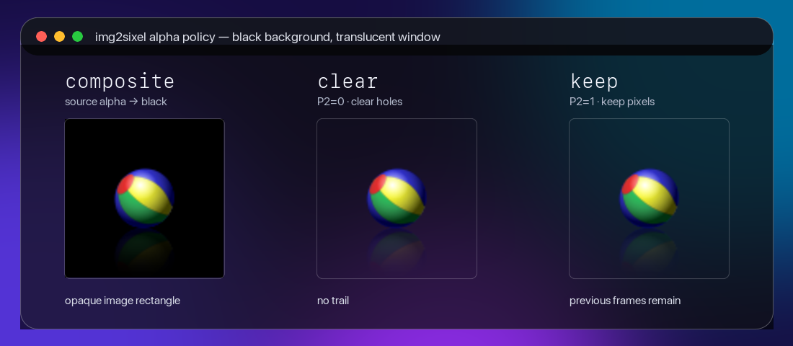

# Alpha Policy

The alpha policy defines where source alpha is resolved and what an omitted
SIXEL pixel asks the terminal to do. It is selected with
`img2sixel --alpha-policy=POLICY` (short form `-A POLICY`) or the
`SIXEL_ALPHA_POLICY` environment variable. An explicit command-line option
takes precedence over the environment.

## Alpha model

SIXEL has no per-pixel alpha channel. A SIXEL data bit either paints the
selected palette color or leaves that position unpainted. DCS `P2` tells the
terminal what to do with unpainted positions; it does not carry an alpha value
and cannot express partial transparency.

libsixel nevertheless accepts alpha-bearing source files and memory formats
such as RGBA, ARGB, BGRA, ABGR, gray-alpha, and alpha-gray. Loader paths
resolve that source alpha before palette encoding.
Semi-transparent pixels are composited when a background is available.
Fractional alpha cannot survive in SIXEL:

- an exact alpha-zero sample may remain an unpainted pixel under `clear` or
  `keep`;
- after normalization, color samples and alpha-zero coverage are represented
  separately, commonly as RGB or three-channel float pixels plus a binary
  per-pixel mask, or as indexed pixels plus a transparent palette index.

A frame can temporarily retain an alpha-bearing packed pixel format. This is
needed by public frame APIs and by loader backends whose normalization happens
at a later boundary. The frame therefore carries transparency metadata as
well as a pixel-format tag; the encoder handles either an alpha-bearing buffer
or an already separated mask. See
[Pixel Formats and Alpha Representation](../concepts/pixelformat.md) for the
full distinction between source, frame, and wire representations.

## Policies

| Policy | Loader treatment | SIXEL treatment |
| --- | --- | --- |
| `auto` | Preserve source alpha without terminal background probing. | Select `clear` normally and `keep` when transparent offset or 6delta output requires retained pixels. |
| `composite` | Composite source alpha over the resolved background. | Emit opaque output when composition succeeds. If no background can be resolved, fall back to `keep`. |
| `clear` | Preserve alpha-zero pixels. | Omit alpha-zero pixels and emit DCS `P2=0`, requesting the terminal to clear omitted pixels. |
| `keep` | Preserve alpha-zero pixels. | Omit alpha-zero pixels and emit DCS `P2=1`, requesting the terminal to keep existing pixels. |

`auto` is the default. These are the only accepted policy names. If no
background is available, exact alpha zero can still become an omitted pixel,
but nonzero fractional alpha cannot remain fractional in the SIXEL output.

## Visual comparison

The following APNG illustrates the policies with a black terminal background
and a translucent window. `composite` produces an opaque image rectangle,
`clear` removes omitted pixels on each frame, and `keep` leaves earlier image
pixels in place. This is an illustration of the requested operations, not a
promise that every terminal will produce the same pixels.

A [GIF fallback](assets/alpha-policy-comparison.gif) is available for viewers
without APNG animation support. The bouncing-ball source is by Holger Will and
is [released into the public domain](https://commons.wikimedia.org/wiki/File:Animated_PNG_example_bouncing_beach_ball.png).

`clear` and `keep` name the requested operation rather than claiming portable
transparency. SIXEL renderers differ in how graphics interact with the text
plane, earlier graphics, and a translucent terminal window. In xterm and
mlterm, `P2=1` holes commonly keep the existing graphics content. Other
terminals can produce a different visible result: P2 rendering is
terminal-dependent. `P2=0` and `P2=1` never perform source alpha blending;
blending belongs to the loader.

## Background resolution

The loader may resolve a background from these sources:

- `-B COLOR` or `SIXEL_BGCOLOR`;
- an OSC 11 terminal background reply when probing is enabled and succeeds;
- a file background such as PNG `bKGD` or the GIF logical-screen background.

Background selection is a separate policy axis. See
[Background Policy](background-policy.md) for source priority, option
precedence, colorspace, and OSC 11 controls. OSC 11 is queried only for an
effective `composite` alpha policy.

When `composite` cannot resolve any source, the loader must not expose hidden
RGB from fully transparent pixels as visible output. It retains the alpha-zero
mask, and the encoder falls back to the `keep` request with `P2=1`.

## Loader and encoder boundary

The loader owns alpha normalization. If it composites onto a background, the
resulting frame is opaque and must not carry an alpha-zero mask. If it
preserves alpha zero, it records that state in the frame's transparent index
or per-pixel mask.

The encoder trusts that frame state. It reserves a key color only when the
frame still contains transparency, then selects `P2` from the requested
policy. It must not discard a loader-provided mask merely because the policy
is `composite`: such a mask means that background resolution failed and the
loader intentionally used the `keep` fallback.

The builtin RGBA and non-indexed PNG paths preserve source RGB for alpha-zero
pixels under `clear` and `keep`, while still compositing partial alpha over an
available background. Under `composite`, they composite all alpha,
including alpha zero, and clear the mask after successful composition.

## Related options

`--transparent-offset` and 6delta output require `keep` because their retained
pixels rely on the `P2=1` image-plane request. `auto` selects `keep` for either
feature. Explicit `clear` and `composite` are rejected when either feature is
active.

## Test coverage

<!-- test-coverage: enforced -->

Each automated contract has a stable ID and an owning test. The reciprocal
`Policy:` reference in each test is checked by `staticcheck-doc-test-links`.

| ID | Contract | Owning test |
| --- | --- | --- |
| AP-01 | `auto` is the default, explicit `auto` matches it, and normal output resolves to `clear`. | [tests/quant/palette/usage/0183_auto_policy_defaults_clear.t](../../tests/quant/palette/usage/0183_auto_policy_defaults_clear.t) |
| AP-02 | `composite` fills alpha-zero pixels from a resolved explicit background. | [tests/loader/builtin/0044_loader_builtin_composite_policy_fills_transparency.t](../../tests/loader/builtin/0044_loader_builtin_composite_policy_fills_transparency.t) |
| AP-03 | `clear` preserves alpha zero and emits DCS `P2=0`. | [tests/quant/palette/usage/0182_clear_policy_header_selection.t](../../tests/quant/palette/usage/0182_clear_policy_header_selection.t) |
| AP-04 | `keep` preserves alpha zero and emits DCS `P2=1`, even when `-B` exists. | [tests/quant/palette/usage/0167_keep_policy_preserves_alpha_zero.t](../../tests/quant/palette/usage/0167_keep_policy_preserves_alpha_zero.t) |
| AP-05 | Unresolved `composite` falls back to mask retention and DCS `P2=1`. | [tests/quant/palette/usage/0184_composite_policy_without_color_falls_back_keep.t](../../tests/quant/palette/usage/0184_composite_policy_without_color_falls_back_keep.t) |
| AP-06 | Only the canonical policy names are accepted; unreleased aliases remain rejected. | [tests/quant/palette/usage/0185_alpha_policy_rejects_unreleased_names.t](../../tests/quant/palette/usage/0185_alpha_policy_rejects_unreleased_names.t) |
| AP-07 | Environment parsing accepts all policies and invalid values fall back to `auto`/`clear`. | [tests/loader/builtin/1496_loader_builtin_alpha_policy_strict_fallback.t](../../tests/loader/builtin/1496_loader_builtin_alpha_policy_strict_fallback.t) |
| AP-08 | `SIXEL_ALPHA_POLICY` and `-A` produce equivalent results for the same value. | [tests/cli/options/migration/0011_alpha_policy_environment_cli_equivalence.t](../../tests/cli/options/migration/0011_alpha_policy_environment_cli_equivalence.t) |
| AP-09 | Explicit `-A` takes precedence over `SIXEL_ALPHA_POLICY`. | [tests/cli/options/matching/0274_option_matching_alpha_policy_cli_precedence.t](../../tests/cli/options/matching/0274_option_matching_alpha_policy_cli_precedence.t) |
| AP-10 | Repeated environment assignments use the last value and remain stable across multiple inputs. | [tests/loader/builtin/0164_loader_builtin_trns_keycolor_multi_input_sequence.t](../../tests/loader/builtin/0164_loader_builtin_trns_keycolor_multi_input_sequence.t) |
| AP-11 | Transparent offset resolves default `auto` to `keep` and emits retained-plane geometry. | [tests/quant/palette/usage/0169_transparent_offset_header_geometry.t](../../tests/quant/palette/usage/0169_transparent_offset_header_geometry.t) |
| AP-12 | Transparent offset rejects an explicitly incompatible alpha policy. | [tests/quant/palette/usage/0170_transparent_offset_policy_conflict.t](../../tests/quant/palette/usage/0170_transparent_offset_policy_conflict.t) |
| AP-13 | 6delta resolves default `auto` to `keep`. | [tests/quant/palette/usage/0186_6delta_auto_policy_selects_keep.t](../../tests/quant/palette/usage/0186_6delta_auto_policy_selects_keep.t) |
| AP-14 | 6delta rejects an explicitly incompatible alpha policy. | [tests/quant/palette/usage/0187_6delta_explicit_alpha_policy_conflict.t](../../tests/quant/palette/usage/0187_6delta_explicit_alpha_policy_conflict.t) |
| AP-15 | OSC 11 probing is gated to `composite` and requires an eligible terminal stream. | [tests/loader/0052_loader_osc11_query_control.c](../../tests/loader/0052_loader_osc11_query_control.c) |
| AP-16 | The default `auto` path suppresses OSC 11 while explicit `composite` reaches the query gate. | [tests/cli/options/regression/0116_loader_osc11_query_image_regression.t](../../tests/cli/options/regression/0116_loader_osc11_query_image_regression.t) |
| AP-17 | Partial-alpha composition uses the selected background colorspace. | [tests/cli/options/regression/0098_loader_background_colorspace_image_regression.t](../../tests/cli/options/regression/0098_loader_background_colorspace_image_regression.t) |

### Coverage audit boundary

The automated inventory covers policy parsing, defaults, precedence, all four
effective behaviors, unresolved-background fallback, multi-input state, OSC 11
gating, and the transparent-offset and 6delta interactions. Actual rendering
of DCS `P2=0` and `P2=1` by xterm, mlterm, and other terminals is deliberately
not classified as automated library coverage: that result belongs to the
external terminal renderer. The tests verify the exact DCS request emitted by
libsixel; the visual comparison above documents representative renderer
behavior without claiming portability.
