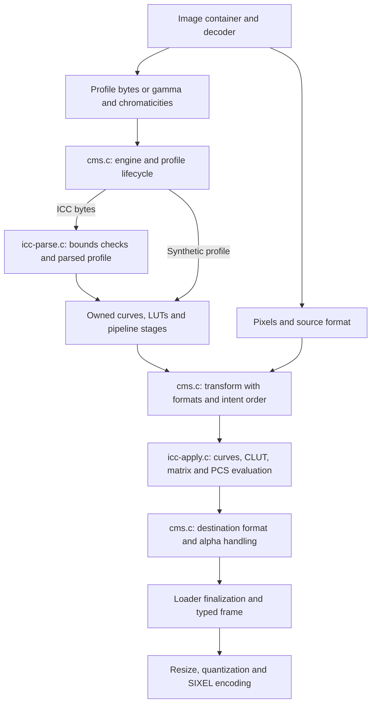

# Builtin CMS: Specification Scope and Implementation Architecture

## Purpose and boundary

Builtin CMS is a color-management subsystem: it parses profile data, constructs reusable representations of color transforms, selects rendering paths, evaluates those paths, and converts between source and destination representations. Its complexity is closer to a small color-management library than to a gamma correction helper. It lives inside libsixel because loader normalization must remain available on supported builds without an external CMS. The [user guide](color-management.md) explains that availability decision, the additional attack surface, engine selection, and visual examples.

The principal loader use is to interpret source colors before reducing them to the default sRGB SIXEL output. Builtin CMS does not enlarge terminal gamut, manage monitor profiles, or calibrate displays. Its internal transform API also contains device-to-device paths; their existence does not imply that every loader exposes every source/destination combination. The builtin image decoder and builtin CMS are separate components. A library decoder can use this CMS, and the builtin decoder can use Little CMS.

This document describes the implemented subset and its limitations. It is not a claim of complete ICC v2/v4 conformance or equivalence to Little CMS. A format signature accepted by the parser is weaker evidence than a correctly evaluated transform, and neither establishes that a particular loader actually applied it.

## Specification model

ICC separates a tag's role from its payload representation. A2B0 identifies a device-to-PCS rendering path; mAB identifies a way of encoding a transformation. PCS, the profile connection space, connects source and destination profiles. ICC v4 defines XYZ and Lab PCS representations and multiple rendering intents. D2B/B2D use the floating-point mpet representation, including an explicit absolute-intent slot. These definitions are in [ICC.1:2022, sections 6, 9, and 10](https://www.color.org/specifications/ICC.1-2022-05.pdf). The [ICC introduction](https://www.color.org/getting-started/) gives the broader profile model.

The implementation works with selected tag structures associated with v2/v4 profiles. It does not use the profile version and class as a complete conformance gate. In particular, `sixel_icc_parse_profile()` selects behavior from the declared data size, source color signature, PCS, and available tags; it does not validate the entire ICC header, profile ID, required-tag set, and class-specific rules. “Accepted by builtin” must therefore not be used as an ICC profile validation result.

### Implemented representation and support envelope

The authoritative definitions are in [`icc-parse.h`](../../src/icc-parse.h), with readers in [`icc-parse.c`](../../src/icc-parse.c) and evaluators in [`icc-apply.c`](../../src/icc-apply.c).

| Area | Current representation and behavior | Boundary |
| --- | --- | --- |
| Source domains | RGB, gray, CMYK, and Lab profile kinds. | A 16-channel scratch array is not support for arbitrary multichannel device profiles; the public internal CMS formats and profile-kind dispatch are narrower. |
| PCS | XYZ and Lab, with XYZ D50 used to connect internal paths. | Other PCS signatures are rejected; this is not an iccMAX spectral or appearance-space engine. |
| RGB matrix/TRC | Three XYZ columns and three channel curves. | Used when no accepted forward slot supplies the RGB path. It does not imply support for every auxiliary adaptation or calibration tag. |
| Gray | Tone curve and D50 white-point representation, plus supported LUT paths. | Gray has its own parser and evaluator branches; RGB support does not establish gray parity automatically. |
| `curv` | Identity, scalar gamma, or a copied 16-bit sampled table. | Runtime interpolation and endpoint handling define the effective behavior. |
| `para` | Function types 0–4 sampled into a 4096-entry 16-bit table. | Evaluation is approximated by the sampled representation, not retained as a general analytic program. |
| Segmented curves | Selected `segm` parsing and sampled representation. | Do not infer support for an arbitrary mpet curve-set element or every segmented-curve encoding from this parser. |
| `mft1` / `mft2` | Input tables, CLUT, output tables; byte values are expanded into 16-bit storage. | The legacy LUT matrix field is not retained in `sixel_icc_lut_t` or applied by the LUT evaluator. Profiles requiring its non-identity operation are outside faithful support. |
| `mAB` / `mBA` | Optional A/M/B curves, CLUT, and a three-channel matrix with offsets. | A fixed pipeline representation, not a general graph of processing elements. Channel counts and stage compatibility constrain execution. |
| A2B / B2A | Three slots, numbered 0–2, with separate forward and reverse storage. | A forward table does not automatically provide its inverse. |
| D2B / B2D | Three slots are looked up using the existing mAB/mBA and mft readers. | This is permissive recognition of tag names with those payloads, not standard D2B/B2D support. Standard mpet payloads are not parsed; slot 3 is absent. |
| Auxiliary and private tags | Only the specific data used by the parser is consumed. | Named colors, preview/gamut machinery, arbitrary profile classes, and a general calibration workflow are not provided by this subsystem. |

The distinction in the D2B row is especially important: a test using a D2B tag containing an existing supported LUT representation can demonstrate slot plumbing without demonstrating standard floating-point ICC support. An implementation report must name both tag and payload type.

## Architecture and data flow

The parser owns the transition from untrusted bytes to typed structures. The evaluator consumes those structures rather than rereading arbitrary offsets from the original file for each pixel. The CMS facade owns backend selection, pixel layouts, profile/transform lifetimes, and the bridge to loader callers. Container extraction and the decision about which metadata takes precedence remain with the decoder/loader integration.

| Layer | Owning code | Responsibilities |
| --- | --- | --- |
| Loader policy and handoff | [`loader-manager.c`](../../src/loader-manager.c), [`loader-common.c`](../../src/loader-common.c), format-specific loaders | Enablement, engine and target settings, metadata precedence, decoded source domain, frame precision, background and alpha finalization. |
| Backend facade | [`cms.h`](../../src/cms.h), [`cms.c`](../../src/cms.c) | Opaque profile/transform API; builtin, lcms2, and ColorSync dispatch; format adaptation; intent ordering; synthetic profiles. |
| Profile reader | [`icc-parse.h`](../../src/icc-parse.h), [`icc-parse.c`](../../src/icc-parse.c) | Read tag tables and payloads; allocate curves/LUTs; record available slots; destroy incomplete representations after failure. |
| Transform evaluation | [`icc-apply.h`](../../src/icc-apply.h), [`icc-apply.c`](../../src/icc-apply.c) | Curve/table interpolation, matrix and CLUT evaluation, PCS encoding/decoding, source and reverse paths. |
| Observability | Parser trace and CMS intent trace | Explain ignored tags and rejected paths through `loader`; expose intent ordering through `loader_contract`. Neither is a universal proof of conversion. |

### Profile construction and ownership

The facade profile stores a backend identity, color domain, special destination flags, a builtin parsed profile, and optional external backend handles. `sixel_cms_open_profile_from_mem()` dispatches to the selected backend. Builtin parsing builds a temporary profile and transfers its owned tables to the output on success; failure destroys that temporary representation. The parsed tables are copies, not borrowed spans into the original file buffer.

Profiles can also be synthesized from gamma and chromaticities. The builtin path builds an RGB-to-XYZ matrix and channel gamma curves rather than serializing a new ICC file and parsing it again. Its gamma/chromaticity constructor uses reciprocal supplied gamma values for the stored decoding curves; callers must follow that API convention. Special sRGB and D50 Lab destinations avoid requiring embedded destination profile files.

A builtin transform records source/destination formats, flags, borrowed profile pointers, and the selected slot order. It does not clone or retain the profiles. Keep both profiles alive until the transform has been deleted; deleting the transform does not close those profiles. Curves and LUT tables belong to the profiles and are released by profile destruction. These APIs are internal interfaces, not a separately installed stable CMS library ABI.

Source and destination backend identities must agree. A builtin source profile and an lcms2 destination profile cannot be combined into one transform by the facade. Also, successful builtin transform construction mainly establishes an execution descriptor: some incompatible format/domain combinations are rejected during `sixel_cms_do_transform()`. Callers must check execution success as well as construction success, and must not assume failure leaves an output buffer untouched.

### Rendering paths and fallback

There are several distinct forms of fallback. Engine resolution selects a compiled implementation. Profile parsing selects usable structures. Transform evaluation selects available intent slots. The loader may then choose another metadata interpretation or an unmanaged result when a profile cannot be used. These are separate decisions and should not be described as a single universal fallback chain.

Most parser/evaluator entry points return boolean success, and profile/transform constructors return pointers or NULL. These interfaces do not carry a uniform structured error distinguishing unsupported features, malformed data, allocation failure, and execution incompatibility. The trace improves observability for selected decisions without changing that error model. Loader callers must interpret failure according to their own contract; there is no subsystem-wide strict-CMS policy that guarantees an image is rejected whenever a requested interpretation is unavailable.

`auto` resolves to lcms2, then ColorSync, then builtin according to build availability. An explicitly unavailable external engine resolves through `auto`. This does not mean that an external engine rejecting a particular profile automatically retries that profile through builtin. See the [selection guide](color-management.md#decoder-and-cms-are-independent-choices).

Builtin derives a slot order from the CMS intent policy: perceptual maps to 0, relative to 1, saturation to 2, and absolute also maps to 1. Duplicate slots are removed. Consequently, accepting the absolute intent name does not implement independent absolute-colorimetric media-white adaptation. The current D2B/B2D arrays also have no absolute slot 3.

The parser and evaluator have domain-specific branches for available forward, reverse, and matrix/TRC paths. Some branches try one tag family only when another did not succeed; do not assume every alternative tag has been parsed just because it is present. RGB matrix/TRC data supplies the no-forward-slot case. Reverse transforms require a usable reverse representation or a supported analytic path; the implementation does not numerically invert an arbitrary CLUT to invent missing B2A data.

The facade has an additional compatibility rule: an RGB/gray dynamic LUT profile with only the narrow primary-path shape and a zero PCS illuminant is rejected to match an established ColorSync fallback case. This is a deliberate implementation exception in `sixel_cms_profile_open_builtin()`, not a general ICC rule. It illustrates why parser success alone is insufficient to establish that a source profile became usable.

## Pixel execution and numerical behavior

An ordinary source-to-sRGB conversion evaluates source device values into the internal PCS bridge, adapts/converts toward sRGB coordinates, and encodes or stores the requested destination representation. The code contains fixed D50/D65 conversion matrices and the sRGB transfer function. Device-to-device execution instead evaluates the source into XYZ D50 and then evaluates the destination's reverse path. The pixel-format facade performs byte, 16-bit CMYK, or float input/output handling around those calculations; alpha copying is format/flag dependent, while final compositing remains a loader concern.

The mAB evaluator runs A curves, CLUT, M curves, matrix plus offset, and B curves when those stages are present. The mBA evaluator runs B curves, matrix plus offset, M curves, CLUT, and A curves. Two fixed scratch arrays carry values between stages. Missing CLUT stages cannot change channel count, and a matrix stage requires three channels. Keeping these checks near execution prevents a loosely accepted structure from being treated as an executable pipeline without validating its shape.

CLUT evaluation interpolates surrounding grid corners. For N input dimensions, this involves up to 2^N corners per sample; for the actual RGB and CMYK source paths that means 8 and 16 respectively. Storage grows as the product of the grid dimensions times the output channel count. The structure's 16-channel capacity must not be used to imply that high-dimensional processing is cheap or exposed as a supported loader feature.

The implementation mixes precision deliberately: curves and CLUT samples are usually owned as 16-bit integers, many arithmetic intermediates are double, and frame storage may be byte or float32. Parametric/segmented curve sampling introduces approximation before the final frame is written. A float32 result does not remove earlier table quantization. Curves and several pipeline boundaries clamp values to the unit interval; this is also why adding an mpet reader cannot simply reuse the existing evaluator and claim unrestricted floating-point semantics.

Quality comparisons must isolate source decoding, profile interpretation, interpolation, clipping, target encoding, and subsequent palette reduction. Use independent expected colors or independently converted images to establish correctness; comparing two runs through the same builtin path establishes repeatability, not ICC accuracy. Little CMS comparison is useful differential evidence, but differences still need to be attributed to intent, supported stages, clipping, or approximation rather than automatically labeled bugs in either engine.

### Cost and concurrency

Parsing and table allocation are profile setup costs. Pixel conversion scales with image size and the selected curve/LUT stages. In this implementation, intent attempts can remain in execution helpers; the transform is not a globally optimized or fused program. There is no general profile-transform cache in these objects. Benchmarks should separate profile open/create time from repeated execution and then measure the real loader pipeline with the same source and target precision.

Engine selection uses compiler TLS where supported. Builds without TLS use a guarded process-global selector when threading is enabled. That lock protects individual selector reads/writes; it does not provide independent per-thread policy semantics equivalent to TLS. Transform objects capture their backend and slot order, and callers remain responsible for profile lifetimes and buffer ownership. The CMS pixel loop itself is not an independent worker-pool scheduler; loader/encoder concurrency belongs to the surrounding pipeline.

## Trust boundary and defensive model

Profile data is untrusted executable *description*, even though the current implementation is not a general bytecode interpreter. Offsets, table sizes, curve parameters, channel counts, and grid dimensions influence memory use, arithmetic, and control flow. The parser checks declared bounds and uses checked size addition/multiplication/powers before table allocation. Evaluators check channel compatibility and available representations. Destruction paths release partially constructed tables.

These mechanisms are not a sandbox or a complete resource policy. Representable allocation sizes may still be expensive; profile-byte limits can be imposed by individual loaders, and should not be confused with a uniform CMS-wide memory/CPU quota. Likewise, unit-interval clamping is not a general validation of non-finite arithmetic or all invalid curve parameters. The absence of a crash in a fixture does not establish safe behavior for every profile.

The [ignored-feature trace](color-management.md#diagnosing-ignored-icc-features) audits tag-level decisions with escaped signatures and bounded detailed output. It is not an exhaustive semantic audit: for example, the unrepresented legacy LUT matrix is a field inside a recognized payload, not an unknown tag. Absence of an ignored-tag record therefore does not establish full interpretation of the profile.

## Extending the subsystem

Treat additions as changes to a specification interpreter. For each new feature, define its exact tag/payload grammar, allowed numeric domains, PCS encoding, evaluation order, ownership, failure behavior, and interactions with existing paths before adding a parser branch. Preserve a distinction between unsupported data, malformed data, resource failure, and a valid alternate rendering path wherever the API can express it.

An mpet implementation would require an explicit processing-element representation, floating-point semantics through intermediate stages, element/channel validation, bounded allocation and execution, and independent expected-value tests. Existing curve and CLUT machinery may supply reusable primitives, but the present fixed mAB/mBA structures and clamping rules are not a complete foundation by themselves. iccMAX and its broader element repertoire would be a separate scope decision. Neither extension is implemented or promised by this document.

## Test coverage

<!-- test-coverage: enforced -->

### Behavioral contract tests

These tests establish selected implementation paths. They are not a complete conformance suite for the specification envelope above.

| ID | Observation | Owning test |
| --- | --- | --- |
| BCMS-01 | Selected RGB/gray curve and profile evaluation paths. | [tests/diagnostics/icc/0001_icc_builtin_rgb_gray_v4_paths.t](../../tests/diagnostics/icc/0001_icc_builtin_rgb_gray_v4_paths.t) |
| BCMS-02 | Selected mAB/mBA paths for supported source domains. | [tests/diagnostics/icc/0002_icc_builtin_mab_mba_a2b0_paths.t](../../tests/diagnostics/icc/0002_icc_builtin_mab_mba_a2b0_paths.t) |
| BCMS-03 | A2B intent-slot ordering and the tested fallback paths. | [tests/diagnostics/icc/0003_icc_builtin_a2b_intent_paths.t](../../tests/diagnostics/icc/0003_icc_builtin_a2b_intent_paths.t) |
| BCMS-04 | Selected reverse B2A slot paths. | [tests/diagnostics/icc/0004_icc_builtin_b2a_slot_paths.t](../../tests/diagnostics/icc/0004_icc_builtin_b2a_slot_paths.t) |
| BCMS-05 | Selected source-to-destination intent paths. | [tests/diagnostics/icc/0005_icc_builtin_device_to_device_intent_paths.t](../../tests/diagnostics/icc/0005_icc_builtin_device_to_device_intent_paths.t) |
| BCMS-06 | Builtin PNG parametric ICC conversion compared with a stored regression reference. | [tests/loader/builtin/1199_loader_builtin_png_rgb_parametric_012_builtin_cms_lsqa.t](../../tests/loader/builtin/1199_loader_builtin_png_rgb_parametric_012_builtin_cms_lsqa.t) |
| BCMS-07 | An unsupported mpet payload is identified by the loader trace. | [tests/diagnostics/cms_trace/0001_mpet_payload_reason.t](../../tests/diagnostics/cms_trace/0001_mpet_payload_reason.t) |

### Defensive and malformed-input tests

The [builtin loader suite](../../tests/loader/builtin/) contains container/profile boundary and malformed-input cases alongside format behavior tests. The [structured PNG ICC/gamma fuzz target](../../fuzz/fuzz-loader-builtin-struct-png-icc-gamma-libfuzzer.c) and [structured JPEG ICC fuzz target](../../fuzz/fuzz-loader-builtin-struct-jpeg-icc-libfuzzer.c) exercise relevant loader integration paths. Their existence is not evidence of exhaustive element coverage or a recent successful fuzz campaign.

The [trace suite](../../tests/diagnostics/cms_trace/) covers diagnostic reasons, escaped signatures, disabled-trace silence, and unchanged output through a usable alternate path. The [user guide's coverage table](color-management.md#test-coverage) owns those detailed diagnostic contracts and the lsqa option behavior.

### Coverage boundary

The current tests do not establish complete ICC v2/v4 conformance, arbitrary profile-class support, mpet execution, fidelity for non-identity legacy LUT matrices, independent absolute-intent behavior, uniform resource limits, all float special-value handling, or performance/quality equivalence across CMS engines. Header validation, object lifetime, allocation failures, and every source/destination format combination also require more than the selected path tests listed here. Those limits remain visible engineering work rather than being inferred away from a passing test suite.
