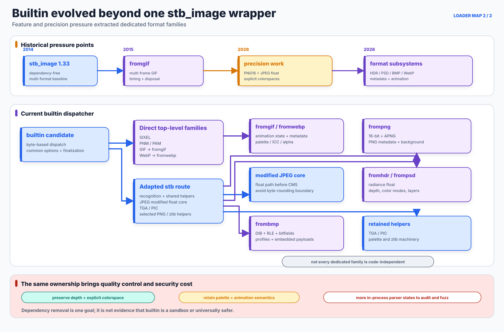

# Builtin Image Loader

## Purpose and tradeoff

The builtin loader is libsixel's always-available image-decoding component. It began as an integration of `stb_image`, but the current implementation is not one monolithic stb decoder. It is a dispatcher over several dedicated format families, with a modified stb-derived core retained for a smaller set of paths and shared helpers.

Avoiding mandatory image-library dependencies remains important, especially for small or unusual builds. The deeper reason for maintaining in-tree decoders is control over the frame boundary: preserve 16-bit or HDR values as float32, carry an explicit colorspace, retain an indexed palette when useful, interpret format metadata before conversion, and normalize animation and transparency without forcing every source through an early 8-bit RGBA representation. That control can improve resize, color conversion, sampling, and palette construction quality downstream.

The cost is substantial. In-tree file-format parsers increase libsixel's own attack surface and maintenance burden. Dedicated code may improve precision and policy control while simultaneously creating more code that must reject malformed lengths, dimensions, chunks, compressed streams, metadata, and animation transitions safely.

## From stb_image integration to format families

<picture>
  <source media="(max-width: 640px)" srcset="loader-architecture-figures/builtin-lineage-mobile.svg">
  
</picture>

*Figure 1. Evolution of the builtin component. Purple branches are dedicated format families; blue marks the retained and modified stb-derived core; amber labels quality or feature pressure; red records the security cost that grows with in-tree parsing.*

The history is better understood as incremental replacement and extraction than as a fork that happened once. Code was moved when the stock abstraction could not represent the required animation, depth, colorspace, metadata, or format coverage. Some extracted modules still reuse adapted stb helpers, especially zlib infrastructure, so “dedicated implementation” does not imply byte-for-byte independence from all stb-derived code.

## Current dispatch and output character

The top-level builtin dispatcher first separates SIXEL, PNM/PAM, GIF, WebP, and the remaining stb-routed family. The stb-routed family then diverts PNG, JPEG, PSD, HDR, and BMP into specialized code as needed. Compile-time `STBI_NO_GIF`, `STBI_NO_PNM`, `STBI_NO_PSD`, `STBI_NO_BMP`, and `STBI_NO_HDR` prevent those formats from silently falling back to their old stock stb decoders. The [Builtin Format Components](builtin/README.md) index gives the exact accepted variants, interpreted metadata, output character, and exclusions for every family.

| Family | Current implementation | Why it is separate | Representative frame result |
| --- | --- | --- | --- |
| SIXEL | libsixel decoder path in [`loader-builtin.c`](../../src/loader-builtin.c) | Accept SIXEL as an input image and preserve its palette semantics where possible. | Indexed or RGB data according to the decoded stream and request. |
| PBM/PGM/PPM/PAM | [`frompnm.c`](../../src/frompnm.c) | Cover ASCII and binary Netpbm forms, PAM tuple/alpha policy, bounded headers, and explicit compatibility controls. | Gamma RGB byte/float, or linear RGB float after PAM alpha composition. |
| GIF | [`fromgif.c`](../../src/fromgif.c) | Deliver multiple frames, disposal, timing, loop count, local/global palettes, transparency, and background policy. | Animation frames with palette/RGB data and explicit transparency metadata. |
| WebP | [`fromwebp.c`](../../src/fromwebp.c) | Handle RIFF structure, static and animated decode, metadata precedence, orientation, ICC, and alpha in-tree. | Gamma `RGBA8888` intermediate, followed by common alpha/background finalization; supported metadata CMS converts its RGB channels to eight-bit sRGB. |
| PNG/APNG | [`frompng.c`](../../src/frompng.c) plus adapted stb PNG/zlib helpers in [`loader-builtin.c`](../../src/loader-builtin.c) | Preserve 16-bit samples, handle APNG, indexed palettes, `bKGD`/`tRNS`, ICC/gamma metadata, and background policy without an 8-bit-only boundary. | Indexed, RGB/RGBA byte, RGB float32, or typed CMS float32. |
| JPEG | Modified stb-derived JPEG core in [`stb_image.h`](../../src/stb_image.h) with routing and CMS work in [`loader-builtin.c`](../../src/loader-builtin.c) | Decode through a float path when required and avoid truncating values before later color transforms. | Normally gamma RGB byte or RGB float32; an applicable RGB ICC profile is applied after component conversion. |
| Radiance HDR | [`fromhdr.c`](../../src/fromhdr.c) | Parse RGBE/XYZE and relevant header metadata directly, retain float values, and apply explicit exposure/profile/tonemap policy. | Linear or target-space float32. |
| PSD/PSB | [`frompsd.c`](../../src/frompsd.c) and related headers | Support far more than the old flattened 8-bit stock path, including multiple color modes, 8/16/32-bit data, compression modes, resources, layers, masks, and effects. | RGB or typed float32 plus transparency metadata according to source and CMS. |
| BMP | [`frombmp.c`](../../src/frombmp.c) with payload routing in [`loader-builtin.c`](../../src/loader-builtin.c) | Interpret DIB variants, RLE/bitfields, embedded JPEG/PNG payloads, alpha, CMYK, profiles, and compatibility policy explicitly. | RGB/RGBA byte, typed CMS output, or the nested JPEG/PNG family's result for compressed payloads. |
| TGA and PIC | Adapted stb-derived code in [`stb_image.h`](../../src/stb_image.h) and builtin routing | Retain useful compact decoders while specialized paths evolve independently. | Gamma byte palette/RGB/RGBA paths followed by common alpha finalization. |

This table describes possible boundary shapes, not a promise that every file with a matching extension decodes or yields one fixed type. Detection uses bytes, and exact support depends on the format variant and enabled CMS implementation.

## Why GIF moved first

libsixel imported stb_image 1.33 in commit [`81375f0bd`](https://github.com/saitoha/libsixel/commit/81375f0bd) on 2014-03-19. The integration could decode a GIF image, but the public stb_image model did not deliver the complete animation sequence needed by `img2sixel`.

Commits [`30b80e140`](https://github.com/saitoha/libsixel/commit/30b80e140) and [`1d92429d7`](https://github.com/saitoha/libsixel/commit/1d92429d7) added and selected `fromgif` on 2015-05-05. The dedicated loader turned relevant stb-derived GIF machinery into a multi-frame decoder with per-frame delay, disposal, palettes, transparency, and Netscape loop extension handling.

This does not mean every legal or vendor-specific GIF extension is semantically implemented. The current decoder interprets the extensions required for rendering and animation control, skips several ancillary blocks, and cannot promise behavior for every private application extension. The important architectural change was that GIF animation ceased to be constrained by a single-image API.

## PNG: preserving 16-bit values and format policy

Stock 8-bit decode was not an adequate boundary for a 16-bit PNG when the next stages might resize or transform colors. Commit [`ca38e5e4a`](https://github.com/saitoha/libsixel/commit/ca38e5e4a) added a builtin 16-bit PNG float32 path on 2026-03-05, and [`44045c67b`](https://github.com/saitoha/libsixel/commit/44045c67b) extracted the dedicated `frompng` helpers the same day.

The present path is deliberately hybrid. `frompng` owns high-depth decode, PNG/APNG policy, colorspace metadata, and background semantics, while adapted stb code still supplies selected palette, inflate, and low-level helpers. This avoids an early 16-to-8-bit collapse without pretending that all PNG code was rewritten at once.

## JPEG: modifying the retained core for precision

JPEG remains the clearest example of a heavily modified retained stb family rather than a complete extraction. Commit [`158bb61ea`](https://github.com/saitoha/libsixel/commit/158bb61ea) routed builtin JPEG through a float decode path on 2026-03-22. Commit [`6e0efa0bb`](https://github.com/saitoha/libsixel/commit/6e0efa0bb) fixed the path on 2026-06-21 so later color transforms would not collapse it back to byte precision unnecessarily.

The goal is not that every JPEG contains more than eight useful bits. It is that decoding, matrix/color conversion, and CMS work should not acquire an avoidable byte-rounding boundary between operations. The optional libjpeg backend remains a separate implementation and can cover capabilities provided by the linked library, including builds with higher sample precision.

## HDR: a custom float decoder

HDR was enabled through stb-derived code early in the project, but its native RGBE/XYZE values and header semantics require an explicitly float-oriented contract. Commit [`8517810cc`](https://github.com/saitoha/libsixel/commit/8517810cc) routed HDR into `fromhdr` float32 processing on 2026-03-27, followed by the custom path in [`4210a8a7e`](https://github.com/saitoha/libsixel/commit/4210a8a7e) on 2026-04-01. Stock stb HDR decode is now disabled.

`fromhdr` parses Radiance headers and scanlines, retains floating-point radiance, recognizes RGBE and XYZE interpretation, and applies explicit fallback profile, exposure, header-exposure, and tonemap policy. An HDR loader that returned only gamma `RGB888` would discard the main reason to support the format before palette construction even began.

## PSD: no longer the stock flattened decoder

PSD changed most dramatically. Commit [`2a743d4b2`](https://github.com/saitoha/libsixel/commit/2a743d4b2) first split PSD helpers into `frompsd` on 2026-03-26, and [`e0d479e64`](https://github.com/saitoha/libsixel/commit/e0d479e64) added direct 16-bit RGB decoding without stb fallback the same day. The current module has since grown into a format subsystem covering multiple color modes and sample depths, raw/RLE/ZIP variants, resources, layers, masks, and selected effects. Stock stb PSD decode is disabled.

Calling it “the stb PSD loader” would now be misleading. It is architecturally a separate decoder, even though some common inflate infrastructure may still be shared. That distinction matters when auditing format support, precision, limits, and security.

## Other extractions

The same pressure applies beyond the headline formats. The builtin PNM/PAM reader is separate from stb. Commit [`379c90cf5`](https://github.com/saitoha/libsixel/commit/379c90cf5) replaced the stock BMP path with the in-tree BMP decoder on 2026-04-10. WebP is handled by a dedicated static/animation family. These are not cosmetic file moves: each extraction makes more format policy visible to libsixel, but also transfers more parser ownership to the project.

## Precision, colorspace, and finalization

The builtin loader does not normalize every source to the same storage before returning it. Format-specific code can preserve an indexed palette, return gamma `RGB888`, retain explicit alpha temporarily, or allocate generic/typed float32 pixels. Loader-local CMS can convert an embedded or inferred source interpretation into gamma, linear, CIELAB, OKLab, or DIN99d target coordinates when the selected engine and format path support it.

After decode, common finalization applies the applicable orientation and alpha policy, records timing and loop metadata, and hands a semantic frame to the encoder. Transparency may be represented by an indexed transparent entry, an alpha-bearing intermediate, alpha-zero metadata, or a separate per-pixel mask. The actual `pixelformat`, `colorspace`, and mask fields are the contract; the fact that the backend was `builtin` is not enough to choose a pixel accessor.

Later resize and encoder working-space conversion can transform the frame again. Loader precision is the starting point for those stages, not a replacement for the encoder's `-X`, `-W`, `-U`, resize, and precision policies.

## Security model

Builtin is not a sandbox and should not be described as a security improvement merely because it removes shared-library dependencies. Its parsers process attacker-controlled counts, dimensions, offsets, chunk graphs, compressed data, profiles, resources, and frame transitions inside the application process. Adding support for a new format feature increases both compatibility and the number of states requiring bounds, overflow, lifetime, complexity, and cancellation review.

Project mitigations include checked arithmetic, input and resource limits, cancellation paths, small regression fixtures, a general builtin-loader fuzz target, and structural fuzz targets for PNG/APNG, JPEG ICC data, PNM, PSD resources, GIF blocks and LZW codes, SIXEL streams, HDR headers, PIC, BMP, EXIF orientation, loader order, and related option grammars. These measures reduce risk; they do not prove memory safety or make malformed input harmless.

Selecting `-Lbuiltin!` limits decoding to this component and avoids passing the input through later optional loaders. It does not isolate builtin from the process, and it may trade externally maintained decoder code for a larger project-owned parser surface. Conversely, selecting an external framework can expose its codecs, plugins, and update policy. Deployment should choose the shortest chain that meets the required format, quality, and operational constraints.

## Implementation and test landmarks

| Concern | Primary files |
| --- | --- |
| Top-level dispatch, retained stb integration, CMS and finalization | [`loader-builtin.c`](../../src/loader-builtin.c), [`stb_image.h`](../../src/stb_image.h) |
| GIF animation | [`fromgif.c`](../../src/fromgif.c) |
| PNG/APNG and PNG metadata | [`frompng.c`](../../src/frompng.c) |
| Netpbm/PAM | [`frompnm.c`](../../src/frompnm.c) |
| Radiance HDR | [`fromhdr.c`](../../src/fromhdr.c) |
| PSD/PSB | [`frompsd.c`](../../src/frompsd.c) and the `frompsd-*` modules |
| BMP | [`frombmp.c`](../../src/frombmp.c) and the `frombmp-*` modules |
| WebP | [`fromwebp.c`](../../src/fromwebp.c) and the `fromwebp-*` modules |
| Functional and regression coverage | [`tests/loader/builtin`](../../tests/loader/builtin) |
| General and structural fuzz coverage | [`fuzz/Makefile.am`](../../fuzz/Makefile.am) and the `fuzz-loader-builtin*` targets |

## Test coverage

<!-- test-coverage: enforced -->

The format pages own byte-level decode contracts. These tests instead protect behavior shared by the builtin component across representative files from every routed format family.

| ID | Contract protected | Owning test |
| --- | --- | --- |
| BLT-01 | Deterministic allocation injection across one static specimen per builtin format either fails before callback without leaking or produces the exact baseline frame. | [tests/loader/builtin/2021_loader_builtin_allocator_failure_matrix.t](../../tests/loader/builtin/2021_loader_builtin_allocator_failure_matrix.t) |
| BLT-02 | PNG, JPEG, GIF, WebP, HDR, PSD, BMP, TGA, PIC, PNM, and SIXEL routes return an interrupted frame callback unchanged. | [tests/loader/builtin/2022_loader_builtin_callback_status_matrix.t](../../tests/loader/builtin/2022_loader_builtin_callback_status_matrix.t) |

The shared static allocation test intentionally accepts retained stb paths that report an injected allocation failure through their historical format-error status, but it does not accept a partial frame, a leak, or changed output. Animation, reconstruction, and optional metadata paths have additional targeted tests in their format pages: an animation failure may follow a valid emitted prefix, while an optional ICC allocation may fall back to unmanaged decoding. Those scoped contracts must not be weakened into a claim that every internal decoder distinguishes out-of-memory from malformed compressed data.
