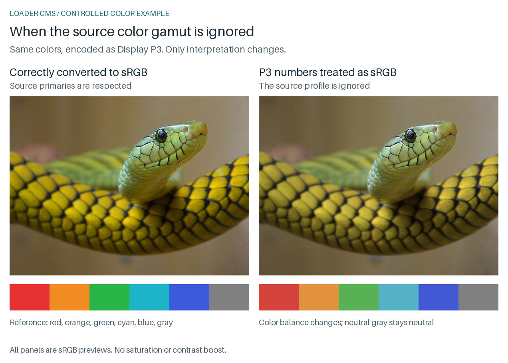
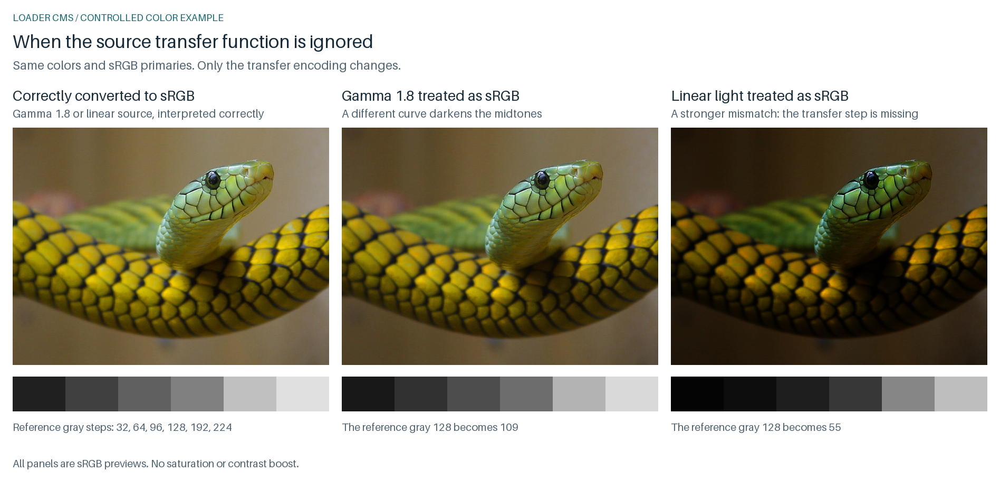

# Loader Color Management: builtin and Little CMS

## Why loader CMS matters

Loader CMS primarily protects the intended color interpretation of input images. Files authored for wider RGB gamuts or different transfer functions cannot safely be treated as ordinary sRGB just because they decode to three channels. Interpreting those samples directly as sRGB can change hue, saturation, brightness, and the balance between colors. CMS uses an applicable source profile or supported color metadata to normalize those samples into libsixel's known sRGB basis before the encoder makes palette and dithering decisions. Its purpose here is faithful normalization, not increasing saturation or extending the display gamut.

For example, Display P3 and sRGB have different primaries: the same RGB triplet need not describe the same color. Similarly, a source with a different gamma needs the appropriate transfer conversion even if its primaries match the destination. Correct conversion changes the numbers to preserve the intended colors where the destination can represent them. Colors outside sRGB must be mapped or clipped according to the available profile, intent, and implementation; CMS cannot preserve every wide-gamut source color in an sRGB result.

The default output contract is gamma-encoded sRGB palette values (`-Ugamma`), subject to palette reduction and SIXEL component quantization. An internal `cms_target=linear` or a perceptual working space changes the calculation representation, not that output contract or the display gamut. The explicit alternative `-U` modes are described in the [color-space guide](../concepts/colorspace.md); they do not provide an ICC-tagged wide-gamut display protocol. CMS establishes the input interpretation needed to honor the default output contract, but it remains disabled by default and cannot guarantee normalization when metadata is missing, unsupported, or skipped.

The receiving terminal and display stack own the mapping from those output values to the physical display. On a wide-gamut device, faithful rendering of sRGB and an optional enhancement that expands sRGB colors into a larger gamut are different policies: the former preserves the requested colors, while the latter deliberately changes them. Such display enhancement belongs to the terminal/device side and is not enabled by libsixel's loader CMS. SIXEL carries no source ICC profile or explicit color-space tag with which to negotiate it, so libsixel also cannot guarantee how every terminal will render its palette values.

## This already affects ordinary web images

You do not need to create wide-gamut artwork yourself to encounter this problem. A browser may already be interpreting an image's color metadata for you. Downloading that image and passing it through a different decoding API does not automatically preserve that behavior. The visible symptom can be “the downloaded image has different colors from the browser,” even when both programs successfully decode the file.

### Published prevalence, with a defined denominator

The [2024 Web Almanac media chapter](https://almanac.httparchive.org/en/2024/media#image-color-spaces) reports the following for its mobile image sample:

| Observation | Reported share or derivation |
| --- | --- |
| No ICC profile | 87.7% |
| ICC profile present | Approximately **12.3%**, calculated as `100 - 87.7` |
| Wide-gamut ICC profile | Approximately **1 in 80 images** (1.25%) |
| Adobe RGB (1998) profile | 0.7% |
| Display P3 profile | 0.4% |

These categories overlap: Adobe RGB and Display P3 are examples within wide-gamut ICC usage, which is itself within ICC usage. Most profiled images in this report use sRGB or an sRGB-like profile. **12.3% is not the percentage of images that visibly fail without CMS.** The report places CICP-only images in the no-ICC category, so its wide-gamut count does not cover every signaling method.

This is a historical June 2024 crawl, not a census of all Internet images or a current 2026 estimate. The [published SQL](https://github.com/HTTPArchive/almanac.httparchive.org/blob/main/sql/2024/media/color_spaces_and_depth.sql) counts image request records with ImageMagick colorspace metadata and more than one pixel, grouped by client and ICC description; it does not deduplicate all copies into unique image artworks. The [crawl methodology](https://almanac.httparchive.org/en/2024/methodology#websites) describes the selected public pages and logged-out lab conditions. Do not turn these percentages into the probability that a particular user's photo collection needs conversion.

No representative web-wide prevalence estimate for PNG `gAMA` alone, or for the union of ICC, `gAMA`, `sRGB`, `cHRM`, and CICP declarations, was established by the sources reviewed for this guide. An image contains color metadata, not a CMS: the CMS is the software interpreting it. An ICC-only statistic therefore cannot answer “how many images have gamma information?” Conversely, a `gAMA` declaration can describe an ordinary sRGB-like transfer and does not by itself establish a visible mismatch. The [PNG specification](https://www.w3.org/TR/png-3/#11gAMA) defines it separately from ICC and other color declarations.

### Familiar tools: decoding and color conversion are different operations

The table describes specific paths, not a blanket correct/incorrect ranking of applications. “Automatic” means the stated rendering path interprets supported source information; it does not promise identical rendering intents, full profile compatibility, or accurate physical displays. API support means the caller must connect it correctly. External documentation was checked on 2026-09-11; named browser versions below are the published test snapshot, not a new local browser test.

| Tool or API path | What happens to source color information? | Practical consequence and evidence |
| --- | --- | --- |
| Chrome/Edge image display | The W3C PNG report records passing ICC v2/v4, Display P3, and ICC gamma-1.8 examples for Chrome 137 and Edge 137. | Browser display is a managed path for these examples. This is not a blanket result for every PNG `gAMA`-only or HDR case. [W3C implementation report](https://w3c.github.io/png/Implementation_Report_3e/#ICC) |
| Firefox image display, normal settings | Applies color management to tagged media and assumes sRGB for untagged media; settings can disable or change this. | Users can benefit without selecting a CMS themselves. [Mozilla settings documentation](https://developer.mozilla.org/en-US/docs/Mozilla/Add-ons/WebExtensions/API/browserSettings/colorManagement) |
| Safari/WebKit image rendering, including drawing an image to Canvas | Honors an image's profile when drawing it into the destination color space. | A downloaded image decoded elsewhere may differ from its browser appearance. [WebKit Canvas color documentation](https://webkit.org/blog/12058/wide-gamut-2d-graphics-using-html-canvas/) |
| macOS Quartz/Core Graphics with a calibrated source color space | Uses the supplied white point and gamma to convert source colors into the output space. | Supply the correct source space; merely putting bytes into a device-RGB buffer does not identify their original profile. [Apple Quartz color-space guide](https://developer.apple.com/library/archive/documentation/GraphicsImaging/Conceptual/drawingwithquartz2d/dq_color/dq_color.html) |
| Windows WIC with `IWICColorTransform` | Converts a bitmap between supplied source and destination color contexts. | Color contexts and an explicit transform are separate from simply decoding/copying bitmap pixels. [Microsoft WIC color management](https://learn.microsoft.com/en-us/windows/win32/wic/-wic-colormanagement) |
| Pillow `Image.open(...).convert("RGB")` | Decodes samples and converts their pixel mode. PNG gamma/chromaticity are exposed as metadata; this path does not apply a source ICC transform or normalize PNG gamma to sRGB. | `RGB` is a storage mode, not proof of sRGB normalization. [PNG metadata documentation](https://pillow.readthedocs.io/en/stable/handbook/image-file-formats.html#png), [conversion implementation](https://pillow.readthedocs.io/en/stable/_modules/PIL/Image.html#Image.convert) |
| Pillow `ImageCms.profileToProfile(...)` | Explicit ICC conversion using Little CMS with source and destination profiles. | This is the profile-aware path. A standalone `gAMA` value is not an ICC profile supplied to this function. [Pillow ImageCms](https://pillow.readthedocs.io/en/stable/reference/ImageCms.html#PIL.ImageCms.profileToProfile) |
| ImageMagick `magick input -profile sRGB.icc output` | Performs profile conversion when an input profile is already present; without one, the source interpretation must first be established. | `-strip` removes metadata; it does not perform this normalization. Convert before removing the source description. [Profile operator](https://imagemagick.org/command-line-options/#profile), [profile examples](https://usage.imagemagick.org/formats/#profiles) |
| libpng 1.6 traditional read API | Provides `png_set_gamma` / `png_set_alpha_mode` for requested transfer handling; general ICC conversion remains application work. | Linking libpng alone does not establish full CMS. The simplified API has its own output contract and is not covered by this row. [libpng manual](https://github.com/pnggroup/libpng/blob/libpng16/libpng-manual.txt) |
| Upstream stb_image `stbi_load` for ordinary PNG | Its PNG parser skips unhandled ancillary color chunks; it does not provide ICC or `gAMA` normalization on this path. | The application needs an additional interpretation step. This is upstream stb_image, not libsixel's current builtin loader and its separate CMS implementation. [Upstream source](https://github.com/nothings/stb/blob/master/stb_image.h) |
| libsixel participating loaders, default `cms_engine=none` versus enabled CMS | The default disables libsixel loader CMS; `--cms-engine=auto` requests conversion for supported metadata and paths. | Enable CMS when carrying source color interpretation into the sRGB output contract. Loader limitations and fallback still apply; see the engine comparison below. |

A small local check with Pillow 12.2.0 confirmed the distinction: a PNG sample `(128,128,128)` with `gAMA=1.0` still decoded to `(128,128,128)` through `convert("RGB")`; reading the gamma value did not convert that linear sample to sRGB. Separately, the repository's Adobe-RGB [profiled fixture](../../images/measurements/palette-pipeline/a98-gamut-600x450.png) produced different pixels with explicit `ImageCms.profileToProfile(..., sRGB)` than with plain RGB mode conversion. These are narrow checks, not a complete tool conformance suite.

The everyday lesson is to preserve source color interpretation across tool boundaries. A browser can make profile handling invisible to its user, while a script receiving only RGB bytes can lose it. CMS is what connects those two workflows without unintentionally changing the image's colors.

## See what happens when the source is misinterpreted

These examples show the same intended image with correct conversion and with source numbers incorrectly treated as sRGB. Look at the colored scales in the first comparison and the dark scales in the second. CMS is restoring the reference appearance; the correct panels have no added saturation or contrast enhancement.

### Different color gamut: Display P3 interpreted as sRGB

<picture>
  <source media="(max-width: 640px)" srcset="cms-examples/gamut-mobile.png">
  
</picture>

*The source primaries change, but the transfer function stays the same. Ignoring that distinction alters the color balance even though the image still loads and its detail remains recognizable. The reference colors all fit inside sRGB: the correct panel does not require a wide-gamut monitor.*

### Different gamma: midtones and shadows change

<picture>
  <source media="(max-width: 1000px)" srcset="cms-examples/gamma-mobile.png">
  
</picture>

*Here the primaries stay sRGB. The middle panel illustrates a gamma 1.8 source; the last panel illustrates the stronger error of treating linear-light samples as gamma-encoded values. These are two separate source encodings of the same intended colors, not successive edits to the photograph.*

| Intended sRGB gray (0–255) | Correct conversion | Gamma 1.8 source misread as sRGB | Linear source misread as sRGB |
| --- | --- | --- | --- |
| 32 | 32 | 24 | 4 |
| 64 | 64 | 49 | 13 |
| 128 | 128 | 109 | 55 |
| 192 | 192 | 179 | 134 |

This is why changing a palette algorithm cannot fix the underlying problem: it would optimize an already misinterpreted image. These particular errors darken or reduce saturation; other source encodings and incorrect interpretations can cause different shifts, including brightening. The figures illustrate a mechanism, not a typical error magnitude for every image.

### How the examples are made

The generator explicitly treats the RGB bytes of the repository's [snake fixture](../../images/snake.png) as an sRGB reference, independently of its approximate PNG gamma declaration. It converts that reference to floating-point source samples and then takes two paths: apply the inverse source interpretation to recover sRGB, or use those source samples directly as sRGB preview values. All figure PNGs carry an sRGB chunk, including the deliberately wrong panels, so the viewer does not correct the illustrated mistake a second time.

For Display P3, the calculation decodes the sRGB transfer function, converts linear sRGB through D65 XYZ to P3 primaries, and re-encodes with the same transfer function. The correct path reverses this conversion. The primaries and transfer definition follow [CSS Color 4](https://www.w3.org/TR/css-color-4/#predefined-display-p3). Starting from sRGB colors avoids out-of-gamut clipping and isolates misinterpretation from gamut mapping. For gamma 1.8, source values are `linear_sRGB ** (1 / 1.8)`; for linear light they are simply `linear_sRGB`. Correct interpretation decodes that source representation and applies sRGB encoding. Values are rounded to bytes only when producing the previews.

These are analytical illustrations before palette reduction, not screenshots, measurements of `img2sixel --cms-engine=none`, or a comparison of builtin and lcms2 accuracy. Actual loader fallback can interpret other metadata instead of treating samples as sRGB. The examples do not test ICC parsing, rendering intents, terminal gamut mapping, or SIXEL quantization. Their purpose is to make the cost of a wrong source interpretation visible on an ordinary sRGB display.

The [generator](../../tools/plot_loader_cms_examples.py) creates wide and stacked mobile layouts and checks that correct conversions recover the reference within `1e-12` before byte rounding. The [numerical record](cms-examples/examples.json) contains source and output hashes, chromaticities, and patch values. Regenerate or verify with Python, NumPy, and Pillow (the committed figures use NumPy 2.3.5 and Pillow 12.2.0 with its bundled font):

```sh
python3 tools/plot_loader_cms_examples.py
python3 tools/plot_loader_cms_examples.py --check
```

## Choosing an engine

Enable loader CMS when the source profile matters: `img2sixel --cms-engine=auto image.png`. CMS is disabled by default for participating loaders. For varied third-party ICC profiles, prefer a build with Little CMS (`lcms2`) and verify that the selected loader supplies the original source color model to it. Choose `builtin` when avoiding an external CMS dependency matters and the actual profile corpus has been validated against the supported subset below. Neither engine can repair an incorrect source profile or recover source channels already discarded by a decoder.

**Successful image loading is not proof of successful color management.** Unsupported or unusable metadata can lead to a format-specific fallback and a displayable image with different colors. Also, requesting `lcms2` does not require that dependency to be present: an unavailable engine resolves through `auto`. Reproducible color output requires checking the build and loader as well as the command line.

This guide compares libsixel's integration, not every feature of the underlying libraries. [Little CMS documents broad ICC v2/v4 support](https://www.littlecms.com/color-engine/), including features beyond libsixel's loader interface. The [color-space guide](../concepts/colorspace.md) explains source interpretation, `cms_target`, `-X`, `-W`, and `-U`; those encoder options do not substitute for reading an embedded profile.

## Decoder and CMS are independent choices

`builtin` names both an image-loader component and a CMS engine. They are independent. The builtin PNG decoder can use lcms2; the libpng decoder can use builtin CMS. The global CMS selection participates in the builtin, libpng, libjpeg, libwebp, and libtiff components. Other frameworks can have their own color behavior.

```sh
# Same decoder, different requested CMS engines.
img2sixel -Lbuiltin:cms_engine=builtin:cms_target=linear:prefer_8bit=0! image.png
img2sixel -Lbuiltin:cms_engine=lcms2:cms_target=linear:prefer_8bit=0! image.png
```

The final `!` closes the loader chain. It does not require a successful ICC conversion or make an unavailable CMS engine an error. Loader-specific `cms_engine` settings override the process-wide `--cms-engine` default. `auto` chooses lcms2 when compiled in, otherwise ColorSync when available on macOS, otherwise builtin. This is availability selection, not a per-profile retry through every engine: failure to open a profile on the selected backend does not automatically try the next CMS backend.

Autotools detects lcms2 by default and accepts `--with-lcms2` / `--without-lcms2`; Meson exposes the `lcms2` feature option. Inspect the configuration result and, for Autotools builds, `HAVE_LCMS2` in `config.h`. Pin the build, dependency version, loader, CMS settings, and encoder settings when exact reproducibility matters. See [platform support](../platform-support.md).

## Supported profile structures and practical differences

The builtin parser and evaluator are in [`icc-parse.c`](../../src/icc-parse.c) and [`icc-apply.c`](../../src/icc-apply.c). Acceptance depends on the actual tags, channel counts, direction, and available conversion path; an ICC version number or a familiar profile name alone is insufficient.

| Area | builtin CMS | lcms2 through libsixel |
| --- | --- | --- |
| RGB and grayscale | RGB colorant matrix plus channel tone response curves (TRCs), grayscale white point/TRC, and supported LUT paths. | Delegates compatible input profiles and transforms to Little CMS. |
| CMYK and Lab | Supported profile paths exist; CMYK LUT conversion includes byte, 16-bit, and float source interfaces. These work only where the loader retains and passes the corresponding samples. | The wrapper maps CMYK byte/16-bit/float and Lab float formats, subject to the same loader boundary. |
| Profile connection space (PCS) | XYZ or Lab. The conversion code connects through D50 XYZ and the project's sRGB basis. | Little CMS owns profile connection and intent processing. |
| Curves | `curv`, `para` function types 0–4, and the implemented `segm` subset. | Little CMS parses and evaluates its supported curve representations. |
| LUT payloads | `mft1`, `mft2`, and implemented `mAB`/`mBA` curve, matrix, and CLUT stages. Forward A2B and reverse B2A slots 0–2 are represented. | Little CMS handles its supported ICC pipelines and optimization. |
| D2B/B2D | Looks up slots 0–2 but only parses the same supported LUT payloads. This is not general ICC floating-point multi-process-element support. | Broader ICC pipeline support depends on the linked Little CMS version and transform compatibility. |
| Dependency | In-tree implementation with no external CMS library dependency. This says nothing about the selected image decoder's dependencies. | Requires a build linked with lcms2. |

Builtin CMS is therefore more capable than a gamma-only correction or an RGB matrix-only converter. Conversely, accepting some LUT profiles does not make it a full ICC implementation.

## Cases builtin does not fully support

- **Other input color models:** the profile parser dispatches RGB, GRAY, CMYK, and Lab. XYZ as a device input, CMY, YCbCr, and multicolor input signatures such as five- or six-ink profiles are outside that dispatch. XYZ as a PCS is supported and is a different role.
- **Arbitrary multi-process elements:** there is no `mpet` payload parser. A D2B tag name alone does not establish support for a standard floating-point processing pipeline. D2B3/B2D3 are not in the slot inventory. A profile requiring those paths needs another supported path or cannot be applied by builtin.
- **Unimplemented curves or stages:** parametric function types outside 0–4 and payloads outside the implemented curve/LUT grammar cannot be evaluated merely because the enclosing file is ICC. A usable alternate path can still be selected.
- **Distinct absolute-colorimetric intent:** builtin maps both `relative` and `absolute` to slot 1. It does not implement a separate intent-dependent media-white adaptation step. Selecting `absolute` therefore must not be interpreted as an lcms2-equivalent paper-white simulation.
- **Full device-link, named-color, spectral, or iccMAX workflows:** the builtin API is not a general implementation of these workflows. Nor does selecting lcms2 expose all of them through `img2sixel`; the loader wrapper has a fixed set of pixel formats and targets.
- **Unbounded scene-referred color preservation:** builtin curve, CLUT, and RGB conversion stages clamp bounded values, and some curves are sampled into 16-bit tables. A float32 frame does not imply an unbounded floating-point ICC pipeline. HDR metadata interpretation and tone mapping remain loader-specific.

There is no loader option here for an arbitrary output/printer ICC profile, a proofing profile, gamut warnings, or black-preserving separation. Little CMS offers additional facilities, but this wrapper creates ordinary transforms and does not enable `cmsFLAGS_BLACKPOINTCOMPENSATION`. Do not infer black-point compensation or soft proofing from `cms_engine=lcms2`.

## Rendering intent and fallback

`cms_intent=perceptual|relative|saturation|absolute` can be expressed as an ordered `+` list. The default attempt order is perceptual, relative, saturation, absolute. An inner `!` suppresses appending omitted intents; see the [loader grammar](README.md) for how this combines with the loader-chain terminator.

Builtin turns intents into deduplicated LUT slots: perceptual → 0, relative/absolute → 1, saturation → 2. RGB/gray-to-sRGB paths can subsequently fall back to matrix/TRC conversion when those slots cannot be applied. Thus an exclusive intent list is not a guarantee that conversion fails unless the profile contains that exact LUT, and a matrix profile need not produce different results for every intent. Builtin does not synthesize a new perceptual gamut map just because `perceptual` was requested.

The lcms2 wrapper tries creating a transform with each allowed intent using normal flags. If all fail, it retries with `cmsFLAGS_NOOPTIMIZE`. Intent support and any internal profile fallback then belong to Little CMS. These are different mechanisms from builtin's slot evaluation; a matching intent name does not imply identical output.

## Loader-specific limits and failure behavior

| Loader path | Consequence for CMS users |
| --- | --- |
| [Builtin PNG/APNG](builtin/png.md) | Usable `iCCP` takes precedence over `sRGB`, then applicable `cHRM`/`gAMA`. Unusable metadata can fall through to another interpretation. Current builtin PNG HDR chunks such as `cICP` do not acquire semantics by selecting lcms2. |
| [Builtin JPEG](builtin/jpeg.md) | The ICC stage receives RGB after JPEG component conversion and applies RGB-domain profiles. It cannot retroactively apply a CMYK profile to the original CMYK planes. Choosing lcms2 with this decoder does not remove that limitation. |
| [Builtin PSD/PSB](builtin/psd.md) | Applicable RGB, CMYK, and Lab profiles are applied to matching source domains; failed or inapplicable profiles leave format-specific fallback conversion. |
| [Builtin WebP](builtin/webp.md) | ICCP/XMP handling normalizes an RGBA8 boundary. Requesting a float target does not restore precision lost at this boundary. Metadata precedence, bounds, and best-effort handling belong to the WebP path. |

Metadata presence, profile parsing, source-domain compatibility, and actual transform application are separate checks. Failure can mean fallback metadata, device conversion, unchanged samples, or loader failure depending on the path; there is no universal strict-CMS failure policy or guaranteed warning for every skipped profile. When investigating a mismatch, inspect the selected format path and available loader-contract diagnostics, then compare against an independently converted reference. A zero exit status or an intent-order trace alone is insufficient evidence.

## Quality: what can change visibly

For a supported matrix/TRC RGB profile, builtin can perform meaningful profile-aware conversion, including sources whose primaries differ from sRGB. Little CMS is not automatically visibly better for every such image. For less common profiles and intent-dependent conversions, its broader implementation is a reason to prefer it, while still validating the specific loader and profile combination.

Builtin samples parametric and segmented curves into 4096-entry, 16-bit tables and interpolates table values. Its CLUT evaluator interpolates the surrounding grid corners; its conversion stages also clamp values. Little CMS can use a different evaluation and optimization path. Differences can therefore appear in dark gradients, saturated patches, LUT transitions, and wide-gamut colors even when both engines successfully apply a profile. Equality of ICC tag support is not bitwise equivalence or proof of equal colorimetric accuracy.

The largest error may instead be a skipped profile: decoding Display P3 or another source RGB space as ordinary sRGB can change color interpretation before quantization starts. More palette colors, float precision, or Oklab dithering cannot correct that interpretation error. Conversely, a valid conversion still ends at the output gamut and SIXEL palette quantization; SIXEL carries no ICC profile for the terminal to recover the original colors.

For float-capable loader paths, `prefer_8bit=0` preserves the selected typed CMS target; `prefer_8bit=1` requests an 8-bit gamma RGB boundary. Float storage reduces additional rounding but cannot recover source precision, clipped colors, or the builtin curve tables' sampling precision. Keep this setting and the actual output frame format fixed when attributing differences to an engine.

## Speed and memory: workload-dependent tradeoffs

No controlled builtin-versus-lcms2 timing result is established by the coverage listed below. It would be misleading to promise that builtin is faster because it has fewer dependencies, or that lcms2 is always faster because it optimizes transforms. The following are implementation-based expectations to test, not measured rankings:

| Cost | Expected influence |
| --- | --- |
| Profile parsing and transform setup | Builtin allocates curve/LUT storage and samples parametric curves. lcms2 creates and may optimize a transform. Setup can dominate many small images. |
| Per-pixel evaluation | Builtin matrix/TRC paths and multi-stage CLUT paths have different costs. A CLUT with three inputs visits up to 8 corners; four inputs up to 16. Large images can favor an optimized reusable transform, but require measurement. |
| Precision and frame buffers | RGB float32 payload uses 12 bytes/pixel versus 3 for RGB888, before alpha, temporary buffers, and metadata. Extra conversions and memory traffic can dominate the engine difference. |
| Decoder and encoder | Enabling CMS can change decoder fast-path eligibility; resize, quantization, dithering, and output serialization can hide CMS costs in end-to-end time. |
| Animation and batching | Profile/transform reuse depends on the loader path. Measure actual frame handling rather than assuming reuse across files or frames. |

The wrapper uses `cmsDoTransform`; it does not by itself install Little CMS acceleration plugins. Do not transfer published plugin speedups to this integration without verifying the build and execution path.

A useful comparison holds the decoder fixed, uses explicit builtin/lcms2 selection on a build verified to contain lcms2, and measures both setup plus conversion and the complete `img2sixel` pipeline. Use the same profile bytes, intent, target, precision, dimensions, alpha policy, resize, palette, dithering, and thread settings. Redirect SIXEL to a sink when timing so terminal rendering is excluded; capture it separately for output-size and quality comparison. Report repeated-run medians and variation, dependency/compiler versions, host, and whether caches are warm.

Compare decoded managed pixels against an independently prepared color-managed reference before palette reduction, including neutral ramps, near-black gradients, saturated colors, RGB matrix profiles, and CMYK/LUT profiles where the loader supports them. Report color error in a stated common color space, including worst cases; supplement with final SIXEL MS-SSIM and stream size. A high MS-SSIM score against a baseline made by the same engine proves regression stability, not independent ICC correctness. Skipped profiles must be reported as unsupported/fallback cases, not counted as fast successful conversions.

## Test coverage

<!-- test-coverage: enforced -->

### Behavioral contract tests

| ID | Tested boundary | Owning test |
| --- | --- | --- |
| CMS-01 | Builtin RGB/gray segmented-curve and selected A2B0 paths are evaluated. | [tests/diagnostics/icc/0001_icc_builtin_rgb_gray_v4_paths.t](../../tests/diagnostics/icc/0001_icc_builtin_rgb_gray_v4_paths.t) |
| CMS-02 | Selected RGB, gray, and CMYK mAB/mBA paths are evaluated. | [tests/diagnostics/icc/0002_icc_builtin_mab_mba_a2b0_paths.t](../../tests/diagnostics/icc/0002_icc_builtin_mab_mba_a2b0_paths.t) |
| CMS-03 | Builtin rendering-intent selection reaches the expected A2B slots, including relative/absolute slot sharing. | [tests/diagnostics/icc/0003_icc_builtin_a2b_intent_paths.t](../../tests/diagnostics/icc/0003_icc_builtin_a2b_intent_paths.t) |
| CMS-04 | A builtin PNG with parametric ICC curves retains quality against its stored builtin reference. This is a regression check, not lcms2 parity. | [tests/loader/builtin/1199_loader_builtin_png_rgb_parametric_012_builtin_cms_lsqa.t](../../tests/loader/builtin/1199_loader_builtin_png_rgb_parametric_012_builtin_cms_lsqa.t) |

### Defensive and malformed-input tests

The [ICC diagnostic suite](../../tests/diagnostics/icc/) also probes invalid paths. Format metadata bounds, malformed profiles, and fallback cases are distributed through the [builtin loader inventory](../testing/builtin-loader-coverage.md) and the individual format policies linked above. These suite references do not establish exhaustive ICC conformance or every fallback outcome.

The unsupported-feature list above is an implementation audit, not a guarantee that every unsupported profile is rejected with a particular diagnostic. Cross-engine colorimetric accuracy, performance rankings, platform-specific ColorSync behavior, and final terminal appearance are not established by this coverage. Those require the controlled comparisons described above.

## Implementation references

- [`cms.c`](../../src/cms.c): availability resolution, backend profile opening, intent-to-slot mapping, transform creation, precision interfaces, and fixed sRGB/XYZ adaptation matrices.
- [`icc-parse.c`](../../src/icc-parse.c) and [`icc-parse.h`](../../src/icc-parse.h): accepted source signatures, curve/LUT payloads, slot inventory, and sampled curve representation.
- [`icc-apply.c`](../../src/icc-apply.c): interpolation, clamping, forward/reverse profile evaluation, and matrix/TRC fallback.
- [`loader-common.c`](../../src/loader-common.c): shared target, intent, and preferred byte-output settings.
