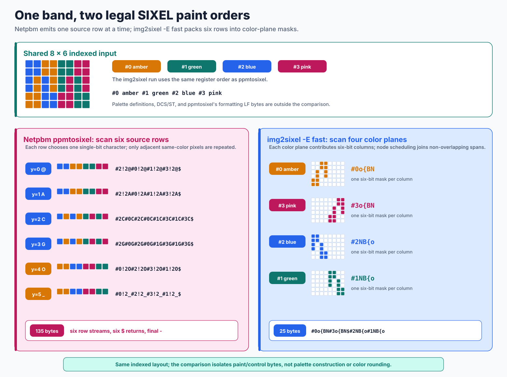

# SIXEL Format

## Scope

SIXEL is a paletted bitmap representation carried inside a terminal Device
Control String (DCS). Digital Equipment Corporation introduced it for printers
and later used it for graphics terminals including the VT240, VT330, and
VT340.

This document is a practical format guide for libsixel users and contributors.
It describes the common DEC terminal form and the conventions that matter to
this implementation. It is not a substitute for the device manual: historical
printers, DEC terminals, and modern terminal emulators differ in limits,
palette lifetime, aspect-ratio handling, scrolling, and error recovery.

## An old syntax with a modern image pipeline

Ordinary SIXEL combines **color quantization**, **parallelizable six-row mask and run-length encoding/decoding**, and **a protocol that travels directly over a 7-bit terminal connection**. The wire syntax does not prescribe how an encoder finds its palette. Improvements to clustering, perceptual color spaces, pixel assignment and dithering can therefore improve SIXEL output without changing the receiving terminal. Color quantization has continued to advance in the twenty-first century; the [codec comparison](sixel-format/comparison.md#three-independently-useful-ideas) gives research and production-library examples.

Run-length coding offers comparatively simple expansion and natural band work units. With independently reconstructed palette/cursor state, implementations can process multiple bands concurrently. That can outperform a more compact codec whose implementation exposes less independent work, but it is not a guarantee: palette construction, parser scans, byte volume and memory traffic still cost time. Huffman coding is not inherently incompatible with parallelism, and GIF uses LZW rather than Huffman. WebP also provides multithreaded implementations. The [format and concurrency comparison](sixel-format/comparison.md#compression-and-concurrency-are-different-properties) separates these properties.

### Quality, latency and terminal transport size

The reproducible comparison covers SIXEL, JPEG, GIF, PNG, lossy WebP and lossless WebP using a photograph, a gradient and a text/diagram image. It measures encoding from memory and decoding to memory independently, with no PNG writer hidden inside the SIXEL decoder timing. Multiple JPEG/WebP quality settings expose different operating points rather than pretending that their quality numbers are interchangeable.

<picture>
  <source media="(max-width: 640px)" srcset="sixel-format-figures/comparison/photo-profile-mobile.svg">
  
</picture>

For binary formats, the size comparison includes the 3-in-4 transport cost: padded Base64 occupies `4 * ceil(n / 3)` bytes. SIXEL already uses 7-bit bytes and includes its terminal DCS/ST envelope. Binary-format bars exclude the receiving graphics protocol's extra framing, so they are payload comparisons. SIXEL does not automatically become smallest after this adjustment; nor does a 7-bit connection alone guarantee terminal support. See the [full conditions and image-class comparisons](sixel-format/comparison.md).

### Available threads and repeated generations

The study measures configured budgets of 1, 2, 4 and 8. SIXEL receives an explicit worker budget; libwebp receives its Boolean multithreading switch; the measured Pillow JPEG/GIF/PNG single-image paths remain serial. These are available-budget comparisons, not a claim that every codec uses exactly that many cores. Decoder points use fixed input bytes. Encoder quality and size are plotted alongside speed because changing the parallel execution plan can change the output.

<picture>
  <source media="(max-width: 640px)" srcset="sixel-format-figures/comparison/photo-scaling-mobile.svg">
  
</picture>

Palette formats have another useful property: a decoder can preserve the palette and indices so that a subsequent encoder bypasses color quantization and assignment. The eight-generation experiment compares that path with decoding to RGB and quantizing again. Palette reuse can reduce second-generation encoding time and preserve first-generation pixels; it does not remove the initial quantization error. Repeated RGB SIXEL encoding can still lose quality. PNG and lossless WebP preserve original RGB pixels from generation one, while lossy JPEG/WebP may accumulate changes or approach a stable point.

<picture>
  <source media="(max-width: 640px)" srcset="sixel-format-figures/comparison/photo-generations-mobile.svg">
  
</picture>

See [repeated encoding as a state contract](sixel-format/comparison.md#repeated-encoding-is-a-state-contract) for equality checks, retained-index versus RGB timing boundaries, the other image classes, raw samples and reproduction commands.

## DCS envelope

In a 7-bit environment, a complete image has this shape:

```text
ESC P [P1 [; P2 [; P3]]] q SIXEL-DATA ESC \
```

The byte sequences are:

- `ESC P` (`0x1b 0x50`): 7-bit DCS introducer;
- `q` (`0x71`): SIXEL protocol selector;
- `ESC \` (`0x1b 0x5c`): 7-bit String Terminator (ST).

An 8-bit C1 environment can encode DCS as `0x90` and ST as `0x9c`. The body is
otherwise the same. The 7-bit form is generally safer across UTF-8 transports,
terminal multiplexers, loggers, and tools that do not preserve raw C1 bytes.

The spaces and brackets above are notation only; they are not transmitted.
For example, libsixel commonly begins a 7-bit image with `ESC P 0;0;0 q`
without spaces.

### Header parameters

`P1`, `P2`, and `P3` are decimal parameters before `q`.

`P1` is the legacy macro parameter for pixel aspect ratio:

| `P1` | Vertical:horizontal pixel aspect ratio |
| --- | --- |
| omitted, `0`, or `1` | `2:1` |
| `2` | `5:1` |
| `3` or `4` | `3:1` |
| `5` or `6` | `2:1` |
| `7`, `8`, or `9` | `1:1` |

DEC recommended that new applications use `P1=0` and specify pixel geometry
with the raster-attributes command instead.

`P2` selects background handling. With `0`, `2`, or an omitted value,
unpainted positions use the device's current background color. With `1`, those
positions retain their previous contents. For a decoder that produces an image
rather than drawing on an existing terminal surface, the second behavior
requires an explicit transparency or paint-mask policy.

`P2` does not add an alpha channel to SIXEL. See
[Pixel Formats and Alpha Representation](concepts/pixelformat.md) for the
distinction between input alpha, frame transparency metadata, and omitted
SIXEL pixels.

`P3` is the horizontal grid-size parameter. The VT300 ignored it because its
grid size was fixed. Modern applications should not rely on it for output
dimensions.

## Sixel data characters

A sixel is one vertical column of six pixels. Data bytes range from `?`
(`0x3f`) through `~` (`0x7e`). Subtract `0x3f` from the byte to obtain a six-bit
mask:

```text
mask = byte - 0x3f
```

Bit 0 is the top pixel and bit 5 is the bottom pixel. A set bit paints the
currently selected color. After one data character, the active position moves
one column to the right.

| Character | Mask | Effect |
| --- | --- | --- |
| `?` | `000000` | Paint no pixel in this column |
| `@` | `000001` | Paint the top pixel |
| `A` | `000010` | Paint the second pixel from the top |
| `~` | `111111` | Paint all six pixels |

Six-pixel-high bands and horizontal advancement are the essential layout
model. There is no separate width-and-height footer. `Ph` and `Pv` are the only
explicit extents; without them, a raster decoder must infer bounds from active
positions and painted pixels. Trailing blank columns or bands can therefore be
ambiguous or cropped by an implementation. Emit raster attributes when exact
canvas dimensions matter.

## Body control functions

### Graphics Repeat Introducer: `!`

```text
! Pn sixel-character
```

`Pn` is a decimal repeat count. The following data character is processed
`Pn` times. For example, `!20~` represents twenty fully painted columns.

Repeat counts are untrusted input. Implementations must detect numeric overflow
and apply documented image-size and resource limits before expanding a run.
Some historical devices limit the repeat argument to 255; libsixel exposes a
compatibility option for that restriction.

### Set Raster Attributes: `"`

```text
" Pan ; Pad ; Ph ; Pv
```

`Pan` and `Pad` are the numerator and denominator of the vertical:horizontal
pixel aspect ratio. `Ph` and `Pv` declare the horizontal and vertical image
extents in pixels. The command belongs before sixel image data and overrides
the legacy `P1` aspect-ratio selection.

The declared extents do not clip later sixel data. DEC devices used them to
establish the background area and to encode dimensions without transmitting
blank columns. A decoder must therefore account for both declared extents and
the actual positions reached by the body, while rejecting values that exceed
its resource limits.

### Graphics Color Introducer: `#`

Select an existing color register with:

```text
# Pc
```

Define and select a color register with:

```text
# Pc ; Pu ; Px ; Py ; Pz
```

- `Pc` is the color-register number.
- `Pu=1` selects HLS coordinates: hue is `0..360`, while lightness and
  saturation are `0..100` percent.
- `Pu=2` selects RGB coordinates: red, green, and blue are each `0..100`
  percent.

DEC defined `Pc` as a color-register number in the range `0..255`, providing a
namespace of at most 256 registers. The VT330 implemented only four registers
and the VT340 only sixteen. Register numbers above 255 are
implementation-specific extensions. Applications must not confuse the DEC
numbering range with a device's usable palette capacity.

The 256-register namespace does not by itself limit a complete stream to 256
distinct RGB definitions. A stream can redefine and reuse a register after
painting has begun, as libsixel's high-color mode does. Whether earlier pixels
retain their painted RGB values or change with the live register is a separate,
device-specific rendering behavior.

Color registers are state. Palette lifetime and whether a DCS receives private
or shared registers vary among terminals. Portable output should define every
register it depends on and should not assume that an earlier image established
the current palette.

### Graphics Carriage Return: `$`

`$` returns the active horizontal position to the graphics left margin without
advancing to the next sixel band. Encoders use it to overprint the same band
with another color plane.

### Graphics New Line: `-`

`-` returns to the graphics left margin and advances to the next sixel band.
For a 1:1 raster this advances the logical vertical position by six pixels.

## Rendering model

SIXEL is not a stream of packed RGB pixels. It is a sequence of masks painted
with selected palette registers. A typical encoder performs these operations:

1. define the registers used by the image;
2. select one register;
3. emit mask characters for pixels of that color in a six-pixel-high band;
4. use `$` to return to the band's left edge and paint another color plane;
5. use `-` to advance after the band is complete;
6. terminate the DCS with ST.

The format does not require one particular ordering of color planes. kmiya's
encoder and libsixel optimize ordering and repeated runs to reduce transmitted
data while preserving the same rendered result.

## Ordinary band encoding

The ordinary libsixel body encoder, selected explicitly by `img2sixel -E fast`, converts each six-row band into per-color masks and schedules those masks to avoid unnecessary horizontal returns. The default `-E auto` currently selects this same non-size path. Neither name denotes a different SIXEL wire syntax: they select a serialization strategy after palette construction and pixel assignment. The separate [Encoding Policy](functionality/encode-policy.md) guide compares this exact-mask path with the fill-and-repaint optimization used by `-E size`.

### A row-at-a-time baseline: Netpbm `ppmtosixel`

Netpbm's `ppmtosixel` is a representative classic encoder. Its packed path visits each source row independently. Within that row it selects the palette register for each adjacent same-color run, writes one data character whose only set bit is the source row's position within the six-row band, and compresses a horizontal run with `!`. It then writes `$`; after the sixth source row it also writes `-`. This is legal and direct, but it repeatedly selects colors and revisits the same band.

<picture>
  <source media="(max-width: 640px)" srcset="sixel-format-figures/encoder-comparison-mobile.svg">
  
</picture>

*Figure 1. Two literal encodings of the illustrated indexed pixels. Both runs use `#0` amber, `#1` green, `#2` blue, and `#3` pink. The byte comparison deliberately excludes the DCS envelope, raster attributes, palette definitions, terminator, and formatting line feeds, because those are not the paint-order algorithm. The two decodes have the same indexed layout; palette-definition rounding can still make their RGB files differ.*

For this fixture, the six `ppmtosixel` row bodies are:

```text
#2!2@#0!2@#1!2@#3!2@$
#2!2A#0!2A#1!2A#3!2A$
#2C#0C#2C#0C#1C#3C#1C#3C$
#2G#0G#2G#0G#1G#3G#1G#3G$
#0!2O#2!2O#3!2O#1!2O$
#0!2_#2!2_#3!2_#1!2_$-
```

The characters `@`, `A`, `C`, `G`, `O`, and `_` set exactly one of the six vertical mask bits. Consequently every source row becomes another horizontal paint pass even though a SIXEL character can carry all six bits at once. The default packed mode saves bytes only when horizontally adjacent pixels in that one row have the same palette index; `-raw` disables even that repeat compression.

### Six-row color planes in `img2sixel -E fast`

libsixel first builds, for every active palette index, a width-element map for the whole band. Map element `x` is the OR of the six row bits whose indexed pixel at column `x` uses that palette entry. Adding ASCII `?` turns that mask into one SIXEL data character, so one left-to-right color-plane pass represents up to six source rows at once.

For the same fixture, the ordinary encoder emits this 25-byte paint body:

```text
#0o{BN#3o{BN$#2NB{o#1NB{o
```

The amber node occupies columns `[0,4)` and the pink node `[4,8)`, so the encoder writes them consecutively. Blue overlaps amber, so it remains for a second sweep after `$`; green can then follow blue without another return. This exact body is much shorter than the 135-byte row-oriented body for this deliberately small example, but the ratio is content-dependent rather than a general compression guarantee.

### Nodes and greedy non-overlapping sweeps

libsixel calls each schedulable color span a **node**. A node is not a connected-component object and does not own a cropped copy of the pixels. The private [`sixel_node_t`](../src/encoder-core-private.h) points into the complete per-color band map and records only the interval that may need to be emitted.

| Field | Meaning |
| --- | --- |
| `pal` | Palette register selected before painting this node. |
| `sx` | Inclusive left edge of the node. |
| `mx` | Exclusive right edge of the node. |
| `map` | The complete six-bit-per-column map for this palette register. |
| `next` | Link in the ordered node list or the reusable free list. |

<picture>
  <source media="(max-width: 640px)" srcset="sixel-format-figures/node-scheduling-mobile.svg">
  
</picture>

*Figure 2. The current node composition and scheduling heuristic. White cells are an unpainted key color, while the four visible palette registers produce the node list. Color and register labels are repeated so the order remains readable without relying on color alone.*

The implementation in [`encoder-core-encode.c`](../src/encoder-core-encode.c) performs these steps for each band:

1. **Build maps.** For each active palette register, accumulate the six row bits at every column.
2. **Compose spans.** Start a node at the first nonzero map column. Keep a later run in the same node when the gap contains at most nine zero columns; a gap of ten or more starts another node, and trailing zero columns are excluded. This fixed cutoff trades `?` cursor padding against the chance to schedule a distant run separately. The amber node in Figure 2 therefore contains two painted runs and six internal `?` columns in one `[0,14)` span.
3. **Order nodes.** Sort by increasing `sx`; when two nodes start together, place the farther `mx` first. Exact interval ties are resolved by the current list-insertion behavior. This is a deterministic left-edge ordering, not a search for geometric connectedness or a ranking by color frequency.
4. **Pack a sweep.** Take the first remaining node, advance a cursor to its `mx`, and continue scanning the ordered list. A later node joins the same sweep only when `node.sx >= cursor`; overlapping nodes remain in the list.
5. **Repeat after `$`.** Return to the band origin when the next remaining node overlaps the completed sweep, then apply the same greedy scan until no nodes remain. Identical output columns are coalesced, and runs longer than three characters use `!Pn`.

For Figure 2, the ordered list is `#0 [0,14)`, `#2 [2,8)`, `#1 [14,20)`, `#3 [17,26)`. The first sweep takes `#0` and then the touching, non-overlapping `#1`; the second takes `#2` and then `#3`. The literal paint body is:

```text
#0!4@!6?!4@#1!6C$#2??!6A#3!9?!9G
```

This greedy interval packing reduces `$` returns, palette revisits, and long cursor moves in common images without attempting an exhaustive globally byte-minimal ordering. That distinction matters when changing the encoder: a different valid order may decode identically, but it can change stream size and deterministic output.

The explanatory figures are generated from the same fixture rows, mask packing, gap rule, interval ordering, repeat threshold, and literal-body assertions documented above. Regenerate them with `tools/reproduce_sixel_format_figures.sh`; pass `--check` to verify byte-for-byte freshness.

### Minimal example

The notation below uses `<ESC>` to make escape bytes visible:

```text
<ESC>P0;1;0q"1;1;3;6#1;2;100;0;0@A?<ESC>\
```

It declares a 3 by 6 raster, defines register 1 as red, and sends masks `@`,
`A`, and `?`. Ignoring the existing background, the painted positions are:

```text
#..
.#.
...
...
...
...
```

`#` in this diagram means a painted pixel; it is not another color command.

## Terminal placement and scrolling

SIXEL rendering begins relative to a terminal or graphics active position, not
an intrinsic page origin shared by every implementation. DEC's Sixel Display
Mode (DECSDM, private mode 80) controls whether the sixel active position can
scroll and whether leaving sixel mode updates the text cursor. Modern terminals
have additional placement and scrolling policies.

Applications that need predictable inline placement must treat terminal
capability and cursor policy as a separate contract from the SIXEL bitmap body.
Do not infer placement behavior only from successful image decoding.

## Images, files, and animation

A `.six` file normally contains a terminal control stream rather than a
container with an independent magic header, directory, or checksum. It may
contain one DCS image, several images, or surrounding terminal controls.

Animation is not a distinct DEC SIXEL file format. It is produced by sending a
series of SIXEL images and coordinating palette reuse, placement, erasure, and
timing outside the individual bitmap body. libsixel can generate such streams,
but a decoder of one DCS must not silently invent animation semantics.

Likewise, libsixel's high-color mode is an encoding technique built from normal
SIXEL operations, including repeated palette definitions and painting passes;
it is not a new sixel data-character range.

The [OR-mode dialect](functionality/or-mode.md) uses `P2=5` to request bitwise OR of palette indices. It requires explicit receiver support and differs from ordinary SIXEL overwrite semantics.

## Robustness and security

SIXEL is both image data and executable terminal control syntax. Do not send an
untrusted `.six` file directly to a terminal merely because the suffix suggests
an image.

Encoders and decoders must preserve these boundaries:

- terminate every DCS after its introducer has been emitted, including error
  paths where termination remains possible;
- never interleave diagnostics, shell text, OSC, or unrelated control strings
  inside an open SIXEL DCS;
- bound numeric parameters before multiplication, allocation, or run
  expansion;
- treat declared dimensions as claims, not trusted allocation sizes;
- keep palette indices separate from transparent or unpainted sentinels;
- reject or safely recover from truncated DCS, invalid color definitions, and
  body positions beyond configured limits;
- preserve exact ownership and partial-output rules in library APIs.

An unterminated DCS can make a terminal appear hung because later shell output
is still being consumed as control-string data. This is a protocol-state
failure even when the encoder already reported its original error.

## libsixel implementation map

- [`src/sixel-writer.c`](../src/sixel-writer.c) owns DCS and header emission,
  transport wrapping, and string termination.
- [`src/encoder-core-encode.c`](../src/encoder-core-encode.c) contains the core
  palette-plane and sixel body encoding logic developed from kmiya's approach,
  including recovery after a late encoding error.
- [`src/fromsixel.c`](../src/fromsixel.c) parses DCS parameters, raster
  attributes, repeat commands, color commands, and sixel masks.
- [`src/output.c`](../src/output.c) owns output configuration such as omitting
  the DCS envelope for integrations that transport a body separately.
- [`include/sixel.h.in`](../include/sixel.h.in) defines the public encoder,
  decoder, palette, and compatibility contracts.
- [`src/sixel.5`](../src/sixel.5) is the installed manual-page overview.

## Primary references

- Digital Equipment Corporation,
  [*VT330/VT340 Programmer Reference Manual, Volume 2: Graphics Programming*,
  second edition, May 1988](https://bitsavers.trailing-edge.com/pdf/dec/terminal/vt340/EK-VT3XX-GP-002_VT330_VT340_Graphics_Programming_198805.pdf),
  especially Chapter 14.
- [HTML transcription of Chapter 14, Sixel Graphics](https://manx-docs.org/mirror/vt100.net/docs/vt3xx-gp/chapter14.html).
- [XTerm Control Sequences](https://invisible-island.net/xterm/ctlseqs/ctlseqs.html),
  for the behavior and extensions of a widely deployed modern implementation.
- Araki Ken, [*libsixelによるSixel Graphicsへの変換処理について*](https://qiita.com/arakiken/items/4a216af6547d2574d283), for the original illustrated explanation of the row-oriented baseline and kmiya-derived color-plane ordering.
- [Netpbm `ppmtosixel` manual](https://netpbm.sourceforge.net/doc/ppmtosixel.html) and [current source](https://svn.code.sf.net/p/netpbm/code/stable/converter/ppm/ppmtosixel.c), for the row-at-a-time encoder and its packed horizontal-repeat mode.

Where these references and a terminal emulator disagree, document the
interoperability decision and cover the intended behavior with a focused test.
