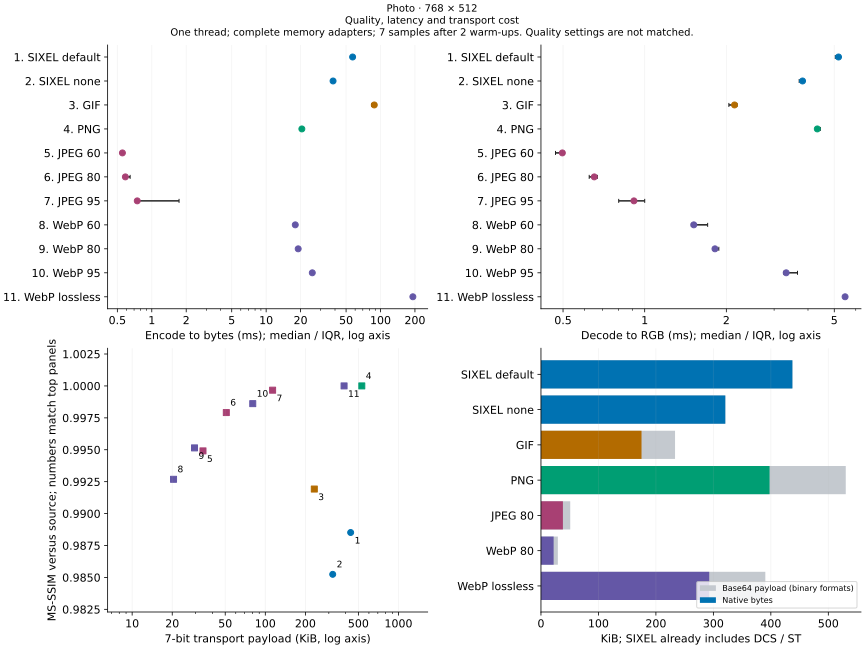
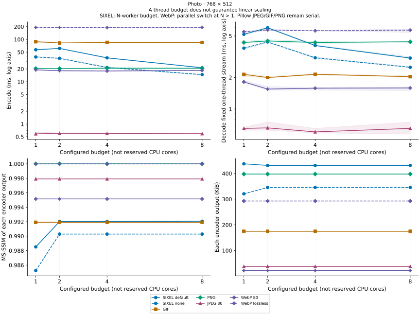
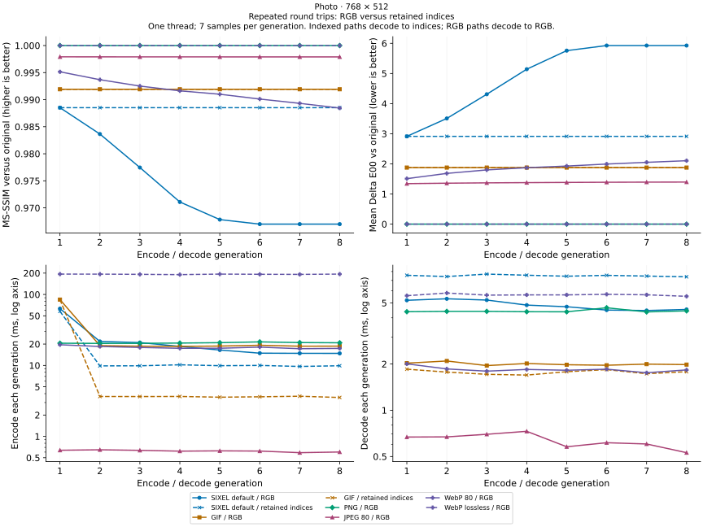
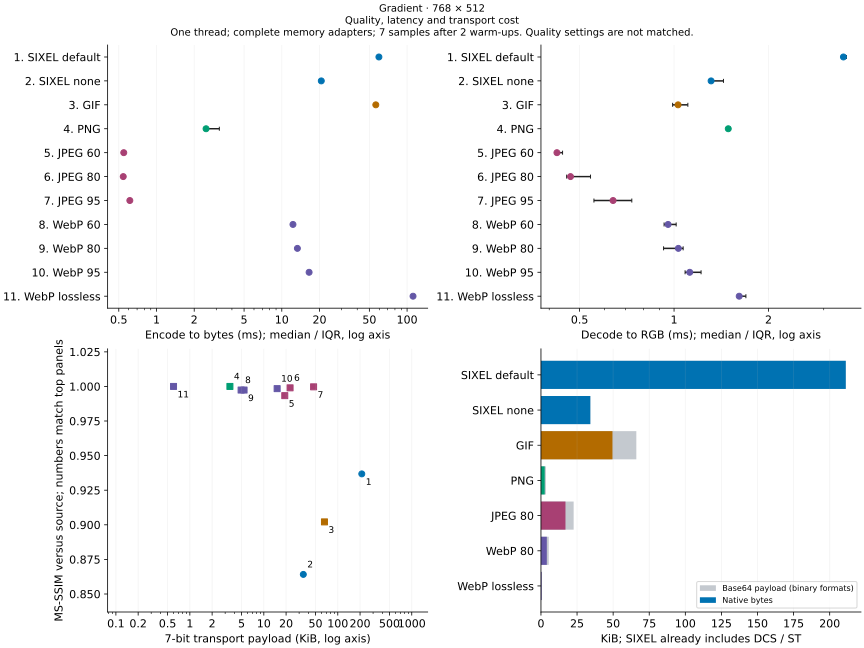
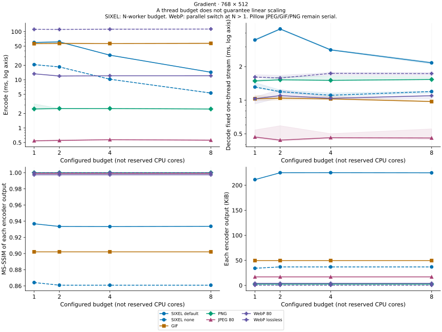
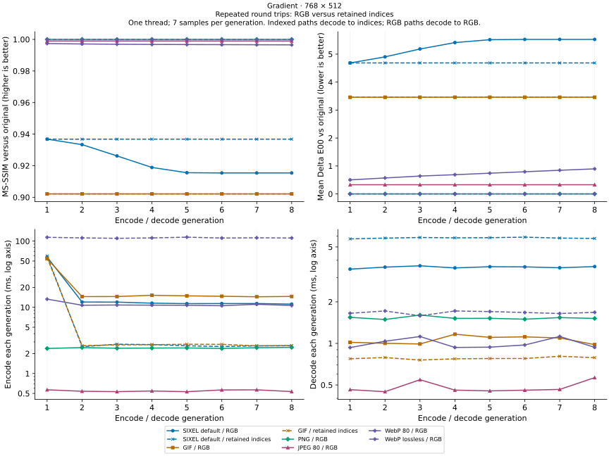
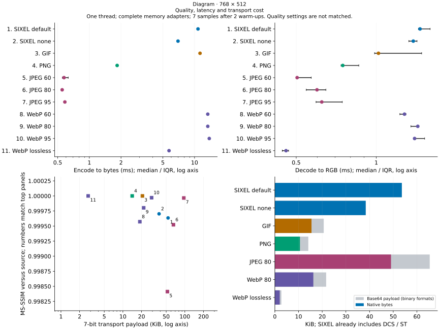
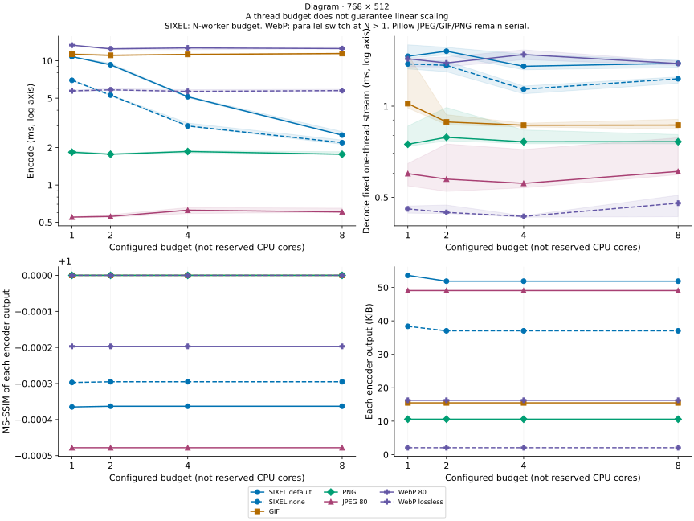
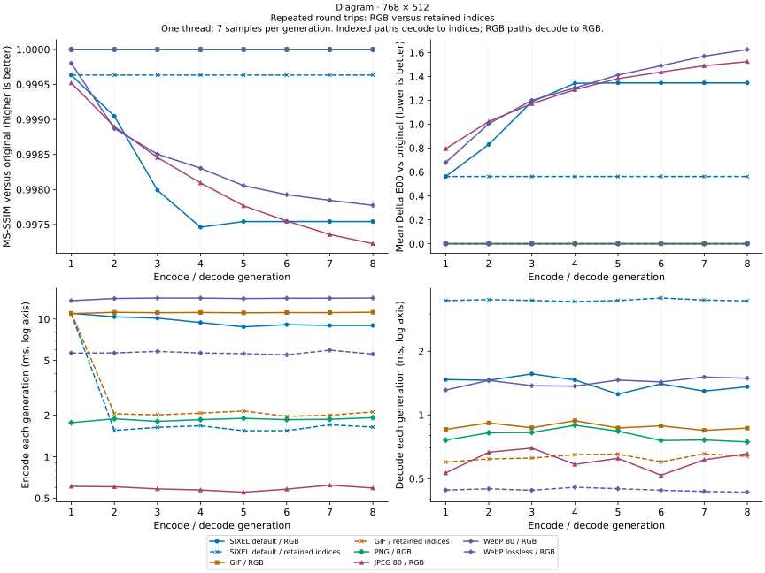

# SIXEL among contemporary image codecs

## Three independently useful ideas

SIXEL has an old wire syntax, but its ordinary image pipeline combines **color quantization**, **six-row color masks with run-length coding**, and **a terminal protocol that can be transmitted using only 7-bit bytes**. These are separate design choices. The terminal does not need to know whether the palette came from a classic median cut, a modern clustering solver, a perceptual color space, or a palette retained from an earlier frame.

Color quantization has continued to develop in the twenty-first century. For concrete examples, [Yinyang k-means (2015)](https://proceedings.mlr.press/v37/ding15.html) reduces redundant distance calculations in clustering, while [libimagequant's release history](https://github.com/ImageOptim/libimagequant/blob/main/CHANGELOG) records improvements to palette quality, fixed colors, remapping, dithering, and performance. The former is general clustering research, rather than a SIXEL benchmark; the latter is a production palette quantizer, rather than a new image syntax. Both illustrate why the age of a palette file format does not fix the quality or speed of its encoder. libsixel exposes these independently evolving stages through its [quantization models](../functionality/quantization.md), [working color spaces](../functionality/working-colorspace.md), and [palette policies](../functionality/overview.md).

The following comparison measures implementations and operating points, not a universal ranking of formats. It deliberately includes outcomes that favor the other codecs.

## Compression and concurrency are different properties

| Format / mode | Image representation and compression | Parallelism relevant to a single image | Native 7-bit terminal image protocol? |
| --- | --- | --- | --- |
| Ordinary SIXEL | Quantized palette, six-row color masks, decimal run lengths | Palette application and band serialization can run concurrently; decoder scans establish state before independent painting | Yes, with the 7-bit DCS/ST envelope and a SIXEL-capable terminal |
| GIF | Indexed palette and LZW dictionary coding | Palette construction can be parallelized; LZW decoding has dictionary dependencies | No |
| PNG | RGB/RGBA, grayscale, or indexed pixels; filtering and DEFLATE | Filtering and implementation-specific work can be parallelized; DEFLATE history and row-filter dependencies constrain straightforward splitting | No |
| Baseline JPEG used here | Chroma subsampling, block DCT, coefficient quantization and Huffman coding | Block transforms offer parallel work; restart intervals can provide independent entropy segments | No |
| Lossy WebP | Prediction, block transforms and entropy coding | libwebp provides encoder and decoder multithreading switches; the amount of parallel work depends on the path | No |
| Lossless WebP | Reversible transforms, backward references and entropy coding | Different dependencies from lossy WebP; enabling the switch does not promise the same speedup | No |

GIF uses [LZW](https://giflib.sourceforge.net/whatsinagif/lzw_image_data.html), not Huffman coding. PNG's [DEFLATE](https://www.w3.org/TR/PNG-Compression.html) combines LZ77 with Huffman coding. Huffman coding itself is not a proof that a format cannot be parallelized: JPEG [restart markers](https://datatracker.ietf.org/doc/html/rfc2435#section-4.4) provide resynchronization boundaries. Parallel performance depends on independently decodable partitions, state reconstruction, implementation, and memory traffic, as well as compression work.

SIXEL's simpler run-length expansion can therefore be faster than a more compact codec on an appropriate workload, particularly when independent bands are processed concurrently. It is a possibility to measure, not a general claim that entropy-coded formats are slow. SIXEL must still construct or reuse a palette, assign pixels, scan commands, establish palette/cursor state, and move its often larger byte stream. See [encoder threading](../threading/encoder.md) and [decoder threading](../threading/decoder.md) for the actual implementation. Arbitrary SIXEL streams are not independently decodable at every byte offset: register redefinition or overlapping paint can require fallback.

## What is measured

The experiment uses three opaque, gamma RGB8, 768 × 512 images: the repository's `images/snake.png` resized with Lanczos as a photographic workload; a deterministic smooth gradient; and a deterministic flat-color diagram with text. These are illustrative image classes, not a representative image corpus. Inputs are included with the [raw results](../sixel-format-figures/comparison/results.json). No alpha, animation, ICC profile, metadata-preservation, terminal painting, display upload, or hardware codec work is measured.

Each encode starts with pixels in memory and ends with complete image bytes in memory. Each decode starts with bytes in memory and ends with a loaded RGB image, except for the explicitly labeled retained-index generation path. Timings include the Python/native adapters, input/output copies, allocation and cleanup; they exclude disk I/O, process startup, LSQA, Base64 conversion and terminal rendering. They are application-call latencies, not isolated inner-loop throughput. Different wrapper overheads remain a limitation, especially for sub-millisecond JPEG calls. SIXEL decoding uses `sixel_decode_pixels` directly; no downstream PNG writer is included.

| Implementation | Settings |
| --- | --- |
| libsixel | Archived committed source; optimized C99 build; 256-color default; `--precision=8bit`, `--gpu-policy=off`, `-E fast`; default diffusion and a separate `-d none` row; borrowed RGB8 or PAL8 frame API |
| Pillow JPEG / libjpeg-turbo | Quality 60, 80 and 95; 4:2:0; no optimized Huffman table pass |
| Pillow GIF | 256-color median-cut quantization for RGB input; existing indices for retained-index input; `optimize=False` |
| Pillow PNG / zlib | RGB PNG; compression level 6 |
| libwebp | Quality 60, 80 and 95, method 4; separate lossless quality/effort 80, method 4; native API multithreading switch |

Seven samples follow two warm-ups per cell. Graphs use medians and show the interquartile range on the primary timing comparisons. Timed repetitions within a generation start from the same preceding-generation image; only the final result advances the chain. Quality is measured with the repository's `lsqa`, against the original image for every generation, using MS-SSIM and mean Delta E00. PNG and lossless WebP are also checked for exact RGB equality; perceptual scores do not substitute for this check. Values below the project's usual 0.98/0.95 quality gates are reported as failed quality operating points, not accepted regression thresholds.

The 1/2/4/8 axis is a **configured worker budget**, not CPU affinity or reserved cores. SIXEL receives that count. The [WebP API](https://developers.google.com/speed/webp/docs/api) receives `thread_level=1` / `use_threads=1` for every budget above one, because these are Boolean controls rather than exact counts. The measured Pillow JPEG/GIF/PNG paths remain serial for a single image. Thus their additional-budget points do not imply use of 2/4/8 workers. All runs are sequential; there is no multi-image throughput benchmark. Other host activity and scheduling can affect the results.

Decoder scaling always uses the same bytes produced by the one-thread encoder. Encoder scaling also records quality and size at each budget: parallel palette/diffusion choices can change its result. These graphs must not present a changed-quality encoder as a pure same-output speedup. Equal numerical quality settings in JPEG and WebP likewise do not mean equal quality; consult the measured quality/size points.

## Transport size: three bytes become four

For a binary image of `n` bytes, standard padded Base64 uses `4 * ceil(n / 3)` bytes, before any surrounding terminal graphics command, chunk headers or line breaks. The comparison calls this **7-bit transport payload**, not total protocol traffic. For SIXEL it uses the native stream size, including its DCS, raster/palette commands and ST. Every generated SIXEL stream is checked to use only bytes below 128 and to have a 7-bit envelope.

The roughly 33% expansion changes the comparison but does not guarantee a SIXEL size advantage. JPEG and WebP can remain substantially smaller after Base64. Furthermore, Base64 alone does not make JPEG/GIF/PNG/WebP render on a terminal: a receiving protocol and implementation are still required. A 7-bit-clean connection also does not imply SIXEL support. Multiplexer wrapping and transport-specific escaping are outside this model.

## Observed results on the recorded host

The checked-in run used an Apple M3 Max (14 logical CPUs), macOS 26.5.1, Apple Clang 21 with `-O3`, libsixel revision `8c92a878cc5afe3513b6a59bf8542b71ee038d18`, Pillow 12.3.0 with libjpeg-turbo 3.1.4.1 and zlib-ng reporting 1.3.1.zlib-ng, and libwebp 1.6.0. Plotting used matplotlib 3.11.1. The source revision identifies the isolated codec build, not unrelated work in the shared checkout.

| Photo observation | Recorded median or quality |
| --- | --- |
| Default SIXEL encode, budget 1 → 8 | 57.03 → 21.36 ms; MS-SSIM also changes 0.9885 → 0.9921 |
| Default SIXEL decode, identical bytes, budget 1 → 8 | 5.18 → 3.07 ms |
| JPEG quality 80, budget 1 | 0.59 ms encode, 0.65 ms decode; MS-SSIM 0.9979 |
| SIXEL native bytes versus RGB PNG Base64 payload, budget 1 | 447,985 versus 543,080 bytes; PNG is lossless and SIXEL is not |
| JPEG quality 80 / WebP quality 80 Base64 payload | 52,168 / 30,104 bytes; both are much smaller than SIXEL here |
| Retained-index SIXEL encode, generation 1 → 2 | 57.82 → 9.86 ms; generations 2–8 preserve generation-one RGB exactly |
| Retained-index GIF encode, generation 1 → 2 | 84.70 → 3.65 ms; generations 2–8 preserve generation-one RGB exactly |

SIXEL's eight-budget photo decode is faster than this RGB PNG decode (about 4.40 ms), but it is slower than this JPEG, GIF and lossy WebP decode. On the diagram, eight-budget SIXEL encoding is about 2.52 ms versus lossy WebP quality 80 at 12.54 ms, while PNG and JPEG remain faster. These are useful examples of workload-dependent tradeoffs, not a Huffman-versus-RLE law or a matched-quality victory.

The gradient exposes a real limitation: default one-thread SIXEL and GIF score about 0.9368 and 0.9021 MS-SSIM, below the usual 0.95 floor. These operating points are unsuitable when that quality floor is required. The quantizer's continuing development does not make every default palette sufficient for every image.

## Photographic workload

<picture>
  <source media="(max-width: 640px)" srcset="../sixel-format-figures/comparison/photo-profile-mobile.svg">
  
</picture>

The timing points compare all sampled codec configurations; the quality plot shows why file size and latency cannot be interpreted without distortion. The native/transport panel uses representative quality-80 JPEG/WebP rows, both SIXEL diffusion choices, GIF, PNG and lossless WebP.

<picture>
  <source media="(max-width: 640px)" srcset="../sixel-format-figures/comparison/photo-scaling-mobile.svg">
  
</picture>

## Repeated encoding is a state contract

The generation experiment decodes GIF/SIXEL into its index plane and palette and supplies that representation to the next encoder. JPEG, PNG and WebP use their decoded RGB pixels. The first generation always starts with the same original RGB image. Palette construction and nearest-color assignment can then be bypassed from generation two onward for GIF/SIXEL. This is reuse of the decoded representation, not reuse of previously compressed bytes or a warmed encoder object; each SIXEL encode creates a fresh encoder.

This indexed path reflects ordinary `img2sixel` SIXEL-to-SIXEL conversion. The [encoder](../../src/encoder.c) enables palette retention for ordinary input without resizing or a color override, and the SIXEL loader in [loader-builtin.c](../../src/loader-builtin.c) returns PAL8 pixels with their palette when the requested palette capacity suffices. The command sequence is:

```sh
img2sixel --threads=1 -o generation1.six photo.png
img2sixel --threads=1 -o generation2.six generation1.six
img2sixel --threads=1 -o generation3.six generation2.six
```

A separate CLI verification using the recorded libsixel source build repeated this operation through generation eight for all three fixtures. Every generation's decoded RGB pixels matched generation one exactly. This verifies the actual file-loader/encoder path; the graphed timings remain the in-memory API measurements described above and do not include CLI startup or file I/O.

The generation graphs therefore retain one native representation path per codec. SIXEL/GIF preserve first-generation pixels in all measured generations, including the initial quantization error. PNG and lossless WebP preserve the original RGB pixels from generation one without needing a palette; indexed PNG could also reuse palette state, although that mode is not measured here. Lossy JPEG/WebP can accumulate distortion, but the amount depends on the image and settings; a sequence can approach a stable point rather than losing the same amount at every step.

<picture>
  <source media="(max-width: 640px)" srcset="../sixel-format-figures/comparison/photo-generations-mobile.svg">
  
</picture>

Indexed decode times have a different output contract from RGB decode times and must not be ranked as interchangeable decoder performance. All generation quality measurements expand indices to RGB outside the timed region.

## Gradients and diagrams

A photograph alone hides both smooth-gradient palette limitations and the favorable long runs in flat graphics. The following figures retain these workloads separately instead of averaging away those differences.

### Gradient workload

<picture>
  <source media="(max-width: 640px)" srcset="../sixel-format-figures/comparison/gradient-profile-mobile.svg">
  
</picture>

<picture>
  <source media="(max-width: 640px)" srcset="../sixel-format-figures/comparison/gradient-scaling-mobile.svg">
  
</picture>

<picture>
  <source media="(max-width: 640px)" srcset="../sixel-format-figures/comparison/gradient-generations-mobile.svg">
  
</picture>


### Diagram workload

<picture>
  <source media="(max-width: 640px)" srcset="../sixel-format-figures/comparison/diagram-profile-mobile.svg">
  
</picture>

<picture>
  <source media="(max-width: 640px)" srcset="../sixel-format-figures/comparison/diagram-scaling-mobile.svg">
  
</picture>

<picture>
  <source media="(max-width: 640px)" srcset="../sixel-format-figures/comparison/diagram-generations-mobile.svg">
  
</picture>

## Reproduction and provenance

The [measurement adapter](../../tools/format-comparison/codecs.c), [driver](../../tools/format-comparison/measure.py), [result validator](../../tools/format-comparison/check.py), and [plotter](../../tools/format-comparison/plot.py) are maintained with this guide. The driver verifies that the adapter and decoder resolve the same libsixel library. This matters on macOS, where an absolute dylib install name can override a build-directory rpath.

Install Python dependencies (`Pillow`, `numpy`, `matplotlib`) in a dedicated environment, and provide a C compiler, pkg-config, libwebp development files and the project's build prerequisites. Then run from the repository root:

```sh
PYTHON=/path/to/venv/bin/python tools/reproduce_format_comparison.sh
```

The wrapper archives a committed revision into an isolated temporary source directory and builds it with `CFLAGS=-O3`. It never benchmarks the shared dirty worktree. Set `REVISION` to reproduce a particular recorded implementation. The saved records retain the original timing samples; selection metadata identifies the original archive and the omitted RGB-requantization controls. The metadata records the full source revision, compiler, CPU, runtime and codec versions, build configuration, adapter/library digests, script digests, and input PNG digests. Timing and output records include all seven samples, stream/pixel hashes, quality, native bytes, transport bytes and generation equality assertions. The source snapshot is kept in the temporary study directory for inspection; `STUDY_DIR` can select that location.

To validate the saved data and regenerate figures without rerunning measurements:

```sh
python tools/format-comparison/check.py docs/sixel-format-figures/comparison
python tools/format-comparison/plot.py docs/sixel-format-figures/comparison
```

Pass `--check` to the plotter to verify byte-for-byte figure freshness without writing files. The SVGs have deterministic identifiers and no timestamp; use the same matplotlib version for byte-identical plot regeneration. Wide figures use a two-column layout and mobile figures stack the same four panels. Input examples and raw JSON remain available when the host Markdown renderer does not honor `<picture>` media selection.
