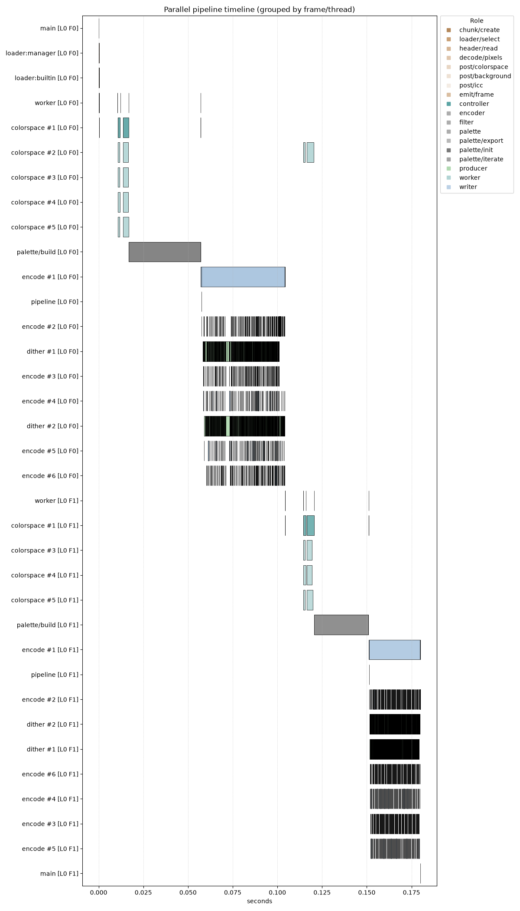

# Animation Threading

## Current frame pipeline

For supported multi-frame loaders, the loader callback can hand frames to one
encoder worker through a bounded queue. The queue capacity is four frames.
This lets loading and frame encoding overlap without allowing unbounded decoded
frames to accumulate.

```text
loader / callback thread               frame encoder thread
------------------------               --------------------
decode frame 0 ---- enqueue ----------> encode frame 0
decode frame 1 ---- enqueue ----------> encode frame 1
decode frame 2 ---- wait if full -----> ...
```

There is one frame-encoder worker. It pops one frame, completes that frame's
encoding, and only then pops the next. The current design therefore does not
encode several frames concurrently. Frame ordering, output order, and temporal
dither state remain straightforward at this boundary.

The finite two-frame measurement shows frame 1 beginning after frame 0's
frame-level encode interval finishes. Internal work within each frame is still
parallel; the repeated dither and encode worker rows belong to that frame's
own pipeline.



The fixture intentionally has two frames and no loop extension. An infinitely
looping animation is unsuitable for a reproducible timeline command because
neither the JSONL record nor the SIXEL output has a natural completion point.

## What is and is not shared

The current concern is not that several frame encoders simultaneously spend
the complete configured budget: frame encoding is serialized. The missing
abstraction is broader. Each component creates an independent short-lived pool
and resolves its own count; there is no process-wide coordinator that lends a
bounded number of worker leases to the loader, palette builder, current frame,
or output work.

As a result:

- `--threads=N` does not cap caller, loader-handoff, and writer threads;
- a palette worker can temporarily overlap main work;
- each new frame can create a fresh internal worker pool with the configured
  budget; and
- future frame-level parallelism would oversubscribe unless it introduced
  hierarchical budget ownership at the same time.

This is why “share the budget between frames” should not be implemented by
dividing `N` eagerly at animation start. Only one frame may be ready, a loader
may block, and policies may resolve incrementally. A future coordinator should
grant and reclaim leases as stages become runnable while preserving a clear
total-budget invariant.

## Temporal state constrains parallelism

Animation is more than an ordered list of independent still images. Inter-frame
dithering carries state across frame boundaries and can apply scene-cut reset
policy. It currently reports that parallel dither work bands are unsupported.
Any future parallel-frame design must define ownership of temporal state and
commit it in display order; computing later frames against speculative or
stale state would change the algorithm.

Frame ownership also matters. The handoff can retain a shareable frame by
reference, or clone it when later preprocessing could conflict with loader
reuse. Performance changes must preserve that lifetime contract as well as
visual ordering.

## Future budget-coordinator requirements

A process-wide budget design should be attempted as a separate architecture
change. At minimum it needs:

1. one explicit root budget for the operation;
2. incremental leases for only the stages that are runnable now;
3. reclamation when palette, dither, decode, or encode stages finish;
4. no hidden worker creation outside the accounted control threads;
5. ordered frame publication and temporal-state commit; and
6. timeline fields that record requested, granted, active, and returned
   workers.

The existing timelines establish a baseline against which that design can be
reviewed; they do not by themselves justify concurrent frame encoding.
