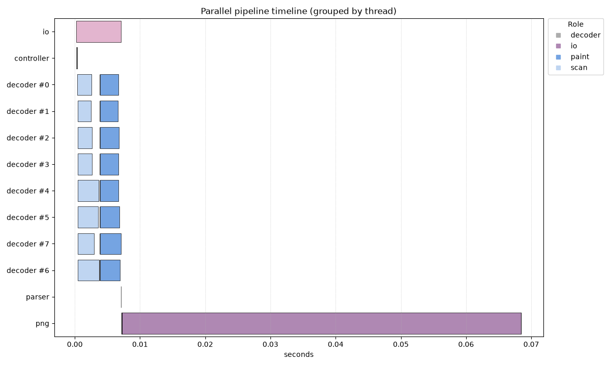
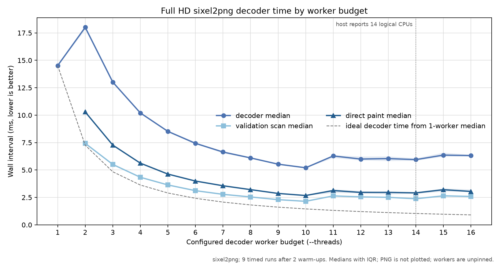

# Decoder Threading

## Why decoding is split by bytes

A SIXEL stream states vertical movement through control sequences in the input.
Before parsing those sequences, an arbitrary byte offset cannot be mapped
directly to a destination-row strip. The decoder therefore begins serially,
establishes raster bounds and initial palette state, and passes the remaining
payload to the parallel decoder as byte spans.

The default span lengths are nearly equal. `SIXEL_PARALLEL_SKEW` can bias the
distribution by up to 20 percent so later workers receive systematically more
or less input. Thread count is capped by payload length; a payload cannot have
more non-empty initial spans than bytes.

## Normal direct path

The normal path is a two-pass design rather than a single parallel paint:

```text
serial parser reaches parallel anchor
                 |
                 v
       split payload into N byte spans
                 |
                 v
       parallel validation/state scan
                 |
             join all N
                 |
                 v
       derive each span's painted rows
                 |
     overlap? ----+---- yes -> serial fallback
                 |
                 no
                 v
       create all N paint workers
                 |
       all-ready release barrier
                 |
                 v
          parallel paint + join
                 |
                 v
       continue serial parser/output
```

Each scan reconstructs the local SIXEL state needed at its useful boundary.
It also records the first and last row that the corresponding paint pass would
touch. The controller releases all paint workers together only when those row
ranges are ordered and disjoint. The shared pixel and paint-mask buffers can
then be updated without locks because no two workers own the same row.

An arbitrary byte split is advanced to the next SIXEL `-` boundary. This
normally aligns useful work to complete six-row bands; it does not create an
automatic five-row overlap. Several short byte spans can, however, converge on
the same later boundary and describe overlapping rows. The current
implementation detects that case after scan and falls back before paint rather
than attempting an unsafe parallel write.

All paint workers wait at a release barrier. If any worker cannot be created,
the controller aborts and joins the workers that already exist while they are
still blocked, leaving the serial fallback image untouched.

## Why a PNG phase appears

All checked-in decoder measurements invoke `sixel2png`. The command first uses
libsixel to decode the SIXEL stream and then serializes the returned raster as
a PNG file. Its timeline therefore contains a downstream `png/io` interval in
addition to the decoder interval. PNG wall time is retained to make the CLI
measurement boundary explicit and to show end-to-end context; it is not
decoder work and is not parallelized by the decoder's `--threads` budget.

The checked-in eight-worker timeline uses a 1920 by 1080 raster. Eight scan
intervals begin together. All eight paint workers then become ready at a
barrier before their intervals begin as a parallel block. PNG output follows
and dominates the remaining process wall time; it is not part of the decoder
worker budget. Scan is shown in light blue and paint in dark blue.



*Figure: Full HD decoding measured through `sixel2png`; the final PNG interval
is CLI output serialization after libsixel decoding.*

## Worker-budget scaling

The following Full HD experiment varies `--threads` from one through sixteen.
The horizontal axis is the configured decoder worker budget, which is the
closest user-facing control to an available-core budget. It is not a count of
reserved physical cores: workers have no affinity, the host is not isolated,
and this arm64 macOS host reports fourteen logical CPUs.

Each point is the median of nine instrumented runs after two warm-ups. The
shaded region is the inclusive interquartile range. Successive rounds traverse
worker counts in alternating directions to reduce monotonic time-order bias.
GPU processing is disabled. PNG serialization is excluded from the plotted
lines because `--threads` does not parallelize it.



*Figure: Full HD decoder intervals measured inside `sixel2png`. PNG
serialization is measured separately but intentionally omitted from these
worker-scaling lines.*

The one-worker serial path took 14.519 ms at the median. Two workers took
18.009 ms, 24.0 percent longer: the parallel path pays for a validation scan,
a joined independence check, worker creation, and a separate paint pass, while
too little work is available to amortize them. Time then fell through ten
workers, where the best observed decoder median was 5.204 ms, or 2.79 times
faster than the one-worker path. Counts from eleven through sixteen did not
produce a consistent further reduction; their medians ranged from 5.947 to
6.360 ms.

Both validation scan and direct paint scale through the useful range, then
flatten near 2.1 to 3.2 ms. This explains why the complete decoder curve remains
well above the ideal `T(1) / N` guide: the two phases are sequential, and each
retains scheduling, barrier, and controller costs. The associated PNG phase
was approximately 61 to 63 ms and did not improve with worker count.

These numbers characterize this fixture, binary, and host. Diagnostic JSONL
logging perturbs short phases, and no CPU affinity, exclusive host, frequency
control, or confidence-interval claim is implied. The retained
[`decoder-thread-scaling.csv`](measurements/decoder-thread-scaling.csv)
contains all 144 timed observations rather than only the plotted summaries.
It also retains the 32 warm-up executions and their exact schedule positions.

## Raster-size comparison

The same source and encoder policy were used to create two dedicated decoder
fixtures. These are single diagnostic observations, not repeated performance
benchmarks:

*Table: Single-run raster-size observations measured through `sixel2png`.
`PNG wall` is the command's downstream output-serialization phase, not part of
the libsixel decoder interval.*

| Raster | SIXEL bytes | Scan wall | Parallel paint wall | Decoder wall | PNG wall |
| --- | ---: | ---: | ---: | ---: | ---: |
| 900 x 675 | 334,858 | 2.395 ms | 1.792 ms | 4.555 ms | 28.513 ms |
| 1920 x 1080 | 1,114,189 | 3.295 ms | 3.206 ms | 6.836 ms | 61.257 ms |

Increasing the raster from 607,500 to 2,073,600 pixels multiplied the pixel
count by 3.41, scan wall time by approximately 1.38, parallel-paint wall time
by approximately 1.79, and the complete decoder interval by approximately
1.50 in this run. These two points include visible single-run scheduling and
cache noise and must not be read as a scaling curve. At Full HD, scan and paint
occupy 48.2 and 46.9 percent of the decoder interval,
respectively. PNG serialization remains much longer than either decoder phase
in both observations.

The percentages use the complete decoder interval as their denominator. Scan,
paint, and controller gaps do not form a perfectly additive partition, and PNG
serialization is deliberately excluded. The retained
[`decoder-size-comparison.csv`](measurements/decoder-size-comparison.csv) and
both raw timelines allow this observation to be recalculated.

Calling this only “band decoding” hides two facts: the initial work units are
encoded byte spans, and destination paint becomes row-parallel only after the
validation pass has proved independence.

## Local-buffer and undither path

When decoder-side undithering is prepared, workers can decode into local row
chunks and publish finished rows through the ordered coordination path. Local
buffers reduce direct write conflicts and permit more work to remain inside
the parallel worker lifetime. This path has different allocation and copying
costs from direct paint and must be measured separately.

Do not infer behavior for decoder undithering from the direct-path chart. A
timeline should identify scan, decode, paint, local-copy, and output stages
explicitly whenever those paths are compared.

## Fallback and correctness

Parallel decoding begins only after the serial parser has established an
anchor. A worker can still encounter syntax that needs global parser context,
including raster resets or palette redefinitions. Such a stream may fall back
to serial handling. This is an intended correctness boundary, not proof that
the configured thread option was ignored.

Parallel work must preserve:

- control-sequence and palette semantics at each span boundary;
- disjoint row ownership, or clean fallback before shared-buffer writes;
- raster clipping, paint-mask, and OR-mode behavior;
- identical malformed-input and allocation-failure handling; and
- the public decoder's output ownership contract.

The timeline instrumentation records paired starts and finishes for both scan
and paint. `tests/cli/sixel2png/0011_parallel_timeline_spans_paired.t` keeps
that diagnostic contract from silently degrading back to zero-length markers.
`0012_parallel_paint_barrier.t` verifies that every paint worker reaches the
barrier before paint begins. Decoder tests 0025 and 0026 cover partial worker
creation and overlapping row ranges, including the clean-fallback guarantee.

## Measurement limits

The checked-in timeline and two-size comparison are single diagnostic
observations from one generated image class. The worker-budget figure is a
repeated decoder scaling curve, but remains one session on one host. A broader
performance study should vary payload size, SIXEL command mix, destination
dimensions, palette changes, OR mode, output format, and host. Measure
parser/paint time separately from PNG serialization when the question is
decoder parallelism.
