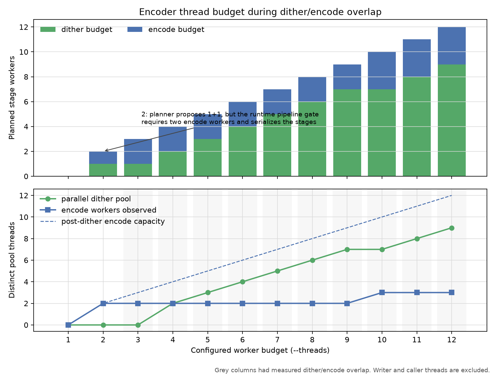
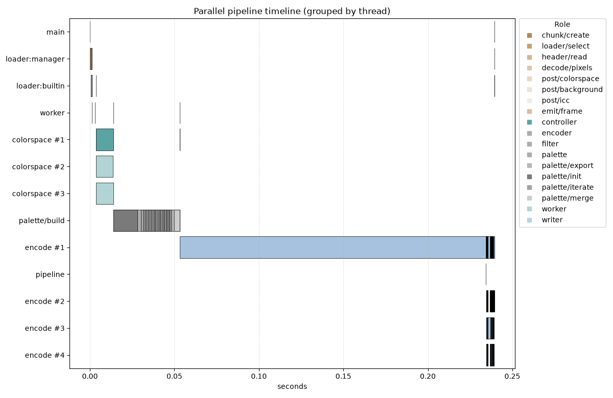
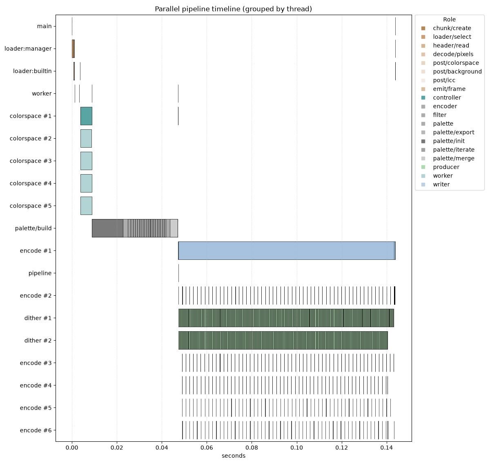
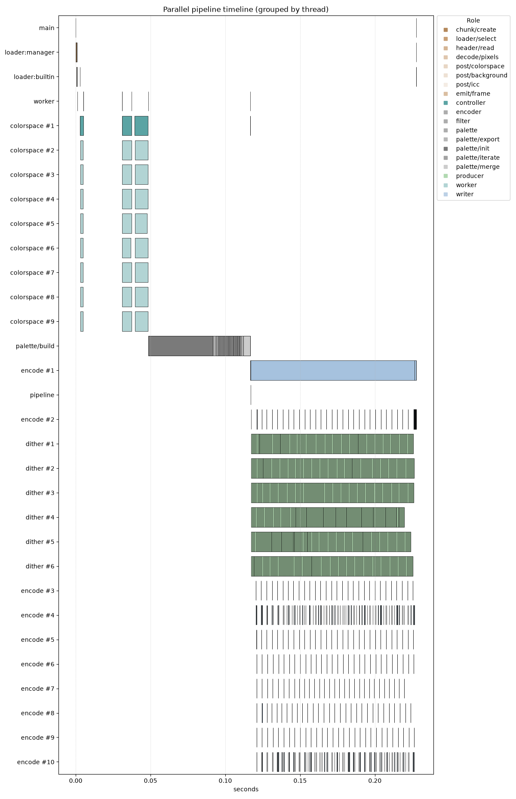
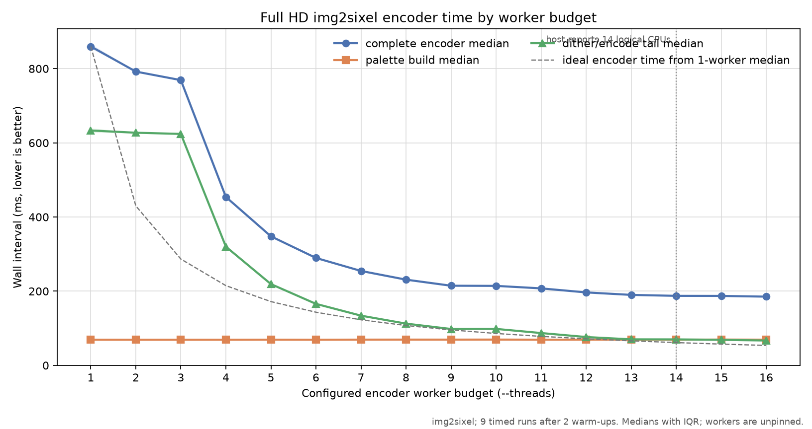
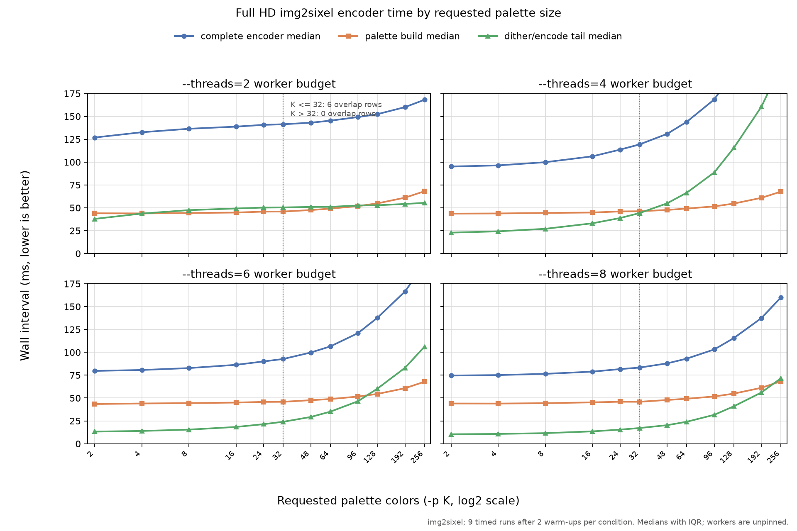

# Encoder Threading

## Execution stages

The fixed-palette encoder has several opportunities for overlap. The complete
pipeline is broader than the final dither/encode window:

```text
load and normalize frame
          |
          +---- optional palette-build worker ----+
          |                                        |
          +---- independent main/preplan work -----+
                                                   v
                                    completed palette
                                                   |
                         +-------------------------+
                         v
          palette application / dithering work bands
                         |
                  completed index rows
                         |
             six-row encode-job queue
                         |
                 encode worker pool
                         |
                  ordered writer thread
```

The planner can temporarily reserve one worker for asynchronous palette work
and assign the remainder to `main_threads`. That early split is distinct from
the later dither/encode split. Once palette work has joined, the final encoder
resolves the configured thread count again, so a timeline can contain more
stage transitions than one static allocation table suggests.

## Dither/encode budget policy

For a CPU palette-application path with `N > 1`, the planner starts with

```text
D0 = ceil(0.7 N)
E0 = N - D0
```

and clamps the active pipeline to retain at least two encode workers when
`N > 2`. The remaining workers are assigned to dither. Explicit dither thread
limits can override the automatic split. GPU palette application is different:
the GPU produces the complete index plane, so all CPU workers are placed on
the encode side after the command buffer becomes visible.

The measured automatic allocation for `N = 1..12` is shown below. These runs
use `img2sixel` to resize the controlled 900 by 675 source to a 1920 by 1080
processed raster before encoding:

| `--threads` | Planned dither | Planned encode | Runtime interpretation |
| ---: | ---: | ---: | --- |
| 1 | 0 | 0 | Serial palette application and encoding |
| 2 | 1 | 1 | Pipeline gate rejects one encode worker; stages serialize, then two encode workers run |
| 3 | 1 | 2 | First dither/encode overlap; dither is the caller-side producer |
| 4 | 2 | 2 | First overlap with a multi-worker dither pool |
| 5 | 3 | 2 | Parallel dither and encode |
| 6 | 4 | 2 | Parallel dither and encode |
| 7 | 5 | 2 | Parallel dither and encode |
| 8 | 6 | 2 | Parallel dither and encode |
| 9 | 7 | 2 | Parallel dither and encode |
| 10 | 7 | 3 | Parallel dither and encode |
| 11 | 8 | 3 | Parallel dither and encode |
| 12 | 9 | 3 | Parallel dither and encode |

The two-worker exception is important. Although the planner reports `1 + 1`,
the runtime requires more than one encode worker before enabling row-by-row
dither/encode overlap. The first actual overlap is therefore at three workers,
not two. A true parallel dither pool starts at four workers; at three workers,
the single dither budget is consumed by the producer executing palette
application.



*Figure: Full HD encoder allocation measured through `img2sixel`. This chart
shows planned and observed worker counts, not elapsed time.*

The top panel shows planner allocation. The lower panel distinguishes workers
that actually executed jobs from post-dither encode capacity. After palette
application finishes, the encode pool asks to grow by the retired dither
budget. This makes the full worker budget available to a remaining encode
tail, but it does not guarantee that every added worker receives a job. In the
recorded run, the initial encode workers drained the queue before newly
available capacity performed work.

## Six-row jobs and ordered output

Palette application writes indexes into a shared image buffer. Each completed
six-row range becomes eligible for an encode job. Encode workers classify and
compose separate SIXEL body fragments, so they can finish out of order. A
dedicated writer waits for increasing band indexes and appends fragments to the
output callback in deterministic order.

The queue is bounded. Backpressure prevents palette application from getting
arbitrarily far ahead of encoding and bounds the number of buffered output
fragments. Source rows that are completely outside a transparent output extent
can be submitted as empty bands so the ordered writer still advances.

The writer and the thread performing palette application are not counted as
encode workers. Therefore a two-worker encode can show a caller/controller,
two encode workers, and one writer in the operating-system thread timeline.

## Timeline interpretation

The `loader:builtin` spans in these figures decode the 900 by 675 source PNG;
they do not decode a Full HD PNG. The complete preprocessing sequence for the
controlled `-Wgamma -Xoklab` command is:

```text
builtin PNG decode: 900x675 gamma RGB888
              |
              v
colorspace/pre: gamma RGB888 -> linear RGB float32
              |
              v
resize: 900x675 -> 1920x1080 in linear RGB float32
              |
              v
colorspace/post: linear RGB float32 -> gamma RGB888 (-Wgamma)
              |
              v
palette input: gamma RGB888 -> Oklab float32 (-Xoklab)
              |
              v
K-means palette build
```

The first two conversions bracket the `scale` interval rather than belonging
to it. In the retained eight-worker run, linearization took 3.888 ms, the
linear-RGB resize took 26.164 ms, conversion back to gamma RGB took 6.412 ms,
and the later Oklab conversion took 8.926 ms. Thus the scale bar alone omits
19.226 ms of required color conversion before palette construction. The
repeated bars on each `colorspace #N` row belong to these distinct conversion
stages; the row identifies a reused operating-system thread, not one semantic
colorspace operation.

Across the retained two-, four-, and eight-worker runs, chunk creation took
0.541 to 1.015 ms, builtin pixel decode took 0.333 to 0.415 ms, and the
linear-RGB resize itself took 25.373 to 26.164 ms. The 1,823,391-byte source is
almost the size of its 1,822,500-byte unpacked RGB payload and was read from a
warmed filesystem cache. Its unusually short decode interval is therefore real
for this fixture, but is not representative of decoding a compressed Full HD
PNG.

At two configured workers, palette application completes before the band
workers begin useful encode work. The long `encode` interval is the frame-level
operation; the short worker intervals at its end are the six-row jobs.



*Figure: Single `img2sixel --threads=2` diagnostic run. The builtin loader
decodes the 900 by 675 PNG; colorspace rows then show linearization, conversion
back to gamma after the Full HD resize, and Oklab palette-input conversion.*

At four workers, two dither work bands overlap two initial encode workers. The
solid dither spans are work-band lifetimes; the thin encode marks are many
short six-row jobs. The frame-level interval and writer appear in addition to
the configured worker budget.



*Figure: Single `img2sixel --threads=4` diagnostic run. The builtin loader
decodes the 900 by 675 PNG; colorspace rows then show linearization, conversion
back to gamma after the Full HD resize, and Oklab palette-input conversion.*

At eight workers, six dither work bands overlap two initial encode workers.
The pool then requests the complete encode capacity after dithering ends. The
larger processed raster makes the relative span lengths easier to see than the
previous 900 by 675 timeline.



*Figure: Single `img2sixel --threads=8` diagnostic run. The builtin loader
decodes the 900 by 675 PNG; colorspace rows then show linearization, conversion
back to gamma after the Full HD resize, and Oklab palette-input conversion.*

These charts use `tools/timeline.py --sort-order start`. Row numbering is local
to the rendered worker group and must not be interpreted as a stable thread
identity across separate runs.

## Worker-budget scaling

The following experiment varies `img2sixel --threads` from one through
sixteen while keeping the Full HD processed raster and all non-threading
policies fixed. The horizontal axis is a configured worker budget, not a
reservation of physical cores. Workers are unpinned, the host is not isolated,
and this arm64 macOS host reports fourteen logical CPUs.

This is specifically a 256-color experiment. Every point passes `-p 256`;
palette size is neither automatic nor varied in this chart. Here `256` is the
requested palette size, not a measurement of the number of distinct entries
that survived palette construction. The allocation chart and the two-, four-,
and eight-worker timelines above use the same fixed request. At 256 requested
colors the current automatic dither work-band overlap is zero, so these results
do not characterize the lower-color overlap path.

Each point is the median of nine instrumented runs after two warm-ups. The
shaded region is the inclusive interquartile range. Successive rounds traverse
worker counts in alternating directions. The complete encoder interval begins
before image loading and ends after the frame has been encoded. The palette
line isolates palette construction, while the dither/encode tail begins at
palette-application preparation and ends with the complete encoder interval.
These stage lines expose bottlenecks but are not an additive partition.



*Figure: Full HD encoder intervals measured through `img2sixel`; nine timed
runs follow two warm-ups at each configured worker budget. Lines show medians
and shading shows inclusive IQR.*

The one-worker encoder median was 859.297 ms. Two and three workers reached
only 1.09 and 1.12 times speedup because palette construction remained serial
and the dither/encode tail still used the serial or single-producer shape. Four
workers were the first point with a multi-worker dither pool and reduced the
median to 452.423 ms, a 1.90 times speedup. Eight workers reached 231.792 ms,
or 3.71 times faster than one worker.

Palette construction stayed close to 69 ms across all budgets. The complete
encoder curve flattened from 188.541 ms at thirteen workers to 185.138 ms at
sixteen; fourteen workers measured 188.888 ms, or 4.55 times faster than one
worker. The small ordering changes in that plateau are within this
non-isolated experiment and are not evidence that budgets beyond the host's
logical CPU count improve throughput.

The output remained deterministic across all eleven executions at each fixed
worker count, but it was not identical across worker counts. The retained
SIXEL sizes ranged from 1,106,783 to 1,114,189 bytes, a spread of about 0.7
percent. Parallel work-band boundaries alter error-diffusion history, so this
is a controlled threading comparison rather than an identical-output
microbenchmark. The raw
[`encoder-thread-scaling.csv`](measurements/encoder-thread-scaling.csv)
retains all 144 timed observations, 32 warm-up executions, phase intervals,
planner observations, output size and hash, and exact schedule positions.

## Palette-size scaling at selected worker budgets

The next experiment keeps the Full HD fixture and controlled encoder policies
above, but varies the requested palette size with `-p K`. The twelve requested
values are 2, 4, 8, 16, 24, 32, 48, 64, 96, 128, 192, and 256. Each panel fixes
`--threads` at 2, 4, 6, or 8. These are configured worker budgets, not reserved
physical cores. The shared horizontal axis uses a log2 scale so the low-color
region and the 32-color policy boundary remain legible.



*Figure: Full HD encoder intervals measured through `img2sixel` while varying
the requested `-p K` palette size. Each panel fixes a 2, 4, 6, or 8 worker
budget. Nine timed runs follow two warm-ups per condition; lines show medians
and shading shows inclusive IQR.*

The complete interval grows with requested palette size at every budget, but
the worker budget changes the magnitude. The measured endpoints were:

| `--threads` | 2 colors | 256 colors | 256/2 time ratio |
| ---: | ---: | ---: | ---: |
| 2 | 213.542 ms | 801.259 ms | 3.75 |
| 4 | 150.663 ms | 463.076 ms | 3.07 |
| 6 | 123.963 ms | 292.751 ms | 2.36 |
| 8 | 112.511 ms | 235.688 ms | 2.09 |

Palette construction increased comparatively gently, from about 45 ms at two
requested colors to about 71 ms at 256. Most of the observed color-count
dependence was in the dither/encode tail: its median rose from 70.286 to
633.478 ms at two workers, and from 16.501 to 112.525 ms at eight workers. The
retained SIXEL output also grew from roughly 273 KiB at two colors to about
1.06 MiB at 256 colors. These measurements identify the stage and output-size
covariation; they do not by themselves assign the cost to lookup, diffusion,
band encoding, or output writing.

The dotted line marks a second variable in the current automatic policy. Six
overlap rows are used through 32 requested colors, while requests above 32 use
zero overlap rows. The chart therefore describes the complete current policy,
but it does not isolate the cost of overlap from the cost of changing palette
size. A causal overlap comparison must hold `K` and every other policy fixed.

The raw
[`encoder-color-scaling.csv`](measurements/encoder-color-scaling.csv) contains
432 timed observations and 96 warm-ups. It records the requested color count,
worker budget, phase intervals, overlap decision, output size and hash, and
alternating schedule position for every execution.

### Quantizer-profile caveat

This palette-size sweep is not a default-policy benchmark. It explicitly uses
K-means with hard binning, a fixed seed, Ward merging, and Oklab clustering.
The top-level automatic palette policies normally retain the Heckbert
compatibility path. Merely deleting `--quantize-model=kmeans:seed=1` from this
command would not restore that path, because an explicit hard-binning request
causes automatic quantizer resolution to choose a weighted-point-capable
K-means implementation.

A focused check on the same Full HD processed fixture at 256 requested colors
and `--threads=8` illustrates why the distinction matters. After two warm-ups,
nine runs gave a 71.009 ms median palette-build interval for the measured
K-means/hard profile. Explicit `heckbert:profile=compat` with compatible
automatic binning gave 17.315 ms, about 4.10 times faster; the corresponding
complete encoder medians were 232.411 and 179.358 ms. This is a profile
comparison, not a one-variable quantizer comparison: Heckbert cannot consume
the hard-binned weighted points used by the K-means condition. The spot check
is evidence that the chart must not be extrapolated to default encoder
latency, not a replacement for a repeated Heckbert palette-size sweep.

## Image-quality boundary

The six-row encoder jobs consume already chosen palette indexes and do not
change their colors. The image-quality risk in this pipeline is the preceding
split of causal dithering into larger horizontal work bands. Overlap rows warm
local error state but cannot exactly reproduce an unlimited full-frame scan.
The detailed mechanism and default overlap are in the
[threading overview](overview.md#work-band-seams-and-image-quality).

Keep performance and quality conclusions separate:

- a timing timeline establishes which stages overlap;
- a serial-versus-banded decoded-image comparison establishes visual error;
- a byte-size comparison establishes whether changed palette-index patterns
  affect SIXEL output size; and
- none of those alone establishes application-level latency on a terminal.

## Conditions that change the shape

The measured shape is not universal. It can change when:

- the image is too short to provide multiple SIXEL or dither work bands;
- the selected dither policy does not support parallel work bands;
- GPU policy claims palette application;
- explicit `band_width`, `band_overwrap`, or dither thread limits apply;
- transparency offsets make the pipelined OR-mode path inapplicable;
- palette construction overlaps other planning work; or
- a lookup policy uses shared or per-worker prepared state.

Record all such settings when comparing results.
