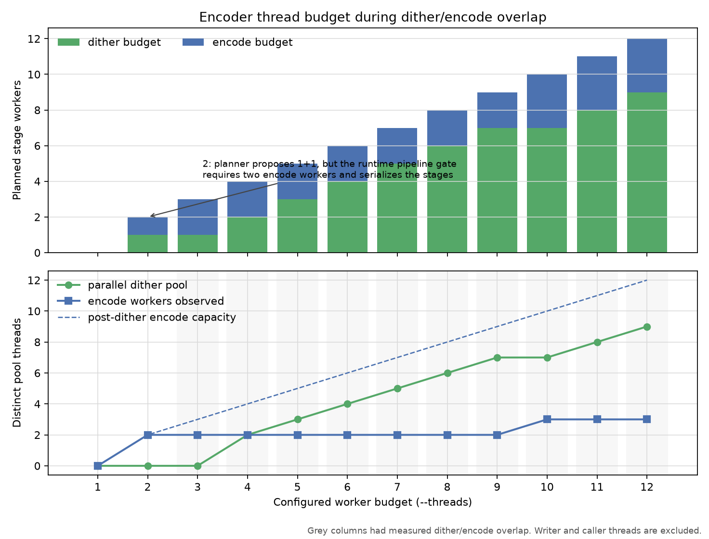
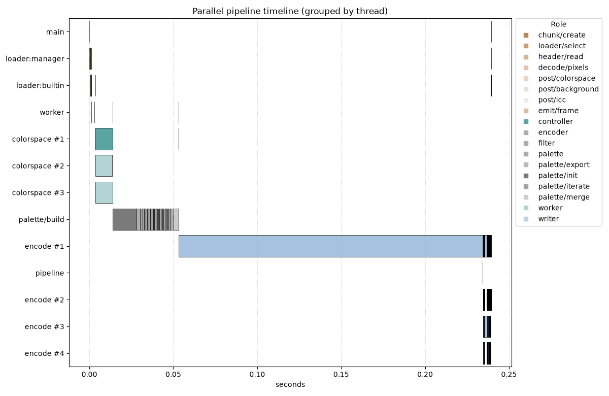
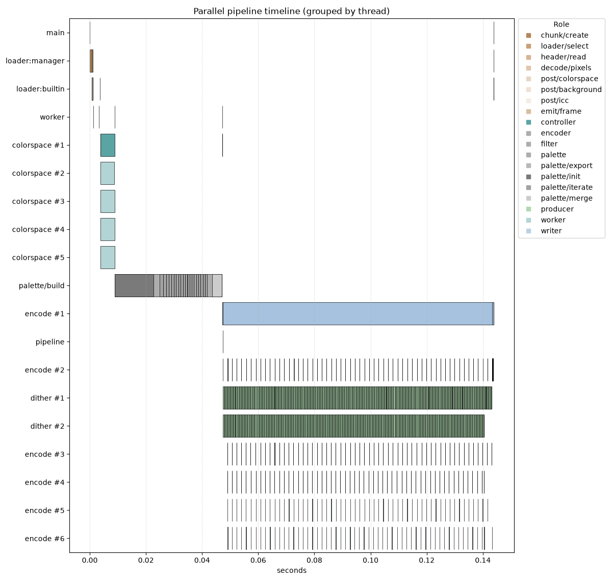
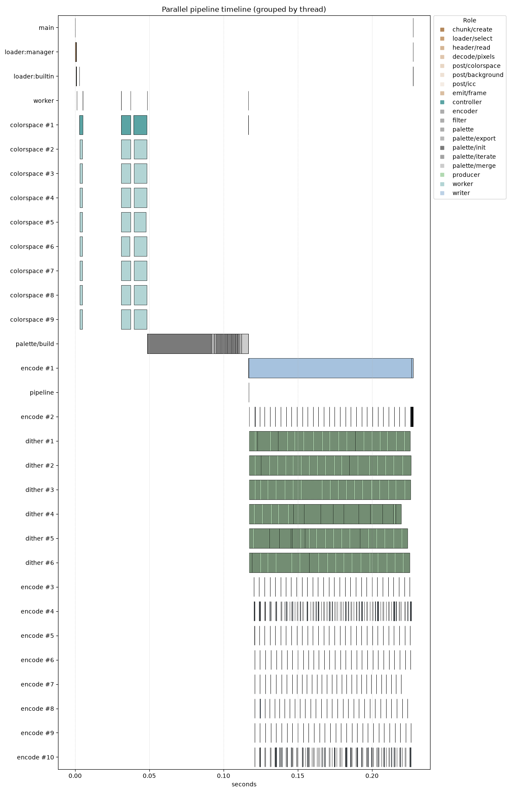
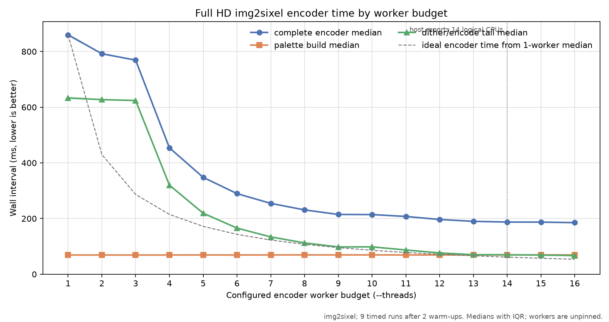
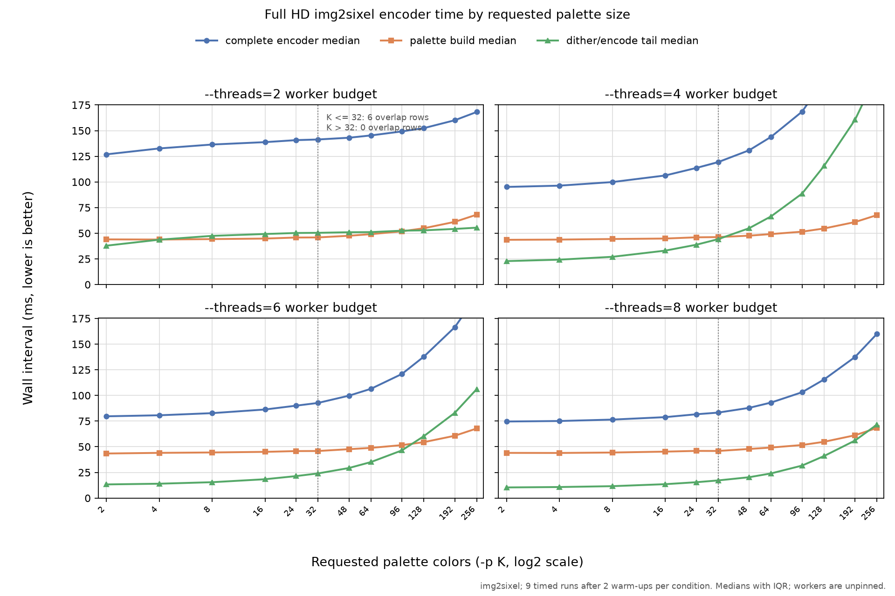

# Encoder Threading

This explanation is for users and contributors inspecting encoder scheduling, allocator details and measurements. The [threading-policy reference](../cli/threading-policy.md) owns options and defaults; [policy modes](policy-modes.md) compares mode behavior across stages.

## Execution stages

The fixed-palette encoder has several opportunities for overlap. The complete
pipeline is broader than the final dither/encode window:

```text
load and normalize frame
          |
          +---- optional palette-build worker ----+
          |                                        |
          +---- independent main/preplan work -----+
                                                   v
                                    completed palette
                                                   |
                         +-------------------------+
                         v
          palette application / dithering work bands
                         |
                  completed index rows
                         |
             six-row encode-job queue
                         |
                 encode worker pool
                         |
                  ordered writer thread
```

In balanced and greedy modes, the planner splits eligible asynchronous palette work and the main pre-plan into `floor(N/2)` and `ceil(N/2)` execution slots respectively. Each side includes its calling thread. The split is the initial overlap reservation. A large float working-space conversion polls for palette completion at chunk boundaries, joins the completed palette thread, and expands its pool to use the returned slots. Palette application and final encoding use the configured budget after collection. With two slots, each overlapping side is serial. With four or more, both the sample conversion for `-X` and the full-frame conversion for `-W` can run in parallel. [Policy modes](policy-modes.md#independent-work-and-data-fan-out) explains lazy branch reservations.

## Float colorspace transactions

The frame API and the float path of `sixel_helper_convert_colorspace()` share the same driver in [src/colorspace.c](../../src/colorspace.c). Above `SIXEL_COLORSPACE_PARALLEL_MIN_PIXELS`, it resolves the available budget through `sixel_threads_resolve_fanout()`, starts at most `N-1` pool workers, and includes the caller in conversion. Standalone conversions use one chunk per slot; an overlapping conversion larger than 16,384 pixels uses 16,384-pixel chunks and a bounded queue, with one caller chunk per submission batch. Every chunk converts into disjoint temporary RGB float32 storage using the same double-intermediate arithmetic as serial conversion. Only after all jobs have joined and succeeded does the controller copy the result into the original image. A nonfinite input, domain error, or float32 overflow leaves all original pixels and frame format tags unchanged; the caller receives the serial diagnostic for the earliest failing chunk.

Scratch storage costs 12 bytes per pixel, approximately 24.9 MB for 1920×1080, plus one status per chunk. This trades memory and a final copy for one arithmetic pass instead of separate validation and write passes. Small conversions and initial scratch or pool-creation failures use the serial two-pass path without full-frame scratch storage. Failure to grow an existing pool retains its workers and completes every queued chunk; a partially successful growth is charged its entire requested reservation and is not retried. Palette elements and individual colors use the explicitly serial `sixel_color_convert_rgbf32()` utility. Frame-sized callers use `sixel_color_convert_frame_rgbf32()`.

Each pool worker owns a small zero-initialized workspace record and lazily allocates an optional 16384-entry float memo at its first substantial chunk. The pool also allocates a fresh workspace for each worker added by `grow()`. A worker reuses successful exact conversions across its chunks; the controller owns another memo for its own chunks. Memos are private to one transaction and source/target pair. Pool cleanup releases worker tables after joining, and the controller releases its table before returning. Allocation failure disables that owner's memo without failing conversion or repeatedly retrying. Serial calls own a memo through validation and writeback. The [float arithmetic policy](../concepts/pixelformat-precision/README.md#float-conversion-arithmetic) owns the exact-key and numeric contracts.

The encoder registers stack-owned, caller-local budget scopes around the palette worker and the main pre-plan. Scope registration and lookup use the thread-configuration mutex and live thread identities, without compiler-specific TLS. Each scope carries the resolved object policy snapshot; nested stage scopes compose their limits by minimum. Public work entries and the palette, preparation and frame-pipeline workers enter that snapshot, while threadpool jobs inherit the policy with one reserved slot. A reclaimable scope raises its own limit only after the donor has exited, and still respects enclosing limits. The callback runs on the owner outside the configuration mutex. Palette child pools do not submit to or wait for the parent palette job, so the parent can participate in conversion and join its children without a pool dependency cycle. Scope removal restores the previous budget even when preprocessing fails. These scopes partition a single encoder's overlapping stages; independent concurrent API clients resolve their own policies and have no shared admission scheduler.

Palette `budget-return` records follow palette completion and native-thread join; colorspace `grow` records show the newly available reservation (thread creation can still fail). Existing workers may drain the queue before newly created workers are scheduled, so distinct worker identities do not measure the returned reservation. This completion-driven handoff keeps the palette critical path independent of conversion and requires no estimate of either stage's runtime.

Timeline `controller/colorspace` start/finish records enclose the scratch transaction, including validation and publication. `worker/colorspace` events identify each chunk, including the caller's chunk. Both working-space and asynchronous sample-space conversions have a `filter/worker` colorspace-start/finish envelope. Events establish execution and ordering; durations remain benchmark observations rather than test assertions.

## Adaptive sample extraction

Sampling finishes before palette construction and preprocessing can overlap. Its grid and solid-region phases resolve the caller's budget with `sixel_threads_resolve_fanout()`, including any enclosing `sixel_thread_budget_enter()` scope. Each phase includes the caller in its budget and joins all children before returning. Thresholds, format eligibility, deterministic histogram reduction and the byte-equivalence contract belong to [parallel adaptive extraction](../encoder/palette-construction/pipeline/README.md#parallel-adaptive-extraction).

Within the existing `filter/worker` sample-start/sample-finish envelope, each parallel phase emits `controller/sample` start/finish and nested `worker/sample` start/finish records. Worker records include the caller's partition and identify the solid or grid phase. These events prove participation and ordering without imposing a duration or a scheduling order between independent workers.

## Dither/encode budget policy

Verbose `workers: total/main/palette` describes the earlier palette/preprocessing overlap. Dither and encoding receive the full `total` budget after palette collection. The shared allocator in [src/planner.c](../../src/planner.c) is called by both the early planner and [src/encoder-core-encode.c](../../src/encoder-core-encode.c). The verbose `pipeline` summary is labeled `resolution=pre-palette-estimate`: it uses requested palette and diffusion settings. Execution resolves the allocation again from the completed palette and effective diffusion method, which can become `none` when all original colors fit. `SIXEL_TRACE_TOPIC=dither_contract` reports that resolved allocation, including `allocation_mode`, worker reservations and band geometry.

The allocator distinguishes three execution modes. In `serial` mode, one caller applies the palette before encoding uses its available budget. In `pipeline` mode, dither and encode reservations coexist and their sum is bounded by the total budget. In `staged` mode, parallel work bands finish and every dither worker joins before encoding takes its own reservation. Equal full-budget D and E counts in staged mode therefore describe successive phases. Ordered writer and controller threads remain outside these work-slot counts, as described in the [threading overview](overview.md#worker-budget-is-not-a-process-thread-limit).

In balanced and greedy modes, for CPU spatial diffusion and positional dither with budgets two through four, the automatic mode is staged: `D = N` followed by `E = N`. There is no simultaneous row pipeline during these phases. A budget of one remains serial. Effective `none`, frame-global or unknown policies, and budgets above four retain the split starting at `D0 = ceil(0.7 N)` and `E0 = N - D0`, with at least two encode slots when `N > 2`. A one-slot encode side selects serial application followed by full-budget encoding. The low-budget rule avoids leaving most of the encode reservation waiting for rows; the cutoff retains row overlap at larger budgets instead of assuming that staged execution always wins. No additional pixel-count or requested-color-count threshold is introduced. The table applies when band application is eligible: indexed inputs that bypass application, a raster with at most one six-row output band, and OR-mode output with transparent offsets retain their existing direct paths. PCC, TinyCC and builds without threading retain their existing application restrictions.

| Budget | Spatial diffusion / positional dither | Effective `none` |
| ---: | --- | --- |
| 1 | Serial D1, then E1 | Serial D1, then E1 |
| 2 | Staged D2, then E2 | Serial D1, then E2 |
| 3 | Staged D3, then E3 | Pipeline D1 + E2 |
| 4 | Staged D4, then E4 | Pipeline D2 + E2 |
| 5 | Pipeline D3 + E2 | Pipeline D3 + E2 |
| 6 | Pipeline D4 + E2 | Pipeline D4 + E2 |
| 8 | Pipeline D6 + E2 | Pipeline D6 + E2 |
| 10 | Pipeline D7 + E3 | Pipeline D7 + E3 |
| 14 | Pipeline D10 + E4 | Pipeline D10 + E4 |

The [mode explanation](policy-modes.md#independent-work-and-data-fan-out) describes lazy's single producer and the effect of explicit stage limits. In the allocator, a `dither` limit alone retains the minimum encoder reservation. An `encode` limit alone leaves the remainder for dither in balanced and greedy modes. When both requests exceed the budget, both shrink proportionally until they fit. The [policy reference](../cli/threading-policy.md#precedence-and-interactions) owns configuration precedence; diffusion geometry belongs to the [dithering reference](../encoder/palette-application/dithering/README.md).


Geometry overrides alone do not disable staging; a work-band count can differ from its worker reservation. Default band height is the image height divided by D, rounded upward and aligned to six rows. Spatial diffusion retains six warm-up rows when the completed palette has at most 32 colors, capped at half a band, and zero above 32 colors. Stateless `none`, A/X positional dither and blue noise use zero automatic overlap. Explicit overlap, including zero, remains meaningful for every method. A GPU application claim reserves no CPU dither slots and assigns the full CPU budget to encode with six-row geometry. The earlier palette/preprocessing overlap is independent of this allocation.

Changing the dither reservation changes the independent error histories and can change decoded pixels even at the same total budget. Staging preserves the existing band algorithm; it does not promise serial-equivalent diffusion. The [band-seam quality guidance](measurement.md#band-seam-quality-protocol) describes the required comparison. Stateless methods retain exact pixels across these automatic geometry choices.

Queue depth is three times the initial encode reservation, capped by the number of six-row bands. A row pipeline grows its encode pool only after palette application returns and its dither workers have joined. A staged path creates its encode pool after that same join boundary. Neither path requires scheduler fairness or guarantees that every reserved worker executes a job.

### Historical allocation measurements

The allocation table and chart below retain the 2026-09-06 measurement at revision `0d8c1807eeccf109afd7c8de63ff038919fcb61b`, recorded in [threading-run.json](measurements/threading-run.json). They describe that revision's policies and diagnostic fields. The encoder timing curves on this page likewise describe their recorded historical configurations, not the current allocator.

The measured automatic allocation for `N = 1..12` is shown below. These runs
use `img2sixel` to resize the controlled 900 by 675 source to a 1920 by 1080
processed raster before encoding:

| `global_budget` | Planned dither | Planned encode | Runtime interpretation |
| ---: | ---: | ---: | --- |
| 1 | 0 | 0 | Serial palette application and encoding |
| 2 | 1 | 1 | Pipeline gate rejects one encode worker; stages serialize, then two encode workers run |
| 3 | 1 | 2 | First dither/encode overlap; dither is the caller-side producer |
| 4 | 2 | 2 | First overlap with a multi-worker dither pool |
| 5 | 3 | 2 | Parallel dither and encode |
| 6 | 4 | 2 | Parallel dither and encode |
| 7 | 5 | 2 | Parallel dither and encode |
| 8 | 6 | 2 | Parallel dither and encode |
| 9 | 7 | 2 | Parallel dither and encode |
| 10 | 7 | 3 | Parallel dither and encode |
| 11 | 8 | 3 | Parallel dither and encode |
| 12 | 9 | 3 | Parallel dither and encode |

In this historical measurement, the two-worker planner reported `1 + 1`, but runtime applied the palette serially and then used two encode workers. Actual dither/encode overlap began at three workers, with the caller acting as the single dither producer. A parallel dither pool began at four workers. The current allocator reports the resolved mode directly; the historical table must not be used to infer its low-budget staged rule.



*Figure: Full HD encoder allocation measured through `img2sixel`. This chart
shows planned and observed worker counts, not elapsed time.*

The top panel shows planner allocation. The lower panel distinguishes workers
that actually executed jobs from post-dither encode capacity. After palette
application finishes, the encode pool asks to grow by the retired dither
budget. This makes the full worker budget available to a remaining encode
tail, but it does not guarantee that every added worker receives a job. In the
recorded run, the initial encode workers drained the queue before newly
available capacity performed work.

## Six-row jobs and ordered output

Palette application writes indexes into a shared image buffer. Each completed
six-row range becomes eligible for an encode job. Encode workers classify and
compose separate SIXEL body fragments, so they can finish out of order. A
dedicated writer waits for increasing band indexes and appends fragments to the
output callback in deterministic order.

The queue is bounded. Backpressure prevents palette application from getting
arbitrarily far ahead of encoding and bounds the number of buffered output
fragments. Source rows that are completely outside a transparent output extent
can be submitted as empty bands so the ordered writer still advances.

The writer and the thread performing palette application are not counted as
encode workers. Therefore a two-worker encode can show a caller/controller,
two encode workers, and one writer in the operating-system thread timeline.

## Timeline interpretation

The `loader:builtin` spans in these figures decode the 900 by 675 source PNG;
they do not decode a Full HD PNG. The complete preprocessing sequence for the
controlled `-Wgamma -Xoklab` command is:

```text
builtin PNG decode: 900x675 gamma RGB888
              |
              v
colorspace/pre: gamma RGB888 -> linear RGB float32
              |
              v
resize: 900x675 -> 1920x1080 in linear RGB float32
              |
              v
colorspace/post: linear RGB float32 -> gamma RGB888 (-Wgamma)
              |
              v
palette input: gamma RGB888 -> Oklab float32 (-Xoklab)
              |
              v
K-means palette build
```

The first two conversions bracket the `scale` interval rather than belonging
to it. In the retained eight-worker run, linearization took 3.888 ms, the
linear-RGB resize took 26.164 ms, conversion back to gamma RGB took 6.412 ms,
and the later Oklab conversion took 8.926 ms. Thus the scale bar alone omits
19.226 ms of required color conversion before palette construction. The
repeated bars on each `colorspace #N` row belong to these distinct conversion
stages; the row identifies a reused operating-system thread, not one semantic
colorspace operation.

Across the retained two-, four-, and eight-worker runs, chunk creation took
0.541 to 1.015 ms, builtin pixel decode took 0.333 to 0.415 ms, and the
linear-RGB resize itself took 25.373 to 26.164 ms. The 1,823,391-byte source is
almost the size of its 1,822,500-byte unpacked RGB payload and was read from a
warmed filesystem cache. Its unusually short decode interval is therefore real
for this fixture, but is not representative of decoding a compressed Full HD
PNG.

At two configured workers, palette application completes before the band
workers begin useful encode work. The long `encode` interval is the frame-level
operation; the short worker intervals at its end are the six-row jobs.



*Figure: Single `img2sixel --threading-policy=greedy:global_budget=2` diagnostic run. The builtin loader decodes the 900 by 675 PNG; colorspace rows then show linearization, conversion back to gamma after the Full HD resize, and Oklab palette-input conversion.*

In the retained historical four-worker run, two dither work bands overlap two initial encode workers. The
solid dither spans are work-band lifetimes; the thin encode marks are many
short six-row jobs. The frame-level interval and writer appear in addition to
the configured worker budget.



*Figure: Single `img2sixel --threading-policy=greedy:global_budget=4` diagnostic run. The builtin loader decodes the 900 by 675 PNG; colorspace rows then show linearization, conversion back to gamma after the Full HD resize, and Oklab palette-input conversion.*

At eight workers, six dither work bands overlap two initial encode workers.
The pool then requests the complete encode capacity after dithering ends. The
larger processed raster makes the relative span lengths easier to see than the
previous 900 by 675 timeline.



*Figure: Single `img2sixel --threading-policy=greedy:global_budget=8` diagnostic run. The builtin loader decodes the 900 by 675 PNG; colorspace rows then show linearization, conversion back to gamma after the Full HD resize, and Oklab palette-input conversion.*

These charts use `tools/timeline.py --sort-order start`. Row numbering is local
to the rendered worker group and must not be interpreted as a stable thread
identity across separate runs.

## Worker-budget scaling

The following experiment varies `img2sixel --threading-policy=greedy:global_budget=N` from one through sixteen while keeping the Full HD processed raster and all non-threading policies fixed. The horizontal axis is a configured worker budget, not a reservation of physical cores. Workers are unpinned, the host is not isolated, and this arm64 macOS host reports fourteen logical CPUs.

This is specifically a 256-color experiment. Every point passes `-p 256`;
palette size is neither automatic nor varied in this chart. Here `256` is the
requested palette size, not a measurement of the number of distinct entries
that survived palette construction. The allocation chart and the two-, four-,
and eight-worker timelines above use the same fixed request. At 256 requested
colors the measured automatic dither work-band overlap was zero, so these results
do not characterize the lower-color overlap path.

Each point is the median of nine instrumented runs after two warm-ups. The
shaded region is the inclusive interquartile range. Successive rounds traverse
worker counts in alternating directions. The complete encoder interval begins
before image loading and ends after the frame has been encoded. The palette
line isolates palette construction, while the dither/encode tail begins at
palette-application preparation and ends with the complete encoder interval.
These stage lines expose bottlenecks but are not an additive partition.



*Figure: Full HD encoder intervals measured through `img2sixel`; nine timed
runs follow two warm-ups at each configured worker budget. Lines show medians
and shading shows inclusive IQR.*

The one-worker encoder median was 859.297 ms. Two and three workers reached
only 1.09 and 1.12 times speedup because palette construction remained serial
and the dither/encode tail still used the serial or single-producer shape. Four
workers were the first point with a multi-worker dither pool and reduced the
median to 452.423 ms, a 1.90 times speedup. Eight workers reached 231.792 ms,
or 3.71 times faster than one worker.

Palette construction stayed close to 69 ms across all budgets. The complete
encoder curve flattened from 188.541 ms at thirteen workers to 185.138 ms at
sixteen; fourteen workers measured 188.888 ms, or 4.55 times faster than one
worker. The small ordering changes in that plateau are within this
non-isolated experiment and are not evidence that budgets beyond the host's
logical CPU count improve throughput.

The output remained deterministic across all eleven executions at each fixed
worker count, but it was not identical across worker counts. The retained
SIXEL sizes ranged from 1,106,783 to 1,114,189 bytes, a spread of about 0.7
percent. Parallel work-band boundaries alter error-diffusion history, so this
is a controlled threading comparison rather than an identical-output
microbenchmark. The raw
[`encoder-thread-scaling.csv`](measurements/encoder-thread-scaling.csv)
retains all 144 timed observations, 32 warm-up executions, phase intervals,
planner observations, output size and hash, and exact schedule positions.

## Palette-size scaling at selected worker budgets

The next experiment keeps the Full HD fixture and controlled encoder policies above, but varies the requested palette size with `-p K`. The twelve requested values are 2, 4, 8, 16, 24, 32, 48, 64, 96, 128, 192, and 256. Each panel fixes `global_budget` at 2, 4, 6, or 8. These are configured worker budgets, not reserved physical cores. The shared horizontal axis uses a log2 scale so the low-color region and the 32-color policy boundary remain legible.



*Figure: Full HD encoder intervals measured through `img2sixel` while varying
the requested `-p K` palette size. Each panel fixes a 2, 4, 6, or 8 worker
budget. Nine timed runs follow two warm-ups per condition; lines show medians
and shading shows inclusive IQR.*

The complete interval grows with requested palette size at every budget, but
the worker budget changes the magnitude. The measured endpoints were:

| `global_budget` | 2 colors | 256 colors | 256/2 time ratio |
| ---: | ---: | ---: | ---: |
| 2 | 213.542 ms | 801.259 ms | 3.75 |
| 4 | 150.663 ms | 463.076 ms | 3.07 |
| 6 | 123.963 ms | 292.751 ms | 2.36 |
| 8 | 112.511 ms | 235.688 ms | 2.09 |

Palette construction increased comparatively gently, from about 45 ms at two
requested colors to about 71 ms at 256. Most of the observed color-count
dependence was in the dither/encode tail: its median rose from 70.286 to
633.478 ms at two workers, and from 16.501 to 112.525 ms at eight workers. The
retained SIXEL output also grew from roughly 273 KiB at two colors to about
1.06 MiB at 256 colors. These measurements identify the stage and output-size
covariation; they do not by themselves assign the cost to lookup, diffusion,
band encoding, or output writing.

The dotted line marks a second variable in the current automatic policy. Six
overlap rows are used through 32 requested colors, while requests above 32 use
zero overlap rows. The chart therefore describes the complete current policy,
but it does not isolate the cost of overlap from the cost of changing palette
size. A causal overlap comparison must hold `K` and every other policy fixed.

The raw
[`encoder-color-scaling.csv`](measurements/encoder-color-scaling.csv) contains
432 timed observations and 96 warm-ups. It records the requested color count,
worker budget, phase intervals, overlap decision, output size and hash, and
alternating schedule position for every execution.

### Quantizer-profile caveat

This palette-size sweep is not a default-policy benchmark. It explicitly uses
K-means with hard binning, a fixed seed, Ward merging, and Oklab clustering.
The top-level automatic palette policies normally retain the Heckbert
compatibility path. Merely deleting `--quantize-model=kmeans:seed=1` from this
command would not restore that path, because an explicit hard-binning request
causes automatic quantizer resolution to choose a weighted-point-capable
K-means implementation.

A focused check on the same Full HD processed fixture at 256 requested colors and `--threading-policy=greedy:global_budget=8` illustrates why the distinction matters. After two warm-ups, nine runs gave a 71.009 ms median palette-build interval for the measured K-means/hard profile. Explicit `heckbert:profile=compat` with compatible automatic binning gave 17.315 ms, about 4.10 times faster; the corresponding complete encoder medians were 232.411 and 179.358 ms. This is a profile comparison, not a one-variable quantizer comparison: Heckbert cannot consume the hard-binned weighted points used by the K-means condition. The spot check is evidence that the chart must not be extrapolated to default encoder latency, not a replacement for a repeated Heckbert palette-size sweep.

## Image-quality boundary

The six-row encoder jobs consume already chosen palette indexes and do not
change their colors. The image-quality risk in this pipeline is the preceding
split of causal dithering into larger horizontal work bands. Overlap rows warm
local error state but cannot exactly reproduce an unlimited full-frame scan.
The detailed mechanism and default overlap are in the
[threading overview](overview.md#work-band-seams-and-image-quality).

Keep performance and quality conclusions separate:

- a timing timeline establishes which stages overlap;
- a serial-versus-banded decoded-image comparison establishes visual error;
- a byte-size comparison establishes whether changed palette-index patterns
  affect SIXEL output size; and
- none of those alone establishes application-level latency on a terminal.

## Conditions that change the shape

The measured shape is not universal. It can change when:

- the image is too short to provide multiple SIXEL or dither work bands;
- the selected dither policy does not support parallel work bands;
- GPU policy claims palette application;
- explicit `band_width`, `band_overwrap`, or dither thread limits apply;
- transparency offsets make the pipelined OR-mode path inapplicable;
- palette construction overlaps other planning work; or
- a lookup policy uses shared or per-worker prepared state.

Record all such settings when comparing results.

## Test coverage

<!-- test-coverage: enforced -->

The fixed-budget colorspace tests select `greedy` explicitly so their worker counts, nested limits and pool-growth assertions remain the same on small machines. They test those configured reservations rather than the default mode; [policy modes](policy-modes.md#performance-cpus-and-size-thresholds) owns the `balanced` CPU cap.

| ID | Contract | Owning test |
| --- | --- | --- |
| TE-01 | Frame conversions at one, two, four and eight threads preserve identical bits for all pairs among gamma, linear, CIELAB, OKLab and DIN99d, including extended coordinates. | [tests/processing/colorspace/parallel/0001_frame_bits.t](../../tests/processing/colorspace/parallel/0001_frame_bits.t) |
| TE-02 | The public float helper has the same serial/parallel bit consistency. | [tests/processing/colorspace/parallel/0002_helper_bits.t](../../tests/processing/colorspace/parallel/0002_helper_bits.t) |
| TE-03 | A nonfinite final chunk leaves frame pixels and format tags intact and returns the serial diagnostic. | [tests/processing/colorspace/parallel/0003_frame_atomic.t](../../tests/processing/colorspace/parallel/0003_frame_atomic.t) |
| TE-04 | A nonfinite final chunk leaves public-helper pixels intact and returns the serial diagnostic. | [tests/processing/colorspace/parallel/0004_helper_atomic.t](../../tests/processing/colorspace/parallel/0004_helper_atomic.t) |
| TE-05 | API encoding with CIELAB working space executes a colorspace controller and at least two worker thread identities inside the filter interval. | [tests/processing/colorspace/parallel/0005_working_pipeline.t](../../tests/processing/colorspace/parallel/0005_working_pipeline.t) |
| TE-06 | API encoding with CIELAB clustering executes the asynchronous sample conversion with the same parallel event contract. | [tests/processing/colorspace/parallel/0006_clustering_pipeline.t](../../tests/processing/colorspace/parallel/0006_clustering_pipeline.t) |
| TE-07 | Caller-local scopes compose by minimum, restore on exit and do not change another thread's budget. | [tests/processing/colorspace/parallel/0007_budget_scope.t](../../tests/processing/colorspace/parallel/0007_budget_scope.t) |
| TE-08 | At eight threads with automatic sampling, the verbose post-palette geometry matches the fixed raster and all six dither jobs start and finish, and observed worker identities stay within the planned dither/encode budgets. Encode identities are counted before all dither jobs finish, excluding subsequent pool growth. A pool slot may remain idle while another worker consumes multiple queued jobs; the test does not require scheduler fairness. | [tests/planner/pipeline/0017_pipeline_auto_worker_counts.t](../../tests/planner/pipeline/0017_pipeline_auto_worker_counts.t) |
| TE-09 | At eight threads with full-frame sampling, the verbose post-palette geometry matches the fixed raster and all six dither jobs start and finish, and observed worker identities stay within the planned dither/encode budgets. Encode identities are counted before all dither jobs finish, excluding subsequent pool growth. A pool slot may remain idle while another worker consumes multiple queued jobs; the test does not require scheduler fairness. | [tests/planner/pipeline/0018_pipeline_full_frame_worker_counts.t](../../tests/planner/pipeline/0018_pipeline_full_frame_worker_counts.t) |
| TE-10 | Public encode-frame sampling encloses controller intervals and workers on at least two distinct threads within sample-start/sample-finish when four threads and a low threshold are requested. | [tests/processing/timeline/0008_timeline_parallel_sample.t](../../tests/processing/timeline/0008_timeline_parallel_sample.t) |
| TE-11 | At eight threads with K-means, Ward, CIELAB working and clustering spaces and LSO2, a completed palette reservation is returned during working conversion, the conversion requests pool expansion, and chunks complete afterward. Assertions require palette completion, budget return, growth and subsequent work in that order, without requiring the scheduler to assign work to a minimum number of distinct threads. | [tests/processing/colorspace/parallel/0008_overlap_reclaim.t](../../tests/processing/colorspace/parallel/0008_overlap_reclaim.t) |
| TE-12 | Completion-driven donation respects nested limits and restores the configured budget. | [tests/processing/colorspace/parallel/0009_reclaim_budget.t](../../tests/processing/colorspace/parallel/0009_reclaim_budget.t) |
| TE-13 | Donation after the first conversion batch preserves serial float bits. | [tests/processing/colorspace/parallel/0010_reclaim_bits.t](../../tests/processing/colorspace/parallel/0010_reclaim_bits.t) |
| TE-14 | Failures in multiple donation-sized chunks preserve every input byte and the serial diagnostic. | [tests/processing/colorspace/parallel/0011_reclaim_atomic.t](../../tests/processing/colorspace/parallel/0011_reclaim_atomic.t) |
| TE-15 | Repeated colors in separated chunks, colliding memo keys and both zero signs retain uncached scalar result bits when the real conversion pool grows from four to eight execution slots. | [tests/processing/colorspace/parallel/0012_worker_memo_exact.t](../../tests/processing/colorspace/parallel/0012_worker_memo_exact.t) |
| TE-16 | Across seventeen chunks and pool growth, each of eight execution slots attempts at most one memo allocation and releases it at transaction end; rejecting every optional allocation preserves uncached output and does not retry per chunk. | [tests/processing/colorspace/parallel/0013_worker_memo_lifetime.t](../../tests/processing/colorspace/parallel/0013_worker_memo_lifetime.t) |
| TE-17 | The shared allocation mechanism gives the pipeline disjoint D/E reservations and staged execution full, successive reservations at budgets 1, 2, 3, 4, 6, 8, 10 and 14. Band heights are rounded to six rows; unsupported compiler paths retain serial application. | [tests/planner/allocation/0001_allocation_slots.t](../../tests/planner/allocation/0001_allocation_slots.t) |
| TE-18 | An explicit dither cap keeps the existing minimum encode reservation and takes precedence over automatic staged selection. Explicit band height is rounded, explicit zero overlap remains zero, and overlap is capped at half a work band. | [tests/planner/allocation/0002_allocation_controls.t](../../tests/planner/allocation/0002_allocation_controls.t) |
| TE-19 | A GPU application claim reserves no CPU dither workers and keeps the entire CPU budget for encode with six-row geometry, independently of CPU dither controls. | [tests/planner/allocation/0003_allocation_gpu.t](../../tests/planner/allocation/0003_allocation_gpu.t) |
| TE-20 | Unknown application policies retain the existing overlap reservation rather than selecting independent staged work bands. | [tests/planner/allocation/0004_allocation_serial_policy.t](../../tests/planner/allocation/0004_allocation_serial_policy.t) |
| TE-21 | Staged low budgets and higher-budget pipelines execute their expected work bands within the total occupied-callback budget; staged encoding begins after application has joined, including explicit geometry with more jobs than slots. | [tests/planner/allocation/0005_allocation_runtime_phases.t](../../tests/planner/allocation/0005_allocation_runtime_phases.t) |
| TE-22 | A requested FS method that resolves to none after exact-fit palette construction keeps the baseline reservation and zero overlap at every tested budget. | [tests/planner/allocation/0006_allocation_effective_none.t](../../tests/planner/allocation/0006_allocation_effective_none.t) |
| TE-23 | CLI dither cap and geometry override conflicting environment settings before automatic allocation is selected. | [tests/planner/allocation/0007_allocation_override_precedence.t](../../tests/planner/allocation/0007_allocation_override_precedence.t) |
| TE-24 | None, A/X positional dither and blue noise preserve decoded pixels at one and four slots, in byte and CIELAB float paths, with zero automatic overlap or explicit six-row overlap. | [tests/planner/allocation/0008_allocation_stateless_overlap.t](../../tests/planner/allocation/0008_allocation_stateless_overlap.t) |
| TE-25 | Automatic staging applies only to supported spatial methods at budgets two through four, including the five-slot exclusion; stateless and low/high-color diffusion geometry remain distinct. | [tests/planner/allocation/0009_allocation_automatic_policy.t](../../tests/planner/allocation/0009_allocation_automatic_policy.t) |
| TE-26 | Animation playback that prepares the next frame while emitting the current one produces the same output as serial preparation, with and without 6delta, whose keep-key reservation the prepared palette predicts from the previous frame. | [tests/planner/pipeline/0019_pipeline_prepare_ahead_bits.t](../../tests/planner/pipeline/0019_pipeline_prepare_ahead_bits.t) |
| TE-27 | Frames submitted through `sixel_playback_t` produce the same bytes as successive `sixel_encoder_encode_frame()` calls, with and without 6delta, at one and eight threads and capacities one, two and four, and complete in submission order. | [tests/planner/pipeline/0020_playback_direct_equivalence.t](../../tests/planner/pipeline/0020_playback_direct_equivalence.t) |
| TE-28 | Playback admission refuses a full queue without waiting, times out a bounded wait, counts both refusals, frees a released reservation and accepts a reserved submission without waiting. | [tests/planner/pipeline/0021_playback_admission.t](../../tests/planner/pipeline/0021_playback_admission.t) |
| TE-29 | Cancelled and unstarted frames complete in order with `SIXEL_INTERRUPTED`, release waits for admitted frames, the first failure is returned by later admissions and drains, and an attached encoder refuses ordinary calls until playback is released. | [tests/planner/pipeline/0022_playback_cancel_failure.t](../../tests/planner/pipeline/0022_playback_cancel_failure.t) |

The bit comparisons establish scheduling consistency, not independent color accuracy; the [color arithmetic tests](../../tests/processing/colorspace/) own independent numeric references and pool-fault coverage. Actual scaling depends on the image, concurrent work and memory bandwidth.
